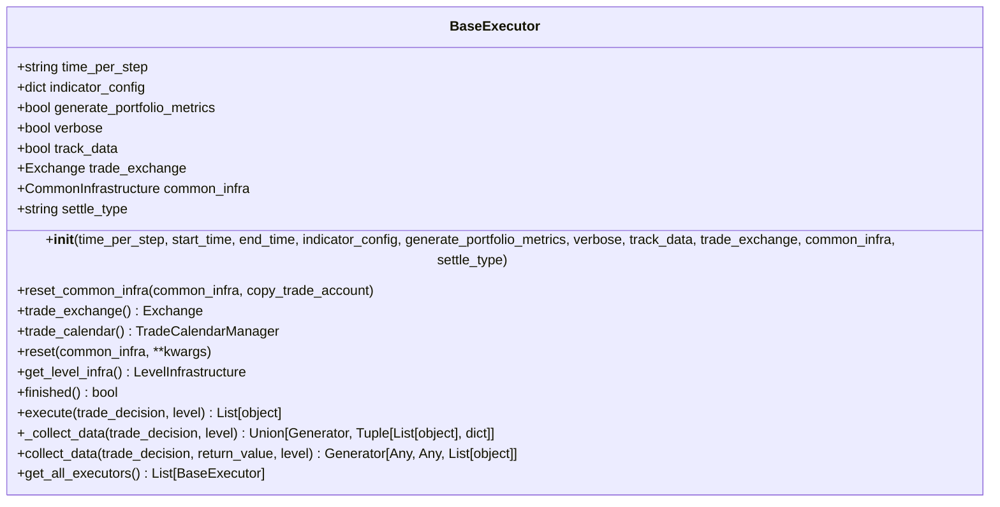
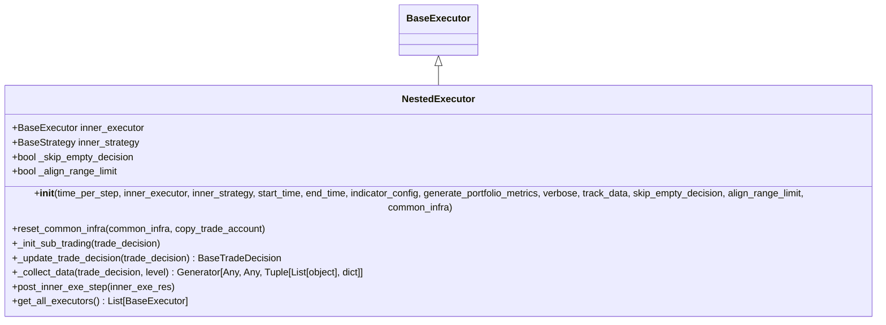
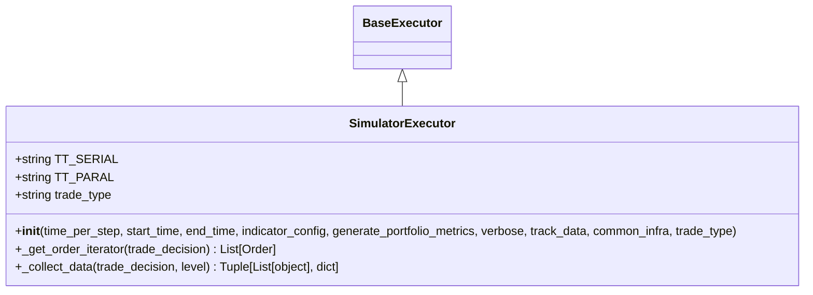
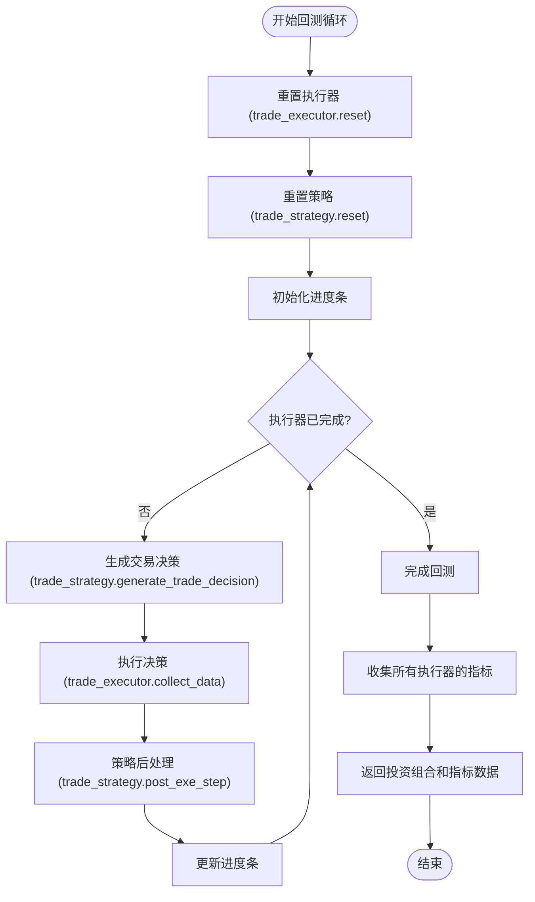
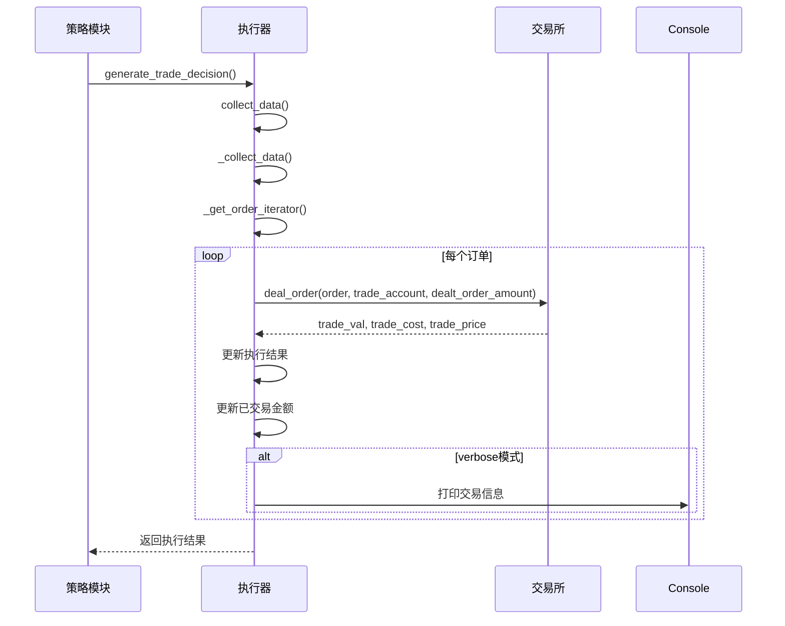
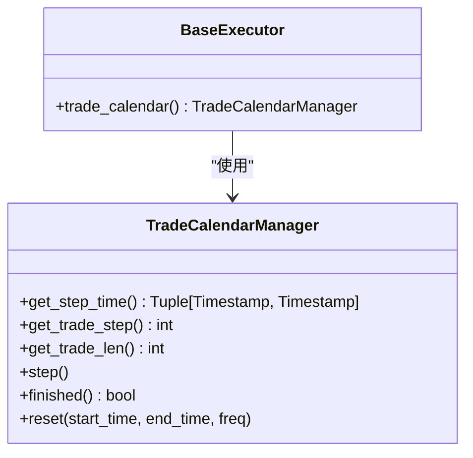
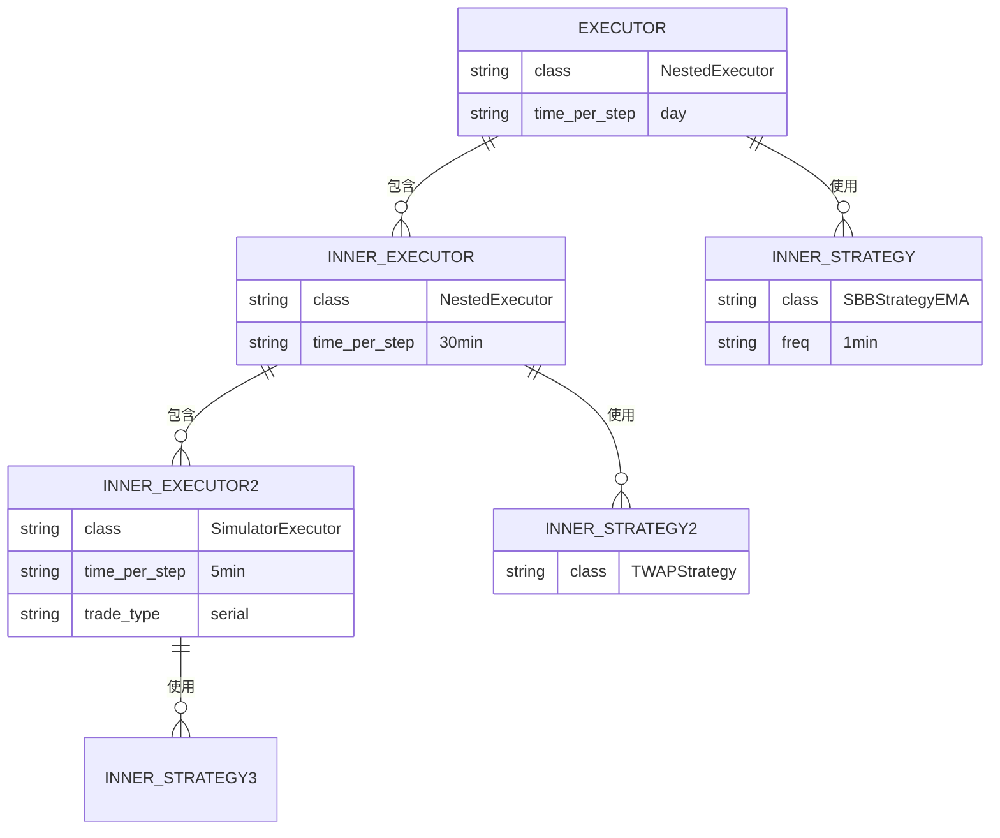
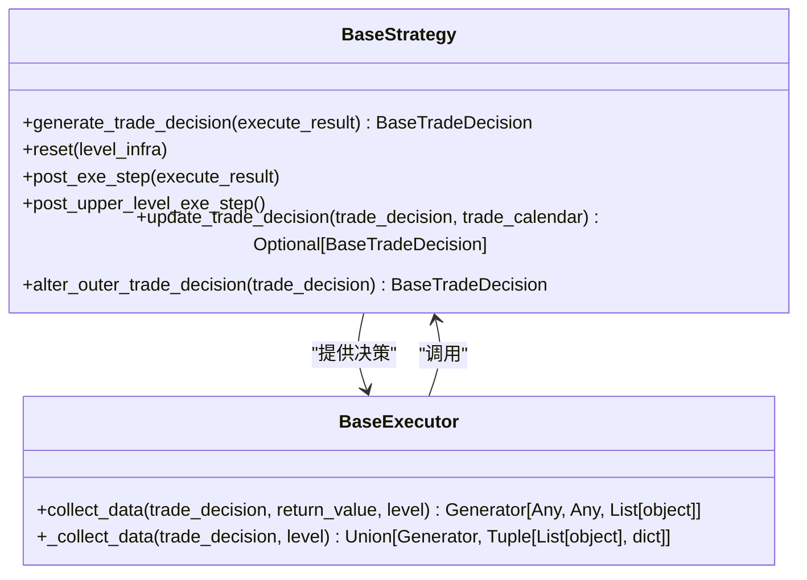
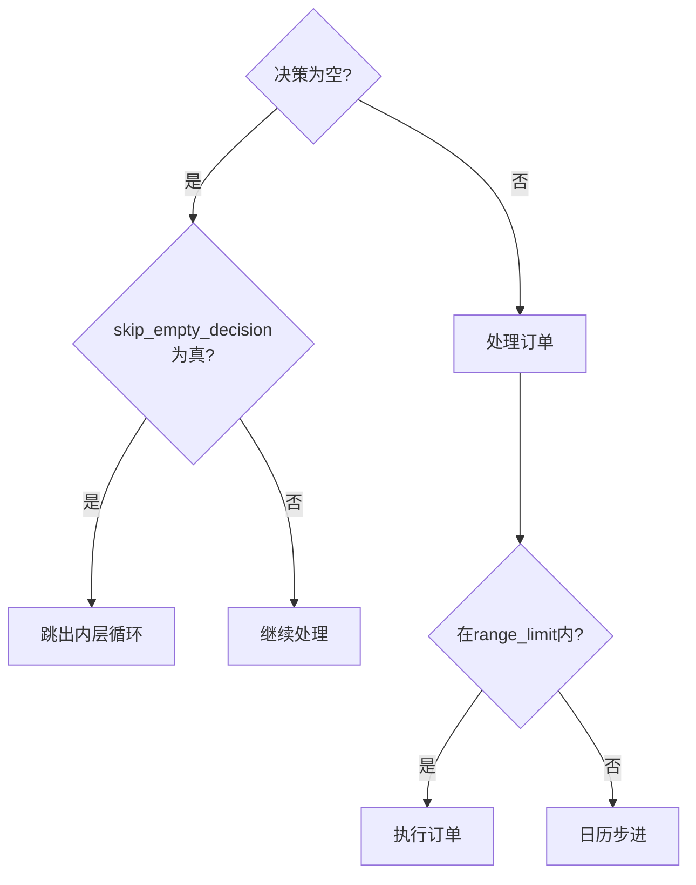

# 交易执行

<cite>
**本文档中引用的文件**  
- [executor.py](file://qlib/backtest/executor.py)
- [backtest.py](file://qlib/backtest/backtest.py)
- [decision.py](file://qlib/backtest/decision.py)
- [workflow.py](file://examples/nested_decision_execution/workflow.py)
</cite>

## 目录
1. [引言](#引言)
2. [核心执行器类分析](#核心执行器类分析)
3. [回测循环机制](#回测循环机制)
4. [订单执行流程](#订单执行流程)
5. [交易日历管理](#交易日历管理)
6. [多层级执行机制](#多层级执行机制)
7. [执行器配置示例](#执行器配置示例)
8. [策略模块交互](#策略模块交互)
9. [常见问题与解决方案](#常见问题与解决方案)
10. [并行与串行交易模式](#并行与串行交易模式)

## 引言
Qlib框架提供了一套完整的交易执行机制，支持从简单到复杂的多种回测场景。该机制的核心是执行器（Executor）系统，它负责将策略生成的交易决策转化为实际的交易行为。本文档深入分析Qlib的交易执行架构，重点介绍BaseExecutor、NestedExecutor和SimulatorExecutor三个核心类的实现细节及其相互关系。

## 核心执行器类分析

### BaseExecutor类
BaseExecutor是所有执行器的基类，定义了执行器的基本接口和通用功能。它负责管理交易日历、账户状态和执行流程控制。



**图示来源**  
- [executor.py](file://qlib/backtest/executor.py#L21-L306)

**本节来源**  
- [executor.py](file://qlib/backtest/executor.py#L21-L306)

### NestedExecutor类
NestedExecutor实现了嵌套执行机制，允许在每个交易周期内进行更高频率的交易决策和执行。它包含一个内部执行器和内部策略，形成多层级的执行架构。



**图示来源**  
- [executor.py](file://qlib/backtest/executor.py#L309-L497)

**本节来源**  
- [executor.py](file://qlib/backtest/executor.py#L309-L497)

### SimulatorExecutor类
SimulatorExecutor模拟真实市场环境下的交易执行，支持串行和并行两种交易模式。它直接与交易所交互，执行具体的买卖订单。



**图示来源**  
- [executor.py](file://qlib/backtest/executor.py#L512-L627)

**本节来源**  
- [executor.py](file://qlib/backtest/executor.py#L512-L627)

## 回测循环机制
collect_data_loop函数是Qlib回测系统的核心协调器，它负责协调策略和执行器之间的交互，驱动整个回测循环的进行。



**图示来源**  
- [backtest.py](file://qlib/backtest/backtest.py#L52-L109)

**本节来源**  
- [backtest.py](file://qlib/backtest/backtest.py#L52-L109)

## 订单执行流程
订单执行流程从策略生成交易决策开始，经过执行器处理，最终在交易所完成实际交易。



**图示来源**  
- [executor.py](file://qlib/backtest/executor.py#L512-L627)
- [decision.py](file://qlib/backtest/decision.py#L36-L150)

**本节来源**  
- [executor.py](file://qlib/backtest/executor.py#L512-L627)
- [decision.py](file://qlib/backtest/decision.py#L36-L150)

## 交易日历管理
交易日历管理通过TradeCalendarManager类实现，负责跟踪当前交易时间、步进到下一个交易周期以及判断回测是否完成。



**本节来源**  
- [executor.py](file://qlib/backtest/executor.py#L150-L160)

## 多层级执行机制
Qlib的多层级执行机制允许构建复杂的嵌套执行架构，支持不同时间频率的混合回测。

```mermaid
graph TD
TopExecutor[日级执行器<br>time_per_step='day'] --> MidExecutor[30分钟级执行器<br>time_per_step='30min']
MidExecutor --> BottomExecutor[5分钟级执行器<br>time_per_step='5min']
TopStrategy[日级策略] --> TopExecutor
MidStrategy[30分钟级策略] --> MidExecutor
BottomStrategy[5分钟级策略] --> BottomExecutor
TopExecutor --> |包含| MidExecutor
MidExecutor --> |包含| BottomExecutor
class TopExecutor,NestedExecutor
class MidExecutor,NestedExecutor
class BottomExecutor,SimulatorExecutor
```

**图示来源**  
- [workflow.py](file://examples/nested_decision_execution/workflow.py#L60-L100)

**本节来源**  
- [workflow.py](file://examples/nested_decision_execution/workflow.py#L60-L100)

## 执行器配置示例
以下示例展示了如何配置不同类型的执行器，包括嵌套执行器和模拟执行器的组合。



**图示来源**  
- [workflow.py](file://examples/nested_decision_execution/workflow.py#L60-L100)

**本节来源**  
- [workflow.py](file://examples/nested_decision_execution/workflow.py#L60-L100)

## 策略模块交互
执行器与策略模块通过标准化的接口进行交互，确保了系统的灵活性和可扩展性。



**本节来源**  
- [executor.py](file://qlib/backtest/executor.py#L309-L497)
- [backtest.py](file://qlib/backtest/backtest.py#L52-L109)

## 常见问题与解决方案

### 空决策处理
当策略生成空决策时，系统提供了灵活的处理机制。



**本节来源**  
- [executor.py](file://qlib/backtest/executor.py#L380-L390)

## 并行与串行交易模式
SimulatorExecutor支持两种交易模式，各有其适用场景和性能特点。

```mermaid
graph TB
subgraph 串行模式
direction LR
SellOrder[卖出订单] --> BuyOrder[买入订单]
BuyOrder --> UpdateAccount["更新账户<br>(使用卖出所得资金)"]
end
subgraph 并行模式
direction LR
SellOrder2[卖出订单] --> |同时| BuyOrder2[买入订单]
BuyOrder2 --> CheckFunds{"资金足够?}
CheckFunds --> |否| Failure["交易失败"]
CheckFunds --> |是| UpdateAccount2["更新账户"]
end
TradeType[交易类型] --> |trade_type='serial'| 串行模式
TradeType --> |trade_type='parallel'| 并行模式
```

**本节来源**  
- [executor.py](file://qlib/backtest/executor.py#L512-L627)