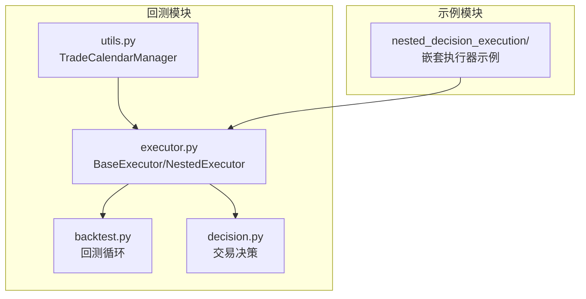
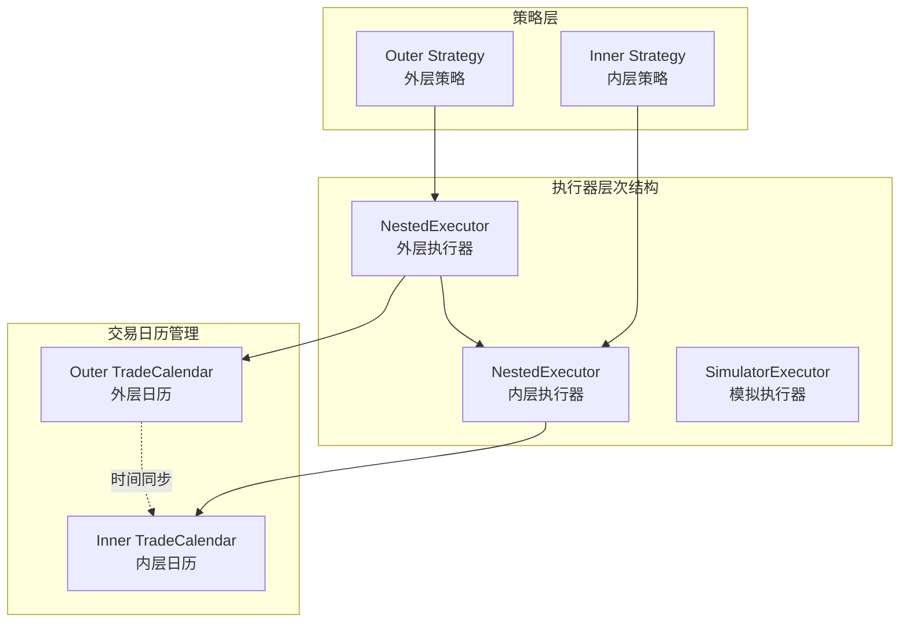
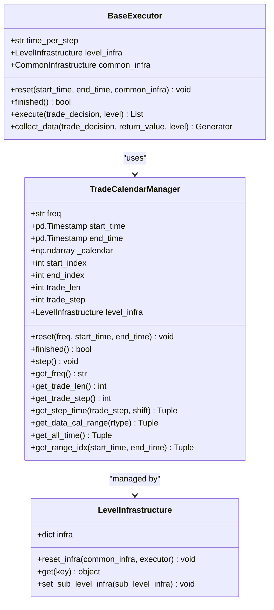
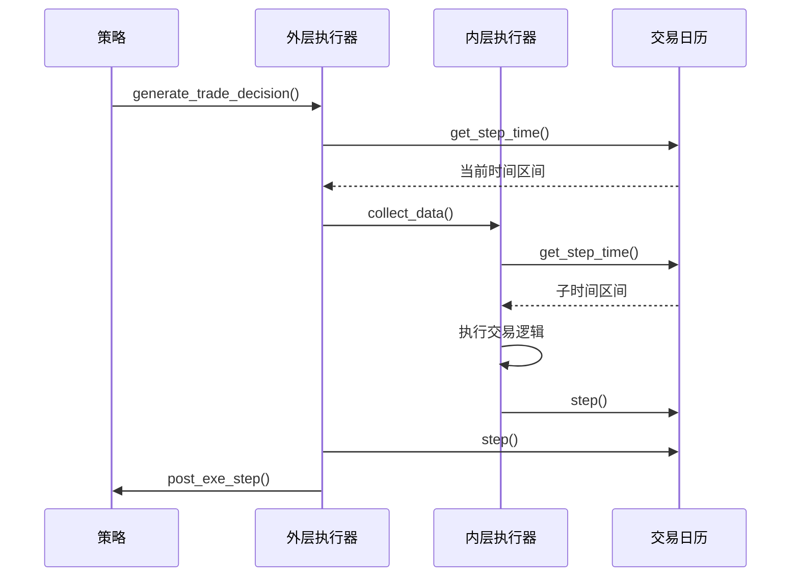
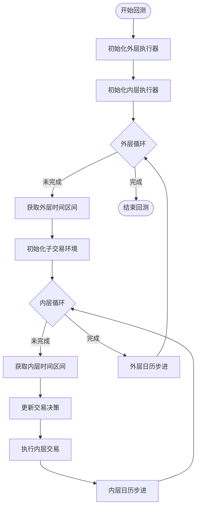
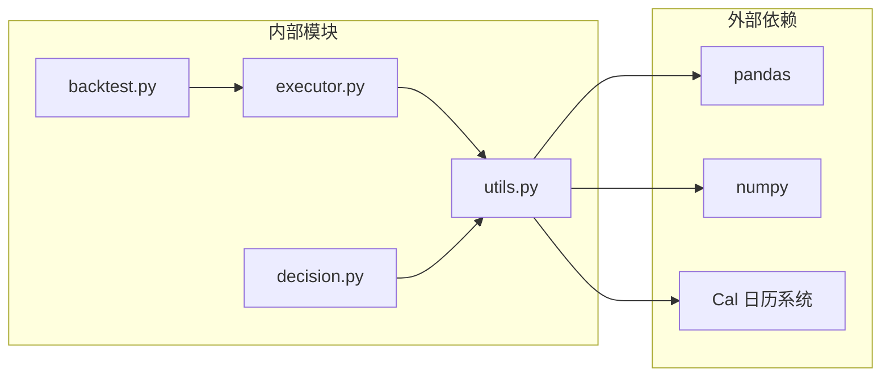

# 交易日历管理

<cite>
**本文档引用的文件**
- [utils.py](file://qlib/backtest/utils.py)
- [executor.py](file://qlib/backtest/executor.py)
- [backtest.py](file://qlib/backtest/backtest.py)
- [decision.py](file://qlib/backtest/decision.py)
- [workflow.py](file://examples/nested_decision_execution/workflow.py)
</cite>

## 目录
1. [简介](#简介)
2. [项目结构](#项目结构)
3. [核心组件](#核心组件)
4. [架构概览](#架构概览)
5. [详细组件分析](#详细组件分析)
6. [依赖关系分析](#依赖关系分析)
7. [性能考虑](#性能考虑)
8. [故障排除指南](#故障排除指南)
9. [结论](#结论)

## 简介

QLib的交易日历管理系统是回测框架的核心组件之一，负责协调不同频率的交易时间表。TradeCalendarManager作为中央调度器，在执行器系统中发挥着关键作用，确保策略和执行器能够在正确的时间步进下协同工作。

该系统的主要职责包括：
- 根据time_per_step参数生成交易时间表
- 提供时间步进控制机制
- 协调嵌套执行器中的内外层交易时间
- 管理回测周期的开始和结束

## 项目结构

QLib的交易日历管理功能主要分布在以下模块中：



**图表来源**
- [utils.py](file://qlib/backtest/utils.py#L22-L200)
- [executor.py](file://qlib/backtest/executor.py#L1-L629)
- [backtest.py](file://qlib/backtest/backtest.py#L1-L111)

## 核心组件

### TradeCalendarManager类

TradeCalendarManager是交易日历管理的核心类，提供完整的交易时间表管理和状态跟踪功能。

**章节来源**
- [utils.py](file://qlib/backtest/utils.py#L22-L200)

## 架构概览

交易日历管理系统采用分层架构设计，通过LevelInfrastructure进行统一管理：



**图表来源**
- [executor.py](file://qlib/backtest/executor.py#L280-L350)
- [workflow.py](file://examples/nested_decision_execution/workflow.py#L130-L180)

## 详细组件分析

### TradeCalendarManager详细分析

TradeCalendarManager类提供了完整的交易时间表管理功能：



**图表来源**
- [utils.py](file://qlib/backtest/utils.py#L22-L200)
- [executor.py](file://qlib/backtest/executor.py#L150-L200)

#### 核心方法详解

**1. 初始化和重置方法**

```python
def reset(self, freq: str, start_time: Union[str, pd.Timestamp] = None, end_time: Union[str, pd.Timestamp] = None) -> None:
    """
    重置交易日历
    - 设置交易总步数：self.trade_len
    - 设置已完成交易步数：self.trade_step
    """
```

**2. 时间步进控制**

```python
def step(self) -> None:
    """向前推进一个交易步"""
    if self.finished():
        raise RuntimeError(f"The calendar is finished, please reset it if you want to call it!")
    self.trade_step += 1

def finished(self) -> bool:
    """检查交易是否完成"""
    return self.trade_step >= self.trade_len
```

**3. 时间范围获取**

```python
def get_step_time(self, trade_step: int | None = None, shift: int = 0) -> Tuple[pd.Timestamp, pd.Timestamp]:
    """
    获取第trade_step个交易区间的左右端点
    支持时间偏移(shift)功能
    """
    if trade_step is None:
        trade_step = self.get_trade_step()
    calendar_index = self.start_index + trade_step - shift
    return self._calendar[calendar_index], epsilon_change(self._calendar[calendar_index + 1])
```

**章节来源**
- [utils.py](file://qlib/backtest/utils.py#L50-L118)

### 执行器中的交易日历集成

在执行器中，交易日历通过LevelInfrastructure进行统一管理：



**图表来源**
- [executor.py](file://qlib/backtest/executor.py#L280-L350)
- [backtest.py](file://qlib/backtest/backtest.py#L80-L110)

**章节来源**
- [executor.py](file://qlib/backtest/executor.py#L150-L200)
- [backtest.py](file://qlib/backtest/backtest.py#L80-L110)

### 嵌套执行器中的双重角色

嵌套执行器展示了交易日历的双重角色：



**图表来源**
- [executor.py](file://qlib/backtest/executor.py#L350-L450)

**章节来源**
- [executor.py](file://qlib/backtest/executor.py#L350-L450)

## 依赖关系分析

交易日历管理系统的依赖关系如下：



**图表来源**
- [utils.py](file://qlib/backtest/utils.py#L1-L20)
- [executor.py](file://qlib/backtest/executor.py#L1-L20)

**章节来源**
- [utils.py](file://qlib/backtest/utils.py#L1-L20)
- [executor.py](file://qlib/backtest/executor.py#L1-L20)

## 性能考虑

交易日历管理系统在设计时考虑了以下性能优化：

1. **时间索引缓存**：使用numpy数组缓存日历数据，避免重复计算
2. **延迟初始化**：仅在需要时才生成交易时间表
3. **内存效率**：通过索引而非完整时间戳存储交易区间
4. **批量操作**：支持批量获取多个时间区间的操作

## 故障排除指南

### 常见问题及解决方案

**1. 交易日历未正确初始化**
```python
# 检查start_time和end_time设置
trade_calendar = TradeCalendarManager(freq="day", start_time="2020-01-01", end_time="2020-12-31")
```

**2. 嵌套执行器时间不匹配**
```python
# 确保内外层执行器的time_per_step配置一致
outer_executor = NestedExecutor(time_per_step="day", ...)
inner_executor = NestedExecutor(time_per_step="30min", ...)  # 必须小于外层
```

**3. 交易日历提前完成**
```python
# 在每次循环后检查完成状态
while not trade_executor.finished():
    # 执行交易逻辑
    trade_executor.trade_calendar.step()
```

**章节来源**
- [utils.py](file://qlib/backtest/utils.py#L50-L84)
- [executor.py](file://qlib/backtest/executor.py#L180-L200)

## 结论

QLib的交易日历管理系统是一个设计精良的组件，它通过TradeCalendarManager类提供了完整的交易时间表管理功能。该系统的核心优势包括：

1. **统一管理**：通过LevelInfrastructure实现跨层级的统一管理
2. **灵活配置**：支持多种时间频率和自定义时间范围
3. **嵌套支持**：完美支持多层级执行器的时间协调
4. **性能优化**：通过缓存和索引提升时间查询效率

该系统为QLib的回测框架提供了坚实的基础，确保了策略和执行器能够在正确的时间步进下协同工作，是整个回测系统不可或缺的核心组件。