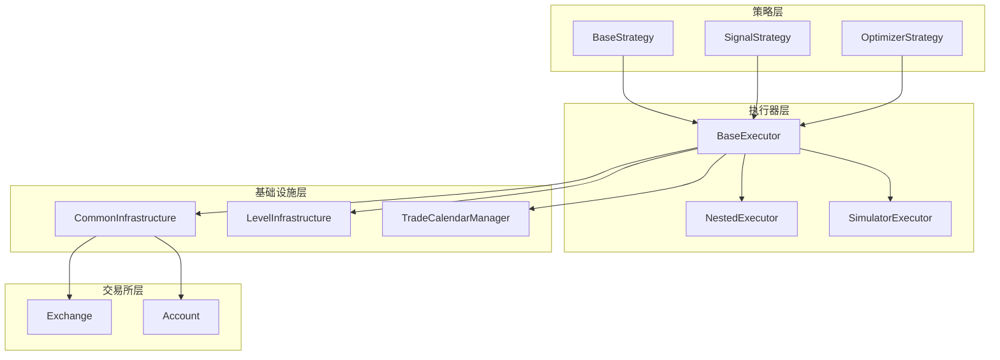
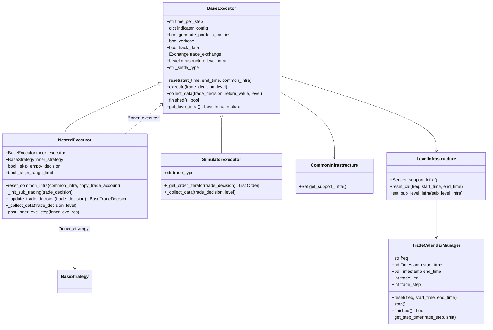
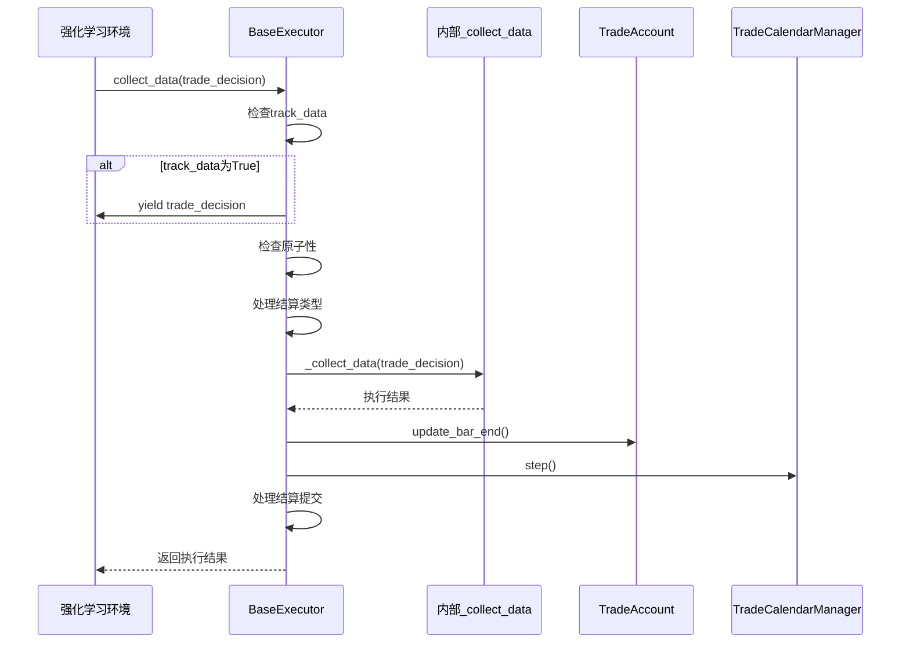
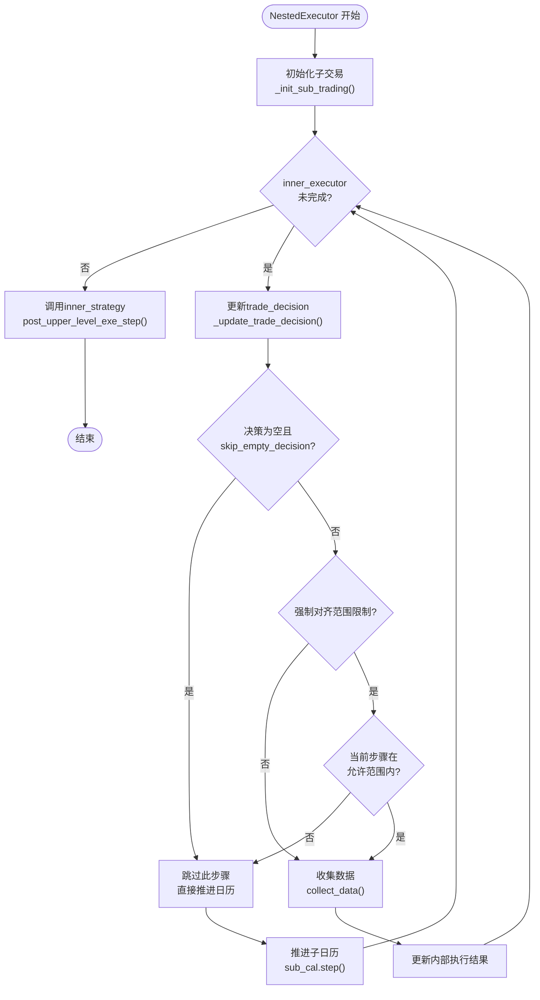
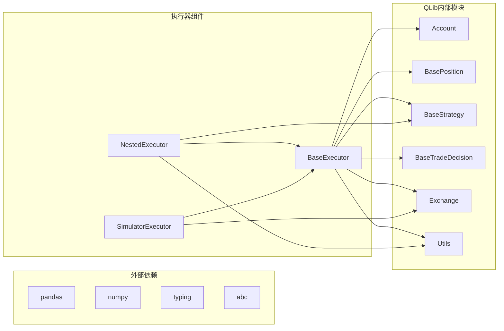

# 基础执行器

<cite>
**本文档引用的文件**
- [executor.py](file://qlib/backtest/executor.py)
- [utils.py](file://qlib/backtest/utils.py)
- [backtest.py](file://qlib/backtest/backtest.py)
- [simulator_qlib.py](file://qlib/rl/order_execution/simulator_qlib.py)
- [workflow_config_linear_Alpha158.yaml](file://examples/benchmarks/Linear/workflow_config_linear_Alpha158.yaml)
</cite>

## 目录
1. [简介](#简介)
2. [项目结构](#项目结构)
3. [核心组件](#核心组件)
4. [架构概览](#架构概览)
5. [详细组件分析](#详细组件分析)
6. [依赖关系分析](#依赖关系分析)
7. [性能考虑](#性能考虑)
8. [故障排除指南](#故障排除指南)
9. [结论](#结论)

## 简介

QLib的基础执行器（BaseExecutor）是量化回测框架的核心组件之一，负责处理交易决策的执行和数据收集。它为强化学习训练提供了关键的数据收集功能，并与CommonInfrastructure、LevelInfrastructure和TradeCalendarManager紧密协作，确保交易流程的正确性和效率。

BaseExecutor类提供了抽象接口，定义了执行器的基本行为规范，包括初始化参数、核心方法（如reset、execute、collect_data）的实现机制，以及在回测流程中的作用。该类支持多种执行模式，包括原子执行器和嵌套执行器，能够满足不同复杂度的交易策略需求。

## 项目结构

QLib的回测系统采用分层架构设计，基础执行器位于核心层，向上连接策略层，向下连接交易所层。整个系统围绕交易决策的生命周期展开，从策略生成决策到执行器执行决策，再到数据收集和报告生成。



**图表来源**
- [executor.py](file://qlib/backtest/executor.py#L25-L120)
- [utils.py](file://qlib/backtest/utils.py#L219-L249)

**章节来源**
- [executor.py](file://qlib/backtest/executor.py#L1-L629)
- [utils.py](file://qlib/backtest/utils.py#L1-L291)

## 核心组件

### BaseExecutor类

BaseExecutor是所有执行器的基础抽象类，定义了执行器的核心接口和通用行为。它包含了以下关键组件：

#### 初始化参数

BaseExecutor的构造函数接受多个关键参数：

- **time_per_step**: 交易时间步长，用于生成交易日历
- **start_time/end_time**: 回测的时间范围
- **indicator_config**: 指标配置，控制价格优势、正向率、履行率等指标的计算
- **generate_portfolio_metrics**: 是否生成投资组合指标
- **verbose**: 是否打印详细的交易信息
- **track_data**: 是否生成交易决策数据，用于强化学习训练
- **trade_exchange**: 提供市场信息的交易所对象
- **common_infra**: 共享的基础设施，包含交易账户和交易所信息
- **settle_type**: 结算类型，影响持仓结算行为

#### 核心方法

BaseExecutor定义了三个核心方法：

1. **reset()**: 重置执行器状态，包括交易日历和基础设施
2. **execute()**: 执行交易决策并返回结果
3. **collect_data()**: 收集交易决策数据，支持生成器模式

**章节来源**
- [executor.py](file://qlib/backtest/executor.py#L25-L120)
- [executor.py](file://qlib/backtest/executor.py#L155-L192)

## 架构概览

基础执行器采用了分层架构设计，通过基础设施层提供共享资源，通过交易日历管理器协调时间序列操作，通过策略层提供决策逻辑。



**图表来源**
- [executor.py](file://qlib/backtest/executor.py#L25-L120)
- [executor.py](file://qlib/backtest/executor.py#L280-L350)
- [executor.py](file://qlib/backtest/executor.py#L470-L550)
- [utils.py](file://qlib/backtest/utils.py#L219-L249)

## 详细组件分析

### BaseExecutor初始化机制

BaseExecutor的初始化过程涉及多个步骤，确保所有必要的组件都正确设置：

```python
def __init__(
    self,
    time_per_step: str,
    start_time: Union[str, pd.Timestamp] = None,
    end_time: Union[str, pd.Timestamp] = None,
    indicator_config: dict = {},
    generate_portfolio_metrics: bool = False,
    verbose: bool = False,
    track_data: bool = False,
    trade_exchange: Exchange | None = None,
    common_infra: CommonInfrastructure | None = None,
    settle_type: str = BasePosition.ST_NO,
    **kwargs: Any,
) -> None:
```

初始化过程的关键步骤：

1. **参数设置**: 设置基本属性如时间步长、指标配置等
2. **基础设施初始化**: 创建LevelInfrastructure并设置通用基础设施
3. **重置状态**: 调用reset方法初始化交易日历和账户
4. **警告处理**: 如果未设置common_infra，记录警告信息

### collect_data作为生成器的工作模式

collect_data方法是BaseExecutor的核心功能之一，它实现了生成器模式，用于强化学习训练中的数据收集：

```python
def collect_data(
    self,
    trade_decision: BaseTradeDecision,
    return_value: dict | None = None,
    level: int = 0,
) -> Generator[Any, Any, List[object]]:
```

工作流程：

1. **数据跟踪**: 如果track_data为True，首先产出trade_decision
2. **原子性检查**: 验证是否为原子执行器，不支持指定range_limit
3. **结算处理**: 根据settle_type进行持仓结算
4. **数据收集**: 调用内部_collect_data方法获取执行结果
5. **账户更新**: 更新交易账户状态，包括指标计算
6. **日历推进**: 推进交易日历到下一步



**图表来源**
- [executor.py](file://qlib/backtest/executor.py#L194-L272)

### 与CommonInfrastructure的交互

CommonInfrastructure提供了执行器所需的共享基础设施：

```python
class CommonInfrastructure(BaseInfrastructure):
    def get_support_infra(self) -> Set[str]:
        return {"trade_account", "trade_exchange"}
```

它管理以下关键组件：
- **trade_account**: 交易账户，存储资金和持仓信息
- **trade_exchange**: 交易所，提供市场数据和交易执行能力

### 与LevelInfrastructure的交互

LevelInfrastructure管理执行器级别的基础设施：

```python
class LevelInfrastructure(BaseInfrastructure):
    def get_support_infra(self) -> Set[str]:
        return {"trade_calendar", "sub_level_infra", "common_infra", "executor"}
```

它提供以下功能：
- **trade_calendar**: 交易日历管理
- **sub_level_infra**: 子层级基础设施
- **common_infra**: 共享基础设施
- **executor**: 当前执行器实例

### 与TradeCalendarManager的交互

TradeCalendarManager负责时间序列的管理和推进：

```python
class TradeCalendarManager:
    def step(self) -> None:
        if self.finished():
            raise RuntimeError(f"The calendar is finished, please reset it if you want to call it!")
        self.trade_step += 1
```

它支持以下操作：
- **时间推进**: 通过step()方法推进到下一个时间点
- **范围查询**: 获取当前时间步的时间范围
- **完成检查**: 通过finished()方法检查是否完成所有交易步骤

**章节来源**
- [executor.py](file://qlib/backtest/executor.py#L194-L272)
- [utils.py](file://qlib/backtest/utils.py#L219-L249)
- [utils.py](file://qlib/backtest/utils.py#L251-L289)

### NestedExecutor的特殊处理

NestedExecutor扩展了BaseExecutor的功能，支持嵌套执行模式：

```python
class NestedExecutor(BaseExecutor):
    def __init__(
        self,
        time_per_step: str,
        inner_executor: Union[BaseExecutor, dict],
        inner_strategy: Union[BaseStrategy, dict],
        start_time: Union[str, pd.Timestamp] = None,
        end_time: Union[str, pd.Timestamp] = None,
        indicator_config: dict = {},
        generate_portfolio_metrics: bool = False,
        verbose: bool = False,
        track_data: bool = False,
        skip_empty_decision: bool = True,
        align_range_limit: bool = True,
        common_infra: CommonInfrastructure | None = None,
        **kwargs: Any,
    ) -> None:
```

NestedExecutor的关键特性：
- **内部执行器**: 包含一个inner_executor用于高频交易
- **内部策略**: 包含一个inner_strategy用于高频策略生成
- **空决策跳过**: 可选跳过空决策的处理
- **范围限制对齐**: 强制对齐决策范围限制



**图表来源**
- [executor.py](file://qlib/backtest/executor.py#L405-L435)

### SimulatorExecutor的交易类型处理

SimulatorExecutor实现了模拟真实市场的功能：

```python
class SimulatorExecutor(BaseExecutor):
    TT_SERIAL = "serial"
    TT_PARAL = "parallel"
    
    def _get_order_iterator(self, trade_decision: BaseTradeDecision) -> List[Order]:
        orders = _retrieve_orders_from_decision(trade_decision)
        
        if self.trade_type == self.TT_SERIAL:
            order_it = orders
        elif self.trade_type == self.TT_PARAL:
            order_it = sorted(orders, key=lambda order: -order.direction)
        else:
            raise NotImplementedError(f"This type of input is not supported")
        return order_it
```

它支持两种交易类型：
- **TT_SERIAL**: 串行执行订单，先卖出后买入
- **TT_PARAL**: 并行执行订单，按方向排序确保资金冲突

**章节来源**
- [executor.py](file://qlib/backtest/executor.py#L280-L350)
- [executor.py](file://qlib/backtest/executor.py#L470-L550)

## 依赖关系分析

基础执行器的依赖关系体现了QLib的模块化设计理念：



**图表来源**
- [executor.py](file://qlib/backtest/executor.py#L1-L20)
- [utils.py](file://qlib/backtest/utils.py#L1-L20)

**章节来源**
- [executor.py](file://qlib/backtest/executor.py#L1-L20)
- [utils.py](file://qlib/backtest/utils.py#L1-L20)

## 性能考虑

基础执行器在设计时充分考虑了性能优化：

### 内存管理
- 使用生成器模式减少内存占用
- 默认不跟踪数据以提高性能
- 智能缓存交易日历信息

### 计算优化
- 延迟加载基础设施组件
- 批量处理订单以提高效率
- 缓存频繁访问的数据

### 并发支持
- 支持多层级执行器嵌套
- 可配置的并发策略
- 灵活的交易频率设置

## 故障排除指南

### 常见问题及解决方案

1. **空决策处理**
   - 问题：执行器遇到空决策时的行为
   - 解决方案：配置skip_empty_decision参数或自定义处理逻辑

2. **交易日历管理**
   - 问题：时间步长不匹配或日历错误
   - 解决方案：检查time_per_step参数和start_time/end_time设置

3. **结算类型配置**
   - 问题：持仓结算异常
   - 解决方案：根据业务需求选择合适的settle_type

4. **数据跟踪配置**
   - 问题：强化学习训练数据不足
   - 解决方案：启用track_data并正确配置指标参数

**章节来源**
- [executor.py](file://qlib/backtest/executor.py#L194-L272)
- [executor.py](file://qlib/backtest/executor.py#L405-L435)

## 结论

QLib的基础执行器是一个设计精良的组件，它通过抽象接口和具体实现分离的设计模式，提供了灵活而强大的交易执行能力。其生成器模式的数据收集功能特别适合强化学习训练场景，而与基础设施层的紧密集成确保了系统的可扩展性和维护性。

通过合理配置track_data、generate_portfolio_metrics等参数，用户可以针对不同的应用场景优化执行器的行为。NestedExecutor和SimulatorExecutor的实现展示了如何在保持核心接口一致性的同时，提供特定场景下的高级功能。

未来的发展方向可能包括更高效的内存管理、更灵活的并发控制，以及更好的监控和调试工具，以进一步提升用户体验和系统性能。