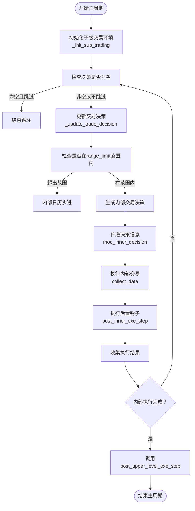

# 嵌套执行器

<cite>
**本文档中引用的文件**  
- [executor.py](file://qlib/backtest/executor.py#L1-L629)
</cite>

## 目录
1. [简介](#简介)
2. [核心组件](#核心组件)
3. [执行流程分析](#执行流程分析)
4. [关键参数说明](#关键参数说明)
5. [多频率交易配置示例](#多频率交易配置示例)
6. [决策信息传递机制](#决策信息传递机制)
7. [钩子函数用途](#钩子函数用途)

## 简介
嵌套执行器（NestedExecutor）是Qlib框架中用于实现多频率交易逻辑的核心组件。它通过组合内部策略（inner_strategy）和内部执行器（inner_executor），在主交易周期内启动子级交易循环，从而支持高频交易与低频策略的协同工作。该机制允许在日级策略中嵌入分钟级执行逻辑，提升交易决策的精细化程度。

## 核心组件

嵌套执行器基于BaseExecutor构建，其核心由两个关键组件构成：内部策略（inner_strategy）和内部执行器（inner_executor）。内部策略负责生成子周期的交易决策，而内部执行器则在每个主交易周期内驱动高频交易流程。这种分层设计实现了策略逻辑与执行逻辑的解耦，便于灵活配置不同时间粒度的交易行为。

**Section sources**
- [executor.py](file://qlib/backtest/executor.py#L300-L350)

## 执行流程分析

嵌套执行器的执行流程主要包括三个核心方法：_init_sub_trading、_update_trade_decision 和 _collect_data。

### 初始化子级交易环境
`_init_sub_trading` 方法在每个主交易周期开始时被调用，用于初始化内部执行器的时间范围。该方法将当前主周期的起止时间作为子周期的交易窗口，并重置内部执行器的状态，确保高频交易在正确的时序范围内运行。

### 动态更新交易决策
`_update_trade_decision` 方法允许外部策略在每次迭代中动态调整交易决策。此过程包括调用 `update` 方法同步时间信息，并通过 `alter_outer_trade_decision` 钩子让内部策略有机会修改外部决策，实现双向信息交互。

### 数据收集与执行循环
`_collect_data` 是嵌套执行器的核心执行逻辑。它在一个循环中驱动内部执行器逐步完成子周期交易，期间会：
- 检查交易决策是否为空并根据 skip_empty_decision 参数决定是否跳过
- 判断当前步骤是否在 range_limit 范围内（受 align_range_limit 控制）
- 由内部策略生成交易决策
- 将决策信息通过 mod_inner_decision 注入到外层决策中
- 执行内部交易并收集结果
- 调用 post_inner_exe_step 钩子进行后续处理



**Diagram sources**
- [executor.py](file://qlib/backtest/executor.py#L350-L450)

**Section sources**
- [executor.py](file://qlib/backtest/executor.py#L350-L450)

## 关键参数说明

### skip_empty_decision 参数
该参数控制当交易决策为空时是否跳过内部执行循环。默认值为 True，适用于大多数静态策略场景。但在以下情况应设为 False：
- 决策可能在执行过程中动态更新
- 内部执行器的行为不完全依赖于外部策略的初始决策
- 需要保证每个周期都进行市场状态探测

### align_range_limit 参数
该参数用于强制对齐交易决策的时间范围限制（range_limit）。当设置为 True 时，嵌套执行器仅在内部日历处于外部决策指定的时间范围内才执行交易，确保高频操作不会超出策略预设的活动窗口。这对于防止在非交易时段误触发订单尤为重要。

**Section sources**
- [executor.py](file://qlib/backtest/executor.py#L310-L320)

## 多频率交易配置示例

以下是一个典型的配置示例，展示如何在日级策略中集成分钟级执行器：

```python
executor = {
    "class": "NestedExecutor",
    "module_path": "qlib.backtest.executor",
    "kwargs": {
        "time_per_step": "1day",
        "inner_executor": {
            "class": "SimulatorExecutor",
            "module_path": "qlib.backtest.executor",
            "kwargs": {
                "time_per_step": "1min"
            }
        },
        "inner_strategy": {
            "class": "SignalStrategy",
            "module_path": "qlib.contrib.strategy.signal_strategy",
            "kwargs": {
                "signal": "$signal"
            }
        },
        "skip_empty_decision": False,
        "align_range_limit": True
    }
}
```

在此配置中，外层执行器以日为单位推进，而内层执行器在每个交易日内以分钟为频率运行，实现“日级策略指导下的分钟级执行”。

**Section sources**
- [executor.py](file://qlib/backtest/executor.py#L300-L350)

## 决策信息传递机制

嵌套执行器通过 `mod_inner_decision` 方法实现层级间的决策信息传递。该机制允许内部策略生成的交易信号、订单信息等被注入到外层决策对象中，形成完整的决策链。这种设计支持复杂的多层决策架构，例如：
- 日级选股策略 → 分钟级择时执行
- 风控模块动态调整子策略参数
- 组合优化结果反馈至执行层

信息传递过程是单向且可追溯的，确保高层策略始终掌握底层执行的详细情况。

**Section sources**
- [executor.py](file://qlib/backtest/executor.py#L420-L430)

## 钩子函数用途

### post_inner_exe_step 钩子
该钩子在每次内部执行步骤完成后被调用，接收内部执行结果作为参数。用户可通过重写此方法实现：
- 执行结果监控与日志记录
- 动态调整内部策略参数
- 触发条件式风控措施
- 更新状态变量用于后续决策

该机制为嵌套执行提供了灵活的扩展能力，无需修改核心执行逻辑即可插入自定义行为。

**Section sources**
- [executor.py](file://qlib/backtest/executor.py#L440-L450)