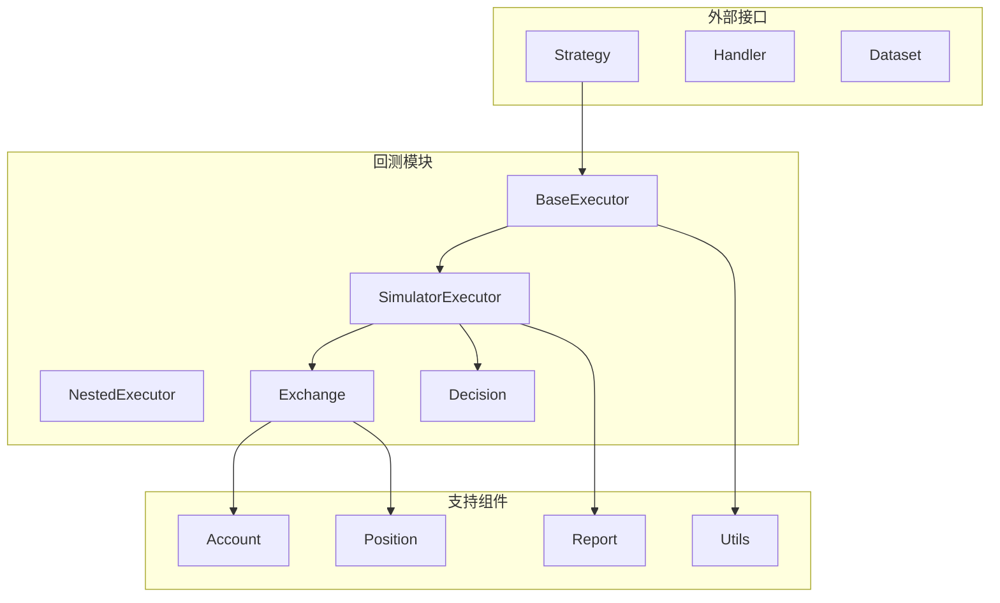
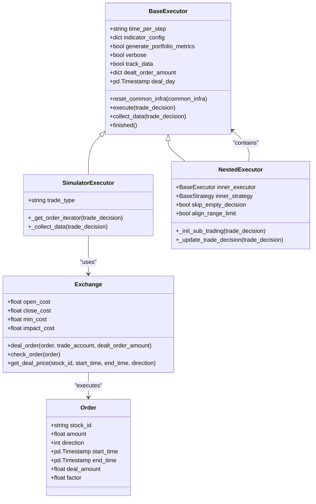
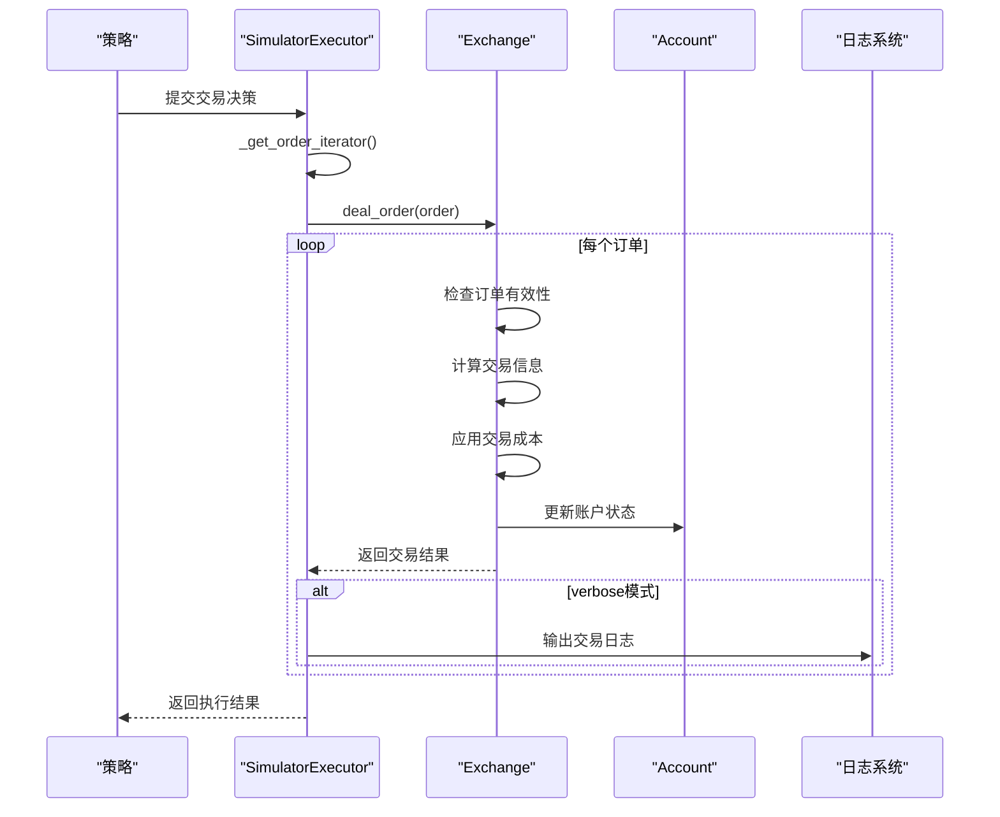
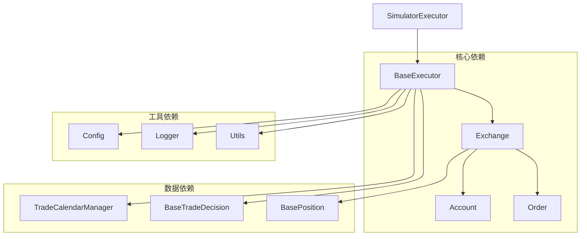

# 模拟执行器

<cite>
**本文档中引用的文件**
- [executor.py](file://qlib/backtest/executor.py)
- [exchange.py](file://qlib/backtest/exchange.py)
- [decision.py](file://qlib/backtest/decision.py)
- [report.py](file://qlib/backtest/report.py)
- [signal.py](file://qlib/backtest/signal.py)
- [position.py](file://qlib/backtest/position.py)
- [account.py](file://qlib/backtest/account.py)
- [utils.py](file://qlib/backtest/utils.py)
</cite>

## 目录
1. [简介](#简介)
2. [项目结构](#项目结构)
3. [核心组件](#核心组件)
4. [架构概览](#架构概览)
5. [详细组件分析](#详细组件分析)
6. [依赖关系分析](#依赖关系分析)
7. [性能考虑](#性能考虑)
8. [故障排除指南](#故障排除指南)
9. [结论](#结论)

## 简介

Qlib模拟执行器（SimulatorExecutor）是一个强大的交易模拟系统，专门设计用于在回测环境中模拟真实的市场交易行为。该执行器通过`_exchange.deal_order`方法精确地模拟市场交易过程，支持两种主要的交易模式：串行（TT_SERIAL）和并行（TT_PARAL），为量化策略研究提供了高度准确的交易环境。

模拟执行器的核心功能包括：
- 基于真实市场价格的订单执行
- 交易成本和滑点计算
- 资金和持仓管理
- 多种交易模式支持
- 详细的交易指标计算
- 可配置的日志记录系统

## 项目结构

模拟执行器位于Qlib项目的回测模块中，与其他核心组件紧密集成：



**图表来源**
- [executor.py](file://qlib/backtest/executor.py#L1-L629)
- [exchange.py](file://qlib/backtest/exchange.py#L1-L959)

**章节来源**
- [executor.py](file://qlib/backtest/executor.py#L1-L100)
- [exchange.py](file://qlib/backtest/exchange.py#L1-L100)

## 核心组件

### SimulatorExecutor类

SimulatorExecutor是整个模拟执行器的核心类，继承自BaseExecutor，专门负责模拟真实市场的交易行为。

```python
class SimulatorExecutor(BaseExecutor):
    """Executor that simulate the true market"""
    
    # 可用的交易类型
    TT_SERIAL = "serial"
    TT_PARAL = "parallel"
```

### 交易类型对比

| 特性 | 串行模式 (TT_SERIAL) | 并行模式 (TT_PARAL) |
|------|---------------------|--------------------|
| 执行顺序 | 按照原始顺序执行 | 按方向排序后执行 |
| 资金使用 | 允许先卖后买 | 严格限制资金冲突 |
| 性能 | 较慢但更准确 | 较快但可能有冲突 |
| 冲突处理 | 自动处理 | 需要用户确保无冲突 |

### 订单迭代器方法

_get_order_iterator方法根据交易类型对订单进行排序：

```python
def _get_order_iterator(self, trade_decision: BaseTradeDecision) -> List[Order]:
    orders = _retrieve_orders_from_decision(trade_decision)
    
    if self.trade_type == self.TT_SERIAL:
        # 串行模式：保持原始顺序
        order_it = orders
    elif self.trade_type == self.TT_PARAL:
        # 并行模式：按方向排序，买入优先
        order_it = sorted(orders, key=lambda order: -order.direction)
    else:
        raise NotImplementedError(f"This type of input is not supported")
    return order_it
```

**章节来源**
- [executor.py](file://qlib/backtest/executor.py#L527-L629)

## 架构概览

模拟执行器采用分层架构设计，确保了系统的可扩展性和维护性：



**图表来源**
- [executor.py](file://qlib/backtest/executor.py#L25-L629)
- [exchange.py](file://qlib/backtest/exchange.py#L30-L959)

## 详细组件分析

### 订单执行流程

模拟执行器的订单执行过程包含多个关键步骤：



**图表来源**
- [executor.py](file://qlib/backtest/executor.py#L575-L629)
- [exchange.py](file://qlib/backtest/exchange.py#L400-L500)

### 交易成本计算

Exchange类中的_deal_order方法实现了精确的交易成本计算：

```python
def deal_order(
    self,
    order: Order,
    trade_account: Account | None = None,
    position: BasePosition | None = None,
    dealt_order_amount: Dict[str, float] = defaultdict(float),
) -> Tuple[float, float, float]:
    """
    处理订单时的实际交易
    :param order: 要处理的订单
    :param trade_account: 交易账户，在处理订单后更新
    :param position: 仓位，在处理订单后更新
    :param dealt_order_amount: 格式为{stock_id: float}的已成交订单金额字典
    :return: trade_val, trade_cost, trade_price
    """
    # 检查订单有效性
    if not self.check_order(order):
        order.deal_amount = 0.0
        return 0.0, 0.0, np.nan
    
    # 计算交易信息
    trade_price, trade_val, trade_cost = self._calc_trade_info_by_order(
        order,
        trade_account.current_position if trade_account else position,
        dealt_order_amount,
    )
    
    # 更新账户或仓位
    if trade_val > 1e-5:
        if trade_account:
            trade_account.update_order(order=order, trade_val=trade_val, cost=trade_cost, trade_price=trade_price)
        elif position:
            position.update_order(order=order, trade_val=trade_val, cost=trade_cost, trade_price=trade_price)
    
    return trade_val, trade_cost, trade_price
```

### 成交价格计算

成交价格的计算考虑了多种因素：

```python
def _calc_trade_info_by_order(
    self,
    order: Order,
    position: Optional[BasePosition],
    dealt_order_amount: dict,
) -> Tuple[float, float, float]:
    # 获取成交价格
    trade_price = cast(
        float,
        self.get_deal_price(order.stock_id, order.start_time, order.end_time, direction=order.direction),
    )
    
    # 计算总交易价值
    total_trade_val = cast(float, self.get_volume(order.stock_id, order.start_time, order.end_time)) * trade_price
    
    # 应用成交量限制
    self._clip_amount_by_volume(order, dealt_order_amount)
    
    # 计算调整后的成本比率
    if not total_trade_val or np.isnan(total_trade_val):
        adj_cost_ratio = self.impact_cost
    else:
        adj_cost_ratio = self.impact_cost * (trade_val / total_trade_val) ** 2
    
    # 根据买卖方向应用不同的逻辑
    if order.direction == Order.SELL:
        cost_ratio = self.close_cost + adj_cost_ratio
        # 卖出逻辑...
    elif order.direction == Order.BUY:
        cost_ratio = self.open_cost + adj_cost_ratio
        # 买入逻辑...
    
    # 计算最终交易成本
    trade_cost = max(trade_val * cost_ratio, self.min_cost)
    return trade_price, trade_val, trade_cost
```

### 日志输出格式

当启用verbose模式时，模拟执行器会输出详细的交易日志：

```python
if self.verbose:
    print(
        "[I {:%Y-%m-%d %H:%M:%S}]: {} {}, price {:.2f}, amount {}, deal_amount {}, factor {}, "
        "value {:.2f}, cash {:.2f}.".format(
            trade_start_time,
            "sell" if order.direction == Order.SELL else "buy",
            order.stock_id,
            trade_price,
            order.amount,
            order.deal_amount,
            order.factor,
            trade_val,
            self.trade_account.get_cash(),
        ),
    )
```

日志格式说明：
- `[I YYYY-MM-DD HH:MM:SS]`: 时间戳
- `sell/buy`: 交易方向
- `stock_id`: 股票代码
- `price`: 成交价格
- `amount`: 订单数量
- `deal_amount`: 实际成交数量
- `factor`: 价格因子
- `value`: 交易价值
- `cash`: 当前现金余额

**章节来源**
- [executor.py](file://qlib/backtest/executor.py#L575-L629)
- [exchange.py](file://qlib/backtest/exchange.py#L400-L600)

### dealed_order_amount字典机制

dealed_order_amount字典用于跟踪每日的订单成交情况：

```python
def _collect_data(self, trade_decision: BaseTradeDecision, level: int = 0) -> Tuple[List[object], dict]:
    trade_start_time, _ = self.trade_calendar.get_step_time()
    execute_result: list = []

    for order in self._get_order_iterator(trade_decision):
        # 每次进入新日期时，清空dealt_order_amount，因为它只维护日内信息
        now_deal_day = self.trade_calendar.get_step_time()[0].floor(freq="D")
        if self.deal_day is None or now_deal_day > self.deal_day:
            self.dealt_order_amount = defaultdict(float)
            self.deal_day = now_deal_day
        
        # 执行订单
        trade_val, trade_cost, trade_price = self.trade_exchange.deal_order(
            order,
            trade_account=self.trade_account,
            dealt_order_amount=self.dealt_order_amount,
        )
        
        # 更新已成交金额
        self.dealt_order_amount[order.stock_id] += order.deal_amount
        
        execute_result.append((order, trade_val, trade_cost, trade_price))
```

这种机制确保了：
1. 每个交易日开始时重置成交统计
2. 防止跨日的资金和成交量累积
3. 支持基于成交量的交易限制

**章节来源**
- [executor.py](file://qlib/backtest/executor.py#L590-L629)

## 依赖关系分析

模拟执行器的依赖关系体现了清晰的分层架构：



**图表来源**
- [executor.py](file://qlib/backtest/executor.py#L1-L25)
- [exchange.py](file://qlib/backtest/exchange.py#L1-L30)

**章节来源**
- [executor.py](file://qlib/backtest/executor.py#L1-L25)
- [exchange.py](file://qlib/backtest/exchange.py#L1-L30)

## 性能考虑

### 交易模式性能对比

1. **串行模式 (TT_SERIAL)**:
   - 优点：完全避免资金冲突，准确性高
   - 缺点：执行速度较慢，不适合高频交易场景
   - 适用场景：需要精确资金管理的策略

2. **并行模式 (TT_PARAL)**:
   - 优点：执行速度快，适合大规模回测
   - 缺点：可能存在资金冲突问题
   - 适用场景：对精度要求不高的快速回测

### 优化建议

1. **批量处理**: 对于大量订单，可以考虑批量处理以提高效率
2. **缓存机制**: 缓存频繁访问的数据如价格、成交量等
3. **内存管理**: 定期清理不再需要的历史数据
4. **并行计算**: 在支持的情况下使用多线程或多进程

## 故障排除指南

### 常见问题及解决方案

1. **订单被拒绝**
   - 检查股票是否停牌或达到涨跌停限制
   - 验证订单金额是否超过可用资金
   - 确认交易单位设置是否正确

2. **资金不足错误**
   - 检查最小手续费设置
   - 验证买入金额是否超过可用现金
   - 确认卖出数量是否超过持仓

3. **成交量限制问题**
   - 检查volume_threshold配置
   - 验证累计成交量是否超出限制
   - 确认当日已成交金额是否正确累加

4. **日志输出问题**
   - 启用verbose模式查看详细信息
   - 检查日志级别设置
   - 验证时间格式配置

**章节来源**
- [exchange.py](file://qlib/backtest/exchange.py#L400-L500)

## 结论

Qlib模拟执行器是一个功能强大且设计精良的交易模拟系统。它通过精确的订单执行、灵活的交易模式选择和详细的日志记录，为量化策略研究提供了可靠的基础设施。

### 主要优势

1. **准确性**: 基于真实市场价格和交易规则的精确模拟
2. **灵活性**: 支持多种交易模式和配置选项
3. **可扩展性**: 清晰的架构设计便于功能扩展
4. **可靠性**: 完善的错误处理和日志记录机制

### 使用建议

1. **选择合适的交易模式**: 根据策略特点选择串行或并行模式
2. **合理配置参数**: 根据市场特征调整交易成本和限制参数
3. **启用详细日志**: 在调试阶段启用verbose模式获取更多信息
4. **监控性能指标**: 定期检查交易指标以评估策略表现

模拟执行器的设计充分体现了现代量化交易平台的需求，既保证了模拟的真实性，又提供了良好的用户体验和扩展能力。