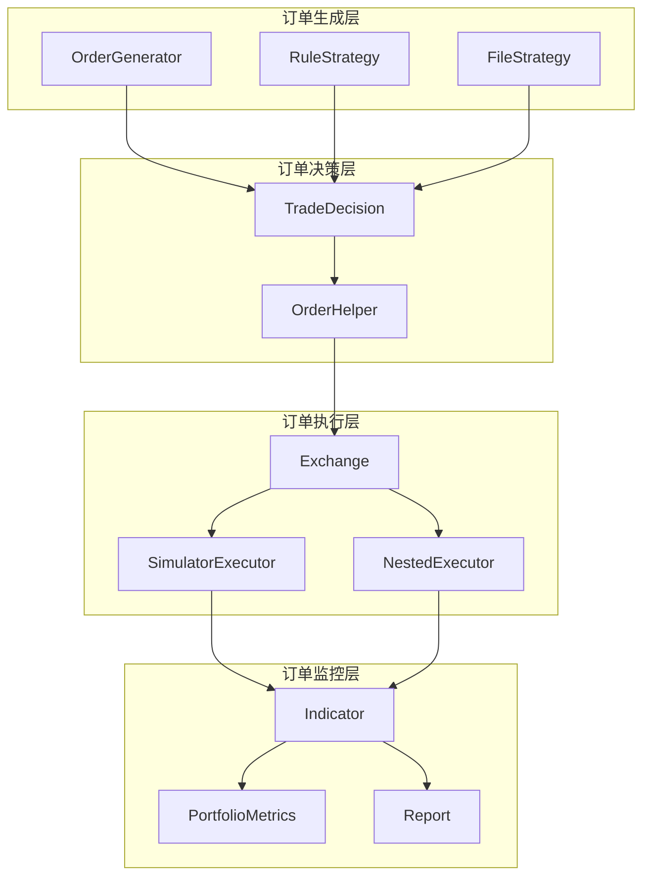
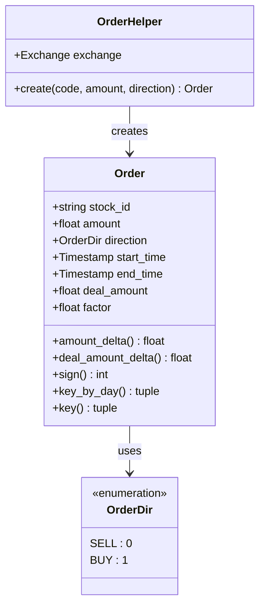
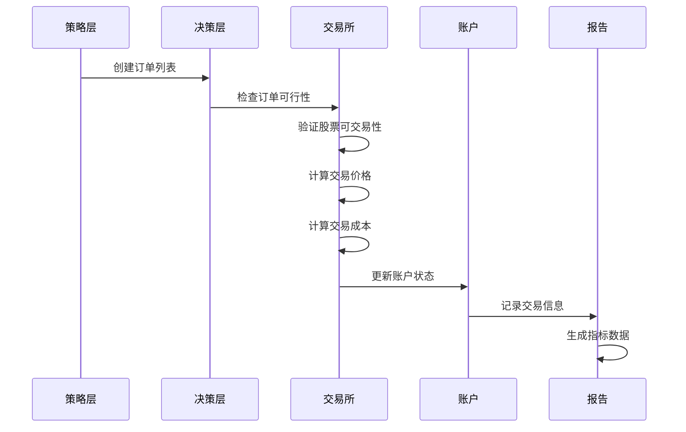
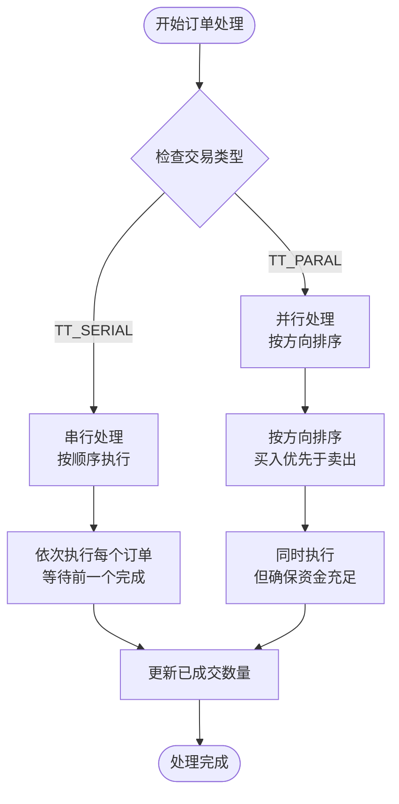

# QLib订单处理机制详细文档

<cite>
**本文档中引用的文件**
- [exchange.py](file://qlib/backtest/exchange.py)
- [decision.py](file://qlib/backtest/decision.py)
- [executor.py](file://qlib/backtest/executor.py)
- [order_generator.py](file://qlib/contrib/strategy/order_generator.py)
- [rule_strategy.py](file://qlib/contrib/strategy/rule_strategy.py)
- [report.py](file://qlib/backtest/report.py)
</cite>

## 目录
1. [简介](#简介)
2. [项目结构概览](#项目结构概览)
3. [核心组件分析](#核心组件分析)
4. [订单生命周期详解](#订单生命周期详解)
5. [交易执行机制](#交易执行机制)
6. [订单迭代器处理](#订单迭代器处理)
7. [交易成本计算](#交易成本计算)
8. [订单信息记录](#订单信息记录)
9. [性能优化考虑](#性能优化考虑)
10. [故障排除指南](#故障排除指南)
11. [总结](#总结)

## 简介

QLib是一个面向量化投资研究的Python库，其订单处理机制是整个回测系统的核心组成部分。本文档深入解析QLib的订单处理架构，包括Order类的设计、交易执行流程、订单迭代器处理以及完整的订单生命周期管理。

订单处理机制主要涉及以下几个关键方面：
- **订单结构设计**：包括amount、deal_amount、factor等字段的含义和用途
- **交易执行**：deal_order方法如何与交易所交互完成订单撮合
- **订单迭代**：_order_iterator如何根据交易模式处理订单序列
- **成本控制**：交易成本的计算和扣除机制
- **信息追踪**：dealt_order_amount字典如何跟踪日内交易量

## 项目结构概览

QLib的订单处理机制分布在多个模块中，形成了一个完整的处理链路：



**图表来源**
- [exchange.py](file://qlib/backtest/exchange.py#L1-L50)
- [decision.py](file://qlib/backtest/decision.py#L1-L50)
- [executor.py](file://qlib/backtest/executor.py#L1-L50)

## 核心组件分析

### Order类设计

Order类是订单处理的核心数据结构，包含了订单的所有必要信息：

```python
@dataclass
class Order:
    stock_id: str                    # 股票代码
    amount: float                   # 订单数量（已调整）
    direction: OrderDir             # 交易方向（买入/卖出）
    start_time: pd.Timestamp        # 订单开始时间
    end_time: pd.Timestamp          # 订单结束时间
    deal_amount: float = 0.0        # 实际成交数量
    factor: Optional[float] = None  # 调整因子
```

**字段含义详解**：

- **amount**：订单的原始数量，经过市场调整后的值
- **deal_amount**：实际成交的数量，初始为0，在交易过程中更新
- **factor**：股票的调整因子，用于处理除权除息等情况
- **start_time/end_time**：订单的时间范围，定义了交易的有效时间段



**图表来源**
- [decision.py](file://qlib/backtest/decision.py#L30-L86)

### Exchange类核心功能

Exchange类负责与市场进行交互，执行订单并计算交易成本：

```python
class Exchange:
    def deal_order(self, order: Order, trade_account: Account = None, 
                   position: BasePosition = None, 
                   dealt_order_amount: Dict[str, float] = defaultdict(float)) -> Tuple[float, float, float]:
        """
        处理订单并返回交易价值、交易成本和交易价格
        """
        # 检查订单是否可执行
        if not self.check_order(order):
            order.deal_amount = 0.0
            return 0.0, 0.0, np.nan
            
        # 计算交易信息
        trade_price, trade_val, trade_cost = self._calc_trade_info_by_order(
            order, trade_account.current_position if trade_account else position, 
            dealt_order_amount
        )
        
        # 更新账户或持仓
        if trade_val > 1e-5:
            if trade_account:
                trade_account.update_order(order=order, trade_val=trade_val, 
                                         cost=trade_cost, trade_price=trade_price)
            elif position:
                position.update_order(order=order, trade_val=trade_val, 
                                     cost=trade_cost, trade_price=trade_price)
        
        return trade_val, trade_cost, trade_price
```

**章节来源**
- [exchange.py](file://qlib/backtest/exchange.py#L420-L480)

## 订单生命周期详解

订单从生成到执行的完整生命周期包括以下阶段：



**图表来源**
- [exchange.py](file://qlib/backtest/exchange.py#L420-L480)
- [executor.py](file://qlib/backtest/executor.py#L575-L628)

### 订单生成阶段

订单生成通常由策略类完成，例如：

```python
class TWAPStrategy(BaseStrategy):
    def generate_trade_decision(self, execute_result=None):
        # 获取当前交易步骤和总步骤数
        trade_step = self.trade_calendar.get_trade_step()
        trade_len = self.trade_calendar.get_trade_len()
        
        # 计算预期交易金额
        amount_expect = order.amount / trade_len * (rel_trade_step + 1)
        
        # 计算剩余金额
        amount_remain = self.trade_amount_remain[order.stock_id]
        
        # 计算当前步骤的交易金额
        amount_delta = amount_expect - amount_finished
        
        # 生成订单
        _order = Order(
            stock_id=order.stock_id,
            amount=amount_delta_target,
            start_time=trade_start_time,
            end_time=trade_end_time,
            direction=order.direction,
        )
        
        return TradeDecisionWO(order_list=[_order], strategy=self)
```

**章节来源**
- [rule_strategy.py](file://qlib/contrib/strategy/rule_strategy.py#L30-L120)

### 订单验证阶段

Exchange类提供订单验证功能：

```python
def check_order(self, order: Order) -> bool:
    """检查订单是否可执行"""
    return self.is_stock_tradable(
        order.stock_id, 
        order.start_time, 
        order.end_time, 
        order.direction
    )

def is_stock_tradable(self, stock_id: str, start_time: pd.Timestamp, 
                     end_time: pd.Timestamp, direction: int = None) -> bool:
    """检查股票是否可交易"""
    return not (
        self.check_stock_suspended(stock_id, start_time, end_time)
        or self.check_stock_limit(stock_id, start_time, end_time, direction)
    )
```

**章节来源**
- [exchange.py](file://qlib/backtest/exchange.py#L350-L380)

## 交易执行机制

### deal_order方法详解

deal_order方法是订单执行的核心函数，它完成了从订单验证到最终执行的全过程：

```python
def deal_order(self, order: Order, trade_account: Account = None, 
               position: BasePosition = None, 
               dealt_order_amount: Dict[str, float] = defaultdict(float)) -> Tuple[float, float, float]:
    """
    处理订单并返回交易价值、交易成本和交易价格
    
    参数:
    - order: 待处理的订单
    - trade_account: 交易账户（二选一）
    - position: 持仓信息（二选一）
    - dealt_order_amount: 已成交订单数量字典
    
    返回:
    - trade_val: 交易价值
    - trade_cost: 交易成本
    - trade_price: 交易价格
    """
    # 1. 验证订单
    if not self.check_order(order):
        order.deal_amount = 0.0
        return 0.0, 0.0, np.nan
    
    # 2. 计算交易信息
    trade_price, trade_val, trade_cost = self._calc_trade_info_by_order(
        order, trade_account.current_position if trade_account else position, 
        dealt_order_amount
    )
    
    # 3. 更新账户或持仓
    if trade_val > 1e-5:
        if trade_account:
            trade_account.update_order(order=order, trade_val=trade_val, 
                                     cost=trade_cost, trade_price=trade_price)
        elif position:
            position.update_order(order=order, trade_val=trade_val, 
                                 cost=trade_cost, trade_price=trade_price)
    
    return trade_val, trade_cost, trade_price
```

### 价格确定机制

交易价格的确定遵循以下优先级：

```python
def get_deal_price(self, stock_id: str, start_time: pd.Timestamp, 
                  end_time: pd.Timestamp, direction: OrderDir, 
                  method: str = "ts_data_last") -> Union[None, int, float, bool, IndexData]:
    """获取交易价格"""
    if direction == OrderDir.SELL:
        pstr = self.sell_price  # 卖出价格
    elif direction == OrderDir.BUY:
        pstr = self.buy_price   # 买入价格
    else:
        raise NotImplementedError(f"不支持的输入类型")
    
    # 获取价格数据
    deal_price = self.quote.get_data(stock_id, start_time, end_time, field=pstr, method=method)
    
    # 如果价格无效，使用收盘价作为备选
    if method is not None and (deal_price is None or np.isnan(deal_price) or deal_price <= 1e-08):
        self.logger.warning(f"设置交易价格为收盘价")
        deal_price = self.get_close(stock_id, start_time, end_time, method)
    
    return deal_price
```

**章节来源**
- [exchange.py](file://qlib/backtest/exchange.py#L420-L480)
- [exchange.py](file://qlib/backtest/exchange.py#L700-L730)

## 订单迭代器处理

### _order_iterator的工作原理

_order_iterator根据不同的交易类型（TT_SERIAL或TT_PARAL）采用不同的处理策略：

```python
def _get_order_iterator(self, trade_decision: BaseTradeDecision) -> List[Order]:
    """
    根据交易类型获取订单迭代器
    
    参数:
    - trade_decision: 交易决策
    
    返回:
    - 订单列表
    """
    orders = _retrieve_orders_from_decision(trade_decision)
    
    if self.trade_type == self.TT_SERIAL:
        # 串行交易：按顺序执行订单
        order_it = orders
    elif self.trade_type == self.TT_PARAL:
        # 并行交易：按方向排序，确保资金冲突不会发生
        # 将买入放在卖出之前，避免资金不足的情况
        order_it = sorted(orders, key=lambda order: -order.direction)
    else:
        raise NotImplementedError(f"不支持的交易类型")
    
    return order_it
```

### 交易模式对比



**图表来源**
- [executor.py](file://qlib/backtest/executor.py#L575-L599)

**章节来源**
- [executor.py](file://qlib/backtest/executor.py#L575-L599)

## 交易成本计算

### 成本计算公式

交易成本的计算遵循以下公式：

```python
def _calc_trade_info_by_order(self, order: Order, position: BasePosition = None,
                             dealt_order_amount: dict) -> Tuple[float, float, float]:
    """
    计算交易信息
    
    参数:
    - order: 订单对象
    - position: 当前持仓
    - dealt_order_amount: 已成交订单数量
    
    返回:
    - trade_price: 交易价格
    - trade_val: 交易价值
    - trade_cost: 交易成本
    """
    # 1. 获取交易价格
    trade_price = self.get_deal_price(order.stock_id, order.start_time, order.end_time, 
                                     direction=order.direction)
    
    # 2. 计算总交易价值
    total_trade_val = self.get_volume(order.stock_id, order.start_time, order.end_time) * trade_price
    
    # 3. 设置调整因子
    order.factor = self.get_factor(order.stock_id, order.start_time, order.end_time)
    order.deal_amount = order.amount  # 设置为全额并逐步裁剪
    
    # 4. 裁剪数量（考虑交易量限制）
    self._clip_amount_by_volume(order, dealt_order_amount)
    
    # 5. 计算交易成本
    trade_val = order.deal_amount * trade_price
    trade_cost = max(trade_val * cost_ratio, self.min_cost)
    
    return trade_price, trade_val, trade_cost
```

### 成本结构分析

交易成本包含以下几个部分：

1. **佣金成本**：按照交易价值的百分比计算
2. **印花税**：仅在卖出时收取
3. **过户费**：按股数计算
4. **最小成本保护**：确保最低收费

```python
# 成本计算示例
trade_val = order.deal_amount * trade_price
trade_cost = max(trade_val * cost_ratio, self.min_cost)
```

**章节来源**
- [exchange.py](file://qlib/backtest/exchange.py#L858-L883)
- [exchange.py](file://qlib/backtest/exchange.py#L943-L957)

## 订单信息记录

### dealed_order_amount字典的作用

dealt_order_amount字典用于跟踪每日的交易量，防止过度交易：

```python
class SimulatorExecutor(BaseExecutor):
    def __init__(self, time_per_step: str, trade_type: str = TT_SERIAL, **kwargs):
        super().__init__(time_per_step, **kwargs)
        # 记录每日交易订单数量
        self.dealt_order_amount: Dict[str, float] = defaultdict(float)
        self.deal_day = None
    
    def _collect_data(self, trade_decision: BaseTradeDecision, level: int = 0) -> Tuple[List[object], dict]:
        execute_result: list = []
        
        for order in self._get_order_iterator(trade_decision):
            # 每进入新日期时清空dealt_order_amount，因为它只维护日内信息
            now_deal_day = self.trade_calendar.get_step_time()[0].floor(freq="D")
            if self.deal_day is None or now_deal_day > self.deal_day:
                self.dealt_order_amount = defaultdict(float)
                self.deal_day = now_deal_day
            
            # 执行订单
            trade_val, trade_cost, trade_price = self.trade_exchange.deal_order(
                order, trade_account=self.trade_account, 
                dealt_order_amount=self.dealt_order_amount
            )
            
            # 更新已成交数量
            self.dealt_order_amount[order.stock_id] += order.deal_amount
            
            execute_result.append((order, trade_val, trade_cost, trade_price))
        
        return execute_result, {"trade_info": execute_result}
```

### 报告和指标生成

订单执行后，系统会自动生成详细的报告和指标：

```python
def _update_order_trade_info(self, trade_info: List[Tuple[Order, float, float, float]]) -> None:
    """更新订单交易信息"""
    amount = dict()
    deal_amount = dict()
    trade_price = dict()
    trade_value = dict()
    trade_cost = dict()
    trade_dir = dict()
    
    for order, _trade_val, _trade_cost, _trade_price in trade_info:
        amount[order.stock_id] = order.amount_delta
        deal_amount[order.stock_id] = order.deal_amount_delta
        trade_price[order.stock_id] = _trade_price
        trade_value[order.stock_id] = _trade_val * order.sign
        trade_cost[order.stock_id] = _trade_cost
        trade_dir[order.stock_id] = order.direction
    
    # 更新指标
    self.order_indicator.assign("amount", amount)
    self.order_indicator.assign("deal_amount", deal_amount)
    self.order_indicator.assign("trade_price", trade_price)
    self.order_indicator.assign("trade_value", trade_value)
    self.order_indicator.assign("trade_cost", trade_cost)
    self.order_indicator.assign("trade_dir", trade_dir)
```

**章节来源**
- [executor.py](file://qlib/backtest/executor.py#L575-L628)
- [report.py](file://qlib/backtest/report.py#L300-L327)

## 性能优化考虑

### 内存管理

1. **及时清理**：每日交易结束后清空dealt_order_amount字典
2. **延迟加载**：使用缓存机制避免重复计算
3. **批量处理**：并行交易模式减少交易次数

### 计算优化

1. **索引优化**：使用高效的索引结构加速数据查询
2. **向量化操作**：利用NumPy进行批量计算
3. **缓存机制**：缓存频繁访问的数据

### 并发处理

```python
# 并行交易的优势
if self.trade_type == self.TT_PARAL:
    # 按方向排序确保资金安全
    order_it = sorted(orders, key=lambda order: -order.direction)
    # 同时执行多个订单，提高效率
```

## 故障排除指南

### 常见问题及解决方案

1. **订单无法执行**
   - 检查股票是否停牌
   - 验证交易时间是否正确
   - 确认账户资金是否充足

2. **交易成本异常**
   - 检查成本参数配置
   - 验证交易价格计算
   - 确认最小成本保护设置

3. **订单量超出限制**
   - 检查volume_threshold配置
   - 验证交易单位设置
   - 确认当日累计交易量

### 调试技巧

1. **启用详细日志**：设置verbose=True查看详细执行过程
2. **检查中间结果**：验证订单生成和执行的每一步
3. **使用模拟器**：在真实环境前使用模拟器测试

**章节来源**
- [exchange.py](file://qlib/backtest/exchange.py#L420-L480)

## 总结

QLib的订单处理机制是一个设计精良、功能完备的系统，具有以下特点：

1. **模块化设计**：清晰的分层架构便于维护和扩展
2. **灵活的交易模式**：支持串行和并行两种交易方式
3. **完善的成本控制**：多层次的成本计算和保护机制
4. **实时监控**：详细的订单执行跟踪和指标生成
5. **高性能优化**：内存管理和并发处理优化

通过深入理解这些机制，开发者可以更好地利用QLib进行量化交易策略的研究和开发，构建高效、可靠的交易系统。