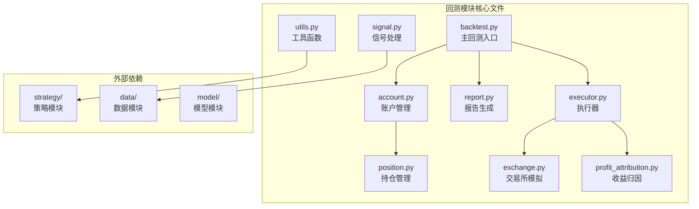
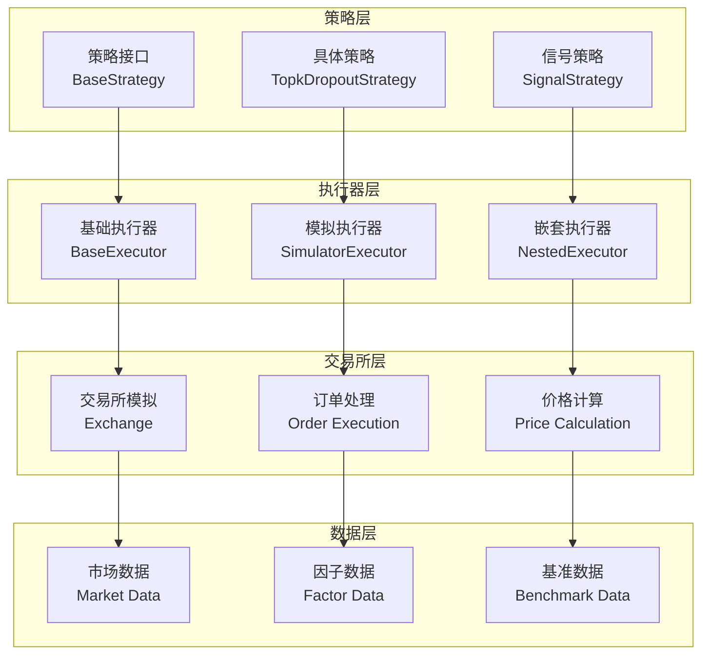
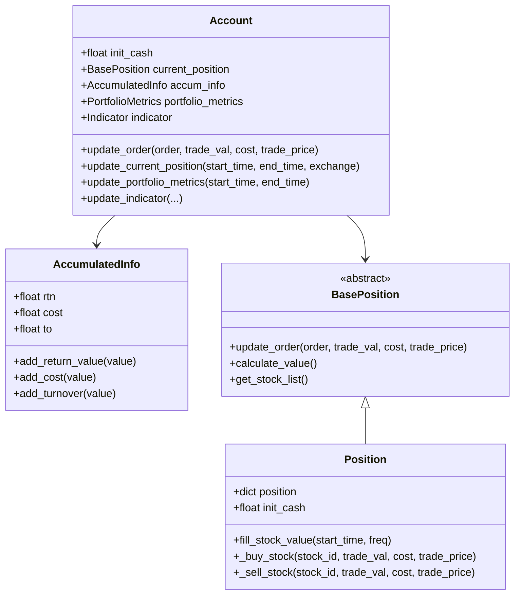
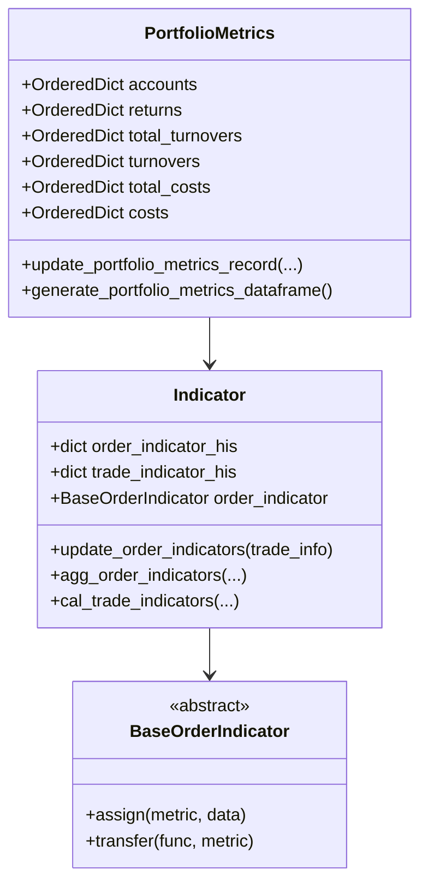
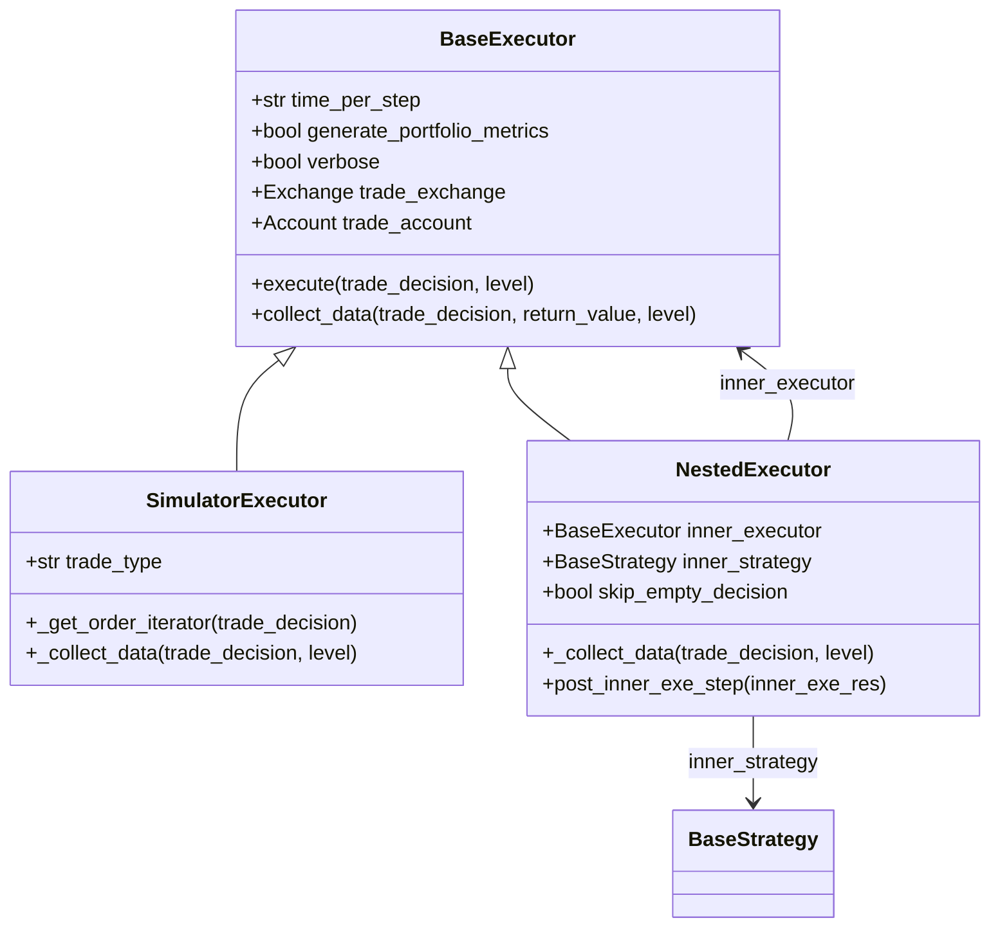
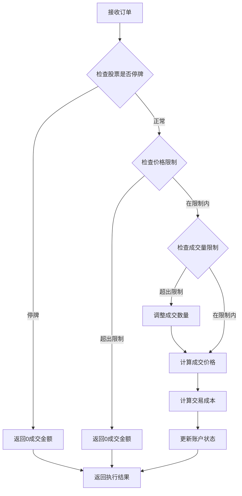
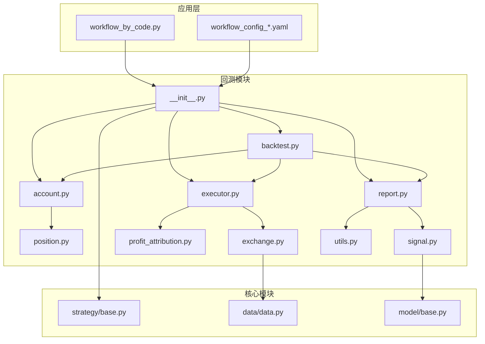

# QLib回测模块综合文档

<cite>
**本文档中引用的文件**
- [backtest.py](file://qlib/backtest/backtest.py)
- [account.py](file://qlib/backtest/account.py)
- [report.py](file://qlib/backtest/report.py)
- [executor.py](file://qlib/backtest/executor.py)
- [position.py](file://qlib/backtest/position.py)
- [exchange.py](file://qlib/backtest/exchange.py)
- [profit_attribution.py](file://qlib/backtest/profit_attribution.py)
- [signal.py](file://qlib/backtest/signal.py)
- [utils.py](file://qlib/backtest/utils.py)
- [__init__.py](file://qlib/backtest/__init__.py)
- [workflow_by_code.py](file://examples/workflow_by_code.py)
- [workflow_config_lightgbm_Alpha360.yaml](file://examples/benchmarks/LightGBM/workflow_config_lightgbm_Alpha360.yaml)
</cite>

## 目录
1. [简介](#简介)
2. [项目结构](#项目结构)
3. [核心组件](#核心组件)
4. [架构概览](#架构概览)
5. [详细组件分析](#详细组件分析)
6. [依赖关系分析](#依赖关系分析)
7. [性能考虑](#性能考虑)
8. [故障排除指南](#故障排除指南)
9. [结论](#结论)

## 简介

QLib回测模块是一个功能强大的量化交易回测框架，提供了完整的交易执行、账户管理、报告生成和风险分析功能。该模块设计为模块化架构，支持从简单的单层回测到复杂的多层嵌套决策执行。

回测模块的核心目标是：
- 提供真实的市场模拟环境
- 支持多种交易策略和执行器
- 生成详细的交易指标和投资组合分析
- 支持高频率交易和低延迟执行
- 提供灵活的扩展性和可配置性

## 项目结构

QLib回测模块采用清晰的分层架构，主要包含以下核心文件：



**图表来源**
- [backtest.py](file://qlib/backtest/backtest.py#L1-L111)
- [account.py](file://qlib/backtest/account.py#L1-L418)
- [report.py](file://qlib/backtest/report.py#L1-L652)

**章节来源**
- [backtest.py](file://qlib/backtest/backtest.py#L1-L111)
- [__init__.py](file://qlib/backtest/__init__.py#L1-L350)

## 核心组件

### 回测引擎 (Backtest Engine)

回测引擎是整个系统的核心协调器，负责协调策略和执行器之间的交互。

```python
def backtest(
    start_time: Union[pd.Timestamp, str],
    end_time: Union[pd.Timestamp, str],
    strategy: Union[str, dict, object, Path],
    executor: Union[str, dict, object, Path],
    benchmark: str = "SH000300",
    account: Union[float, int, dict] = 1e9,
    exchange_kwargs: dict = {},
    pos_type: str = "Position",
) -> Tuple[PORT_METRIC, INDICATOR_METRIC]:
```

### 账户管理系统 (Account Management)

账户管理系统负责维护交易账户的状态，包括现金余额、持仓信息和交易历史。

```python
class Account:
    def __init__(
        self,
        init_cash: float = 1e9,
        position_dict: dict = {},
        freq: str = "day",
        benchmark_config: dict = {},
        pos_type: str = "Position",
        port_metr_enabled: bool = True,
    ) -> None:
```

### 执行器系统 (Executor System)

执行器系统负责实际的交易执行逻辑，支持原子执行和嵌套执行两种模式。

```python
class BaseExecutor:
    def __init__(
        self,
        time_per_step: str,
        start_time: Union[str, pd.Timestamp] = None,
        end_time: Union[str, pd.Timestamp] = None,
        indicator_config: dict = {},
        generate_portfolio_metrics: bool = False,
        verbose: bool = False,
        track_data: bool = False,
        trade_exchange: Exchange | None = None,
        common_infra: CommonInfrastructure | None = None,
        settle_type: str = BasePosition.ST_NO,
        **kwargs: Any,
    ) -> None:
```

**章节来源**
- [backtest.py](file://qlib/backtest/backtest.py#L20-L111)
- [account.py](file://qlib/backtest/account.py#L60-L120)
- [executor.py](file://qlib/backtest/executor.py#L20-L120)

## 架构概览

QLib回测模块采用分层架构设计，从上到下分为策略层、执行器层、交易所层和数据层。



**图表来源**
- [strategy/base.py](file://qlib/strategy/base.py#L1-L100)
- [executor.py](file://qlib/backtest/executor.py#L1-L100)
- [exchange.py](file://qlib/backtest/exchange.py#L1-L100)

## 详细组件分析

### 回测循环机制

回测循环是整个系统的核心执行流程，通过`collect_data_loop`函数实现：

```mermaid
sequenceDiagram
participant Client as 客户端
participant Loop as 回测循环
participant Strategy as 策略
participant Executor as 执行器
participant Exchange as 交易所
participant Account as 账户
Client->>Loop : 启动回测(start_time, end_time)
Loop->>Strategy : 重置策略
Loop->>Executor : 重置执行器
loop 每个交易日
Loop->>Strategy : generate_trade_decision()
Strategy-->>Loop : 交易决策
Loop->>Executor : collect_data(decision)
Executor->>Exchange : 处理订单
Exchange->>Account : 更新账户状态
Account-->>Executor : 返回执行结果
Executor-->>Loop : 返回执行结果
Loop->>Strategy : post_exe_step(result)
Strategy-->>Loop : 后处理完成
end
Loop-->>Client : 返回回测结果
```

**图表来源**
- [backtest.py](file://qlib/backtest/backtest.py#L60-L110)
- [executor.py](file://qlib/backtest/executor.py#L200-L300)

### 账户状态管理

账户系统采用分层设计，支持共享和独立的指标计算：



**图表来源**
- [account.py](file://qlib/backtest/account.py#L60-L200)
- [position.py](file://qlib/backtest/position.py#L1-L200)

### 报告生成系统

报告系统提供全面的投资组合分析和交易指标：



**图表来源**
- [report.py](file://qlib/backtest/report.py#L30-L200)
- [report.py](file://qlib/backtest/report.py#L300-L500)

### 执行器层次结构

执行器系统支持原子执行和嵌套执行两种模式：



**图表来源**
- [executor.py](file://qlib/backtest/executor.py#L20-L150)
- [executor.py](file://qlib/backtest/executor.py#L400-L500)

### 交易所模拟系统

交易所模拟系统提供真实的市场环境，包括价格计算、成交量限制和交易成本：



**图表来源**
- [exchange.py](file://qlib/backtest/exchange.py#L600-L700)

**章节来源**
- [backtest.py](file://qlib/backtest/backtest.py#L60-L110)
- [account.py](file://qlib/backtest/account.py#L1-L418)
- [report.py](file://qlib/backtest/report.py#L1-L652)
- [executor.py](file://qlib/backtest/executor.py#L1-L629)
- [exchange.py](file://qlib/backtest/exchange.py#L1-L959)

## 依赖关系分析

回测模块的依赖关系呈现清晰的分层结构：



**图表来源**
- [__init__.py](file://qlib/backtest/__init__.py#L1-L50)
- [backtest.py](file://qlib/backtest/backtest.py#L1-L20)

**章节来源**
- [__init__.py](file://qlib/backtest/__init__.py#L1-L350)
- [backtest.py](file://qlib/backtest/backtest.py#L1-L111)

## 性能考虑

### 内存优化

1. **持仓数据缓存**: 使用高效的字典结构存储持仓信息
2. **指标计算**: 采用增量计算方式减少重复计算
3. **数据预加载**: 提前加载必要的市场数据

### 计算效率

1. **向量化操作**: 利用Pandas和NumPy的向量化特性
2. **并行处理**: 支持多线程的数据处理
3. **延迟计算**: 只在需要时才计算复杂指标

### 扩展性设计

1. **插件架构**: 支持自定义策略和执行器
2. **配置驱动**: 通过配置文件控制回测行为
3. **模块化设计**: 各组件职责明确，易于扩展

## 故障排除指南

### 常见问题及解决方案

#### 1. 回测结果异常

**问题**: 回测结果显示异常高的收益或亏损
**原因**: 数据质量问题或参数设置错误
**解决方案**:
- 检查数据完整性
- 验证交易成本设置
- 确认基准指数选择

#### 2. 性能问题

**问题**: 回测执行速度过慢
**原因**: 数据量过大或算法复杂度高
**解决方案**:
- 减少回测时间范围
- 优化策略算法
- 使用更高效的数据结构

#### 3. 内存溢出

**问题**: 回测过程中出现内存不足
**原因**: 持仓数据过多或指标计算不当
**解决方案**:
- 定期清理历史数据
- 优化指标计算逻辑
- 使用数据压缩技术

### 调试技巧

1. **启用详细日志**: 设置`verbose=True`获取详细执行信息
2. **分步调试**: 使用`track_data=True`跟踪每步决策
3. **指标验证**: 对关键指标进行单元测试

**章节来源**
- [account.py](file://qlib/backtest/account.py#L200-L300)
- [executor.py](file://qlib/backtest/executor.py#L100-L200)

## 结论

QLib回测模块是一个功能完整、设计精良的量化交易回测框架。其主要优势包括：

1. **模块化设计**: 清晰的分层架构便于理解和扩展
2. **灵活性**: 支持多种策略类型和执行模式
3. **完整性**: 提供从数据准备到结果分析的完整流程
4. **性能**: 优化的算法和数据结构确保高效执行
5. **可扩展性**: 插件架构支持自定义功能开发

该模块适用于各种量化交易场景，从简单的策略验证到复杂的高频交易回测。通过合理的配置和使用，可以满足大多数量化研究和交易开发的需求。

未来的发展方向可能包括：
- 更高效的并行计算支持
- 更丰富的指标计算功能
- 更直观的可视化界面
- 更好的云端部署支持