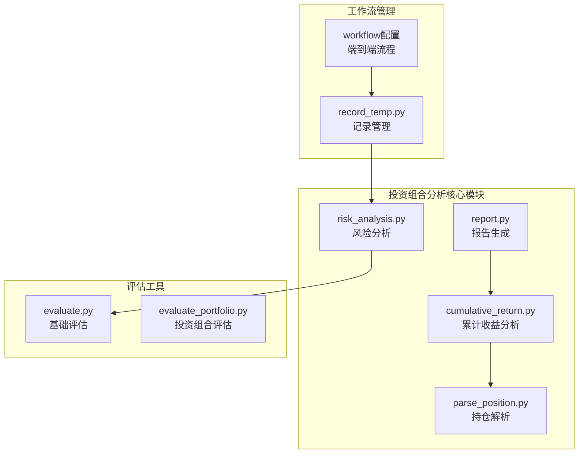
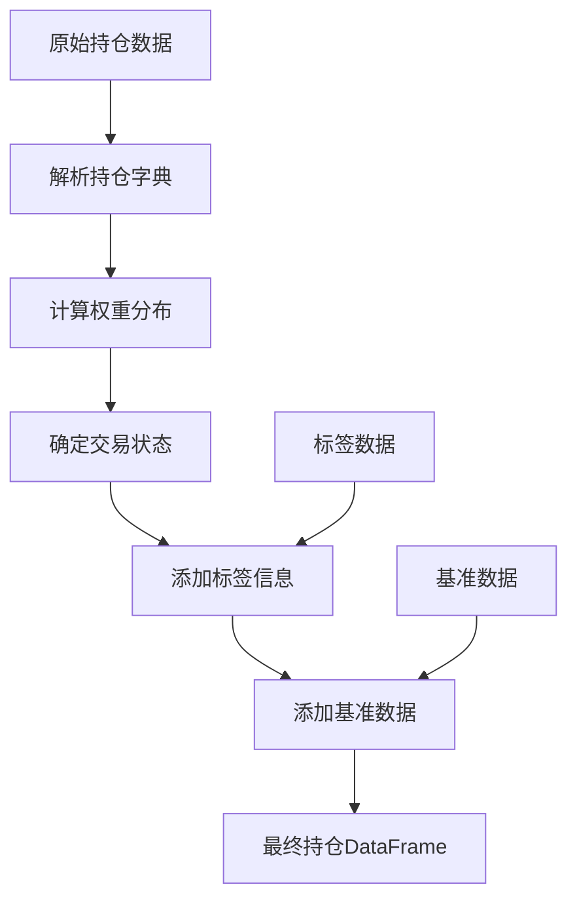
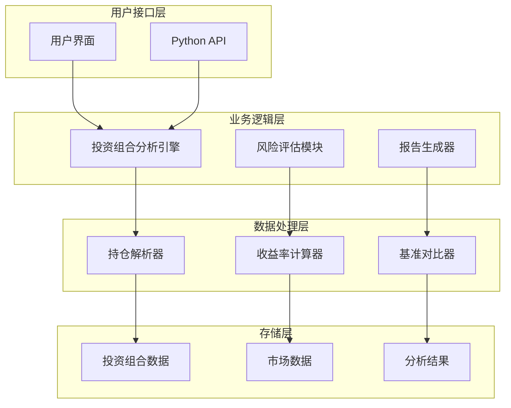
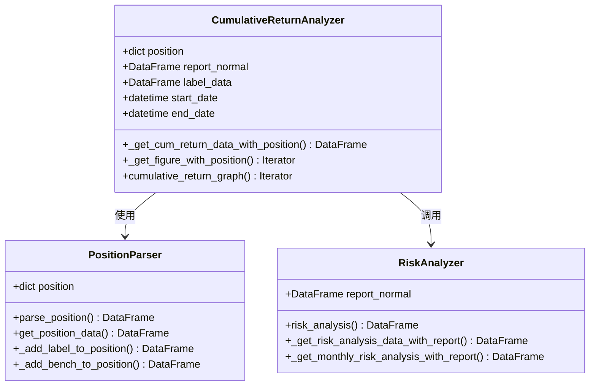
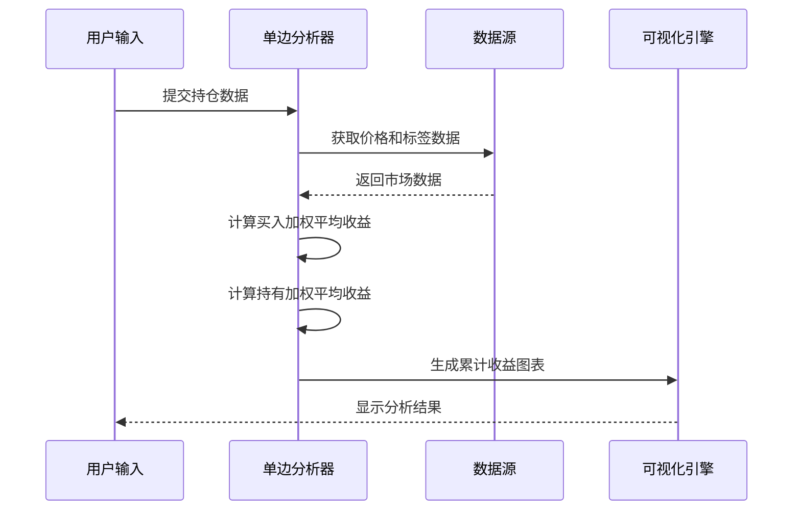
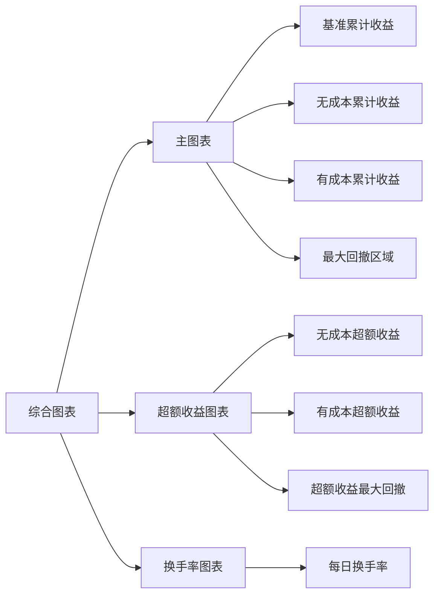
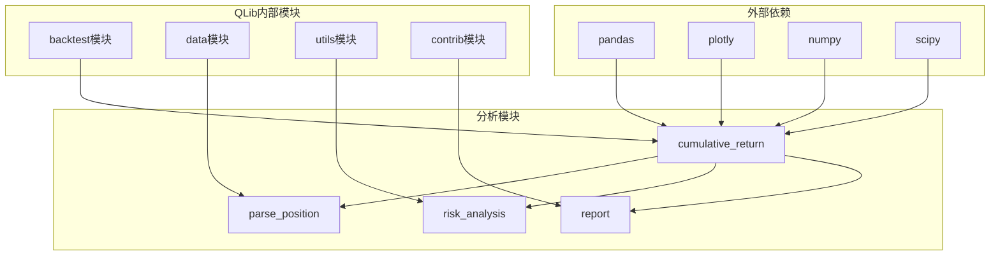

# QLib投资组合分析详细指南

<cite>
**本文档引用的文件**
- [cumulative_return.py](file://qlib/contrib/report/analysis_position/cumulative_return.py)
- [parse_position.py](file://qlib/contrib/report/analysis_position/parse_position.py)
- [risk_analysis.py](file://qlib/contrib/report/analysis_position/risk_analysis.py)
- [evaluate.py](file://qlib/contrib/evaluate.py)
- [evaluate_portfolio.py](file://qlib/contrib/evaluate_portfolio.py)
- [report.py](file://qlib/contrib/report/analysis_position/report.py)
- [record_temp.py](file://qlib/workflow/record_temp.py)
- [config_enhanced_indexing.yaml](file://examples/portfolio/config_enhanced_indexing.yaml)
- [README.md](file://examples/portfolio/README.md)
</cite>

## 目录
1. [简介](#简介)
2. [项目结构概览](#项目结构概览)
3. [核心组件分析](#核心组件分析)
4. [架构概览](#架构概览)
5. [详细组件分析](#详细组件分析)
6. [依赖关系分析](#依赖关系分析)
7. [性能考虑](#性能考虑)
8. [故障排除指南](#故障排除指南)
9. [结论](#结论)

## 简介

QLib的投资组合分析系统是一个全面的量化投资分析框架，专门设计用于评估和监控投资组合的绩效。该系统提供了丰富的功能，包括累计收益计算、年化收益率分析、夏普比率计算、最大回撤分析等核心绩效指标。

本系统支持多种投资策略的分析，包括多空投资组合和单边投资组合，并提供了灵活的持仓结构解析功能。通过`cumulative_return`模块，用户可以生成详细的收益率曲线并进行基准对比分析。

## 项目结构概览

QLib的投资组合分析功能主要分布在以下关键目录中：



**图表来源**
- [cumulative_return.py](file://qlib/contrib/report/analysis_position/cumulative_return.py#L1-L50)
- [parse_position.py](file://qlib/contrib/report/analysis_position/parse_position.py#L1-L50)
- [risk_analysis.py](file://qlib/contrib/report/analysis_position/risk_analysis.py#L1-L50)

**章节来源**
- [cumulative_return.py](file://qlib/contrib/report/analysis_position/cumulative_return.py#L1-L274)
- [parse_position.py](file://qlib/contrib/report/analysis_position/parse_position.py#L1-L176)
- [risk_analysis.py](file://qlib/contrib/report/analysis_position/risk_analysis.py#L1-L298)

## 核心组件分析

### 累计收益分析模块

累计收益分析是投资组合分析的核心功能之一，负责计算和可视化投资组合的累积表现。

#### 主要功能特性

1. **多维度持仓分析**：支持买入、卖出、持有三种状态的独立分析
2. **基准对比**：自动计算相对于基准指数的超额收益
3. **可视化输出**：生成交互式图表展示收益趋势
4. **时间序列处理**：支持不同时间周期的数据分析

#### 关键算法实现

```python
def _get_cum_return_data_with_position(position, report_normal, label_data, start_date=None, end_date=None):
    """
    计算基于持仓的投资组合累计收益数据
    
    参数：
    - position: 投资组合持仓数据
    - report_normal: 正常回报报告
    - label_data: 标签数据
    - start_date: 开始日期
    - end_date: 结束日期
    
    返回：
    包含累计收益数据的DataFrame
    """
```

### 持仓解析模块

持仓解析模块负责将原始持仓数据转换为分析友好的格式。

#### 解析流程



**图表来源**
- [parse_position.py](file://qlib/contrib/report/analysis_position/parse_position.py#L10-L80)

#### 交易状态识别

系统能够智能识别持仓中的买卖行为：

- **状态0 (持有)**：当前持仓未发生买卖操作
- **状态1 (买入)**：当日新增买入操作
- **状态-1 (卖出)**：当日新增卖出操作

**章节来源**
- [parse_position.py](file://qlib/contrib/report/analysis_position/parse_position.py#L10-L176)

## 架构概览

QLib投资组合分析系统采用分层架构设计，确保各组件之间的松耦合和高内聚。



**图表来源**
- [cumulative_return.py](file://qlib/contrib/report/analysis_position/cumulative_return.py#L1-L30)
- [risk_analysis.py](file://qlib/contrib/report/analysis_position/risk_analysis.py#L1-L30)

## 详细组件分析

### 累计收益分析组件

累计收益分析组件是整个投资组合分析系统的核心，负责计算和可视化投资组合的表现。

#### 数据结构设计



**图表来源**
- [cumulative_return.py](file://qlib/contrib/report/analysis_position/cumulative_return.py#L15-L50)
- [parse_position.py](file://qlib/contrib/report/analysis_position/parse_position.py#L10-L50)
- [risk_analysis.py](file://qlib/contrib/report/analysis_position/risk_analysis.py#L15-L50)

#### 收益率曲线生成逻辑

系统通过以下步骤生成收益率曲线：

1. **数据预处理**：解析持仓数据，添加标签和基准信息
2. **状态分类**：根据交易状态将持仓分为买入、卖出、持有三类
3. **加权计算**：对每类持仓按权重计算平均收益率
4. **累计求和**：对各类别的收益率进行累计求和
5. **可视化输出**：生成包含多个子图的综合图表

#### 基准对比方法

系统实现了两种主要的基准对比方法：

```python
# 方法一：直接差值法
_position_df["label"] = _position_df["label"] - _position_df["bench"]

# 方法二：超额收益计算
analysis["excess_return_without_cost"] = risk_analysis(
    report_normal_df["return"] - report_normal_df["bench"]
)
```

**章节来源**
- [cumulative_return.py](file://qlib/contrib/report/analysis_position/cumulative_return.py#L15-L100)
- [risk_analysis.py](file://qlib/contrib/report/analysis_position/risk_analysis.py#L20-L80)

### 多空投资组合与单边投资组合分析差异

系统支持两种主要的投资组合类型，每种都有其独特的分析方法：

#### 单边投资组合分析

单边投资组合只关注买入操作，适用于长期价值投资策略：



**图表来源**
- [cumulative_return.py](file://qlib/contrib/report/analysis_position/cumulative_return.py#L40-L80)

#### 多空投资组合分析

多空投资组合同时考虑买入和卖出操作，适用于对冲策略：

```python
# 多空策略的超额收益计算
analysis["excess_return_without_cost"] = risk_analysis(
    report_normal_df["return"] - report_normal_df["bench"]
)
analysis["excess_return_with_cost"] = risk_analysis(
    report_normal_df["return"] - report_normal_df["bench"] - report_normal_df["cost"]
)
```

**章节来源**
- [risk_analysis.py](file://qlib/contrib/report/analysis_position/risk_analysis.py#L214-L239)

### _report_graph可视化功能

_report_graph是投资组合表现可视化的核心组件，提供多层次的图表展示：

#### 图表层次结构



**图表来源**
- [report.py](file://qlib/contrib/report/analysis_position/report.py#L70-L120)

#### 可视化参数配置

系统提供了丰富的可视化配置选项：

```python
_layout_style = dict(
    height=1200,
    title=" ",
    shapes=[
        {
            "type": "rect",
            "xref": "x",
            "yref": "paper",
            "x0": max_start_date,
            "y0": 0.55,
            "x1": max_end_date,
            "y1": 1,
            "fillcolor": "#d3d3d3",
            "opacity": 0.3,
        }
    ]
)
```

**章节来源**
- [report.py](file://qlib/contrib/report/analysis_position/report.py#L100-L150)

### 不同时间周期的收益统计方法

系统支持多种时间周期的收益统计，适应不同的分析需求：

#### 日度分析

```python
def risk_analysis(r, N=None, freq="day", mode="sum"):
    """
    日度收益分析
    
    参数：
    - r: 日度收益率序列
    - N: 年化系数，默认为252
    - freq: 频率标识，"day"
    - mode: 累积模式，"sum"或"product"
    """
```

#### 周度和月度分析

系统通过分组聚合实现不同周期的分析：

```python
# 月度分组
report_normal_gp = report_normal_df.groupby([
    report_normal_df.index.year, 
    report_normal_df.index.month
], group_keys=False)

# 周度分组
weekly_df = df.resample('W').agg({
    'return': 'sum',
    'cost': 'sum',
    'bench': 'last'
})
```

**章节来源**
- [evaluate.py](file://qlib/contrib/evaluate.py#L25-L80)
- [risk_analysis.py](file://qlib/contrib/report/analysis_position/risk_analysis.py#L60-L100)

### 自定义绩效指标

系统提供了灵活的自定义绩效指标功能：

#### 核心指标计算

```python
def risk_analysis(r, N=None, freq="day", mode="sum"):
    """
    核心风险分析函数
    
    返回指标：
    - mean: 平均收益率
    - std: 标准差
    - annualized_return: 年化收益率
    - information_ratio: 信息比率
    - max_drawdown: 最大回撤
    """
```

#### 扩展指标计算

系统还支持额外的绩效指标：

```python
# 夏普比率计算
sharpe = (annual - risk_free_rate) / std / np.sqrt(250)

# Beta系数计算
cov_r_b = np.cov(r, b)
var_b = np.var(b)
beta = cov_r_b / var_b

# Alpha超额收益
alpha = annaul_r - risk_free_rate - beta * (annaul_b - risk_free_rate)
```

**章节来源**
- [evaluate.py](file://qlib/contrib/evaluate.py#L25-L97)
- [evaluate_portfolio.py](file://qlib/contrib/evaluate_portfolio.py#L150-L200)

## 依赖关系分析

QLib投资组合分析系统的依赖关系体现了清晰的分层架构设计：



**图表来源**
- [cumulative_return.py](file://qlib/contrib/report/analysis_position/cumulative_return.py#L1-L15)
- [parse_position.py](file://qlib/contrib/report/analysis_position/parse_position.py#L1-L10)

**章节来源**
- [cumulative_return.py](file://qlib/contrib/report/analysis_position/cumulative_return.py#L1-L20)
- [parse_position.py](file://qlib/contrib/report/analysis_position/parse_position.py#L1-L15)

## 性能考虑

### 内存优化策略

1. **延迟加载**：只在需要时加载数据，避免内存占用过大
2. **数据压缩**：使用适当的DataFrame数据类型减少内存使用
3. **迭代处理**：对大型数据集采用分批处理方式

### 计算效率优化

1. **向量化运算**：充分利用NumPy和Pandas的向量化操作
2. **缓存机制**：对重复计算的结果进行缓存
3. **并行处理**：在可能的情况下使用并行计算

### 时间复杂度分析

- **持仓解析**：O(n)，其中n为交易日数量
- **收益率计算**：O(m)，其中m为股票数量
- **可视化生成**：O(k)，其中k为数据点数量

## 故障排除指南

### 常见问题及解决方案

#### 数据缺失问题

```python
# 问题：持仓数据不完整
# 解决方案：使用前向填充填补缺失值
position_weight_df.ffill(inplace=True)

# 问题：标签数据范围不匹配
# 解决方案：调整数据范围以匹配持仓数据
_label_name = "label"
def _calculate_day_value(g_df: pd.DataFrame):
    g_df = g_df.copy()
    g_df["rank_ratio"] = g_df[_label_name].rank(ascending=False) / len(g_df) * 100
```

#### 性能问题诊断

```python
# 性能监控：检查数据处理时间
import time
start_time = time.time()
result = _get_cum_return_data_with_position(...)
print(f"Processing time: {time.time() - start_time:.2f} seconds")
```

#### 可视化问题解决

```python
# 问题：图表显示异常
# 解决方案：检查数据格式和索引设置
cum_return_df.index = cum_return_df.index.strftime("%Y-%m-%d")
```

**章节来源**
- [parse_position.py](file://qlib/contrib/report/analysis_position/parse_position.py#L20-L50)
- [cumulative_return.py](file://qlib/contrib/report/analysis_position/cumulative_return.py#L100-L150)

## 结论

QLib的投资组合分析系统提供了一个完整、高效的投资组合绩效评估解决方案。通过模块化的设计和丰富的功能，它能够满足从简单投资策略到复杂多资产组合的各种分析需求。

### 主要优势

1. **全面性**：涵盖所有主要的投资组合分析指标
2. **灵活性**：支持多种时间周期和投资策略
3. **可视化**：提供直观的图表展示功能
4. **可扩展性**：易于添加新的分析指标和功能

### 应用场景

- **投资策略评估**：验证新策略的有效性
- **风险管理**：监控投资组合的风险水平
- **绩效归因**：分析收益来源和风险因素
- **组合优化**：辅助构建最优投资组合

### 未来发展方向

1. **实时分析**：支持实时数据流的分析处理
2. **机器学习集成**：结合AI模型进行预测分析
3. **多资产支持**：扩展到债券、期货等其他资产类别
4. **云端部署**：支持大规模分布式计算

通过深入理解和正确使用QLib的投资组合分析功能，投资者和研究人员可以更好地理解投资组合的表现，做出更明智的投资决策。