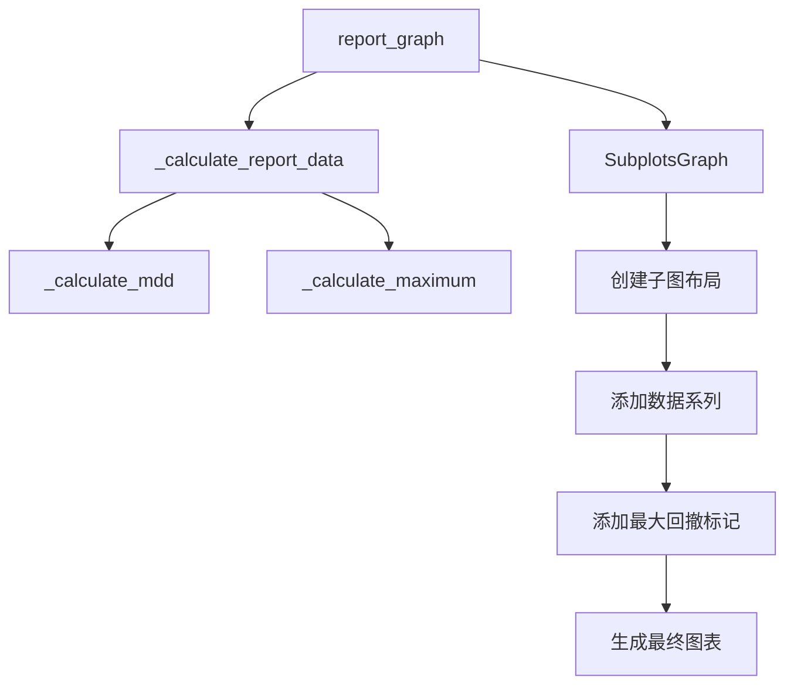

# 报告生成

<cite>
**本文档中引用的文件**  
- [report.py](file://qlib/backtest/report.py)
- [analysis_position/report.py](file://qlib/contrib/report/analysis_position/report.py)
- [graph.py](file://qlib/contrib/report/graph.py)
</cite>

## 目录
1. [引言](#引言)
2. [报告数据结构与组织](#报告数据结构与组织)
3. [关键指标计算方法](#关键指标计算方法)
4. [报告可视化实现](#报告可视化实现)
5. [月度风险分析报告](#月度风险分析报告)
6. [多空投资组合分析](#多空投资组合分析)
7. [报告生成代码示例](#报告生成代码示例)
8. [自定义报告指标](#自定义报告指标)
9. [结论](#结论)

## 引言
Qlib是一个用于量化投资研究的机器学习框架，其回测系统提供了完整的投资组合分析功能。本报告详细解释了如何从回测结果中生成投资组合分析报告，包括累计收益、超额收益、最大回撤等关键指标的计算方法。报告重点介绍了`_report_graph`函数如何可视化回测结果，以及如何生成月度风险分析报告。同时，说明了报告数据的结构和组织方式，涵盖正常投资组合和多空投资组合的分析，并提供实际代码示例展示如何加载和分析回测报告，以及如何自定义报告指标。

## 报告数据结构与组织
Qlib的回测报告数据主要由`PortfolioMetrics`类管理，该类负责存储和计算投资组合的每日指标。报告数据以`pandas.DataFrame`格式组织，包含以下关键列：

- **account**: 账户总价值（包含现金和证券）
- **return**: 投资组合日收益率（不含交易费用）
- **total_turnover**: 累计换手率
- **turnover**: 日换手率
- **total_cost**: 累计交易成本
- **cost**: 日交易成本率
- **value**: 证券总价值（不含现金）
- **cash**: 现金余额
- **bench**: 基准指数收益率

报告数据的组织遵循时间序列结构，以日期作为索引。`PortfolioMetrics`类通过`update_portfolio_metrics_record`方法在每个交易时段更新这些指标，并通过`generate_portfolio_metrics_dataframe`方法生成完整的报告数据框。这种结构化的数据组织方式便于后续的分析和可视化。

**Section sources**
- [report.py](file://qlib/backtest/report.py#L1-L652)

## 关键指标计算方法
Qlib的回测报告计算多种关键性能指标，这些指标对于评估投资策略的有效性至关重要。

### 累计收益计算
累计收益通过将日收益率进行累加计算得出。具体实现中，使用`cumsum()`函数对日收益率序列进行累积求和，得到累计收益率曲线。这反映了投资组合在整个回测期间的总收益表现。

### 超额收益计算
超额收益是投资组合收益相对于基准指数的超额部分。计算方法为投资组合日收益率减去基准指数收益率，然后进行累积求和。超额收益指标帮助评估策略相对于市场的超额回报能力。

### 最大回撤计算
最大回撤（Maximum Drawdown）是评估投资组合风险的重要指标，表示在特定期间内从最高点到最低点的最大跌幅。Qlib通过`_calculate_mdd`函数实现最大回撤计算，该函数计算累计收益序列与其历史最高点之间的差值，从而得到回撤序列。最大回撤的计算公式为：
```
回撤 = 累计收益 - 累计收益的历史最大值
```

**Section sources**
- [analysis_position/report.py](file://qlib/contrib/report/analysis_position/report.py#L0-L249)

## 报告可视化实现
Qlib使用`report_graph`函数实现回测结果的可视化，该函数基于Plotly库生成交互式图表。

### _report_graph函数分析
`report_graph`函数是Qlib回测报告可视化的核心，它接收一个包含回测结果的`DataFrame`作为输入，并生成包含多个子图的综合报告。该函数首先调用`_calculate_report_data`函数计算所有必要的报告指标，然后使用`SubplotsGraph`类创建多子图布局。

可视化过程包括以下步骤：
1. 计算报告数据，包括累计收益、超额收益、最大回撤等指标
2. 确定最大回撤和超额最大回撤的时间区间
3. 创建包含7个子图的复合图表
4. 在图表中添加矩形标记，突出显示最大回撤和超额最大回撤区间

### 图表类型与布局
报告包含以下7个子图：
1. 累计基准收益、累计收益（无成本）、累计收益（含成本）
2. 无成本最大回撤
3. 含成本最大回撤
4. 无成本超额收益、含成本超额收益
5. 换手率
6. 含成本超额最大回撤
7. 无成本超额最大回撤

图表布局采用垂直堆叠方式，共享X轴，便于比较不同指标的时间序列变化。最大回撤区间通过半透明灰色矩形在图表中突出显示，增强了报告的可读性。



**Diagram sources**
- [analysis_position/report.py](file://qlib/contrib/report/analysis_position/report.py#L111-L166)
- [graph.py](file://qlib/contrib/report/graph.py#L0-L385)

**Section sources**
- [analysis_position/report.py](file://qlib/contrib/report/analysis_position/report.py#L0-L249)
- [graph.py](file://qlib/contrib/report/graph.py#L0-L385)

## 月度风险分析报告
Qlib的月度风险分析报告通过`risk_analysis_graph`函数生成，该函数位于`qlib.contrib.report.analysis_position.risk_analysis`模块中。月度风险分析报告主要关注投资组合在不同时间尺度下的风险特征。

报告内容包括：
- 月度收益率分布
- 月度波动率分析
- 月度最大回撤统计
- 风险调整后收益指标（如夏普比率）

月度风险分析通过将日度数据按月聚合，计算各月的统计指标，然后生成相应的图表。这种时间尺度的转换有助于识别投资策略在不同市场环境下的风险特征，为风险管理提供决策支持。

**Section sources**
- [analysis_position/__init__.py](file://qlib/contrib/report/analysis_position/__init__.py#L0-L10)

## 多空投资组合分析
Qlib支持多空投资组合的分析，通过`get_position_data`函数从持仓数据中提取多空信息。多空投资组合分析的关键在于区分多头和空头仓位，并分别计算其收益贡献。

分析过程包括：
1. 从持仓数据中识别多头（买入）和空头（卖出）仓位
2. 分别计算多头和空头的累计收益
3. 计算多空对冲后的净收益
4. 分析多空仓位的权重分布和价值变化

多空分析通过`_get_cum_return_data_with_position`函数实现，该函数接收持仓数据、正常报告数据和标签数据作为输入，生成包含多空信息的综合分析数据框。这种分析方法有助于评估投资策略的对冲效果和方向性风险。

**Section sources**
- [cumulative_return.py](file://qlib/contrib/report/analysis_position/cumulative_return.py#L0-L52)

## 报告生成代码示例
以下是使用Qlib生成回测报告的典型代码示例：

```python
import qlib
from qlib.backtest import backtest
from qlib.contrib.evaluate import risk_analysis
from qlib.contrib.strategy import TopkDropoutStrategy
from qlib.contrib.report.analysis_position import report_graph

# 初始化Qlib
qlib.init(provider_uri=<qlib数据目录>)

# 配置回测参数
CSI300_BENCH = "SH000300"
STRATEGY_CONFIG = {
    "topk": 50,
    "n_drop": 5,
    "signal": pred_score,
}

EXECUTOR_CONFIG = {
    "time_per_step": "day",
    "generate_portfolio_metrics": True,
}

backtest_config = {
    "start_time": "2017-01-01",
    "end_time": "2020-08-01",
    "account": 100000000,
    "benchmark": CSI300_BENCH,
    "exchange_kwargs": {
        "freq": "day",
        "limit_threshold": 0.095,
        "deal_price": "close",
        "open_cost": 0.0005,
        "close_cost": 0.0015,
        "min_cost": 5,
    },
}

# 执行回测
strategy_obj = TopkDropoutStrategy(**STRATEGY_CONFIG)
executor_obj = executor.SimulatorExecutor(**EXECUTOR_CONFIG)
portfolio_metric_dict, indicator_dict = backtest(executor=executor_obj, strategy=strategy_obj, **backtest_config)

# 生成并显示报告
report_normal_df, positions_normal = portfolio_metric_dict.get("day")
report_graph(report_normal_df)
```

**Section sources**
- [analysis_position/report.py](file://qlib/contrib/report/analysis_position/report.py#L228-L247)

## 自定义报告指标
Qlib提供了灵活的机制来自定义报告指标。用户可以通过继承`Indicator`类或直接操作报告数据框来添加新的指标。

自定义指标的实现步骤：
1. 定义新的指标计算函数
2. 将函数应用于报告数据框
3. 将结果添加到报告数据框中
4. 在可视化时包含新指标

例如，可以添加波动率调整收益、信息比率等高级指标。通过`SubplotsGraph`类的灵活配置，可以轻松地将自定义指标添加到报告图表中，满足特定的分析需求。

**Section sources**
- [report.py](file://qlib/backtest/report.py#L1-L652)

## 结论
Qlib的回测报告系统提供了一套完整的投资组合分析工具，能够生成包含累计收益、超额收益、最大回撤等关键指标的详细报告。通过`report_graph`函数，系统能够可视化回测结果，生成包含多个子图的综合报告。报告数据的结构化组织方式便于分析和扩展，支持正常投资组合和多空投资组合的分析。用户可以通过提供的代码示例快速生成回测报告，并根据需要自定义报告指标，满足不同的量化研究需求。