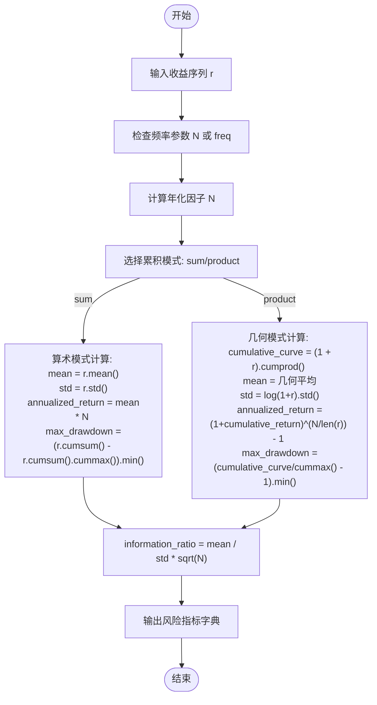
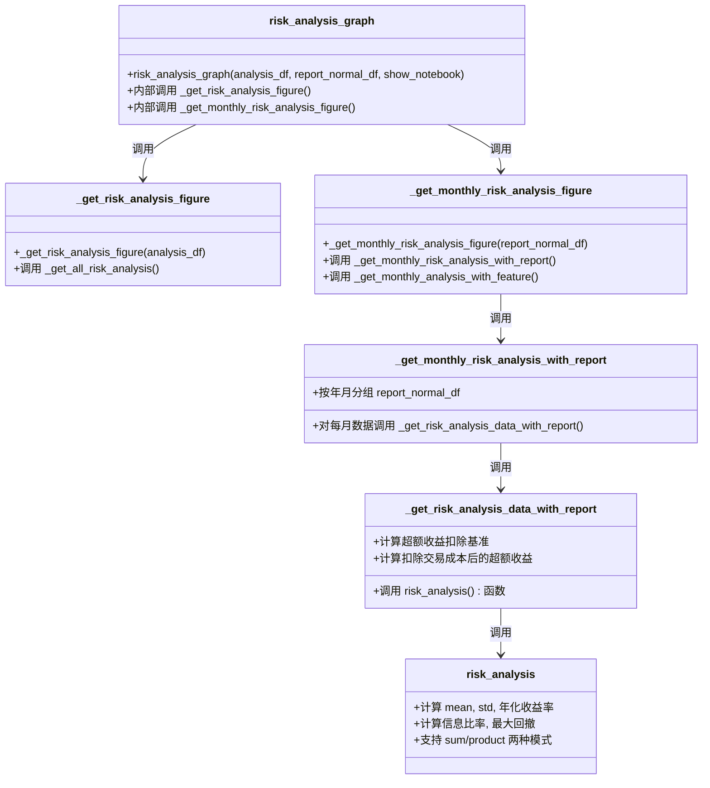
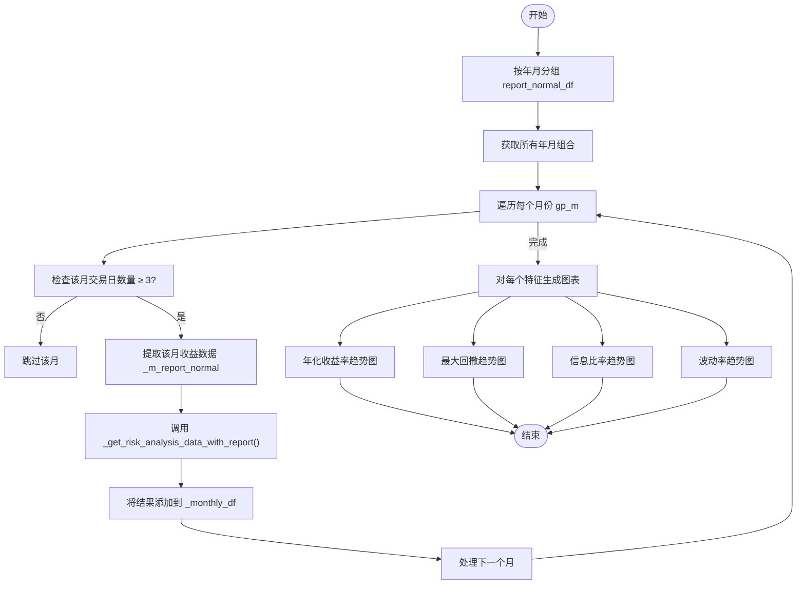

# 风险分析

<cite>
**本文档中引用的文件**  
- [risk_analysis.py](file://qlib/contrib/report/analysis_position/risk_analysis.py)
- [evaluate.py](file://qlib/contrib/evaluate.py)
- [base.py](file://qlib/model/riskmodel/base.py)
- [structured.py](file://qlib/model/riskmodel/structured.py)
- [shrink.py](file://qlib/model/riskmodel/shrink.py)
- [poet.py](file://qlib/model/riskmodel/poet.py)
</cite>

## 目录
1. [引言](#引言)
2. [核心风险指标计算原理](#核心风险指标计算原理)
3. [风险分析模块架构](#风险分析模块架构)
4. [月度风险报告生成](#月度风险报告生成)
5. [风险归因与极端场景分析](#风险归因与极端场景分析)
6. [风险模型实现](#风险模型实现)
7. [代码示例：加载回测结果并执行风险评估](#代码示例加载回测结果并执行风险评估)
8. [自定义风险阈值与预警机制](#自定义风险阈值与预警机制)
9. [不同市场环境下的风险敏感性分析](#不同市场环境下的风险敏感性分析)
10. [结论](#结论)

## 引言
Qlib 提供了一套完整的风险分析功能，用于评估量化投资策略的风险特征。该系统通过计算最大回撤、波动率、信息比率等关键风险指标，生成可视化报告，并支持深入的风险归因分析。风险分析模块与回测系统紧密集成，能够从回测结果中提取收益序列并进行多维度分析。

**Section sources**
- [risk_analysis.py](file://qlib/contrib/report/analysis_position/risk_analysis.py#L1-L297)
- [evaluate.py](file://qlib/contrib/evaluate.py#L1-L421)

## 核心风险指标计算原理
Qlib 的风险分析基于收益序列进行统计计算，支持算术累积和几何累积两种模式。核心风险指标包括：

- **年化收益率**：根据日均收益乘以年化因子计算，Qlib 默认采用算术累积方式避免曲线指数偏斜。
- **波动率（标准差）**：收益序列的标准差，衡量收益的离散程度。
- **最大回撤**：累计收益从峰值到谷底的最大跌幅，反映策略最坏情况下的损失。
- **信息比率**：超额收益均值与波动率的比值，经年化因子调整，衡量单位风险带来的超额收益。

这些指标通过 `risk_analysis` 函数统一计算，支持不同频率（日、周、月）的年化处理。



**Diagram sources**
- [evaluate.py](file://qlib/contrib/evaluate.py#L34-L63)

**Section sources**
- [evaluate.py](file://qlib/contrib/evaluate.py#L34-L63)

## 风险分析模块架构
风险分析模块主要由 `qlib.contrib.evaluate` 和 `qlib.contrib.report.analysis_position` 两个组件构成。`evaluate` 模块提供核心风险指标计算函数，而 `report` 模块负责生成可视化图表。

模块间关系如下：
- `risk_analysis_graph` 是主要入口函数，接受分析数据和报告数据。
- 内部调用 `_get_risk_analysis_figure` 生成风险指标柱状图。
- 调用 `_get_monthly_risk_analysis_figure` 生成月度风险趋势图。
- 所有分析基于 `risk_analysis` 函数计算的结果。



**Diagram sources**
- [risk_analysis.py](file://qlib/contrib/report/analysis_position/risk_analysis.py#L1-L297)
- [evaluate.py](file://qlib/contrib/evaluate.py#L34-L63)

**Section sources**
- [risk_analysis.py](file://qlib/contrib/report/analysis_position/risk_analysis.py#L1-L297)

## 月度风险报告生成
Qlib 支持生成月度粒度的风险分析报告，通过将日度收益数据按年月分组，分别计算每个月的风险指标。该功能由 `_get_monthly_risk_analysis_with_report` 函数实现。

处理流程包括：
1. 使用 `groupby([index.year, index.month])` 对收益数据进行月度分组
2. 过滤交易日少于3天的月份（避免数据不足导致的异常）
3. 对每个月份调用 `risk_analysis` 函数计算风险指标
4. 将结果按日期对齐，生成月度趋势数据
5. 使用 `ScatterGraph` 生成折线图展示各指标的月度变化

生成的报告包含年化收益率、最大回撤、信息比率和波动率四个维度的月度趋势，便于观察策略在不同时间段的风险特征变化。



**Diagram sources**
- [risk_analysis.py](file://qlib/contrib/report/analysis_position/risk_analysis.py#L43-L77)

**Section sources**
- [risk_analysis.py](file://qlib/contrib/report/analysis_position/risk_analysis.py#L43-L77)

## 风险归因与极端场景分析
Qlib 的风险分析支持多维度归因，主要通过比较不同收益序列的风险特征来实现：

- **超额收益归因**：计算策略收益减去基准收益的超额收益风险
- **成本影响分析**：比较扣除交易成本前后的超额收益风险差异
- **多策略对比**：支持同时分析多个策略的风险特征

对于极端损失场景，系统通过最大回撤指标进行识别。当最大回撤超过预设阈值时，可定位到具体的回撤时间段，结合当时的市场环境和持仓情况进行深入分析。虽然 Qlib 当前未直接实现 VaR（风险价值）计算，但可通过收益分布分析来评估极端损失概率。

风险归因分析的关键在于构建不同的收益序列进行对比，从而识别风险来源。例如，若扣除成本后的信息比率显著下降，说明交易成本是主要风险来源之一。

**Section sources**
- [risk_analysis.py](file://qlib/contrib/report/analysis_position/risk_analysis.py#L43-L77)
- [evaluate.py](file://qlib/contrib/evaluate.py#L34-L63)

## 风险模型实现
Qlib 提供了多种风险模型用于协方差矩阵估计，位于 `qlib.model.riskmodel` 模块。这些模型主要用于投资组合优化中的风险预测。

主要风险模型包括：
- **ShrinkCovEstimator**：收缩估计量，将样本协方差矩阵向目标矩阵收缩
- **StructuredCovEstimator**：结构化协方差估计器，基于因子模型
- **POETCovEstimator**：基于稀疏结构的高维协方差估计
- **RiskModel**：所有风险模型的基类

其中，`StructuredCovEstimator` 支持 PCA 和因子分析两种因子模型，假设观测值可由多个因子预测：X = B @ F.T + U，协方差矩阵估计为 cov(X.T) = F @ cov(B.T) @ F.T + diag(var(U))。

```mermaid
classDiagram
class RiskModel {
+__init__(nan_option, assume_centered, scale_return)
+predict(X, return_corr, is_price)
+_predict(X)
+_preprocess(X)
}
class ShrinkCovEstimator {
+__init__(shrinkage, target, **kwargs)
+_predict(X)
}
class StructuredCovEstimator {
+__init__(factor_model, num_factors, **kwargs)
+_predict(X)
}
class POETCovEstimator {
+__init__(threshold, **kwargs)
+_predict(X)
}
RiskModel <|-- ShrinkCovEstimator
RiskModel <|-- StructuredCovEstimator
RiskModel <|-- POETCovEstimator
note right of RiskModel
基类，定义通用接口和预处理逻辑
处理 NaN 值、中心化、收益率缩放
end note
note right of ShrinkCovEstimator
收缩估计：
S_hat = (1 - alpha) * S + alpha * F
支持 Ledoit-Wolf 和 OAS 收缩参数
end note
note right of StructuredCovEstimator
结构化估计：
基于因子模型 (PCA/FA)
cov(X.T) = F @ cov(B.T) @ F.T + diag(var(U))
end note
```

**Diagram sources**
- [base.py](file://qlib/model/riskmodel/base.py#L1-L147)
- [shrink.py](file://qlib/model/riskmodel/shrink.py#L1-L28)
- [structured.py](file://qlib/model/riskmodel/structured.py#L1-L64)

**Section sources**
- [base.py](file://qlib/model/riskmodel/base.py#L1-L147)
- [shrink.py](file://qlib/model/riskmodel/shrink.py#L1-L28)
- [structured.py](file://qlib/model/riskmodel/structured.py#L1-L64)

## 代码示例：加载回测结果并执行风险评估
以下代码示例展示了如何加载回测结果并执行全面的风险评估：

```python
import qlib
from qlib.contrib.evaluate import risk_analysis
from qlib.contrib.report.analysis_position import risk_analysis_graph
import pandas as pd

# 初始化 Qlib
qlib.init(provider_uri="~/.qlib/qlib_data/cn_data")

# 假设已获得回测结果
# portfolio_metric_dict, indicator_dict = backtest(...)

# 获取回测报告数据
report_normal_df, positions_normal = portfolio_metric_dict.get("day")

# 计算风险指标
analysis = dict()
analysis["excess_return_without_cost"] = risk_analysis(
    report_normal_df["return"] - report_normal_df["bench"], 
    freq="day"
)
analysis["excess_return_with_cost"] = risk_analysis(
    report_normal_df["return"] - report_normal_df["bench"] - report_normal_df["cost"], 
    freq="day"
)

# 生成风险分析图表
analysis_df = pd.concat(analysis)
risk_analysis_graph(analysis_df, report_normal_df)
```

该示例首先计算扣除基准前后的超额收益风险，然后调用 `risk_analysis_graph` 生成包含风险指标和月度趋势的可视化报告。

**Section sources**
- [risk_analysis.py](file://qlib/contrib/report/analysis_position/risk_analysis.py#L200-L297)
- [evaluate.py](file://qlib/contrib/evaluate.py#L34-L63)

## 自定义风险阈值与预警机制
虽然 Qlib 未内置预警机制，但可通过以下方式实现自定义风险阈值监控：

1. 提取风险分析结果中的关键指标
2. 设置阈值条件（如最大回撤 > 10%，信息比率 < 1）
3. 当条件触发时发出警告或执行特定操作

```python
# 示例：自定义风险检查
def check_risk_thresholds(analysis_df):
    max_drawdown = analysis_df.loc[("excess_return_with_cost", "max_drawdown"), "risk"]
    info_ratio = analysis_df.loc[("excess_return_with_cost", "information_ratio"), "risk"]
    
    alerts = []
    if abs(max_drawdown) > 0.10:
        alerts.append(f"警告：最大回撤 {max_drawdown:.2%} 超过 10% 阈值")
    if info_ratio < 1.0:
        alerts.append(f"警告：信息比率 {info_ratio:.2f} 低于 1.0 阈值")
    
    return alerts

# 使用
alerts = check_risk_thresholds(analysis_df)
for alert in alerts:
    print(alert)
```

此机制可集成到策略监控系统中，实现实时风险预警。

**Section sources**
- [evaluate.py](file://qlib/contrib/evaluate.py#L34-L63)
- [risk_analysis.py](file://qlib/contrib/report/analysis_position/risk_analysis.py#L1-L297)

## 不同市场环境下的风险敏感性分析
Qlib 的风险分析功能支持通过分段分析来评估策略在不同市场环境下的表现。可通过以下方法进行风险敏感性分析：

1. **时间段分段**：将回测期划分为牛市、熊市、震荡市等不同阶段
2. **市场状态标记**：基于基准指数收益率定义市场状态
3. **分段风险计算**：对每个市场状态计算独立的风险指标

```python
# 示例：基于基准收益率划分市场状态
def get_market_regime(bench_return):
    if bench_return > 0.01:
        return "strong_up"
    elif bench_return > 0.001:
        return "mild_up"
    elif bench_return > -0.001:
        return "sideways"
    elif bench_return > -0.01:
        return "mild_down"
    else:
        return "strong_down"

# 应用到回测数据
report_normal_df["regime"] = report_normal_df["bench"].rolling(5).mean().apply(get_market_regime)

# 按市场状态分组分析
for regime, group in report_normal_df.groupby("regime"):
    regime_return = group["return"] - group["bench"]
    regime_risk = risk_analysis(regime_return, freq="day")
    print(f"{regime} 市场状态风险指标: {regime_risk}")
```

这种方法可识别策略在特定市场环境下的脆弱性，为风险控制提供依据。

**Section sources**
- [evaluate.py](file://qlib/contrib/evaluate.py#L34-L63)
- [risk_analysis.py](file://qlib/contrib/report/analysis_position/risk_analysis.py#L43-L77)

## 结论
Qlib 提供了一套完整的风险分析解决方案，涵盖了从基础风险指标计算到高级风险归因的各个方面。其核心优势在于：
- 统一的风险指标计算框架，支持多种累积模式和频率
- 灵活的月度风险报告生成，便于长期监控
- 模块化的架构设计，易于扩展和集成
- 与回测系统的无缝集成，支持端到端的风险评估

通过结合风险模型和风险分析功能，用户可以全面评估量化策略的风险特征，识别潜在风险点，并建立有效的风险控制机制。未来可进一步扩展 VaR 计算、压力测试等高级风险分析功能。