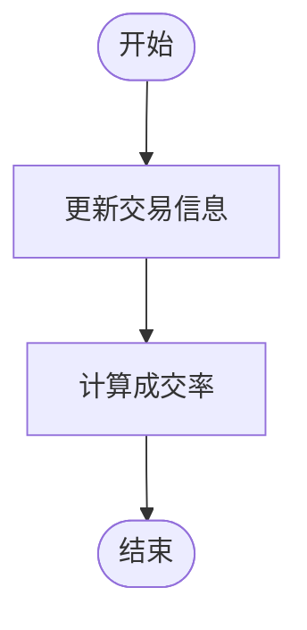
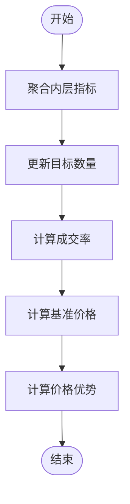
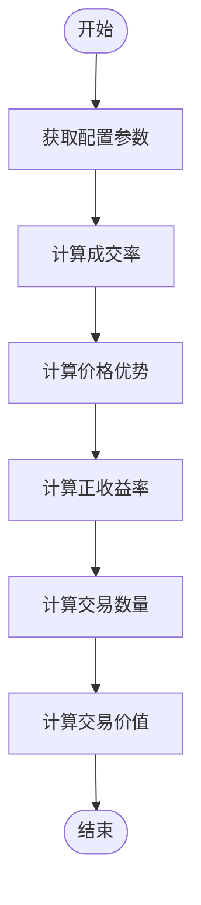
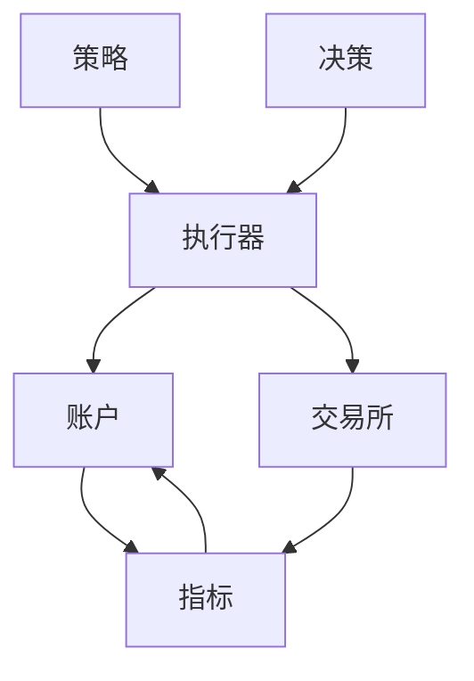

# 交易指标

<cite>
**本文档引用的文件**
- [high_freq.py](file://qlib/contrib/ops/high_freq.py)
- [account.py](file://qlib/backtest/account.py)
- [report.py](file://qlib/backtest/report.py)
- [high_performance_ds.py](file://qlib/backtest/high_performance_ds.py)
- [executor.py](file://qlib/backtest/executor.py)
- [decision.py](file://qlib/backtest/decision.py)
- [exchange.py](file://qlib/backtest/exchange.py)
- [position.py](file://qlib/backtest/position.py)
- [utils.py](file://qlib/backtest/utils.py)
</cite>

## 目录
1. [引言](#引言)
2. [核心指标计算](#核心指标计算)
3. [指标聚合机制](#指标聚合机制)
4. [数据记录与更新](#数据记录与更新)
5. [系统架构与组件交互](#系统架构与组件交互)
6. [高频交易指标系统](#高频交易指标系统)
7. [结论](#结论)

## 引言
Qlib交易指标系统为高频交易策略提供了全面的评估框架。该系统通过Indicator类计算价格优势(PA)、成交率(FFR)和正收益率(POS)等关键指标，支持对交易执行效果的量化分析。系统设计考虑了原子执行和非原子执行两种模式，能够灵活处理内外层交易决策的指标整合。本文档将深入解析该系统的实现机制，包括指标计算流程、数据聚合方法和系统组件间的交互关系。

## 核心指标计算
交易指标系统通过Indicator类实现对交易执行效果的量化评估。核心指标包括价格优势(PA)、成交率(FFR)和正收益率(POS)，这些指标为高频交易策略的性能评估提供了关键依据。

### 价格优势(PA)
价格优势指标衡量实际成交价格相对于基准价格的优势程度。计算公式为：
```
PA = sign * (trade_price / base_price - 1)
```
其中sign为交易方向符号（买入为+1，卖出为-1），trade_price为实际成交均价，base_price为基准价格。基准价格可通过时间加权平均价格(TWAP)或成交量加权平均价格(VWAP)计算，具体方法由pa_config参数配置。

### 成交率(FFR)
成交率指标反映订单的实际成交比例。计算公式为：
```
FFR = deal_amount / amount
```
其中deal_amount为实际成交数量，amount为目标交易数量。系统支持多种加权方法计算整体成交率，包括简单平均、数量加权和价值加权。

### 正收益率(POS)
正收益率指标衡量交易中获得正向价格优势的订单比例。计算公式为：
```
POS = (PA > 0).sum() / PA.count()
```
该指标反映了交易策略在价格获取方面的有效性。

**Section sources**
- [report.py](file://qlib/backtest/report.py#L400-L500)

## 指标聚合机制
交易指标系统采用分层聚合机制，能够处理原子执行和非原子执行两种模式下的指标计算。

### 原子执行模式
在原子执行模式下，系统直接基于实际交易信息计算指标。`update_order_indicators`方法接收交易信息列表，提取订单数量、成交数量、成交价格等基础数据，并计算成交率指标。



**Diagram sources**
- [report.py](file://qlib/backtest/report.py#L300-L330)

### 非原子执行模式
在非原子执行模式下，系统需要聚合内层执行器的指标。`agg_order_indicators`方法负责整合内层订单指标，包括交易信息聚合、基准价格计算和价格优势计算。



**Diagram sources**
- [report.py](file://qlib/backtest/report.py#L350-L400)

## 数据记录与更新
交易指标系统通过`cal_trade_indicators`和`record`方法实现指标的计算和记录。

### cal_trade_indicators方法
该方法在每个交易时段结束时调用，负责计算聚合后的交易指标。计算流程包括：
1. 根据配置参数确定加权方法
2. 计算整体成交率
3. 计算整体价格优势
4. 计算正收益率
5. 记录交易数量和价值



**Diagram sources**
- [report.py](file://qlib/backtest/report.py#L500-L550)

### record方法
该方法负责将计算得到的指标记录到历史数据中，为后续分析提供数据支持。

**Section sources**
- [report.py](file://qlib/backtest/report.py#L250-L260)

## 系统架构与组件交互
交易指标系统涉及多个核心组件的协同工作，包括Account、Executor、Exchange和Decision等。

### 组件关系图


**Diagram sources**
- [executor.py](file://qlib/backtest/executor.py#L100-L200)
- [account.py](file://qlib/backtest/account.py#L100-L200)

### 交互流程
1. 策略生成交易决策
2. 执行器处理决策并执行交易
3. 交易所提供市场数据和执行服务
4. 账户更新持仓和计算指标
5. 指标系统记录和聚合交易数据

**Section sources**
- [executor.py](file://qlib/backtest/executor.py#L200-L300)
- [account.py](file://qlib/backtest/account.py#L200-L300)

## 高频交易指标系统
Qlib的高频交易指标系统为量化交易提供了全面的评估框架。系统通过Indicator类实现对交易执行效果的量化分析，支持原子执行和非原子执行两种模式。

### 系统特点
- **灵活性**：支持多种基准价格计算方法和加权方式
- **可扩展性**：模块化设计便于功能扩展
- **高效性**：采用高性能数据结构优化计算性能
- **完整性**：提供从订单级到交易级的完整指标体系

### 应用场景
- 高频交易策略评估
- 算法交易执行质量分析
- 交易成本控制
- 交易策略优化

**Section sources**
- [report.py](file://qlib/backtest/report.py#L100-L200)
- [high_performance_ds.py](file://qlib/backtest/high_performance_ds.py#L100-L200)

## 结论
Qlib交易指标系统通过Indicator类实现了对价格优势(PA)、成交率(FFR)和正收益率(POS)等关键指标的计算。系统支持原子执行和非原子执行两种模式，能够灵活处理内外层交易决策的指标整合。通过`cal_trade_indicators`方法的计算流程和`record`方法的数据记录机制，系统为高频交易策略的评估提供了可靠的数据支持。与Account的`update_indicator`方法协同工作，形成了完整的交易评估闭环。该系统为量化交易研究和实践提供了重要的分析工具。