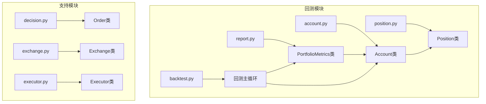
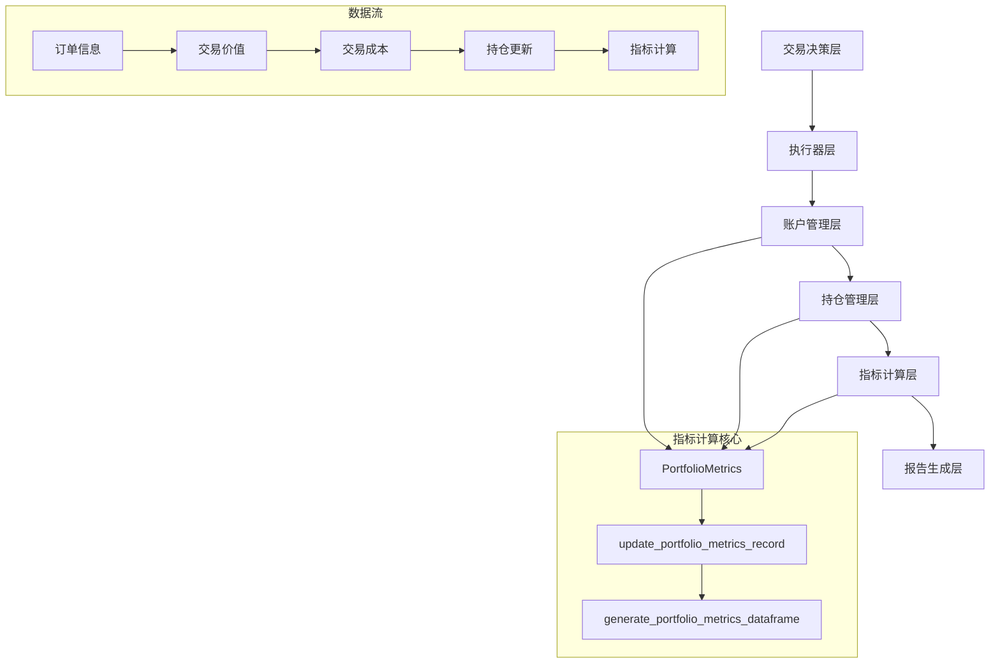
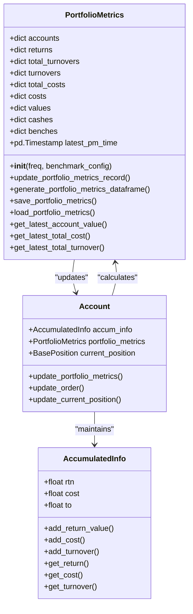
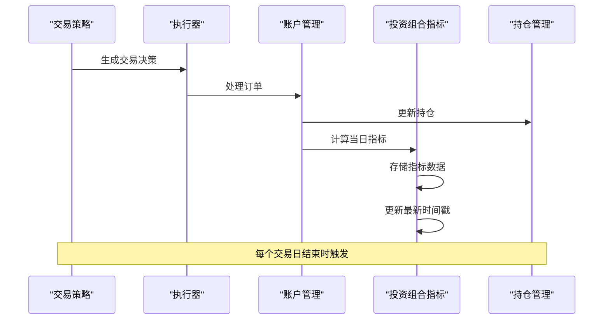
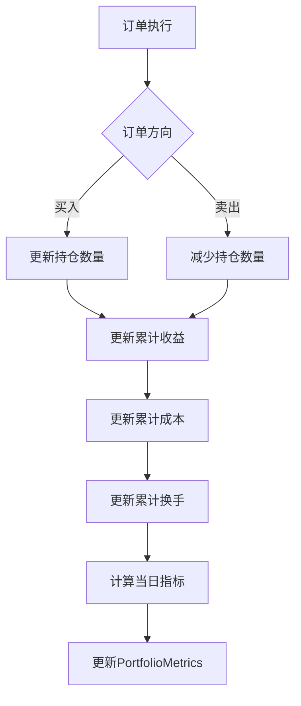
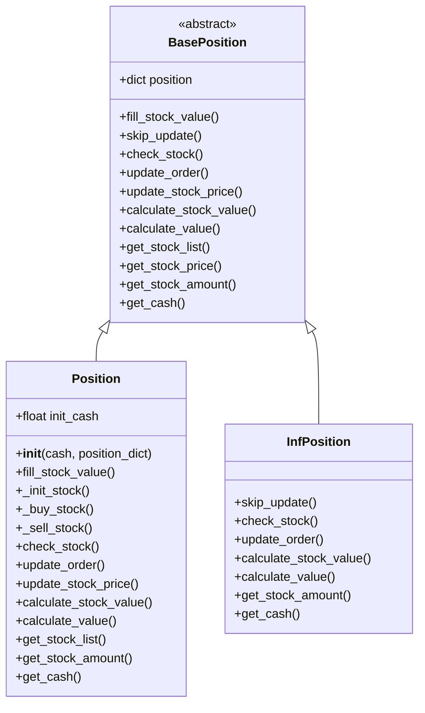
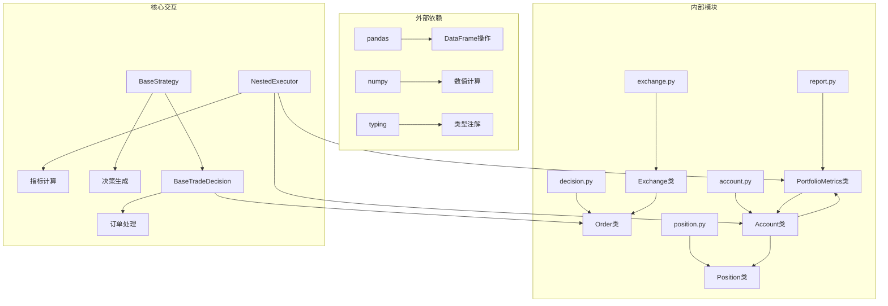

# QLib投资组合指标系统

<cite>
**本文档中引用的文件**
- [report.py](file://qlib/backtest/report.py)
- [account.py](file://qlib/backtest/account.py)
- [position.py](file://qlib/backtest/position.py)
- [backtest.py](file://qlib/backtest/backtest.py)
- [decision.py](file://qlib/backtest/decision.py)
- [exchange.py](file://qlib/backtest/exchange.py)
- [executor.py](file://qlib/backtest/executor.py)
</cite>

## 目录
1. [简介](#简介)
2. [项目结构](#项目结构)
3. [核心组件](#核心组件)
4. [架构概览](#架构概览)
5. [详细组件分析](#详细组件分析)
6. [依赖关系分析](#依赖关系分析)
7. [性能考虑](#性能考虑)
8. [故障排除指南](#故障排除指南)
9. [结论](#结论)

## 简介

QLib的投资组合指标系统是一个全面的金融投资组合分析框架，专门设计用于量化投资策略的回测和评估。该系统通过PortfolioMetrics类为核心，提供了账户价值、现金余额、收益率、换手率和成本率等关键指标的实时计算和跟踪功能。

系统的核心设计理念是支持多频度交易（从分钟级到日频）的投资组合分析，能够准确反映每个交易时段结束时的投资组合状态。通过与Account类的紧密集成，系统实现了从订单执行到指标计算的完整闭环，为后续的绩效分析和报告生成提供了坚实的数据基础。

## 项目结构

QLib投资组合指标系统的核心文件组织如下：



**图表来源**
- [report.py](file://qlib/backtest/report.py#L1-L50)
- [account.py](file://qlib/backtest/account.py#L1-L50)
- [backtest.py](file://qlib/backtest/backtest.py#L1-L50)

**章节来源**
- [report.py](file://qlib/backtest/report.py#L1-L652)
- [account.py](file://qlib/backtest/account.py#L1-L418)
- [position.py](file://qlib/backtest/position.py#L1-L566)

## 核心组件

### PortfolioMetrics类

PortfolioMetrics类是整个投资组合指标系统的核心，负责维护和更新所有关键的投资组合指标。该类采用OrderedDict结构存储每日指标数据，确保时间序列的有序性和可追溯性。

主要指标包括：
- **account**: 账户总资产价值（现金+证券）
- **return**: 收益率（不考虑交易费用）
- **total_turnover**: 累计换手金额
- **turnover**: 换手率
- **total_cost**: 累计交易成本
- **cost**: 成本率
- **value**: 证券总价值（不包含现金）
- **cash**: 现金余额
- **bench**: 基准收益率

### Account类

Account类管理单个账户的完整生命周期，包括初始化、订单处理、持仓更新和指标计算。该类通过AccumulatedInfo子类维护累计的交易信息，确保不同层级的执行器能够正确共享和更新指标。

### Position类

Position类表示具体的持仓状态，采用字典结构存储每只股票的数量、价格和权重信息。系统支持多种持仓类型，包括普通持仓（Position）、无限持仓（InfPosition）等。

**章节来源**
- [report.py](file://qlib/backtest/report.py#L25-L100)
- [account.py](file://qlib/backtest/account.py#L40-L150)
- [position.py](file://qlib/backtest/position.py#L200-L350)

## 架构概览

QLib投资组合指标系统采用分层架构设计，从底层的数据处理到上层的指标计算形成完整的处理链路：



**图表来源**
- [report.py](file://qlib/backtest/report.py#L149-L218)
- [account.py](file://qlib/backtest/account.py#L200-L300)

系统的工作流程遵循以下模式：
1. 交易决策产生订单
2. 执行器处理订单并更新持仓
3. Account类接收交易结果并更新累计指标
4. PortfolioMetrics类根据当前持仓计算当日指标
5. 指标数据被存储并可用于后续分析

## 详细组件分析

### PortfolioMetrics类详细分析



**图表来源**
- [report.py](file://qlib/backtest/report.py#L25-L100)
- [account.py](file://qlib/backtest/account.py#L40-L87)

#### 指标计算逻辑

PortfolioMetrics类的update_portfolio_metrics_record方法实现了关键指标的计算逻辑：

```python
# 计算当日收益
now_earning = now_account_value - last_account_value

# 计算当日成本变化
now_cost = self.accum_info.get_cost - last_total_cost

# 计算当日换手变化
now_turnover = self.accum_info.get_turnover - last_total_turnover

# 更新收益率（考虑成本的真实收益率）
return_rate = (now_earning + now_cost) / last_account_value

# 更新换手率
turnover_rate = now_turnover / last_account_value

# 更新成本率
cost_rate = now_cost / last_account_value
```

#### 指标更新流程



**图表来源**
- [account.py](file://qlib/backtest/account.py#L200-L250)
- [report.py](file://qlib/backtest/report.py#L149-L186)

**章节来源**
- [report.py](file://qlib/backtest/report.py#L149-L218)
- [account.py](file://qlib/backtest/account.py#L200-L300)

### Account类详细分析

Account类通过AccumulatedInfo子类维护累计的交易信息，确保不同层级的执行器能够正确共享和更新指标：



**图表来源**
- [account.py](file://qlib/backtest/account.py#L202-L222)

#### 累计指标更新机制

Account类的update_order方法实现了订单级别的指标更新：

```python
def update_order(self, order: Order, trade_val: float, cost: float, trade_price: float) -> None:
    # 更新换手
    self.accum_info.add_turnover(trade_val)
    # 更新成本
    self.accum_info.add_cost(cost)
    
    # 根据订单方向更新收益
    trade_amount = trade_val / trade_price
    if order.direction == Order.SELL:
        # 卖出时获得价格变动利润
        profit = trade_val - self.current_position.get_stock_price(order.stock_id) * trade_amount
        self.accum_info.add_return_value(profit)
    elif order.direction == Order.BUY:
        # 买入时获得价格变动收益
        profit = self.current_position.get_stock_price(order.stock_id) * trade_amount - trade_val
        self.accum_info.add_return_value(profit)
```

**章节来源**
- [account.py](file://qlib/backtest/account.py#L40-L150)
- [account.py](file://qlib/backtest/account.py#L200-L250)

### Position类详细分析

Position类采用字典结构存储持仓信息，支持灵活的持仓管理和查询：



**图表来源**
- [position.py](file://qlib/backtest/position.py#L20-L100)
- [position.py](file://qlib/backtest/position.py#L200-L350)

**章节来源**
- [position.py](file://qlib/backtest/position.py#L20-L100)
- [position.py](file://qlib/backtest/position.py#L200-L400)

## 依赖关系分析

QLib投资组合指标系统的依赖关系呈现清晰的层次结构：



**图表来源**
- [report.py](file://qlib/backtest/report.py#L1-L20)
- [account.py](file://qlib/backtest/account.py#L1-L20)
- [position.py](file://qlib/backtest/position.py#L1-L20)

**章节来源**
- [report.py](file://qlib/backtest/report.py#L1-L20)
- [account.py](file://qlib/backtest/account.py#L1-L20)
- [position.py](file://qlib/backtest/position.py#L1-L20)

## 性能考虑

QLib投资组合指标系统在设计时充分考虑了性能优化：

### 数据结构优化
- 使用OrderedDict确保时间序列数据的有序性
- 采用字典结构存储持仓信息，提供O(1)的访问效率
- 实现了高效的累计指标更新机制

### 内存管理
- 支持历史持仓的深度复制和存储
- 提供指标数据的持久化和加载功能
- 优化了大型数据集的处理性能

### 并发处理
- 支持多频度交易的并行处理
- 实现了嵌套执行器的指标共享机制
- 提供了高效的指标聚合算法

## 故障排除指南

### 常见问题及解决方案

#### 指标计算异常
**问题**: PortfolioMetrics.update_portfolio_metrics_record抛出ValueError
**原因**: 输入参数包含None值或基准数据不可用
**解决方案**: 检查交易时间和基准配置，确保所有必要参数都已正确设置

#### 持仓更新失败
**问题**: Position类的update_order方法抛出KeyError
**原因**: 尝试卖出不存在的股票或卖出数量超过持仓量
**解决方案**: 在执行卖出操作前验证股票存在性和持仓数量

#### 内存使用过高
**问题**: 长期运行后内存占用持续增长
**原因**: 历史指标数据未及时清理
**解决方案**: 定期调用PortfolioMetrics.save_portfolio_metrics保存数据并清理内存

**章节来源**
- [report.py](file://qlib/backtest/report.py#L149-L186)
- [account.py](file://qlib/backtest/account.py#L202-L222)
- [position.py](file://qlib/backtest/position.py#L300-L350)

## 结论

QLib投资组合指标系统是一个功能完善、设计精良的量化投资组合分析框架。通过PortfolioMetrics类为核心，系统实现了从订单执行到指标计算的完整闭环，为量化投资策略的回测和评估提供了强大的技术支持。

系统的主要优势包括：
- **全面的指标覆盖**: 涵盖账户价值、收益率、换手率、成本率等关键指标
- **灵活的架构设计**: 支持多频度交易和嵌套执行器
- **高效的数据处理**: 优化的数据结构和算法确保高性能
- **完善的错误处理**: 全面的参数验证和异常处理机制

该系统不仅适用于学术研究，也能够满足实际投资策略开发和回测的需求，为量化投资领域提供了重要的基础设施支持。