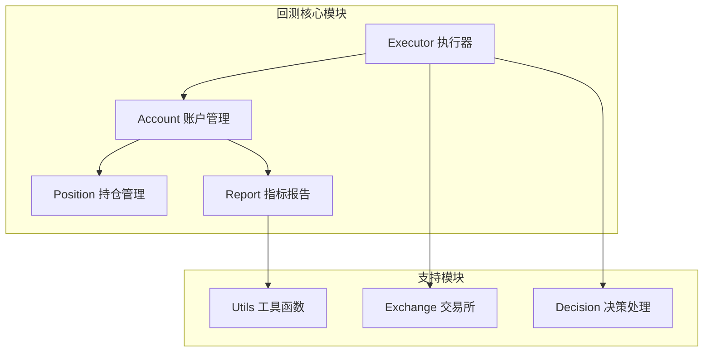
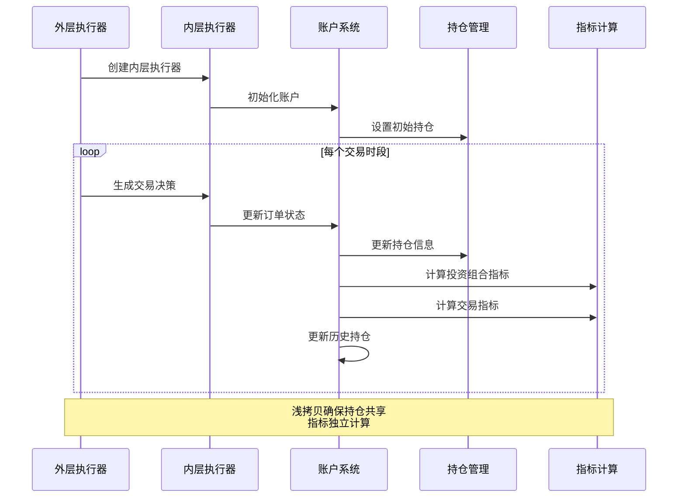
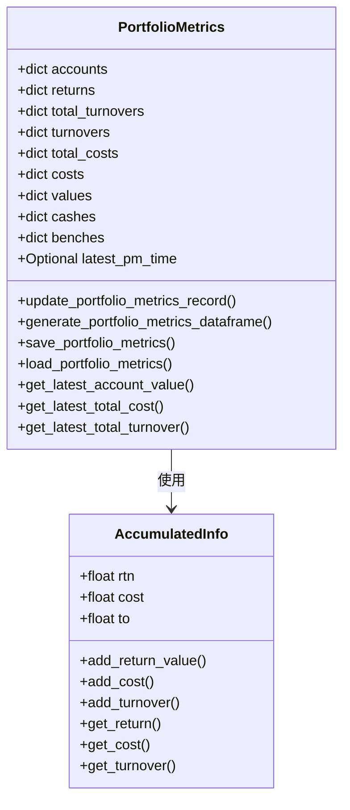
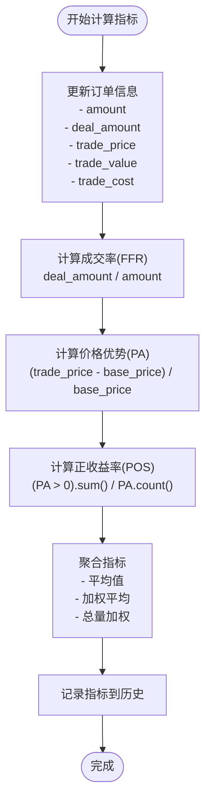
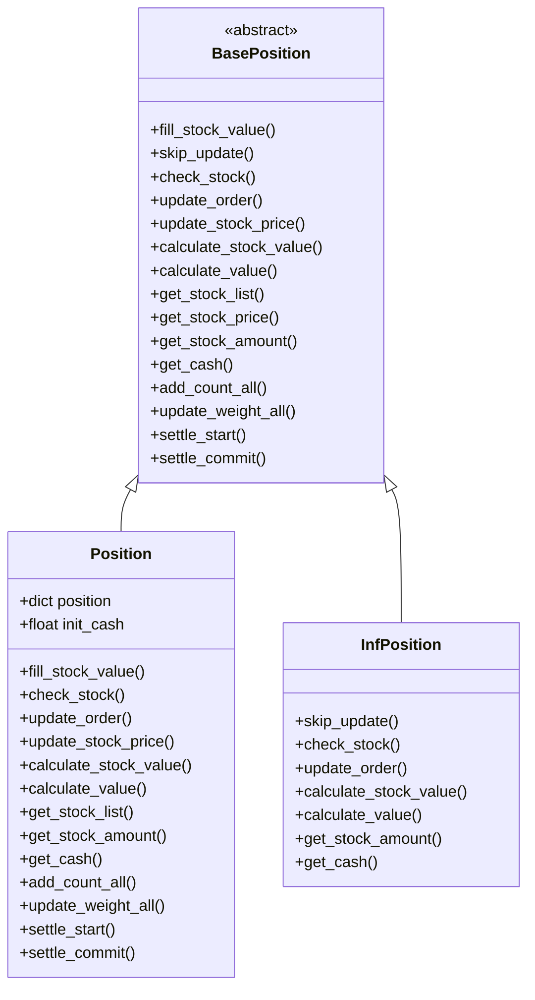
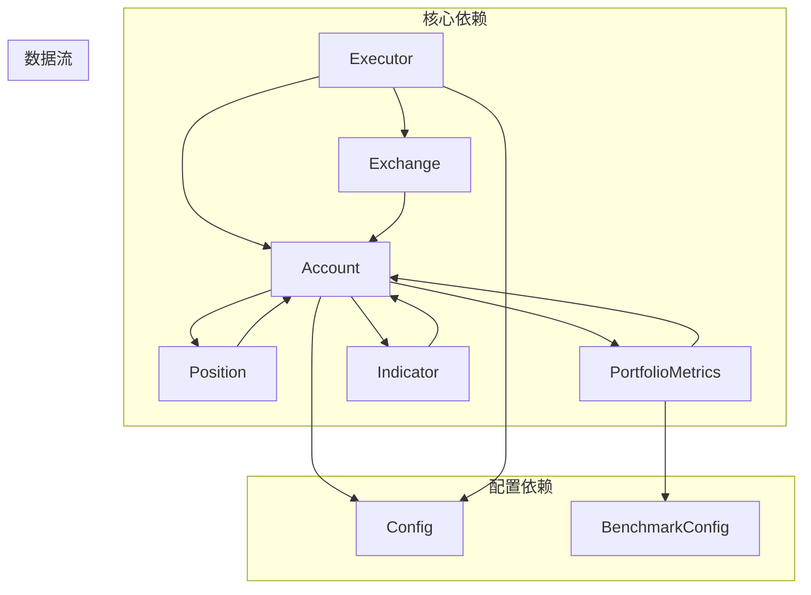

# QLib账户管理系统

<cite>
**本文档中引用的文件**
- [account.py](file://qlib/backtest/account.py)
- [executor.py](file://qlib/backtest/executor.py)
- [report.py](file://qlib/backtest/report.py)
- [position.py](file://qlib/backtest/position.py)
- [workflow_config_lightgbm_Alpha360.yaml](file://examples/benchmarks/LightGBM/workflow_config_lightgbm_Alpha360.yaml)
- [prepare_riskdata.py](file://examples/portfolio/prepare_riskdata.py)
- [workflow.py](file://examples/highfreq/workflow.py)
</cite>

## 目录
1. [简介](#简介)
2. [项目结构](#项目结构)
3. [核心组件](#核心组件)
4. [架构概览](#架构概览)
5. [详细组件分析](#详细组件分析)
6. [依赖关系分析](#依赖关系分析)
7. [性能考虑](#性能考虑)
8. [故障排除指南](#故障排除指南)
9. [结论](#结论)

## 简介

QLib账户管理系统是一个功能强大的量化交易平台，专门设计用于回测和实时交易。该系统通过Account类管理资金、持仓和交易记录，通过PortfolioMetrics计算投资组合指标，通过Indicator类计算交易相关指标，为用户提供全面的投资组合分析和风险管理功能。

系统的核心设计理念是支持多层次执行（Nested Execution），其中浅拷贝机制确保不同层级的执行器能够正确共享持仓信息，同时维护各自的指标计算独立性。这种设计使得复杂的多时间框架交易策略成为可能，同时保持数据的一致性和准确性。

## 项目结构

QLib账户管理系统的核心文件组织如下：



**图表来源**
- [account.py](file://qlib/backtest/account.py#L1-L50)
- [executor.py](file://qlib/backtest/executor.py#L1-L50)
- [report.py](file://qlib/backtest/report.py#L1-L50)
- [position.py](file://qlib/backtest/position.py#L1-L50)

**章节来源**
- [account.py](file://qlib/backtest/account.py#L1-L418)
- [executor.py](file://qlib/backtest/executor.py#L1-L629)

## 核心组件

### Account类 - 账户管理核心

Account类是整个账户管理系统的核心，负责管理资金、持仓和交易记录。它提供了以下关键功能：

1. **初始化参数管理**：
   - `init_cash`: 初始资金，默认为10亿
   - `position_dict`: 初始持仓字典
   - `freq`: 交易频率，默认为"day"
   - `benchmark_config`: 基准配置
   - `pos_type`: 持仓类型，默认为"Position"
   - `port_metr_enabled`: 是否启用投资组合指标

2. **状态管理**：
   - 当前持仓：`current_position`
   - 累计信息：`accum_info`
   - 投资组合指标：`portfolio_metrics`
   - 历史持仓：`hist_positions`
   - 交易指标：`indicator`

3. **主要方法**：
   - `update_order()`: 更新订单状态
   - `update_current_position()`: 更新当前持仓
   - `update_portfolio_metrics()`: 更新投资组合指标
   - `update_indicator()`: 更新交易指标
   - `update_bar_end()`: 在每个交易时段结束时更新账户状态

### AccumulatedInfo类 - 累计信息管理

AccumulatedInfo类专门用于跟踪累计的交易指标：

```python
class AccumulatedInfo:
    def __init__(self) -> None:
        self.reset()
    
    def reset(self) -> None:
        self.rtn: float = 0.0  # 累计回报，不考虑成本
        self.cost: float = 0.0  # 累计成本
        self.to: float = 0.0   # 累计换手率
    
    def add_return_value(self, value: float) -> None:
        self.rtn += value
    
    def add_cost(self, value: float) -> None:
        self.cost += value
    
    def add_turnover(self, value: float) -> None:
        self.to += value
```

**章节来源**
- [account.py](file://qlib/backtest/account.py#L30-L80)
- [account.py](file://qlib/backtest/account.py#L82-L150)

## 架构概览

QLib账户管理系统采用分层架构设计，支持嵌套执行模式：



**图表来源**
- [executor.py](file://qlib/backtest/executor.py#L300-L400)
- [account.py](file://qlib/backtest/account.py#L380-L420)

## 详细组件分析

### PortfolioMetrics - 投资组合指标计算

PortfolioMetrics类负责计算和跟踪投资组合的各种指标：



**图表来源**
- [report.py](file://qlib/backtest/report.py#L25-L100)
- [account.py](file://qlib/backtest/account.py#L30-L80)

#### 主要指标计算

1. **收益计算**：
   ```python
   now_earning = now_account_value - last_account_value
   return_rate = (now_earning + now_cost) / last_account_value
   ```

2. **换手率计算**：
   ```python
   turnover_rate = now_turnover / last_account_value
   ```

3. **成本计算**：
   ```python
   cost_rate = now_cost / last_account_value
   ```

### Indicator - 交易指标计算

Indicator类专注于计算交易相关的指标，包括价格优势(PA)、成交率(FFR)和正收益率(POS)：



**图表来源**
- [report.py](file://qlib/backtest/report.py#L248-L350)
- [report.py](file://qlib/backtest/report.py#L553-L641)

#### 关键指标定义

| 指标名称 | 描述 | 计算公式 |
|---------|------|----------|
| FFR | 成交率 | 实际成交数量 / 目标数量 |
| PA | 价格优势 | (交易价格 - 基准价格) / 基准价格 |
| POS | 正收益率 | 正价格优势比例 |
| amount | 目标数量 | 外层策略给出的目标数量 |
| deal_amount | 实际成交数量 | 实际成交的数量 |
| trade_value | 交易金额 | 交易价值 |

### Position - 持仓管理

Position类实现了灵活的持仓管理机制：



**图表来源**
- [position.py](file://qlib/backtest/position.py#L15-L150)
- [position.py](file://qlib/backtest/position.py#L200-L350)
- [position.py](file://qlib/backtest/position.py#L400-L566)

**章节来源**
- [report.py](file://qlib/backtest/report.py#L25-L200)
- [report.py](file://qlib/backtest/report.py#L248-L652)
- [position.py](file://qlib/backtest/position.py#L15-L200)

## 依赖关系分析

QLib账户管理系统的组件间存在复杂的依赖关系：



**图表来源**
- [account.py](file://qlib/backtest/account.py#L1-L30)
- [executor.py](file://qlib/backtest/executor.py#L1-L30)

### 浅拷贝机制

在嵌套执行模式下，系统使用浅拷贝来确保持仓信息的正确共享：

```python
# 在NestedExecutor中
self.trade_account: Account = (
    copy.copy(common_infra.get("trade_account"))
    if copy_trade_account
    else common_infra.get("trade_account")
)
```

这种设计确保：
1. **持仓共享**：所有层级共享相同的持仓对象
2. **指标独立**：每个层级维护自己的指标计算
3. **内存效率**：避免重复的数据复制

**章节来源**
- [executor.py](file://qlib/backtest/executor.py#L150-L200)
- [executor.py](file://qlib/backtest/executor.py#L300-L400)

## 性能考虑

### 内存优化

1. **浅拷贝策略**：在嵌套执行中使用浅拷贝而非深拷贝
2. **历史数据管理**：定期清理过期的历史持仓数据
3. **指标缓存**：缓存频繁访问的指标计算结果

### 计算优化

1. **批量处理**：支持批量订单处理以提高效率
2. **延迟计算**：仅在需要时才计算复杂的指标
3. **并行化**：支持多线程并行处理不同的交易时段

### 数据结构选择

- 使用OrderedDict来保持指标的时间顺序
- 采用DataFrame存储历史数据以便快速查询
- 使用numpy数组进行数值计算优化

## 故障排除指南

### 常见问题及解决方案

1. **持仓数据不一致**
   - 检查浅拷贝设置是否正确
   - 验证嵌套执行器的配置

2. **指标计算错误**
   - 确认基准配置的正确性
   - 检查时间频率的匹配

3. **内存泄漏**
   - 定期清理历史数据
   - 监控持仓对象的生命周期

### 调试技巧

1. **启用详细日志**：设置verbose=True获取详细的执行信息
2. **检查中间状态**：定期打印账户和持仓的状态
3. **验证数据质量**：确保价格数据的完整性和准确性

**章节来源**
- [account.py](file://qlib/backtest/account.py#L380-L420)
- [executor.py](file://qlib/backtest/executor.py#L100-L150)

## 结论

QLib账户管理系统是一个功能完善、设计精良的量化交易平台。通过Account类的集中管理、PortfolioMetrics的全面指标计算、Indicator的精确交易分析以及Position的灵活持仓管理，系统为用户提供了强大的投资组合管理和风险控制能力。

系统的最大亮点在于其嵌套执行架构，通过浅拷贝机制实现了持仓共享和指标独立计算的完美平衡。这种设计不仅保证了数据的一致性，还支持复杂的多时间框架交易策略，为量化研究和实盘交易提供了坚实的基础。

未来的发展方向可以考虑：
1. 增强实时交易支持
2. 优化大规模数据处理性能
3. 扩展更多的交易策略接口
4. 改进可视化和报告功能