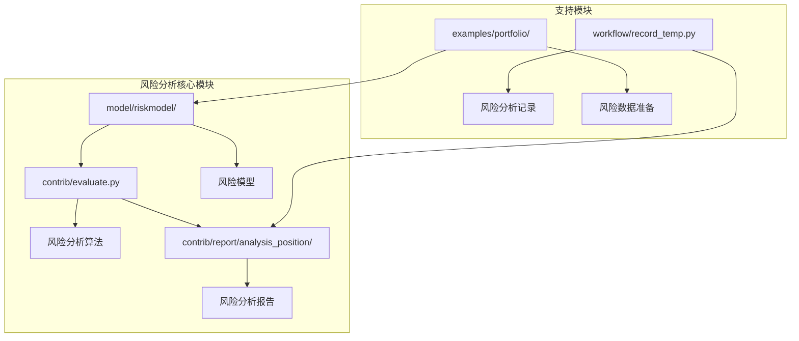
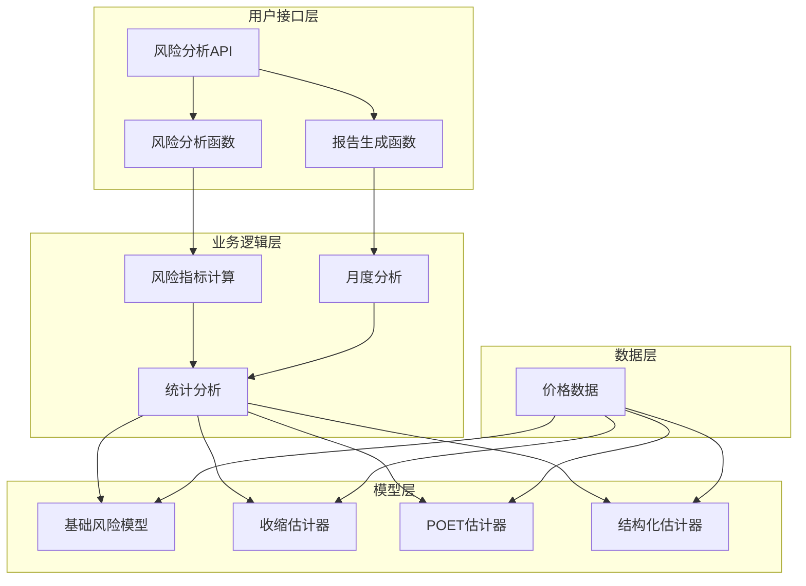
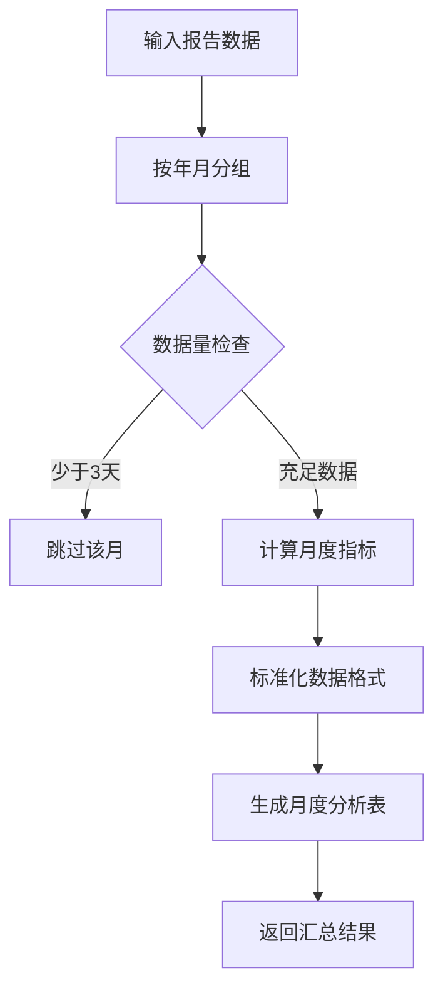
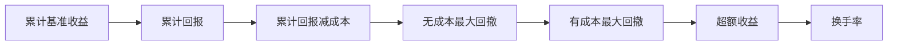
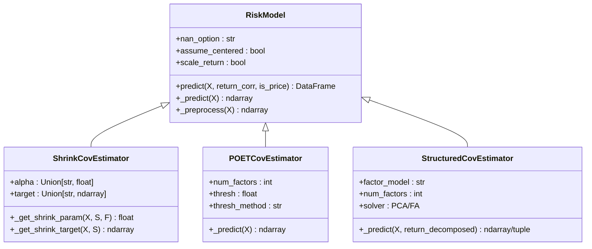
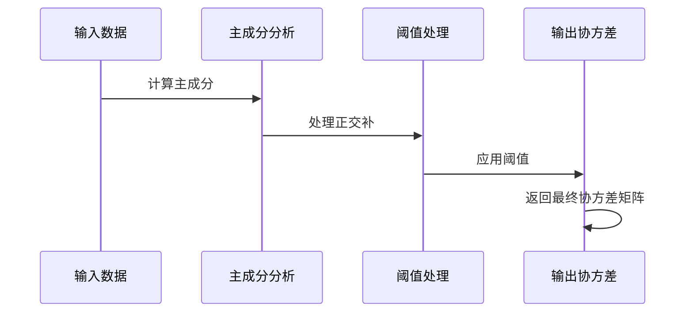
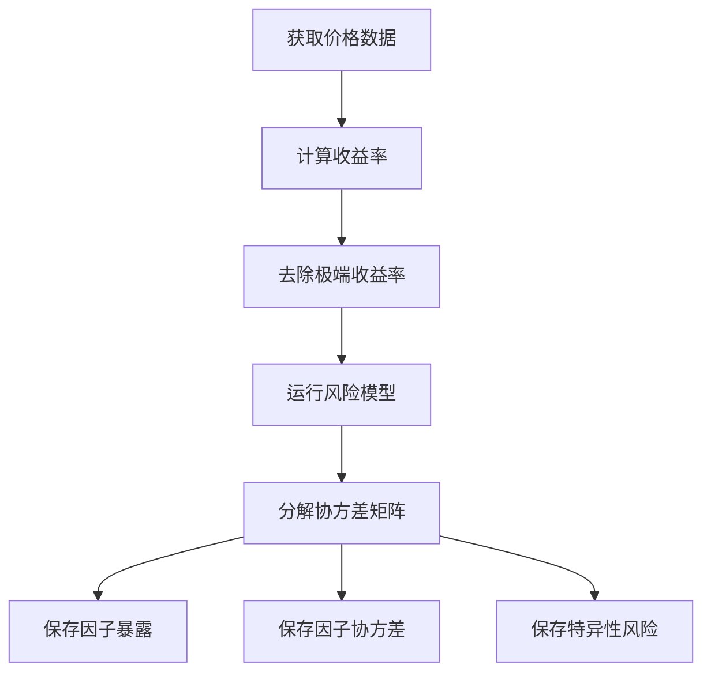
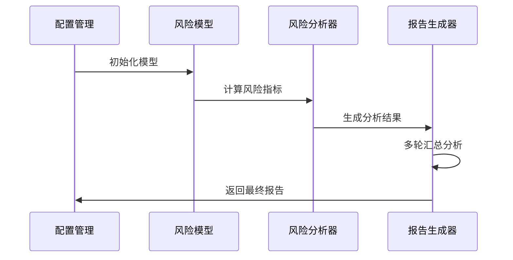

# QLib风险分析功能综合文档

<cite>
**本文档中引用的文件**
- [risk_analysis.py](file://qlib/contrib/report/analysis_position/risk_analysis.py)
- [evaluate.py](file://qlib/contrib/evaluate.py)
- [base.py](file://qlib/model/riskmodel/base.py)
- [shrink.py](file://qlib/model/riskmodel/shrink.py)
- [poet.py](file://qlib/model/riskmodel/poet.py)
- [structured.py](file://qlib/model/riskmodel/structured.py)
- [prepare_riskdata.py](file://examples/portfolio/prepare_riskdata.py)
- [report.py](file://qlib/contrib/report/analysis_position/report.py)
- [record_temp.py](file://qlib/workflow/record_temp.py)
</cite>

## 目录
1. [简介](#简介)
2. [项目结构](#项目结构)
3. [核心组件](#核心组件)
4. [架构概览](#架构概览)
5. [详细组件分析](#详细组件分析)
6. [风险模型实现](#风险模型实现)
7. [风险分析流程](#风险分析流程)
8. [性能考虑](#性能考虑)
9. [故障排除指南](#故障排除指南)
10. [结论](#结论)

## 简介

QLib是一个面向量化投资研究的系统框架，其风险分析功能提供了全面的投资组合风险评估能力。该功能支持多种风险指标计算，包括波动率、夏普比率、最大回撤等，并能够按时间周期进行风险分析。本文档详细介绍了QLib风险分析功能的实现机制、数据结构和使用方法。

## 项目结构

QLib的风险分析功能主要分布在以下几个关键模块中：



**图表来源**
- [evaluate.py](file://qlib/contrib/evaluate.py#L1-L50)
- [risk_analysis.py](file://qlib/contrib/report/analysis_position/risk_analysis.py#L1-L30)

**章节来源**
- [evaluate.py](file://qlib/contrib/evaluate.py#L1-L100)
- [risk_analysis.py](file://qlib/contrib/report/analysis_position/risk_analysis.py#L1-L298)

## 核心组件

QLib风险分析功能的核心组件包括：

### 1. 风险分析算法模块
负责计算各种风险指标，包括：
- 年化收益率
- 波动率（标准差）
- 夏普比率
- 最大回撤
- 信息比率

### 2. 风险模型模块
提供多种风险模型实现：
- 基础风险模型
- 收缩估计器
- POET估计器
- 结构化协方差估计器

### 3. 报告生成模块
生成可视化风险分析报告，支持：
- 月度风险分析
- 多频度风险分析
- 可视化图表生成

**章节来源**
- [evaluate.py](file://qlib/contrib/evaluate.py#L25-L100)
- [base.py](file://qlib/model/riskmodel/base.py#L1-L50)

## 架构概览

QLib风险分析功能采用分层架构设计：



**图表来源**
- [evaluate.py](file://qlib/contrib/evaluate.py#L25-L80)
- [base.py](file://qlib/model/riskmodel/base.py#L10-L50)

## 详细组件分析

### 风险分析核心函数

风险分析的核心函数`risk_analysis`提供了灵活的风险指标计算能力：

```python
def risk_analysis(r, N: int = None, freq: str = "day", mode: Literal["sum", "product"] = "sum"):
    """风险分析函数
    
    参数:
    r: 日收益率序列
    N: 年化缩放因子
    freq: 分析频率
    mode: 累积模式(sum/product)
    """
```

该函数支持两种累积模式：
- **sum模式**: 使用算术累积计算线性收益
- **product模式**: 使用几何累积计算复合收益

**章节来源**
- [evaluate.py](file://qlib/contrib/evaluate.py#L25-L80)

### 月度风险分析实现

月度风险分析通过时间分组实现：



**图表来源**
- [risk_analysis.py](file://qlib/contrib/report/analysis_position/risk_analysis.py#L50-L90)

**章节来源**
- [risk_analysis.py](file://qlib/contrib/report/analysis_position/risk_analysis.py#L50-L120)

### 可视化报告生成

风险分析报告包含多个子图，展示不同维度的风险指标：



**图表来源**
- [report.py](file://qlib/contrib/report/analysis_position/report.py#L80-L150)

**章节来源**
- [report.py](file://qlib/contrib/report/analysis_position/report.py#L1-L100)

## 风险模型实现

QLib提供了四种主要的风险模型实现：

### 基础风险模型



**图表来源**
- [base.py](file://qlib/model/riskmodel/base.py#L10-L50)
- [shrink.py](file://qlib/model/riskmodel/shrink.py#L1-L50)
- [poet.py](file://qlib/model/riskmodel/poet.py#L1-L30)
- [structured.py](file://qlib/model/riskmodel/structured.py#L1-L50)

### 收缩估计器

收缩估计器通过收缩参数将样本协方差矩阵向目标矩阵收缩：

```python
# 收缩公式: S_hat = (1 - alpha) * S + alpha * F
# 其中alpha是收缩参数，F是收缩目标
```

支持多种收缩目标：
- **常数方差**: 假设股票具有相同的常数方差和零相关性
- **常数相关性**: 假设股票有不同的方差但相等的相关性
- **单因子模型**: 假设单因子模型作为收缩目标

**章节来源**
- [shrink.py](file://qlib/model/riskmodel/shrink.py#L1-L100)

### POET估计器

POET（主成分正交补阈值）估计器使用主成分分析和阈值处理来估计协方差矩阵：



**图表来源**
- [poet.py](file://qlib/model/riskmodel/poet.py#L30-L80)

**章节来源**
- [poet.py](file://qlib/model/riskmodel/poet.py#L1-L84)

### 结构化协方差估计器

结构化协方差估计器假设观测值可以由多个因子预测：

```python
# 结构化协方差公式: cov(X.T) = F @ cov(B.T) @ F.T + diag(var(U))
# 其中X是观测值，F是因子暴露，B是回归系数，U是残差
```

支持两种因子模型：
- **PCA**: 主成分分析
- **FA**: 因素分析

**章节来源**
- [structured.py](file://qlib/model/riskmodel/structured.py#L1-L95)

## 风险分析流程

### 数据准备阶段

风险分析的数据准备通过`prepare_riskdata.py`脚本完成：



**图表来源**
- [prepare_riskdata.py](file://examples/portfolio/prepare_riskdata.py#L15-L50)

**章节来源**
- [prepare_riskdata.py](file://examples/portfolio/prepare_riskdata.py#L1-L53)

### 风险分析执行

风险分析通过多轮执行实现稳健性评估：



**图表来源**
- [record_temp.py](file://qlib/workflow/record_temp.py#L610-L680)

**章节来源**
- [record_temp.py](file://qlib/workflow/record_temp.py#L610-L687)

## 性能考虑

### 内存优化

风险分析功能在处理大规模数据时采用了多种内存优化策略：

1. **分批处理**: 将大数据集分批处理，避免内存溢出
2. **稀疏矩阵**: 对协方差矩阵使用稀疏表示
3. **缓存机制**: 实现智能缓存以减少重复计算

### 计算效率

1. **向量化运算**: 使用NumPy数组进行批量计算
2. **并行处理**: 支持多进程并行计算
3. **算法优化**: 选择高效的数学算法

## 故障排除指南

### 常见问题及解决方案

1. **NaN值处理**
   - 检查数据预处理步骤
   - 调整`nan_option`参数设置

2. **收敛问题**
   - 增加样本数量
   - 调整收缩参数

3. **性能问题**
   - 减少因子数量
   - 使用更简单的模型

**章节来源**
- [base.py](file://qlib/model/riskmodel/base.py#L100-L148)

## 结论

QLib的风险分析功能提供了完整而强大的投资组合风险管理工具。通过多种风险模型和灵活的分析方法，用户可以深入理解投资组合的风险特征。该功能的设计充分考虑了实际应用中的性能和可扩展性需求，为量化投资研究提供了坚实的基础。

主要特点包括：
- 多种风险模型支持
- 灵活的分析频率设置
- 完整的可视化报告
- 高效的计算性能
- 易于扩展的架构设计

通过合理使用这些功能，研究人员和投资者可以更好地理解和管理投资组合风险，提高决策质量。