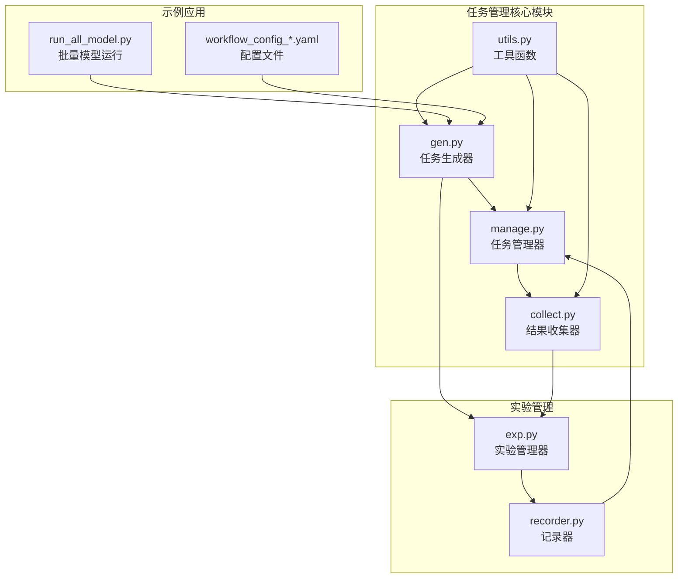
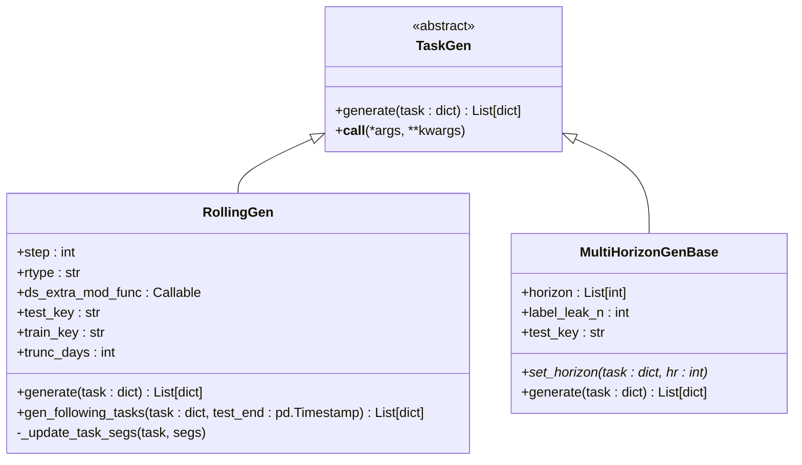
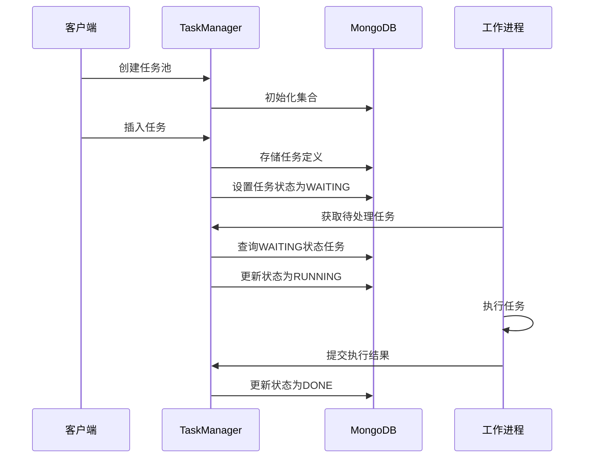
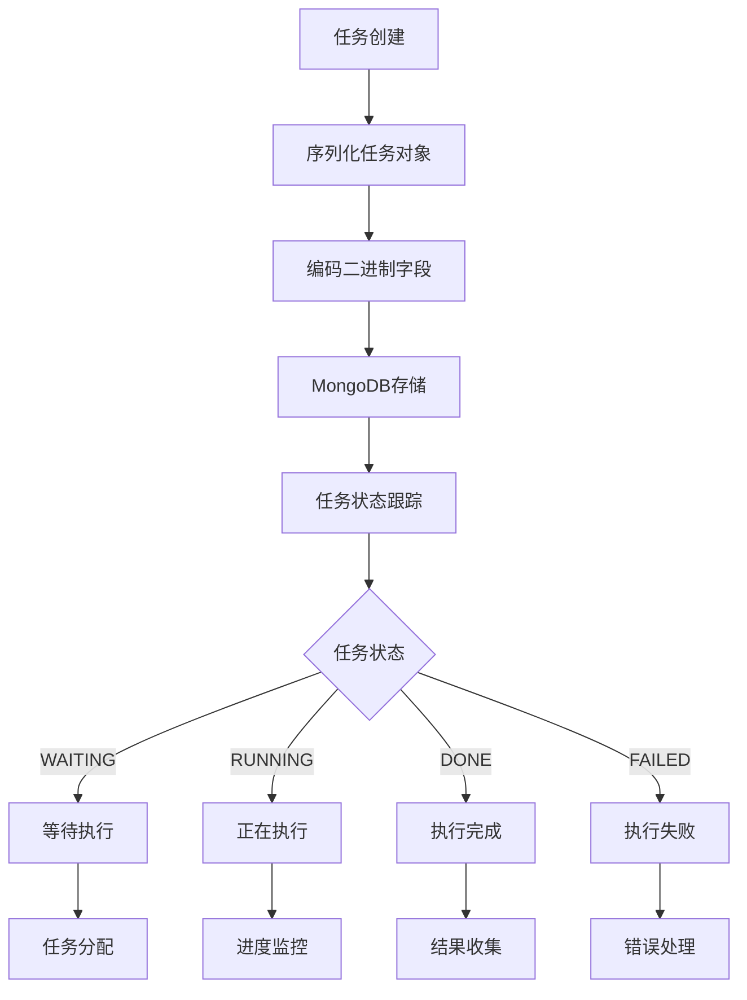
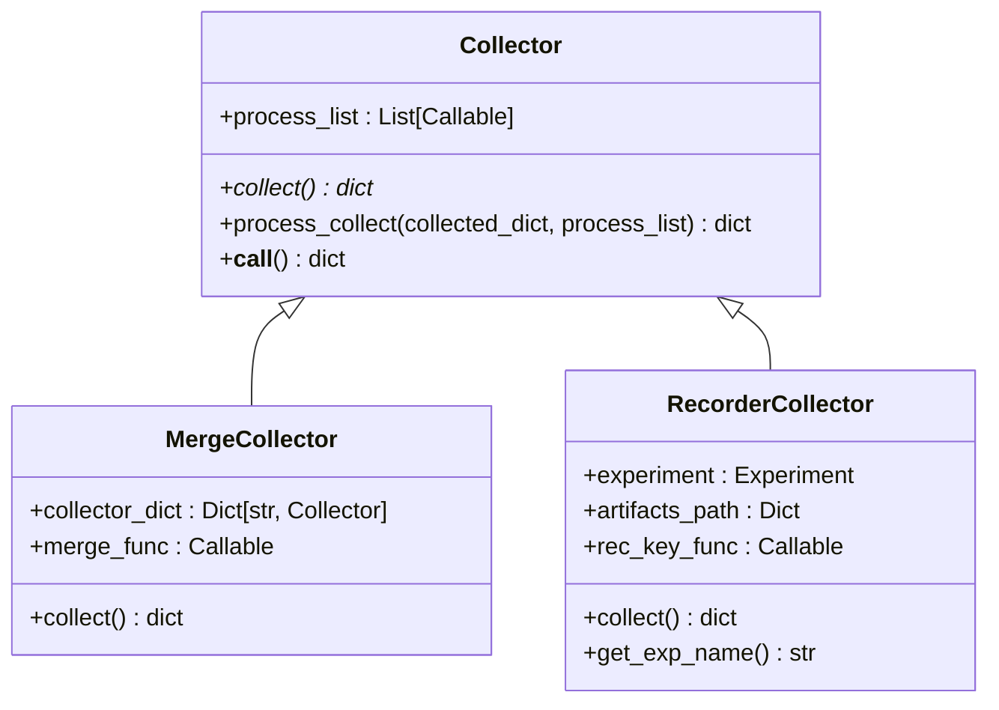
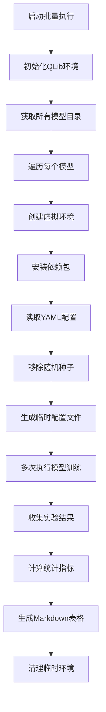
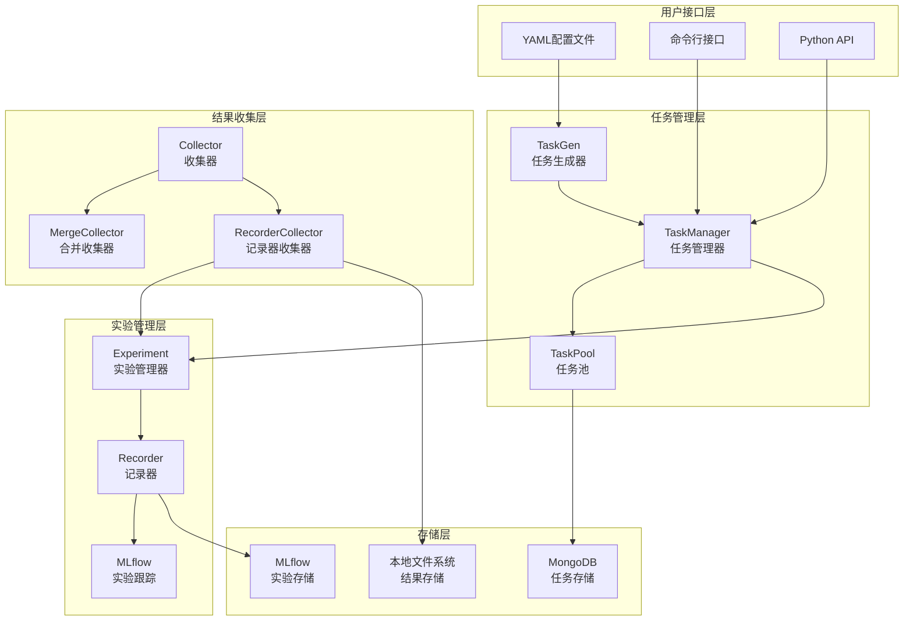
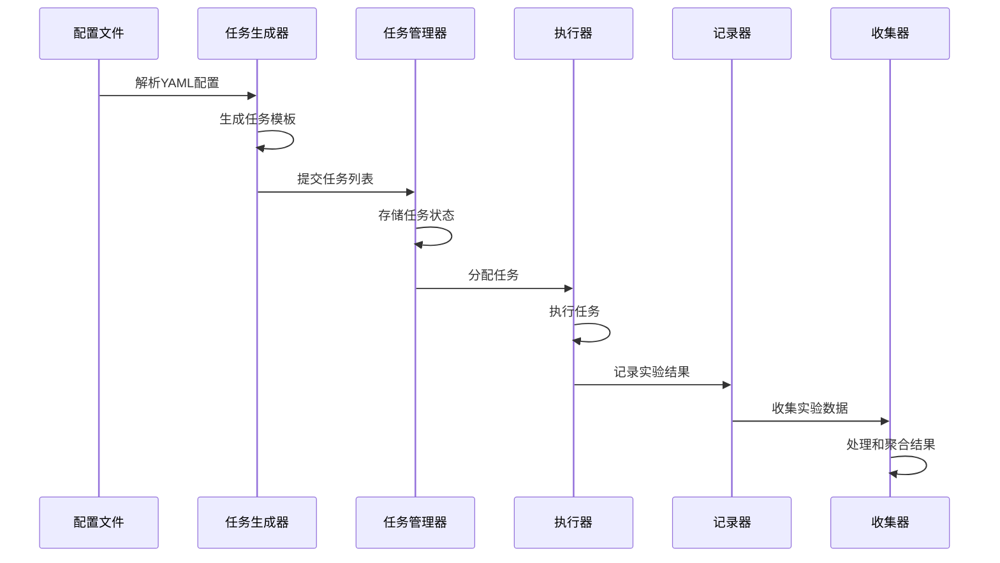

# Qlib任务生成与管理系统设计与实现

<cite>
**本文档引用的文件**
- [gen.py](file://qlib/workflow/task/gen.py)
- [manage.py](file://qlib/workflow/task/manage.py)
- [collect.py](file://qlib/workflow/task/collect.py)
- [utils.py](file://qlib/workflow/task/utils.py)
- [run_all_model.py](file://examples/run_all_model.py)
- [workflow_config_lightgbm_Alpha158.yaml](file://examples/benchmarks/LightGBM/workflow_config_lightgbm_Alpha158.yaml)
- [exp.py](file://qlib/workflow/exp.py)
- [recorder.py](file://qlib/workflow/recorder.py)
</cite>

## 目录
1. [简介](#简介)
2. [项目结构概览](#项目结构概览)
3. [核心组件分析](#核心组件分析)
4. [任务生成系统](#任务生成系统)
5. [任务管理系统](#任务管理系统)
6. [结果收集系统](#结果收集系统)
7. [批量任务执行](#批量任务执行)
8. [架构设计](#架构设计)
9. [最佳实践](#最佳实践)
10. [故障排除指南](#故障排除指南)
11. [总结](#总结)

## 简介

Qlib任务生成与管理系统是一个高度模块化的框架，专门用于自动化金融机器学习实验的工作流程管理。该系统通过三个核心组件实现了从配置解析到任务执行再到结果收集的完整生命周期管理：`gen.py`负责任务模板的自动化生成，`manage.py`提供任务调度和执行控制，`collect.py`处理结果聚合和状态收集。

系统采用基于MongoDB的任务池管理机制，支持并发执行、错误处理、任务重试和资源隔离。通过YAML配置文件驱动的方式，用户可以轻松定义复杂的实验工作流，并实现批量化任务管理和结果分析。

## 项目结构概览

Qlib任务管理系统的核心文件组织结构如下：



**图表来源**
- [gen.py](file://qlib/workflow/task/gen.py#L1-L50)
- [manage.py](file://qlib/workflow/task/manage.py#L1-L50)
- [collect.py](file://qlib/workflow/task/collect.py#L1-L50)

## 核心组件分析

### 任务生成器（TaskGen）

任务生成器是整个系统的核心，负责根据模板生成不同变体的任务实例。它采用抽象基类设计模式，支持多种生成策略：



**图表来源**
- [gen.py](file://qlib/workflow/task/gen.py#L48-L101)
- [gen.py](file://qlib/workflow/task/gen.py#L120-L200)

### 任务管理器（TaskManager）

任务管理器提供MongoDB驱动的任务池管理功能，确保任务的唯一性和一致性：



**图表来源**
- [manage.py](file://qlib/workflow/task/manage.py#L50-L150)
- [manage.py](file://qlib/workflow/task/manage.py#L200-L300)

**章节来源**
- [gen.py](file://qlib/workflow/task/gen.py#L1-L352)
- [manage.py](file://qlib/workflow/task/manage.py#L1-L557)
- [collect.py](file://qlib/workflow/task/collect.py#L1-L259)

## 任务生成系统

### 滚动任务生成（RollingGen）

滚动任务生成器是最常用的任务生成策略，特别适用于时间序列数据的回测场景：

```python
# 示例：创建滚动任务生成器
rolling_gen = RollingGen(
    step=40,           # 每次滚动步长
    rtype='expanding', # 扩展型滚动
    test_key='test',   # 测试集键名
    train_key='train'  # 训练集键名
)

# 基于模板生成滚动任务
tasks = rolling_gen.generate(task_template)
```

滚动生成器的核心特性：
- **时间对齐**：自动调整时间段以匹配交易日历
- **未来信息泄露防护**：通过截断机制避免未来数据泄露
- **灵活的时间类型**：支持扩展型（expanding）和滑动型（sliding）两种滚动方式

### 多时长任务生成（MultiHorizonGenBase）

多时长任务生成器允许为同一模型生成不同预测时长的任务：

```python
# 示例：创建多时长生成器
horizon_gen = MultiHorizonGenBase(
    horizon=[5, 10, 20],     # 不同时长
    label_leak_n=2          # 标签泄露天数
)

# 生成多时长任务
tasks = horizon_gen.generate(task_template)
```

**章节来源**
- [gen.py](file://qlib/workflow/task/gen.py#L120-L352)

## 任务管理系统

### MongoDB集成

任务管理系统深度集成了MongoDB作为任务存储后端：



**图表来源**
- [manage.py](file://qlib/workflow/task/manage.py#L100-L200)

### 并发控制与错误处理

任务管理器提供了完善的并发控制和错误处理机制：

```python
# 任务状态常量
STATUS_WAITING = "waiting"      # 等待执行
STATUS_RUNNING = "running"      # 正在执行
STATUS_DONE = "done"           # 执行完成
STATUS_PART_DONE = "part_done" # 部分完成
```

关键特性：
- **原子性操作**：MongoDB的原子更新保证任务状态的一致性
- **重试机制**：支持任务失败后的自动重试
- **资源隔离**：每个任务独立的执行环境
- **进度跟踪**：实时监控任务执行状态

**章节来源**
- [manage.py](file://qlib/workflow/task/manage.py#L50-L557)

## 结果收集系统

### 收集器架构

结果收集系统采用可插拔的架构设计，支持多种数据源和处理策略：



**图表来源**
- [collect.py](file://qlib/workflow/task/collect.py#L15-L80)
- [collect.py](file://qlib/workflow/task/collect.py#L100-L150)

### 实验结果收集

RecorderCollector专门用于收集来自实验的结果数据：

```python
# 示例：创建实验结果收集器
collector = RecorderCollector(
    experiment="my_experiment",
    artifacts_path={
        "pred": "pred.pkl",      # 预测结果
        "IC": "sig_analysis/ic.pkl"  # IC分析
    },
    status={Recorder.STATUS_FI}  # 只收集已完成的记录
)

# 收集并处理结果
results = collector.collect()
processed_results = collector.process_collect(results, process_list)
```

**章节来源**
- [collect.py](file://qlib/workflow/task/collect.py#L1-L259)

## 批量任务执行

### run_all_model.py实现

`run_all_model.py`展示了如何使用任务管理系统进行大规模模型训练：



**图表来源**
- [run_all_model.py](file://examples/run_all_model.py#L100-L200)

### 自动化环境管理

系统提供了完整的环境管理功能：

```python
# 虚拟环境创建
temp_dir, env_path, python_path, conda_activate = create_env()

# 依赖安装
execute(f"{python_path} -m pip install -r {req_path}")

# 模型训练执行
execute(f"{python_path} {env_path / 'bin' / 'qrun'} {yaml_path} {fn} {exp_folder_name}")
```

关键特性：
- **环境隔离**：每个模型在独立的虚拟环境中运行
- **依赖管理**：自动安装模型特定的依赖包
- **资源清理**：训练完成后自动清理临时环境
- **错误恢复**：支持部分失败时的继续执行

**章节来源**
- [run_all_model.py](file://examples/run_all_model.py#L1-L404)

## 架构设计

### 整体架构图



**图表来源**
- [gen.py](file://qlib/workflow/task/gen.py#L1-L50)
- [manage.py](file://qlib/workflow/task/manage.py#L1-L50)
- [exp.py](file://qlib/workflow/exp.py#L1-L50)

### 数据流架构



**图表来源**
- [gen.py](file://qlib/workflow/task/gen.py#L20-L50)
- [manage.py](file://qlib/workflow/task/manage.py#L100-L200)
- [collect.py](file://qlib/workflow/task/collect.py#L50-L100)

## 最佳实践

### 任务配置优化

1. **合理设置滚动步长**：
```yaml
# 推荐的滚动配置
task:
  dataset:
    kwargs:
      segments:
        train: [2008-01-01, 2014-12-31]
        valid: [2015-01-01, 2016-12-31]
        test: [2017-01-01, 2020-08-01]
```

2. **时间对齐配置**：
```python
# 使用TimeAdjuster确保时间对齐
ta = TimeAdjuster(future=True)
segments = ta.align_seg(original_segments)
```

### 错误处理策略

1. **任务重试机制**：
```python
# 在任务管理器中实现重试
def retry_failed_tasks(max_retries=3):
    for attempt in range(max_retries):
        try:
            task = task_manager.get_waiting_task()
            if task:
                execute_task(task)
                break
        except Exception as e:
            if attempt == max_retries - 1:
                task_manager.mark_failed(task)
            else:
                time.sleep(2 ** attempt)  # 指数退避
```

2. **超时控制**：
```python
# 设置任务超时
import signal

def timeout_handler(signum, frame):
    raise TimeoutError("Task execution timed out")

signal.signal(signal.SIGALRM, timeout_handler)
signal.alarm(3600)  # 1小时超时
```

### 资源隔离最佳实践

1. **内存管理**：
```python
# 使用上下文管理器确保资源释放
@contextmanager
def managed_environment():
    env = create_env()
    try:
        yield env
    finally:
        cleanup_env(env)
```

2. **并发控制**：
```python
# 限制并发任务数量
from concurrent.futures import ThreadPoolExecutor

executor = ThreadPoolExecutor(max_workers=4)
futures = [executor.submit(execute_task, task) for task in tasks]
results = [f.result() for f in futures]
```

## 故障排除指南

### 常见问题及解决方案

1. **MongoDB连接问题**：
```python
# 检查MongoDB配置
try:
    client = MongoClient(cfg["task_url"])
    db = client.get_database(name=cfg["task_db_name"])
    print("MongoDB连接成功")
except Exception as e:
    print(f"MongoDB连接失败: {e}")
```

2. **任务状态不一致**：
```python
# 清理悬挂任务
def clean_hanging_tasks():
    hanging_tasks = task_manager.query({"status": "running"})
    for task in hanging_tasks:
        if is_task_stuck(task):
            task_manager.reset_waiting(task)
```

3. **内存不足问题**：
```python
# 监控内存使用
import psutil

def check_memory_usage():
    memory_percent = psutil.virtual_memory().percent
    if memory_percent > 90:
        raise MemoryError("内存使用率过高")
```

### 调试技巧

1. **启用详细日志**：
```python
import logging
logging.getLogger("qlib.workflow.task").setLevel(logging.DEBUG)
```

2. **任务状态监控**：
```python
# 实时监控任务状态
def monitor_task_status():
    while True:
        stats = task_manager.get_task_stats()
        print(f"等待: {stats['waiting']}, 运行: {stats['running']}, 完成: {stats['done']}")
        time.sleep(60)
```

3. **性能分析**：
```python
# 使用TimeInspector进行性能分析
with TimeInspector.logt("任务执行时间"):
    result = execute_task(task)
```

**章节来源**
- [utils.py](file://qlib/workflow/task/utils.py#L20-L50)
- [manage.py](file://qlib/workflow/task/manage.py#L300-L400)

## 总结

Qlib任务生成与管理系统通过模块化设计实现了金融机器学习实验的全生命周期管理。系统的核心优势包括：

1. **高度可扩展性**：通过抽象基类设计，支持自定义任务生成策略
2. **强大的并发能力**：基于MongoDB的任务池管理确保高并发执行
3. **完善的错误处理**：多层次的错误处理和重试机制
4. **灵活的配置系统**：YAML配置文件驱动，支持复杂工作流定义
5. **全面的结果收集**：多种收集器支持不同类型的实验结果

该系统特别适合需要大规模模型比较和回测验证的金融研究场景，能够显著提高实验效率和结果可靠性。通过合理的配置和最佳实践的应用，用户可以构建稳定可靠的任务管理系统，支撑复杂的金融机器学习工作流。