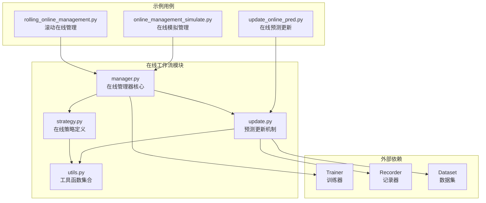
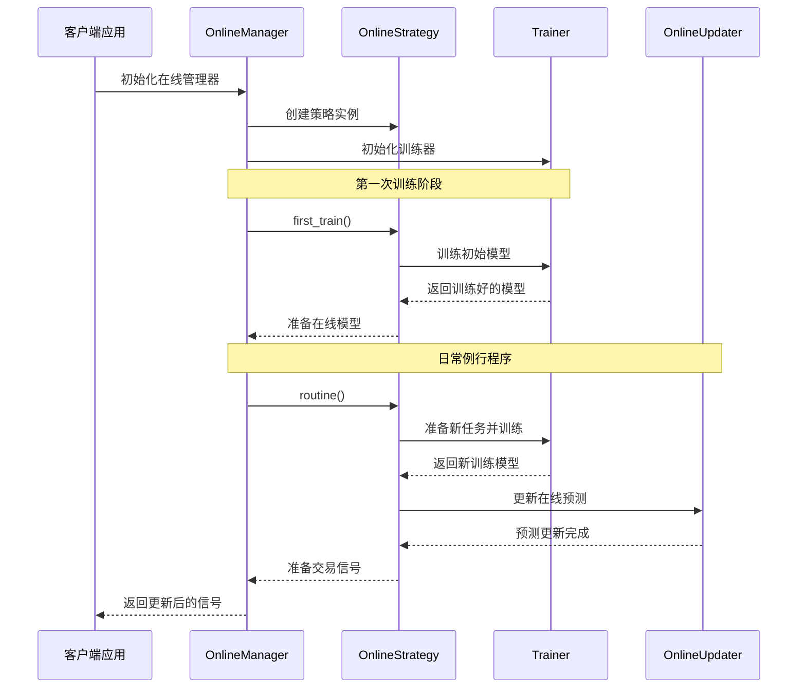
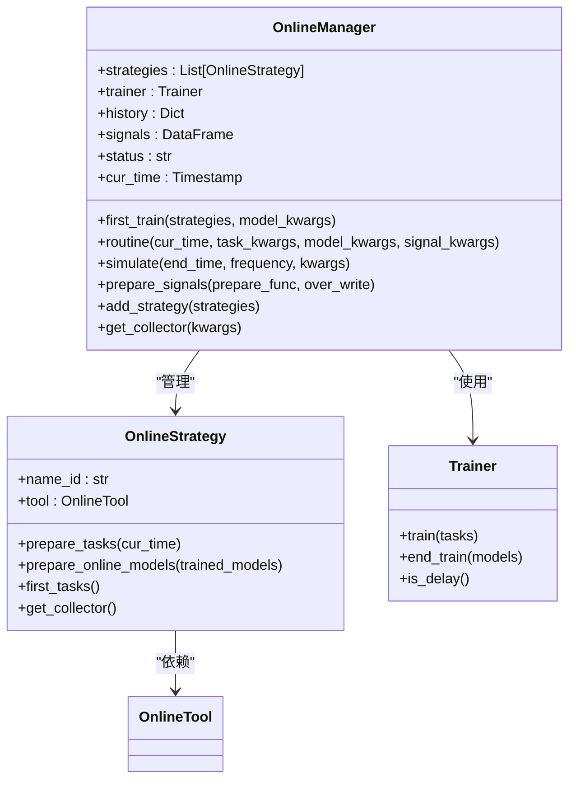
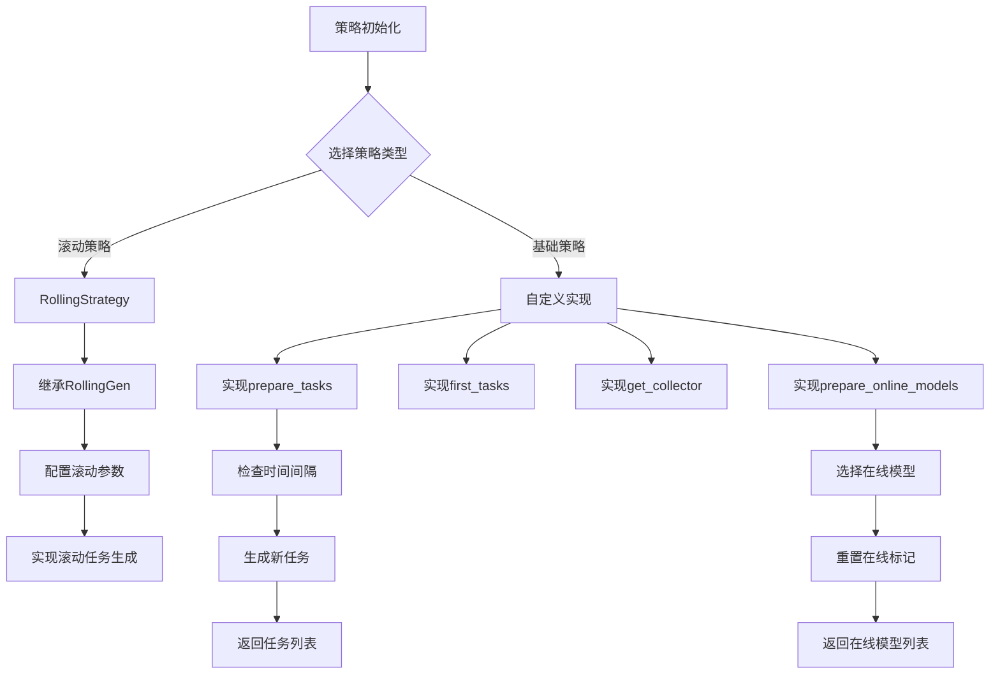
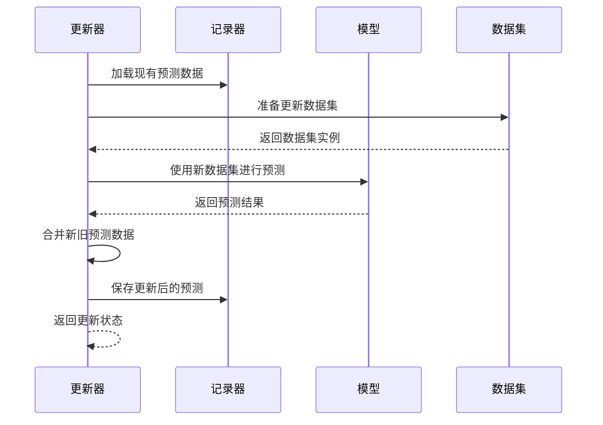
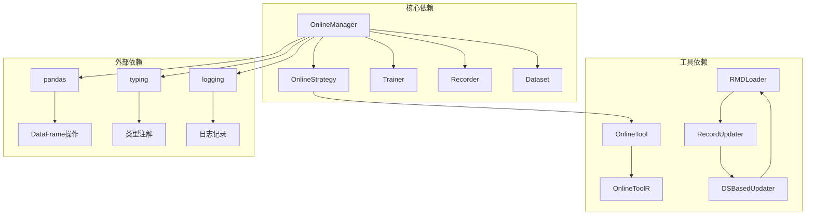

# 在线工作流管理

<cite>
**本文档引用的文件**
- [manager.py](file://qlib/workflow/online/manager.py)
- [update.py](file://qlib/workflow/online/update.py)
- [strategy.py](file://qlib/workflow/online/strategy.py)
- [utils.py](file://qlib/workflow/online/utils.py)
- [rolling_online_management.py](file://examples/online_srv/rolling_online_management.py)
- [update_online_pred.py](file://examples/online_srv/update_online_pred.py)
- [online_management_simulate.py](file://examples/online_srv/online_management_simulate.py)
</cite>

## 目录
1. [简介](#简介)
2. [项目结构](#项目结构)
3. [核心组件](#核心组件)
4. [架构概览](#架构概览)
5. [详细组件分析](#详细组件分析)
6. [依赖关系分析](#依赖关系分析)
7. [性能考虑](#性能考虑)
8. [故障排除指南](#故障排除指南)
9. [结论](#结论)

## 简介

QLib的在线工作流管理系统是一个高度集成的框架，专门设计用于管理机器学习模型的在线部署、更新和监控。该系统提供了完整的模型生命周期管理功能，包括模型训练、热更新、版本控制、流量切换策略以及预测更新机制。

系统的核心设计理念是支持动态的在线策略执行，能够在不中断服务的情况下进行模型的无缝切换和更新。通过OnlineManager、OnlineStrategy和各种更新器的协同工作，系统能够实现实时的预测更新和在线风险控制。

## 项目结构

QLib在线工作流管理系统的文件组织结构清晰，主要分为以下几个层次：

**图表来源**
- [manager.py](file://qlib/workflow/online/manager.py#L1-L50)
- [strategy.py](file://qlib/workflow/online/strategy.py#L1-L50)
- [update.py](file://qlib/workflow/online/update.py#L1-L50)

**章节来源**
- [manager.py](file://qlib/workflow/online/manager.py#L1-L383)
- [strategy.py](file://qlib/workflow/online/strategy.py#L1-L209)
- [update.py](file://qlib/workflow/online/update.py#L1-L299)

## 核心组件

### OnlineManager - 在线管理器

OnlineManager是整个在线工作流的核心协调器，负责管理多个在线策略并动态运行它们。它提供了以下关键功能：

- **策略管理**：支持单个或多个在线策略的统一管理
- **时间驱动**：基于时间序列的例行程序执行
- **历史记录**：记录每个策略在每个时间点的在线模型状态
- **模拟支持**：提供历史模拟功能以验证策略效果

### OnlineStrategy - 在线策略

在线策略定义了如何生成任务、更新模型和准备信号的具体规则。系统提供了两种主要策略类型：

- **基础策略**：通用的在线策略接口
- **滚动策略**：专门处理滚动模型的策略实现

### 预测更新器

预测更新器负责实时更新模型预测结果，确保在线服务始终使用最新的预测数据。系统支持多种类型的更新器：

- **PredUpdater**：预测更新器
- **LabelUpdater**：标签更新器
- **DSBasedUpdater**：基于数据集的更新器

**章节来源**
- [manager.py](file://qlib/workflow/online/manager.py#L80-L150)
- [strategy.py](file://qlib/workflow/online/strategy.py#L15-L80)
- [update.py](file://qlib/workflow/online/update.py#L15-L100)

## 架构概览

QLib在线工作流管理系统采用分层架构设计，各组件之间通过明确定义的接口进行交互：

**图表来源**
- [manager.py](file://qlib/workflow/online/manager.py#L150-L250)
- [strategy.py](file://qlib/workflow/online/strategy.py#L80-L150)
- [update.py](file://qlib/workflow/online/update.py#L100-L200)

## 详细组件分析

### OnlineManager详细分析

OnlineManager类是整个在线工作流的核心控制器，其设计遵循了状态模式和策略模式的组合：

**图表来源**
- [manager.py](file://qlib/workflow/online/manager.py#L80-L150)
- [strategy.py](file://qlib/workflow/online/strategy.py#L15-L80)

#### 关键方法解析

**first_train方法**：
- 执行初始化训练过程
- 为每个策略生成初始任务
- 训练模型并设置为在线状态
- 记录历史状态

**routine方法**：
- 执行日常更新流程
- 准备新任务并训练
- 更新在线模型
- 准备交易信号
- 支持延迟训练优化

**simulate方法**：
- 提供历史模拟功能
- 支持并行训练优化
- 生成完整的回测报告
- 验证策略有效性

**章节来源**
- [manager.py](file://qlib/workflow/online/manager.py#L150-L300)

### OnlineStrategy详细分析

OnlineStrategy定义了在线策略的基本接口和行为规范：

**图表来源**
- [strategy.py](file://qlib/workflow/online/strategy.py#L80-L150)

#### 滚动策略实现

滚动策略是最常用的在线策略实现，专门处理滚动模型的生命周期：

**prepare_tasks方法**：
- 检查当前时间和最后滚动测试时间的间隔
- 基于时间间隔生成新的滚动任务
- 支持增量式任务生成

**_list_latest方法**：
- 识别最新的记录器
- 确定最近的测试时间段
- 支持多模型并行处理

**章节来源**
- [strategy.py](file://qlib/workflow/online/strategy.py#L150-L209)

### 预测更新机制分析

预测更新器提供了实时更新模型预测的功能，确保在线服务的准确性：

**图表来源**
- [update.py](file://qlib/workflow/online/update.py#L200-L299)

#### 更新器类型

**PredUpdater**：
- 专门用于更新预测数据
- 处理多层级索引的DataFrame格式
- 支持增量更新和完整替换

**LabelUpdater**：
- 负责更新标签数据
- 基于SignalRecord生成新标签
- 维护数据完整性

**DSBasedUpdater**：
- 基于数据集的通用更新器
- 提供模板方法模式
- 支持自定义更新逻辑

**章节来源**
- [update.py](file://qlib/workflow/online/update.py#L150-L299)

## 依赖关系分析

QLib在线工作流管理系统的依赖关系复杂但结构清晰：

**图表来源**
- [manager.py](file://qlib/workflow/online/manager.py#L1-L50)
- [strategy.py](file://qlib/workflow/online/strategy.py#L1-L30)
- [update.py](file://qlib/workflow/online/update.py#L1-L30)

### 关键依赖说明

**Trainer依赖**：
- 支持多种训练器类型（TrainerR、DelayTrainerR等）
- 提供并行训练和延迟训练选项
- 支持分布式训练环境

**Recorder依赖**：
- 存储模型、数据集和预测结果
- 提供实验管理和版本控制
- 支持MongoDB等外部存储

**Dataset依赖**：
- 提供数据预处理和特征工程
- 支持时间序列数据处理
- 实现数据缓存和复用

**章节来源**
- [manager.py](file://qlib/workflow/online/manager.py#L1-L100)
- [update.py](file://qlib/workflow/online/update.py#L1-L100)

## 性能考虑

QLib在线工作流管理系统在设计时充分考虑了生产环境的性能需求：

### 并行化优化

系统支持多种并行化策略以提高性能：

- **延迟训练**：DelayTrainerR支持批量训练所有模型
- **多进程训练**：TrainerRM支持多进程并行训练
- **异步更新**：预测更新可以异步执行

### 缓存策略

- **数据缓存**：避免重复的数据加载和预处理
- **模型缓存**：保持在线模型的内存状态
- **预测缓存**：减少重复的预测计算

### 内存管理

- **增量更新**：只更新变化的数据部分
- **对象复用**：重用数据结构和模型实例
- **垃圾回收**：及时释放不再使用的资源

### 高可用性设计

- **故障恢复**：支持从断点继续执行
- **负载均衡**：支持多实例部署
- **监控告警**：实时监控系统状态

## 故障排除指南

### 常见问题及解决方案

**模型训练失败**：
- 检查数据完整性
- 验证训练配置
- 确认资源可用性

**预测更新异常**：
- 验证数据集配置
- 检查模型兼容性
- 确认时间范围设置

**性能问题**：
- 启用延迟训练
- 优化数据缓存
- 调整并行度设置

### 监控指标建议

**关键性能指标**：
- 模型训练时间
- 预测更新延迟
- 内存使用率
- 网络带宽消耗

**业务指标**：
- 在线模型准确率
- 信号生成频率
- 回测表现
- 风险控制效果

### 性能调优方案

**训练优化**：
- 使用GPU加速训练
- 优化批处理大小
- 调整学习率策略

**更新优化**：
- 实施增量更新
- 优化数据传输
- 使用压缩算法

**系统优化**：
- 配置合适的超时时间
- 设置合理的重试次数
- 实施优雅降级策略

**章节来源**
- [manager.py](file://qlib/workflow/online/manager.py#L300-L383)
- [update.py](file://qlib/workflow/online/update.py#L250-L299)

## 结论

QLib的在线工作流管理系统是一个功能完善、设计精良的在线服务管理框架。它成功地解决了机器学习模型在线部署和更新的各种挑战，提供了：

1. **完整的生命周期管理**：从模型训练到在线部署的全流程支持
2. **灵活的策略框架**：支持多种在线策略的定制和扩展
3. **高效的更新机制**：实时预测更新和增量数据处理
4. **强大的模拟功能**：历史回测和策略验证能力
5. **生产级特性**：高可用性、性能优化和监控告警

该系统特别适合需要实时预测更新和在线风险控制的金融应用场景，为量化投资策略的自动化执行提供了坚实的技术基础。通过合理的配置和优化，系统能够在保证准确性的同时提供高性能的服务能力。