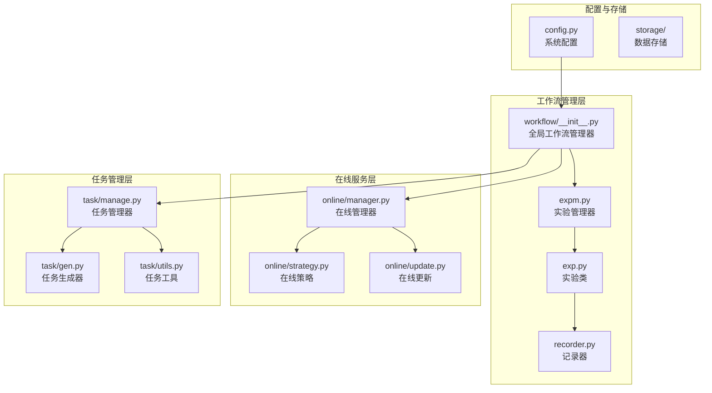
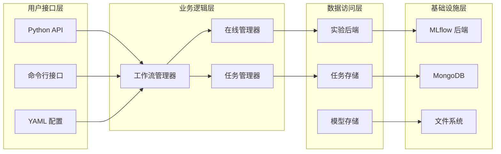
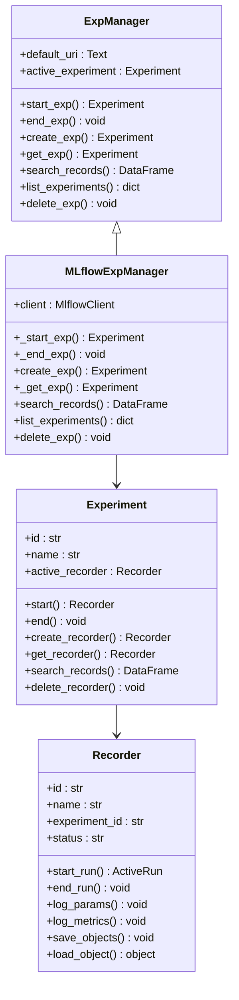
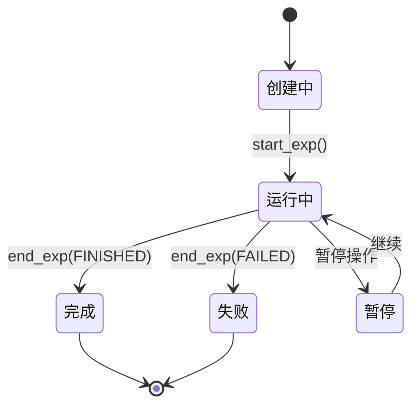
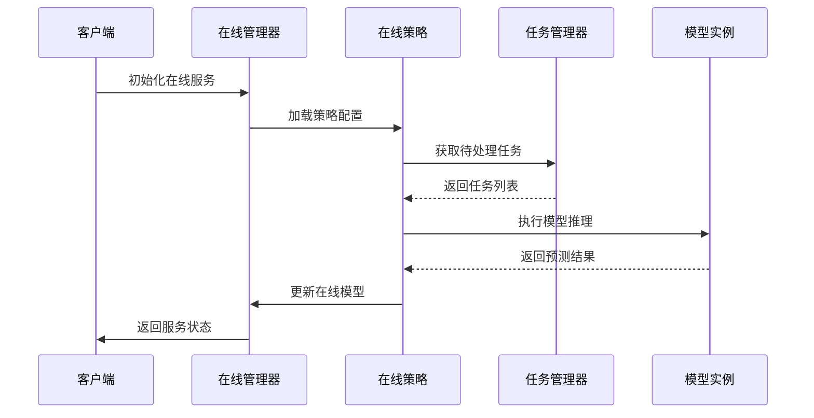
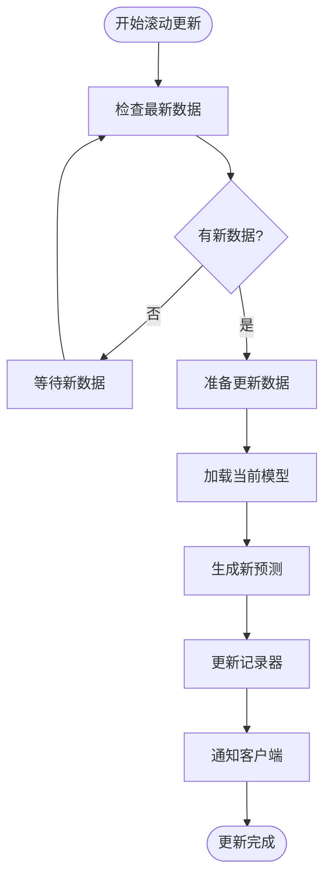
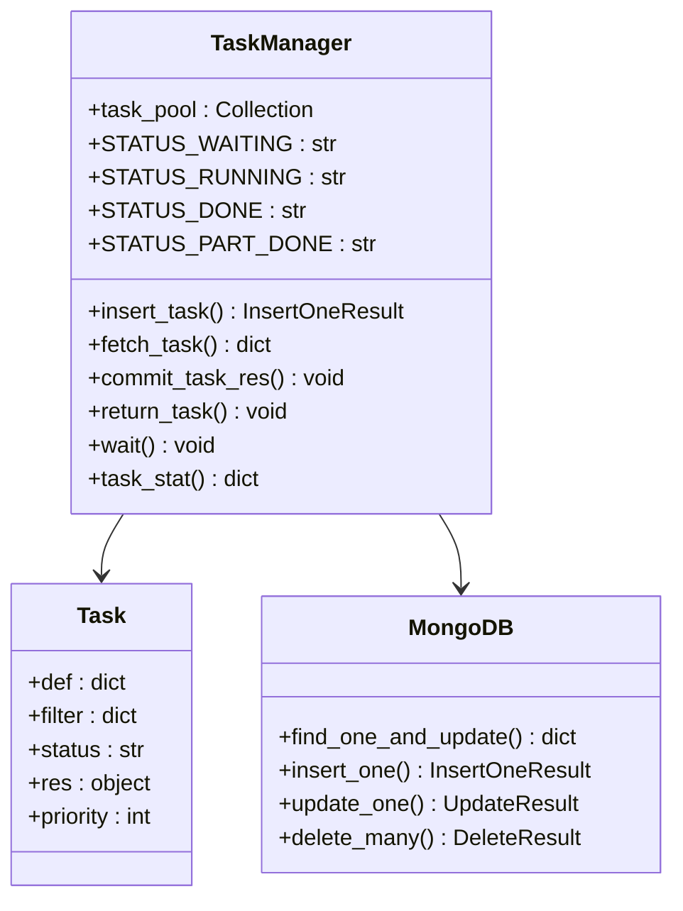
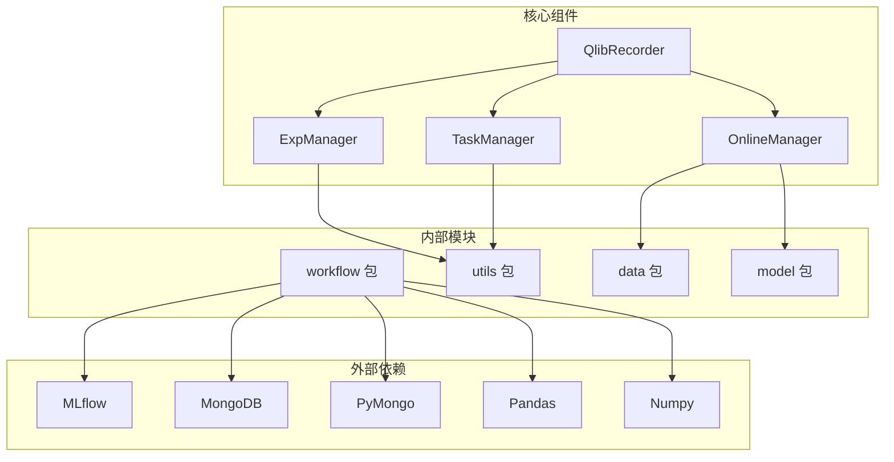
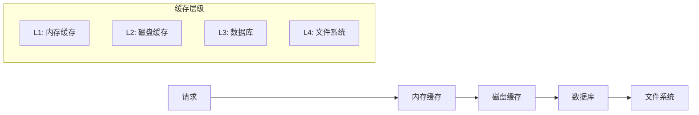

# Qlib 工作流管理系统

<cite>
**本文档中引用的文件**
- [qlib/workflow/__init__.py](file://qlib/workflow/__init__.py)
- [qlib/workflow/expm.py](file://qlib/workflow/expm.py)
- [qlib/workflow/exp.py](file://qlib/workflow/exp.py)
- [qlib/workflow/recorder.py](file://qlib/workflow/recorder.py)
- [qlib/workflow/online/strategy.py](file://qlib/workflow/online/strategy.py)
- [qlib/workflow/online/update.py](file://qlib/workflow/online/update.py)
- [qlib/workflow/task/manage.py](file://qlib/workflow/task/manage.py)
- [examples/online_srv/rolling_online_management.py](file://examples/online_srv/rolling_online_management.py)
- [examples/online_srv/online_management_simulate.py](file://examples/online_srv/online_management_simulate.py)
- [examples/benchmarks/LightGBM/workflow_config_lightgbm_Alpha158.yaml](file://examples/benchmarks/LightGBM/workflow_config_lightgbm_Alpha158.yaml)
- [qlib/config.py](file://qlib/config.py)
</cite>

## 目录
1. [简介](#简介)
2. [项目结构](#项目结构)
3. [核心组件](#核心组件)
4. [架构概览](#架构概览)
5. [详细组件分析](#详细组件分析)
6. [依赖关系分析](#依赖关系分析)
7. [性能考虑](#性能考虑)
8. [故障排除指南](#故障排除指南)
9. [结论](#结论)

## 简介

Qlib 工作流管理系统是一个高度集成的金融机器学习平台，专门设计用于处理复杂的实验管理、在线服务和滚动更新场景。该系统通过统一的接口抽象了底层的 MLflow 后端，提供了更直观的 API 和丰富的功能扩展。

系统的核心设计理念是简化实验管理流程，同时支持大规模分布式训练和实时在线服务。它通过精心设计的架构模式，实现了从模型开发到生产部署的完整生命周期管理。

## 项目结构

Qlib 工作流管理系统采用分层架构设计，主要包含以下核心模块：



**图表来源**
- [qlib/workflow/__init__.py](file://qlib/workflow/__init__.py#L1-L50)
- [qlib/workflow/expm.py](file://qlib/workflow/expm.py#L1-L50)
- [qlib/workflow/exp.py](file://qlib/workflow/exp.py#L1-L50)

**章节来源**
- [qlib/workflow/__init__.py](file://qlib/workflow/__init__.py#L1-L682)
- [qlib/workflow/expm.py](file://qlib/workflow/expm.py#L1-L435)

## 核心组件

### 全局工作流管理器 (QlibRecorder)

QlibRecorder 是整个工作流管理系统的核心入口点，提供了统一的 API 接口来管理实验和记录器。它封装了 MLflow 的复杂性，为用户提供更直观的操作体验。

```python
# 主要功能特性：
# 1. 实验启动和管理
# 2. 记录器生命周期控制
# 3. 参数和指标日志记录
# 4. 对象序列化和反序列化
# 5. 上下文管理支持
```

### 实验管理器 (ExpManager)

ExpManager 负责管理实验的整个生命周期，包括创建、启动、结束和查询实验。它支持多种后端存储，但默认使用 MLflow 作为后端。

```python
# 关键特性：
# 1. 单例模式设计
# 2. 多 URI 支持
# 3. 文件锁机制防止并发冲突
# 4. 实验状态跟踪
```

### 在线管理器 (OnlineManager)

OnlineManager 是专门为在线服务场景设计的组件，支持滚动更新和动态策略添加。它能够处理实时数据更新和模型重新训练。

```python
# 核心功能：
# 1. 滚动策略管理
# 2. 实时预测更新
# 3. 动态策略添加
# 4. 在线模型版本控制
```

**章节来源**
- [qlib/workflow/__init__.py](file://qlib/workflow/__init__.py#L25-L150)
- [qlib/workflow/expm.py](file://qlib/workflow/expm.py#L25-L100)
- [qlib/workflow/online/strategy.py](file://qlib/workflow/online/strategy.py#L1-L100)

## 架构概览

Qlib 工作流管理系统采用了多层架构设计，确保了系统的可扩展性和可维护性：



**图表来源**
- [qlib/workflow/__init__.py](file://qlib/workflow/__init__.py#L25-L100)
- [qlib/workflow/expm.py](file://qlib/workflow/expm.py#L25-L150)
- [qlib/workflow/task/manage.py](file://qlib/workflow/task/manage.py#L25-L100)

## 详细组件分析

### 实验管理器详细分析

实验管理器是整个系统的核心组件之一，负责管理实验的完整生命周期：



**图表来源**
- [qlib/workflow/expm.py](file://qlib/workflow/expm.py#L25-L150)
- [qlib/workflow/exp.py](file://qlib/workflow/exp.py#L25-L150)
- [qlib/workflow/recorder.py](file://qlib/workflow/recorder.py#L25-L150)

#### 实验状态管理

实验管理器通过状态机模式管理实验的不同阶段：



**图表来源**
- [qlib/workflow/recorder.py](file://qlib/workflow/recorder.py#L30-L50)

### 在线服务系统分析

在线服务系统专门针对实时金融数据处理场景进行了优化：



**图表来源**
- [examples/online_srv/rolling_online_management.py](file://examples/online_srv/rolling_online_management.py#L25-L100)
- [qlib/workflow/online/strategy.py](file://qlib/workflow/online/strategy.py#L50-L150)

#### 滚动更新机制

滚动更新是在线服务系统的核心功能，允许在不停机的情况下更新模型：



**图表来源**
- [qlib/workflow/online/update.py](file://qlib/workflow/online/update.py#L100-L200)

### 任务管理系统分析

任务管理系统负责协调分布式训练任务的执行：



**图表来源**
- [qlib/workflow/task/manage.py](file://qlib/workflow/task/manage.py#L50-L200)

**章节来源**
- [qlib/workflow/expm.py](file://qlib/workflow/expm.py#L200-L435)
- [qlib/workflow/exp.py](file://qlib/workflow/exp.py#L100-L380)
- [qlib/workflow/recorder.py](file://qlib/workflow/recorder.py#L50-L200)
- [qlib/workflow/online/update.py](file://qlib/workflow/online/update.py#L1-L299)
- [qlib/workflow/task/manage.py](file://qlib/workflow/task/manage.py#L1-L557)

## 依赖关系分析

Qlib 工作流管理系统的依赖关系呈现清晰的层次结构：



**图表来源**
- [qlib/workflow/__init__.py](file://qlib/workflow/__init__.py#L1-L20)
- [qlib/workflow/expm.py](file://qlib/workflow/expm.py#L1-L20)
- [qlib/workflow/task/manage.py](file://qlib/workflow/task/manage.py#L1-L20)

**章节来源**
- [qlib/workflow/__init__.py](file://qlib/workflow/__init__.py#L1-L50)
- [qlib/config.py](file://qlib/config.py#L1-L100)

## 性能考虑

### 并发处理能力

Qlib 工作流管理系统通过多种机制确保高性能：

1. **异步任务处理**: 使用 `concurrent.futures` 实现并行任务执行
2. **内存缓存**: 支持多级缓存机制减少 I/O 开销
3. **批量操作**: 优化数据库查询和文件操作
4. **连接池**: 数据库连接复用减少建立连接的开销

### 可扩展性设计

系统采用水平扩展架构，支持以下扩展方式：

- **任务分片**: 将大任务拆分为多个小任务并行处理
- **存储分离**: 实验数据和模型文件分别存储
- **负载均衡**: 支持多节点分布式部署
- **弹性伸缩**: 根据负载自动调整资源分配

### 缓存策略

系统实现了多层次的缓存机制：



## 故障排除指南

### 常见问题及解决方案

#### 实验启动失败

**问题症状**: 实验无法正常启动或状态异常

**可能原因**:
1. MLflow 后端连接失败
2. 文件锁冲突
3. 权限不足

**解决方案**:
```python
# 检查 MLflow 连接
try:
    R.get_uri()
except Exception as e:
    print(f"MLflow 连接失败: {e}")

# 清理文件锁
import os
lock_file = "/path/to/experiment.lock"
if os.path.exists(lock_file):
    os.remove(lock_file)
```

#### 在线服务更新延迟

**问题症状**: 在线预测更新不及时

**可能原因**:
1. 数据源延迟
2. 任务队列积压
3. 资源不足

**解决方案**:
```python
# 监控任务状态
task_stat = TaskManager("online_tasks").task_stat()
print(f"等待任务: {task_stat.get('waiting', 0)}")
print(f"运行中任务: {task_stat.get('running', 0)}")

# 强制重置等待中的任务
TaskManager("online_tasks").reset_waiting()
```

#### 内存溢出问题

**问题症状**: 系统内存使用过高

**可能原因**:
1. 缓存过大
2. 数据集过载
3. 并发任务过多

**解决方案**:
```python
# 调整缓存设置
C.mem_cache_size_limit = 100  # MB
C.default_disk_cache = 0      # 禁用磁盘缓存

# 限制并发任务数
C.kernels = 4  # CPU 核心数
```

**章节来源**
- [qlib/workflow/expm.py](file://qlib/workflow/expm.py#L200-L300)
- [qlib/workflow/task/manage.py](file://qlib/workflow/task/manage.py#L400-L500)

## 结论

Qlib 工作流管理系统是一个功能强大且设计精良的金融机器学习平台。它通过以下关键特性实现了高效的实验管理和在线服务：

### 主要优势

1. **统一的 API 设计**: 通过 QlibRecorder 提供一致的用户体验
2. **灵活的后端支持**: 支持多种存储后端，易于扩展
3. **强大的在线服务能力**: 支持实时数据更新和滚动部署
4. **完善的任务管理**: 分布式任务调度和错误处理
5. **丰富的监控功能**: 全面的日志记录和状态跟踪

### 技术创新

- **状态机模式**: 清晰定义实验和任务的状态转换
- **上下文管理**: 自动资源清理和异常处理
- **序列化优化**: 高效的对象存储和加载机制
- **并发控制**: 多线程和多进程安全的任务执行

### 应用场景

该系统特别适用于以下场景：
- 量化投资模型开发和验证
- 实时金融市场预测服务
- 大规模分布式训练任务
- 模型版本管理和 A/B 测试
- 金融风险评估和合规监控

通过深入理解这些设计原理和实现细节，开发者可以更好地利用 Qlib 工作流管理系统构建高效、可靠的金融机器学习应用。