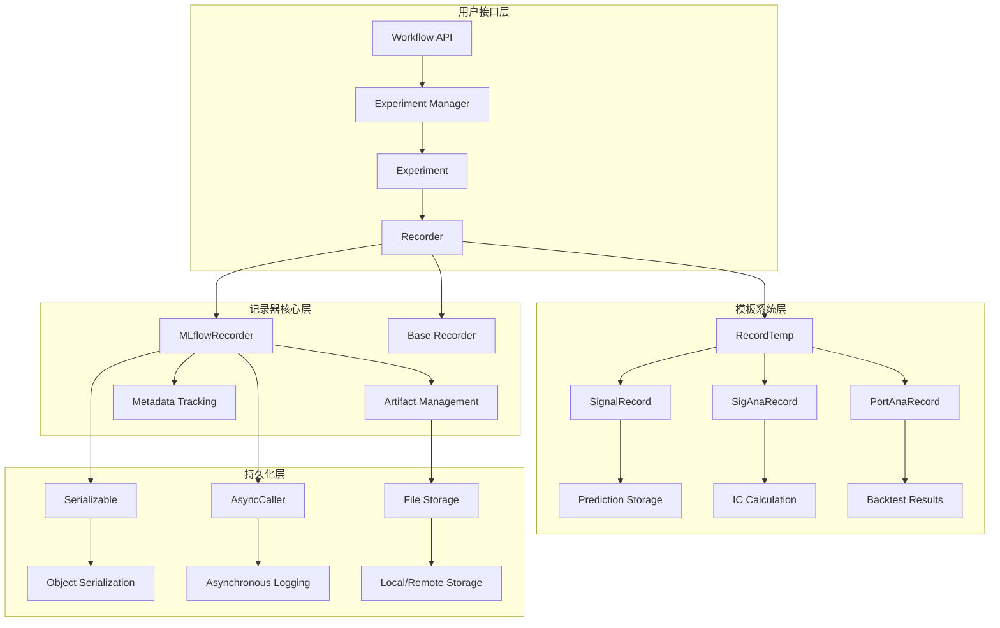
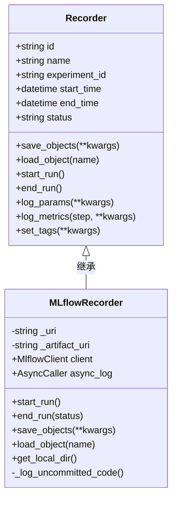
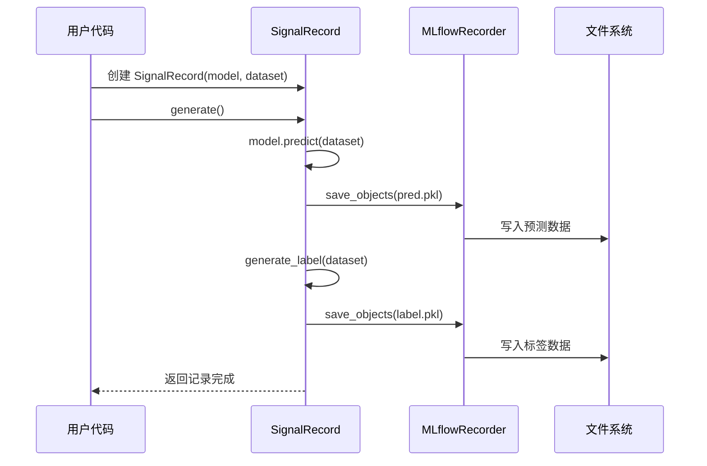
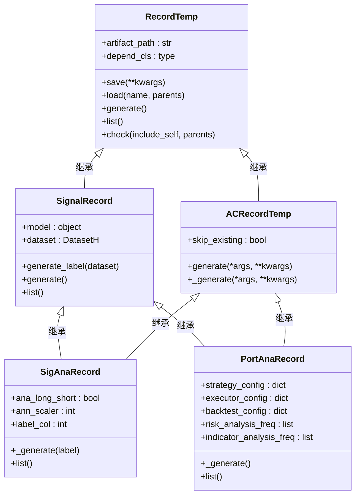
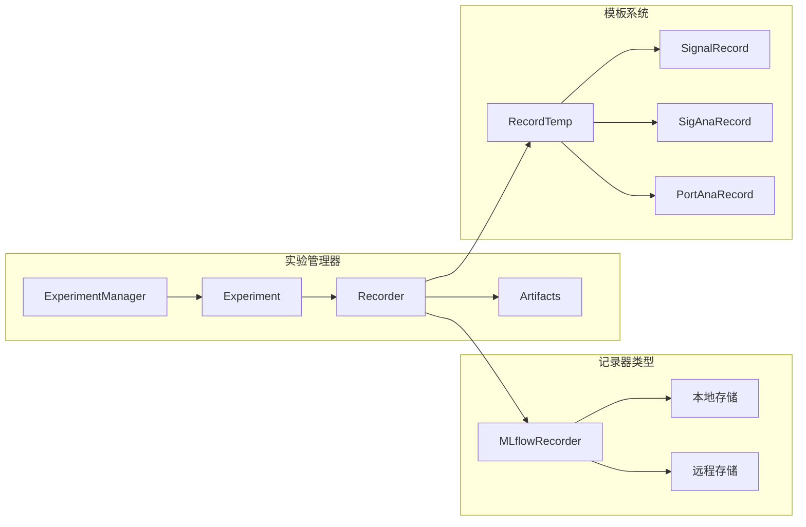
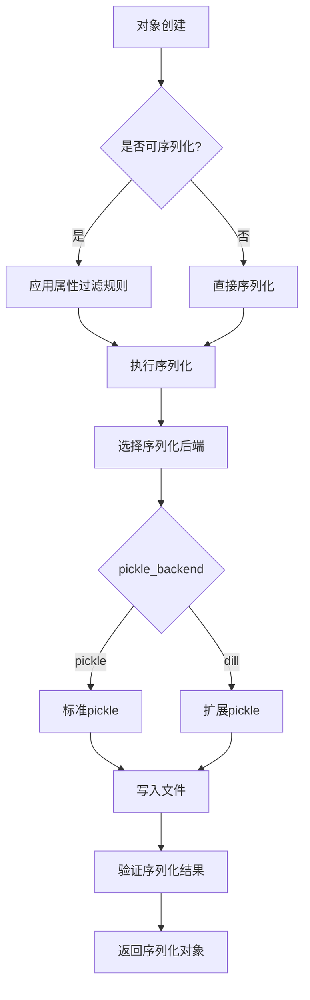
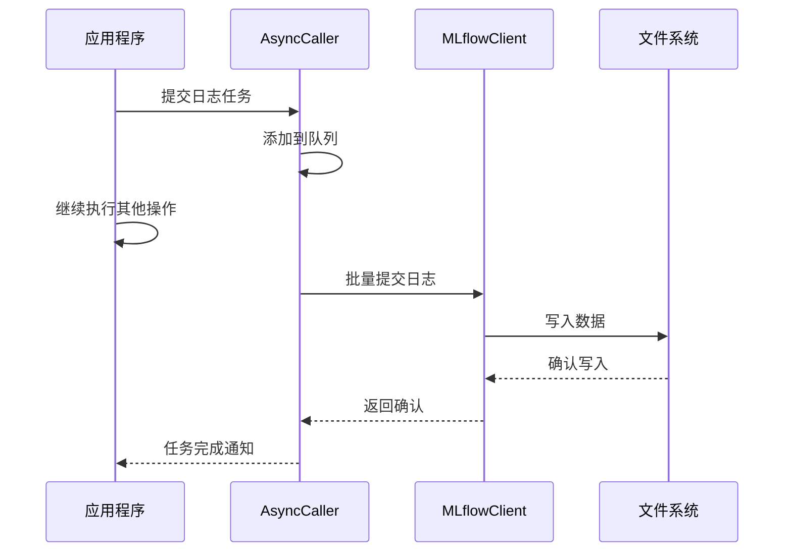
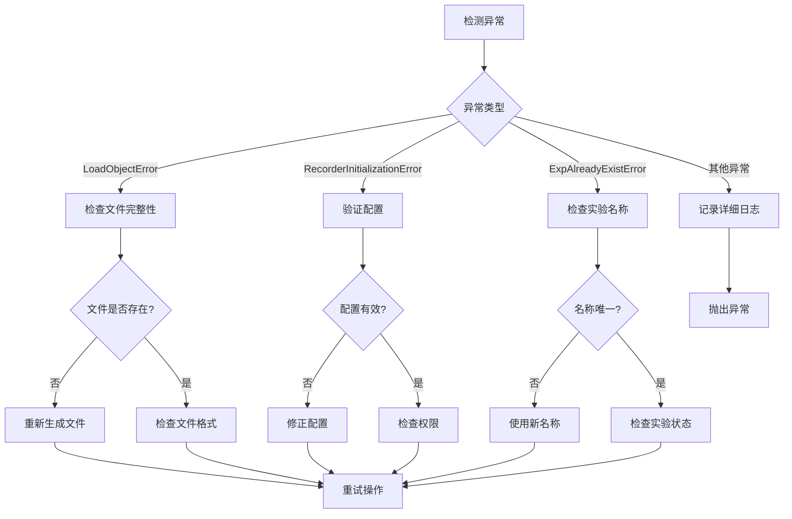

# Qlib 记录器系统深度技术文档

<cite>
**本文档引用的文件**
- [recorder.py](file://qlib/workflow/recorder.py)
- [record_temp.py](file://qlib/workflow/record_temp.py)
- [exp.py](file://qlib/workflow/exp.py)
- [expm.py](file://qlib/workflow/expm.py)
- [serial.py](file://qlib/utils/serial.py)
- [exceptions.py](file://qlib/utils/exceptions.py)
- [workflow_config_lightgbm_Alpha360.yaml](file://examples/benchmarks/LightGBM/workflow_config_lightgbm_Alpha360.yaml)
</cite>

## 目录
1. [简介](#简介)
2. [核心架构概览](#核心架构概览)
3. [记录器核心组件](#记录器核心组件)
4. [临时记录模板系统](#临时记录模板系统)
5. [实验管理系统](#实验管理系统)
6. [序列化与持久化机制](#序列化与持久化机制)
7. [性能优化策略](#性能优化策略)
8. [故障排查指南](#故障排查指南)
9. [最佳实践与使用示例](#最佳实践与使用示例)
10. [总结](#总结)

## 简介

Qlib 的记录器系统是一个高度集成的实验跟踪和结果持久化框架，专为量化金融研究而设计。该系统提供了完整的指标记录、模型检查点保存、元数据追踪和结果持久化功能，支持多种后端存储（如本地文件系统和 MLflow），并具备强大的临时状态管理和异步处理能力。

记录器系统的核心价值在于：
- **统一的实验管理接口**：提供类似 MLflow 的 API 设计，简化实验跟踪
- **灵活的存储后端**：支持本地文件系统和云端存储的无缝切换
- **自动化的状态管理**：通过临时记录模板实现智能的结果缓存和重用
- **高性能的数据持久化**：采用优化的序列化机制和异步写入策略
- **完善的错误处理**：提供详细的异常信息和故障恢复机制

## 核心架构概览



**图表来源**
- [recorder.py](file://qlib/workflow/recorder.py#L25-L494)
- [record_temp.py](file://qlib/workflow/record_temp.py#L20-L689)
- [exp.py](file://qlib/workflow/exp.py#L15-L380)

## 记录器核心组件

### Recorder 基类设计

Recorder 是整个记录器系统的核心抽象基类，定义了标准化的实验跟踪接口：

```python
class Recorder:
    """
    实验记录器基类，提供指标记录、参数跟踪、元数据管理等功能
    """
    
    # 定义实验状态常量
    STATUS_S = "SCHEDULED"
    STATUS_R = "RUNNING"
    STATUS_FI = "FINISHED"
    STATUS_FA = "FAILED"
    
    def __init__(self, experiment_id, name):
        self.id = None
        self.name = name
        self.experiment_id = experiment_id
        self.start_time = None
        self.end_time = None
        self.status = Recorder.STATUS_S
```

### MLflowRecorder 实现

MLflowRecorder 是 Recorder 接口的具体实现，提供了与 MLflow 生态系统的深度集成：



**图表来源**
- [recorder.py](file://qlib/workflow/recorder.py#L25-L494)

MLflowRecorder 的关键特性包括：

1. **异步日志记录**：通过 AsyncCaller 实现非阻塞的日志写入
2. **自动代码版本控制**：记录未提交的代码变更
3. **环境变量跟踪**：自动捕获必要的环境信息
4. **多后端支持**：兼容本地文件系统和远程存储

**章节来源**
- [recorder.py](file://qlib/workflow/recorder.py#L25-L494)

## 临时记录模板系统

### RecordTemp 基础模板

RecordTemp 是所有记录模板的基础类，提供了通用的文件管理和路径处理功能：

```python
class RecordTemp:
    """
    记录模板基类，支持标准化的实验结果生成和存储
    """
    
    artifact_path = None  # 艺术品存储路径
    depend_cls = None     # 依赖的记录类
    
    def save(self, **kwargs):
        """保存对象到记录器"""
        art_path = self.get_path()
        if art_path == "":
            art_path = None
        self.recorder.save_objects(artifact_path=art_path, **kwargs)
    
    def load(self, name: str, parents: bool = True):
        """从记录器加载对象"""
        try:
            return self.recorder.load_object(self.get_path(name))
        except LoadObjectError as e:
            if parents:
                if self.depend_cls is not None:
                    with class_casting(self, self.depend_cls):
                        return self.load(name, parents=True)
            raise e
```

### 信号记录器系统

信号记录器专门用于处理预测结果和标签数据的记录：



**图表来源**
- [record_temp.py](file://qlib/workflow/record_temp.py#L100-L150)

### 分析记录器层次结构

记录器系统采用分层设计，支持复杂的依赖关系：



**图表来源**
- [record_temp.py](file://qlib/workflow/record_temp.py#L20-L689)

**章节来源**
- [record_temp.py](file://qlib/workflow/record_temp.py#L20-L689)

## 实验管理系统

### Experiment 类设计

Experiment 类负责管理单个实验的所有记录器实例：

```python
class Experiment:
    """
    实验类，管理实验的生命周期和记录器集合
    """
    
    def __init__(self, id, name):
        self.id = id
        self.name = name
        self.active_recorder = None
        self._default_rec_name = "abstract_recorder"
    
    def start(self, *, recorder_id=None, recorder_name=None, resume=False):
        """启动实验并激活记录器"""
        raise NotImplementedError
    
    def end(self, recorder_status=Recorder.STATUS_S):
        """结束实验"""
        raise NotImplementedError
    
    def get_recorder(self, recorder_id=None, recorder_name=None, create=True, start=False):
        """获取或创建记录器"""
        # 支持多种获取模式
        if recorder_id is None and recorder_name is None:
            if self.active_recorder is not None:
                return self.active_recorder
            recorder_name = self._default_rec_name
        
        if create:
            recorder, is_new = self._get_or_create_rec(recorder_id=recorder_id, recorder_name=recorder_name)
        else:
            recorder, is_new = self._get_recorder(recorder_id=recorder_id, recorder_name=recorder_name)
        
        if is_new and start:
            self.active_recorder = recorder
            self.active_recorder.start_run()
        
        return recorder
```

### 实验管理器架构



**图表来源**
- [exp.py](file://qlib/workflow/exp.py#L15-L380)
- [expm.py](file://qlib/workflow/expm.py#L34-L215)

**章节来源**
- [exp.py](file://qlib/workflow/exp.py#L15-L380)
- [expm.py](file://qlib/workflow/expm.py#L34-L215)

## 序列化与持久化机制

### Serializable 基类设计

Serializable 提供了灵活的对象序列化机制，支持选择性属性保存：

```python
class Serializable:
    """
    可序列化基类，提供智能的属性过滤和序列化控制
    """
    
    pickle_backend = "pickle"  # 支持 pickle 或 dill
    default_dump_all = False   # 是否保存所有属性
    config_attr = ["_include", "_exclude"]
    exclude_attr = []          # 排除的属性列表
    include_attr = []          # 包含的属性列表
    
    def _is_kept(self, key):
        """判断属性是否应该被保存"""
        if key in self.config_attr:
            return False
        if key in self._get_attr_list("include"):
            return True
        if key in self._get_attr_list("exclude"):
            return False
        return self.dump_all or not key.startswith("_")
    
    def config(self, recursive=False, **kwargs):
        """配置序列化行为"""
        keys = {"dump_all", "exclude", "include"}
        for k, v in kwargs.items():
            if k in keys:
                attr_name = f"_{k}"
                setattr(self, attr_name, v)
```

### 对象持久化流程



**图表来源**
- [serial.py](file://qlib/utils/serial.py#L10-L189)

### 高效的批量序列化

系统支持高效的批量对象序列化，减少 I/O 开销：

```python
@staticmethod
def general_dump(obj, path: Union[Path, str]):
    """
    通用的批量对象序列化方法
    """
    path = Path(path)
    if isinstance(obj, Serializable):
        obj.to_pickle(path)
    else:
        with path.open("wb") as f:
            pickle.dump(obj, f, protocol=C.dump_protocol_version)
```

**章节来源**
- [serial.py](file://qlib/utils/serial.py#L10-L189)

## 性能优化策略

### 异步写入机制

MLflowRecorder 实现了异步日志记录，显著提升性能：

```python
class MLflowRecorder(Recorder):
    def __init__(self, experiment_id, uri, name=None, mlflow_run=None):
        super(MLflowRecorder, self).__init__(experiment_id, name)
        # 启用异步日志记录
        self.async_log = None
    
    def start_run(self):
        # 启动异步日志记录器
        self.async_log = AsyncCaller()
        
        # 异步参数和指标记录
        @AsyncCaller.async_dec(ac_attr="async_log")
        def log_params(self, **kwargs):
            for name, data in kwargs.items():
                self.client.log_param(self.id, name, data)
        
        @AsyncCaller.async_dec(ac_attr="async_log")
        def log_metrics(self, step=None, **kwargs):
            for name, data in kwargs.items():
                self.client.log_metric(self.id, name, data, step=step)
```

### 批量提交优化



**图表来源**
- [recorder.py](file://qlib/workflow/recorder.py#L200-L250)

### 内存管理优化

系统实现了智能的内存管理策略：

1. **临时文件清理**：自动删除不再需要的临时文件
2. **资源池化**：复用昂贵的资源对象
3. **延迟加载**：按需加载大型数据集

**章节来源**
- [recorder.py](file://qlib/workflow/recorder.py#L200-L400)

## 故障排查指南

### 常见错误类型

系统定义了详细的异常类型以便于故障诊断：

```python
class QlibException(Exception):
    """基础异常类"""
    pass

class RecorderInitializationError(QlibException):
    """记录器初始化错误"""
    pass

class LoadObjectError(QlibException):
    """记录器对象加载错误"""
    pass

class ExpAlreadyExistError(Exception):
    """实验已存在错误"""
    pass
```

### 错误处理流程



### 存储空间管理

当遇到存储空间不足时，系统提供以下解决方案：

1. **自动清理策略**：定期清理过期的实验记录
2. **压缩存储**：对大型对象进行压缩存储
3. **分片存储**：将大数据集分割存储
4. **归档机制**：将历史数据归档到低成本存储

### 日志丢失问题

对于日志丢失问题，系统实现了多重保护机制：

```python
def load_object(self, name, unpickler=pickle.Unpickler):
    """安全的对象加载方法"""
    path = None
    try:
        path = self.client.download_artifacts(self.id, name)
        with Path(path).open("rb") as f:
            data = unpickler(f).load()
        return data
    except Exception as e:
        raise LoadObjectError(str(e)) from e
    finally:
        # 清理临时文件以节省磁盘空间
        ar = self.client._tracking_client._get_artifact_repo(self.id)
        if isinstance(ar, AzureBlobArtifactRepository) and path is not None:
            shutil.rmtree(Path(path).absolute().parent)
```

**章节来源**
- [exceptions.py](file://qlib/utils/exceptions.py#L1-L18)
- [recorder.py](file://qlib/workflow/recorder.py#L409-L444)

## 最佳实践与使用示例

### 基本使用模式

```python
# 1. 创建实验
with R.start(experiment_name='my_experiment') as exp:
    # 2. 获取记录器
    recorder = exp.get_recorder()
    
    # 3. 记录实验参数
    recorder.log_params(
        model_type='LightGBM',
        learning_rate=0.02,
        num_leaves=31
    )
    
    # 4. 运行模型训练
    model = train_model(dataset)
    
    # 5. 保存模型检查点
    recorder.save_objects(model=model)
    
    # 6. 记录评估指标
    metrics = calculate_metrics(model, test_data)
    recorder.log_metrics(**metrics)
```

### 自定义记录器配置

```python
# 使用 YAML 配置文件
workflow_config = {
    'task': {
        'model': {
            'class': 'LGBModel',
            'module_path': 'qlib.contrib.model.gbdt',
            'kwargs': {...}
        },
        'dataset': {
            'class': 'DatasetH',
            'module_path': 'qlib.data.dataset',
            'kwargs': {...}
        },
        'record': [
            {
                'class': 'SignalRecord',
                'module_path': 'qlib.workflow.record_temp',
                'kwargs': {
                    'model': '<MODEL>',
                    'dataset': '<DATASET>'
                }
            },
            {
                'class': 'SigAnaRecord',
                'module_path': 'qlib.workflow.record_temp',
                'kwargs': {
                    'ana_long_short': True,
                    'ann_scaler': 252
                }
            }
        ]
    }
}
```

### 高级配置示例

```python
# 多次回测分析
class MultiPassPortAnaRecord(PortAnaRecord):
    def __init__(self, recorder, pass_num=10, shuffle_init_score=True):
        self.pass_num = pass_num
        self.shuffle_init_score = shuffle_init_score
        super().__init__(recorder)
    
    def _generate(self, **kwargs):
        risk_analysis_df_map = {}
        
        for i in range(self.pass_num):
            if self.shuffle_init_score:
                self.random_init()
            
            # 执行单次回测
            single_run_artifacts = super()._generate(**kwargs)
            
            # 收集风险分析结果
            for freq in self.risk_analysis_freq:
                analysis_df = single_run_artifacts[f'port_analysis_{freq}.pkl']
                analysis_df['run_id'] = i
                risk_analysis_df_map.setdefault(freq, []).append(analysis_df)
        
        # 合并多次运行的结果
        result_artifacts = {}
        for freq in self.risk_analysis_freq:
            combined_df = pd.concat(risk_analysis_df_map[freq])
            # 计算统计指标
            stats_df = self._calculate_statistics(combined_df)
            result_artifacts[f'multi_pass_port_analysis_{freq}.pkl'] = stats_df
        
        return result_artifacts
```

### 性能监控和调试

```python
# 启用详细日志记录
import logging
logging.getLogger('qlib.workflow').setLevel(logging.DEBUG)

# 监控记录器状态
recorder = exp.get_recorder()
print(f"当前记录器状态: {recorder.status}")
print(f"实验 ID: {recorder.experiment_id}")
print(f"记录器 ID: {recorder.id}")

# 查询历史记录
records = exp.search_records(
    filter_string="params.model_type='LightGBM'",
    max_results=100
)
```

**章节来源**
- [workflow_config_lightgbm_Alpha360.yaml](file://examples/benchmarks/LightGBM/workflow_config_lightgbm_Alpha360.yaml#L1-L79)

## 总结

Qlib 的记录器系统是一个功能完整、设计精良的实验跟踪和结果持久化框架。其主要优势包括：

1. **模块化设计**：清晰的分层架构便于维护和扩展
2. **性能优化**：异步写入、批量提交等优化策略
3. **灵活性**：支持多种存储后端和自定义配置
4. **可靠性**：完善的错误处理和故障恢复机制
5. **易用性**：简洁的 API 和丰富的配置选项

通过合理使用这些功能，研究人员可以：
- 高效地管理复杂的量化实验
- 自动化结果记录和分析流程
- 实现跨平台的实验结果共享
- 构建可重现的研究工作流

未来的改进方向可能包括：
- 更好的分布式支持
- 增强的可视化工具
- 更多的存储后端集成
- 改进的性能监控功能