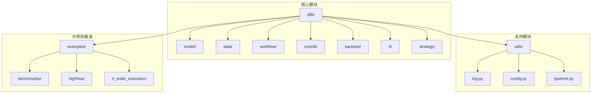
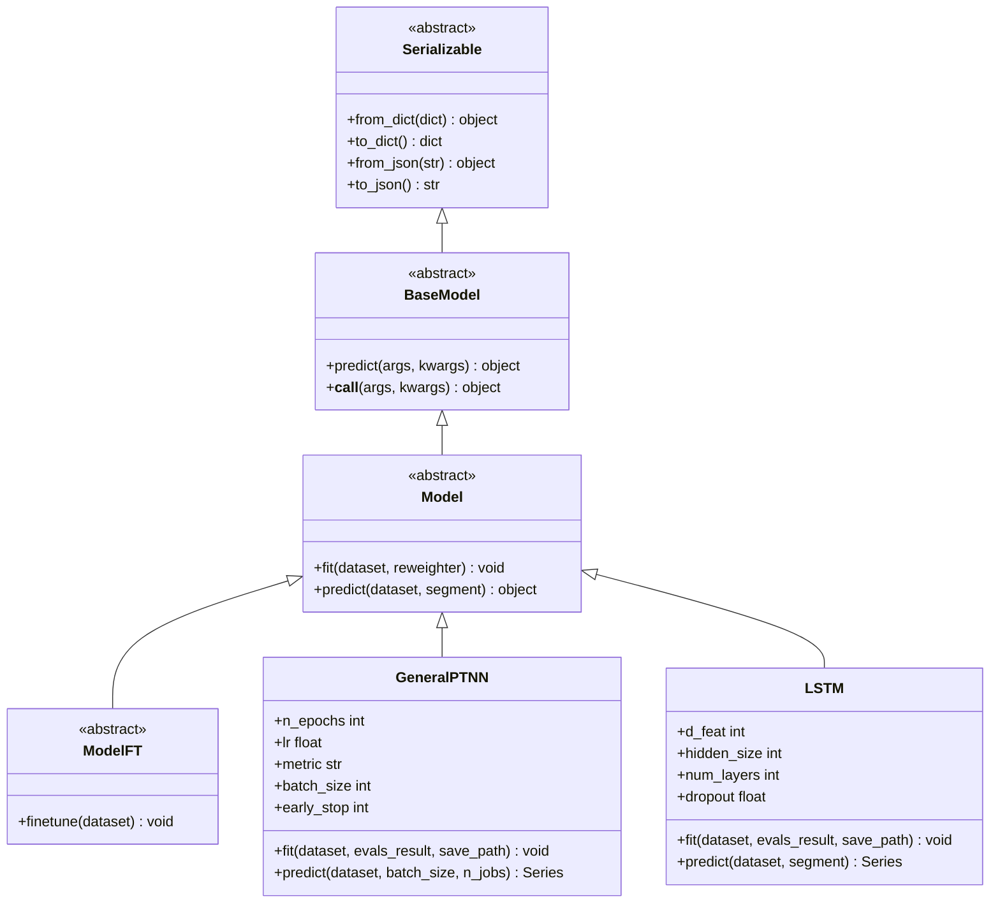
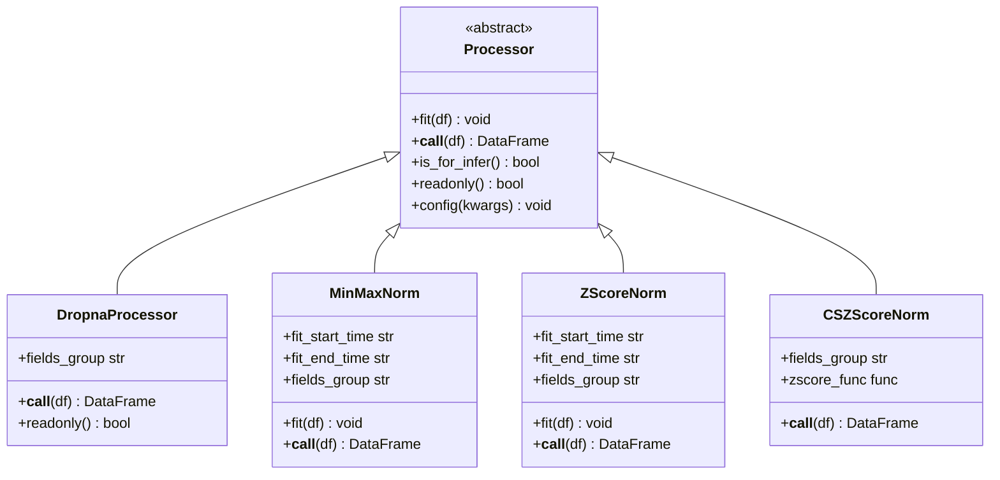
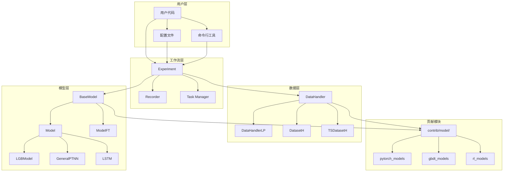
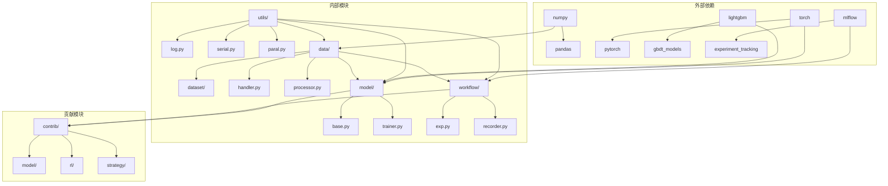

# Qlib 开发者指南

<cite>
**本文档中引用的文件**
- [README.md](file://README.md)
- [qlib/model/base.py](file://qlib/model/base.py)
- [qlib/data/dataset/handler.py](file://qlib/data/dataset/handler.py)
- [qlib/data/dataset/processor.py](file://qlib/data/dataset/processor.py)
- [qlib/contrib/model/pytorch_general_nn.py](file://qlib/contrib/model/pytorch_general_nn.py)
- [qlib/contrib/model/pytorch_lstm.py](file://qlib/contrib/model/pytorch_lstm.py)
- [qlib/workflow/exp.py](file://qlib/workflow/exp.py)
- [examples/benchmarks/LightGBM/workflow_config_lightgbm_Alpha158.yaml](file://examples/benchmarks/LightGBM/workflow_config_lightgbm_Alpha158.yaml)
- [tests/test_contrib_model.py](file://tests/test_contrib_model.py)
</cite>

## 目录
1. [简介](#简介)
2. [项目结构](#项目结构)
3. [核心组件](#核心组件)
4. [架构概览](#架构概览)
5. [详细组件分析](#详细组件分析)
6. [依赖关系分析](#依赖关系分析)
7. [性能考虑](#性能考虑)
8. [故障排除指南](#故障排除指南)
9. [结论](#结论)

## 简介

Qlib 是微软开源的 AI 驱动的量化投资平台，旨在通过人工智能技术实现量化投资的研究潜力、赋能研究并创造价值。本开发者指南详细介绍了如何在 Qlib 框架中创建自定义模型、自定义数据处理器和扩展框架，包括实际代码示例和最佳实践。

Qlib 支持多种机器学习建模范式，包括监督学习、市场动态建模和强化学习。它包含完整的机器学习管道，涵盖数据处理、模型训练、回测；并覆盖量化投资的整个链条：阿尔法寻找、风险建模、投资组合优化和订单执行。

## 项目结构

Qlib 采用模块化设计，主要分为以下几个核心模块：



**图表来源**
- [README.md](file://README.md#L1-L50)
- [qlib/model/base.py](file://qlib/model/base.py#L1-L20)

**章节来源**
- [README.md](file://README.md#L1-L100)

## 核心组件

### 模型基类系统

Qlib 的模型系统基于抽象基类设计，提供了统一的模型接口：



**图表来源**
- [qlib/model/base.py](file://qlib/model/base.py#L10-L110)
- [qlib/contrib/model/pytorch_general_nn.py](file://qlib/contrib/model/pytorch_general_nn.py#L25-L100)
- [qlib/contrib/model/pytorch_lstm.py](file://qlib/contrib/model/pytorch_lstm.py#L20-L80)

### 数据处理器架构

数据处理器系统提供了灵活的数据预处理能力：



**图表来源**
- [qlib/data/dataset/processor.py](file://qlib/data/dataset/processor.py#L25-L150)

**章节来源**
- [qlib/model/base.py](file://qlib/model/base.py#L1-L111)
- [qlib/data/dataset/processor.py](file://qlib/data/dataset/processor.py#L1-L420)

## 架构概览

Qlib 采用松耦合的模块化架构设计，各组件可以独立使用：



**图表来源**
- [qlib/workflow/exp.py](file://qlib/workflow/exp.py#L1-L50)
- [qlib/model/base.py](file://qlib/model/base.py#L1-L30)

## 详细组件分析

### 自定义模型开发

#### 创建自定义模型类

要创建自定义模型，需要继承 `Model` 基类并实现必要的方法：

```python
from qlib.model.base import Model
from qlib.data.dataset import DatasetH
from qlib.data.dataset.handler import DataHandlerLP

class CustomModel(Model):
    def __init__(self, **kwargs):
        super().__init__()
        # 初始化模型参数
        self.params = kwargs
        
    def fit(self, dataset: DatasetH, reweighter=None):
        """训练模型"""
        # 准备训练数据
        df_train, df_valid = dataset.prepare(
            ["train", "valid"], 
            col_set=["feature", "label"], 
            data_key=DataHandlerLP.DK_L
        )
        
        # 获取特征和标签
        x_train, y_train = df_train["feature"], df_train["label"]
        x_valid, y_valid = df_valid["feature"], df_valid["label"]
        
        # 实现模型训练逻辑
        self._train_model(x_train, y_train, x_valid, y_valid)
        
    def predict(self, dataset: DatasetH, segment="test"):
        """模型预测"""
        # 准备测试数据
        x_test = dataset.prepare(segment, col_set="feature", data_key=DataHandlerLP.DK_I)
        
        # 执行预测
        return self._predict(x_test)
```

#### 模型配置示例

以下是典型的模型配置 YAML 文件：

```yaml
task:
    model:
        class: CustomModel
        module_path: my_custom_module
        kwargs:
            param1: value1
            param2: value2
    dataset:
        class: DatasetH
        module_path: qlib.data.dataset
        kwargs:
            handler:
                class: MyCustomHandler
                module_path: my_custom_module
                kwargs:
                    start_time: 2008-01-01
                    end_time: 2020-08-01
                    instruments: csi300
            segments:
                train: [2008-01-01, 2014-12-31]
                valid: [2015-01-01, 2016-12-31]
                test: [2017-01-01, 2020-08-01]
```

### 自定义数据处理器

#### 创建自定义处理器

数据处理器用于对原始数据进行预处理：

```python
from qlib.data.dataset.processor import Processor
import pandas as pd
import numpy as np

class CustomProcessor(Processor):
    def __init__(self, custom_param=0.5):
        self.custom_param = custom_param
        
    def fit(self, df: pd.DataFrame = None):
        """拟合处理器参数"""
        # 计算统计量或其他参数
        self.mean_value = df.mean()
        self.std_value = df.std()
        
    def __call__(self, df: pd.DataFrame):
        """应用处理器"""
        # 应用自定义处理逻辑
        normalized_df = (df - self.mean_value) / self.std_value
        return normalized_df
        
    def readonly(self):
        """是否只读"""
        return True
```

#### 处理器链配置

可以在数据处理器中组合多个处理器：

```python
data_handler_config = {
    "instruments": "csi300",
    "start_time": "2008-01-01",
    "end_time": "2020-08-01",
    "infer_processors": [
        {
            "class": "CustomProcessor",
            "kwargs": {"custom_param": 0.5}
        },
        {
            "class": "ZScoreNorm",
            "kwargs": {
                "fit_start_time": "2008-01-01",
                "fit_end_time": "2014-12-31"
            }
        }
    ],
    "learn_processors": [
        {
            "class": "DropnaLabel",
            "kwargs": {}
        }
    ]
}
```

### 工作流扩展

#### 自定义实验类

```python
from qlib.workflow.exp import Experiment
from qlib.workflow.recorder import Recorder

class CustomExperiment(Experiment):
    def __init__(self, id, name):
        super().__init__(id, name)
        self.custom_metrics = {}
        
    def start(self, *, recorder_id=None, recorder_name=None, resume=False):
        """启动实验"""
        recorder = super().start(
            recorder_id=recorder_id,
            recorder_name=recorder_name,
            resume=resume
        )
        
        # 添加自定义初始化逻辑
        self._initialize_custom_components()
        
        return recorder
        
    def _initialize_custom_components(self):
        """初始化自定义组件"""
        # 实现自定义初始化逻辑
        pass
```

**章节来源**
- [qlib/contrib/model/pytorch_general_nn.py](file://qlib/contrib/model/pytorch_general_nn.py#L1-L372)
- [qlib/contrib/model/pytorch_lstm.py](file://qlib/contrib/model/pytorch_lstm.py#L1-L307)
- [examples/benchmarks/LightGBM/workflow_config_lightgbm_Alpha158.yaml](file://examples/benchmarks/LightGBM/workflow_config_lightgbm_Alpha158.yaml#L1-L72)

## 依赖关系分析

Qlib 的依赖关系呈现清晰的层次结构：



**图表来源**
- [README.md](file://README.md#L100-L200)

**章节来源**
- [tests/test_contrib_model.py](file://tests/test_contrib_model.py#L1-L28)

## 性能考虑

### 内存优化策略

1. **数据缓存机制**：Qlib 提供了多级缓存机制来优化内存使用
2. **批处理优化**：支持批量数据处理以提高效率
3. **GPU 加速**：PyTorch 模型支持 GPU 训练和推理

### 并行处理

```python
# 并行数据加载
data_loader = DataLoader(
    dataset,
    batch_size=batch_size,
    shuffle=True,
    num_workers=n_jobs,
    drop_last=True
)

# 并行数据处理
from qlib.utils.paral import datetime_groupby_apply
result = datetime_groupby_apply(data, custom_function)
```

### 缓存策略

```python
# 启用数据缓存
handler.setup_data(enable_cache=True)

# 使用缓存的处理器
processor.fit()
processor.process_data(with_fit=True)
```

## 故障排除指南

### 常见问题及解决方案

#### 1. 数据加载问题

**问题**：数据加载失败或数据格式不正确
**解决方案**：
```python
# 检查数据完整性
from qlib.check_data_health import check_data_health
health_report = check_data_health(qlib_dir="~/.qlib/qlib_data/cn_data")

# 重新下载数据
python scripts/get_data.py qlib_data --target_dir ~/.qlib/qlib_data/cn_data --region cn
```

#### 2. 模型训练问题

**问题**：模型训练收敛困难
**解决方案**：
```python
# 调整学习率
model = CustomModel(lr=0.001)

# 启用早停机制
model.fit(dataset, early_stop=20)

# 使用学习率调度器
from torch.optim.lr_scheduler import ReduceLROnPlateau
scheduler = ReduceLROnPlateau(optimizer, mode='min', factor=0.5, patience=5)
```

#### 3. 内存不足问题

**问题**：训练时内存溢出
**解决方案**：
```python
# 减少批次大小
model = CustomModel(batch_size=1000)

# 使用梯度裁剪
torch.nn.utils.clip_grad_value_(model.parameters(), 3.0)

# 启用混合精度训练
from torch.cuda.amp import autocast, GradScaler
scaler = GradScaler()
```

### 调试技巧

1. **启用详细日志**：
```python
import logging
logging.basicConfig(level=logging.DEBUG)
```

2. **使用 MLflow 追踪实验**：
```python
from qlib.workflow import R
with R.start(experiment_name="debug_experiment"):
    # 记录超参数和指标
    R.log_params(model_params)
    R.log_metrics(train_metrics)
```

3. **检查数据分布**：
```python
# 检查特征分布
features.describe()

# 检查标签分布
labels.value_counts(normalize=True)
```

**章节来源**
- [README.md](file://README.md#L300-L400)

## 结论

Qlib 作为一个功能强大的 AI 驱动量化投资平台，为开发者提供了丰富的扩展能力和灵活的架构设计。通过本开发者指南，您应该能够：

1. **理解核心架构**：掌握 Qlib 的模块化设计和组件关系
2. **开发自定义模型**：学会继承基类并实现自定义模型
3. **创建数据处理器**：掌握数据预处理的最佳实践
4. **扩展工作流**：了解如何扩展和定制工作流
5. **解决常见问题**：具备基本的调试和故障排除能力

Qlib 的持续发展得益于社区的积极参与，我们鼓励开发者贡献新的模型、数据集和功能。通过遵循本指南中的最佳实践和编码标准，您可以为 Qlib 生态系统做出有价值的贡献。

随着 AI 技术的不断发展，Qlib 将继续演进，为量化投资领域带来更多创新和突破。期待您的参与和贡献！