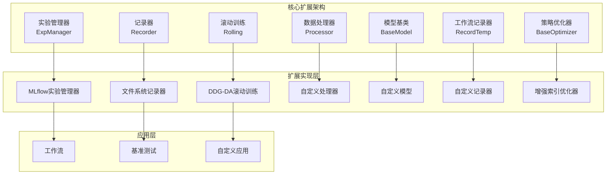
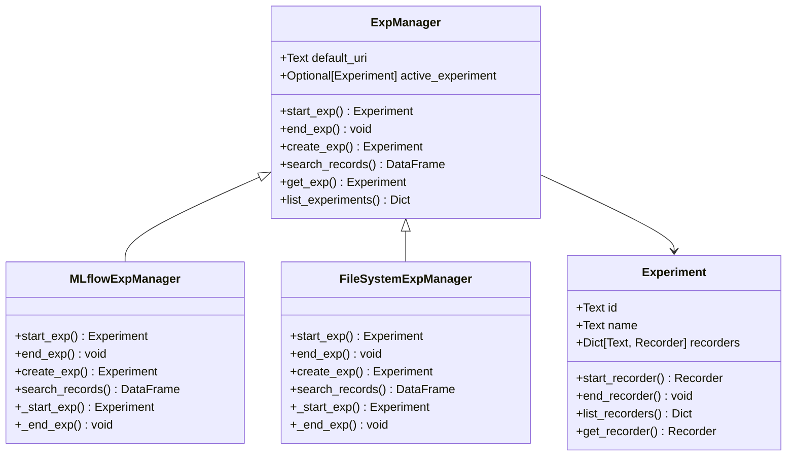
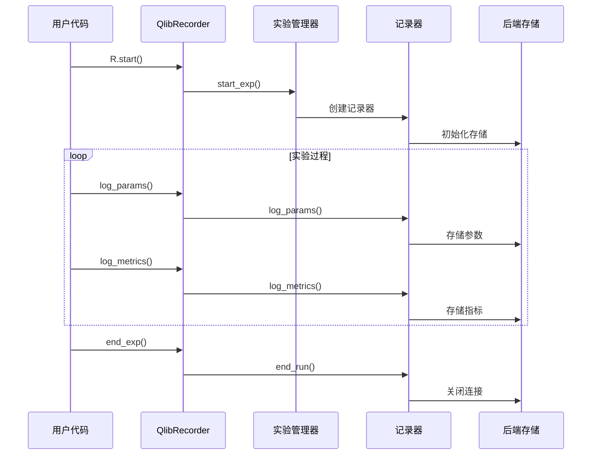
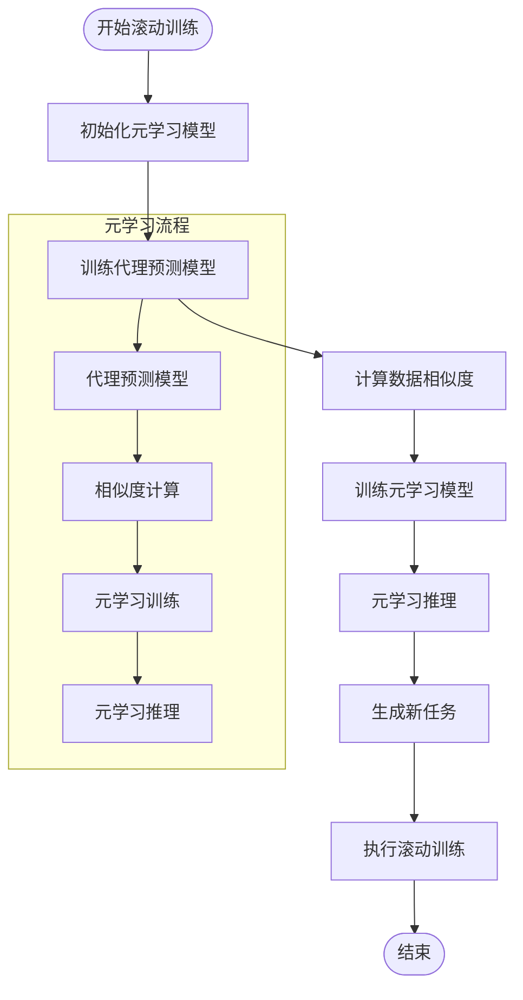
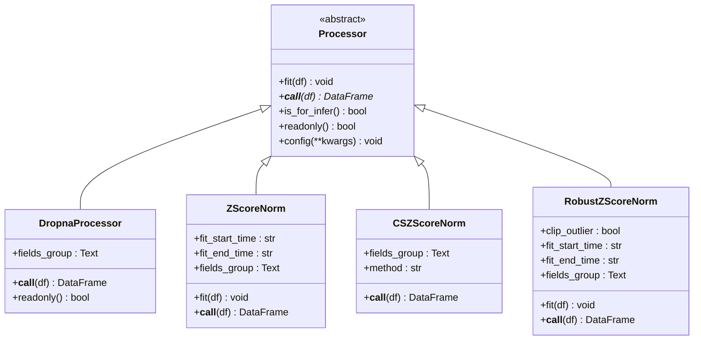
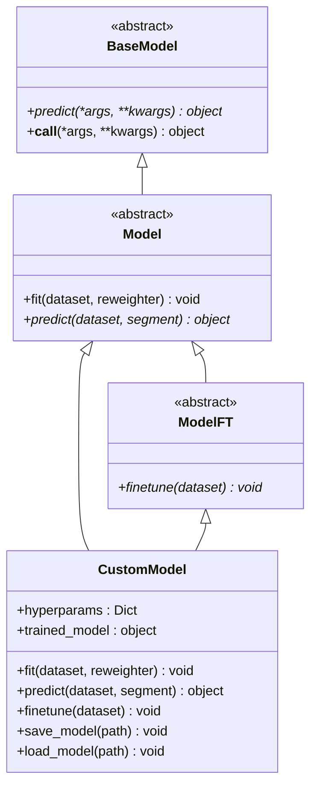
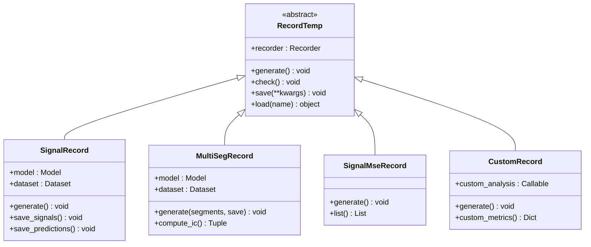
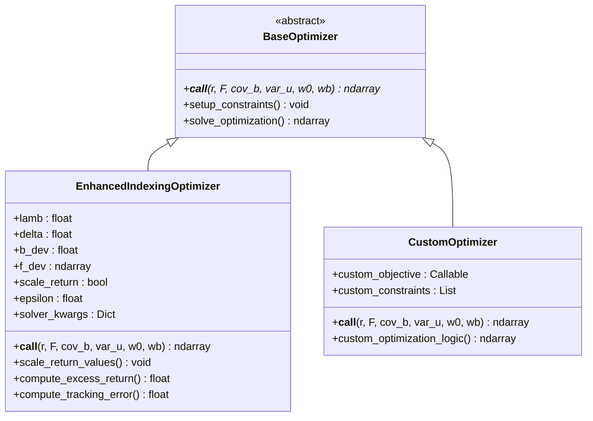

# QLib框架扩展机制详细文档

<cite>
**本文档中引用的文件**
- [qlib/workflow/__init__.py](file://qlib/workflow/__init__.py)
- [qlib/workflow/expm.py](file://qlib/workflow/expm.py)
- [qlib/workflow/recorder.py](file://qlib/workflow/recorder.py)
- [qlib/contrib/rolling/ddgda.py](file://qlib/contrib/rolling/ddgda.py)
- [qlib/data/dataset/processor.py](file://qlib/data/dataset/processor.py)
- [qlib/model/base.py](file://qlib/model/base.py)
- [qlib/contrib/model/pytorch_alstm.py](file://qlib/contrib/model/pytorch_alstm.py)
- [qlib/contrib/workflow/record_temp.py](file://qlib/contrib/workflow/record_temp.py)
- [qlib/contrib/strategy/optimizer/enhanced_indexing.py](file://qlib/contrib/strategy/optimizer/enhanced_indexing.py)
- [qlib/contrib/model/__init__.py](file://qlib/contrib/model/__init__.py)
- [examples/benchmarks_dynamic/DDG-DA/workflow.py](file://examples/benchmarks_dynamic/DDG-DA/workflow.py)
</cite>

## 目录
1. [简介](#简介)
2. [扩展架构概览](#扩展架构概览)
3. [实验管理扩展](#实验管理扩展)
4. [记录器扩展](#记录器扩展)
5. [滚动训练扩展](#滚动训练扩展)
6. [数据处理扩展](#数据处理扩展)
7. [模型扩展](#模型扩展)
8. [工作流扩展](#工作流扩展)
9. [策略扩展](#策略扩展)
10. [最佳实践](#最佳实践)
11. [总结](#总结)

## 简介

QLib框架采用插件化设计，提供了丰富的扩展机制，允许开发者通过多种方式扩展框架功能。本文档详细阐述了如何通过插件化设计扩展实验管理、记录器和滚动训练功能，以及如何注册自定义工作流组件、实现新的记录器类型和集成外部服务。

框架的核心扩展点包括：
- 实验管理器扩展（ExpManager）
- 记录器扩展（Recorder）
- 滚动训练扩展（Rolling）
- 数据处理器扩展（Processor）
- 模型扩展（Model）
- 工作流记录器扩展（RecordTemp）
- 策略优化器扩展（Optimizer）

## 扩展架构概览

QLib框架的扩展机制基于抽象基类和工厂模式设计，通过继承和组合的方式实现功能扩展。



**图表来源**
- [qlib/workflow/expm.py](file://qlib/workflow/expm.py#L20-L50)
- [qlib/workflow/recorder.py](file://qlib/workflow/recorder.py#L25-L60)

## 实验管理扩展

### 核心概念

实验管理器是QLib框架扩展机制的核心组件，负责管理实验的生命周期和资源分配。框架支持多种实验管理后端，包括MLflow和文件系统。

### 扩展点设计



**图表来源**
- [qlib/workflow/expm.py](file://qlib/workflow/expm.py#L20-L100)

### 扩展实现示例

开发者可以通过继承`ExpManager`类来实现自定义实验管理器：

```python
class CustomExpManager(ExpManager):
    def __init__(self, uri: Text, default_exp_name: Optional[Text]):
        super().__init__(uri, default_exp_name)
        # 自定义初始化逻辑
        
    def _start_exp(self, **kwargs) -> Experiment:
        # 自定义实验启动逻辑
        pass
        
    def _end_exp(self, recorder_status: Text = Recorder.STATUS_S, **kwargs):
        # 自定义实验结束逻辑
        pass
```

**章节来源**
- [qlib/workflow/expm.py](file://qlib/workflow/expm.py#L20-L200)

## 记录器扩展

### 记录器架构

记录器负责在实验过程中记录各种指标、参数和模型对象。框架提供了灵活的记录器扩展机制。



**图表来源**
- [qlib/workflow/__init__.py](file://qlib/workflow/__init__.py#L50-L150)
- [qlib/workflow/recorder.py](file://qlib/workflow/recorder.py#L25-L100)

### 自定义记录器实现

```python
class CustomRecorder(Recorder):
    def __init__(self, experiment_id, name):
        super().__init__(experiment_id, name)
        self.custom_backend = self.initialize_custom_backend()
        
    def save_objects(self, local_path=None, artifact_path=None, **kwargs):
        # 自定义对象保存逻辑
        for name, obj in kwargs.items():
            self.custom_backend.save_object(obj, f"{artifact_path}/{name}")
            
    def load_object(self, name):
        # 自定义对象加载逻辑
        return self.custom_backend.load_object(name)
        
    def log_params(self, **kwargs):
        # 自定义参数记录逻辑
        self.custom_backend.log_params(kwargs)
        
    def log_metrics(self, step=None, **kwargs):
        # 自定义指标记录逻辑
        self.custom_backend.log_metrics(step, kwargs)
```

**章节来源**
- [qlib/workflow/recorder.py](file://qlib/workflow/recorder.py#L25-L200)

## 滚动训练扩展

### DDG-DA动态适应模块

DDG-DA（Dynamic Data-driven Data Adaptation）是一个典型的滚动训练扩展示例，展示了如何构建可复用的高级功能模块。



**图表来源**
- [qlib/contrib/rolling/ddgda.py](file://qlib/contrib/rolling/ddgda.py#L50-L150)

### 扩展接口设计

```python
class Rolling:
    def __init__(self, **kwargs):
        self.step = kwargs.get('step', 20)
        self.horizon = kwargs.get('horizon', 20)
        self.working_dir = kwargs.get('working_dir', './rolling_workdir')
        
    def get_task_list(self):
        """获取任务列表，支持动态调整"""
        raise NotImplementedError
        
    def run(self):
        """执行滚动训练"""
        task_list = self.get_task_list()
        for task in task_list:
            self.execute_task(task)
            
    def execute_task(self, task):
        """执行单个任务"""
        raise NotImplementedError
```

**章节来源**
- [qlib/contrib/rolling/ddgda.py](file://qlib/contrib/rolling/ddgda.py#L50-L200)

## 数据处理扩展

### 处理器链设计

数据处理器采用责任链模式，支持多个处理器按顺序执行。



**图表来源**
- [qlib/data/dataset/processor.py](file://qlib/data/dataset/processor.py#L30-L100)

### 自定义处理器实现

```python
class CustomProcessor(Processor):
    def __init__(self, custom_param: str = "default"):
        self.custom_param = custom_param
        self.fitted = False
        
    def fit(self, df: pd.DataFrame = None):
        # 自定义拟合逻辑
        if df is not None:
            self.custom_statistics = self.calculate_statistics(df)
            self.fitted = True
            
    def __call__(self, df: pd.DataFrame):
        # 自定义处理逻辑
        if not self.fitted:
            raise RuntimeError("Processor not fitted")
            
        return self.apply_custom_transformation(df)
        
    def is_for_infer(self) -> bool:
        return True
        
    def readonly(self) -> bool:
        return False
```

**章节来源**
- [qlib/data/dataset/processor.py](file://qlib/data/dataset/processor.py#L30-L200)

## 模型扩展

### 模型基类架构



**图表来源**
- [qlib/model/base.py](file://qlib/model/base.py#L10-L50)

### PyTorch模型扩展示例

```python
class CustomPyTorchModel(Model):
    def __init__(self, **kwargs):
        super().__init__()
        self.model_config = kwargs
        self.device = torch.device("cuda" if torch.cuda.is_available() else "cpu")
        self.model = self.build_model()
        self.optimizer = self.create_optimizer()
        
    def fit(self, dataset: DatasetH, reweighter: Reweighter = None):
        # 数据准备
        df_train, df_valid, df_test = dataset.prepare(
            ["train", "valid", "test"],
            col_set=["feature", "label"],
            data_key=DataHandlerLP.DK_L,
        )
        
        # 训练循环
        for epoch in range(self.model_config.get('epochs', 100)):
            train_loss = self.train_one_epoch(df_train)
            val_loss = self.validate(df_valid)
            
            if self.early_stopping(val_loss):
                break
                
    def predict(self, dataset: DatasetH, segment: Union[Text, slice] = "test") -> object:
        # 预测逻辑
        x_test = dataset.prepare(segment, col_set="feature", data_key=DataHandlerLP.DK_I)
        self.model.eval()
        
        with torch.no_grad():
            predictions = self.model(x_test.values)
            
        return predictions.cpu().numpy()
        
    def finetune(self, dataset: DatasetH):
        # 微调逻辑
        initial_weights = self.model.state_dict()
        self.fit(dataset)
        
        # 可选：权重平滑
        smoothed_weights = self.smooth_weights(initial_weights, self.model.state_dict())
        self.model.load_state_dict(smoothed_weights)
```

**章节来源**
- [qlib/model/base.py](file://qlib/model/base.py#L10-L110)
- [qlib/contrib/model/pytorch_alstm.py](file://qlib/contrib/model/pytorch_alstm.py#L20-L150)

## 工作流扩展

### 记录器类型扩展



**图表来源**
- [qlib/contrib/workflow/record_temp.py](file://qlib/contrib/workflow/record_temp.py#L15-L50)

### 自定义工作流记录器

```python
class CustomAnalysisRecord(RecordTemp):
    def __init__(self, model, dataset, custom_analysis_func=None, recorder=None):
        super().__init__(recorder=recorder)
        self.model = model
        self.dataset = dataset
        self.custom_analysis_func = custom_analysis_func or self.default_analysis
        
    def generate(self):
        # 获取预测结果
        predictions = self.model.predict(self.dataset)
        labels = self.dataset.prepare(
            segment="test", 
            col_set="label", 
            data_key=DataHandlerLP.DK_R
        )
        
        # 执行自定义分析
        custom_metrics = self.custom_analysis_func(predictions, labels)
        
        # 记录结果
        self.recorder.log_metrics(**custom_metrics)
        self.save(**{"custom_metrics.pkl": custom_metrics})
        
    def default_analysis(self, preds, labels):
        # 默认分析逻辑
        metrics = {
            "custom_statistic_1": self.calculate_statistic_1(preds, labels),
            "custom_statistic_2": self.calculate_statistic_2(preds, labels),
        }
        return metrics
```

**章节来源**
- [qlib/contrib/workflow/record_temp.py](file://qlib/contrib/workflow/record_temp.py#L15-L86)

## 策略扩展

### 优化器扩展架构



**图表来源**
- [qlib/contrib/strategy/optimizer/enhanced_indexing.py](file://qlib/contrib/strategy/optimizer/enhanced_indexing.py#L15-L80)

### 增强索引优化器实现

```python
class EnhancedIndexingOptimizer(BaseOptimizer):
    def __init__(self, lamb: float = 1, delta: Optional[float] = 0.2, 
                 b_dev: Optional[float] = 0.01, f_dev: Optional[Union[List[float], np.ndarray]] = None,
                 scale_return: bool = True, epsilon: float = 5e-5, solver_kwargs: Optional[Dict] = {}):
        super().__init__()
        self.lamb = lamb
        self.delta = delta
        self.b_dev = b_dev
        self.f_dev = np.array(f_dev) if f_dev is not None else None
        self.scale_return = scale_return
        self.epsilon = epsilon
        self.solver_kwargs = solver_kwargs
        
    def __call__(self, r: np.ndarray, F: np.ndarray, cov_b: np.ndarray, var_u: np.ndarray, 
                 w0: np.ndarray, wb: np.ndarray, mfh: Optional[np.ndarray] = None, 
                 mfs: Optional[np.ndarray] = None) -> np.ndarray:
        # 规模化预期收益以匹配波动率
        if self.scale_return:
            r = r / r.std()
            r *= np.sqrt(np.mean(np.diag(F @ cov_b @ F.T) + var_u))
            
        # 构建优化问题
        w = cp.Variable(len(r), nonneg=True)
        w.value = wb
        
        # 计算基准偏离和因子暴露
        d = w - wb
        v = d @ F
        
        # 目标函数：超额收益减去风险惩罚
        ret = d @ r
        risk = cp.quad_form(v, cov_b) + var_u @ (d**2)
        obj = cp.Maximize(ret - self.lamb * risk)
        
        # 设置约束条件
        cons = self.setup_constraints(w, wb, w0, mfh, mfs)
        
        # 求解优化问题
        try:
            prob = cp.Problem(obj, cons)
            prob.solve(solver=cp.ECOS, warm_start=True, **self.solver_kwargs)
            return self.post_process_solution(w.value)
        except Exception as e:
            logger.warning(f"Optimization failed: {e}")
            return w0
```

**章节来源**
- [qlib/contrib/strategy/optimizer/enhanced_indexing.py](file://qlib/contrib/strategy/optimizer/enhanced_indexing.py#L15-L202)

## 最佳实践

### 模块解耦原则

1. **单一职责原则**：每个扩展模块应专注于特定功能领域
2. **依赖倒置原则**：高层模块不应依赖低层模块的具体实现
3. **接口隔离原则**：提供最小化的接口定义

### 配置灵活性设计

```python
class ConfigurableExtension:
    def __init__(self, config: Dict[str, Any]):
        self.config = self.validate_config(config)
        self.setup_extensions()
        
    def validate_config(self, config: Dict[str, Any]) -> Dict[str, Any]:
        # 验证配置参数
        required_fields = ['extension_type', 'parameters']
        for field in required_fields:
            if field not in config:
                raise ValueError(f"Missing required field: {field}")
        return config
        
    def setup_extensions(self):
        # 动态加载扩展
        extension_type = self.config['extension_type']
        if extension_type == 'model':
            self.extension = self.load_model_extension()
        elif extension_type == 'processor':
            self.extension = self.load_processor_extension()
        else:
            raise ValueError(f"Unsupported extension type: {extension_type}")
```

### 向后兼容性保障

```python
class BackwardCompatibleExtension:
    def __init__(self, **kwargs):
        # 支持旧版本参数
        if 'old_param' in kwargs:
            warnings.warn("old_param is deprecated, use new_param instead", DeprecationWarning)
            kwargs['new_param'] = kwargs.pop('old_param')
            
        self.param1 = kwargs.get('param1', self.default_param1)
        self.param2 = kwargs.get('param2', self.default_param2)
        
    def backward_compatible_method(self, *args, **kwargs):
        # 提供向后兼容的方法签名
        if len(args) > 0 and isinstance(args[0], OldStyleClass):
            warnings.warn("Old style method call is deprecated", DeprecationWarning)
            return self.new_style_method_from_old(args[0])
        return self.new_style_method(*args, **kwargs)
```

### 错误处理和日志记录

```python
class RobustExtension:
    def __init__(self, **kwargs):
        self.logger = get_module_logger(self.__class__.__name__)
        self.setup_logging()
        
    def safe_execute(self, func, *args, **kwargs):
        try:
            return func(*args, **kwargs)
        except Exception as e:
            self.logger.error(f"Execution failed: {e}")
            return self.handle_failure(e)
            
    def handle_failure(self, error: Exception):
        # 失败处理逻辑
        if isinstance(error, MemoryError):
            return self.retry_with_smaller_batch()
        elif isinstance(error, NetworkError):
            return self.retry_with_backoff()
        else:
            return self.fallback_to_default()
```

## 总结

QLib框架的扩展机制通过以下关键特性实现了高度的可扩展性：

1. **插件化架构**：基于抽象基类的设计，支持多种扩展点
2. **模块化设计**：清晰的职责分离和接口定义
3. **配置驱动**：灵活的配置系统支持运行时扩展
4. **向后兼容**：确保新扩展与现有系统的兼容性
5. **错误处理**：完善的异常处理和恢复机制

通过遵循这些扩展机制和最佳实践，开发者可以：
- 快速实现自定义功能扩展
- 保持代码的可维护性和可测试性
- 确保系统的稳定性和可靠性
- 促进团队协作和代码复用

框架的扩展机制为量化金融领域的复杂需求提供了强大的支撑，使得开发者能够专注于业务逻辑的实现，而无需担心底层架构的复杂性。