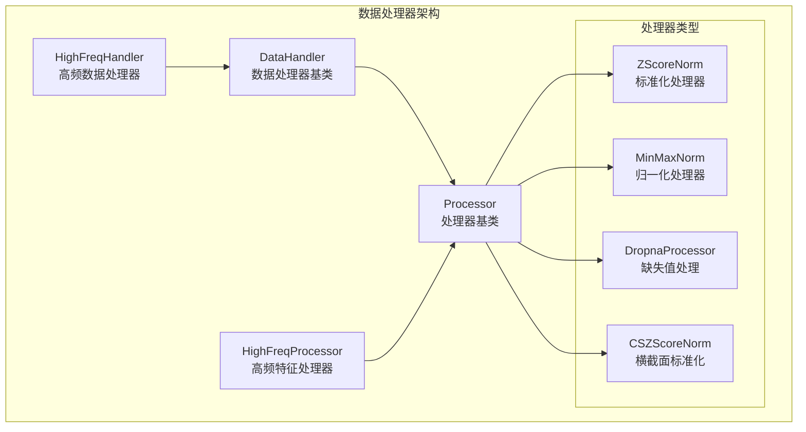
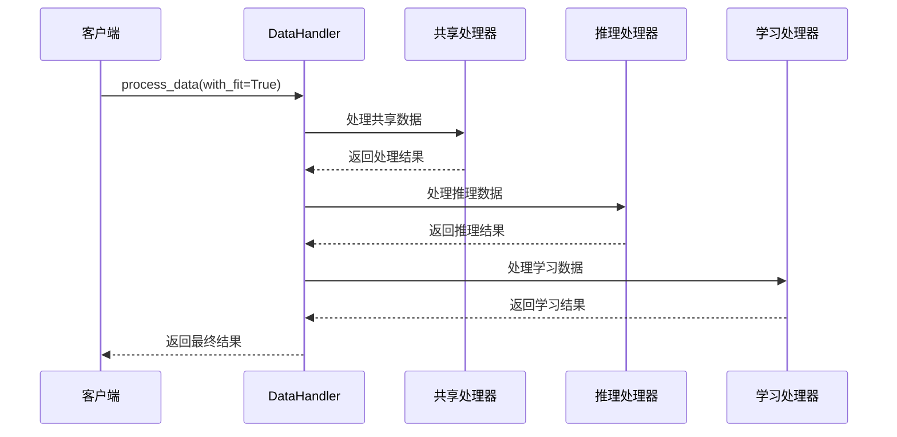
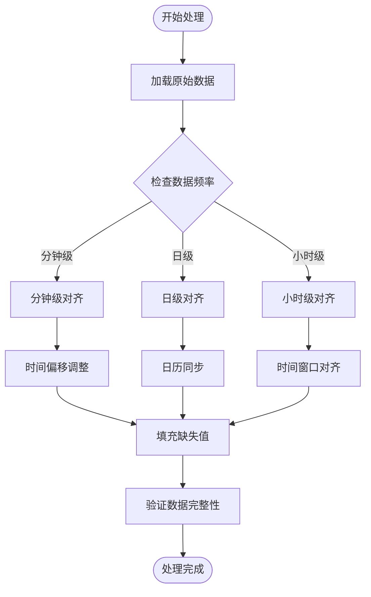
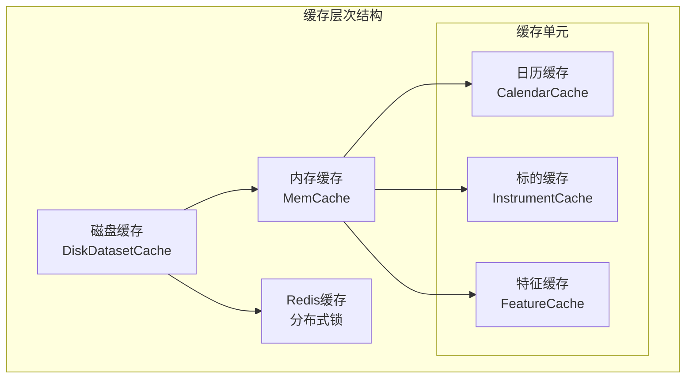

# 自定义数据处理器

<cite>
**本文档引用的文件**
- [processor.py](file://qlib/data/dataset/processor.py)
- [handler.py](file://qlib/data/dataset/handler.py)
- [highfreq_processor.py](file://qlib/contrib/data/highfreq_processor.py)
- [highfreq_handler.py](file://qlib/contrib/data/highfreq_handler.py)
- [highfreq_processor.py](file://examples/highfreq/highfreq_processor.py)
- [highfreq_ops.py](file://examples/highfreq/highfreq_ops.py)
- [workflow.py](file://examples/highfreq/workflow.py)
- [cache.py](file://qlib/data/cache.py)
- [inst_processor.py](file://qlib/data/inst_processor.py)
</cite>

## 目录
1. [简介](#简介)
2. [核心架构概览](#核心架构概览)
3. [DataHandler和Processor接口设计](#datahandler和processor接口设计)
4. [特征工程逻辑实现](#特征工程逻辑实现)
5. [时间序列对齐处理](#时间序列对齐处理)
6. [缺失值填充策略](#缺失值填充策略)
7. [高频数据处理器实现](#高频数据处理器实现)
8. [数据缓存机制](#数据缓存机制)
9. [内存复用优化](#内存复用优化)
10. [调试技巧和故障排除](#调试技巧和故障排除)
11. [最佳实践指南](#最佳实践指南)
12. [总结](#总结)

## 简介

QLib的数据处理器系统是一个高度模块化和可扩展的框架，专门设计用于金融数据的预处理和特征工程。该系统的核心理念是通过统一的接口设计，允许用户轻松创建自定义数据处理器，并将其无缝集成到数据流水线中。

本文档将深入探讨如何实现自定义数据处理器，包括DataHandler和Processor接口的设计原理、特征工程逻辑的实现、时间序列对齐处理、缺失值填充策略等关键技术要点。通过实际代码示例，我们将展示如何构建一个完整的高频数据处理器（HighFreqProcessor）并集成到数据流水线中。

## 核心架构概览

QLib的数据处理器架构采用分层设计，主要包含以下几个核心组件：



**图表来源**
- [processor.py](file://qlib/data/dataset/processor.py#L30-L420)
- [handler.py](file://qlib/data/dataset/handler.py#L552-L774)

**章节来源**
- [processor.py](file://qlib/data/dataset/processor.py#L1-L420)
- [handler.py](file://qlib/data/dataset/handler.py#L1-L774)

## DataHandler和Processor接口设计

### Processor接口设计原理

Processor接口是所有数据处理器的基础抽象，它定义了数据处理的标准流程：

```python
class Processor(Serializable):
    def fit(self, df: pd.DataFrame = None):
        """学习数据处理参数"""
        pass

    @abc.abstractmethod
    def __call__(self, df: pd.DataFrame):
        """处理数据的主要方法"""
        pass

    def is_for_infer(self) -> bool:
        """是否可用于推理阶段"""
        return True

    def readonly(self) -> bool:
        """是否只读处理（不修改输入数据）"""
        return False
```

### DataHandler接口设计

DataHandler作为数据处理器的容器，负责管理多个处理器的执行顺序和数据流：



**图表来源**
- [handler.py](file://qlib/data/dataset/handler.py#L552-L620)

**章节来源**
- [processor.py](file://qlib/data/dataset/processor.py#L30-L101)
- [handler.py](file://qlib/data/dataset/handler.py#L552-L650)

## 特征工程逻辑实现

### 基础特征处理器实现

QLib提供了多种内置的特征处理器，每个都实现了特定的特征工程逻辑：

```python
class ZScoreNorm(Processor):
    """标准差归一化处理器"""
    
    def __init__(self, fit_start_time, fit_end_time, fields_group=None):
        self.fit_start_time = fit_start_time
        self.fit_end_time = fit_end_time
        self.fields_group = fields_group

    def fit(self, df: pd.DataFrame = None):
        """计算训练集的均值和标准差"""
        df = fetch_df_by_index(df, slice(self.fit_start_time, self.fit_end_time), level="datetime")
        cols = get_group_columns(df, self.fields_group)
        self.mean_train = np.nanmean(df[cols].values, axis=0)
        self.std_train = np.nanstd(df[cols].values, axis=0)
        self.ignore = self.std_train == 0

    def __call__(self, df):
        """应用标准化变换"""
        def normalize(x, mean_train=self.mean_train, std_train=self.std_train):
            return (x - mean_train) / std_train

        df.loc(axis=1)[self.cols] = normalize(df[self.cols].values)
        return df
```

### 高频特征处理器实现

高频数据处理器针对高频交易场景进行了特殊优化：

```python
class HighFreqNorm(Processor):
    """高频数据标准化处理器"""
    
    def __init__(self, fit_start_time, fit_end_time):
        self.fit_start_time = fit_start_time
        self.fit_end_time = fit_end_time

    def fit(self, df_features):
        """计算价格和成交量的统计量"""
        fetch_df = fetch_df_by_index(df_features, slice(self.fit_start_time, self.fit_end_time), level="datetime")
        df_values = fetch_df.values
        names = {
            "price": slice(0, 10),
            "volume": slice(10, 12),
        }
        
        for name, name_val in names.items():
            part_values = df_values[:, name_val].astype(np.float32)
            if name == "volume":
                part_values = np.log1p(part_values)
            
            self.feature_med[name] = np.nanmedian(part_values)
            part_values = part_values - self.feature_med[name]
            self.feature_std[name] = np.nanmedian(np.absolute(part_values)) * 1.4826 + EPS
            
            # 计算极值范围
            self.feature_vmax[name] = np.nanmax(part_values)
            self.feature_vmin[name] = np.nanmin(part_values)

    def __call__(self, df_features):
        """应用robust标准化和截断处理"""
        df_values = df_features.values
        names = {
            "price": slice(0, 10),
            "volume": slice(10, 12),
        }

        for name, name_val in names.items():
            if name == "volume":
                df_values[:, name_val] = np.log1p(df_values[:, name_val])
            
            # 应用robust标准化
            df_values[:, name_val] -= self.feature_med[name]
            df_values[:, name_val] /= self.feature_std[name]
            
            # 截断异常值
            slice0 = df_values[:, name_val] > 3.0
            slice1 = df_values[:, name_val] > 3.5
            slice2 = df_values[:, name_val] < -3.0
            slice3 = df_values[:, name_val] < -3.5

            df_values[:, name_val][slice0] = 3.0 + (df_values[:, name_val][slice0] - 3.0) / \
                (self.feature_vmax[name] - 3) * 0.5
            df_values[:, name_val][slice1] = 3.5
            df_values[:, name_val][slice2] = -3.0 - (df_values[:, name_val][slice2] + 3.0) / \
                (self.feature_vmin[name] + 3) * 0.5
            df_values[:, name_val][slice3] = -3.5

        return df_features
```

**章节来源**
- [processor.py](file://qlib/data/dataset/processor.py#L150-L250)
- [highfreq_processor.py](file://examples/highfreq/highfreq_processor.py#L1-L77)

## 时间序列对齐处理

### 时间序列数据对齐机制

QLib的时间序列对齐处理确保不同频率的数据能够正确对齐：



### 数据对齐工具函数

```python
def fetch_df_by_index(df, time_slice, level="datetime"):
    """根据时间切片获取DataFrame数据"""
    if isinstance(df.index, pd.MultiIndex):
        return df.loc(axis=0)[pd.IndexSlice[pd.IndexSlice[time_slice], :]]
    else:
        return df.loc[time_slice]
```

**章节来源**
- [processor.py](file://qlib/data/dataset/processor.py#L15-L25)

## 缺失值填充策略

### 内置缺失值处理器

QLib提供了多种缺失值填充策略：

```python
class Fillna(Processor):
    """NaN值填充处理器"""
    
    def __init__(self, fields_group=None, fill_value=0):
        self.fields_group = fields_group
        self.fill_value = fill_value

    def __call__(self, df):
        if self.fields_group is None:
            df.fillna(self.fill_value, inplace=True)
        else:
            df[self.fields_group] = df[self.fields_group].fillna(self.fill_value)
        return df

class CSZFillna(Processor):
    """横截面NaN值填充处理器"""
    
    def __call__(self, df):
        cols = get_group_columns(df, self.fields_group)
        df[cols] = df[cols].groupby("datetime", group_keys=False).apply(lambda x: x.fillna(x.mean()))
        return df
```

### 高频数据缺失值处理

高频数据的缺失值处理需要考虑市场开收盘时间：

```python
class HighFreqTrans(Processor):
    """高频数据类型转换处理器"""
    
    def __init__(self, dtype: str = "bool"):
        self.dtype = dtype

    def __call__(self, df_features):
        if self.dtype == "bool":
            return df_features.astype(np.int8)  # 转换为整数类型节省内存
        else:
            return df_features.astype(np.float32)  # 保持浮点精度
```

**章节来源**
- [processor.py](file://qlib/data/dataset/processor.py#L250-L300)
- [highfreq_processor.py](file://qlib/contrib/data/highfreq_processor.py#L10-L20)

## 高频数据处理器实现

### HighFreqHandler实现

HighFreqHandler是专门为高频交易数据设计的数据处理器：

```python
class HighFreqHandler(DataHandlerLP):
    """高频数据处理器"""
    
    def __init__(self, instruments="csi300", start_time=None, end_time=None, 
                 infer_processors=[], learn_processors=[], fit_start_time=None, 
                 fit_end_time=None, drop_raw=True):
        
        # 检查和转换处理器配置
        infer_processors = check_transform_proc(infer_processors, fit_start_time, fit_end_time)
        learn_processors = check_transform_proc(learn_processors, fit_start_time, fit_end_time)

        # 配置数据加载器
        data_loader = {
            "class": "QlibDataLoader",
            "kwargs": {
                "config": self.get_feature_config(),
                "swap_level": False,
                "freq": "1min",
            },
        }
        
        super().__init__(
            instruments=instruments,
            start_time=start_time,
            end_time=end_time,
            data_loader=data_loader,
            infer_processors=infer_processors,
            learn_processors=learn_processors,
            drop_raw=drop_raw,
        )

    def get_feature_config(self):
        """获取特征配置"""
        fields = []
        names = []

        # 构建特征表达式
        template_if = "If(IsNull({1}), {0}, {1})"
        template_paused = "Select(Gt($paused_num, 1.001), {0})"

        # 添加价格特征
        fields += [template_paused.format("If(IsNull({0}), 0, {0})".format("$open"))]
        names += ["$open0"]
        # ... 添加其他特征

        return fields, names
```

### 高频特征操作符

高频数据处理需要特殊的操作符支持：

```python
class DayLast(ElemOperator):
    """日末值操作符"""
    
    def _load_internal(self, instrument, start_index, end_index, freq):
        _calendar = get_calendar_day(freq=freq)
        series = self.feature.load(instrument, start_index, end_index, freq)
        return series.groupby(_calendar[series.index], group_keys=False).transform("last")

class FFillNan(ElemOperator):
    """前向填充NaN值操作符"""
    
    def _load_internal(self, instrument, start_index, end_index, freq):
        series = self.feature.load(instrument, start_index, end_index, freq)
        return series.ffill()

class Cut(ElemOperator):
    """数据裁剪操作符"""
    
    def _load_internal(self, instrument, start_index, end_index, freq):
        series = self.feature.load(instrument, start_index, end_index, freq)
        return series.iloc[self.l : self.r]
```

**章节来源**
- [highfreq_handler.py](file://qlib/contrib/data/highfreq_handler.py#L1-L145)
- [highfreq_ops.py](file://examples/highfreq/highfreq_ops.py#L1-L168)

## 数据缓存机制

### 缓存架构设计

QLib的数据缓存系统采用多层缓存架构，包括内存缓存和磁盘缓存：



**图表来源**
- [cache.py](file://qlib/data/cache.py#L1-L100)

### 缓存实现原理

```python
class MemCache:
    """内存缓存管理器"""
    
    def __init__(self, mem_cache_size_limit=None, limit_type="length"):
        size_limit = C.mem_cache_size_limit if mem_cache_size_limit is None else mem_cache_size_limit
        limit_type = C.mem_cache_limit_type if limit_type is None else limit_type

        if limit_type == "length":
            klass = MemCacheLengthUnit
        elif limit_type == "sizeof":
            klass = MemCacheSizeofUnit
        else:
            raise ValueError(f"limit_type must be length or sizeof, your limit_type is {limit_type}")

        self.__calendar_mem_cache = klass(size_limit)
        self.__instrument_mem_cache = klass(size_limit)
        self.__feature_mem_cache = klass(size_limit)

class DiskDatasetCache(DatasetCache):
    """磁盘数据集缓存"""
    
    def _dataset(self, instruments, fields, start_time=None, end_time=None, freq="day", 
                 disk_cache=0, inst_processors=[]):
        
        _cache_uri = self._uri(instruments=instruments, fields=fields, start_time=None, 
                              end_time=None, freq=freq, disk_cache=disk_cache, 
                              inst_processors=inst_processors)
        cache_path = self.get_cache_dir(freq).joinpath(_cache_uri)

        if self.check_cache_exists(cache_path):
            if disk_cache == 1:
                # 使用缓存
                with CacheUtils.reader_lock(self.r, f"{str(C.dpm.get_data_uri(freq))}:dataset-{_cache_uri}"):
                    CacheUtils.visit(cache_path)
                    features = self.read_data_from_cache(cache_path, start_time, end_time, fields)
            elif disk_cache == 2:
                gen_flag = True
        else:
            gen_flag = True

        if gen_flag:
            with CacheUtils.writer_lock(self.r, f"{str(C.dpm.get_data_uri(freq))}:dataset-{_cache_uri}"):
                features = self.gen_dataset_cache(cache_path=cache_path, instruments=instruments, 
                                                fields=fields, freq=freq, inst_processors=inst_processors)
        
        return features
```

**章节来源**
- [cache.py](file://qlib/data/cache.py#L150-L300)
- [cache.py](file://qlib/data/cache.py#L700-L800)

## 内存复用优化

### 内存管理策略

QLib通过多种策略优化内存使用：

```python
class MemCacheUnit(abc.ABC):
    """内存缓存单元基类"""
    
    def __init__(self, *args, **kwargs):
        self.size_limit = kwargs.pop("size_limit", 0)
        self._size = 0
        self.od = OrderedDict()

    def __setitem__(self, key, value):
        """设置缓存项并调整大小"""
        self._adjust_size(key, value)
        self.od.__setitem__(key, value)
        self.od.move_to_end(key)

        if self.limited:
            while self._size > self.size_limit:
                self.popitem(last=False)

    def _adjust_size(self, key, value):
        """调整缓存大小"""
        if key in self.od:
            self._size -= self._get_value_size(self.od[key])
        self._size += self._get_value_size(value)
```

### 高频数据内存优化

高频数据处理器特别注重内存效率：

```python
class HighFreqNorm(Processor):
    """高频数据标准化处理器（内存优化版）"""
    
    def __init__(self, fit_start_time: pd.Timestamp, fit_end_time: pd.Timestamp, 
                 feature_save_dir: str, norm_groups: Dict[str, int]):
        self.fit_start_time = fit_start_time
        self.fit_end_time = fit_end_time
        self.feature_save_dir = feature_save_dir
        self.norm_groups = norm_groups

    def fit(self, df_features) -> None:
        """保存统计量到磁盘避免内存占用"""
        if os.path.exists(self.feature_save_dir) and len(os.listdir(self.feature_save_dir)) != 0:
            return
        
        os.makedirs(self.feature_save_dir)
        fetch_df = fetch_df_by_index(df_features, slice(self.fit_start_time, self.fit_end_time), level="datetime")
        
        # 分组处理减少内存峰值
        for name, dim in self.norm_groups.items():
            names[name] = slice(index, index + dim)
            index += dim
        
        # 保存统计量到文件
        for name, name_val in names.items():
            df_values = fetch_df.iloc(axis=1)[name_val].values
            if name.endswith("volume"):
                df_values = np.log1p(df_values)
            
            self.feature_mean = np.nanmean(df_values)
            np.save(self.feature_save_dir + name + "_mean.npy", self.feature_mean)
            # ... 保存其他统计量

    def __call__(self, df_features):
        """从磁盘加载统计量进行处理"""
        df_values = df_features.values
        
        for name, name_val in names.items():
            feature_mean = np.load(self.feature_save_dir + name + "_mean.npy")
            feature_std = np.load(self.feature_save_dir + name + "_std.npy")
            
            if name.endswith("volume"):
                df_values[:, name_val] = np.log1p(df_values[:, name_val])
            
            df_values[:, name_val] -= feature_mean
            df_values[:, name_val] /= feature_std
        
        return pd.DataFrame(data=df_values, index=df_features.index, columns=df_features.columns)
```

**章节来源**
- [cache.py](file://qlib/data/cache.py#L50-L150)
- [highfreq_processor.py](file://qlib/contrib/data/highfreq_processor.py#L30-L80)

## 调试技巧和故障排除

### 特征泄漏检测

特征泄漏是机器学习中的常见问题，QLib提供了多种检测方法：

```python
class TimeRangeFlt(InstProcessor):
    """时间范围过滤器（可能导致特征泄漏）"""
    
    def __init__(self, start_time: Optional[Union[pd.Timestamp, str]] = None, 
                 end_time: Optional[Union[pd.Timestamp, str]] = None, freq: str = "day"):
        cal = D.calendar(start_time=start_time, end_time=end_time, freq=freq)
        self.start_time = None if start_time is None else cal[0]
        self.end_time = None if end_time is None else cal[-1]

    def __call__(self, df: pd.DataFrame, instrument, *args, **kwargs):
        if (df.empty or (self.start_time is None or df.index.min() <= self.start_time) 
            and (self.end_time is None or df.index.max() >= self.end_time)):
            return df
        return df.head(0)  # 过滤掉不符合条件的数据
```

### 数据切片边界问题排查

```python
def debug_data_slice(handler, start_time, end_time):
    """调试数据切片边界问题"""
    
    # 检查原始数据
    raw_data = handler._data
    print(f"原始数据形状: {raw_data.shape}")
    print(f"原始数据时间范围: {raw_data.index.min()} 到 {raw_data.index.max()}")
    
    # 检查共享处理器输出
    shared_df = handler._run_proc_l(raw_data, handler.shared_processors, with_fit=False)
    print(f"共享处理器输出形状: {shared_df.shape}")
    
    # 检查推理处理器输出
    infer_df = handler._run_proc_l(shared_df, handler.infer_processors, with_fit=False)
    print(f"推理处理器输出形状: {infer_df.shape}")
    
    # 检查学习处理器输出
    learn_df = handler._run_proc_l(shared_df, handler.learn_processors, with_fit=False)
    print(f"学习处理器输出形状: {learn_df.shape}")
    
    # 验证时间范围一致性
    assert infer_df.index.min() >= start_time, "推理数据起始时间超出范围"
    assert infer_df.index.max() <= end_time, "推理数据结束时间超出范围"
    assert learn_df.index.min() >= start_time, "学习数据起始时间超出范围"
    assert learn_df.index.max() <= end_time, "学习数据结束时间超出范围"
```

### 常见错误处理

```python
def handle_processor_errors(processor, df):
    """处理器错误处理"""
    try:
        result = processor(df)
        return result
    except ValueError as e:
        if "shape mismatch" in str(e):
            logger.error(f"数据形状不匹配: {e}")
            # 尝试修复列名或索引
            df.columns = df.columns.str.strip()
            return processor(df)
        else:
            raise
    except KeyError as e:
        logger.error(f"缺少必要列: {e}")
        # 检查可用列
        available_cols = set(df.columns)
        missing_cols = set(get_group_columns(df, processor.fields_group)) - available_cols
        logger.info(f"缺失列: {missing_cols}")
        return df
    except Exception as e:
        logger.error(f"处理器执行失败: {e}")
        # 回退到原始数据
        return df.copy()
```

**章节来源**
- [processor.py](file://qlib/data/dataset/processor.py#L380-L420)

## 最佳实践指南

### 自定义处理器开发规范

1. **继承Processor基类**：确保实现所有必要的方法
2. **实现readonly方法**：准确标识处理器是否修改输入数据
3. **添加配置支持**：通过config方法支持动态配置
4. **编写单元测试**：确保处理器行为的正确性

```python
class CustomProcessor(Processor):
    """自定义处理器示例"""
    
    def __init__(self, param1=1.0, param2="default"):
        self.param1 = param1
        self.param2 = param2

    def fit(self, df: pd.DataFrame = None):
        """实现拟合逻辑"""
        # 计算必要的统计量
        pass

    def __call__(self, df: pd.DataFrame):
        """实现数据处理逻辑"""
        # 执行具体的特征工程
        return df

    def readonly(self) -> bool:
        """返回是否只读"""
        return False

    def config(self, **kwargs):
        """支持动态配置"""
        super().config(**kwargs)
        for key, value in kwargs.items():
            if hasattr(self, key):
                setattr(self, key, value)
```

### 性能优化建议

1. **使用向量化操作**：避免循环遍历DataFrame
2. **内存池管理**：重用大型对象减少GC压力
3. **延迟计算**：只在需要时才执行昂贵的操作
4. **批处理**：对大批量数据使用分块处理

```python
def optimize_processor_performance(processor, df_batch):
    """性能优化处理器"""
    
    # 向量化操作
    def vectorized_operation(data):
        return data.apply(lambda x: x * processor.param1 + processor.param2)
    
    # 批处理
    batch_size = 10000
    results = []
    for i in range(0, len(df_batch), batch_size):
        batch = df_batch[i:i+batch_size]
        result = vectorized_operation(batch)
        results.append(result)
    
    return pd.concat(results)
```

### 错误处理和日志记录

```python
import logging
from functools import wraps

def log_processor_errors(func):
    """处理器错误日志装饰器"""
    @wraps(func)
    def wrapper(self, df, *args, **kwargs):
        try:
            result = func(self, df, *args, **kwargs)
            logger.info(f"处理器 {self.__class__.__name__} 成功处理 {len(df)} 行数据")
            return result
        except Exception as e:
            logger.error(f"处理器 {self.__class__.__name__} 处理失败: {e}")
            logger.error(f"数据形状: {df.shape}")
            logger.error(f"数据样本: {df.head()}")
            raise
    return wrapper

class RobustProcessor(Processor):
    """健壮型处理器"""
    
    @log_processor_errors
    def __call__(self, df: pd.DataFrame):
        # 实现健壮的数据处理逻辑
        return df.fillna(method='ffill').fillna(0)
```

## 总结

QLib的数据处理器系统提供了一个强大而灵活的框架，用于构建自定义数据处理管道。通过理解其核心架构、掌握关键接口设计原理、以及应用最佳实践，开发者可以高效地实现复杂的特征工程需求。

关键要点包括：

1. **模块化设计**：通过Processor接口实现可插拔的数据处理组件
2. **高性能缓存**：利用多层缓存机制提升数据处理效率
3. **内存优化**：通过内存复用和延迟计算减少资源消耗
4. **错误处理**：完善的错误检测和恢复机制确保系统稳定性
5. **调试支持**：丰富的调试工具帮助快速定位和解决问题

通过遵循本文档提供的指导原则和最佳实践，开发者可以构建出高质量、高性能的自定义数据处理器，为金融数据分析和机器学习模型训练提供坚实的基础。