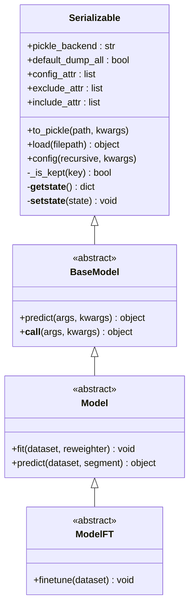
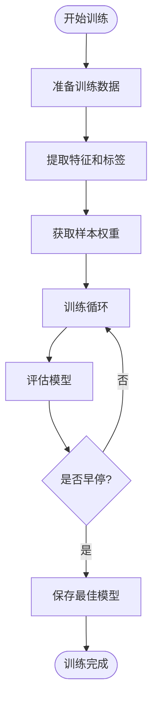
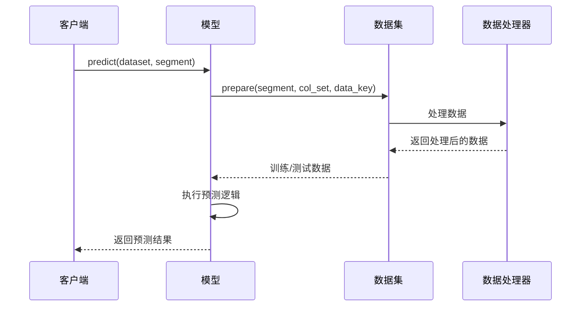
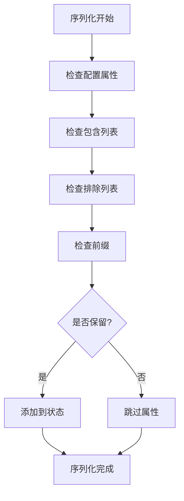
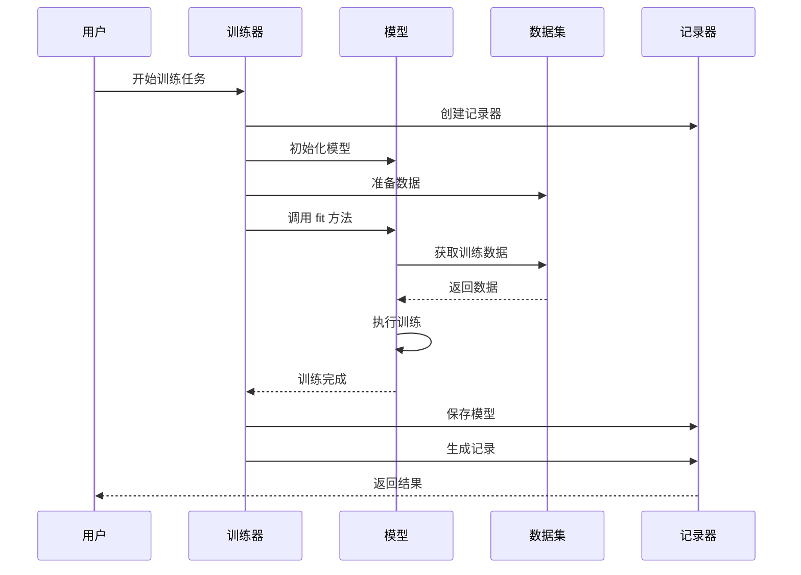

# 在 Qlib 中创建自定义模型

<cite>
**本文档引用的文件**
- [qlib/model/base.py](file://qlib/model/base.py)
- [qlib/model/trainer.py](file://qlib/model/trainer.py)
- [qlib/utils/serial.py](file://qlib/utils/serial.py)
- [qlib/contrib/model/pytorch_lstm.py](file://qlib/contrib/model/pytorch_lstm.py)
- [qlib/contrib/model/catboost_model.py](file://qlib/contrib/model/catboost_model.py)
- [qlib/contrib/model/xgboost.py](file://qlib/contrib/model/xgboost.py)
- [qlib/contrib/model/pytorch_lstm_ts.py](file://qlib/contrib/model/pytorch_lstm_ts.py)
- [qlib/contrib/model/double_ensemble.py](file://qlib/contrib/model/double_ensemble.py)
</cite>

## 目录
1. [简介](#简介)
2. [Model 基类设计](#model-基类设计)
3. [核心方法详解](#核心方法详解)
4. [自定义模型实现指南](#自定义模型实现指南)
5. [PyTorch 模型实现示例](#pytorch-模型实现示例)
6. [传统机器学习模型实现示例](#传统机器学习模型实现示例)
7. [模型序列化与参数管理](#模型序列化与参数管理)
8. [与训练器集成](#与训练器集成)
9. [常见问题与解决方案](#常见问题与解决方案)
10. [性能优化建议](#性能优化建议)
11. [总结](#总结)

## 简介

Qlib 是一个面向量化投资研究的开源框架，提供了完整的机器学习建模和回测系统。在 Qlib 中创建自定义模型需要理解其基于 `Model` 基类的设计理念，该基类定义了所有模型必须实现的核心接口。

自定义模型的创建过程包括：
- 继承 `Model` 基类并实现抽象方法
- 处理数据预处理和特征工程
- 实现训练和预测逻辑
- 集成序列化和参数管理功能
- 与 Qlib 的训练器系统无缝集成

## Model 基类设计

### 基类架构



**图表来源**
- [qlib/model/base.py](file://qlib/model/base.py#L1-L111)

### 核心设计原则

1. **抽象基类设计**: `Model` 类作为所有可学习模型的抽象基类，强制子类实现特定的方法
2. **序列化支持**: 所有模型都继承自 `Serializable`，支持模型持久化和加载
3. **统一接口**: 提供一致的 `fit` 和 `predict` 接口，便于集成和使用
4. **灵活的数据处理**: 支持多种数据集类型和处理方式

**章节来源**
- [qlib/model/base.py](file://qlib/model/base.py#L1-L111)

## 核心方法详解

### fit 方法

`fit` 方法是模型训练的核心入口，负责从数据集中提取特征和标签，执行模型训练，并保存训练结果。

```python
def fit(self, dataset: Dataset, reweighter: Reweighter):
    """
    Learn model from the base model
    
    Parameters
    ----------
    dataset : Dataset
        dataset will generate the processed data from model training.
    """
    raise NotImplementedError()
```

#### 数据准备流程



**图表来源**
- [qlib/model/base.py](file://qlib/model/base.py#L25-L50)

### predict 方法

`predict` 方法负责使用训练好的模型对新数据进行预测。

```python
@abc.abstractmethod
def predict(self, dataset: Dataset, segment: Union[Text, slice] = "test") -> object:
    """
    give prediction given Dataset
    
    Parameters
    ----------
    dataset : Dataset
        dataset will generate the processed dataset from model training.
    segment : Text or slice
        dataset will use this segment to prepare data. (default=test)
        
    Returns
    -------
    Prediction results with certain type such as `pandas.Series`.
    """
    raise NotImplementedError()
```

#### 预测流程



**图表来源**
- [qlib/model/base.py](file://qlib/model/base.py#L55-L75)

**章节来源**
- [qlib/model/base.py](file://qlib/model/base.py#L25-L75)

## 自定义模型实现指南

### 实现步骤

1. **继承 Model 基类**
2. **初始化模型参数**
3. **实现 fit 方法**
4. **实现 predict 方法**
5. **添加辅助方法**
6. **配置序列化选项**

### 基本模板

```python
from qlib.model.base import Model
from qlib.data.dataset import Dataset
from typing import Union, Text

class CustomModel(Model):
    def __init__(self, **kwargs):
        # 初始化模型参数
        self.param1 = kwargs.get('param1', default_value1)
        self.param2 = kwargs.get('param2', default_value2)
        # 其他初始化代码
        
    def fit(self, dataset: Dataset, reweighter=None):
        # 数据准备
        df_train, df_valid = dataset.prepare(
            ["train", "valid"], 
            col_set=["feature", "label"], 
            data_key=DataHandlerLP.DK_L
        )
        
        # 特征和标签提取
        x_train, y_train = df_train["feature"], df_train["label"]
        x_valid, y_valid = df_valid["feature"], df_valid["label"]
        
        # 训练逻辑实现
        # ...
        
    def predict(self, dataset: Dataset, segment: Union[Text, slice] = "test"):
        # 数据准备
        x_test = dataset.prepare(segment, col_set="feature", data_key=DataHandlerLP.DK_I)
        
        # 预测逻辑实现
        # ...
        
        return predictions
```

## PyTorch 模型实现示例

### LSTM 模型实现

以下是一个完整的 PyTorch LSTM 模型实现示例：

```python
import torch
import torch.nn as nn
import torch.optim as optim
import numpy as np
import pandas as pd
from typing import Text, Union
from ...model.base import Model
from ...data.dataset.handler import DataHandlerLP

class LSTM(Model):
    """LSTM Model"""
    
    def __init__(self, d_feat=6, hidden_size=64, num_layers=2, 
                 dropout=0.0, n_epochs=200, lr=0.001, metric="", 
                 batch_size=2000, early_stop=20, loss="mse", 
                 optimizer="adam", GPU=0, seed=None, **kwargs):
        # 设置日志记录器
        self.logger = get_module_logger("LSTM")
        self.logger.info("LSTM pytorch version...")
        
        # 设置超参数
        self.d_feat = d_feat
        self.hidden_size = hidden_size
        self.num_layers = num_layers
        self.dropout = dropout
        self.n_epochs = n_epochs
        self.lr = lr
        self.metric = metric
        self.batch_size = batch_size
        self.early_stop = early_stop
        self.optimizer = optimizer.lower()
        self.loss = loss
        self.device = torch.device("cuda:%d" % (GPU) if torch.cuda.is_available() and GPU >= 0 else "cpu")
        self.seed = seed
        
        # 初始化模型
        self.lstm_model = LSTMModel(
            d_feat=self.d_feat,
            hidden_size=self.hidden_size,
            num_layers=self.num_layers,
            dropout=self.dropout,
        )
        
        # 选择优化器
        if optimizer.lower() == "adam":
            self.train_optimizer = optim.Adam(self.lstm_model.parameters(), lr=self.lr)
        elif optimizer.lower() == "gd":
            self.train_optimizer = optim.SGD(self.lstm_model.parameters(), lr=self.lr)
        else:
            raise NotImplementedError("optimizer {} is not supported!".format(optimizer))
            
        self.fitted = False
        self.lstm_model.to(self.device)
    
    def fit(self, dataset: DatasetH, evals_result=dict(), save_path=None):
        # 数据准备
        df_train, df_valid, df_test = dataset.prepare(
            ["train", "valid", "test"],
            col_set=["feature", "label"],
            data_key=DataHandlerLP.DK_L,
        )
        
        if df_train.empty or df_valid.empty:
            raise ValueError("Empty data from dataset, please check your dataset config.")
            
        x_train, y_train = df_train["feature"], df_train["label"]
        x_valid, y_valid = df_valid["feature"], df_valid["label"]
        
        # 训练循环
        stop_steps = 0
        best_score = -np.inf
        best_epoch = 0
        evals_result["train"] = []
        evals_result["valid"] = []
        
        for step in range(self.n_epochs):
            # 训练阶段
            self.train_epoch(x_train, y_train)
            
            # 评估阶段
            train_loss, train_score = self.test_epoch(x_train, y_train)
            val_loss, val_score = self.test_epoch(x_valid, y_valid)
            
            # 记录结果
            evals_result["train"].append(train_score)
            evals_result["valid"].append(val_score)
            
            # 早停检查
            if val_score > best_score:
                best_score = val_score
                stop_steps = 0
                best_epoch = step
                best_param = copy.deepcopy(self.lstm_model.state_dict())
            else:
                stop_steps += 1
                if stop_steps >= self.early_stop:
                    self.logger.info("early stop")
                    break
                    
        # 加载最佳模型
        self.lstm_model.load_state_dict(best_param)
        torch.save(best_param, save_path)
        
    def predict(self, dataset: DatasetH, segment: Union[Text, slice] = "test"):
        if not self.fitted:
            raise ValueError("model is not fitted yet!")
            
        x_test = dataset.prepare(segment, col_set="feature", data_key=DataHandlerLP.DK_I)
        index = x_test.index
        
        self.lstm_model.eval()
        x_values = x_test.values
        sample_num = x_values.shape[0]
        preds = []
        
        # 批量预测
        for begin in range(sample_num)[::self.batch_size]:
            if sample_num - begin < self.batch_size:
                end = sample_num
            else:
                end = begin + self.batch_size
                
            x_batch = torch.from_numpy(x_values[begin:end]).float().to(self.device)
            with torch.no_grad():
                pred = self.lstm_model(x_batch).detach().cpu().numpy()
            preds.append(pred)
            
        return pd.Series(np.concatenate(preds), index=index)
```

**章节来源**
- [qlib/contrib/model/pytorch_lstm.py](file://qlib/contrib/model/pytorch_lstm.py#L1-L307)

## 传统机器学习模型实现示例

### LightGBM 模型实现

```python
import lightgbm as lgb
import numpy as np
import pandas as pd
from typing import Text, Union
from ...model.base import Model
from ...data.dataset import DatasetH
from ...data.dataset.handler import DataHandlerLP

class LightGBMModel(Model):
    """LightGBM Model"""
    
    def __init__(self, **kwargs):
        self._params = {}
        self._params.update(kwargs)
        self.model = None
        
    def fit(self, dataset: DatasetH, num_boost_round=1000, 
            early_stopping_rounds=50, verbose_eval=20, 
            evals_result=dict(), reweighter=None, **kwargs):
        # 数据准备
        df_train, df_valid = dataset.prepare(
            ["train", "valid"],
            col_set=["feature", "label"],
            data_key=DataHandlerLP.DK_L,
        )
        
        x_train, y_train = df_train["feature"], df_train["label"]
        x_valid, y_valid = df_valid["feature"], df_valid["label"]
        
        # 准备数据集
        if y_train.values.ndim == 2 and y_train.values.shape[1] == 1:
            y_train_1d, y_valid_1d = np.squeeze(y_train.values), np.squeeze(y_valid.values)
        else:
            raise ValueError("LightGBM doesn't support multi-label training")
            
        # 创建数据集
        dtrain = lgb.Dataset(x_train, label=y_train_1d)
        dvalid = lgb.Dataset(x_valid, label=y_valid_1d)
        
        # 训练模型
        callbacks = [lgb.early_stopping(stopping_rounds=early_stopping_rounds)]
        
        self.model = lgb.train(
            self._params,
            dtrain,
            num_boost_round=num_boost_round,
            valid_sets=[dtrain, dvalid],
            valid_names=["train", "valid"],
            callbacks=callbacks,
        )
        
        # 获取评估结果
        evals_result["train"] = list(evals_result["train"].values())[0]
        evals_result["valid"] = list(evals_result["valid"].values())[0]
        
    def predict(self, dataset: DatasetH, segment: Union[Text, slice] = "test"):
        if self.model is None:
            raise ValueError("model is not fitted yet!")
            
        x_test = dataset.prepare(segment, col_set="feature", data_key=DataHandlerLP.DK_I)
        return pd.Series(self.model.predict(x_test.values), index=x_test.index)
```

**章节来源**
- [qlib/contrib/model/xgboost.py](file://qlib/contrib/model/xgboost.py#L1-L86)

## 模型序列化与参数管理

### 序列化机制

Qlib 使用 `Serializable` 基类提供模型序列化功能，支持自动控制哪些属性需要被序列化。



**图表来源**
- [qlib/utils/serial.py](file://qlib/utils/serial.py#L40-L60)

### 参数配置

```python
class CustomModel(Model):
    def __init__(self, **kwargs):
        # 初始化参数
        self.learning_rate = kwargs.get('learning_rate', 0.001)
        self.hidden_dim = kwargs.get('hidden_dim', 64)
        
        # 配置序列化选项
        self.config(
            dump_all=False,  # 只序列化非私有属性
            exclude=['logger', 'device']  # 排除不需要序列化的属性
        )
        
    def fit(self, dataset, **kwargs):
        # 训练逻辑
        # ...
        
        # 保存模型时会自动应用配置
        self.to_pickle('model.pkl')
```

**章节来源**
- [qlib/utils/serial.py](file://qlib/utils/serial.py#L1-L190)

## 与训练器集成

### Trainer 系统架构



**图表来源**
- [qlib/model/trainer.py](file://qlib/model/trainer.py#L40-L80)

### 集成示例

```python
from qlib.model.trainer import task_train
from qlib.workflow import R

# 定义任务配置
task_config = {
    "model": {
        "class": "CustomModel",
        "module_path": "path.to.custom.model",
        "kwargs": {
            "learning_rate": 0.001,
            "hidden_dim": 64
        }
    },
    "dataset": {
        "class": "DatasetH",
        "module_path": "qlib.data.dataset",
        "kwargs": {
            "handler": {
                "class": "Alpha158",
                "module_path": "qlib.contrib.data",
                "kwargs": {
                    "start_time": "2008-01-01",
                    "end_time": "2020-08-01",
                    "fit_start_time": "2008-01-01",
                    "fit_end_time": "2014-12-31"
                }
            },
            "segments": {
                "train": "2008-01-01 00:00:00",
                "valid": "2014-12-31 00:00:00",
                "test": "2020-08-01 00:00:00"
            }
        }
    },
    "record": [
        {
            "class": "SignalRecord",
            "module_path": "qlib.workflow.record_temp",
            "kwargs": {}
        },
        {
            "class": "PortAnaRecord",
            "module_path": "qlib.workflow.record_temp",
            "kwargs": {
                "config": {
                    "stock_cost": 0.001,
                    "benchmark": "SH000300"
                }
            }
        }
    ]
}

# 执行训练
with R.start(experiment_name="custom_model_exp"):
    recorder = task_train(task_config, experiment_name="custom_model_exp")
```

**章节来源**
- [qlib/model/trainer.py](file://qlib/model/trainer.py#L1-L200)

## 常见问题与解决方案

### 数据格式不匹配

**问题**: 输入数据格式与模型期望格式不匹配

**解决方案**:
```python
def fit(self, dataset: Dataset, **kwargs):
    # 确保数据格式正确
    df_train, df_valid = dataset.prepare(
        ["train", "valid"],
        col_set=["feature", "label"],
        data_key=DataHandlerLP.DK_L,
    )
    
    # 检查数据完整性
    if df_train.empty or df_valid.empty:
        raise ValueError("Empty data from dataset, please check your dataset config.")
        
    # 确保特征维度正确
    x_train, y_train = df_train["feature"], df_train["label"]
    assert x_train.shape[1] == self.input_dim, "Feature dimension mismatch"
```

### 训练中断恢复

**问题**: 训练过程中断导致无法继续

**解决方案**:
```python
class ResumableModel(Model):
    def __init__(self, **kwargs):
        super().__init__(**kwargs)
        self.checkpoint_path = kwargs.get('checkpoint_path', 'checkpoint.pth')
        
    def fit(self, dataset: Dataset, **kwargs):
        # 检查是否存在检查点
        if os.path.exists(self.checkpoint_path):
            self.load_checkpoint(self.checkpoint_path)
            
        # 继续训练
        self.train_from_checkpoint(dataset, **kwargs)
        
    def train_from_checkpoint(self, dataset: Dataset, **kwargs):
        # 实现从检查点继续训练的逻辑
        pass
        
    def save_checkpoint(self):
        # 保存当前训练状态
        checkpoint = {
            'model_state': self.model.state_dict(),
            'optimizer_state': self.optimizer.state_dict(),
            'epoch': self.current_epoch,
            'best_score': self.best_score
        }
        torch.save(checkpoint, self.checkpoint_path)
```

### 内存不足问题

**问题**: 大规模数据训练时内存溢出

**解决方案**:
```python
def fit(self, dataset: Dataset, **kwargs):
    # 使用数据生成器减少内存占用
    def data_generator(x, y, batch_size):
        indices = np.arange(len(x))
        np.random.shuffle(indices)
        
        for i in range(0, len(indices), batch_size):
            if len(indices) - i < batch_size:
                break
                
            batch_indices = indices[i:i+batch_size]
            yield x.iloc[batch_indices], y.iloc[batch_indices]
            
    # 使用生成器进行训练
    for epoch in range(self.n_epochs):
        for x_batch, y_batch in data_generator(x_train, y_train, self.batch_size):
            # 处理单个批次
            self.train_step(x_batch, y_batch)
            
        # 清理GPU缓存
        if self.use_gpu:
            torch.cuda.empty_cache()
```

## 性能优化建议

### 批处理大小调整

```python
class OptimizedModel(Model):
    def __init__(self, **kwargs):
        super().__init__(**kwargs)
        self.batch_size = kwargs.get('batch_size', 2000)
        
        # 动态调整批处理大小
        self.dynamic_batch_size = kwargs.get('dynamic_batch_size', False)
        
    def adjust_batch_size(self, memory_usage):
        """根据内存使用情况动态调整批处理大小"""
        if memory_usage > 0.8:
            self.batch_size = max(1, self.batch_size // 2)
        elif memory_usage < 0.5:
            self.batch_size = min(8000, self.batch_size * 2)
```

### GPU 加速配置

```python
def configure_gpu(self, gpu_id=0):
    """配置GPU加速"""
    if torch.cuda.is_available():
        self.device = torch.device(f"cuda:{gpu_id}")
        self.logger.info(f"Using GPU: {torch.cuda.get_device_name(gpu_id)}")
        
        # 设置CUDA优化
        torch.backends.cudnn.benchmark = True
        torch.backends.cudnn.enabled = True
    else:
        self.device = torch.device("cpu")
        self.logger.warning("CUDA not available, using CPU")
```

### 数据预处理优化

```python
def optimize_data_loading(self, dataset: Dataset):
    """优化数据加载"""
    # 使用多线程加载
    torch.set_num_threads(4)
    
    # 缓存常用数据
    self.cache = {}
    
    # 使用混合精度训练
    self.scaler = torch.cuda.amp.GradScaler()
    
    # 预分配内存
    self.preallocate_memory()
```

## 总结

在 Qlib 中创建自定义模型需要遵循以下关键原则：

1. **继承正确的基类**: 继承 `Model` 基类并实现抽象方法
2. **数据处理规范**: 正确处理数据集准备和特征提取
3. **训练流程完整**: 实现完整的训练、验证和测试流程
4. **序列化支持**: 配置适当的序列化选项
5. **错误处理完善**: 添加必要的错误检查和异常处理
6. **性能考虑**: 考虑内存管理和GPU加速

通过遵循这些指导原则，您可以创建高质量、可维护且高效的自定义模型，充分利用 Qlib 框架的强大功能。记住要充分利用 Qlib 提供的工具和基础设施，如训练器系统、序列化机制和数据处理管道，这将大大简化您的开发工作。