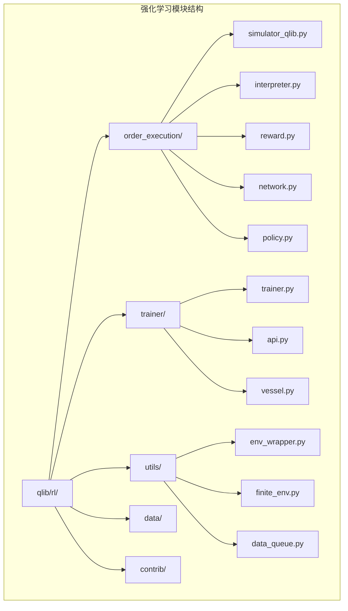
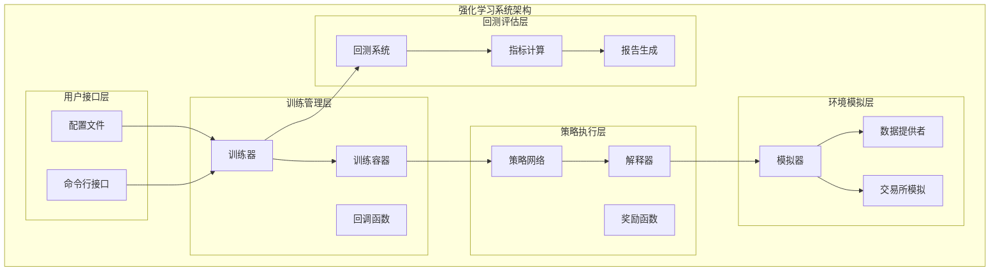
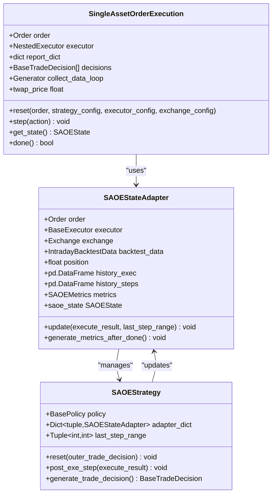
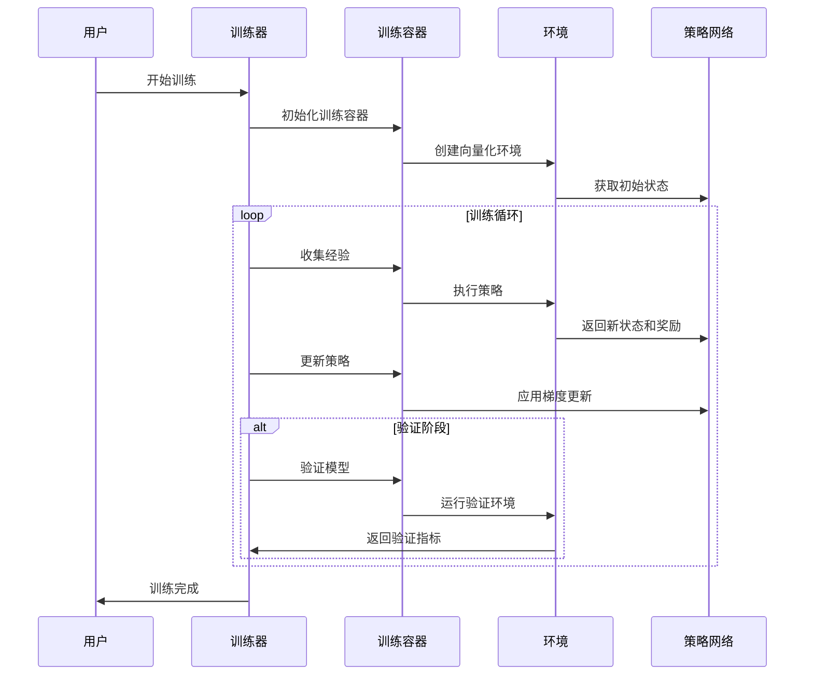
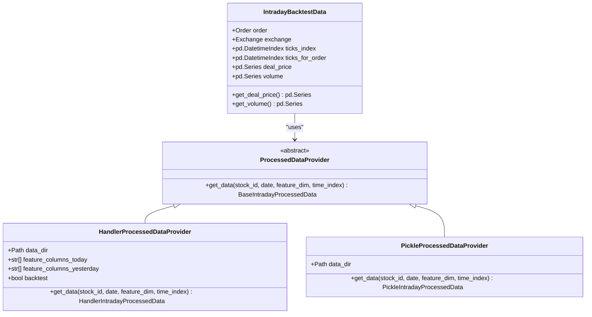
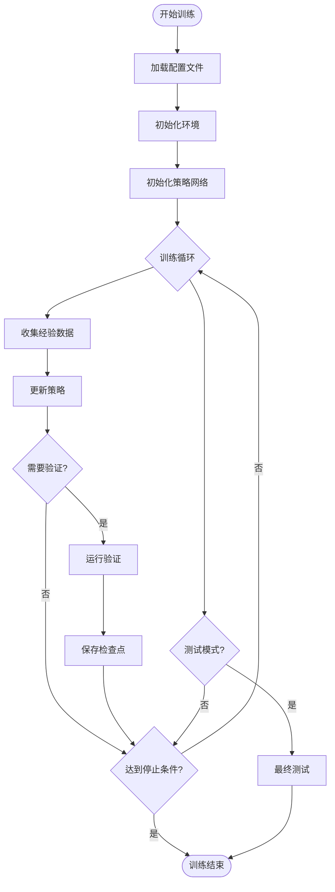
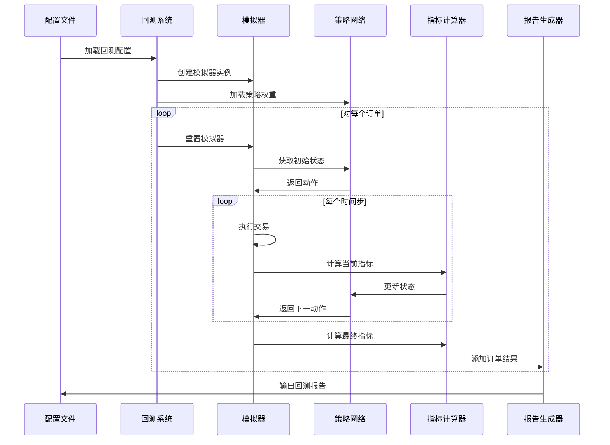
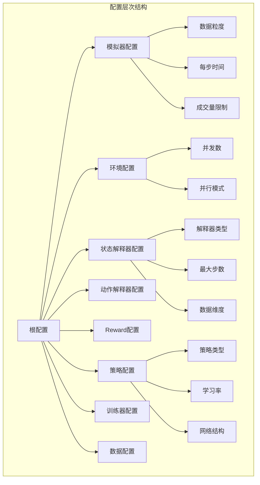

# Qlib 强化学习模块详细文档

<cite>
**本文档中引用的文件**
- [examples/rl_order_execution/README.md](file://examples/rl_order_execution/README.md)
- [qlib/rl/order_execution/simulator_qlib.py](file://qlib/rl/order_execution/simulator_qlib.py)
- [qlib/rl/order_execution/strategy.py](file://qlib/rl/order_execution/strategy.py)
- [qlib/rl/trainer/trainer.py](file://qlib/rl/trainer/trainer.py)
- [qlib/rl/order_execution/interpreter.py](file://qlib/rl/order_execution/interpreter.py)
- [qlib/rl/order_execution/reward.py](file://qlib/rl/order_execution/reward.py)
- [qlib/rl/data/native.py](file://qlib/rl/data/native.py)
- [qlib/rl/__init__.py](file://qlib/rl/__init__.py)
- [tests/rl/test_saoe_simple.py](file://tests/rl/test_saoe_simple.py)
- [examples/rl_order_execution/exp_configs/train_ppo.yml](file://examples/rl_order_execution/exp_configs/train_ppo.yml)
</cite>

## 目录
1. [简介](#简介)
2. [项目结构](#项目结构)
3. [核心组件](#核心组件)
4. [架构概览](#架构概览)
5. [详细组件分析](#详细组件分析)
6. [训练流程](#训练流程)
7. [回测系统](#回测系统)
8. [配置管理](#配置管理)
9. [性能考虑](#性能考虑)
10. [故障排除指南](#故障排除指南)
11. [结论](#结论)

## 简介

Qlib 的强化学习模块是一个专门用于订单执行场景的强化学习框架，提供了完整的端到端解决方案，包括环境模拟、策略训练、回测评估等功能。该模块支持多种强化学习算法，如 PPO（Proximal Policy Optimization）和 OPDS（Oracle Policy Distillation），并集成了 Qlib 的回测引擎，确保了真实性和准确性。

## 项目结构

强化学习模块的核心文件组织如下：



**图表来源**
- [qlib/rl/order_execution/simulator_qlib.py](file://qlib/rl/order_execution/simulator_qlib.py#L1-L50)
- [qlib/rl/trainer/trainer.py](file://qlib/rl/trainer/trainer.py#L1-L50)

**章节来源**
- [examples/rl_order_execution/README.md](file://examples/rl_order_execution/README.md#L1-L101)

## 核心组件

### 订单执行环境（SingleAssetOrderExecution）

订单执行环境是整个强化学习系统的核心，它基于 Qlib 的回测工具构建，提供了真实的市场模拟环境。

```python
class SingleAssetOrderExecution(Simulator[Order, SAOEState, float]):
    """基于 Qlib 回测工具实现的单资产订单执行（SAOE）模拟器"""
    
    def __init__(self, order: Order, executor_config: dict, exchange_config: dict, 
                 qlib_config: dict | None = None, cash_limit: float | None = None):
        super().__init__(initial=order)
        # 初始化策略和执行器
        strategy_config = {
            "class": "SingleOrderStrategy",
            "module_path": "qlib.rl.strategy.single_order",
            "kwargs": {
                "order": order,
                "trade_range": TradeRangeByTime(order.start_time.time(), order.end_time.time()),
            },
        }
```

### 状态解释器（StateInterpreter）

状态解释器负责将原始的模拟器状态转换为神经网络可接受的观测空间格式。

```python
class FullHistoryStateInterpreter(StateInterpreter[SAOEState, FullHistoryObs]):
    """包含今天历史和昨天数据的所有历史观测"""
    
    def interpret(self, state: SAOEState) -> FullHistoryObs:
        processed = self.processed_data_provider.get_data(
            stock_id=state.order.stock_id,
            date=pd.Timestamp(state.order.start_time.date()),
            feature_dim=self.data_dim,
            time_index=state.ticks_index,
        )
        
        return {
            "data_processed": np.array(self._mask_future_info(processed.today, state.cur_time)),
            "data_processed_prev": np.array(processed.yesterday),
            "acquiring": _to_int32(state.order.direction == state.order.BUY),
            "cur_tick": _to_int32(min(int(np.sum(state.ticks_index < state.cur_time)), self.data_ticks - 1)),
            "cur_step": _to_int32(min(state.cur_step, self.max_step - 1)),
            "num_step": _to_int32(self.max_step),
            "target": _to_float32(state.order.amount),
            "position": _to_float32(state.position),
            "position_history": _to_float32(position_history[: self.max_step]),
        }
```

### 动作解释器（ActionInterpreter）

动作解释器将离散的动作决策转换为实际的交易量。

```python
class CategoricalActionInterpreter(ActionInterpreter[SAOEState, int, float]):
    """将离散策略动作转换为连续动作，然后乘以订单数量"""
    
    def interpret(self, state: SAOEState, action: int) -> float:
        assert 0 <= action < len(self.action_values)
        if self.max_step is not None and state.cur_step >= self.max_step - 1:
            return state.position
        else:
            return min(state.position, state.order.amount * self.action_values[action])
```

**章节来源**
- [qlib/rl/order_execution/simulator_qlib.py](file://qlib/rl/order_execution/simulator_qlib.py#L20-L80)
- [qlib/rl/order_execution/interpreter.py](file://qlib/rl/order_execution/interpreter.py#L80-L150)

## 架构概览

强化学习系统采用分层架构设计，确保了模块间的松耦合和高内聚。



**图表来源**
- [qlib/rl/trainer/trainer.py](file://qlib/rl/trainer/trainer.py#L50-L100)
- [qlib/rl/order_execution/strategy.py](file://qlib/rl/order_execution/strategy.py#L1-L50)

## 详细组件分析

### 模拟器组件

#### 单资产订单执行模拟器



**图表来源**
- [qlib/rl/order_execution/simulator_qlib.py](file://qlib/rl/order_execution/simulator_qlib.py#L20-L80)
- [qlib/rl/order_execution/strategy.py](file://qlib/rl/order_execution/strategy.py#L60-L120)

#### 策略执行策略

策略执行策略是连接强化学习算法和实际交易执行的关键组件。

```python
class SAOEStrategy(RLStrategy):
    """基于 SAOEState 的强化学习策略"""
    
    def __init__(self, policy: BasePolicy, outer_trade_decision: BaseTradeDecision = None, 
                 level_infra: LevelInfrastructure = None, common_infra: CommonInfrastructure = None, 
                 data_granularity: int = 1, **kwargs):
        super(SAOEStrategy, self).__init__(
            policy=policy,
            outer_trade_decision=outer_trade_decision,
            level_infra=level_infra,
            common_infra=common_infra,
            **kwargs,
        )
        self.adapter_dict: Dict[tuple, SAOEStateAdapter] = {}
        self._last_step_range = (0, 0)
```

### 训练器组件

#### 主训练器



**图表来源**
- [qlib/rl/trainer/trainer.py](file://qlib/rl/trainer/trainer.py#L200-L280)

**章节来源**
- [qlib/rl/order_execution/strategy.py](file://qlib/rl/order_execution/strategy.py#L300-L400)
- [qlib/rl/trainer/trainer.py](file://qlib/rl/trainer/trainer.py#L100-L200)

### 数据处理组件

#### 数据提供者



**图表来源**
- [qlib/rl/data/native.py](file://qlib/rl/data/native.py#L150-L200)

**章节来源**
- [qlib/rl/data/native.py](file://qlib/rl/data/native.py#L1-L100)

## 训练流程

### 训练配置

训练流程通过 YAML 配置文件进行管理，支持灵活的参数调整：

```yaml
simulator:
  data_granularity: 5
  time_per_step: 30
  vol_limit: null

env:
  concurrency: 32
  parallel_mode: dummy

state_interpreter:
  class: FullHistoryStateInterpreter
  kwargs:
    data_dim: 5
    data_ticks: 48
    max_step: 8
    processed_data_provider:
      class: HandlerProcessedDataProvider
      kwargs:
        data_dir: ./data/pickle/
        feature_columns_today: ["$high", "$low", "$open", "$close", "$volume"]
        feature_columns_yesterday: ["$high_1", "$low_1", "$open_1", "$close_1", "$volume_1"]
        backtest: false

policy:
  class: PPO
  kwargs:
    lr: 0.0001
  module_path: qlib.rl.order_execution.policy

trainer:
  max_epoch: 500
  repeat_per_collect: 25
  episode_per_collect: 10000
  batch_size: 1024
  val_every_n_epoch: 4
```

### 训练过程



**图表来源**
- [examples/rl_order_execution/exp_configs/train_ppo.yml](file://examples/rl_order_execution/exp_configs/train_ppo.yml#L1-L68)

**章节来源**
- [examples/rl_order_execution/exp_configs/train_ppo.yml](file://examples/rl_order_execution/exp_configs/train_ppo.yml#L1-L68)

## 回测系统

### 回测流程

回测系统提供了完整的策略评估功能，支持多种基准策略的对比：



**图表来源**
- [tests/rl/test_saoe_simple.py](file://tests/rl/test_saoe_simple.py#L250-L300)

### 基准策略

系统内置了多种基准策略用于对比：

1. **TWAP（时间加权平均价格）**：最简单的执行策略，按时间均匀分配订单
2. **随机策略**：完全随机的执行策略
3. **固定比例策略**：按照固定比例执行订单

**章节来源**
- [tests/rl/test_saoe_simple.py](file://tests/rl/test_saoe_simple.py#L250-L330)

## 配置管理

### 配置层次结构

强化学习系统的配置采用分层设计：



### 参数说明

#### 模拟器参数
- **data_granularity**: 数据粒度（分钟）
- **time_per_step**: 每步时间间隔（秒）
- **vol_limit**: 成交量限制

#### 环境参数
- **concurrency**: 并发环境数量
- **parallel_mode**: 并行模式（dummy, subproc, shmem）

#### 策略参数
- **lr**: 学习率
- **gamma**: 折扣因子
- **clip_param**: PPO剪切参数
- **vf_coef**: 价值函数系数

**章节来源**
- [examples/rl_order_execution/exp_configs/train_ppo.yml](file://examples/rl_order_execution/exp_configs/train_ppo.yml#L1-L68)

## 性能考虑

### 内存优化

1. **缓存机制**：使用 LRU 缓存存储频繁访问的数据
2. **批处理**：支持批量处理多个订单以提高效率
3. **内存池**：复用对象减少内存分配开销

### 并行处理

```python
# 并行环境创建
def venv_from_iterator(self, iterator: Iterable[InitialStateType]) -> FiniteVectorEnv:
    def env_factory():
        return EnvWrapper(
            self.vessel.simulator_fn,
            self.vessel.state_interpreter,
            self.vessel.action_interpreter,
            iterator,
            self.vessel.reward,
            logger=LogCollector(min_loglevel=self._min_loglevel()),
        )
    
    return vectorize_env(
        env_factory,
        self.finite_env_type,
        self.concurrency,
        self.loggers,
    )
```

### 训练优化

1. **早停机制**：当验证指标不再改善时自动停止训练
2. **学习率调度**：动态调整学习率以提高收敛速度
3. **梯度裁剪**：防止梯度爆炸问题

## 故障排除指南

### 常见问题及解决方案

#### 1. 内存不足错误

**问题描述**：训练过程中出现内存不足异常

**解决方案**：
- 减少并发环境数量
- 使用更小的批次大小
- 启用梯度累积

```yaml
trainer:
  batch_size: 512  # 减少批次大小
  repeat_per_collect: 10  # 减少重复次数
```

#### 2. 收敛性问题

**问题描述**：策略无法收敛或收敛缓慢

**解决方案**：
- 调整学习率
- 修改奖励函数
- 增加探索噪声

```yaml
policy:
  kwargs:
    lr: 0.00001  # 降低学习率
    exploration_noise: 0.1  # 增加探索噪声
```

#### 3. 数据加载问题

**问题描述**：无法正确加载训练数据

**解决方案**：
- 检查数据路径配置
- 验证数据格式兼容性
- 确认特征列名正确

**章节来源**
- [tests/rl/test_saoe_simple.py](file://tests/rl/test_saoe_simple.py#L1-L50)

## 结论

Qlib 的强化学习模块提供了一个完整且强大的订单执行强化学习框架。通过模块化的架构设计，它实现了高度的可扩展性和灵活性。主要特点包括：

1. **完整的端到端解决方案**：从数据准备到模型部署的全流程支持
2. **真实的市场模拟**：基于 Qlib 回测引擎的精确市场环境
3. **多种算法支持**：支持 PPO、DQN 等主流强化学习算法
4. **高效的并行处理**：支持多进程并行训练和回测
5. **丰富的评估指标**：提供全面的策略性能评估

该模块特别适合于量化交易领域的订单执行策略研究和开发，为研究人员和开发者提供了一个可靠的技术平台。