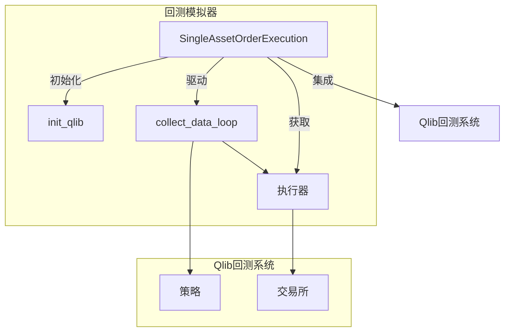
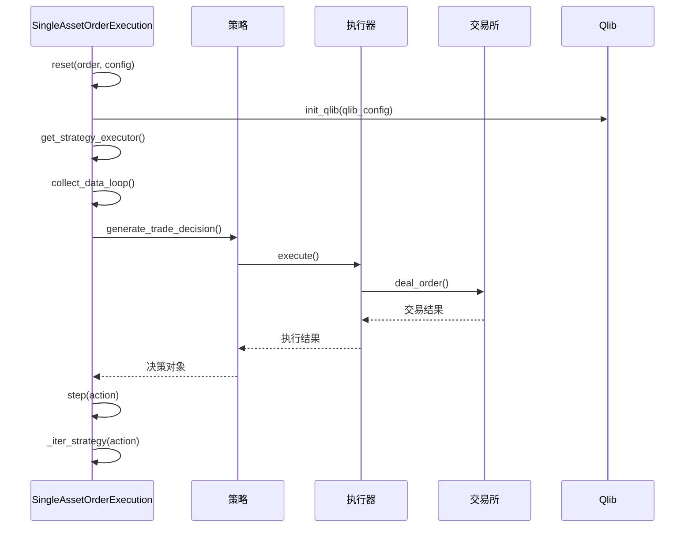
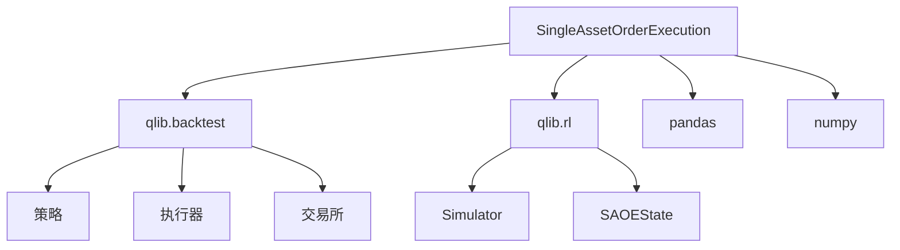

# 回测模拟器

<cite>
**本文档中引用的文件**   
- [simulator_qlib.py](file://qlib/rl/order_execution/simulator_qlib.py)
- [simulator_simple.py](file://qlib/rl/order_execution/simulator_simple.py)
- [backtest_opds.yml](file://examples/rl_order_execution/exp_configs/backtest_opds.yml)
- [contrib/backtest.py](file://qlib/rl/contrib/backtest.py)
- [strategy.py](file://qlib/rl/order_execution/strategy.py)
- [state.py](file://qlib/rl/order_execution/state.py)
- [reward.py](file://qlib/rl/order_execution/reward.py)
- [interpreter.py](file://qlib/rl/order_execution/interpreter.py)
- [policy.py](file://qlib/rl/order_execution/policy.py)
- [network.py](file://qlib/rl/order_execution/network.py)
- [utils.py](file://qlib/rl/order_execution/utils.py)
</cite>

## 目录
1. [简介](#简介)
2. [核心组件](#核心组件)
3. [架构概述](#架构概述)
4. [详细组件分析](#详细组件分析)
5. [依赖分析](#依赖分析)
6. [性能考虑](#性能考虑)
7. [故障排除指南](#故障排除指南)
8. [结论](#结论)

## 简介
本文档详细阐述了Qlib回测框架中的`SingleAssetOrderExecution`回测模拟器。该模拟器旨在为单资产订单执行提供一个精确的回测环境，能够模拟真实市场中的各种约束，如最小交易单位、交易成本和流动性限制。文档将深入解析其如何基于Qlib核心回测引擎构建，以及如何通过YAML配置文件定义回测参数。

## 核心组件
`SingleAssetOrderExecution`是Qlib中用于单资产订单执行回测的核心模拟器类。它继承自`Simulator`基类，并利用Qlib的回测系统来驱动整个回测流程。该模拟器通过`init_qlib`初始化Qlib环境，并使用`get_strategy_executor`和`collect_data_loop`与Qlib的回测系统进行集成。`_iter_strategy`方法是驱动回测循环的关键，它负责处理`BaseTradeDecision`决策对象，并与底层的Qlib执行器进行交互。

**本节来源**
- [simulator_qlib.py](file://qlib/rl/order_execution/simulator_qlib.py#L30-L141)
- [simulator_simple.py](file://qlib/rl/order_execution/simulator_simple.py#L30-L363)

## 架构概述
`SingleAssetOrderExecution`模拟器的架构基于Qlib的回测引擎，它通过一个嵌套的执行器（`NestedExecutor`）来协调策略和交易所的交互。模拟器的初始化过程包括设置订单、配置执行器和交易所，以及初始化Qlib环境。回测循环通过`collect_data_loop`生成器驱动，该生成器在每个时间步调用策略生成交易决策，并将决策传递给执行器进行处理。

**图表来源**
- [simulator_qlib.py](file://qlib/rl/order_execution/simulator_qlib.py#L30-L141)
- [contrib/backtest.py](file://qlib/rl/contrib/backtest.py#L290-L384)

## 详细组件分析
### SingleAssetOrderExecution分析
`SingleAssetOrderExecution`类是Qlib中用于单资产订单执行回测的主要实现。它的`__init__`方法接收一个订单对象和多个配置字典，用于设置执行器、交易所和Qlib环境。`reset`方法负责重置模拟器状态，并初始化Qlib环境（如果提供了`qlib_config`）。`step`方法执行回测的单个步骤，通过`_iter_strategy`方法与Qlib的回测循环进行交互。

#### 对于API/服务组件：

**图表来源**
- [simulator_qlib.py](file://qlib/rl/order_execution/simulator_qlib.py#L30-L141)
- [contrib/backtest.py](file://qlib/rl/contrib/backtest.py#L290-L384)

### simulator_qlib与simulator_simple对比
`simulator_qlib`和`simulator_simple`是两种不同的回测模拟器实现。`simulator_qlib`基于Qlib的核心回测引擎，能够提供更真实、更复杂的市场模拟，包括与Qlib的策略、执行器和交易所的深度集成。而`simulator_simple`则是一个更轻量级的实现，它直接从数据文件中加载市场数据，并在每个时间步进行简单的交易模拟。

在`twap_price`的计算上，两者都计算订单执行期间的平均成交价。`simulator_qlib`通过其内部的`SAOEStateAdapter`来计算，而`simulator_simple`则直接在`__init__`方法中计算。在交易执行逻辑上，`simulator_qlib`依赖于Qlib的`deal_order`方法来处理交易，而`simulator_simple`则在`_split_exec_vol`方法中实现了自己的交易逻辑，包括将交易量平均分配到每个时间步，并应用交易量阈值限制。

**本节来源**
- [simulator_qlib.py](file://qlib/rl/order_execution/simulator_qlib.py#L30-L141)
- [simulator_simple.py](file://qlib/rl/order_execution/simulator_simple.py#L30-L363)
- [strategy.py](file://qlib/rl/order_execution/strategy.py#L90-L289)

### 配置文件分析
用户可以通过YAML配置文件（如`backtest_opds.yml`）来定义回测参数。该配置文件指定了订单文件路径、回测时间范围、数据粒度、Qlib数据路径、交易所配置以及策略配置。策略配置部分可以定义多个策略，例如`1day`策略使用了基于强化学习的`SAOEIntStrategy`，而`30min`策略则使用了传统的`TWAPStrategy`。配置文件还指定了并发数和输出目录。

**本节来源**
- [backtest_opds.yml](file://examples/rl_order_execution/exp_configs/backtest_opds.yml#L1-L54)

### 回测报告分析
回测完成后，系统会生成一个回测报告字典`report_dict`，其中包含了关键的绩效指标。该字典通过`collect_data_loop`函数填充，其中包含了投资组合指标（`portfolio_dict`）和指示器指标（`indicator_dict`）。`indicator_dict`包含了按频率（如"1day"）组织的指标数据框和指标对象，可以用于计算和分析订单完成率（ffr）、价格优势（pa）等关键绩效指标。

**本节来源**
- [contrib/backtest.py](file://qlib/rl/contrib/backtest.py#L290-L384)
- [simulator_qlib.py](file://qlib/rl/order_execution/simulator_qlib.py#L84-L91)

## 依赖分析
`SingleAssetOrderExecution`模拟器依赖于Qlib框架的多个核心模块。它直接依赖于`qlib.backtest`模块中的`collect_data_loop`、`get_strategy_executor`、`BaseTradeDecision`和`Order`等类，用于与Qlib回测系统集成。同时，它也依赖于`qlib.rl`模块中的`Simulator`基类和`SAOEState`状态类。外部依赖包括`pandas`用于数据处理，`numpy`用于数值计算。

**图表来源**
- [simulator_qlib.py](file://qlib/rl/order_execution/simulator_qlib.py#L1-L141)
- [contrib/backtest.py](file://qlib/rl/contrib/backtest.py#L290-L384)

## 性能考虑
`SingleAssetOrderExecution`模拟器的性能主要受Qlib回测引擎和底层数据访问的影响。由于它深度集成于Qlib，其性能与Qlib的执行效率直接相关。对于大规模回测，建议使用`concurrency`参数进行并行处理。`simulator_simple`由于其轻量级的设计，可能在某些场景下提供更快的回测速度，但牺牲了市场模拟的真实性。

## 故障排除指南
在使用`SingleAssetOrderExecution`时，常见的问题包括Qlib环境初始化失败、订单执行失败和数据加载错误。确保`qlib_config`配置正确，并且Qlib数据路径（`provider_uri_5min`）指向有效的数据目录。检查订单文件的格式是否正确，订单的开始和结束时间是否在交易日范围内。如果遇到数据加载问题，请验证数据文件是否存在且格式正确。

**本节来源**
- [simulator_qlib.py](file://qlib/rl/order_execution/simulator_qlib.py#L30-L141)
- [simulator_simple.py](file://qlib/rl/order_execution/simulator_simple.py#L30-L363)
- [backtest_opds.yml](file://examples/rl_order_execution/exp_configs/backtest_opds.yml#L1-L54)

## 结论
`SingleAssetOrderExecution`是一个功能强大且灵活的回测模拟器，它充分利用了Qlib框架的优势，为单资产订单执行策略提供了精确的回测环境。通过与Qlib核心回测引擎的深度集成，它能够模拟真实市场的复杂性。用户可以通过YAML配置文件轻松定义回测参数，并通过生成的回测报告字典分析策略的绩效。理解`simulator_qlib`和`simulator_simple`之间的差异，有助于用户根据具体需求选择合适的模拟器。