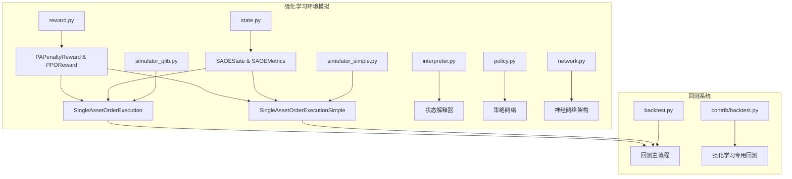
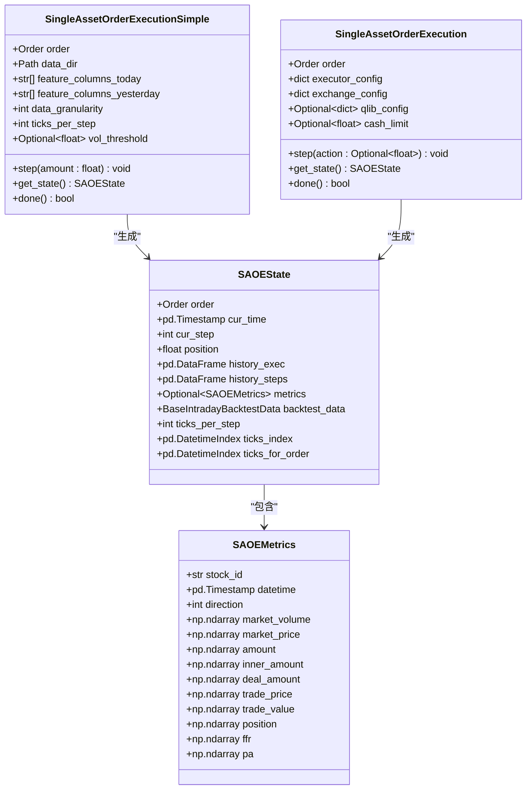
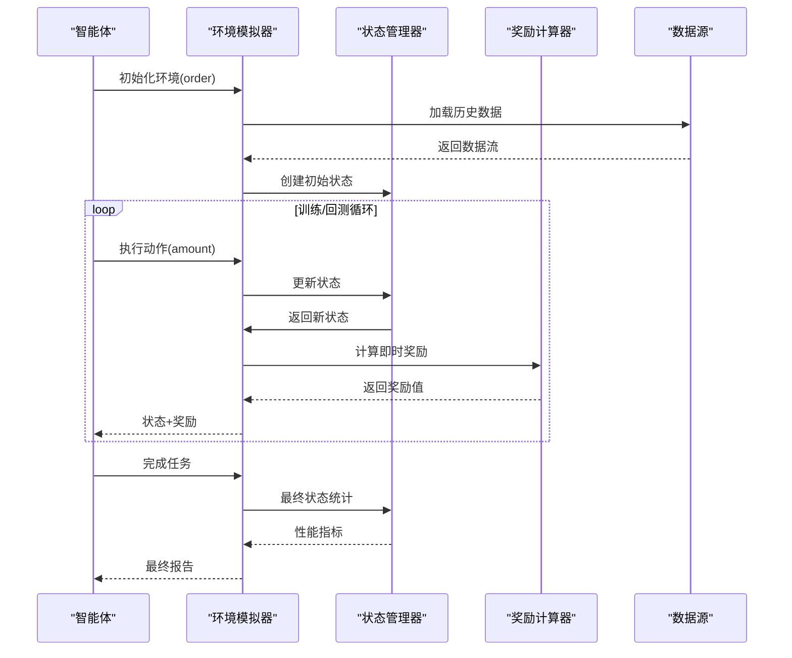
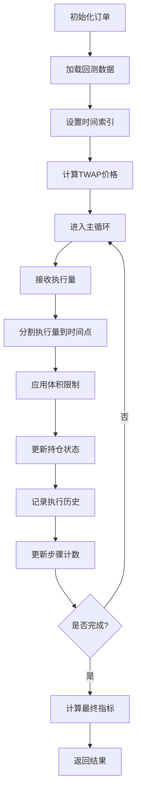
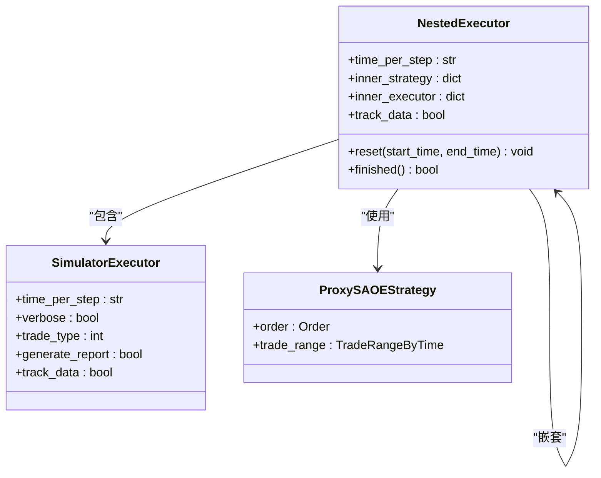
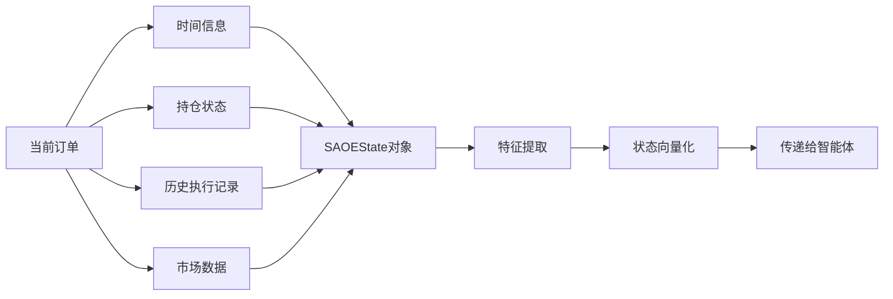
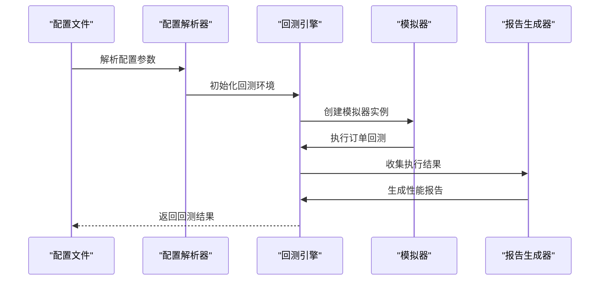
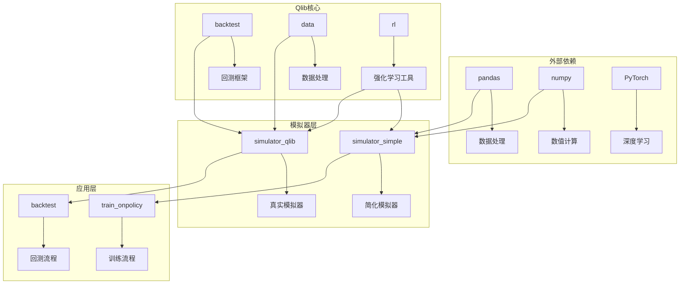

# 环境模拟

<cite>
**本文档中引用的文件**
- [simulator_simple.py](file://qlib/rl/order_execution/simulator_simple.py)
- [simulator_qlib.py](file://qlib/rl/order_execution/simulator_qlib.py)
- [state.py](file://qlib/rl/order_execution/state.py)
- [reward.py](file://qlib/rl/order_execution/reward.py)
- [backtest.py](file://qlib/backtest/backtest.py)
- [backtest.py](file://qlib/rl/contrib/backtest.py)
- [train_ppo.yml](file://examples/rl_order_execution/exp_configs/train_ppo.yml)
- [backtest_ppo.yml](file://examples/rl_order_execution/exp_configs/backtest_ppo.yml)
- [README.md](file://examples/rl_order_execution/README.md)
</cite>

## 目录
1. [简介](#简介)
2. [项目结构](#项目结构)
3. [核心组件](#核心组件)
4. [架构概览](#架构概览)
5. [详细组件分析](#详细组件分析)
6. [依赖关系分析](#依赖关系分析)
7. [性能考虑](#性能考虑)
8. [故障排除指南](#故障排除指南)
9. [结论](#结论)

## 简介

Qlib 的强化学习环境模拟系统为订单执行场景提供了两个主要的模拟器实现：`SingleAssetOrderExecutionSimple` 和 `SingleAssetOrderExecution`。这两个模拟器在设计目标和实现方式上存在显著差异，分别服务于不同的使用场景。

`simulator_simple.py` 提供了一个高效的简化版本，主要用于训练阶段，允许无限制的交易量，不考虑实际市场约束。而 `simulator_qlib.py` 则是一个更真实的回测模拟器，考虑了最小交易单位、市场限制等现实约束条件。

## 项目结构

强化学习环境模拟的核心文件位于 `qlib/rl/order_execution/` 目录下：



**图表来源**
- [simulator_simple.py](file://qlib/rl/order_execution/simulator_simple.py#L1-L50)
- [simulator_qlib.py](file://qlib/rl/order_execution/simulator_qlib.py#L1-L50)
- [state.py](file://qlib/rl/order_execution/state.py#L1-L50)

**章节来源**
- [simulator_simple.py](file://qlib/rl/order_execution/simulator_simple.py#L1-L363)
- [simulator_qlib.py](file://qlib/rl/order_execution/simulator_qlib.py#L1-L142)

## 核心组件

### 模拟器类型对比

| 特性 | SingleAssetOrderExecutionSimple | SingleAssetOrderExecution |
|------|----------------------------------|---------------------------|
| 设计目标 | 高效训练，无限制交易 | 真实回测，考虑市场约束 |
| 交易粒度 | 时间戳级别（每tick一次） | 基于Qlib回测框架 |
| 数据源 | pickle格式数据 | Qlib处理的数据流 |
| 约束处理 | 无 | 考虑最小交易单位 |
| 性能 | 更快 | 更慢但更准确 |
| 使用场景 | 训练阶段 | 回测验证 |

### 状态管理机制



**图表来源**
- [state.py](file://qlib/rl/order_execution/state.py#L15-L101)
- [simulator_simple.py](file://qlib/rl/order_execution/simulator_simple.py#L25-L100)
- [simulator_qlib.py](file://qlib/rl/order_execution/simulator_qlib.py#L15-L80)

**章节来源**
- [state.py](file://qlib/rl/order_execution/state.py#L1-L102)
- [simulator_simple.py](file://qlib/rl/order_execution/simulator_simple.py#L25-L150)

## 架构概览

强化学习环境模拟的整体架构遵循经典的强化学习框架，包含状态表示、动作执行和奖励计算三个核心环节：



**图表来源**
- [simulator_simple.py](file://qlib/rl/order_execution/simulator_simple.py#L100-L200)
- [simulator_qlib.py](file://qlib/rl/order_execution/simulator_qlib.py#L80-L140)

## 详细组件分析

### SingleAssetOrderExecutionSimple 分析

`SingleAssetOrderExecutionSimple` 是一个高度简化的模拟器，专为训练效率优化：

#### 核心特性

1. **时间戳驱动的交易**：每个时间戳点视为独立的交易机会
2. **动态分割执行量**：将总执行量均匀分配到每个时间点
3. **体积阈值控制**：可配置最大执行体积限制
4. **TWAP基准**：使用时间加权平均价格作为基准

#### 实现细节



**图表来源**
- [simulator_simple.py](file://qlib/rl/order_execution/simulator_simple.py#L100-L200)

#### 关键方法分析

- **`step(amount: float)`**：执行单步操作，将指定数量的资产分配到当前时间窗口
- **`_split_exec_vol(exec_vol_sum: float)`**：将总执行量按时间点均匀分割
- **`_metrics_collect()`**：收集并计算各种性能指标

**章节来源**
- [simulator_simple.py](file://qlib/rl/order_execution/simulator_simple.py#L100-L300)

### SingleAssetOrderExecution 分析

`SingleAssetOrderExecution` 基于 Qlib 的回测框架，提供更真实的市场模拟：

#### 核心特性

1. **多层执行器架构**：支持嵌套的时间层次结构
2. **真实市场约束**：考虑最小交易单位和市场限制
3. **Qlib集成**：直接使用 Qlib 的数据处理和回测功能
4. **灵活配置**：支持多种执行器和交易所配置

#### 实现架构



**图表来源**
- [simulator_qlib.py](file://qlib/rl/order_execution/simulator_qlib.py#L25-L80)

**章节来源**
- [simulator_qlib.py](file://qlib/rl/order_execution/simulator_qlib.py#L25-L142)

### 状态更新机制

状态更新是模拟器的核心功能，涉及多个维度的信息收集和处理：



**图表来源**
- [state.py](file://qlib/rl/order_execution/state.py#L50-L101)

**章节来源**
- [state.py](file://qlib/rl/order_execution/state.py#L15-L102)

### 奖励计算系统

奖励系统是强化学习的关键组成部分，直接影响智能体的学习行为：

#### PAPenaltyReward 分析

基于价格优势的惩罚奖励机制：

```mermaid
flowchart TD
A[获取最新步骤指标] --> B[计算价格优势(PA)]
B --> C[计算执行量分布惩罚]
C --> D[组合奖励 = PA - 惩罚]
D --> E[标准化奖励]
E --> F[返回最终奖励]
G[执行量分布] --> C
H[惩罚系数] --> C
I[总执行量] --> B
```

**图表来源**
- [reward.py](file://qlib/rl/order_execution/reward.py#L15-L50)

#### PPOReward 分析

论文提出的基于 PPO 的奖励函数：

- **分段奖励**：根据执行进度和最终表现给予不同奖励
- **VWAP/TWAP 比较**：评估执行效果相对于基准的表现
- **风险控制**：对低于基准的情况施加负奖励

**章节来源**
- [reward.py](file://qlib/rl/order_execution/reward.py#L1-L100)

### 回测流程分析

回测系统负责验证训练好的模型在历史数据上的表现：

#### 启动回测流程



**图表来源**
- [backtest.py](file://qlib/rl/contrib/backtest.py#L150-L250)

#### 回测结果文件结构

回测完成后生成的结果文件包含以下关键指标：

| 指标名称 | 描述 | 单位 |
|----------|------|------|
| ffr | 完成百分比 | 百分比 |
| pa | 价格优势 | BP (基点) |
| market_price | 市场均价 | 价格单位 |
| trade_price | 执行均价 | 价格单位 |
| deal_amount | 成交数量 | 股票数量 |
| position | 剩余持仓 | 股票数量 |

**章节来源**
- [backtest.py](file://qlib/rl/contrib/backtest.py#L1-L385)

## 依赖关系分析

强化学习环境模拟系统的依赖关系复杂，涉及多个层次的组件交互：



**图表来源**
- [simulator_simple.py](file://qlib/rl/order_execution/simulator_simple.py#L1-L20)
- [simulator_qlib.py](file://qlib/rl/order_execution/simulator_qlib.py#L1-L20)

**章节来源**
- [simulator_simple.py](file://qlib/rl/order_execution/simulator_simple.py#L1-L30)
- [simulator_qlib.py](file://qlib/rl/order_execution/simulator_qlib.py#L1-L30)

## 性能考虑

### 训练与回测的性能差异

1. **数据加载速度**：
   - 简化模拟器：快速加载pickle格式数据
   - 真实模拟器：需要完整的Qlib数据处理管道

2. **内存占用**：
   - 简化模拟器：较低的内存需求
   - 真实模拟器：更高的内存消耗，因为需要维护完整的执行历史

3. **计算复杂度**：
   - 简化模拟器：线性复杂度
   - 真实模拟器：受嵌套执行器影响，复杂度较高

### 优化建议

1. **批量处理**：使用多进程并行回测提高效率
2. **缓存机制**：缓存频繁访问的数据
3. **内存管理**：及时清理不需要的历史数据

## 故障排除指南

### 常见问题及解决方案

#### 1. 训练与回测结果差异

**问题描述**：训练时的性能指标与回测结果不一致

**原因分析**：
- 简化模拟器允许完全执行订单，而真实模拟器有体积限制
- 不同模拟器的市场约束处理方式不同

**解决方案**：
- 在训练配置中添加权重文件路径
- 使用相同的模拟器进行训练和回测

#### 2. 内存不足错误

**问题描述**：回测过程中出现内存溢出

**解决方案**：
- 减少并发进程数
- 使用更小的批次大小
- 清理不必要的中间数据

#### 3. 数据加载失败

**问题描述**：无法找到或加载回测数据

**解决方案**：
- 检查数据目录路径配置
- 验证pickle文件完整性
- 确认数据格式符合要求

**章节来源**
- [README.md](file://examples/rl_order_execution/README.md#L60-L90)

## 结论

Qlib 的强化学习环境模拟系统提供了一套完整的解决方案，从高效的训练模拟器到真实的回测环境，满足了不同阶段的需求。通过合理选择和配置模拟器，可以在保证训练效率的同时获得可靠的回测结果。

关键要点总结：

1. **选择合适的模拟器**：训练阶段使用简化模拟器，回测阶段使用真实模拟器
2. **理解性能差异**：训练和回测结果可能存在差异，需正确理解和解释
3. **配置优化**：合理配置参数以平衡性能和准确性
4. **监控和调试**：建立完善的监控机制，及时发现和解决问题

这个系统为金融领域的强化学习应用提供了坚实的基础，特别是在订单执行这一重要场景中展现了强大的实用价值。