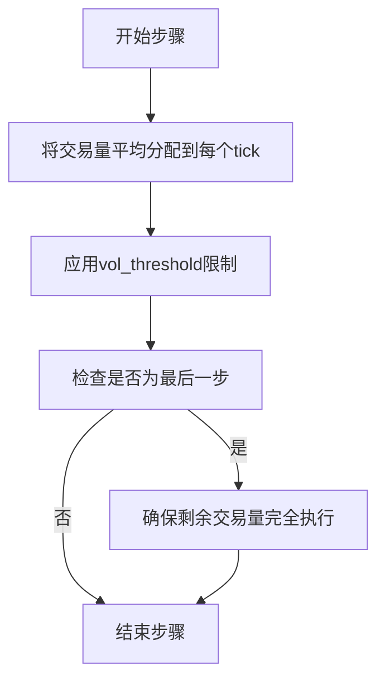
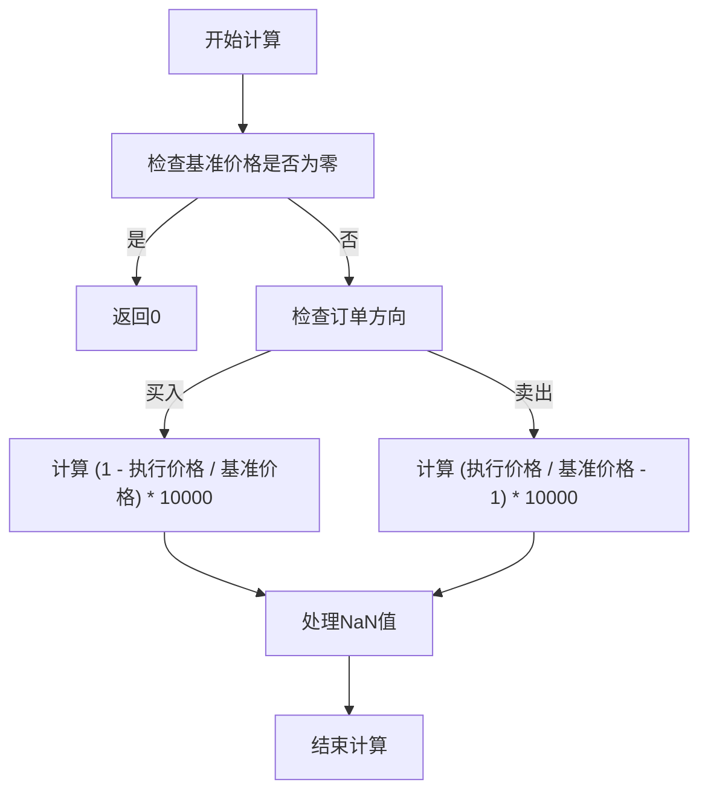

# 训练模拟器

<cite>
**本文档中引用的文件**
- [simulator_simple.py](file://qlib/rl/order_execution/simulator_simple.py)
- [state.py](file://qlib/rl/order_execution/state.py)
- [reward.py](file://qlib/rl/order_execution/reward.py)
- [utils.py](file://qlib/rl/order_execution/utils.py)
- [test_saoe_simple.py](file://tests/rl/test_saoe_simple.py)
</cite>

## 目录
1. [简介](#简介)
2. [核心设计与目标](#核心设计与目标)
3. [基于Tick的交易机制](#基于tick的交易机制)
4. [状态与终止条件](#状态与终止条件)
5. [市场特征注入配置](#市场特征注入配置)
6. [奖励函数计算逻辑](#奖励函数计算逻辑)

## 简介
`SingleAssetOrderExecutionSimple`是Qlib框架中为强化学习训练设计的单资产订单执行训练模拟器。该模拟器旨在提供一个高效、简化的交易环境，通过基于tick的交易机制和灵活的参数配置，支持无限制交易以加速模型收敛。本文档详细解析其核心设计、交易机制、状态管理、终止条件以及关键的奖励函数计算逻辑。

## 核心设计与目标
`SingleAssetOrderExecutionSimple`模拟器的核心设计目标是为强化学习算法提供一个可控且高效的单资产交易环境。其主要特点包括：
- **高效简化**：通过基于tick的交易机制，避免了复杂的日历调度，简化了时间管理。
- **加速收敛**：允许无限制交易，使模型能够快速探索交易策略，加速训练过程。
- **参数化控制**：通过`ticks_per_step`和`vol_threshold`等参数，灵活控制交易的时间粒度和执行量限制。

**Section sources**
- [simulator_simple.py](file://qlib/rl/order_execution/simulator_simple.py#L23-L338)

## 基于tick的交易机制
`SingleAssetOrderExecutionSimple`模拟器采用基于tick的交易机制，其中每个tick代表数据文件中的一条记录，被视为一个独立的交易机会。

### 时间粒度控制
`ticks_per_step`参数用于控制每个步骤的时间粒度。该参数定义了每个步骤包含的tick数量，从而允许用户根据需要调整交易的精细程度。例如，设置`ticks_per_step=30`意味着每个步骤跨越30个tick，这可以用于模拟30分钟级别的交易决策。

### 交易量分配
`_split_exec_vol`方法负责将每个步骤的交易量分配到各个tick上。该方法遵循TWAP（时间加权平均价格）策略，将交易量平均分配到每个tick，然后应用`vol_threshold`限制，确保每个tick的执行量不超过市场成交量的指定比例。在最后一步，该方法会确保剩余的交易量被完全执行。



**Diagram sources**
- [simulator_simple.py](file://qlib/rl/order_execution/simulator_simple.py#L255-L278)

**Section sources**
- [simulator_simple.py](file://qlib/rl/order_execution/simulator_simple.py#L255-L278)

## 状态与终止条件
### 状态信息
`get_state`方法返回一个`SAOEState`对象，该对象包含以下关键信息：
- `order`：当前处理的订单。
- `cur_time`：当前时间。
- `cur_step`：当前步骤。
- `position`：当前剩余的交易量。
- `history_exec`：每个tick的执行历史。
- `history_steps`：每个步骤的交易记录。
- `metrics`：交易完成后的度量指标。
- `backtest_data`：回测数据。
- `ticks_per_step`：每个步骤的tick数量。
- `ticks_index`：全天的tick索引。
- `ticks_for_order`：订单可用的tick索引。

### 终止条件
`done`方法定义了模拟器的终止条件。当满足以下任一条件时，模拟器将终止：
- 剩余交易量小于一个极小值（EPS）。
- 当前时间超过订单的结束时间。

**Section sources**
- [state.py](file://qlib/rl/order_execution/state.py#L40-L101)
- [simulator_simple.py](file://qlib/rl/order_execution/simulator_simple.py#L300-L304)

## 市场特征注入配置
为了增强模型的决策能力，`SingleAssetOrderExecutionSimple`支持通过`feature_columns_today`和`feature_columns_yesterday`参数注入市场特征。这些参数允许用户指定当天和前一天的特征列，从而为模型提供更丰富的市场信息。

例如，在配置文件中可以这样设置：
```python
feature_columns_today = ['RESI5', 'WVMA5', 'RSQR5']
feature_columns_yesterday = ['RESI5_1', 'WVMA5_1', 'RSQR5_1']
```
这些特征将被用于构建模型的输入，帮助模型更好地理解市场动态。

**Section sources**
- [native.py](file://qlib/rl/data/native.py#L202-L232)
- [pickle_styled.py](file://qlib/rl/data/pickle_styled.py#L177-L201)

## 奖励函数计算逻辑
`price_advantage`奖励函数用于衡量交易价格相对于基准价格的优势。其计算逻辑如下：
- 对于买入订单，奖励为 `(1 - 执行价格 / 基准价格) * 10000`。
- 对于卖出订单，奖励为 `(执行价格 / 基准价格 - 1) * 10000`。
- 奖励的单位为基点（BP），即万分之一。

该函数还处理了基准价格为零的异常情况，并使用`np.nan_to_num`将NaN值替换为0，确保计算的稳定性。



**Diagram sources**
- [utils.py](file://qlib/rl/order_execution/utils.py#L24-L44)
- [simulator_simple.py](file://qlib/rl/order_execution/simulator_simple.py#L341-L361)

**Section sources**
- [utils.py](file://qlib/rl/order_execution/utils.py#L24-L44)
- [reward.py](file://qlib/rl/order_execution/reward.py#L10-L30)