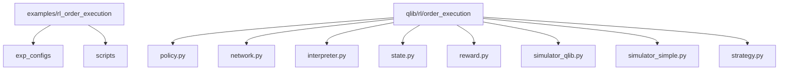
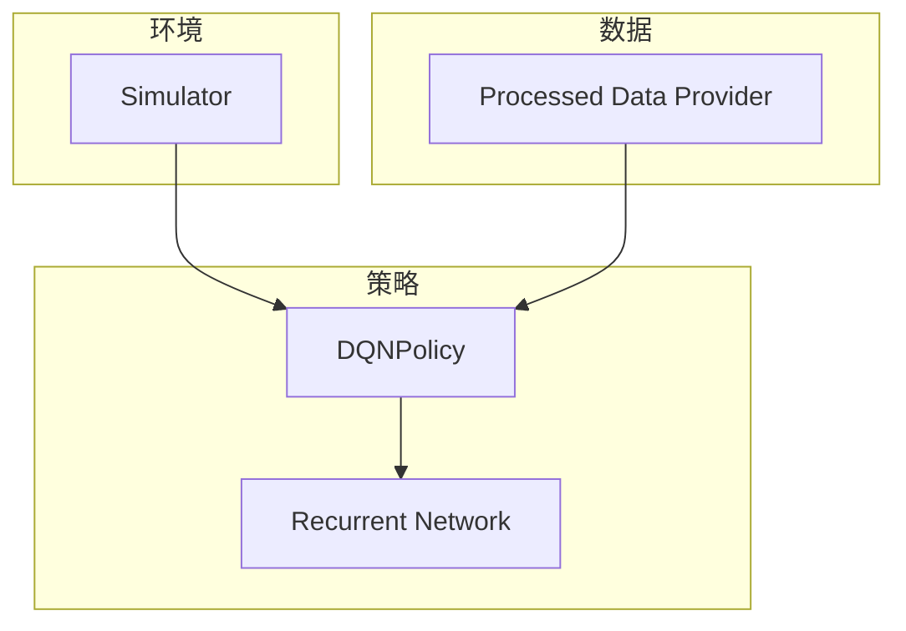
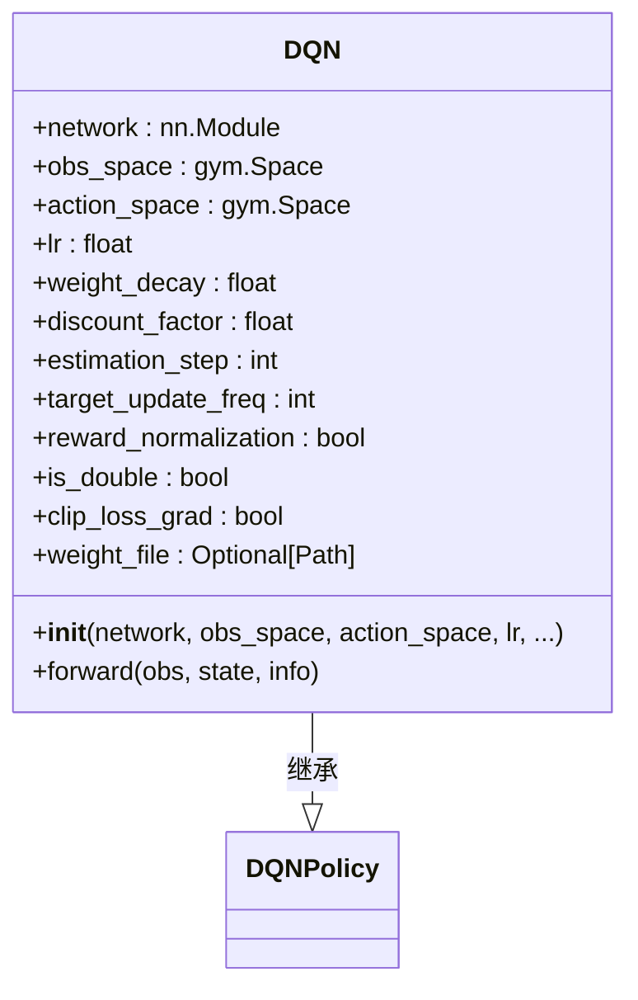
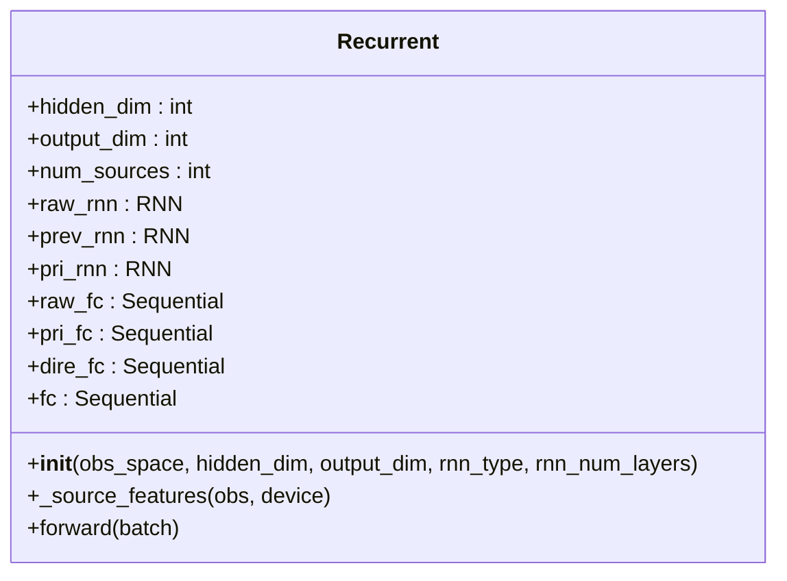
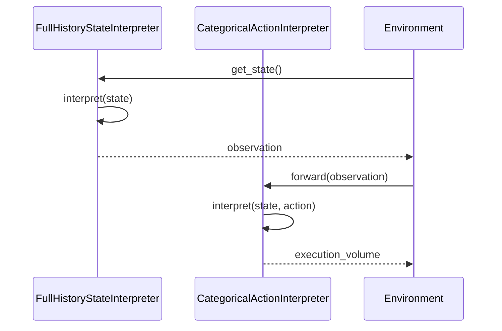
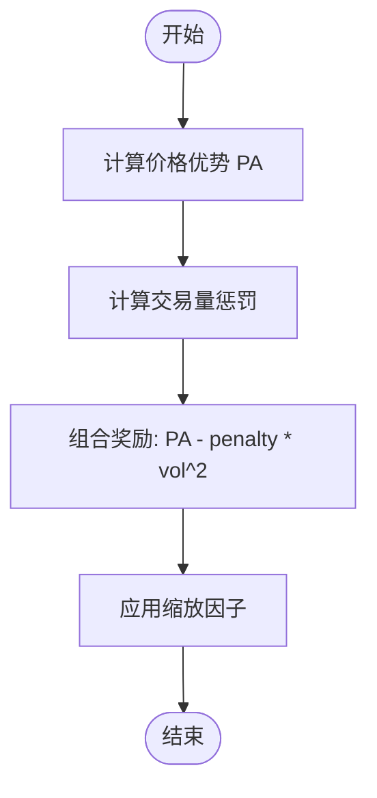
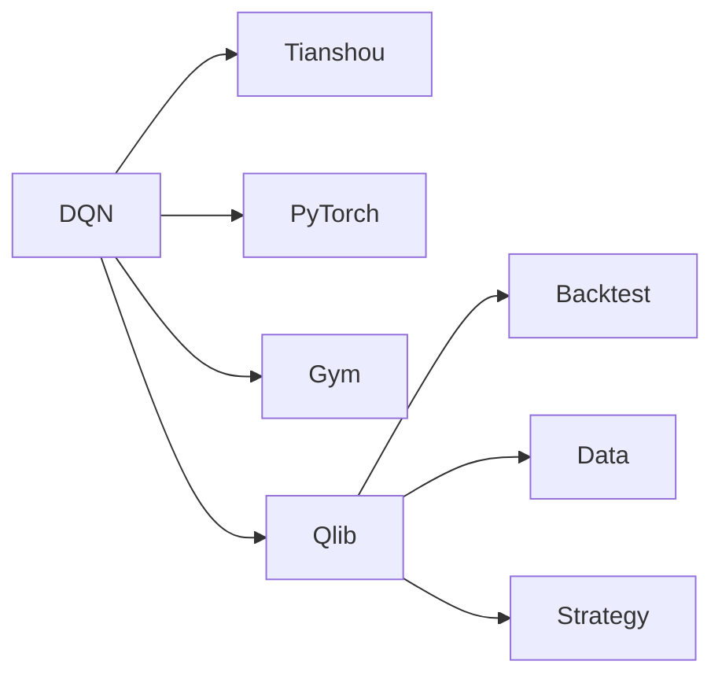

# OPDS策略

<cite>
**本文档中引用的文件**  
- [train_opds.yml](file://examples/rl_order_execution/exp_configs/train_opds.yml)
- [backtest_opds.yml](file://examples/rl_order_execution/exp_configs/backtest_opds.yml)
- [policy.py](file://qlib/rl/order_execution/policy.py)
- [network.py](file://qlib/rl/order_execution/network.py)
- [interpreter.py](file://qlib/rl/order_execution/interpreter.py)
- [state.py](file://qlib/rl/order_execution/state.py)
- [reward.py](file://qlib/rl/order_execution/reward.py)
- [simulator_qlib.py](file://qlib/rl/order_execution/simulator_qlib.py)
- [simulator_simple.py](file://qlib/rl/order_execution/simulator_simple.py)
- [strategy.py](file://qlib/rl/order_execution/strategy.py)
</cite>

## 目录
1. [简介](#简介)
2. [项目结构](#项目结构)
3. [核心组件](#核心组件)
4. [架构概述](#架构概述)
5. [详细组件分析](#详细组件分析)
6. [依赖分析](#依赖分析)
7. [性能考虑](#性能考虑)
8. [故障排除指南](#故障排除指南)
9. [结论](#结论)

## 简介
OPDS（订单执行策略）是一种基于深度Q网络（DQN）的强化学习方法，用于优化金融市场的订单执行过程。该策略通过与环境交互学习最优交易动作，以最小化市场冲击和交易成本。本文件详细解释了OPDS的工作原理，包括其网络结构、经验回放机制、目标网络更新频率等关键配置项，并结合`train_opds.yml`和`backtest_opds.yml`配置文件进行分析。此外，还提供了从环境初始化到策略评估的完整代码示例，并对比了OPDS与PPO在执行效率和风险控制方面的差异。

## 项目结构
OPDS策略位于`examples/rl_order_execution`目录下，主要包含实验配置、脚本和相关模块。配置文件存储在`exp_configs`子目录中，而核心实现则分布在`qlib/rl/order_execution`包内。此结构支持灵活的训练和回测流程，允许用户轻松调整参数并评估不同策略的表现。

**图示来源**
- [train_opds.yml](file://examples/rl_order_execution/exp_configs/train_opds.yml#L1-L67)
- [backtest_opds.yml](file://examples/rl_order_execution/exp_configs/backtest_opds.yml#L1-L54)

**本节来源**
- [train_opds.yml](file://examples/rl_order_execution/exp_configs/train_opds.yml#L1-L67)
- [backtest_opds.yml](file://examples/rl_order_execution/exp_configs/backtest_opds.yml#L1-L54)

## 核心组件
OPDS策略的核心组件包括策略类`DQN`、网络结构`Recurrent`、状态和动作解释器、奖励函数以及模拟器。这些组件共同构成了一个完整的强化学习框架，用于训练和评估订单执行策略。

**本节来源**
- [policy.py](file://qlib/rl/order_execution/policy.py#L1-L238)
- [network.py](file://qlib/rl/order_execution/network.py#L1-L141)
- [interpreter.py](file://qlib/rl/order_execution/interpreter.py#L1-L258)
- [reward.py](file://qlib/rl/order_execution/reward.py#L1-L100)

## 架构概述
OPDS策略采用基于DQN的强化学习架构，利用Tianshou库中的`DQNPolicy`构建。该架构包括一个递归神经网络（RNN）作为特征提取器，支持从检查点文件加载预训练权重。策略通过与模拟环境交互来学习最优交易动作，同时使用经验回放和目标网络更新机制提高学习稳定性。

**图示来源**
- [policy.py](file://qlib/rl/order_execution/policy.py#L1-L238)
- [network.py](file://qlib/rl/order_execution/network.py#L1-L141)
- [interpreter.py](file://qlib/rl/order_execution/interpreter.py#L1-L258)

## 详细组件分析

### DQN策略分析
`DQN`类继承自Tianshou的`DQNPolicy`，自动创建模型网络并支持加载检查点文件中的预训练权重。它仅支持离散动作空间，适用于分类动作场景。策略通过优化器（如Adam）更新网络参数，并使用双DQN技术减少过估计问题。

#### 类图

**图示来源**
- [policy.py](file://qlib/rl/order_execution/policy.py#L1-L238)

**本节来源**
- [policy.py](file://qlib/rl/order_execution/policy.py#L1-L238)

### 网络结构分析
`Recurrent`网络是OPDS策略的核心，它将输入分为公共变量和私有变量两部分，分别由`raw_rnn`和`pri_rnn`处理。这种设计允许网络捕捉市场动态和个人交易历史的双重信息。此外，`dire_fc`层用于生成方向相关的特征，增强了模型的表达能力。

#### 类图

**图示来源**
- [network.py](file://qlib/rl/order_execution/network.py#L1-L141)

**本节来源**
- [network.py](file://qlib/rl/order_execution/network.py#L1-L141)

### 状态与动作解释器分析
状态解释器`FullHistoryStateInterpreter`负责将环境状态转换为模型可接受的输入格式，包含全天历史数据和昨日数据。动作解释器`CategoricalActionInterpreter`将离散动作映射为连续交易量，确保动作符合实际交易需求。

#### 序列图

**图示来源**
- [interpreter.py](file://qlib/rl/order_execution/interpreter.py#L1-L258)

**本节来源**
- [interpreter.py](file://qlib/rl/order_execution/interpreter.py#L1-L258)

### 奖励函数分析
`PAPenaltyReward`奖励函数鼓励更高的价格优势（PA），但对短时间内大量交易施加惩罚。具体而言，每步奖励计算为$PA_t * vol_t / target - vol_t^2 * penalty$，其中`penalty`参数控制惩罚强度，`scale`参数用于调整奖励尺度。

#### 流程图

**图示来源**
- [reward.py](file://qlib/rl/order_execution/reward.py#L1-L100)

**本节来源**
- [reward.py](file://qlib/rl/order_execution/reward.py#L1-L100)

## 依赖分析
OPDS策略依赖于多个外部库和内部模块，包括Tianshou、PyTorch、Gym和Qlib自身提供的各种工具。这些依赖关系确保了策略能够高效地进行训练和评估。

**图示来源**
- [policy.py](file://qlib/rl/order_execution/policy.py#L1-L238)
- [network.py](file://qlib/rl/order_execution/network.py#L1-L141)
- [interpreter.py](file://qlib/rl/order_execution/interpreter.py#L1-L258)

**本节来源**
- [policy.py](file://qlib/rl/order_execution/policy.py#L1-L238)
- [network.py](file://qlib/rl/order_execution/network.py#L1-L141)
- [interpreter.py](file://qlib/rl/order_execution/interpreter.py#L1-L258)

## 性能考虑
OPDS策略在设计时充分考虑了性能因素，例如通过经验回放机制提高样本利用率，使用目标网络减少学习过程中的波动性。此外，配置文件中的`batch_size`、`repeat_per_collect`等参数也经过精心调优，以平衡训练速度和收敛质量。

## 故障排除指南
在使用OPDS策略时，可能会遇到一些常见问题，如训练不稳定、奖励值异常等。这些问题通常可以通过调整超参数或检查数据质量来解决。例如，如果发现奖励值频繁出现NaN，应检查输入数据是否存在缺失值或异常值。

**本节来源**
- [reward.py](file://qlib/rl/order_execution/reward.py#L1-L100)
- [simulator_simple.py](file://qlib/rl/order_execution/simulator_simple.py#L1-L363)

## 结论
OPDS策略作为一种基于DQN的强化学习方法，在订单执行任务中表现出色。通过合理配置网络结构、经验回放机制和目标网络更新频率，可以有效提升交易效率和风险控制能力。与PPO相比，OPDS在处理离散动作空间方面更具优势，但在连续动作场景下可能需要额外的设计。未来工作可探索更复杂的网络架构和奖励函数，进一步提升策略性能。