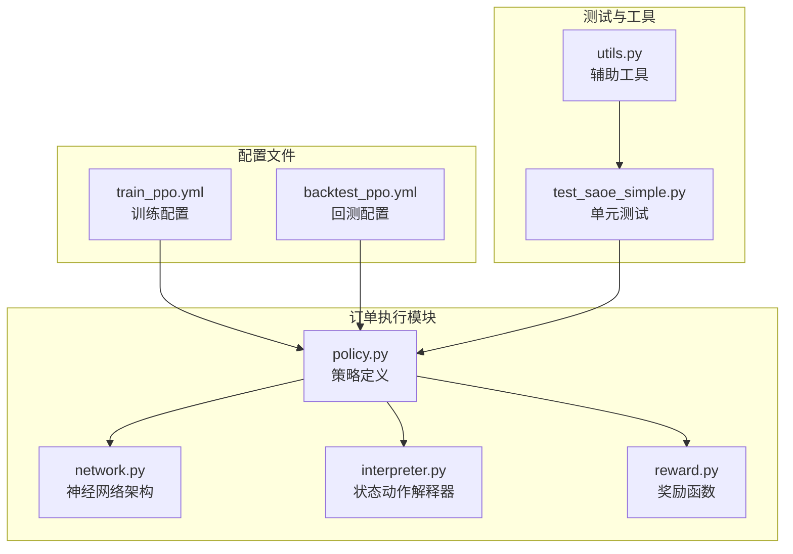
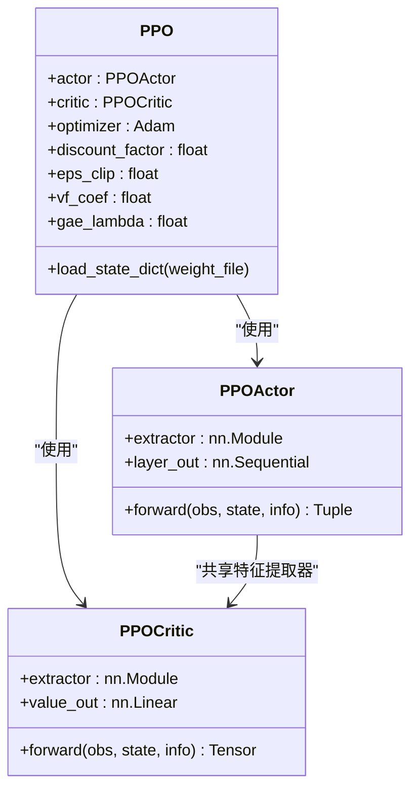
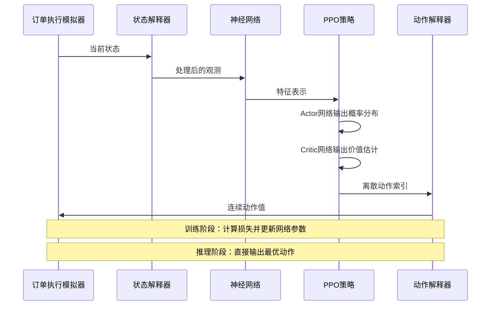
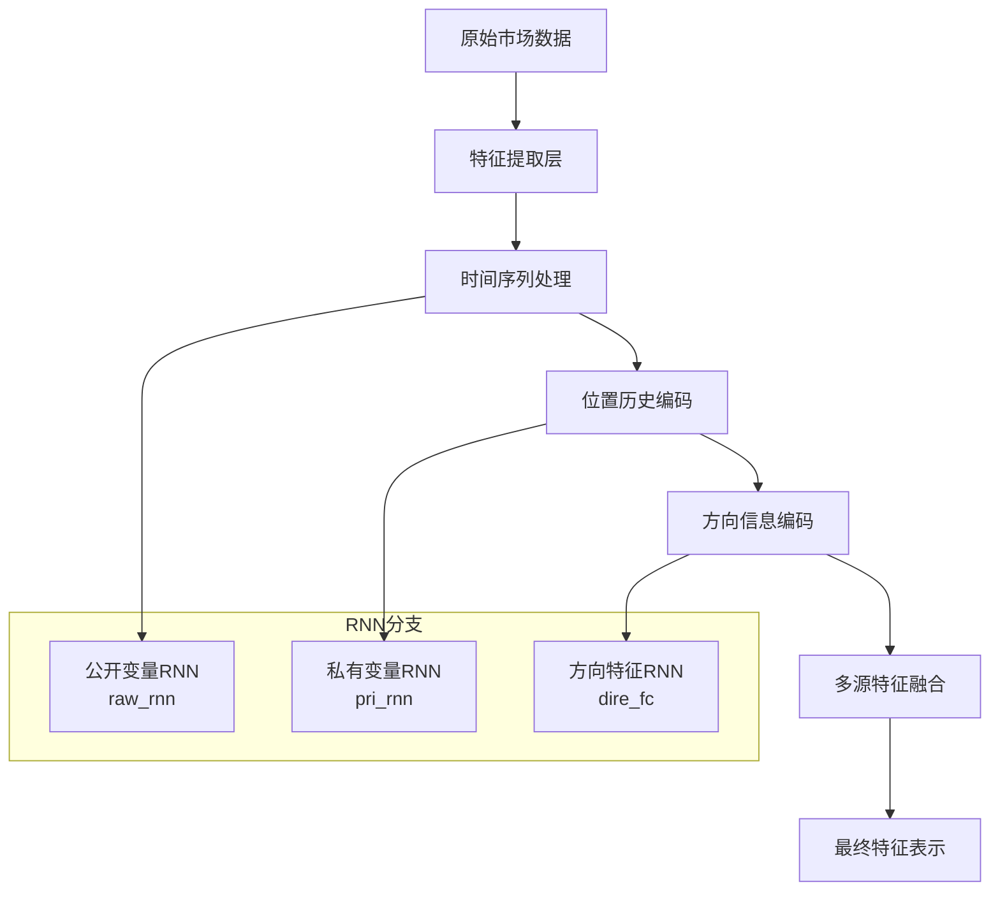
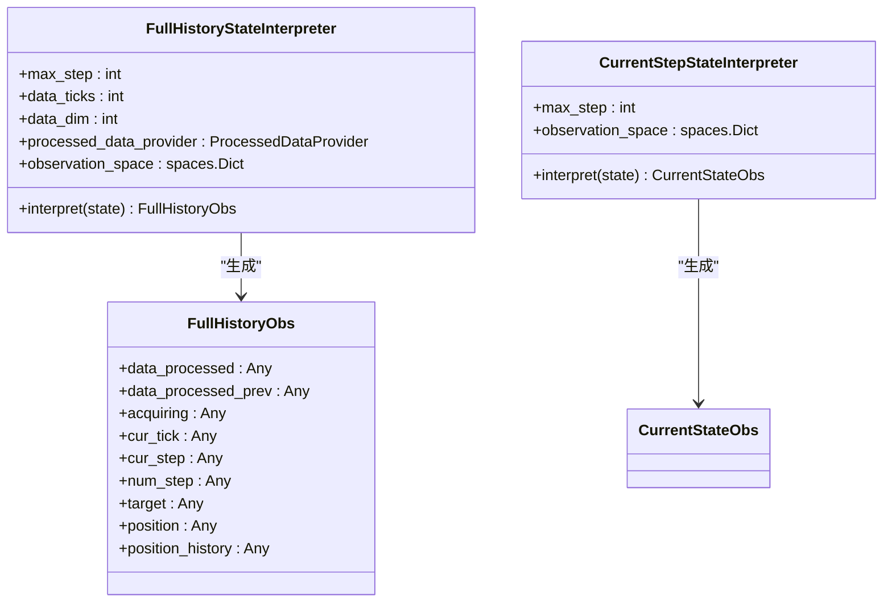
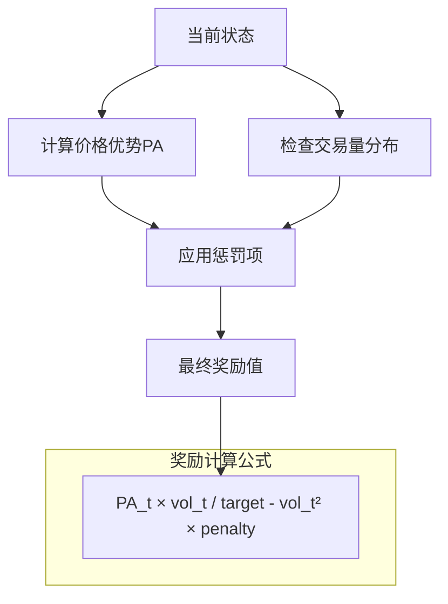
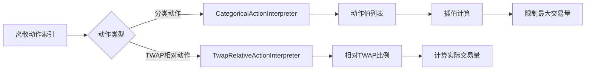
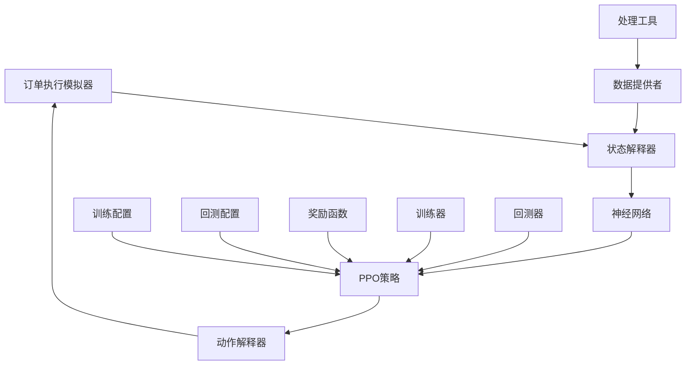
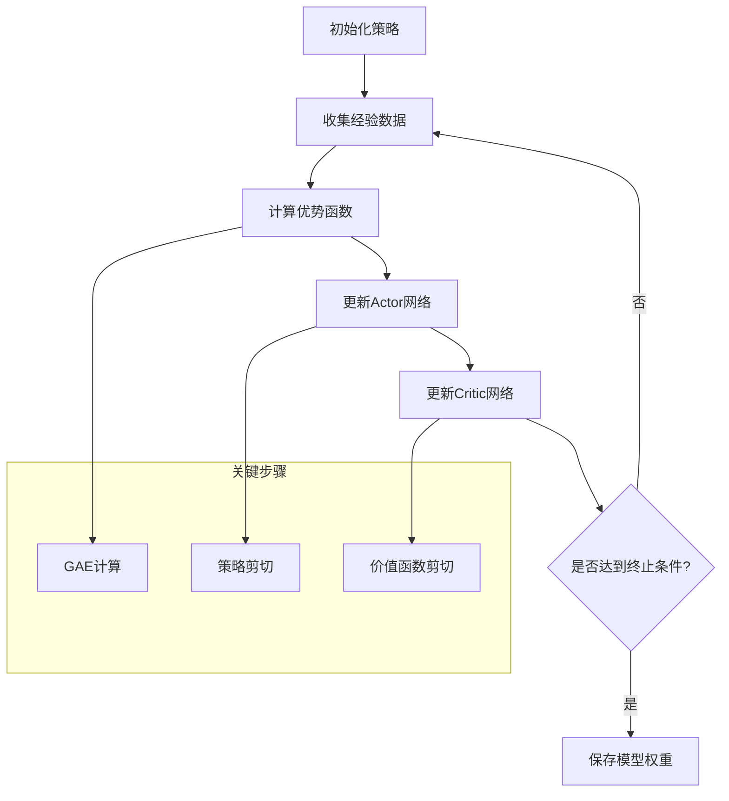

# PPO策略

<cite>
**本文档引用的文件**
- [policy.py](file://qlib/rl/order_execution/policy.py)
- [network.py](file://qlib/rl/order_execution/network.py)
- [interpreter.py](file://qlib/rl/order_execution/interpreter.py)
- [reward.py](file://qlib/rl/order_execution/reward.py)
- [train_ppo.yml](file://examples/rl_order_execution/exp_configs/train_ppo.yml)
- [backtest_ppo.yml](file://examples/rl_order_execution/exp_configs/backtest_ppo.yml)
- [test_saoe_simple.py](file://tests/rl/test_saoe_simple.py)
- [utils.py](file://qlib/rl/contrib/utils.py)
</cite>

## 目录
1. [简介](#简介)
2. [项目结构](#项目结构)
3. [核心组件](#核心组件)
4. [架构概览](#架构概览)
5. [详细组件分析](#详细组件分析)
6. [依赖关系分析](#依赖关系分析)
7. [性能考虑](#性能考虑)
8. [故障排除指南](#故障排除指南)
9. [结论](#结论)

## 简介

PPO（近端策略优化）策略是QLib框架中用于订单执行场景的强化学习算法实现。该策略基于Actor-Critic架构，通过最大化期望回报来优化交易决策，特别适用于高频交易环境中的订单拆分和执行策略。

PPO算法的核心思想是在策略更新过程中引入剪切机制，确保新旧策略之间的差异不会过大，从而保证训练过程的稳定性。在订单执行场景中，PPO策略能够智能地决定何时、何量进行交易，以最小化市场冲击成本并最大化价格优势。

## 项目结构

QLib的PPO策略实现主要分布在以下模块中：



**图表来源**
- [policy.py](file://qlib/rl/order_execution/policy.py#L1-L238)
- [network.py](file://qlib/rl/order_execution/network.py#L1-L141)
- [interpreter.py](file://qlib/rl/order_execution/interpreter.py#L1-L258)

**章节来源**
- [policy.py](file://qlib/rl/order_execution/policy.py#L1-L238)
- [network.py](file://qlib/rl/order_execution/network.py#L1-L141)

## 核心组件

### PPO策略类

PPO类是整个订单执行系统的核心，它封装了Tianshou的PPOPolicy并进行了扩展：

```python
class PPO(PPOPolicy):
    """Tianshou PPOPolicy的包装器
    
    主要特性：
    - 自动创建Actor和Critic网络
    - 支持离散动作空间
    - 共享网络参数以减少计算开销
    - 支持权重文件加载
    - 默认参数与原始版本不同
    """
```

### Actor-Critic架构

PPO策略采用经典的Actor-Critic架构：



**图表来源**
- [policy.py](file://qlib/rl/order_execution/policy.py#L50-L85)
- [policy.py](file://qlib/rl/order_execution/policy.py#L87-L105)

**章节来源**
- [policy.py](file://qlib/rl/order_execution/policy.py#L87-L150)

## 架构概览

PPO策略的整体架构展示了从状态到动作的完整映射过程：



**图表来源**
- [policy.py](file://qlib/rl/order_execution/policy.py#L115-L150)
- [interpreter.py](file://qlib/rl/order_execution/interpreter.py#L70-L120)

## 详细组件分析

### 网络架构设计

PPO策略使用递归神经网络（RNN）作为基础网络架构，能够处理时间序列数据：



**图表来源**
- [network.py](file://qlib/rl/order_execution/network.py#L25-L85)

#### 关键网络组件

1. **特征提取器**：将原始市场数据转换为高维特征向量
2. **RNN模块**：处理时间序列特征，捕捉市场动态
3. **注意力机制**：增强重要特征的权重
4. **多源融合**：整合来自不同数据源的信息

### 状态解释器

状态解释器负责将模拟器状态转换为神经网络可接受的输入格式：



**图表来源**
- [interpreter.py](file://qlib/rl/order_execution/interpreter.py#L70-L120)
- [interpreter.py](file://qlib/rl/order_execution/interpreter.py#L150-L180)

### 奖励函数设计

PPO策略使用专门设计的奖励函数来指导学习过程：



**图表来源**
- [reward.py](file://qlib/rl/order_execution/reward.py#L15-L45)

**章节来源**
- [network.py](file://qlib/rl/order_execution/network.py#L25-L141)
- [interpreter.py](file://qlib/rl/order_execution/interpreter.py#L70-L180)
- [reward.py](file://qlib/rl/order_execution/reward.py#L15-L45)

### 动作解释器

动作解释器将离散的动作索引转换为实际的交易数量：



**图表来源**
- [interpreter.py](file://qlib/rl/order_execution/interpreter.py#L200-L258)

**章节来源**
- [interpreter.py](file://qlib/rl/order_execution/interpreter.py#L200-L258)

## 依赖关系分析

PPO策略的各个组件之间存在复杂的依赖关系：



**图表来源**
- [train_ppo.yml](file://examples/rl_order_execution/exp_configs/train_ppo.yml#L1-L68)
- [backtest_ppo.yml](file://examples/rl_order_execution/exp_configs/backtest_ppo.yml#L1-L54)

**章节来源**
- [train_ppo.yml](file://examples/rl_order_execution/exp_configs/train_ppo.yml#L1-L68)
- [backtest_ppo.yml](file://examples/rl_order_execution/exp_configs/backtest_ppo.yml#L1-L54)

## 性能考虑

### 超参数配置

PPO策略的关键超参数对训练效果有重要影响：

1. **学习率（lr）**：默认0.0001，控制参数更新步长
2. **折扣因子（discount_factor）**：默认1.0，平衡即时奖励和未来奖励
3. **剪切范围（eps_clip）**：默认0.3，防止策略更新过大
4. **价值函数系数（vf_coef）**：默认1.0，平衡策略梯度和价值函数梯度
5. **批处理大小（max_batch_size）**：默认256，影响内存使用和训练稳定性

### 训练流程



### 回测评估

PPO策略的回测评估包括多个指标：

- **价格优势（PA）**：衡量相对于TWAP的价格改善程度
- **完成率（FFR）**：订单完成的比例
- **市场冲击成本**：交易对市场价格的影响
- **执行效率**：单位时间内完成的交易量

## 故障排除指南

### 常见问题及解决方案

1. **训练不收敛**
   - 检查学习率设置
   - 验证奖励函数设计
   - 确认网络架构合理性

2. **过拟合问题**
   - 增加探索噪声
   - 使用早停机制
   - 调整正则化参数

3. **推理速度慢**
   - 优化网络结构
   - 使用GPU加速
   - 减少状态维度

### 调试技巧

```python
# 启用详细日志记录
set_log_with_config(C.logging_config)

# 检查中间结果
print(f"Observation shape: {obs.shape}")
print(f"Action probabilities: {probs}")
print(f"Critic value: {value}")

# 可视化训练曲线
import matplotlib.pyplot as plt
plt.plot(train_rewards)
plt.show()
```

**章节来源**
- [test_saoe_simple.py](file://tests/rl/test_saoe_simple.py#L259-L328)

## 结论

QLib的PPO策略实现是一个功能完整、设计精良的强化学习框架，特别适用于高频交易环境中的订单执行任务。通过Actor-Critic架构、精心设计的状态表示和奖励函数，以及灵活的配置选项，该策略能够在不同的市场条件下表现出色。

主要优势包括：
- **稳定性**：通过剪切机制确保训练稳定
- **灵活性**：支持多种网络架构和解释器
- **可扩展性**：模块化设计便于扩展和定制
- **实用性**：经过充分测试，在真实数据上表现良好

未来发展方向可能包括：
- 更复杂的网络架构
- 多资产联合优化
- 实时在线学习能力
- 更丰富的奖励函数设计