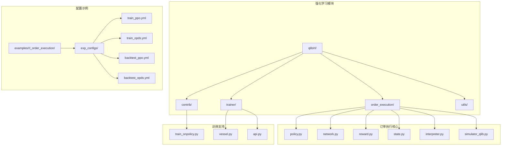
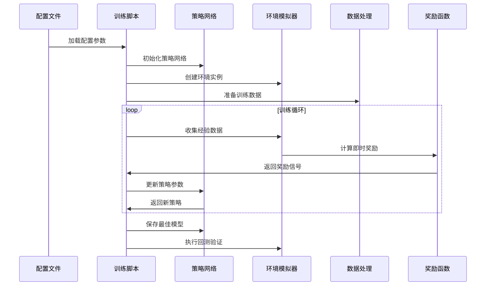
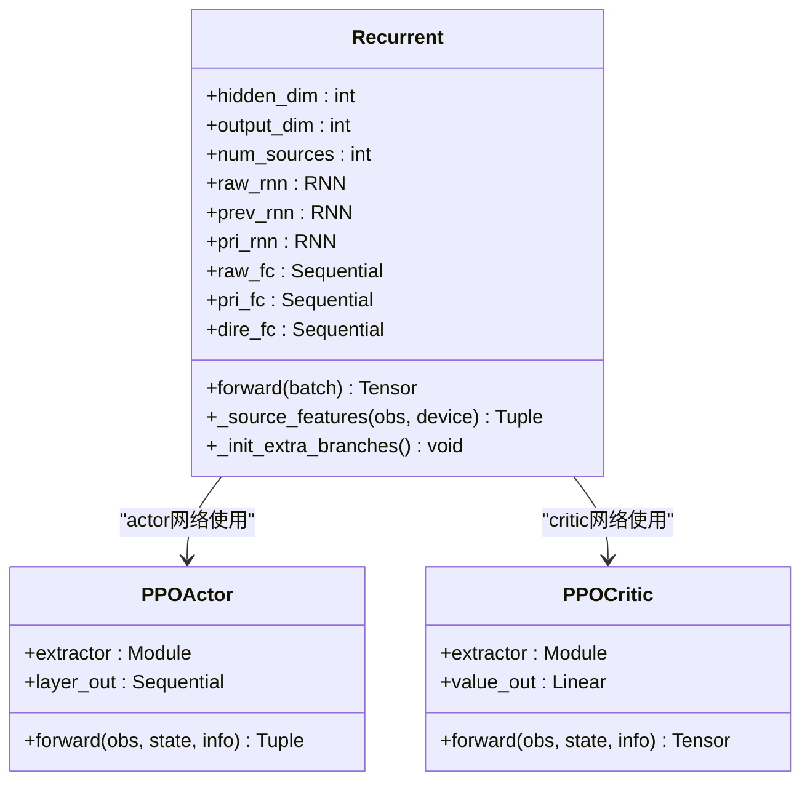
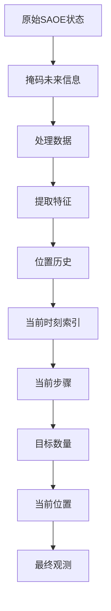
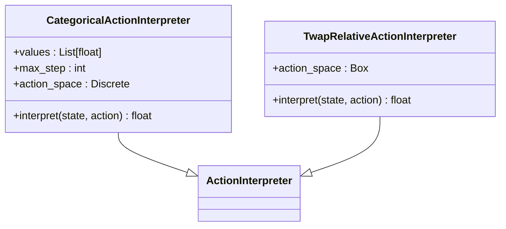
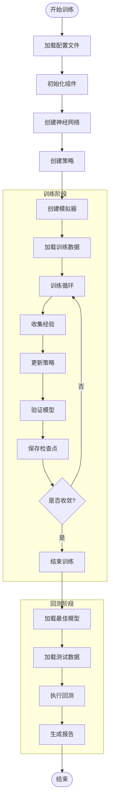

# 策略优化

<cite>
**本文档引用的文件**
- [train_onpolicy.py](file://qlib/rl/contrib/train_onpolicy.py)
- [policy.py](file://qlib/rl/order_execution/policy.py)
- [reward.py](file://qlib/rl/order_execution/reward.py)
- [network.py](file://qlib/rl/order_execution/network.py)
- [state.py](file://qlib/rl/order_execution/state.py)
- [interpreter.py](file://qlib/rl/order_execution/interpreter.py)
- [simulator_qlib.py](file://qlib/rl/order_execution/simulator_qlib.py)
- [train_ppo.yml](file://examples/rl_order_execution/exp_configs/train_ppo.yml)
- [train_opds.yml](file://examples/rl_order_execution/exp_configs/train_opds.yml)
- [backtest_ppo.yml](file://examples/rl_order_execution/exp_configs/backtest_ppo.yml)
- [backtest_opds.yml](file://examples/rl_order_execution/exp_configs/backtest_opds.yml)
</cite>

## 目录
1. [简介](#简介)
2. [项目结构](#项目结构)
3. [核心组件](#核心组件)
4. [架构概览](#架构概览)
5. [详细组件分析](#详细组件分析)
6. [训练流程详解](#训练流程详解)
7. [配置文件解析](#配置文件解析)
8. [性能考虑](#性能考虑)
9. [故障排除指南](#故障排除指南)
10. [结论](#结论)

## 简介

Qlib的强化学习模块提供了先进的订单执行策略优化框架，主要包含PPO（Proximal Policy Optimization）和OPDS（Optimal Price Distribution Strategy）两种策略。该系统专为高频交易场景设计，能够自动优化订单拆分和执行策略，在保证价格优势的同时最小化市场冲击。

本文档详细阐述了这两种策略的实现原理、训练流程、配置方法以及实际应用差异，为开发者提供从零开始训练模型到部署使用的完整指导。

## 项目结构

Qlib强化学习模块采用模块化设计，核心文件分布在以下目录结构中：



**图表来源**
- [train_onpolicy.py](file://qlib/rl/contrib/train_onpolicy.py#L1-L50)
- [policy.py](file://qlib/rl/order_execution/policy.py#L1-L30)
- [network.py](file://qlib/rl/order_execution/network.py#L1-L30)

## 核心组件

### PPO策略实现

PPO（Proximal Policy Optimization）是一种先进的策略梯度方法，通过限制策略更新的幅度来确保训练稳定性。在Qlib中，PPO策略具有以下特点：

- **双网络架构**：包含Actor网络（策略网络）和Critic网络（价值网络）
- **离策略学习**：支持批量数据收集和经验回放
- **参数共享**：Actor和Critic共享特征提取网络以提高效率
- **自适应学习率**：支持动态调整学习率和权重衰减

### OPDS策略实现

OPDS（Optimal Price Distribution Strategy）是专门为订单执行场景设计的策略，其核心特性包括：

- **历史信息利用**：充分利用历史市场数据和订单执行信息
- **方向感知**：根据买卖方向调整执行策略
- **位置跟踪**：实时跟踪剩余订单量和执行进度
- **惩罚机制**：通过奖励函数抑制集中执行行为

**章节来源**
- [policy.py](file://qlib/rl/order_execution/policy.py#L113-L157)
- [reward.py](file://qlib/rl/order_execution/reward.py#L15-L50)

## 架构概览

Qlib强化学习系统采用分层架构设计，各组件职责明确，相互协作完成订单执行优化任务：



**图表来源**
- [train_onpolicy.py](file://qlib/rl/contrib/train_onpolicy.py#L158-L188)
- [policy.py](file://qlib/rl/order_execution/policy.py#L113-L157)

## 详细组件分析

### 策略网络架构

#### Recurrent网络实现

Qlib采用递归神经网络作为基础网络架构，支持多种RNN类型：



**图表来源**
- [network.py](file://qlib/rl/order_execution/network.py#L18-L60)
- [policy.py](file://qlib/rl/order_execution/policy.py#L50-L85)

#### 网络输入处理

网络接收多源输入数据，包括：

1. **公开变量**：市场历史数据（开盘价、收盘价、最高价、最低价、成交量）
2. **私有变量**：订单执行历史和位置信息
3. **方向特征**：买卖方向编码
4. **时间特征**：当前步骤和总步数比例

### 状态解释器

状态解释器负责将原始状态转换为网络可接受的格式：



**图表来源**
- [interpreter.py](file://qlib/rl/order_execution/interpreter.py#L80-L120)
- [state.py](file://qlib/rl/order_execution/state.py#L70-L101)

### 动作解释器

动作解释器将离散动作映射为连续执行量：



**图表来源**
- [interpreter.py](file://qlib/rl/order_execution/interpreter.py#L180-L220)

### 奖励函数设计

#### PPO奖励函数

PPO奖励函数基于VWAP与TWAP的比较：

```python
# PPO奖励逻辑
if current_step == max_step - 1 or remaining_position < 1e-6:
    vwap_price = weighted_average_price
    twap_price = average_market_price
    
    if order_direction == SELL:
        ratio = vwap_price / twap_price
    else:
        ratio = twap_price / vwap_price
        
    if ratio < 1.0:
        return -1.0
    elif ratio < 1.1:
        return 0.0
    else:
        return 1.0
```

#### OPDS奖励函数

OPDS奖励函数鼓励高价格优势同时惩罚集中执行：

```python
# OPDS奖励逻辑
pa = last_step_pa * last_step_amount / total_order_amount
penalty = -penalty_coefficient * sum((last_step_volume / total_order_amount) ** 2)
reward = pa + penalty
```

**章节来源**
- [reward.py](file://qlib/rl/order_execution/reward.py#L15-L50)
- [reward.py](file://qlib/rl/order_execution/reward.py#L55-L99)

## 训练流程详解

### 训练脚本架构

`train_onpolicy.py`是强化学习训练的核心入口，提供了完整的训练和回测流程：



**图表来源**
- [train_onpolicy.py](file://qlib/rl/contrib/train_onpolicy.py#L158-L200)

### 关键训练参数

#### 学习率调度

```yaml
policy:
  class: PPO
  kwargs:
    lr: 0.0001  # 初始学习率
    weight_decay: 0.0  # 权重衰减
```

#### 折扣因子设置

```yaml
trainer:
  max_epoch: 500  # 最大训练轮数
  discount_factor: 0.99  # 折扣因子
  gae_lambda: 1.0  # GAE lambda参数
```

#### 批量训练参数

```yaml
trainer:
  episode_per_collect: 10000  # 每次收集的回合数
  batch_size: 1024  # 批量大小
  repeat_per_collect: 25  # 每次收集重复次数
```

### 检查点管理

训练过程中会定期保存模型检查点：

```python
# 检查点回调函数
callbacks.append(
    Checkpoint(
        dirpath=Path(checkpoint_path) / "checkpoints",
        every_n_iters=1,  # 每迭代一次保存
        save_latest="copy",  # 保存最新版本
    )
)
```

**章节来源**
- [train_onpolicy.py](file://qlib/rl/contrib/train_onpolicy.py#L158-L188)
- [train_ppo.yml](file://examples/rl_order_execution/exp_configs/train_ppo.yml#L50-L67)

## 配置文件解析

### PPO配置示例

PPO策略的配置文件展示了完整的训练设置：

```yaml
simulator:
  data_granularity: 5  # 数据粒度（分钟）
  time_per_step: 30     # 每步时间间隔
  vol_limit: null       # 交易量限制

env:
  concurrency: 32       # 并发环境数
  parallel_mode: dummy  # 并行模式

policy:
  class: PPO
  kwargs:
    lr: 0.0001         # 学习率
    discount_factor: 0.99  # 折扣因子
    eps_clip: 0.3      # PPO剪切参数
    vf_coef: 1.0       # 价值函数系数
```

### OPDS配置示例

OPDS策略使用不同的奖励函数和配置参数：

```yaml
reward:
  class: PAPenaltyReward
  kwargs:
    penalty: 4.0       # 惩罚系数
    scale: 0.01        # 奖励缩放

trainer:
  max_epoch: 500
  earlystop_patience: 50  # 早停耐心值
  val_every_n_epoch: 4    # 验证频率
```

### 网络架构配置

```yaml
network:
  class: Recurrent
  kwargs:
    hidden_dim: 64     # 隐藏层维度
    output_dim: 32     # 输出维度
    rnn_type: gru      # RNN类型
    rnn_num_layers: 1  # RNN层数
```

### 迁移学习支持

系统支持通过`weight_file`参数加载预训练权重：

```python
# 加载预训练权重
if weight_file is not None:
    set_weight(self, Trainer.get_policy_state_dict(weight_file))
```

**章节来源**
- [train_ppo.yml](file://examples/rl_order_execution/exp_configs/train_ppo.yml#L1-L67)
- [train_opds.yml](file://examples/rl_order_execution/exp_configs/train_opds.yml#L1-L66)
- [policy.py](file://qlib/rl/order_execution/policy.py#L140-L157)

## 性能考虑

### 训练效率优化

1. **并行环境**：支持32个并发环境同时收集经验
2. **批量更新**：每次更新使用1024个样本批次
3. **内存管理**：使用经验回放缓冲区减少内存占用
4. **GPU加速**：支持CUDA设备加速训练过程

### 回测性能

回测阶段采用高效的数据处理和并行计算：

```python
# 回测配置
backtest(
    simulator_fn=simulator_factory,
    state_interpreter=state_interpreter,
    action_interpreter=action_interpreter,
    initial_states=test_dataset,
    policy=policy,
    logger=CsvWriter(output_path),
    finite_env_type="dummy",
    concurrency=32,
)
```

### 内存优化策略

- **延迟加载**：订单数据按需加载，避免内存溢出
- **数据缓存**：缓存常用数据减少重复计算
- **梯度裁剪**：防止梯度爆炸导致的内存问题

## 故障排除指南

### 常见训练问题

#### 梯度爆炸

**症状**：损失函数值急剧增大，模型无法收敛
**解决方案**：
```yaml
policy:
  kwargs:
    max_grad_norm: 100.0  # 设置梯度范数上限
```

#### 收敛缓慢

**症状**：训练过程进展缓慢，性能提升不明显
**解决方案**：
```yaml
trainer:
  repeat_per_collect: 50  # 增加重复次数
  batch_size: 2048        # 增大批量大小
```

#### 内存不足

**症状**：训练过程中出现OOM错误
**解决方案**：
```yaml
trainer:
  batch_size: 512         # 减小批量大小
env:
  concurrency: 16         # 减少并发环境数
```

### 回测验证

回测阶段可能出现的问题及解决方案：

1. **数据缺失**：确保所有股票和日期都有对应的历史数据
2. **时间范围不匹配**：检查订单时间和数据时间范围的一致性
3. **市场冲击过大**：调整订单拆分策略和执行速度

**章节来源**
- [train_onpolicy.py](file://qlib/rl/contrib/train_onpolicy.py#L180-L200)

## 结论

Qlib的强化学习策略优化系统提供了完整的订单执行策略训练和评估框架。通过PPO和OPDS两种策略的对比，开发者可以根据具体需求选择合适的算法：

- **PPO策略**：适合需要精确控制执行节奏和价格优势的场景
- **OPDS策略**：适合注重历史数据利用和惩罚机制的执行策略

系统的模块化设计使得扩展和定制变得简单，而丰富的配置选项则为不同应用场景提供了灵活的适配能力。通过合理的参数调优和训练策略，可以在实际交易环境中获得显著的性能提升。

建议开发者从简单的配置开始，逐步调整参数，同时密切关注训练过程中的指标变化，以获得最佳的训练效果。