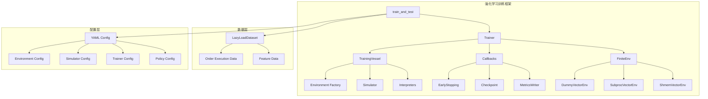
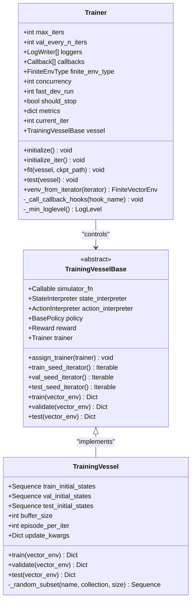
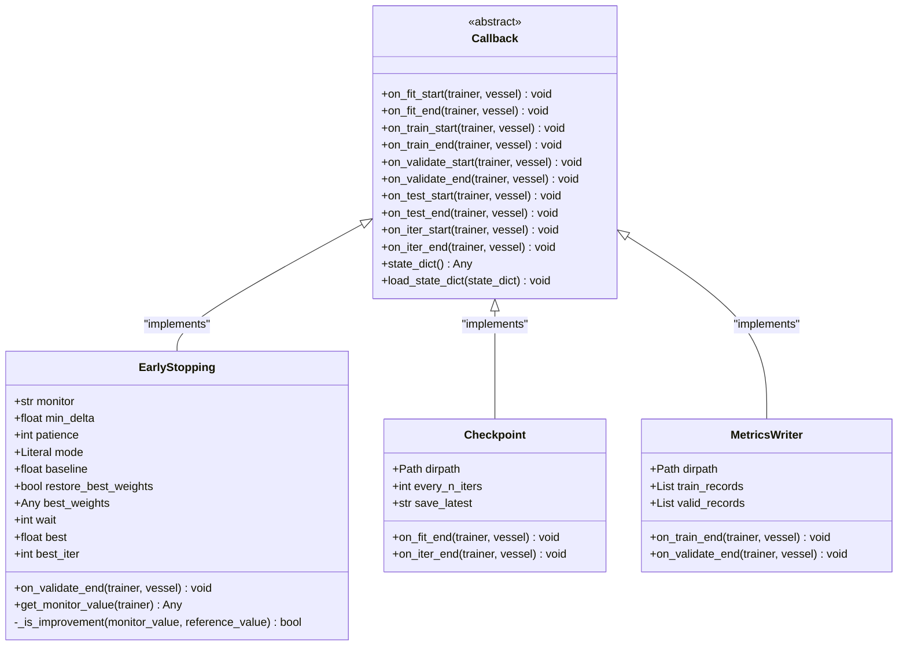
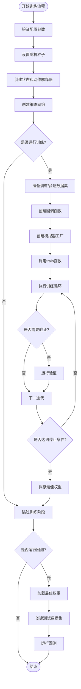
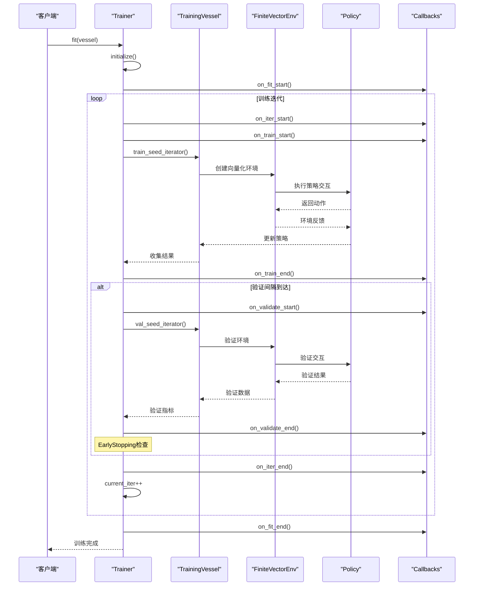
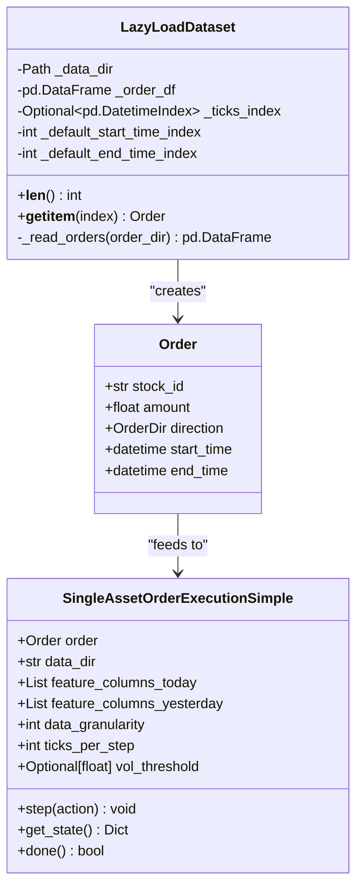
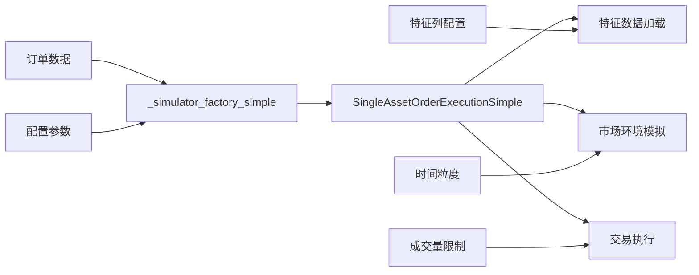
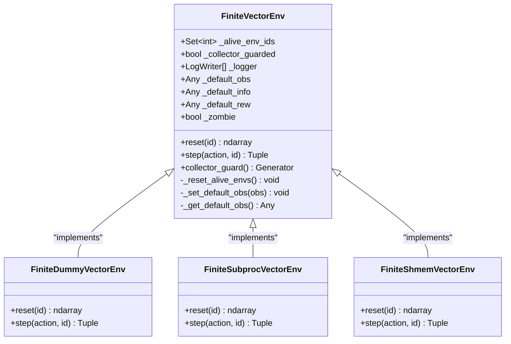
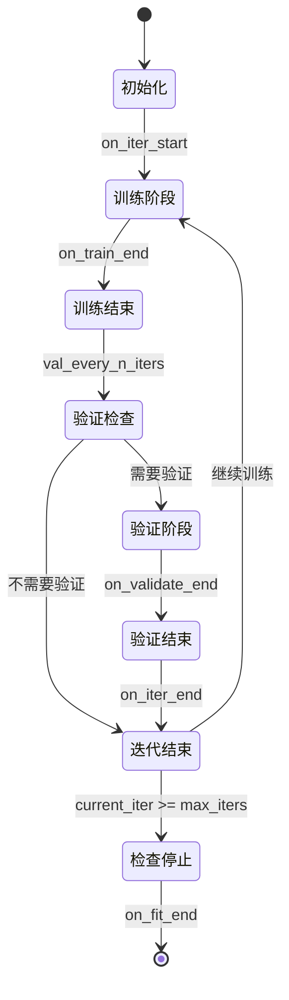
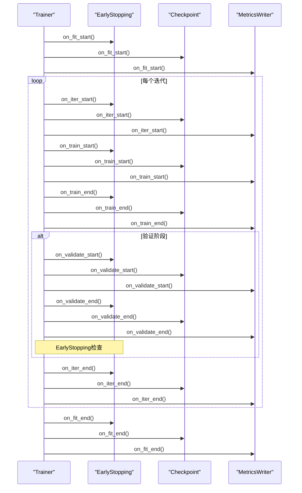

# 强化学习训练工作流

<cite>
**本文档中引用的文件**
- [trainer.py](file://qlib/rl/trainer/trainer.py)
- [callbacks.py](file://qlib/rl/trainer/callbacks.py)
- [vessel.py](file://qlib/rl/trainer/vessel.py)
- [finite_env.py](file://qlib/rl/utils/finite_env.py)
- [train_onpolicy.py](file://qlib/rl/contrib/train_onpolicy.py)
- [test_trainer.py](file://tests/rl/test_trainer.py)
- [train_ppo.yml](file://examples/rl_order_execution/exp_configs/train_ppo.yml)
</cite>

## 目录
1. [简介](#简介)
2. [项目结构概览](#项目结构概览)
3. [核心组件分析](#核心组件分析)
4. [训练工作流详解](#训练工作流详解)
5. [数据集懒加载机制](#数据集懒加载机制)
6. [模拟器工厂与环境创建](#模拟器工厂与环境创建)
7. [训练循环控制逻辑](#训练循环控制逻辑)
8. [回调系统与监控](#回调系统与监控)
9. [分布式训练性能优化](#分布式训练性能优化)
10. [最佳实践指南](#最佳实践指南)
11. [故障排除](#故障排除)
12. [总结](#总结)

## 简介

QLib的强化学习训练工作流是一个高度模块化的框架，专门设计用于处理复杂的交易策略训练任务。该框架通过`train_and_test`函数协调训练与回测流程，提供了完整的端到端解决方案，支持从数据准备到模型部署的全流程自动化。

核心特性包括：
- 基于收集器的训练模式（Collect-based Training）
- 多种并行环境类型支持
- 完整的回调系统
- 分布式训练能力
- 智能早停机制
- 实时日志记录

## 项目结构概览



**图表来源**
- [train_onpolicy.py](file://qlib/rl/contrib/train_onpolicy.py#L1-L270)
- [trainer.py](file://qlib/rl/trainer/trainer.py#L1-L356)

## 核心组件分析

### Trainer类：训练引擎核心

`Trainer`类是整个训练工作流的核心控制器，负责协调所有训练组件的生命周期管理。



**图表来源**
- [trainer.py](file://qlib/rl/trainer/trainer.py#L35-L150)
- [vessel.py](file://qlib/rl/trainer/vessel.py#L35-L120)

**章节来源**
- [trainer.py](file://qlib/rl/trainer/trainer.py#L35-L356)
- [vessel.py](file://qlib/rl/trainer/vessel.py#L35-L219)

### 回调系统：扩展性核心

回调系统提供了灵活的扩展点，允许开发者在训练过程的关键时刻插入自定义逻辑。



**图表来源**
- [callbacks.py](file://qlib/rl/trainer/callbacks.py#L25-L100)
- [callbacks.py](file://qlib/rl/trainer/callbacks.py#L100-L200)

**章节来源**
- [callbacks.py](file://qlib/rl/trainer/callbacks.py#L25-L292)

## 训练工作流详解

### train_and_test函数：入口协调器

`train_and_test`函数作为整个训练流程的入口点，负责协调训练和回测两个主要阶段。



**图表来源**
- [train_onpolicy.py](file://qlib/rl/contrib/train_onpolicy.py#L80-L200)

**章节来源**
- [train_onpolicy.py](file://qlib/rl/contrib/train_onpolicy.py#L80-L270)

### 训练循环生命周期

训练循环遵循严格的生命周期管理，确保每个阶段都能正确执行。



**图表来源**
- [trainer.py](file://qlib/rl/trainer/trainer.py#L200-L280)

## 数据集懒加载机制

### LazyLoadDataset实现

`LazyLoadDataset`实现了高效的懒加载机制，避免一次性加载大量数据到内存中。



**图表来源**
- [train_onpolicy.py](file://qlib/rl/contrib/train_onpolicy.py#L40-L80)

**章节来源**
- [train_onpolicy.py](file://qlib/rl/contrib/train_onpolicy.py#L40-L80)

### 数据加载策略

懒加载机制采用以下策略优化内存使用：

1. **按需加载**：只在需要时加载特定订单的数据
2. **索引缓存**：首次访问时缓存时间索引，避免重复计算
3. **特征选择**：只加载必要的特征列
4. **分块处理**：支持大数据集的分块处理

## 模拟器工厂与环境创建

### 环境工厂模式

模拟器工厂负责根据订单信息动态创建相应的模拟器实例。



**图表来源**
- [train_onpolicy.py](file://qlib/rl/contrib/train_onpolicy.py#L70-L80)

### FiniteVectorEnv并行化

`FiniteVectorEnv`提供了高效的并行环境支持，支持多种并行策略。



**图表来源**
- [finite_env.py](file://qlib/rl/utils/finite_env.py#L100-L200)

**章节来源**
- [finite_env.py](file://qlib/rl/utils/finite_env.py#L100-L370)

## 训练循环控制逻辑

### 迭代控制机制

训练循环通过多个参数精确控制训练节奏：

```python
# 关键参数说明
max_iters: int | None = None              # 最大迭代次数
val_every_n_iters: int | None = None      # 验证间隔
concurrency: int = 2                      # 并行环境数量
fast_dev_run: int | None = None           # 快速开发模式
```

### 状态转换图



**章节来源**
- [trainer.py](file://qlib/rl/trainer/trainer.py#L200-L280)

## 回调系统与监控

### 回调钩子机制

回调系统提供了丰富的钩子点，支持在训练过程的各个阶段插入自定义逻辑。



**图表来源**
- [trainer.py](file://qlib/rl/trainer/trainer.py#L300-L320)

### 日志记录系统

日志记录系统支持多种输出格式和级别控制：

```python
# 日志级别控制
class LogLevel(Enum):
    PERIODIC = 1
    ITERATION = 2
    EPISODE = 3
    STEP = 4
```

**章节来源**
- [trainer.py](file://qlib/rl/trainer/trainer.py#L300-L356)

## 分布式训练性能优化

### finite_env_type参数影响

`finite_env_type`参数决定了并行环境的实现方式，对性能有显著影响：

| 参数值 | 实现方式 | 性能特点 | 内存使用 | 适用场景 |
|--------|----------|----------|----------|----------|
| "dummy" | 单线程 | 稳定可靠 | 低 | 调试、小规模实验 |
| "subproc" | 子进程 | 高并发 | 中等 | CPU密集型任务 |
| "shmem" | 共享内存 | 高性能 | 高 | GPU训练 |

### Concurrency参数优化

`concurrency`参数控制并行环境的数量，需要根据硬件资源进行调优：

```python
# 推荐配置
# CPU密集型：concurrency = CPU核心数
# GPU训练：concurrency = GPU数量 × 2-4
# 内存受限：concurrency = 1-2
```

### 多GPU环境优化

在多GPU环境下，可以通过以下方式优化训练效率：

1. **数据并行**：使用`concurrency`参数增加环境数量
2. **模型并行**：利用PyTorch的DDP功能
3. **混合精度**：启用FP16训练减少显存占用
4. **梯度累积**：模拟更大的批次大小

**章节来源**
- [train_ppo.yml](file://examples/rl_order_execution/exp_configs/train_ppo.yml#L1-L68)

## 最佳实践指南

### 配置文件最佳实践

```yaml
# 训练配置示例
trainer:
  max_epoch: 500                    # 最大训练轮数
  repeat_per_collect: 25            # 每次收集的重复次数
  earlystop_patience: 50           # 早停耐心值
  episode_per_collect: 10000        # 每次收集的回合数
  batch_size: 1024                  # 批次大小
  val_every_n_epoch: 4             # 验证频率
  checkpoint_path: ./outputs/ppo    # 检查点路径
  checkpoint_every_n_iters: 1       # 检查点保存频率

env:
  concurrency: 32                   # 并行环境数量
  parallel_mode: dummy             # 并行模式
  
runtime:
  seed: 42                         # 随机种子
  use_cuda: false                  # 是否使用CUDA
```

### 性能优化建议

1. **内存管理**
   - 合理设置`buffer_size`避免内存溢出
   - 使用`fast_dev_run`进行快速调试
   - 及时释放不需要的环境对象

2. **计算优化**
   - 根据GPU内存调整`batch_size`
   - 使用适当的`concurrency`值
   - 启用梯度裁剪防止梯度爆炸

3. **监控与调试**
   - 启用详细的日志记录
   - 使用`MetricsWriter`保存训练指标
   - 设置合理的早停条件

### 错误处理策略

```python
# 常见错误及处理
try:
    trainer.fit(vessel)
except MemoryError:
    # 减少concurrency或batch_size
    pass
except RuntimeError as e:
    if "CUDA out of memory" in str(e):
        # 减少批次大小或使用梯度累积
        pass
```

## 故障排除

### 常见问题诊断

1. **内存不足**
   - 检查`buffer_size`设置
   - 减少`concurrency`值
   - 使用更小的`batch_size`

2. **训练不收敛**
   - 检查学习率设置
   - 验证环境奖励设计
   - 调整探索策略

3. **性能瓶颈**
   - 分析CPU/GPU利用率
   - 检查数据加载速度
   - 优化环境并行度

### 调试工具

```python
# 启用调试模式
trainer = Trainer(
    max_iters=10,
    fast_dev_run=10,  # 只运行10个样本
    finite_env_type="dummy",
    callbacks=[DebugCallback()]
)
```

**章节来源**
- [test_trainer.py](file://tests/rl/test_trainer.py#L100-L203)

## 总结

QLib的强化学习训练工作流提供了一个完整、高效且可扩展的框架，支持从简单的单机训练到复杂的分布式训练。通过模块化的设计，用户可以轻松定制训练流程，同时保持代码的清晰性和可维护性。

关键优势包括：

1. **灵活性**：支持多种并行策略和环境类型
2. **可扩展性**：通过回调系统支持自定义扩展
3. **稳定性**：完善的错误处理和恢复机制
4. **性能**：针对强化学习特点优化的训练循环
5. **易用性**：简洁的API和丰富的配置选项

通过合理配置和优化，该框架能够有效支持大规模强化学习训练任务，为金融领域的智能交易策略开发提供了强有力的支持。