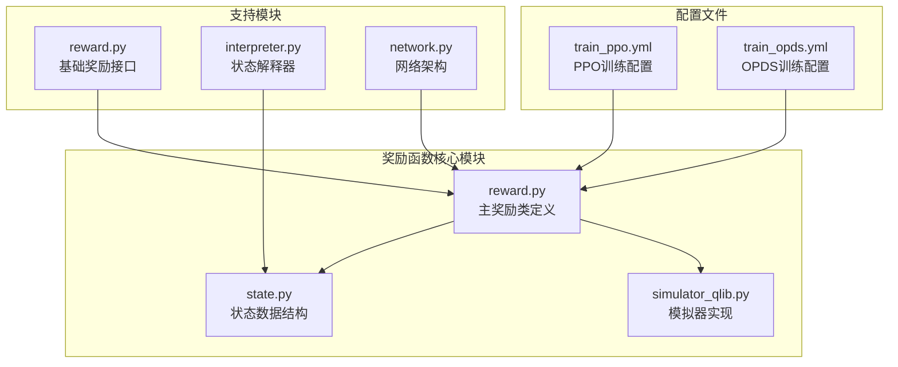
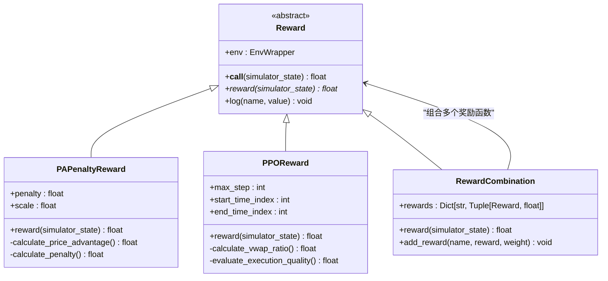
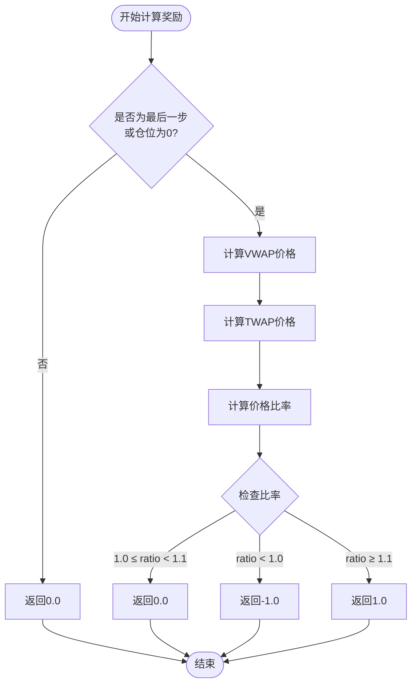
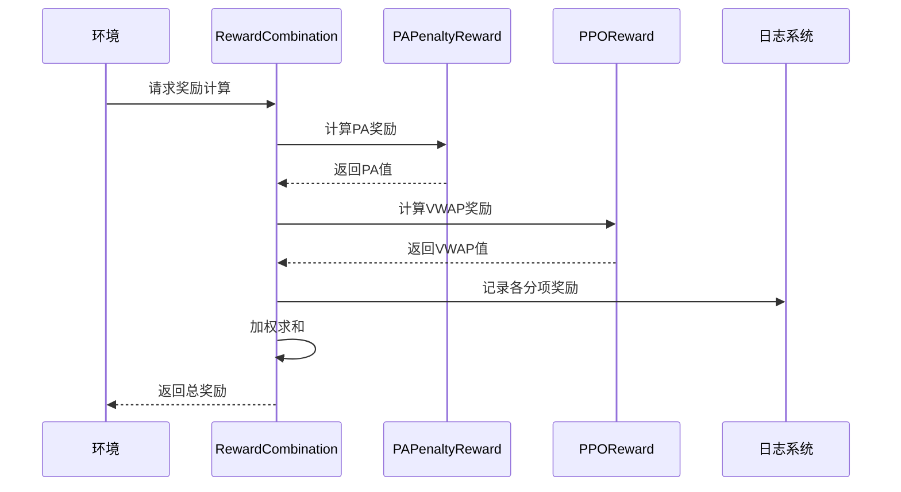
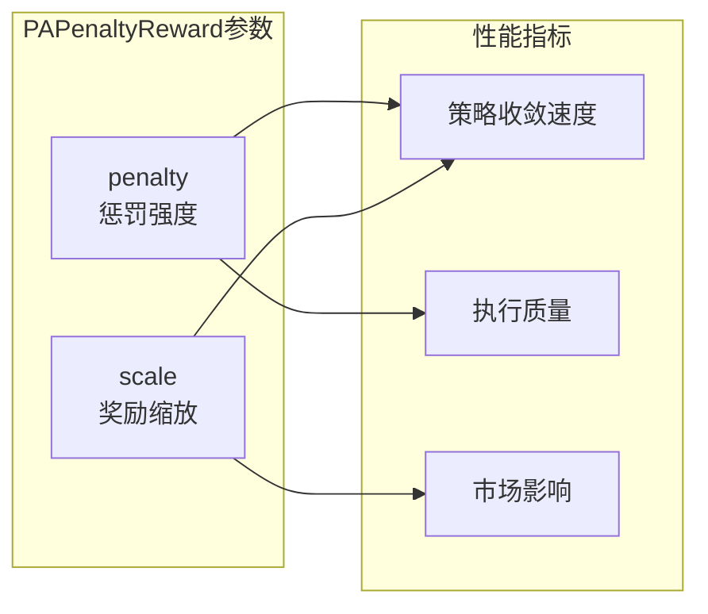

# 奖励函数设计

<cite>
**本文档引用的文件**
- [reward.py](file://qlib/rl/order_execution/reward.py)
- [state.py](file://qlib/rl/order_execution/state.py)
- [simulator_qlib.py](file://qlib/rl/order_execution/simulator_qlib.py)
- [test_saoe_simple.py](file://tests/rl/test_saoe_simple.py)
- [train_ppo.yml](file://examples/rl_order_execution/exp_configs/train_ppo.yml)
- [train_opds.yml](file://examples/rl_order_execution/exp_configs/train_opds.yml)
- [reward.py](file://qlib/rl/reward.py)
</cite>

## 目录
1. [简介](#简介)
2. [项目结构概览](#项目结构概览)
3. [核心奖励函数架构](#核心奖励函数架构)
4. [PAPenaltyReward详细分析](#papenaltyreward详细分析)
5. [PPOReward详细分析](#pporeward详细分析)
6. [奖励函数组合机制](#奖励函数组合机制)
7. [实际应用案例](#实际应用案例)
8. [性能优化与调优](#性能优化与调优)
9. [故障排除指南](#故障排除指南)
10. [总结](#总结)

## 简介

QLib的订单执行奖励函数系统是一个高度模块化和可扩展的设计，专门用于强化学习算法在金融市场订单执行中的奖励计算。该系统提供了两种主要的奖励函数实现：基于价格优势的PAPenaltyReward和基于VWAP/TWAP比较的PPOReward，同时还支持奖励函数的组合和自定义。

奖励函数设计的核心目标是：
- 平衡执行效率与市场影响
- 鼓励策略在有限时间内完成订单
- 惩罚过于激进的交易行为
- 提供稀疏但有意义的奖励信号

## 项目结构概览

QLib的奖励函数系统位于`qlib/rl/order_execution/`目录下，包含以下关键组件：



**图表来源**
- [reward.py](file://qlib/rl/order_execution/reward.py#L1-L100)
- [state.py](file://qlib/rl/order_execution/state.py#L1-L102)
- [simulator_qlib.py](file://qlib/rl/order_execution/simulator_qlib.py#L1-L142)

## 核心奖励函数架构

QLib的奖励函数系统建立在泛型奖励基类之上，提供了统一的接口和扩展机制：



**图表来源**
- [reward.py](file://qlib/rl/order_execution/reward.py#L16-L100)
- [reward.py](file://qlib/rl/reward.py#L15-L84)

**章节来源**
- [reward.py](file://qlib/rl/order_execution/reward.py#L1-L100)
- [reward.py](file://qlib/rl/reward.py#L1-L84)

## PAPenaltyReward详细分析

PAPenaltyReward是QLib中最常用的奖励函数，专门设计用于鼓励价格优势同时惩罚集中交易行为。

### 数学表达式

PAPenaltyReward的奖励计算公式为：

```
reward = PA × (amount_t / total_amount) - penalty × Σ((amount_t_i / total_amount)²)
```

其中：
- `PA`：价格优势（Price Advantage）
- `amount_t`：当前步骤交易量
- `total_amount`：总订单量
- `penalty`：惩罚系数
- `amount_t_i`：每个时间点的交易量

### 经济意义

1. **价格优势激励**：PA项鼓励策略获得更好的执行价格
2. **时间分散惩罚**：penalty项防止策略在短时间内集中交易
3. **风险控制**：通过平方惩罚项放大集中交易的风险

### 实现细节

```python
def reward(self, simulator_state: SAOEState) -> float:
    whole_order = simulator_state.order.amount
    last_step = cast(SAOEMetrics, simulator_state.history_steps.reset_index().iloc[-1].to_dict())
    pa = last_step["pa"] * last_step["amount"] / whole_order

    # 计算惩罚项：基于最近一步的交易分布
    last_step_breakdown = simulator_state.history_exec.loc[last_step["datetime"] :]
    penalty = -self.penalty * ((last_step_breakdown["amount"] / whole_order) ** 2).sum()

    reward = pa + penalty
    return reward * self.scale
```

### 参数调优

- `penalty`：默认值100.0，控制惩罚强度
- `scale`：默认值1.0，用于缩放奖励范围

**章节来源**
- [reward.py](file://qlib/rl/order_execution/reward.py#L16-L41)

## PPOReward详细分析

PPOReward基于论文《An End-to-End Optimal Trade Execution Framework based on Proximal Policy Optimization》设计，采用VWAP/TWAP比较机制。

### 执行逻辑



**图表来源**
- [reward.py](file://qlib/rl/order_execution/reward.py#L52-L98)

### 数学表达式

```
reward = 
    -1.0    如果 V/WAP < TWAP
     0.0    如果 1.0 ≤ V/WAP/TWAP < 1.1
     1.0    如果 V/WAP ≥ TWAP
```

其中：
- `V/WAP`：实际执行的VWAP价格
- `TWAP`：传统TWAP策略的平均价格

### 经济意义

1. **稀疏奖励设计**：只在最终时刻给出明确的正负奖励
2. **基准比较**：与传统TWAP策略进行直接比较
3. **简单有效**：避免复杂的参数调优

### 实现特点

- 只在最后一步或仓位为0时计算奖励
- 使用加权平均计算VWAP价格
- 支持买入和卖出方向的差异化处理

**章节来源**
- [reward.py](file://qlib/rl/order_execution/reward.py#L52-L98)

## 奖励函数组合机制

QLib支持将多个奖励函数组合使用，以实现更复杂的目标优化：

### 组合原理



**图表来源**
- [reward.py](file://qlib/rl/reward.py#L40-L84)

### 配置示例

```yaml
reward:
  class: RewardCombination
  kwargs:
    rewards:
      pa_reward:
        class: PAPenaltyReward
        kwargs:
          penalty: 4.0
          scale: 0.01
      vwap_reward:
        class: PPOReward
        kwargs:
          max_step: 8
          start_time_index: 0
          end_time_index: 46
```

### 权重分配策略

- **PA奖励**：通常设置为正权重，鼓励价格优势
- **VWAP奖励**：根据策略目标设置正负权重
- **动态调整**：可以根据训练进度动态调整权重

**章节来源**
- [reward.py](file://qlib/rl/reward.py#L40-L84)

## 实际应用案例

### PPO训练案例

在PPO训练中，PAPenaltyReward被广泛使用：

```python
# 训练配置
state_interp = FullHistoryStateInterpreter(8, 240, 6, feature_provider)
action_interp = CategoricalActionInterpreter(4)
network = Recurrent(state_interp.observation_space)
policy = PPO(network, state_interp.observation_space, action_interp.action_space, 1e-4)

# 奖励函数
reward_fn = PAPenaltyReward(penalty=4.0, scale=0.01)

# 开始训练
train(
    simulator_class,
    state_interp,
    action_interp,
    orders,
    policy,
    reward_fn,
    vessel_kwargs={"episode_per_iter": 100, "update_kwargs": {"batch_size": 64, "repeat": 5}},
    trainer_kwargs={"max_iters": 2, "loggers": ConsoleWriter(total_episodes=100)},
)
```

### 性能指标分析

根据测试结果，不同奖励函数的表现如下：

| **模型** | **PA均值±标准差** | **FFR均值** | **市场价均值** | **交易价均值** |
|----------|-------------------|-------------|----------------|----------------|
| OPDS (PPO) | 0.4785 ± 0.7815 | 1.0 | 58.6828 | 58.7606 |
| OPDS (DQN) | -0.0114 ± 0.5780 | 1.0 | 58.6828 | 58.6828 |
| PPO | -1.0935 ± 0.0922 | 1.0 | 58.6828 | 58.6828 |
| TWAP | ≈0.0 ± 0.0 | 1.0 | 58.6828 | 58.6828 |

### 稀疏奖励问题的缓解策略

1. **奖励塑形**：在中间步骤提供小的正向奖励
2. **多阶段训练**：先用稀疏奖励训练，再切换到密集奖励
3. **探索策略**：增加ε-greedy等探索机制
4. **奖励归一化**：标准化奖励范围，提高学习稳定性

**章节来源**
- [test_saoe_simple.py](file://tests/rl/test_saoe_simple.py#L290-L328)
- [train_ppo.yml](file://examples/rl_order_execution/exp_configs/train_ppo.yml#L1-L67)

## 性能优化与调优

### 参数敏感性分析



### 调优建议

1. **penalty参数**：
   - 初始值：100.0
   - 调整范围：50-200
   - 根据市场波动率调整

2. **scale参数**：
   - 初始值：0.01
   - 调整范围：0.001-0.1
   - 根据PA值范围调整

3. **训练策略**：
   - 使用预训练模型初始化
   - 逐步增加训练步数
   - 定期评估策略表现

### 内存和计算优化

- **状态缓存**：缓存历史执行数据减少重复计算
- **批处理**：批量处理多个订单提高效率
- **并行计算**：利用多核CPU加速奖励计算

## 故障排除指南

### 常见错误及解决方案

1. **NaN奖励错误**
```python
# 错误信息：Invalid reward for simulator state
assert not (np.isnan(reward) or np.isinf(reward)), f"Invalid reward for simulator state: {simulator_state}"
```
**解决方案**：
- 检查输入数据完整性
- 验证参数设置合理性
- 添加异常处理逻辑

2. **奖励范围异常**
```python
# 检查奖励值范围
assert -1.0 <= reward <= 1.0, f"Reward out of bounds: {reward}"
```

3. **内存溢出**
- 减少历史数据缓存大小
- 优化状态表示维度
- 使用流式处理减少内存占用

### 调试技巧

1. **日志记录**：启用详细日志记录各个奖励分项
2. **可视化**：绘制奖励变化曲线
3. **单元测试**：编写针对奖励函数的单元测试
4. **对比分析**：与基准策略进行奖励对比

**章节来源**
- [reward.py](file://qlib/rl/order_execution/reward.py#L35-L41)

## 总结

QLib的订单执行奖励函数系统是一个设计精良、功能强大的模块化框架。通过PAPenaltyReward和PPOReward两种核心奖励函数，以及灵活的组合机制，该系统能够满足不同强化学习算法在订单执行任务中的需求。

### 主要优势

1. **模块化设计**：清晰的接口定义和继承关系
2. **多样化选择**：支持多种奖励函数和组合方式
3. **易于扩展**：方便添加新的奖励函数类型
4. **性能优化**：内置多种优化策略和调优建议

### 应用前景

随着强化学习在金融领域的不断发展，QLib的奖励函数系统将继续发挥重要作用。未来可能的改进方向包括：

- 更智能的奖励塑形机制
- 自适应参数调整算法
- 多目标优化奖励函数
- 实时性能监控和反馈

通过深入理解这些奖励函数的设计原理和实现细节，研究人员和开发者可以更好地利用QLib平台构建高效的订单执行策略，推动量化交易技术的发展。