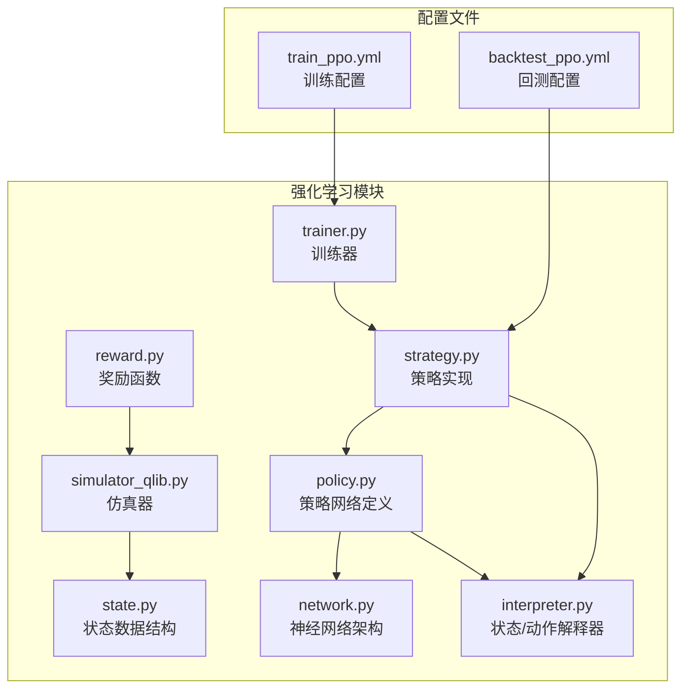
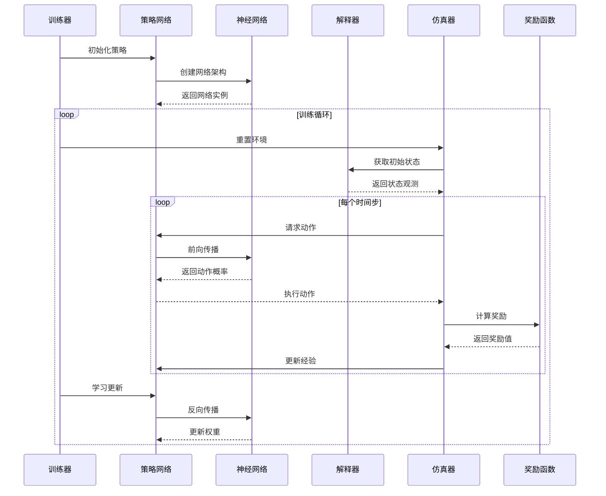
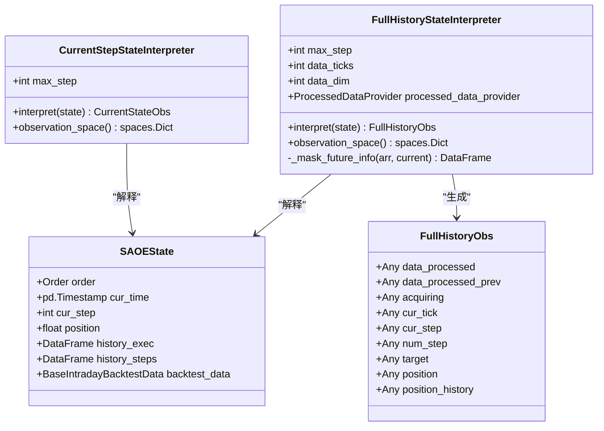
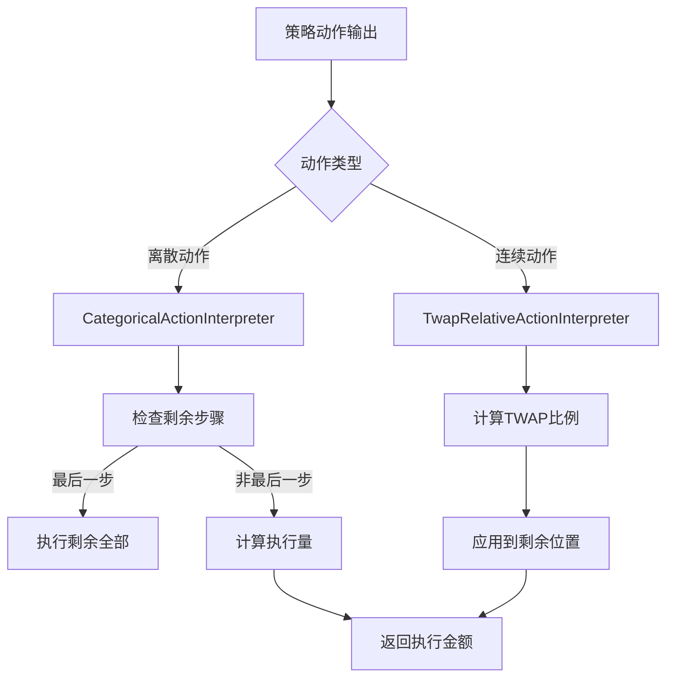
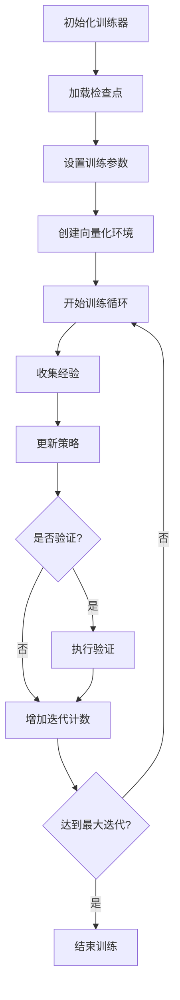
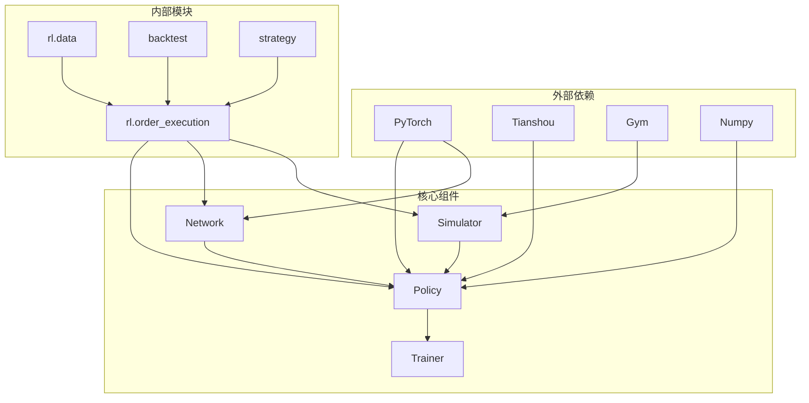

# 强化学习策略

<cite>
**本文档引用的文件**
- [policy.py](file://qlib/rl/order_execution/policy.py)
- [network.py](file://qlib/rl/order_execution/network.py)
- [state.py](file://qlib/rl/order_execution/state.py)
- [reward.py](file://qlib/rl/order_execution/reward.py)
- [simulator_qlib.py](file://qlib/rl/order_execution/simulator_qlib.py)
- [interpreter.py](file://qlib/rl/order_execution/interpreter.py)
- [strategy.py](file://qlib/rl/order_execution/strategy.py)
- [trainer.py](file://qlib/rl/trainer/trainer.py)
- [train_ppo.yml](file://examples/rl_order_execution/exp_configs/train_ppo.yml)
- [backtest_ppo.yml](file://examples/rl_order_execution/exp_configs/backtest_ppo.yml)
</cite>

## 目录
1. [简介](#简介)
2. [项目结构](#项目结构)
3. [核心组件](#核心组件)
4. [架构概览](#架构概览)
5. [详细组件分析](#详细组件分析)
6. [依赖关系分析](#依赖关系分析)
7. [性能考虑](#性能考虑)
8. [故障排除指南](#故障排除指南)
9. [结论](#结论)

## 简介

Qlib的强化学习模块为订单执行策略提供了先进的机器学习解决方案。该系统基于深度强化学习算法，特别是PPO（Proximal Policy Optimization）和DQN（Deep Q-Network），专门设计用于处理高频交易中的订单执行问题。

该系统的核心目标是通过智能策略网络自动决定在给定市场条件下的最优订单执行量，从而最大化交易收益并最小化市场冲击成本。系统采用连续动作空间，能够精确控制每一步的执行量，并通过奖励机制引导策略学习最优行为。

## 项目结构

强化学习模块的组织结构清晰地分离了不同的功能组件：



**图表来源**
- [policy.py](file://qlib/rl/order_execution/policy.py#L1-L238)
- [network.py](file://qlib/rl/order_execution/network.py#L1-L141)
- [trainer.py](file://qlib/rl/trainer/trainer.py#L1-L356)

**章节来源**
- [policy.py](file://qlib/rl/order_execution/policy.py#L1-L238)
- [network.py](file://qlib/rl/order_execution/network.py#L1-L141)
- [state.py](file://qlib/rl/order_execution/state.py#L1-L102)

## 核心组件

### 策略网络架构

强化学习策略的核心是策略网络，它负责从当前市场状态中预测最优的动作。系统支持两种主要的策略类型：PPO和DQN。

#### PPO策略实现

PPO（Proximal Policy Optimization）策略是最常用的策略之一，它使用演员-评论家架构：

```python
class PPOActor(nn.Module):
    def __init__(self, extractor: nn.Module, action_dim: int) -> None:
        super().__init__()
        self.extractor = extractor
        self.layer_out = nn.Sequential(
            nn.Linear(cast(int, extractor.output_dim), action_dim), 
            nn.Softmax(dim=-1)
        )

    def forward(self, obs: torch.Tensor, state: torch.Tensor = None, info: dict = {}) -> Tuple[torch.Tensor, Optional[torch.Tensor]]:
        feature = self.extractor(to_torch(obs, device=auto_device(self)))
        out = self.layer_out(feature)
        return out, state
```

#### DQN策略实现

DQN（Deep Q-Network）策略使用深度Q学习方法：

```python
class DQNModel = PPOActor  # 复用PPOActor作为DQN模型
```

### 神经网络架构

系统采用递归神经网络（RNN）架构来处理时间序列数据：

```python
class Recurrent(nn.Module):
    def __init__(self, obs_space: FullHistoryObs, hidden_dim: int = 64, output_dim: int = 32, rnn_type: Literal["rnn", "lstm", "gru"] = "gru", rnn_num_layers: int = 1) -> None:
        super().__init__()
        
        self.hidden_dim = hidden_dim
        self.output_dim = output_dim
        self.num_sources = 3
        
        rnn_classes = {"rnn": nn.RNN, "lstm": nn.LSTM, "gru": nn.GRU}
        self.rnn_class = rnn_classes[rnn_type]
        
        # 初始化三个独立的RNN分支
        self.raw_rnn = self.rnn_class(hidden_dim, hidden_dim, batch_first=True, num_layers=self.rnn_layers)
        self.prev_rnn = self.rnn_class(hidden_dim, hidden_dim, batch_first=True, num_layers=self.rnn_layers)
        self.pri_rnn = self.rnn_class(hidden_dim, hidden_dim, batch_first=True, num_layers=self.rnn_layers)
```

**章节来源**
- [policy.py](file://qlib/rl/order_execution/policy.py#L60-L110)
- [network.py](file://qlib/rl/order_execution/network.py#L18-L60)

## 架构概览

强化学习系统的整体架构展示了各组件之间的交互关系：



**图表来源**
- [trainer.py](file://qlib/rl/trainer/trainer.py#L150-L250)
- [policy.py](file://qlib/rl/order_execution/policy.py#L101-L157)
- [simulator_qlib.py](file://qlib/rl/order_execution/simulator_qlib.py#L20-L80)

## 详细组件分析

### 状态解释器

状态解释器负责将原始的仿真状态转换为神经网络可理解的格式：



**图表来源**
- [interpreter.py](file://qlib/rl/order_execution/interpreter.py#L70-L150)
- [interpreter.py](file://qlib/rl/order_execution/interpreter.py#L152-L180)
- [state.py](file://qlib/rl/order_execution/state.py#L70-L102)

### 动作解释器

动作解释器将策略网络的输出转换为实际的交易动作：



**图表来源**
- [interpreter.py](file://qlib/rl/order_execution/interpreter.py#L182-L257)

### 奖励函数

奖励函数是强化学习的核心，它指导策略学习最优行为：

```python
class PAPenaltyReward(Reward[SAOEState]):
    """鼓励更高价格优势，但惩罚短时间内大量交易"""
    
    def reward(self, simulator_state: SAOEState) -> float:
        whole_order = simulator_state.order.amount
        last_step = cast(SAOEMetrics, simulator_state.history_steps.reset_index().iloc[-1].to_dict())
        pa = last_step["pa"] * last_step["amount"] / whole_order
        
        # 检查最新步骤的交易分解：每个时间点的交易量
        last_step_breakdown = simulator_state.history_exec.loc[last_step["datetime"] :]
        penalty = -self.penalty * ((last_step_breakdown["amount"] / whole_order) ** 2).sum()
        
        reward = pa + penalty
        return reward * self.scale
```

**章节来源**
- [reward.py](file://qlib/rl/order_execution/reward.py#L15-L50)
- [interpreter.py](file://qlib/rl/order_execution/interpreter.py#L182-L257)

### 训练流程

训练器管理整个强化学习训练过程：



**图表来源**
- [trainer.py](file://qlib/rl/trainer/trainer.py#L150-L250)

**章节来源**
- [trainer.py](file://qlib/rl/trainer/trainer.py#L150-L356)

## 依赖关系分析

强化学习模块的依赖关系展现了清晰的分层架构：



**图表来源**
- [policy.py](file://qlib/rl/order_execution/policy.py#L1-L20)
- [network.py](file://qlib/rl/order_execution/network.py#L1-L15)

**章节来源**
- [policy.py](file://qlib/rl/order_execution/policy.py#L1-L238)
- [network.py](file://qlib/rl/order_execution/network.py#L1-L141)

## 性能考虑

### 内存管理

强化学习训练过程中需要高效管理内存资源：

1. **批量处理**：使用批量数据处理减少内存碎片
2. **梯度累积**：通过梯度累积减少内存峰值
3. **检查点保存**：定期保存模型状态避免内存溢出

### 并行计算

系统支持多种并行模式：

- **并发环境**：支持多个仿真环境同时运行
- **多工作进程**：数据加载和预处理并行化
- **GPU加速**：支持CUDA加速训练过程

### 超参数调优

关键超参数及其影响：

| 参数 | 默认值 | 影响 |
|------|--------|------|
| 学习率 | 0.0001 | 控制权重更新速度 |
| 折扣因子 | 0.99 | 远期奖励的重要性 |
| 批大小 | 1024 | 训练稳定性 |
| 最大梯度范数 | 100.0 | 防止梯度爆炸 |

## 故障排除指南

### 常见问题及解决方案

#### 训练不收敛

**症状**：奖励值波动大，策略性能不稳定

**可能原因**：
1. 学习率设置不当
2. 奖励函数设计不合理
3. 网络架构过于简单

**解决方案**：
```yaml
# 调整学习率
policy:
  kwargs:
    lr: 0.00001  # 减小学习率

# 改进奖励函数
reward:
  class: PAPenaltyReward
  kwargs:
    penalty: 50.0  # 减少惩罚强度
    scale: 0.5     # 缩放奖励值
```

#### 内存不足

**症状**：训练过程中出现OOM错误

**解决方案**：
1. 减少批大小
2. 使用梯度累积
3. 启用检查点保存

#### 收敛速度慢

**症状**：需要大量迭代才能获得良好性能

**解决方案**：
1. 增加并发环境数量
2. 优化网络架构
3. 调整探索策略

**章节来源**
- [train_ppo.yml](file://examples/rl_order_execution/exp_configs/train_ppo.yml#L40-L67)
- [backtest_ppo.yml](file://examples/rl_order_execution/exp_configs/backtest_ppo.yml#L1-L54)

## 结论

Qlib的强化学习模块提供了一个完整且高效的订单执行策略框架。通过精心设计的组件架构，系统能够有效地处理复杂的金融市场环境，并通过深度强化学习算法自动学习最优的交易策略。

### 主要优势

1. **模块化设计**：清晰的组件分离便于维护和扩展
2. **灵活配置**：丰富的配置选项适应不同交易场景
3. **高性能**：支持并行计算和GPU加速
4. **易于使用**：简洁的API接口降低使用门槛

### 应用前景

该系统特别适用于高频交易、机构投资者的大额订单执行等场景。通过持续的训练和优化，策略能够适应不断变化的市场环境，为投资者创造更大的价值。

### 未来发展方向

1. **更多算法支持**：扩展支持DDPG、SAC等其他强化学习算法
2. **更复杂的状态空间**：引入更多市场特征和历史数据
3. **实时训练**：支持在线学习和实时策略更新
4. **风险管理**：集成更完善的风险控制机制

通过本文档的详细分析，开发者可以深入理解Qlib强化学习模块的设计原理和实现细节，从而更好地应用和扩展这一强大的工具。