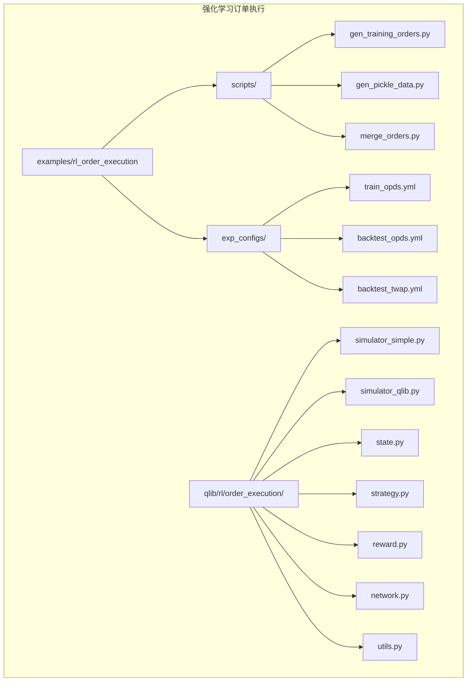
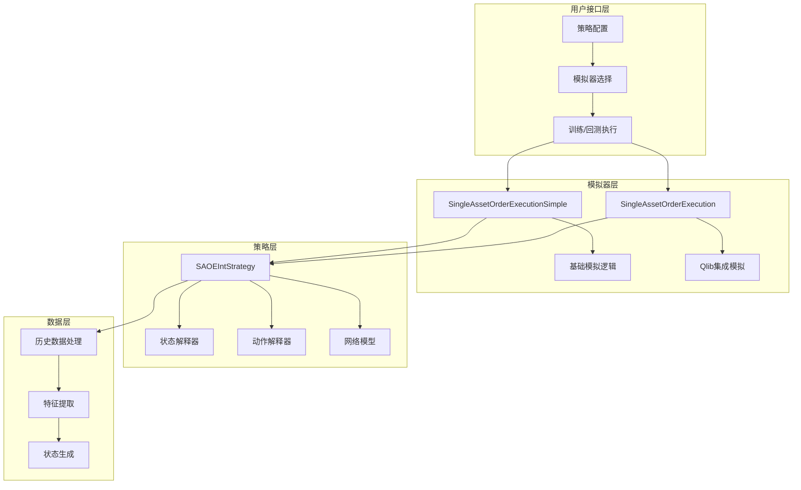
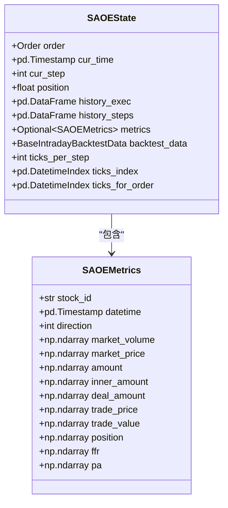
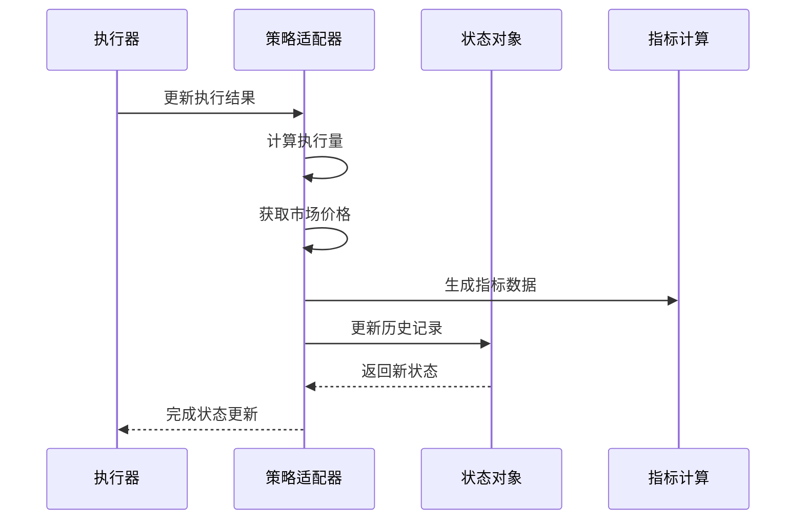
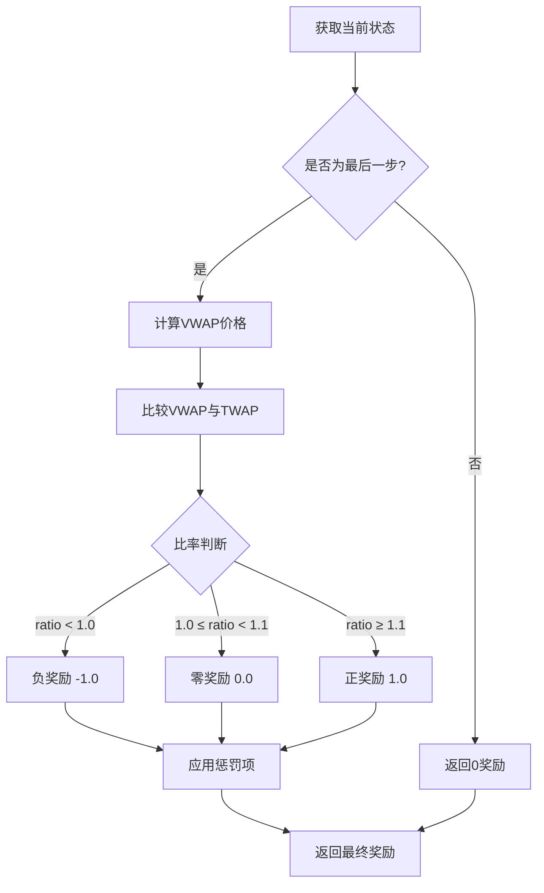
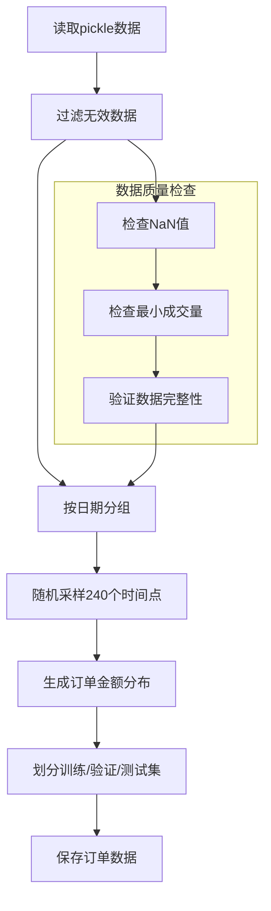
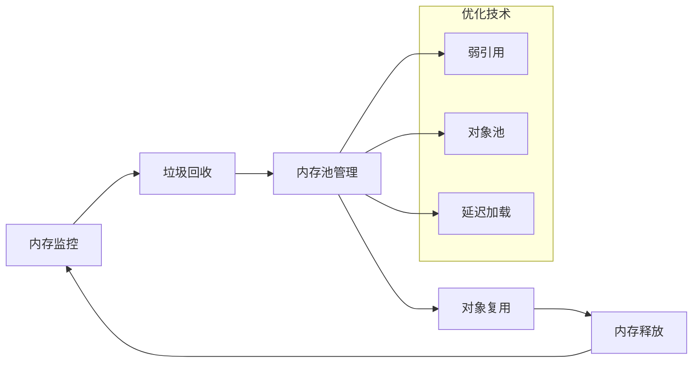

# Qlib订单执行模拟器详细文档

<cite>
**本文档中引用的文件**
- [simulator_simple.py](file://qlib/rl/order_execution/simulator_simple.py)
- [simulator_qlib.py](file://qlib/rl/order_execution/simulator_qlib.py)
- [state.py](file://qlib/rl/order_execution/state.py)
- [strategy.py](file://qlib/rl/order_execution/strategy.py)
- [gen_training_orders.py](file://examples/rl_order_execution/scripts/gen_training_orders.py)
- [reward.py](file://qlib/rl/order_execution/reward.py)
- [network.py](file://qlib/rl/order_execution/network.py)
- [utils.py](file://qlib/rl/order_execution/utils.py)
- [backtest_opds.yml](file://examples/rl_order_execution/exp_configs/backtest_opds.yml)
- [train_opds.yml](file://examples/rl_order_execution/exp_configs/train_opds.yml)
- [README.md](file://examples/rl_order_execution/README.md)
</cite>

## 目录
1. [简介](#简介)
2. [项目结构概览](#项目结构概览)
3. [核心组件分析](#核心组件分析)
4. [架构概览](#架构概览)
5. [详细组件分析](#详细组件分析)
6. [训练数据生成流程](#训练数据生成流程)
7. [性能优化策略](#性能优化策略)
8. [故障排除指南](#故障排除指南)
9. [结论](#结论)

## 简介

Qlib订单执行模拟器是一个基于强化学习的交易模拟框架，专门用于模拟真实市场环境中的订单执行过程。该模拟器提供了两种主要的实现方式：理想化的简单模拟器（`simulator_simple.py`）和真实的市场约束模拟器（`simulator_qlib.py`）。通过这两个模拟器的对比分析，我们可以深入了解不同市场假设对交易策略的影响。

该框架的核心目标是为强化学习算法提供一个可靠的训练和测试环境，使算法能够在受控的市场条件下进行订单执行策略的学习和优化。

## 项目结构概览

Qlib订单执行模拟器的项目结构围绕强化学习训练和回测展开，主要包含以下关键目录：

**图表来源**
- [simulator_simple.py](file://qlib/rl/order_execution/simulator_simple.py#L1-L50)
- [simulator_qlib.py](file://qlib/rl/order_execution/simulator_qlib.py#L1-L50)

**章节来源**
- [README.md](file://examples/rl_order_execution/README.md#L1-L101)

## 核心组件分析

### 模拟器类型对比

Qlib提供了两种不同的订单执行模拟器，每种都有其特定的应用场景和优势：

#### 1. 简单模拟器（SingleAssetOrderExecutionSimple）

简单模拟器基于理想化的市场假设，提供快速的模拟体验：

- **特点**：
  - 不考虑市场限制（滑点、手续费）
  - 支持细粒度的时间步长控制
  - 适用于算法原型验证和快速迭代

- **适用场景**：
  - 算法概念验证
  - 快速原型开发
  - 理想化策略测试

#### 2. Qlib模拟器（SingleAssetOrderExecution）

Qlib模拟器集成了真实的市场约束，提供更精确的模拟效果：

- **特点**：
  - 考虑实际市场约束
  - 集成完整的Qlib回测系统
  - 支持复杂的交易策略

- **适用场景**：
  - 实际策略训练
  - 回测验证
  - 生产环境部署前测试

**章节来源**
- [simulator_simple.py](file://qlib/rl/order_execution/simulator_simple.py#L25-L100)
- [simulator_qlib.py](file://qlib/rl/order_execution/simulator_qlib.py#L15-L80)

## 架构概览

Qlib订单执行模拟器采用分层架构设计，确保了模块化和可扩展性：

**图表来源**
- [simulator_simple.py](file://qlib/rl/order_execution/simulator_simple.py#L25-L100)
- [simulator_qlib.py](file://qlib/rl/order_execution/simulator_qlib.py#L15-L80)
- [strategy.py](file://qlib/rl/order_execution/strategy.py#L1-L100)

## 详细组件分析

### 状态管理组件（SAOEState）

状态管理是整个模拟器的核心，负责维护订单执行过程中的所有相关信息：

**图表来源**
- [state.py](file://qlib/rl/order_execution/state.py#L20-L80)

### 策略适配器组件（SAOEStateAdapter）

策略适配器负责将执行结果转换为内部状态，并更新历史记录：

**图表来源**
- [strategy.py](file://qlib/rl/order_execution/strategy.py#L100-L200)

### 奖励函数组件

奖励函数是强化学习的核心，用于指导策略学习：

**图表来源**
- [reward.py](file://qlib/rl/order_execution/reward.py#L60-L100)

**章节来源**
- [state.py](file://qlib/rl/order_execution/state.py#L1-L102)
- [strategy.py](file://qlib/rl/order_execution/strategy.py#L1-L200)
- [reward.py](file://qlib/rl/order_execution/reward.py#L1-L100)

## 训练数据生成流程

### 数据生成脚本分析

`gen_training_orders.py`脚本负责生成用于强化学习训练的订单数据：

**图表来源**
- [gen_training_orders.py](file://examples/rl_order_execution/scripts/gen_training_orders.py#L15-L50)

### 配置参数详解

训练和回测配置文件定义了模拟器的行为参数：

#### 训练配置（train_opds.yml）

- **模拟器设置**：5分钟粒度，30分钟步长
- **状态解释器**：FullHistoryStateInterpreter，包含48个时间点的历史数据
- **网络架构**：RNN网络，支持序列数据处理
- **策略类型**：PPO策略，支持连续动作空间

#### 回测配置（backtest_opds.yml）

- **订单文件**：指定的测试订单数据
- **执行策略**：SAOEIntStrategy，集成状态和动作解释器
- **并发数量**：16个并发进程，提高回测效率
- **输出目录**：结果存储在outputs/opds目录

**章节来源**
- [gen_training_orders.py](file://examples/rl_order_execution/scripts/gen_training_orders.py#L1-L54)
- [train_opds.yml](file://examples/rl_order_execution/exp_configs/train_opds.yml#L1-L67)
- [backtest_opds.yml](file://examples/rl_order_execution/exp_configs/backtest_opds.yml#L1-L54)

## 性能优化策略

### 批量模拟优化

为了提高模拟器的性能，可以采用以下优化策略：

#### 1. 并行处理

- **多进程并发**：使用多个进程同时处理不同的订单
- **内存优化**：合理分配内存资源，避免内存泄漏
- **I/O优化**：减少磁盘读写操作，使用缓存机制

#### 2. 状态快照复用

- **历史数据缓存**：缓存常用的历史数据，避免重复计算
- **中间结果保存**：保存中间计算结果，支持断点续传
- **增量更新**：只更新变化的部分，减少计算开销

#### 3. 数据预处理优化

- **特征工程**：提前计算常用特征，减少运行时计算
- **数据压缩**：使用高效的数据格式存储历史数据
- **索引优化**：建立合适的数据索引，提高查询效率

### 内存管理策略

## 故障排除指南

### 常见问题及解决方案

#### 1. 数据质量问题

**问题**：订单数据中存在NaN值或异常值
**解决方案**：
- 在数据生成阶段添加质量检查
- 使用插值方法填充缺失值
- 设置合理的阈值过滤异常数据

#### 2. 内存不足错误

**问题**：大规模模拟导致内存溢出
**解决方案**：
- 减少批次大小
- 启用数据流式处理
- 使用虚拟内存扩展

#### 3. 性能瓶颈

**问题**：模拟速度过慢影响训练效率
**解决方案**：
- 优化数据访问模式
- 使用更快的数据结构
- 并行化计算密集型任务

### 调试技巧

#### 1. 日志分析

- 启用详细日志记录
- 监控关键指标变化
- 分析性能瓶颈点

#### 2. 可视化工具

- 使用matplotlib绘制执行轨迹
- 可视化价格走势和成交量
- 分析策略表现统计

**章节来源**
- [utils.py](file://qlib/rl/order_execution/utils.py#L1-L53)

## 结论

Qlib订单执行模拟器提供了一个强大而灵活的平台，用于强化学习算法在订单执行场景中的训练和测试。通过对比分析简单模拟器和Qlib模拟器的功能差异，我们可以看到：

### 主要优势

1. **灵活性**：支持多种模拟器类型，适应不同需求
2. **准确性**：Qlib模拟器集成真实市场约束，提供更准确的模拟效果
3. **可扩展性**：模块化设计便于功能扩展和定制
4. **易用性**：提供完整的配置和使用文档

### 应用前景

该模拟器在以下领域具有广阔的应用前景：

- **量化交易策略开发**
- **算法交易研究**
- **风险管理评估**
- **投资组合优化**

### 发展方向

未来的发展可以考虑：

- **更多市场类型支持**：扩展到其他金融市场
- **实时数据集成**：支持实时市场数据接入
- **高级策略支持**：集成更复杂的交易策略
- **云原生部署**：支持分布式和云端部署

通过持续的改进和优化，Qlib订单执行模拟器将成为强化学习在金融领域应用的重要工具。