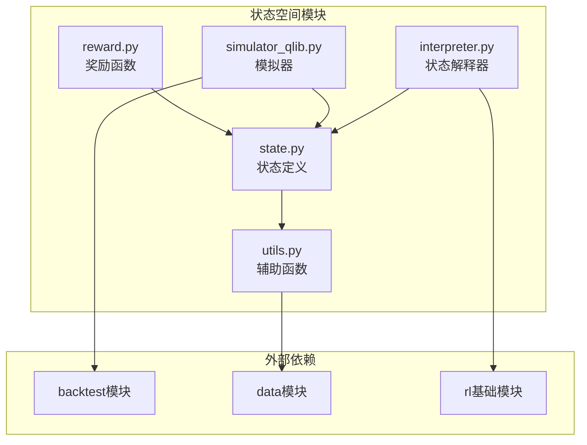
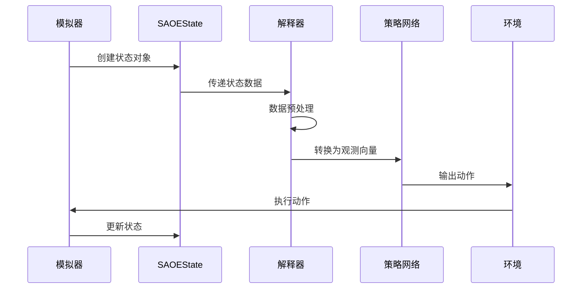
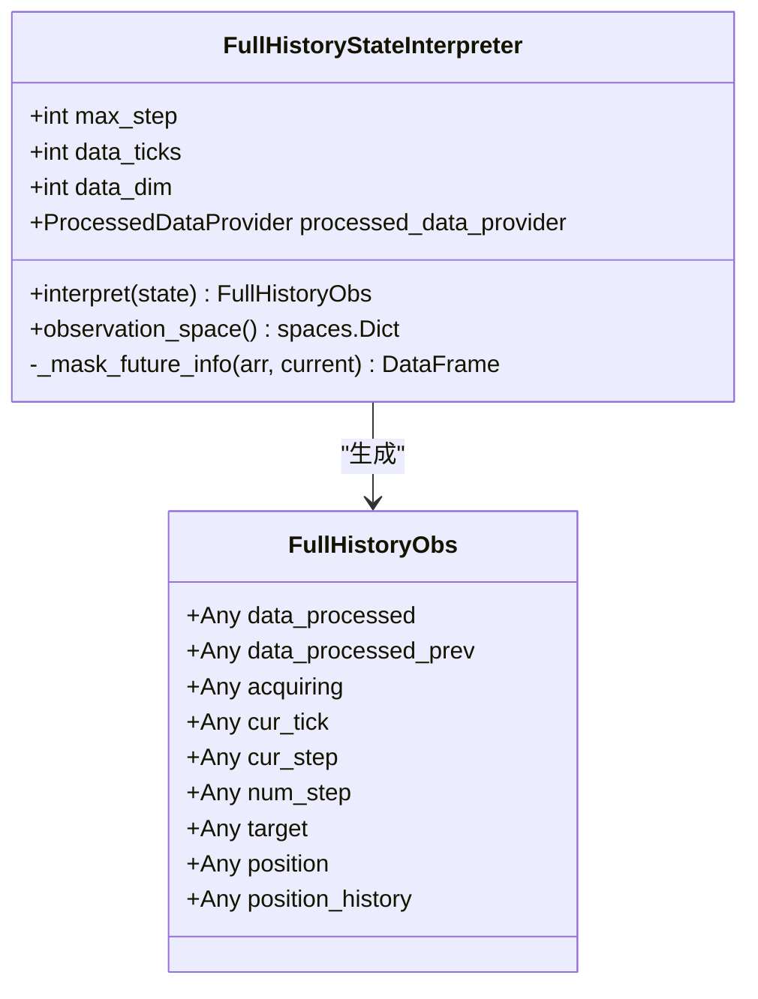
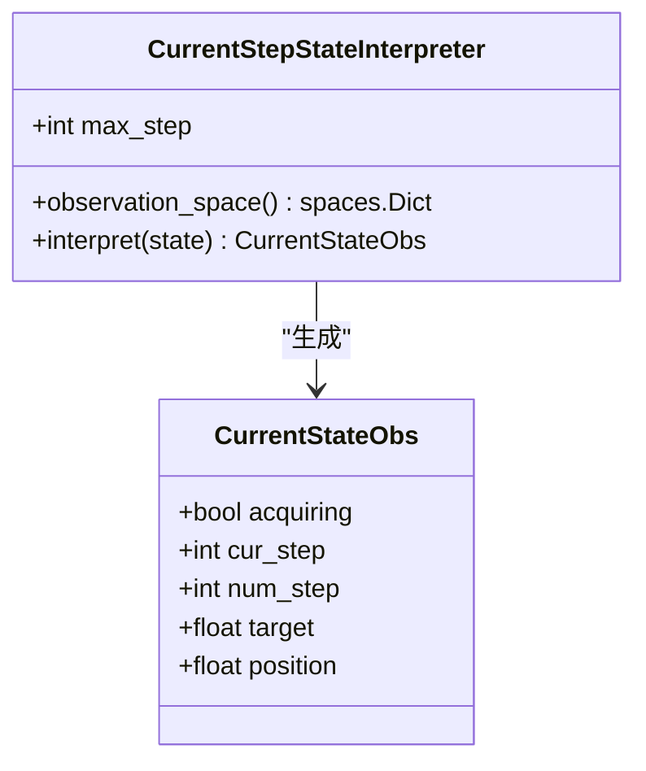
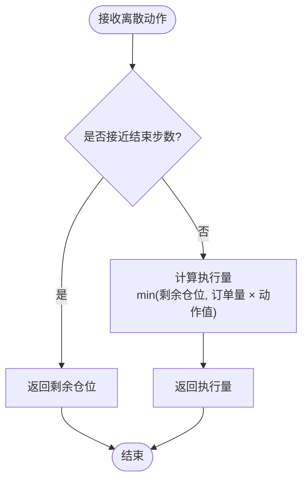
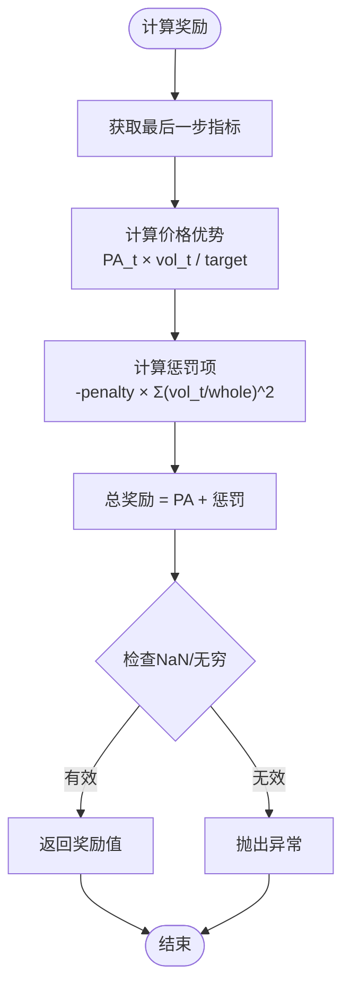
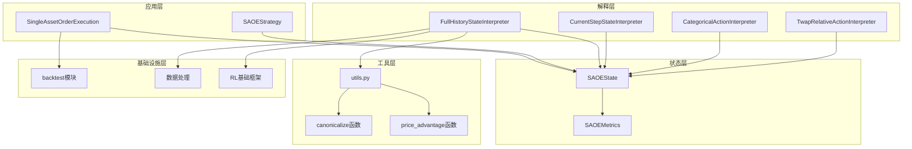

# 状态空间构建

<cite>
**本文档引用的文件**
- [state.py](file://qlib/rl/order_execution/state.py)
- [utils.py](file://qlib/rl/order_execution/utils.py)
- [interpreter.py](file://qlib/rl/order_execution/interpreter.py)
- [simulator_qlib.py](file://qlib/rl/order_execution/simulator_qlib.py)
- [reward.py](file://qlib/rl/order_execution/reward.py)
</cite>

## 目录
1. [简介](#简介)
2. [项目结构](#项目结构)
3. [核心组件](#核心组件)
4. [架构概览](#架构概览)
5. [详细组件分析](#详细组件分析)
6. [依赖关系分析](#依赖关系分析)
7. [性能考虑](#性能考虑)
8. [故障排除指南](#故障排除指南)
9. [结论](#结论)

## 简介

QLib的订单执行状态空间是一个复杂而精密的系统，专门设计用于捕捉股票市场订单执行过程中的关键特征。该系统通过精心设计的状态表示方法，为强化学习算法提供了丰富的环境信息，支持智能交易策略的训练和优化。

状态空间的核心目标是：
- 提供完整的订单执行历史记录
- 实时反映当前执行状态
- 支持多种时间粒度的数据聚合
- 确保信息的完整性和时效性

## 项目结构

QLib的订单执行模块采用分层架构设计，主要包含以下核心文件：



**图表来源**
- [state.py](file://qlib/rl/order_execution/state.py#L1-L102)
- [interpreter.py](file://qlib/rl/order_execution/interpreter.py#L1-L258)

**章节来源**
- [state.py](file://qlib/rl/order_execution/state.py#L1-L102)
- [utils.py](file://qlib/rl/order_execution/utils.py#L1-L53)

## 核心组件

### SAOE状态结构

QLib的订单执行状态基于`SAOEState`命名元组构建，包含了执行订单所需的所有关键信息：

```python
class SAOEState(NamedTuple):
    order: Order
    cur_time: pd.Timestamp
    cur_step: int
    position: float
    history_exec: pd.DataFrame
    history_steps: pd.DataFrame
    metrics: Optional[SAOEMetrics]
    backtest_data: BaseIntradayBacktestData
    ticks_per_step: int
    ticks_index: pd.DatetimeIndex
    ticks_for_order: pd.DatetimeIndex
```

### SAOE指标字典

`SAOEMetrics`字典提供了详细的订单执行统计信息：

```python
class SAOEMetrics(TypedDict):
    stock_id: str
    datetime: pd.Timestamp | pd.DatetimeIndex
    direction: int
    market_volume: np.ndarray | float
    market_price: np.ndarray | float
    amount: np.ndarray | float
    inner_amount: np.ndarray | float
    deal_amount: np.ndarray | float
    trade_price: np.ndarray | float
    trade_value: np.ndarray | float
    position: np.ndarray | float
    ffr: np.ndarray | float
    pa: np.ndarray | float
```

**章节来源**
- [state.py](file://qlib/rl/order_execution/state.py#L25-L102)

## 架构概览

状态空间的整体架构采用了观察者模式和解释器模式的组合：



**图表来源**
- [simulator_qlib.py](file://qlib/rl/order_execution/simulator_qlib.py#L1-L142)
- [interpreter.py](file://qlib/rl/order_execution/interpreter.py#L83-L130)

## 详细组件分析

### 状态解释器

#### FullHistoryStateInterpreter

这是最全面的状态解释器，提供完整的执行历史信息：



**图表来源**
- [interpreter.py](file://qlib/rl/order_execution/interpreter.py#L83-L130)

#### CurrentStepStateInterpreter

提供当前步骤的简化状态视图：



**图表来源**
- [interpreter.py](file://qlib/rl/order_execution/interpreter.py#L132-L170)

### 辅助函数

#### 归一化处理

`canonicalize`函数负责将不同类型的输入转换为统一的numpy数组格式：

```python
def canonicalize(value: int | float | np.ndarray | pd.DataFrame | dict) -> np.ndarray | dict:
    """转换为32位数值类型。递归处理。"""
    if isinstance(value, pd.DataFrame):
        return value.to_numpy()
    if isinstance(value, (float, np.floating)):
        return np.array(value, dtype=np.float32)
    elif isinstance(value, (int, bool, np.integer)):
        return np.array(value, dtype=np.int32)
    elif isinstance(value, dict):
        return {k: canonicalize(v) for k, v in value.items()}
    else:
        return value
```

#### 时间序列堆叠

位置历史记录通过以下方式实现时间序列堆叠：

```python
position_history = np.full(self.max_step + 1, 0.0, dtype=np.float32)
position_history[0] = state.order.amount
position_history[1 : len(state.history_steps) + 1] = state.history_steps["position"].to_numpy()
```

**章节来源**
- [interpreter.py](file://qlib/rl/order_execution/interpreter.py#L30-L45)
- [interpreter.py](file://qlib/rl/order_execution/interpreter.py#L95-L105)

### 动作解释器

#### CategoricalActionInterpreter

将离散动作值映射到连续执行量：



**图表来源**
- [interpreter.py](file://qlib/rl/order_execution/interpreter.py#L172-L200)

#### TwapRelativeActionInterpreter

基于TWAP策略的相对比例动作解释器：

```python
def interpret(self, state: SAOEState, action: float) -> float:
    estimated_total_steps = math.ceil(len(state.ticks_for_order) / state.ticks_per_step)
    twap_volume = state.position / (estimated_total_steps - state.cur_step)
    return min(state.position, twap_volume * action)
```

**章节来源**
- [interpreter.py](file://qlib/rl/order_execution/interpreter.py#L202-L225)

### 奖励函数

#### PAPenaltyReward

鼓励高价格优势同时惩罚集中执行：



**图表来源**
- [reward.py](file://qlib/rl/order_execution/reward.py#L15-L45)

**章节来源**
- [reward.py](file://qlib/rl/order_execution/reward.py#L1-L100)

## 依赖关系分析

状态空间模块的依赖关系展现了清晰的分层架构：



**图表来源**
- [simulator_qlib.py](file://qlib/rl/order_execution/simulator_qlib.py#L1-L142)
- [interpreter.py](file://qlib/rl/order_execution/interpreter.py#L1-L258)
- [utils.py](file://qlib/rl/order_execution/utils.py#L1-L53)

**章节来源**
- [simulator_qlib.py](file://qlib/rl/order_execution/simulator_qlib.py#L1-L142)
- [interpreter.py](file://qlib/rl/order_execution/interpreter.py#L1-L258)

## 性能考虑

### 内存优化

1. **数据类型优化**：使用32位浮点数减少内存占用
2. **数组预分配**：预先分配固定大小的numpy数组
3. **数据掩码**：通过未来信息掩码避免数据泄露

### 计算效率

1. **向量化操作**：大量使用numpy向量化操作
2. **缓存机制**：合理利用数据缓存减少重复计算
3. **延迟加载**：按需加载历史数据

### 并发处理

1. **多线程支持**：支持并行数据处理
2. **异步执行**：模拟器支持异步状态更新

## 故障排除指南

### 常见问题

#### NaN值处理

当状态数据出现NaN值时，系统会抛出明确的错误信息：

```python
assert not (np.isnan(reward) or np.isinf(reward)), \
    f"Invalid reward for simulator state: {simulator_state}"
```

#### 数据泄露检测

通过时间索引验证确保没有未来数据泄露：

```python
@staticmethod
def _mask_future_info(arr: pd.DataFrame, current: pd.Timestamp) -> pd.DataFrame:
    arr = arr.copy(deep=True)
    arr.loc[current:] = 0.0  # 掩码掉当前时刻之后的数据（包含）
    return arr
```

#### 内存溢出

对于大规模数据集，建议：
1. 减少历史数据长度
2. 使用更高效的数据类型
3. 启用数据压缩

**章节来源**
- [reward.py](file://qlib/rl/order_execution/reward.py#L35-L40)
- [interpreter.py](file://qlib/rl/order_execution/interpreter.py#L125-L130)

## 结论

QLib的订单执行状态空间是一个设计精良的系统，它成功地平衡了信息完整性、计算效率和实时性需求。通过分层架构和模块化设计，该系统为强化学习在高频交易领域的应用提供了坚实的基础。

### 主要优势

1. **信息完备性**：提供从订单创建到完成的完整生命周期信息
2. **灵活性**：支持多种状态解释器以适应不同的算法需求
3. **扩展性**：模块化设计便于添加新的功能和特性
4. **性能优化**：针对高频交易场景进行了深度优化

### 最佳实践建议

1. **特征工程**：根据具体交易场景选择合适的状态解释器
2. **参数调优**：合理设置时间步长和历史窗口大小
3. **监控机制**：建立完善的异常检测和日志记录系统
4. **测试验证**：充分测试状态转换和奖励函数的正确性

该状态空间系统为构建高效的订单执行策略提供了强大的基础设施支持，是QLib框架中最具创新性的组件之一。