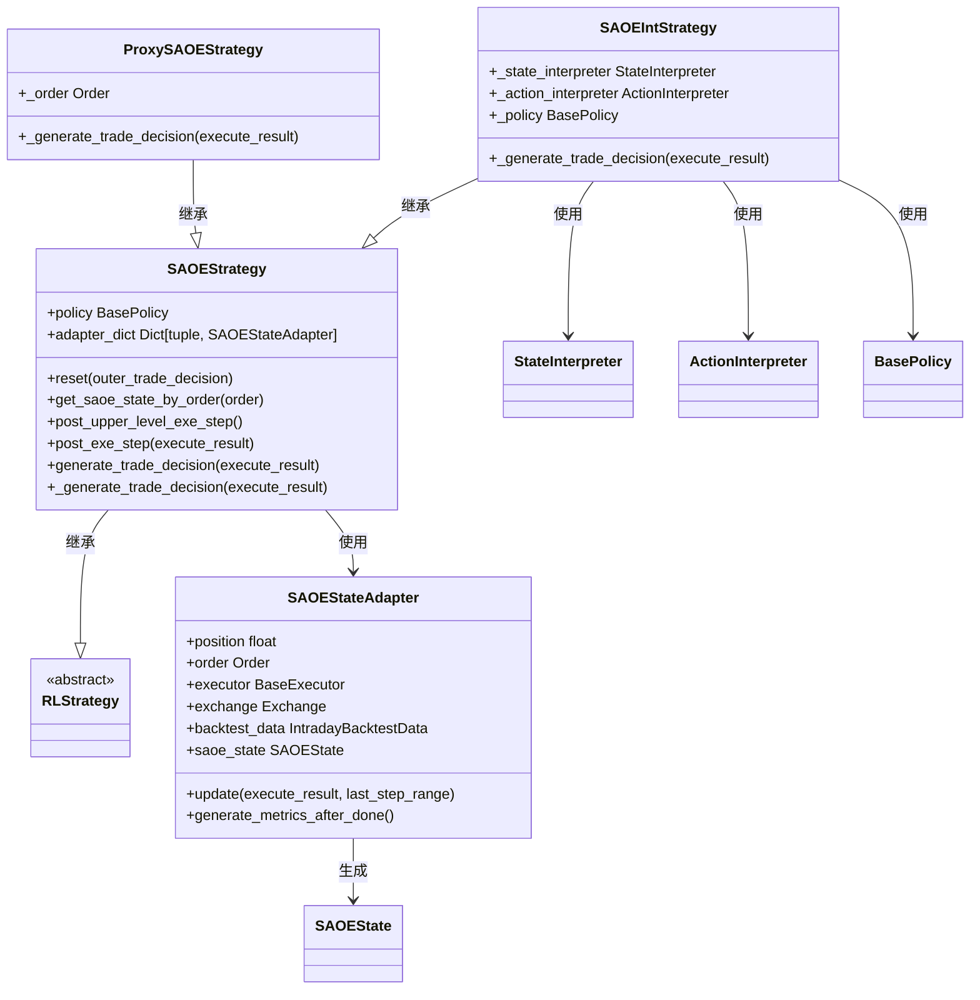
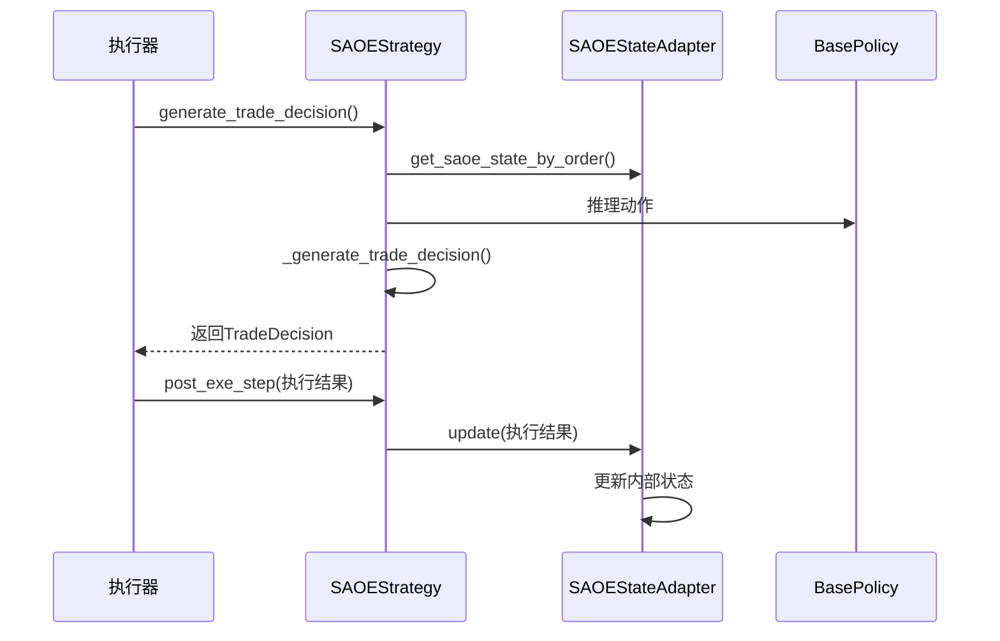
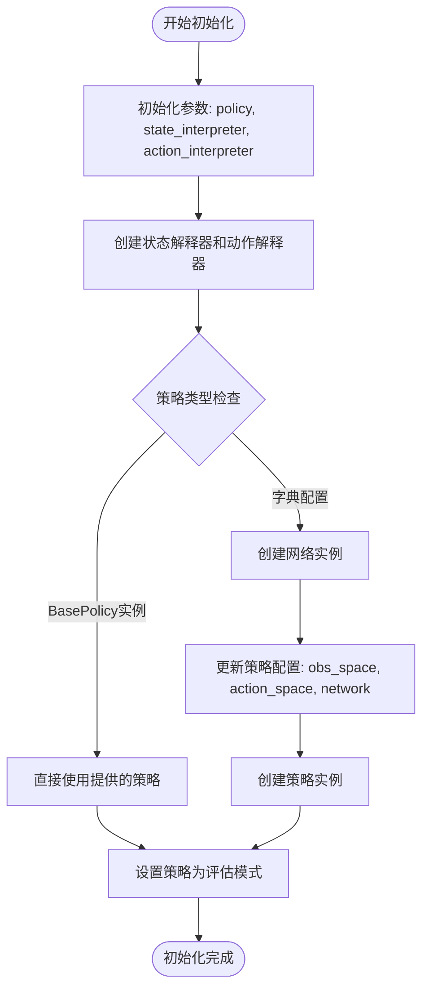
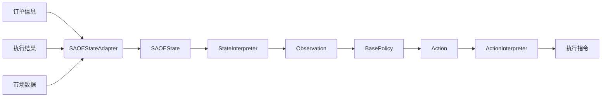
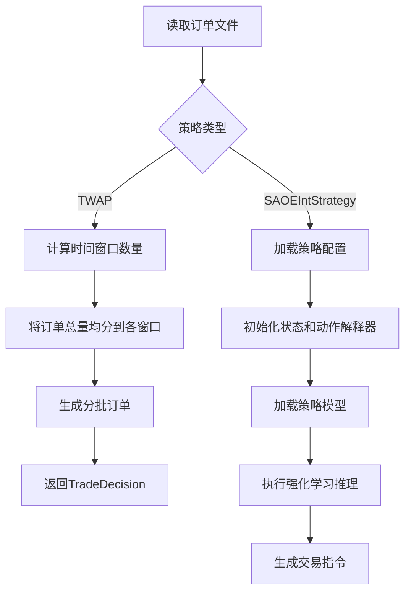
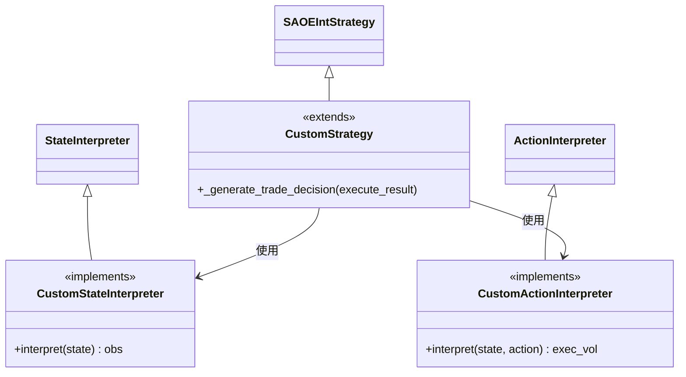
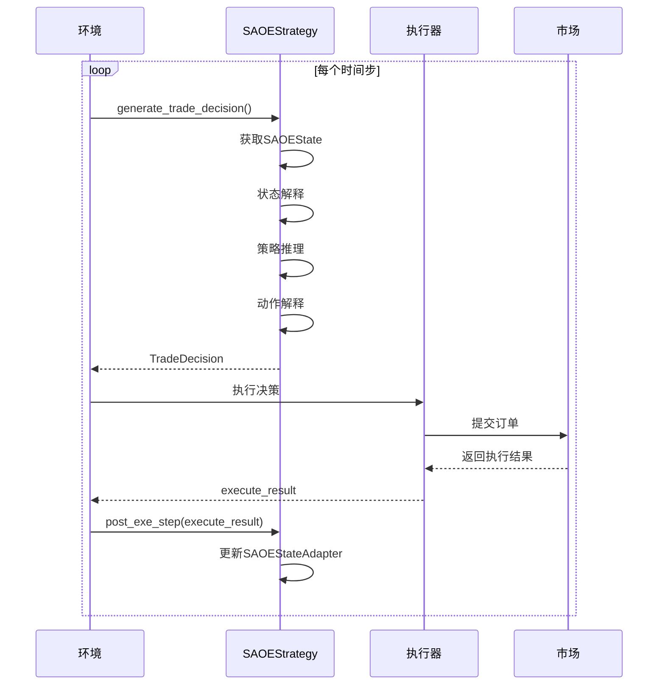
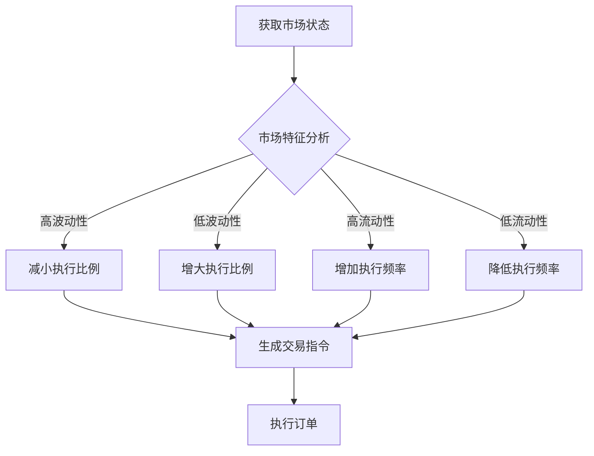
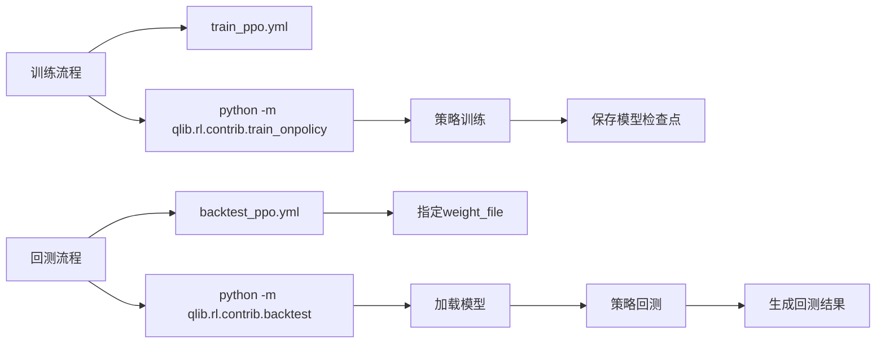

# 订单执行策略

<cite>
**本文档中引用的文件**  
- [strategy.py](file://qlib/rl/order_execution/strategy.py)
- [state.py](file://qlib/rl/order_execution/state.py)
- [utils.py](file://qlib/rl/order_execution/utils.py)
- [backtest_twap.yml](file://examples/rl_order_execution/exp_configs/backtest_twap.yml)
- [train_ppo.yml](file://examples/rl_order_execution/exp_configs/train_ppo.yml)
- [train_opds.yml](file://examples/rl_order_execution/exp_configs/train_opds.yml)
- [backtest_ppo.yml](file://examples/rl_order_execution/exp_configs/backtest_ppo.yml)
- [backtest_opds.yml](file://examples/rl_order_execution/exp_configs/backtest_opds.yml)
- [README.md](file://examples/rl_order_execution/README.md)
</cite>

## 目录
1. [简介](#简介)
2. [核心组件](#核心组件)
3. [策略接口设计](#策略接口设计)
4. [策略初始化流程](#策略初始化流程)
5. [与强化学习环境的交互机制](#与强化学习环境的交互机制)
6. [基准策略配置与使用](#基准策略配置与使用)
7. [自定义策略扩展方法](#自定义策略扩展方法)
8. [模拟环境中的调用流程](#模拟环境中的调用流程)
9. [动态订单拆分逻辑调整](#动态订单拆分逻辑调整)
10. [YAML配置示例](#yaml配置示例)
11. [集成到训练或回测流程](#集成到训练或回测流程)

## 简介
Qlib提供了一套完整的订单执行策略框架，支持基于强化学习的智能交易决策。该框架允许用户定义和实现多种订单执行策略，包括时间加权平均价格（TWAP）、成交量加权平均价格（VWAP）等基准策略，并可通过自定义状态解释器、动作解释器和策略类来构建更复杂的执行逻辑。本文档深入解析`strategy.py`中定义的核心策略类，阐述其设计原理、初始化流程、与环境的交互方式以及如何通过YAML配置文件进行策略部署。

**Section sources**
- [README.md](file://examples/rl_order_execution/README.md#L1-L101)

## 核心组件
订单执行策略的核心由多个关键类构成，主要包括`SAOEStrategy`、`SAOEIntStrategy`、`ProxySAOEStrategy`和`SAOEStateAdapter`。这些类共同构成了一个可扩展的策略执行框架，能够处理单资产订单执行任务，并支持与强化学习环境的无缝集成。



**Diagram sources**
- [strategy.py](file://qlib/rl/order_execution/strategy.py#L200-L551)

**Section sources**
- [strategy.py](file://qlib/rl/order_execution/strategy.py#L200-L551)

## 策略接口设计
`SAOEStrategy`是所有订单执行策略的基类，继承自`RLStrategy`。它定义了策略与执行器之间的标准接口，包括重置策略状态、生成交易决策、处理执行结果等方法。策略通过`generate_trade_decision`方法在每个时间步生成新的交易指令，并通过`post_exe_step`方法接收上一步的执行结果以更新内部状态。



**Diagram sources**
- [strategy.py](file://qlib/rl/order_execution/strategy.py#L200-L551)

**Section sources**
- [strategy.py](file://qlib/rl/order_execution/strategy.py#L200-L551)

## 策略初始化流程
策略的初始化通过`__init__`方法完成，接收策略所需的核心组件，如强化学习策略实例、外部交易决策、层级基础设施等。对于`SAOEIntStrategy`，还需传入状态解释器和动作解释器的配置。初始化过程中会调用`init_instance_by_config`函数动态创建相应的解释器和策略实例，并设置为评估模式。



**Diagram sources**
- [strategy.py](file://qlib/rl/order_execution/strategy.py#L350-L450)

**Section sources**
- [strategy.py](file://qlib/rl/order_execution/strategy.py#L350-L450)

## 与强化学习环境的交互机制
策略通过状态适配器（`SAOEStateAdapter`）与强化学习环境进行交互。适配器负责维护订单执行的当前状态，包括剩余仓位、历史执行记录、市场行情数据等。在每个时间步，策略从适配器获取当前状态，经过状态解释器转换为观测向量，输入到策略网络中生成动作，再通过动作解释器将动作转换为具体的交易指令。



**Diagram sources**
- [strategy.py](file://qlib/rl/order_execution/strategy.py#L200-L551)
- [state.py](file://qlib/rl/order_execution/state.py#L1-L102)

**Section sources**
- [strategy.py](file://qlib/rl/order_execution/strategy.py#L200-L551)
- [state.py](file://qlib/rl/order_execution/state.py#L1-L102)

## 基准策略配置与使用
Qlib提供了多种基准策略，如TWAP策略，可通过简单的YAML配置文件直接使用。例如，在`backtest_twap.yml`中，通过指定`class: TWAPStrategy`和`module_path: qlib.contrib.strategy.rule_strategy`即可启用TWAP策略进行回测。该策略将订单均匀分配到每个时间窗口，实现时间加权平均价格执行。



**Diagram sources**
- [backtest_twap.yml](file://examples/rl_order_execution/exp_configs/backtest_twap.yml#L1-L22)
- [strategy.py](file://qlib/rl/order_execution/strategy.py#L200-L551)

**Section sources**
- [backtest_twap.yml](file://examples/rl_order_execution/exp_configs/backtest_twap.yml#L1-L22)
- [README.md](file://examples/rl_order_execution/README.md#L1-L101)

## 自定义策略扩展方法
用户可以通过继承`SAOEStrategy`或`SAOEIntStrategy`来实现自定义策略。对于`SAOEIntStrategy`，可通过替换状态解释器和动作解释器来改变策略的行为。例如，使用`FullHistoryStateInterpreter`获取完整历史行情数据作为状态输入，或使用`CategoricalActionInterpreter`将动作空间离散化为有限个执行比例选项。



**Diagram sources**
- [strategy.py](file://qlib/rl/order_execution/strategy.py#L350-L551)
- [interpreter.py](file://qlib/rl/order_execution/interpreter.py)

**Section sources**
- [strategy.py](file://qlib/rl/order_execution/strategy.py#L350-L551)

## 模拟环境中的调用流程
在模拟环境中，策略的调用流程遵循标准的强化学习循环：获取当前状态 → 策略推理 → 生成交易决策 → 执行交易 → 接收执行结果 → 更新状态。该流程在`generate_trade_decision`和`post_exe_step`方法中实现，确保策略能够在每个时间步做出合理的交易决策。



**Diagram sources**
- [strategy.py](file://qlib/rl/order_execution/strategy.py#L200-L551)
- [simulator_qlib.py](file://qlib/rl/order_execution/simulator_qlib.py)

**Section sources**
- [strategy.py](file://qlib/rl/order_execution/strategy.py#L200-L551)

## 动态订单拆分逻辑调整
策略能够根据市场状态动态调整订单拆分逻辑。通过状态解释器获取市场行情、交易量、价格趋势等信息，策略网络可以学习在不同市场条件下最优的执行比例。例如，在高波动性时段减少单笔交易量，在流动性充足时段加大执行力度，从而最小化市场冲击成本和机会成本。



**Diagram sources**
- [state.py](file://qlib/rl/order_execution/state.py#L1-L102)
- [strategy.py](file://qlib/rl/order_execution/strategy.py#L200-L551)

**Section sources**
- [state.py](file://qlib/rl/order_execution/state.py#L1-L102)
- [strategy.py](file://qlib/rl/order_execution/strategy.py#L200-L551)

## YAML配置示例
以下是一个PPO策略的回测配置示例，展示了如何通过YAML文件定义策略参数：

```yaml
strategies:
  1day:
    class: SAOEIntStrategy
    kwargs:
      data_granularity: 5
      action_interpreter:
        class: CategoricalActionInterpreter
        kwargs:
          max_step: 8
          values: 4
        module_path: qlib.rl.order_execution.interpreter
      state_interpreter:
        class: FullHistoryStateInterpreter
        kwargs:
          data_dim: 5
          data_ticks: 48
          max_step: 8
          processed_data_provider:
            class: HandlerProcessedDataProvider
            kwargs:
              data_dir: ./data/pickle/
              feature_columns_today: ["$high", "$low", "$open", "$close", "$volume"]
              feature_columns_yesterday: ["$high_1", "$low_1", "$open_1", "$close_1", "$volume_1"]
            module_path: qlib.rl.data.native
        module_path: qlib.rl.order_execution.interpreter
      policy:
        class: PPO
        kwargs:
          lr: 0.0001
          weight_file: outputs/ppo/checkpoints/latest.pth
        module_path: qlib.rl.order_execution.policy
    module_path: qlib.rl.order_execution.strategy
```

**Section sources**
- [backtest_ppo.yml](file://examples/rl_order_execution/exp_configs/backtest_ppo.yml#L1-L54)

## 集成到训练或回测流程
订单执行策略可无缝集成到Qlib的训练和回测流程中。在训练阶段，使用`train_onpolicy`脚本配合训练配置文件（如`train_ppo.yml`）进行模型训练；在回测阶段，使用`backtest`脚本配合回测配置文件（如`backtest_ppo.yml`）进行策略验证。配置文件中通过`strategies`字段指定使用的策略及其参数。



**Diagram sources**
- [train_ppo.yml](file://examples/rl_order_execution/exp_configs/train_ppo.yml#L1-L68)
- [backtest_ppo.yml](file://examples/rl_order_execution/exp_configs/backtest_ppo.yml#L1-L54)
- [README.md](file://examples/rl_order_execution/README.md#L1-L101)

**Section sources**
- [train_ppo.yml](file://examples/rl_order_execution/exp_configs/train_ppo.yml#L1-L68)
- [backtest_ppo.yml](file://examples/rl_order_execution/exp_configs/backtest_ppo.yml#L1-L54)
- [README.md](file://examples/rl_order_execution/README.md#L1-L101)