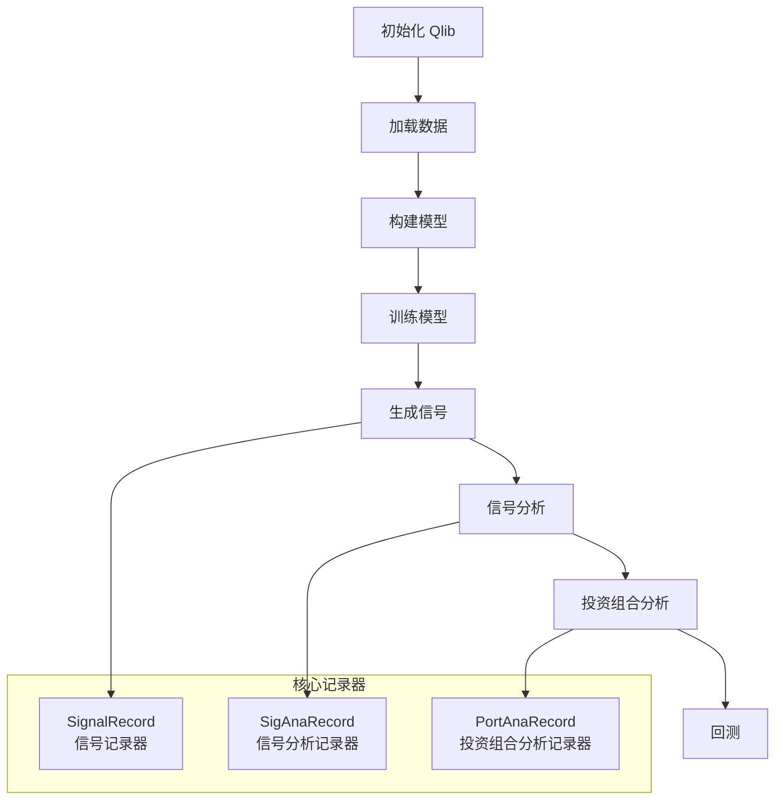

# Qlib 快速入门指南

<cite>
**本文档中引用的文件**
- [README.md](file://README.md)
- [examples/workflow_by_code.py](file://examples/workflow_by_code.py)
- [examples/benchmarks/LightGBM/workflow_config_lightgbm_Alpha158.yaml](file://examples/benchmarks/LightGBM/workflow_config_lightgbm_Alpha158.yaml)
- [qlib/__init__.py](file://qlib/__init__.py)
- [qlib/data/__init__.py](file://qlib/data/__init__.py)
- [qlib/tests/data.py](file://qlib/tests/data.py)
- [qlib/workflow/__init__.py](file://qlib/workflow/__init__.py)
- [examples/highfreq/workflow.py](file://examples/highfreq/workflow.py)
- [scripts/get_data.py](file://scripts/get_data.py)
</cite>

## 目录
1. [简介](#简介)
2. [系统要求](#系统要求)
3. [安装步骤](#安装步骤)
4. [数据准备](#数据准备)
5. [第一个示例：自动量化研究工作流](#第一个示例自动量化研究工作流)
6. [构建自定义量化研究工作流](#构建自定义量化研究工作流)
7. [核心组件详解](#核心组件详解)
8. [高级功能](#高级功能)
9. [故障排除](#故障排除)
10. [总结](#总结)

## 简介

Qlib 是微软开源的 AI 驱动的量化投资平台，旨在通过人工智能技术实现量化投资的潜力，赋能研究并创造价值。Qlib 支持多种机器学习建模范式，包括监督学习、市场动态建模和强化学习。

### 主要特性

- **完整的机器学习管道**：涵盖数据处理、模型训练、回测和评估
- **全量化投资链路**：从因子挖掘到投资组合优化再到订单执行
- **多样化模型支持**：支持多种深度学习模型和传统机器学习算法
- **模块化设计**：松耦合组件，可独立使用或组合使用

## 系统要求

Qlib 支持以下 Python 版本：
- Python 3.8 ✅
- Python 3.9 ✅
- Python 3.10 ✅
- Python 3.11 ✅
- Python 3.12 ✅

**注意**：建议使用 Conda 管理 Python 环境，某些情况下在非 Conda 环境中安装可能会导致缺少头文件的问题。

## 安装步骤

### 方法一：使用 pip 安装

```bash
pip install pyqlib
```

这是最简单的安装方式，会安装最新稳定版本的 Qlib。

### 方法二：从源码安装（推荐用于开发）

1. 安装依赖项：
```bash
pip install numpy
pip install --upgrade cython
```

2. 克隆仓库并安装：
```bash
git clone https://github.com/microsoft/qlib.git && cd qlib
pip install .  # 推荐使用 `pip install -e .[dev]` 进行开发
```

**提示**：如果在环境中安装 Qlib 或运行示例时遇到问题，可以参考 CI 工作流来排查问题。

**Mac 用户注意事项**：如果您使用的是 Mac M1 芯片，可能在为 LightGBM 构建 wheel 时遇到问题，这是因为缺少 OpenMP 依赖。解决方法是先安装 openmp：`brew install libomp`，然后运行 `pip install .`。

## 数据准备

由于更严格的数据安全政策，官方数据集暂时不可用。您可以尝试社区提供的数据源。

### 获取数据的方法

#### 方法一：使用模块获取数据

```bash
# 获取日频数据
python -m qlib.cli.data qlib_data --target_dir ~/.qlib/qlib_data/cn_data --region cn

# 获取分钟级数据
python -m qlib.cli.data qlib_data --target_dir ~/.qlib/qlib_data/cn_data_1min --region cn --interval 1min
```

#### 方法二：从源码获取数据

```bash
# 获取日频数据
python scripts/get_data.py qlib_data --target_dir ~/.qlib/qlib_data/cn_data --region cn

# 获取分钟级数据
python scripts/get_data.py qlib_data --target_dir ~/.qlib/qlib_data/cn_data_1min --region cn --interval 1min
```

### 数据健康检查

为了确保数据质量，Qlib 提供了数据健康检查工具：

```bash
python scripts/check_data_health.py check_data --qlib_dir ~/.qlib/qlib_data/cn_data
```

您还可以添加参数来调整测试结果：

```bash
python scripts/check_data_health.py check_data --qlib_dir ~/.qlib/qlib_data/cn_data --missing_data_num 30055 --large_step_threshold_volume 94485 --large_step_threshold_price 20
```

### 初始化 Qlib

在使用 Qlib 之前，需要进行初始化：

```python
import qlib
from qlib.constant import REG_CN

# 初始化 Qlib
provider_uri = "~/.qlib/qlib_data/cn_data"
qlib.init(provider_uri=provider_uri, region=REG_CN)
```

## 第一个示例：自动量化研究工作流

Qlib 提供了一个名为 `qrun` 的工具，可以自动运行整个工作流程，包括构建数据集、训练模型、回测和评估。

### 步骤 1：运行自动工作流

```bash
cd examples  # 避免在包含 `qlib` 的目录下运行程序
qrun benchmarks/LightGBM/workflow_config_lightgbm_Alpha158.yaml
```

### 步骤 2：查看结果

运行成功后，您将看到类似以下的结果：

```
'The following are analysis results of the excess return without cost.'
                       risk
mean               0.000708
std                0.005626
annualized_return  0.178316
information_ratio  1.996555
max_drawdown      -0.081806
'The following are analysis results of the excess return with cost.'
                       risk
mean               0.000512
std                0.005626
annualized_return  0.128982
information_ratio  1.444287
max_drawdown      -0.091078
```

### 步骤 3：图形化报告分析

1. 安装必要的依赖：
```bash
python -m pip install .[analysis]
```

2. 使用 Jupyter Notebook 查看图形化报告：
```bash
jupyter notebook examples/workflow_by_code.ipynb
```

### 图形化报告示例

- **预测信号分析**
  - 分组累计收益
  - 收益分布
  - 信息系数 (IC)
  - 自相关性分析

- **投资组合分析**
  - 回测收益
  - 风险分析
  - 收益归因

## 构建自定义量化研究工作流

对于需要更灵活控制的研究者，Qlib 提供了模块化的接口来构建自己的工作流程。

### 基本工作流程示例

以下是来自 `examples/workflow_by_code.py` 的完整示例：

```python
import qlib
from qlib.constant import REG_CN
from qlib.utils import init_instance_by_config, flatten_dict
from qlib.workflow import R
from qlib.workflow.record_temp import SignalRecord, PortAnaRecord, SigAnaRecord
from qlib.tests.data import GetData
from qlib.tests.config import CSI300_BENCH, CSI300_GBDT_TASK

if __name__ == "__main__":
    # 使用默认数据
    provider_uri = "~/.qlib/qlib_data/cn_data"
    GetData().qlib_data(target_dir=provider_uri, region=REG_CN, exists_skip=True)
    qlib.init(provider_uri=provider_uri, region=REG_CN)

    # 初始化模型和数据集
    model = init_instance_by_config(CSI300_GBDT_TASK["model"])
    dataset = init_instance_by_config(CSI300_GBDT_TASK["dataset"])

    # 配置投资组合分析
    port_analysis_config = {
        "executor": {
            "class": "SimulatorExecutor",
            "module_path": "qlib.backtest.executor",
            "kwargs": {
                "time_per_step": "day",
                "generate_portfolio_metrics": True,
            },
        },
        "strategy": {
            "class": "TopkDropoutStrategy",
            "module_path": "qlib.contrib.strategy.signal_strategy",
            "kwargs": {
                "signal": (model, dataset),
                "topk": 50,
                "n_drop": 5,
            },
        },
        "backtest": {
            "start_time": "2017-01-01",
            "end_time": "2020-08-01",
            "account": 100000000,
            "benchmark": CSI300_BENCH,
            "exchange_kwargs": {
                "freq": "day",
                "limit_threshold": 0.095,
                "deal_price": "close",
                "open_cost": 0.0005,
                "close_cost": 0.0015,
                "min_cost": 5,
            },
        },
    }

    # 开始实验
    with R.start(experiment_name="workflow"):
        R.log_params(**flatten_dict(CSI300_GBDT_TASK))
        model.fit(dataset)
        R.save_objects(**{"params.pkl": model})

        # 生成信号
        recorder = R.get_recorder()
        sr = SignalRecord(model, dataset, recorder)
        sr.generate()

        # 信号分析
        sar = SigAnaRecord(recorder)
        sar.generate()

        # 回测
        par = PortAnaRecord(recorder, port_analysis_config, "day")
        par.generate()
```

### 核心组件说明



**图表来源**
- [examples/workflow_by_code.py](file://examples/workflow_by_code.py#L1-L86)

## 核心组件详解

### 1. Qlib 初始化

```python
def init(default_conf="client", **kwargs):
    """
    参数：
    - default_conf: str，默认值为 client。可接受的值：client/server。
    - clear_mem_cache: str，是否清除内存缓存，默认为 True。
    - skip_if_reg: bool，是否跳过注册，默认为 True。
    """
```

### 2. 数据访问接口

Qlib 提供了统一的数据访问接口 `D`：

```python
from qlib.data import D

# 加载交易日历
calendar = D.calendar(start_time='2010-01-01', end_time='2017-12-31', freq='day')

# 解析市场名称为股票池配置
instruments = D.instruments('csi500')

# 加载特定仪器的特征
fields = ['$close', '$volume', 'Ref($close, 1)', 'Mean($close, 3)', '$high-$low']
features = D.features(['SH600000'], fields, start_time='2010-01-01', end_time='2017-12-31', freq='day')
```

### 3. 工作流记录器

```python
from qlib.workflow import R

# 开始实验
with R.start(experiment_name="my_experiment"):
    # 记录参数
    R.log_params(**params)
    
    # 保存对象
    R.save_objects(**{"model.pkl": trained_model})
    
    # 获取当前记录器
    recorder = R.get_recorder()
```

### 4. 模型和数据集配置

Qlib 支持通过配置文件或代码两种方式定义模型和数据集：

```yaml
# YAML 配置示例
task:
    model:
        class: LGBModel
        module_path: qlib.contrib.model.gbdt
        kwargs:
            loss: mse
            learning_rate: 0.2
            num_leaves: 210
    dataset:
        class: DatasetH
        module_path: qlib.data.dataset
        kwargs:
            handler:
                class: Alpha158
                module_path: qlib.contrib.data.handler
                kwargs:
                    start_time: 2008-01-01
                    end_time: 2020-08-01
                    instruments: csi300
```

## 高级功能

### 高频交易示例

Qlib 支持高频数据处理和交易：

```python
# 初始化高频数据
DATA_HANDLER_CONFIG0 = {
    "start_time": "2020-09-15 00:00:00",
    "end_time": "2021-01-18 16:00:00",
    "fit_start_time": "2020-09-15 00:00:00",
    "fit_end_time": "2020-11-30 16:00:00",
    "instruments": "all",
    "infer_processors": [{"class": "HighFreqNorm", "module_path": "highfreq_processor"}],
}
```

### 强化学习框架

Qlib 内置了强化学习框架，支持连续决策建模：

```python
# 强化学习配置示例
{
    "class": "PPOAgent",
    "module_path": "qlib.rl.agent",
    "kwargs": {
        "env": {
            "class": "OrderExecutionEnv",
            "module_path": "qlib.rl.order_execution",
            "kwargs": {
                "initial_cash": 1000000,
                "cost": 0.001
            }
        }
    }
}
```

### 在线服务

Qlib 支持在线服务和自动模型滚动更新：

```python
# 在线管理示例
from qlib.contrib.online.manager import OnlineManager

manager = OnlineManager()
manager.update_prediction()
```

## 故障排除

### 常见问题及解决方案

#### 1. 数据下载失败

**问题**：无法下载数据或数据不完整
**解决方案**：
```bash
# 检查数据完整性
python scripts/check_data_health.py check_data --qlib_dir ~/.qlib/qlib_data/cn_data

# 手动重新下载数据
python scripts/get_data.py qlib_data --target_dir ~/.qlib/qlib_data/cn_data --region cn
```

#### 2. 内存不足

**问题**：处理大数据集时内存不足
**解决方案**：
```python
# 启用数据缓存
qlib.init(provider_uri=provider_uri, region=REG_CN, mem_cache=True)

# 清除内存缓存
from qlib.data.cache import H
H.clear()
```

#### 3. 模型训练失败

**问题**：模型训练过程中出现错误
**解决方案**：
```python
# 检查数据格式
dataset = init_instance_by_config(task["dataset"])
example_df = dataset.prepare("train")
print(example_df.head())

# 调试模式运行
python -m pdb qlib/cli/run.py examples/benchmarks/LightGBM/workflow_config_lightgbm_Alpha158.yaml
```

#### 4. 性能问题

**问题**：数据处理速度慢
**解决方案**：
- 启用表达式缓存
- 使用多进程处理
- 优化数据存储格式

```python
# 启用表达式缓存
SPEC_CONF = {"expression_cache": "DiskExpressionCache"}
```

### 调试技巧

1. **启用详细日志**：
```python
import logging
logging.getLogger("qlib").setLevel(logging.DEBUG)
```

2. **检查数据形状**：
```python
print(dataset.prepare("train").shape)
print(dataset.prepare("valid").shape)
```

3. **验证模型输出**：
```python
pred = model.predict(dataset.prepare("test"))
print(pred.describe())
```

## 总结

Qlib 是一个功能强大的 AI 驱动量化投资平台，提供了从数据准备到模型部署的完整解决方案。通过本快速入门指南，您应该能够：

1. **成功安装 Qlib**：根据您的需求选择合适的安装方式
2. **准备数据**：下载和验证所需的数据集
3. **运行第一个示例**：使用 `qrun` 工具体验完整的量化研究工作流
4. **构建自定义工作流**：利用 Qlib 的模块化设计创建适合您需求的研究流程
5. **理解核心概念**：掌握 Qlib 的主要组件和它们之间的关系

### 下一步建议

- **深入学习**：阅读 Qlib 的官方文档以了解更多高级功能
- **实践项目**：尝试使用不同的模型和数据集进行实验
- **社区参与**：加入 Qlib 社区，与其他用户交流经验
- **贡献代码**：如果您发现改进的地方，欢迎提交 PR

Qlib 的持续发展使其成为量化投资领域的重要工具，希望这个快速入门指南能帮助您快速上手并充分利用其强大功能。