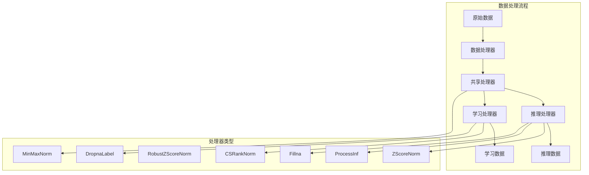
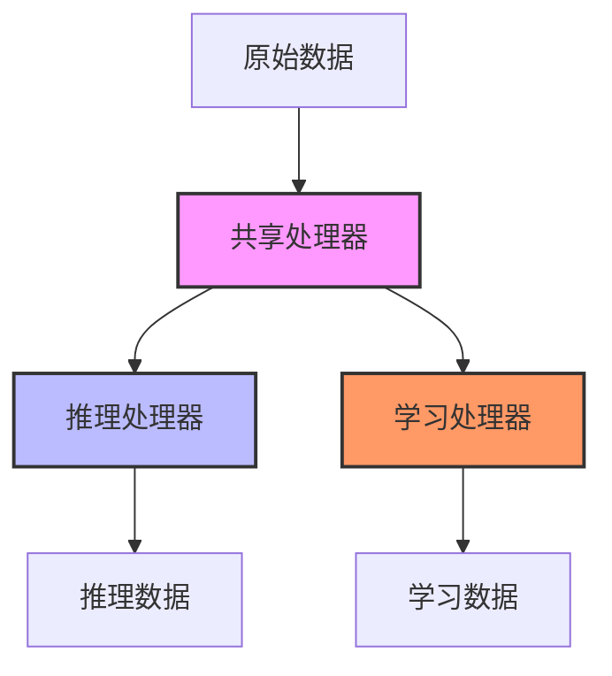
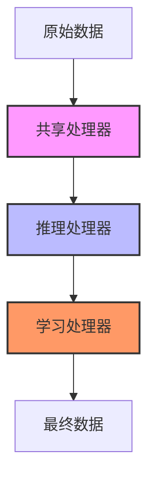
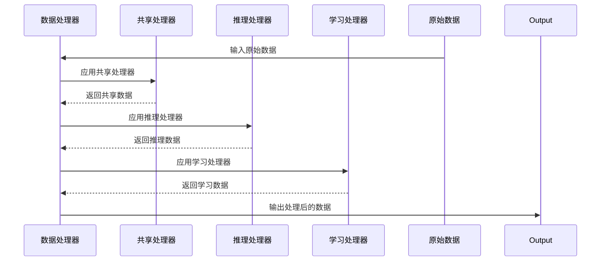

# 处理器链

<cite>
**本文档中引用的文件**   
- [processor.py](file://qlib/data/dataset/processor.py)
- [handler.py](file://qlib/data/dataset/handler.py)
- [workflow_config_lightgbm_Alpha360.yaml](file://examples/benchmarks/LightGBM/workflow_config_lightgbm_Alpha360.yaml)
- [workflow_config_lightgbm_Alpha158.yaml](file://examples/benchmarks/LightGBM/workflow_config_lightgbm_Alpha158.yaml)
- [Alpha158DL.py](file://qlib/contrib/data/loader.py)
- [Alpha158.py](file://qlib/contrib/data/handler.py)
- [ops.py](file://qlib/data/ops.py)
</cite>

## 目录
1. [引言](#引言)
2. [处理器链架构](#处理器链架构)
3. [处理器模式详解](#处理器模式详解)
4. [核心处理器实现](#核心处理器实现)
5. [特征工程流水线构建](#特征工程流水线构建)
6. [配置文件示例](#配置文件示例)
7. [常见问题诊断](#常见问题诊断)
8. [结论](#结论)

## 引言
本文档深入探讨QLib框架中的处理器链技术，系统性地介绍特征工程流水线的构建原理与实现机制。处理器链是QLib数据预处理的核心组件，通过一系列处理器的有序组合，实现对原始金融数据的标准化、归一化和特征提取。本文将详细解析PTYPE_I（独立）和PTYPE_A（追加）两种处理模式的区别，深入剖析常用操作符的数学原理，并提供完整的配置示例和问题诊断方案。

## 处理器链架构



**图示来源**
- [handler.py](file://qlib/data/dataset/handler.py#L100-L300)
- [processor.py](file://qlib/data/dataset/processor.py#L100-L200)

**本节来源**
- [handler.py](file://qlib/data/dataset/handler.py#L1-L100)
- [processor.py](file://qlib/data/dataset/processor.py#L1-L50)

## 处理器模式详解

QLib处理器链支持两种核心处理模式：PTYPE_I（独立模式）和PTYPE_A（追加模式）。这两种模式决定了处理器在推理和学习阶段的数据流路径。

### 独立模式 (PTYPE_I)

在独立模式下，推理处理器和学习处理器分别独立处理共享处理器的输出。这种模式适用于需要完全隔离推理和学习数据处理流程的场景。



**图示来源**
- [handler.py](file://qlib/data/dataset/handler.py#L400-L450)

### 追加模式 (PTYPE_A)

在追加模式下，学习处理器的输入是推理处理器的输出。这种模式实现了数据处理的流水线式传递，确保学习阶段的数据处理包含了推理阶段的所有转换。



**图示来源**
- [handler.py](file://qlib/data/dataset/handler.py#L450-L500)

**本节来源**
- [handler.py](file://qlib/data/dataset/handler.py#L350-L500)

## 核心处理器实现

### Rolling处理器

Rolling处理器实现了滚动窗口统计功能，通过在指定时间窗口内计算各种统计量来提取时间序列特征。这些特征包括移动平均(MA)、标准差(STD)、价格变化率(ROC)等。

```python
# Rolling特征配置示例
config = {
    "rolling": {
        "windows": [5, 10, 20, 30, 60],
        "include": ["ROC", "MA", "STD"],
        "exclude": ["RANK"]
    }
}
```

**本节来源**
- [loader.py](file://qlib/contrib/data/loader.py#L150-L300)
- [ops.py](file://qlib/data/ops.py#L500-L1000)

### MinMaxNorm处理器

MinMaxNorm处理器实现最小-最大归一化，将特征值缩放到[0,1]区间。该处理器在拟合阶段计算指定时间范围内的最小值和最大值，然后在处理阶段应用归一化公式。

数学原理：
```
normalized_value = (x - min_val) / (max_val - min_val)
```

**本节来源**
- [processor.py](file://qlib/data/dataset/processor.py#L200-L250)

### ZScoreNorm处理器

ZScoreNorm处理器实现Z-score标准化，将特征值转换为均值为0、标准差为1的分布。该处理器在拟合阶段计算指定时间范围内的均值和标准差。

数学原理：
```
standardized_value = (x - mean_train) / std_train
```

**本节来源**
- [processor.py](file://qlib/data/dataset/processor.py#L250-L300)

### RobustZScoreNorm处理器

RobustZScoreNorm处理器实现鲁棒Z-score标准化，使用中位数和绝对中位差(MAD)代替均值和标准差，对异常值更具鲁棒性。

数学原理：
```
median_value = median(x)
mad_value = median(|x - median_value|)
std_robust = mad_value * 1.4826
robust_standardized_value = (x - median_value) / std_robust
```

**本节来源**
- [processor.py](file://qlib/data/dataset/processor.py#L300-L350)

## 特征工程流水线构建

通过add.processor()方法可以构建复杂的特征工程流水线。每个处理器都继承自Processor基类，实现了fit和__call__方法。

### 处理器链构建示例

```python
# 创建处理器链
processors = [
    {"class": "ProcessInf", "kwargs": {}},
    {"class": "ZScoreNorm", "kwargs": {"fields_group": "feature"}},
    {"class": "Fillna", "kwargs": {"fill_value": 0}},
    {"class": "CSRankNorm", "kwargs": {"fields_group": "feature"}}
]
```

### 处理器执行流程



**图示来源**
- [handler.py](file://qlib/data/dataset/handler.py#L500-L600)
- [processor.py](file://qlib/data/dataset/processor.py#L1-L50)

**本节来源**
- [handler.py](file://qlib/data/dataset/handler.py#L500-L700)
- [processor.py](file://qlib/data/dataset/processor.py#L1-L50)

## 配置文件示例

### 多阶段处理器链配置

```yaml
data_handler_config: &data_handler_config
    start_time: 2008-01-01
    end_time: 2020-08-01
    fit_start_time: 2008-01-01
    fit_end_time: 2014-12-31
    instruments: *market
    infer_processors: []
    learn_processors:
        - class: DropnaLabel
        - class: CSRankNorm
          kwargs:
              fields_group: label
```

### 滚动窗口与标准化组合应用

```yaml
task:
    dataset:
        class: DatasetH
        module_path: qlib.data.dataset
        kwargs:
            handler:
                class: Alpha158
                module_path: qlib.contrib.data.handler
                kwargs: 
                    infer_processors:
                        - class: ProcessInf
                        - class: ZScoreNorm
                        - class: Fillna
                    learn_processors:
                        - class: DropnaLabel
                        - class: CSZScoreNorm
                          kwargs:
                              fields_group: label
                    fit_start_time: 2008-01-01
                    fit_end_time: 2014-12-31
```

**本节来源**
- [workflow_config_lightgbm_Alpha360.yaml](file://examples/benchmarks/LightGBM/workflow_config_lightgbm_Alpha360.yaml#L1-L80)
- [workflow_config_lightgbm_Alpha158.yaml](file://examples/benchmarks/LightGBM/workflow_config_lightgbm_Alpha158.yaml#L1-L70)

## 常见问题诊断

### 处理器顺序错误导致的数据泄露

**问题描述**：当标准化处理器的拟合时间范围包含了测试数据时，会导致未来信息泄露。

**解决方案**：
1. 确保fit_end_time不包含任何测试数据信息
2. 使用独立的训练时间段进行拟合
3. 在配置文件中明确指定fit_start_time和fit_end_time

```python
# 正确的配置示例
MinMax