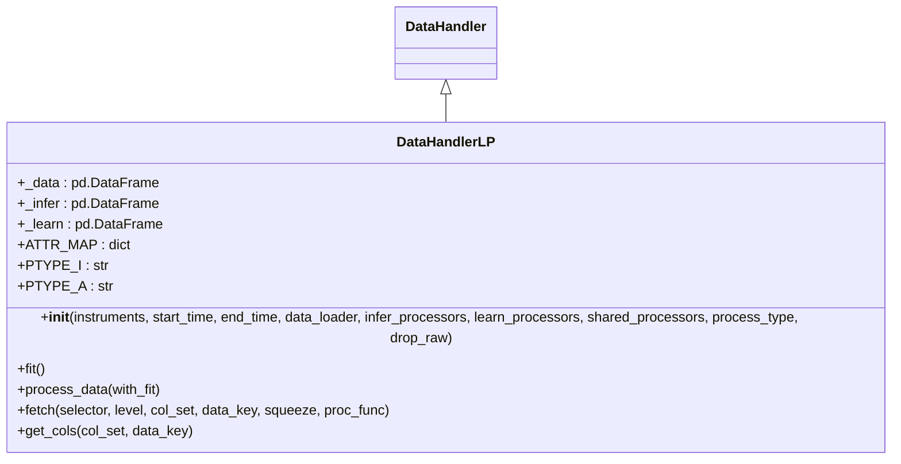
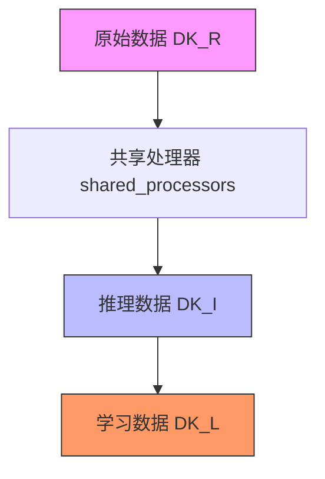
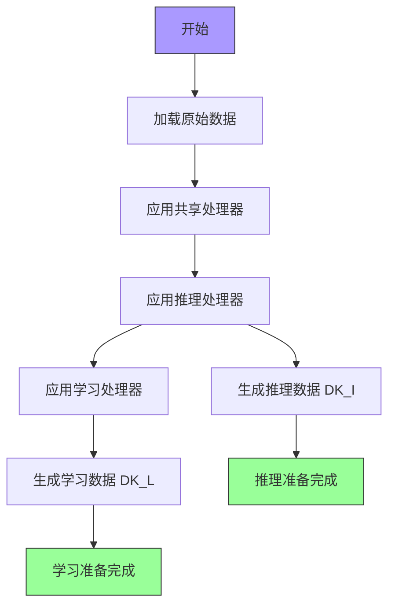
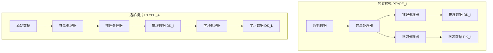
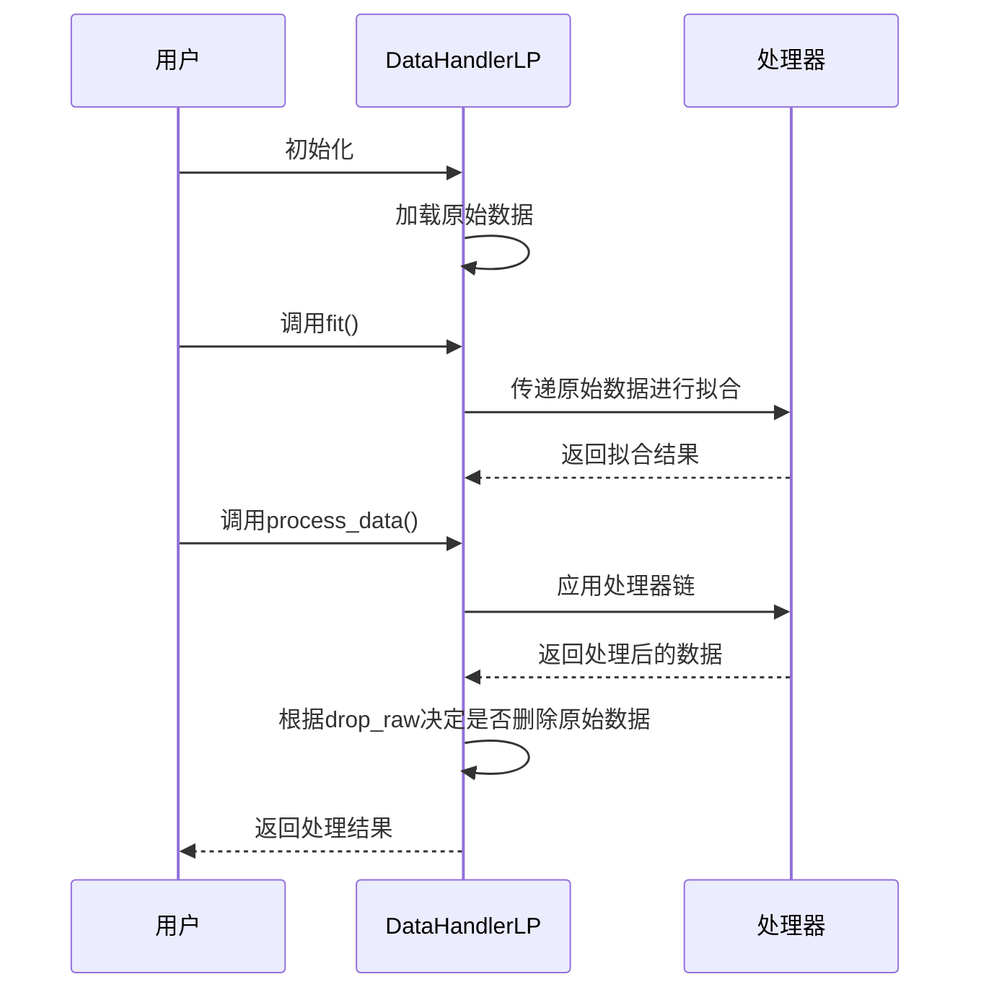

# 数据处理

<cite>
**本文档中引用的文件**  
- [handler.py](file://qlib/data/dataset/handler.py)
- [processor.py](file://qlib/data/dataset/processor.py)
- [rolling_handler.py](file://examples/rolling_process_data/rolling_handler.py)
- [highfreq_handler.py](file://qlib/contrib/data/highfreq_handler.py)
- [test_handler.py](file://tests/data_mid_layer_tests/test_handler.py)
- [test_handler_storage.py](file://tests/data_mid_layer_tests/test_handler_storage.py)
</cite>

## 目录
1. [简介](#简介)
2. [DataHandlerLP设计概述](#datahandlerlp设计概述)
3. [数据流生成机制](#数据流生成机制)
4. [处理器协作流程](#处理器协作流程)
5. [处理模式详解](#处理模式详解)
6. [常用操作符配置](#常用操作符配置)
7. [核心方法执行逻辑](#核心方法执行逻辑)
8. [实际配置示例](#实际配置示例)
9. [与模型训练/推理的集成](#与模型训练推理的集成)
10. [常见问题排查](#常见问题排查)

## 简介
Qlib的数据处理系统以DataHandlerLP为核心，提供了一套灵活且高效的数据预处理框架。该系统通过分离原始数据、推理数据和学习数据三个数据流，实现了针对不同场景的差异化处理。本文档详细阐述DataHandlerLP的设计原理与实现机制，重点介绍其三类处理器（shared_processors、infer_processors、learn_processors）的协作流程，以及PTYPE_I（独立）和PTYPE_A（追加）两种处理模式的区别与适用场景。

**Section sources**
- [handler.py](file://qlib/data/dataset/handler.py#L369-L406)

## DataHandlerLP设计概述
DataHandlerLP是Qlib中用于可学习处理器的数据处理器，其设计动机在于支持学习和推理阶段使用不同的处理器工作流。该处理器生成三种格式的DataFrame数据：

- **DK_R / self._data**：从加载器加载的原始数据
- **DK_I / self._infer**：为推理处理的数据
- **DK_L / self._learn**：为模型学习处理的数据

这种设计允许在不同阶段应用不同的处理逻辑，例如在学习阶段可以基于标签进行特殊处理，而在推理阶段则不需要。



**Diagram sources**
- [handler.py](file://qlib/data/dataset/handler.py#L369-L406)

**Section sources**
- [handler.py](file://qlib/data/dataset/handler.py#L369-L406)

## 数据流生成机制
DataHandlerLP通过三个数据流实现灵活的数据处理：

- **原始数据流 (DK_R)**：直接从数据加载器获取的原始数据，存储在`self._data`中
- **推理数据流 (DK_I)**：为模型推理准备的数据，存储在`self._infer`中
- **学习数据流 (DK_L)**：为模型训练准备的数据，存储在`self._learn`中

这三个数据流通过不同的处理器链进行处理，确保在不同阶段使用最适合的数据形态。



**Diagram sources**
- [handler.py](file://qlib/data/dataset/handler.py#L585-L620)

**Section sources**
- [handler.py](file://qlib/data/dataset/handler.py#L585-L620)

## 处理器协作流程
DataHandlerLP支持三类处理器的协作：

- **shared_processors**：共享处理器，在所有数据流中都应用
- **infer_processors**：推理处理器，仅在推理数据流中应用
- **learn_processors**：学习处理器，仅在学习数据流中应用

这些处理器按照特定顺序执行，形成完整的数据处理流水线。



**Diagram sources**
- [handler.py](file://qlib/data/dataset/handler.py#L585-L620)

**Section sources**
- [handler.py](file://qlib/data/dataset/handler.py#L585-L620)

## 处理模式详解
DataHandlerLP支持两种处理模式：

### PTYPE_I（独立模式）
在独立模式下，推理数据和学习数据分别独立处理：
- 推理数据：`原始数据 → shared_processors → infer_processors`
- 学习数据：`原始数据 → shared_processors → learn_processors`

### PTYPE_A（追加模式）
在追加模式下，学习数据基于推理数据继续处理：
- 推理数据：`原始数据 → shared_processors → infer_processors`
- 学习数据：`推理数据 → learn_processors`



**Diagram sources**
- [handler.py](file://qlib/data/dataset/handler.py#L585-L620)

**Section sources**
- [handler.py](file://qlib/data/dataset/handler.py#L585-L620)

## 常用操作符配置
### 滚动统计配置
滚动统计操作符用于计算时间序列的滚动窗口统计量：

```yaml
- class: Rolling
  kwargs:
    window: 20
    fields_group: feature
    method: mean
```

### 归一化配置
MinMaxNorm操作符用于将数据归一化到指定范围：

```yaml
- class: MinMaxNorm
  kwargs:
    fit_start_time: "20080101"
    fit_end_time: "20121231"
    fields_group: feature
```

**Section sources**
- [handler.py](file://qlib/data/dataset/handler.py#L585-L620)

## 核心方法执行逻辑
### fit()方法
`fit()`方法用于拟合所有处理器的参数，但不进行实际的数据处理：

```python
def fit(self):
    for proc in self.get_all_processors():
        proc.fit(self._data)
```

### process_data()方法
`process_data()`方法执行实际的数据处理流程，根据`with_fit`参数决定是否在处理前进行拟合。

### drop_raw参数
`drop_raw`参数控制是否在处理完成后删除原始数据以优化内存使用。当`drop_raw=True`时，原始数据将被删除，无法再通过`fetch(data_key=DataHandler.DK_R)`访问。



**Diagram sources**
- [handler.py](file://qlib/data/dataset/handler.py#L585-L620)

**Section sources**
- [handler.py](file://qlib/data/dataset/handler.py#L585-L620)

## 实际配置示例
以下是一个典型的DataHandlerLP配置YAML示例：

```yaml
handler:
  class: 'Alpha158'
  module_path: 'qlib.contrib.data.handler'
  kwargs:
    instruments: '@all_instruments'
    start_time: '2008-01-01'
    end_time: '2020-08-01'
    fit_start_time: '2008-01-01'
    fit_end_time: '2014-12-31'
    process_type: 'append'
    drop_raw: True
    fields_group: feature
    infer_processors:
      - class: 'RobustZScoreNorm'
        kwargs:
          fields_group: feature
          clip_outlier: true
    learn_processors:
      - class: 'Fillna'
        kwargs:
          fields_group: feature
    label:
      - | 
        Ref($close, -2) / Ref($close, -1) - 1
```

**Section sources**
- [handler.py](file://qlib/data/dataset/handler.py#L585-L620)

## 与模型训练/推理的集成
DataHandlerLP与模型训练和推理阶段紧密集成：

- **训练阶段**：使用`data_key=DataHandlerLP.DK_L`获取学习数据
- **推理阶段**：使用`data_key=DataHandlerLP.DK_I`获取推理数据

在模型实现中，通常通过DatasetH准备数据：

```python
df_train, df_valid, df_test = dataset.prepare(
    ["train", "valid", "test"],
    col_set=["feature", "label"],
    data_key=DataHandlerLP.DK_L,
)
```

**Section sources**
- [pytorch_localformer.py](file://qlib/contrib/model/pytorch_localformer.py#L156-L193)
- [pytorch_transformer.py](file://qlib/contrib/model/pytorch_transformer.py#L155-L192)

## 常见问题排查
### 处理器顺序错误
确保处理器按照正确的顺序配置，特别是当后续处理器依赖前序处理器的输出时。

### 内存溢出
- 设置`drop_raw=True`以在处理完成后删除原始数据
- 使用`process_type='append'`模式减少内存占用
- 考虑使用数据分块处理

### 无法访问原始数据
当`drop_raw=True`时，尝试访问原始数据会抛出AttributeError。如需访问原始数据，请设置`drop_raw=False`。

**Section sources**
- [handler.py](file://qlib/data/dataset/handler.py#L652-L683)
- [test_handler.py](file://tests/data_mid_layer_tests/test_handler.py#L0-L36)
- [test_handler_storage.py](file://tests/data_mid_layer_tests/test_handler_storage.py#L0-L43)