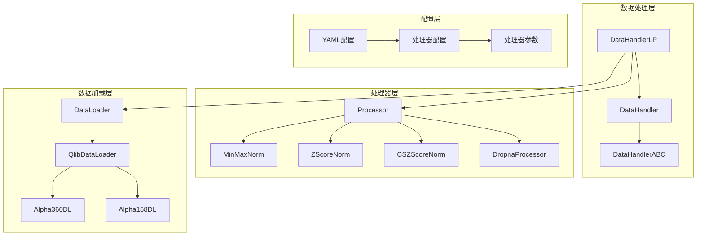
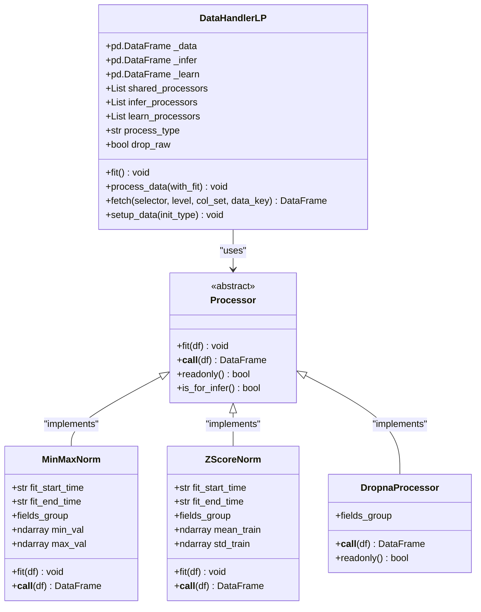
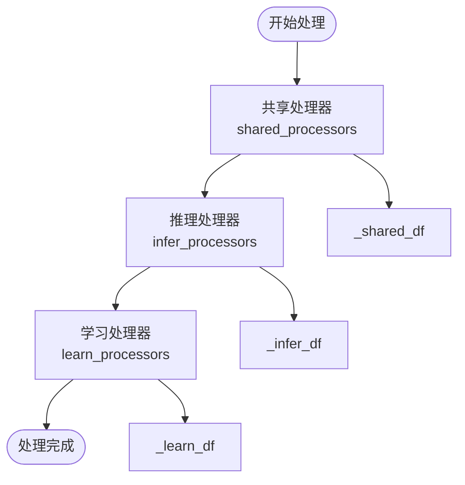
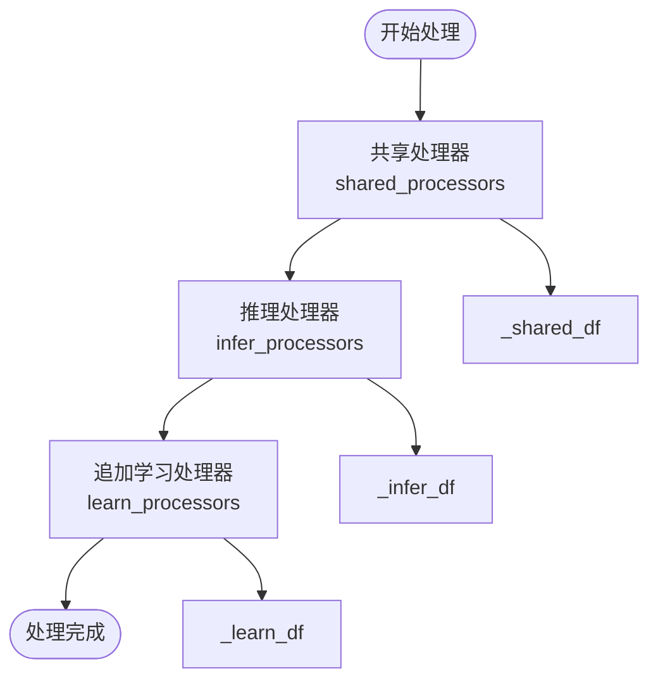
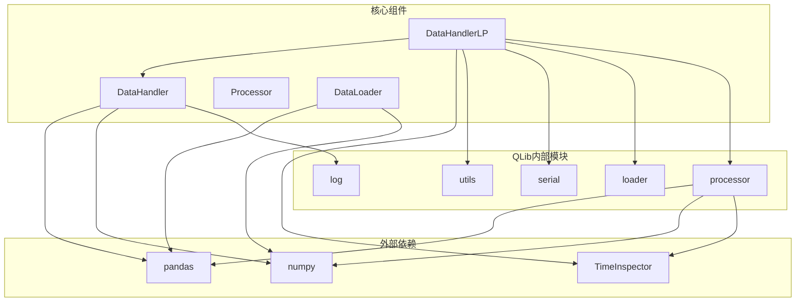

# 数据处理器

<cite>
**本文档引用的文件**
- [handler.py](file://qlib/data/dataset/handler.py)
- [processor.py](file://qlib/data/dataset/processor.py)
- [handler.py](file://qlib/contrib/data/handler.py)
- [loader.py](file://qlib/contrib/data/loader.py)
- [workflow_config_lightgbm_Alpha360.yaml](file://examples/benchmarks/LightGBM/workflow_config_lightgbm_Alpha360.yaml)
- [test_handler.py](file://tests/data_mid_layer_tests/test_handler.py)
- [test_processor.py](file://tests/data_mid_layer_tests/test_processor.py)
</cite>

## 目录
1. [简介](#简介)
2. [项目结构](#项目结构)
3. [核心组件](#核心组件)
4. [架构概览](#架构概览)
5. [详细组件分析](#详细组件分析)
6. [依赖关系分析](#依赖关系分析)
7. [性能考虑](#性能考虑)
8. [故障排除指南](#故障排除指南)
9. [结论](#结论)

## 简介

QLib数据处理器（DataHandlerLP）是QLib框架中的核心数据抽象层，专门设计用于处理金融时间序列数据的复杂需求。它通过继承DataHandler基类实现了自定义数据处理逻辑，提供了三个关键数据流：原始数据（DK_R）、推理数据（DK_I）和学习数据（DK_L）的分离机制。

DataHandlerLP的设计理念在于支持不同的处理器工作流程，以满足学习和推理阶段的不同需求。这种设计理念使得用户能够为学习模型和推理过程分别应用不同的数据预处理策略，从而提高模型性能和预测准确性。

## 项目结构

QLib数据处理系统采用分层架构设计，主要包含以下核心模块：



**图表来源**
- [handler.py](file://qlib/data/dataset/handler.py#L1-L787)
- [processor.py](file://qlib/data/dataset/processor.py#L1-L322)

**章节来源**
- [handler.py](file://qlib/data/dataset/handler.py#L1-L50)
- [loader.py](file://qlib/contrib/data/loader.py#L1-L50)

## 核心组件

### DataHandlerLP类设计

DataHandlerLP是整个数据处理系统的核心，它继承自DataHandler并扩展了多数据流处理能力：

```python
class DataHandlerLP(DataHandler):
    """
    DataHandler with **(L)earnable (P)rocessor**
    
    This handler will produce three pieces of data in pd.DataFrame format.
    
    - DK_R / self._data: the raw data loaded from the loader
    - DK_I / self._infer: the data processed for inference
    - DK_L / self._learn: the data processed for learning model.
    """
```

### 数据键常量定义

系统定义了三种数据键类型来区分不同的数据流：

```python
# data key
DK_R: DATA_KEY_TYPE = "raw"    # 原始数据
DK_I: DATA_KEY_TYPE = "infer"  # 推理数据
DK_L: DATA_KEY_TYPE = "learn"  # 学习数据
```

### 处理器类型系统

DataHandlerLP支持两种处理器类型：

```python
# process type
PTYPE_I = "independent"  # 独立模式：推理和学习使用独立的处理器
PTYPE_A = "append"       # 追加模式：学习处理器基于推理结果追加处理
```

**章节来源**
- [handler.py](file://qlib/data/dataset/handler.py#L350-L450)
- [handler.py](file://qlib/data/dataset/handler.py#L40-L50)

## 架构概览

DataHandlerLP采用了三重数据流架构，确保学习和推理过程的分离：



**图表来源**
- [handler.py](file://qlib/data/dataset/handler.py#L350-L500)
- [processor.py](file://qlib/data/dataset/processor.py#L180-L250)

## 详细组件分析

### 数据处理流程

DataHandlerLP实现了灵活的数据处理流程，支持两种处理模式：

#### 独立模式（PTYPE_I）



**图表来源**
- [handler.py](file://qlib/data/dataset/handler.py#L500-L550)

#### 追加模式（PTYPE_A）



**图表来源**
- [handler.py](file://qlib/data/dataset/handler.py#L550-L600)

### 核心方法详解

#### fit()方法

fit()方法负责在训练集上拟合数据变换参数：

```python
def fit(self):
    """
    fit data without processing the data
    """
    for proc in self.get_all_processors():
        with TimeInspector.logt(f"{proc.__class__.__name__}"):
            proc.fit(self._data)
```

这个方法遍历所有处理器，为每个处理器提供原始数据进行拟合，计算必要的统计信息（如均值、方差等）。

#### process_data()方法

process_data()方法执行实际的数据处理逻辑：

```python
def process_data(self, with_fit: bool = False):
    """
    process_data data. Fun `processor.fit` if necessary
    """
    # 共享数据处理器
    _shared_df = self._data
    if not self._is_proc_readonly(self.shared_processors):
        _shared_df = _shared_df.copy()
    _shared_df = self._run_proc_l(_shared_df, self.shared_processors, with_fit=with_fit, check_for_infer=True)
    
    # 推理数据处理
    _infer_df = _shared_df
    if not self._is_proc_readonly(self.infer_processors):
        _infer_df = _infer_df.copy()
    _infer_df = self._run_proc_l(_infer_df, self.infer_processors, with_fit=with_fit, check_for_infer=True)
    
    self._infer = _infer_df
    
    # 学习数据处理
    if self.process_type == DataHandlerLP.PTYPE_I:
        _learn_df = _shared_df
    elif self.process_type == DataHandlerLP.PTYPE_A:
        _learn_df = _infer_df
    _learn_df = self._run_proc_l(_learn_df, self.learn_processors, with_fit=with_fit, check_for_infer=False)
    
    self._learn = _learn_df
```

#### fetch()方法

fetch()方法提供了统一的数据获取接口：

```python
def fetch(
    self,
    selector: Union[pd.Timestamp, slice, str] = slice(None, None),
    level: Union[str, int] = "datetime",
    col_set=DataHandler.CS_ALL,
    data_key: DATA_KEY_TYPE = DataHandler.DK_I,
    squeeze: bool = False,
    proc_func: Callable = None,
) -> pd.DataFrame:
    """
    fetch data from underlying data source
    """
    return self._fetch_data(
        data_storage=self._get_df_by_key(data_key),
        selector=selector,
        level=level,
        col_set=col_set,
        squeeze=squeeze,
        proc_func=proc_func,
    )
```

**章节来源**
- [handler.py](file://qlib/data/dataset/handler.py#L450-L500)
- [handler.py](file://qlib/data/dataset/handler.py#L500-L600)
- [handler.py](file://qlib/data/dataset/handler.py#L650-L700)

### 处理器链定义

#### YAML配置示例

以下是典型的YAML配置示例，展示了如何定义处理器链：

```yaml
data_handler_config:
    start_time: 2008-01-01
    end_time: 2020-08-01
    fit_start_time: 2008-01-01
    fit_end_time: 2014-12-31
    instruments: csi300
    infer_processors: []
    learn_processors:
        - class: DropnaLabel
        - class: CSRankNorm
          kwargs:
              fields_group: label
    label: ["Ref($close, -2) / Ref($close, -1) - 1"]
```

#### Alpha360默认处理器配置

```python
_DEFAULT_LEARN_PROCESSORS = [
    {"class": "DropnaLabel"},
    {"class": "CSZScoreNorm", "kwargs": {"fields_group": "label"}},
]

_DEFAULT_INFER_PROCESSORS = [
    {"class": "ProcessInf", "kwargs": {}},
    {"class": "ZScoreNorm", "kwargs": {}},
    {"class": "Fillna", "kwargs": {}},
]
```

### 内存优化机制

DataHandlerLP提供了drop_raw参数来优化内存占用：

```python
def setup_data(self, init_type: str = IT_FIT_SEQ, **kwargs):
    """
    Set up the data in case of running initialization for multiple time
    """
    super().setup_data(**kwargs)
    
    with TimeInspector.logt("fit & process data"):
        if init_type == DataHandlerLP.IT_FIT_IND:
            self.fit()
            self.process_data()
        elif init_type == DataHandlerLP.IT_LS:
            self.process_data()
        elif init_type == DataHandlerLP.IT_FIT_SEQ:
            self.fit_process_data()
        else:
            raise NotImplementedError(f"This type of input is not supported")
    
    if self.drop_raw:
        del self._data
```

当`drop_raw=True`时，原始数据会在处理完成后被删除，从而显著减少内存占用。

**章节来源**
- [workflow_config_lightgbm_Alpha360.yaml](file://examples/benchmarks/LightGBM/workflow_config_lightgbm_Alpha360.yaml#L1-L79)
- [handler.py](file://qlib/contrib/data/handler.py#L36-L76)
- [handler.py](file://qlib/data/dataset/handler.py#L650-L700)

## 依赖关系分析

DataHandlerLP的依赖关系体现了清晰的分层架构：



**图表来源**
- [handler.py](file://qlib/data/dataset/handler.py#L1-L30)
- [processor.py](file://qlib/data/dataset/processor.py#L1-L20)

**章节来源**
- [handler.py](file://qlib/data/dataset/handler.py#L1-L30)

## 性能考虑

### 内存管理策略

1. **惰性加载**：数据仅在需要时才加载到内存中
2. **数据复制控制**：只有在必要时才创建数据副本
3. **原始数据清理**：通过`drop_raw`参数及时释放原始数据内存

### 处理器优化

1. **只读检查**：在应用处理器前检查是否需要复制数据
2. **批量处理**：支持多个处理器的批量应用
3. **缓存机制**：支持处理结果的缓存以避免重复计算

### 并行处理支持

虽然当前实现主要是串行处理，但架构设计支持未来的并行化改进。

## 故障排除指南

### 常见问题及解决方案

#### 1. 内存不足错误

**问题**：处理大型数据集时出现内存不足

**解决方案**：
- 设置`drop_raw=True`以释放原始数据内存
- 使用更小的批次大小
- 检查是否有不必要的数据副本

#### 2. 处理器兼容性问题

**问题**：某些处理器无法应用于特定数据格式

**解决方案**：
- 检查`readonly()`方法返回值
- 确保`is_for_infer()`方法正确设置
- 验证数据格式是否符合处理器要求

#### 3. 数据分割问题

**问题**：训练和测试数据分割不正确

**解决方案**：
- 正确设置`fit_start_time`和`fit_end_time`
- 确保分割时间范围不重叠
- 验证数据索引的连续性

**章节来源**
- [handler.py](file://qlib/data/dataset/handler.py#L680-L720)
- [test_handler.py](file://tests/data_mid_layer_tests/test_handler.py#L10-L30)

## 结论

QLib数据处理器（DataHandlerLP）是一个功能强大且设计精良的数据抽象层，它成功地解决了金融时间序列数据处理中的复杂需求。通过引入三重数据流架构，它实现了学习和推理过程的有效分离，同时提供了灵活的处理器链配置机制。

### 主要优势

1. **模块化设计**：清晰的分层架构便于维护和扩展
2. **灵活性**：支持多种处理器类型和组合方式
3. **性能优化**：内置内存管理和缓存机制
4. **易用性**：简洁的API和丰富的配置选项

### 应用场景

DataHandlerLP特别适用于：
- 量化投资策略开发
- 时间序列预测模型训练
- 多因子数据分析
- 实时交易系统集成

### 未来发展方向

1. **并行化处理**：支持多线程或多进程数据处理
2. **分布式存储**：支持大规模数据集的分布式处理
3. **实时处理**：增强实时数据流处理能力
4. **可视化工具**：提供数据处理管道的可视化界面

通过深入理解和合理使用DataHandlerLP，开发者可以构建高效、可靠的数据处理流水线，为复杂的金融分析任务提供坚实的基础。