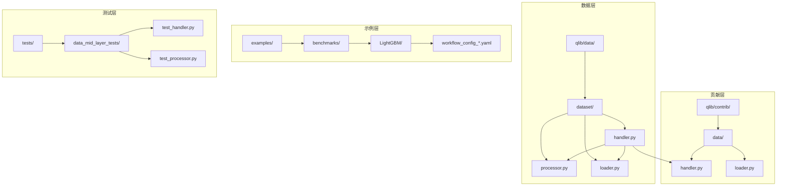
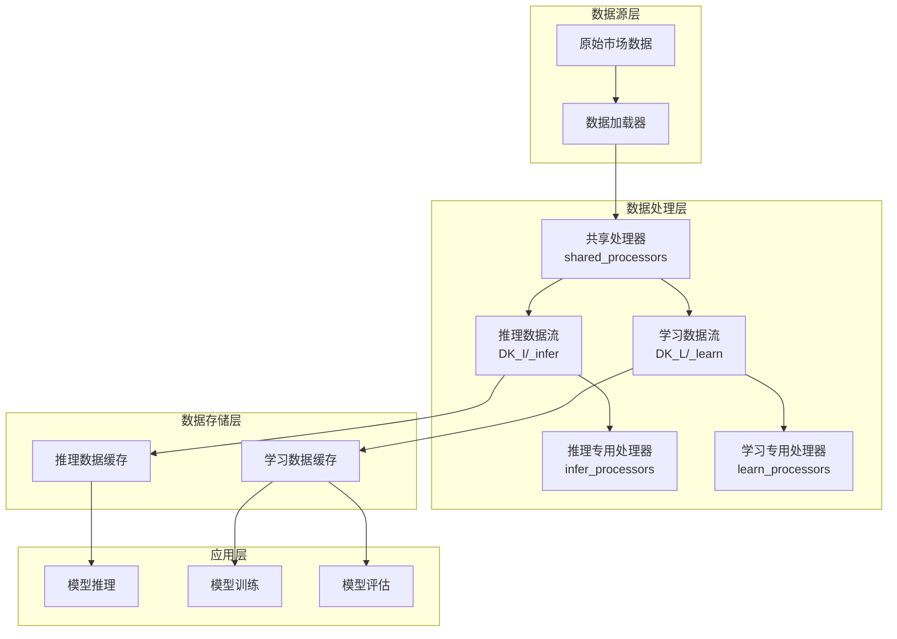
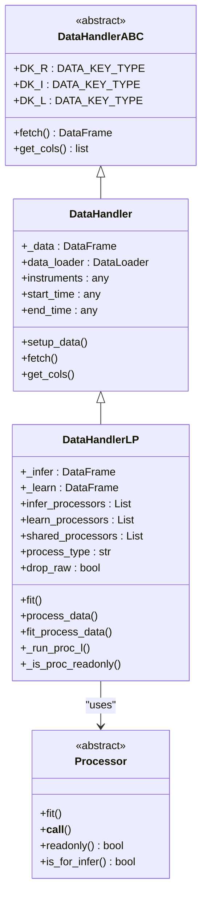
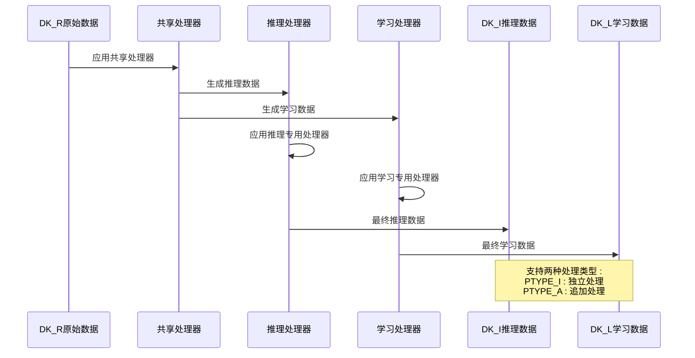
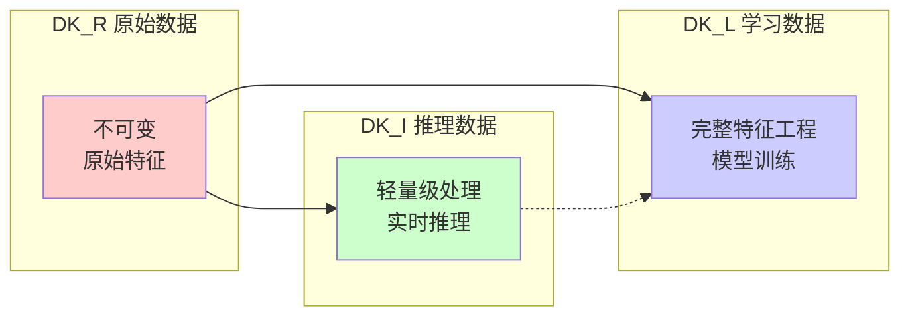
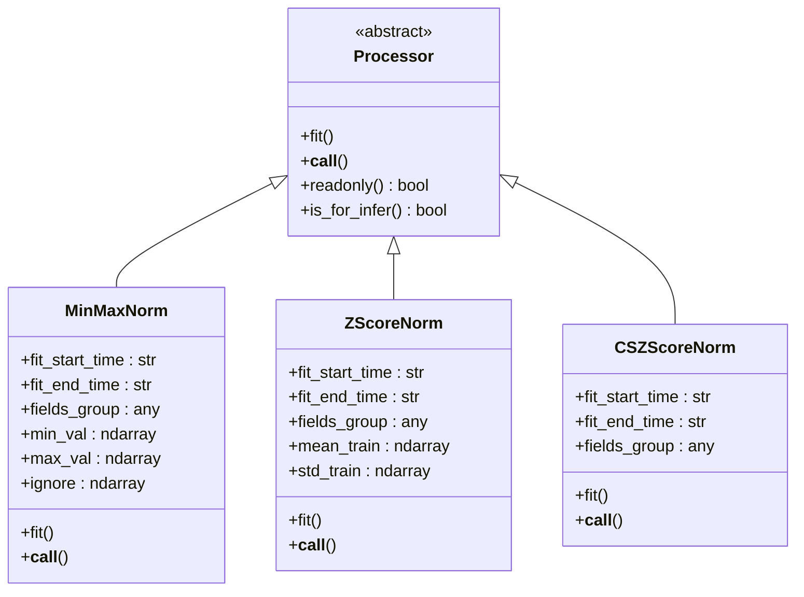
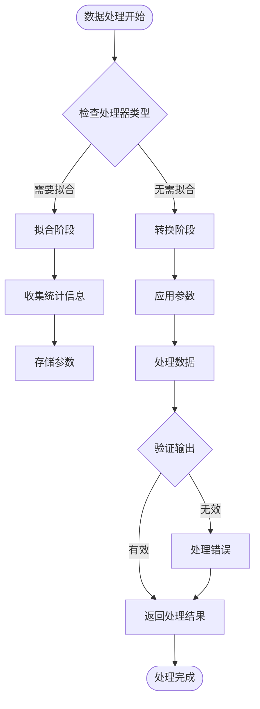
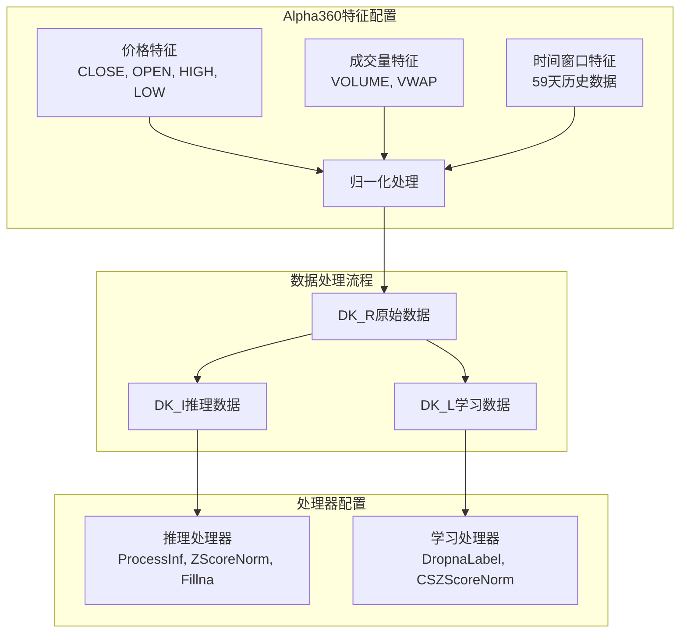
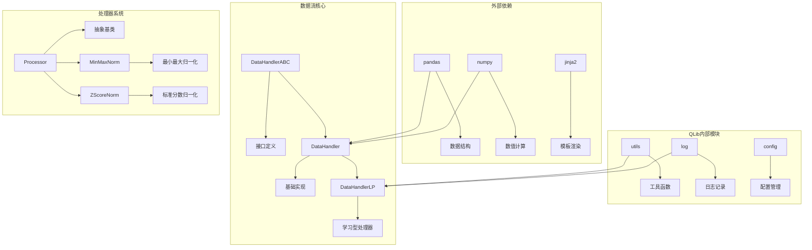
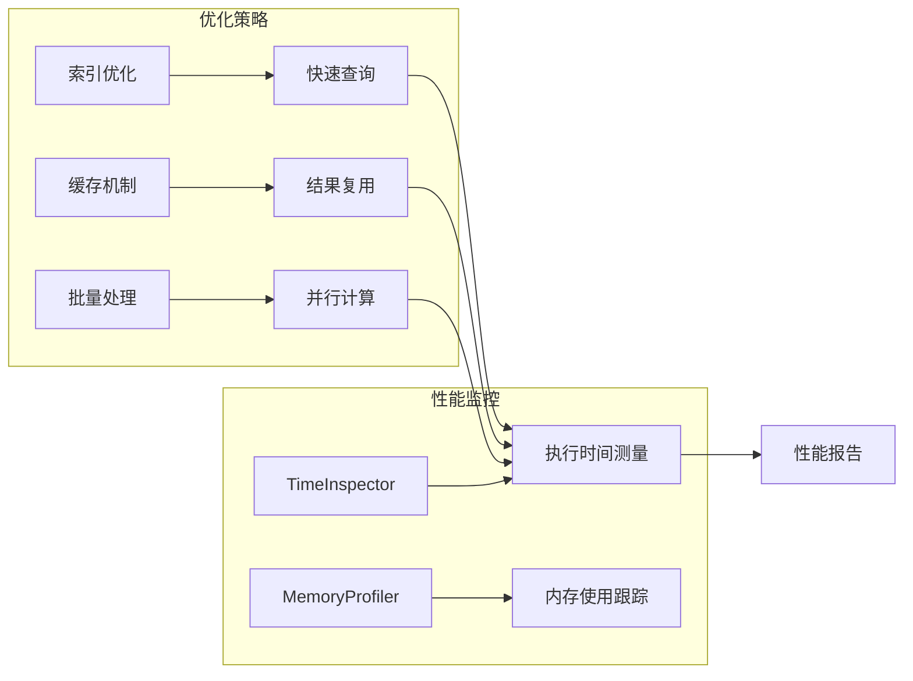

# 数据流管理

<cite>
**本文档引用的文件**
- [handler.py](file://qlib/data/dataset/handler.py)
- [processor.py](file://qlib/data/dataset/processor.py)
- [loader.py](file://qlib/contrib/data/loader.py)
- [handler.py](file://qlib/contrib/data/handler.py)
- [workflow_config_lightgbm_Alpha360.yaml](file://examples/benchmarks/LightGBM/workflow_config_lightgbm_Alpha360.yaml)
- [test_handler.py](file://tests/data_mid_layer_tests/test_handler.py)
</cite>

## 目录
1. [简介](#简介)
2. [项目结构概览](#项目结构概览)
3. [核心数据流概念](#核心数据流概念)
4. [架构概览](#架构概览)
5. [详细组件分析](#详细组件分析)
6. [依赖关系分析](#依赖关系分析)
7. [性能考虑](#性能考虑)
8. [故障排除指南](#故障排除指南)
9. [结论](#结论)

## 简介

QLib的数据流管理系统是一个高度模块化和可扩展的框架，专门设计用于处理量化金融领域的复杂数据处理需求。该系统的核心创新在于引入了三种不同的数据流类型：DK_R（原始数据）、DK_I（推理数据）和DK_L（学习数据），每种数据流都有其特定的用途和生命周期。

这种设计模式解决了传统机器学习流水线中的几个关键问题：
- 原始数据的不可变性保护
- 训练和推理阶段的不同数据处理需求
- 特征工程的灵活性和可重用性
- 内存效率和计算优化

## 项目结构概览

QLib的数据流管理主要分布在以下关键目录中：



**图表来源**
- [handler.py](file://qlib/data/dataset/handler.py#L1-L787)
- [processor.py](file://qlib/data/dataset/processor.py#L1-L500)
- [loader.py](file://qlib/contrib/data/loader.py#L1-L311)

## 核心数据流概念

### DK_R（原始数据）- 原始特征输入

DK_R代表原始数据流，是整个数据处理管道的起点。这个数据流具有以下特性：

- **不可变性**：原始数据一旦加载就保持不变，确保数据的一致性和可追溯性
- **完整性**：包含所有原始特征和标签信息
- **基础性**：为其他数据流提供参考基准

```python
# DK_R的典型特征
{
    "原始价格数据": ["$close", "$open", "$high", "$low", "$volume"],
    "衍生特征": ["$vwap", "$turnover"],
    "标签数据": ["LABEL0"],
    "时间序列": ["datetime", "instrument"]
}
```

### DK_I（推理数据）- 轻量级特征处理

DK_I专为模型推理阶段设计，采用轻量级的特征处理策略：

- **简单变换**：只包含必要的特征标准化和缺失值处理
- **实时性**：支持在线推理，响应速度快
- **兼容性**：与训练阶段的特征空间完全兼容

```python
# DK_I的典型处理器配置
infer_processors = [
    {"class": "ProcessInf", "kwargs": {}},
    {"class": "ZScoreNorm", "kwargs": {}},
    {"class": "Fillna", "kwargs": {}}
]
```

### DK_L（学习数据）- 完整特征工程

DK_L针对模型训练阶段，提供完整的特征工程能力：

- **复杂变换**：包括归一化、标准化、特征选择等高级处理
- **拟合能力**：支持需要从数据中学习参数的处理器
- **标签处理**：专门处理标签相关的特征工程

```python
# DK_L的典型处理器配置
learn_processors = [
    {"class": "DropnaLabel"},
    {"class": "CSZScoreNorm", "kwargs": {"fields_group": "label"}}
]
```

**章节来源**
- [handler.py](file://qlib/data/dataset/handler.py#L369-L430)
- [handler.py](file://qlib/data/dataset/handler.py#L402-L430)

## 架构概览

QLib的数据流管理系统采用了分层架构设计，通过明确的数据流分离实现了高度的模块化和可扩展性：



**图表来源**
- [handler.py](file://qlib/data/dataset/handler.py#L552-L583)
- [handler.py](file://qlib/data/dataset/handler.py#L652-L683)

## 详细组件分析

### DataHandlerLP类分析

DataHandlerLP是整个数据流管理系统的核心类，继承自DataHandler并扩展了学习型处理器的功能：



**图表来源**
- [handler.py](file://qlib/data/dataset/handler.py#L25-L787)
- [processor.py](file://qlib/data/dataset/processor.py#L1-L500)

#### 数据处理流程分析

DataHandlerLP的process_data方法实现了复杂的多阶段数据处理逻辑：



**图表来源**
- [handler.py](file://qlib/data/dataset/handler.py#L552-L583)

#### 处理器类型对比



**图表来源**
- [handler.py](file://qlib/data/dataset/handler.py#L402-L430)

**章节来源**
- [handler.py](file://qlib/data/dataset/handler.py#L402-L787)

### 处理器系统分析

QLib提供了丰富的内置处理器，支持各种数据预处理需求：

#### 归一化处理器



**图表来源**
- [processor.py](file://qlib/data/dataset/processor.py#L181-L287)

#### 特殊处理器分析



**图表来源**
- [processor.py](file://qlib/data/dataset/processor.py#L203-L228)

**章节来源**
- [processor.py](file://qlib/data/dataset/processor.py#L181-L287)

### Alpha360数据集分析

Alpha360是QLib中最重要的数据集之一，展示了完整的数据流应用场景：



**图表来源**
- [loader.py](file://qlib/contrib/data/loader.py#L10-L35)
- [handler.py](file://qlib/contrib/data/handler.py#L36-L76)

**章节来源**
- [loader.py](file://qlib/contrib/data/loader.py#L10-L35)
- [handler.py](file://qlib/contrib/data/handler.py#L36-L76)

## 依赖关系分析

QLib数据流管理系统的依赖关系展现了清晰的层次结构：



**图表来源**
- [handler.py](file://qlib/data/dataset/handler.py#L1-L20)
- [processor.py](file://qlib/data/dataset/processor.py#L1-L20)

**章节来源**
- [handler.py](file://qlib/data/dataset/handler.py#L1-L20)
- [processor.py](file://qlib/data/dataset/processor.py#L1-L20)

## 性能考虑

### 内存优化策略

QLib的数据流管理系统采用了多种内存优化技术：

1. **原始数据可选删除**：通过`drop_raw`参数控制是否保留原始数据
2. **就地操作**：在可能的情况下使用就地操作减少内存复制
3. **延迟加载**：按需加载数据避免不必要的内存占用

### 计算效率优化



### 配置示例

以下是不同场景下的配置示例：

#### 训练阶段配置

```yaml
# 训练阶段使用完整特征工程
learn_processors:
  - class: DropnaLabel
  - class: CSZScoreNorm
    kwargs:
      fields_group: label
  - class: CSRankNorm
    kwargs:
      fields_group: feature
  - class: Fillna
    kwargs:
      fields_group: feature
```

#### 推理阶段配置

```yaml
# 推理阶段使用轻量级处理
infer_processors:
  - class: ProcessInf
    kwargs: {}
  - class: ZScoreNorm
    kwargs: {}
  - class: Fillna
    kwargs: {}
```

#### 测试阶段配置

```yaml
# 测试阶段配置（通常与推理相同）
test_processors:
  - class: ProcessInf
    kwargs: {}
  - class: ZScoreNorm
    kwargs: {}
  - class: Fillna
    kwargs: {}
```

## 故障排除指南

### 常见问题及解决方案

#### 1. 内存不足错误

**症状**：处理大规模数据时出现内存溢出
**解决方案**：
- 设置`drop_raw=True`释放原始数据内存
- 使用批处理方式处理大数据集
- 启用数据缓存机制

#### 2. 处理器参数不匹配

**症状**：归一化处理器报错
**解决方案**：
- 检查`fit_start_time`和`fit_end_time`设置
- 确保数据范围包含拟合时间窗口
- 验证字段组配置正确

#### 3. 数据一致性问题

**症状**：推理和训练数据不一致
**解决方案**：
- 使用相同的处理器配置
- 确保数据加载器配置一致
- 检查时间范围设置

**章节来源**
- [handler.py](file://qlib/data/dataset/handler.py#L652-L683)
- [processor.py](file://qlib/data/dataset/processor.py#L203-L228)

## 结论

QLib的数据流管理系统通过精心设计的DK_R、DK_I和DK_L三种数据流，成功解决了量化金融领域复杂的数据处理需求。该系统的主要优势包括：

1. **清晰的职责分离**：每种数据流都有明确的用途和边界
2. **高度的可扩展性**：支持自定义处理器和数据源
3. **优秀的性能表现**：通过多种优化策略提升处理效率
4. **强大的兼容性**：支持多种数据格式和处理场景

这种设计不仅满足了当前的业务需求，也为未来的功能扩展奠定了坚实的基础。通过合理的配置和使用，开发者可以构建高效、可靠的数据处理流水线，支撑复杂的量化交易系统。