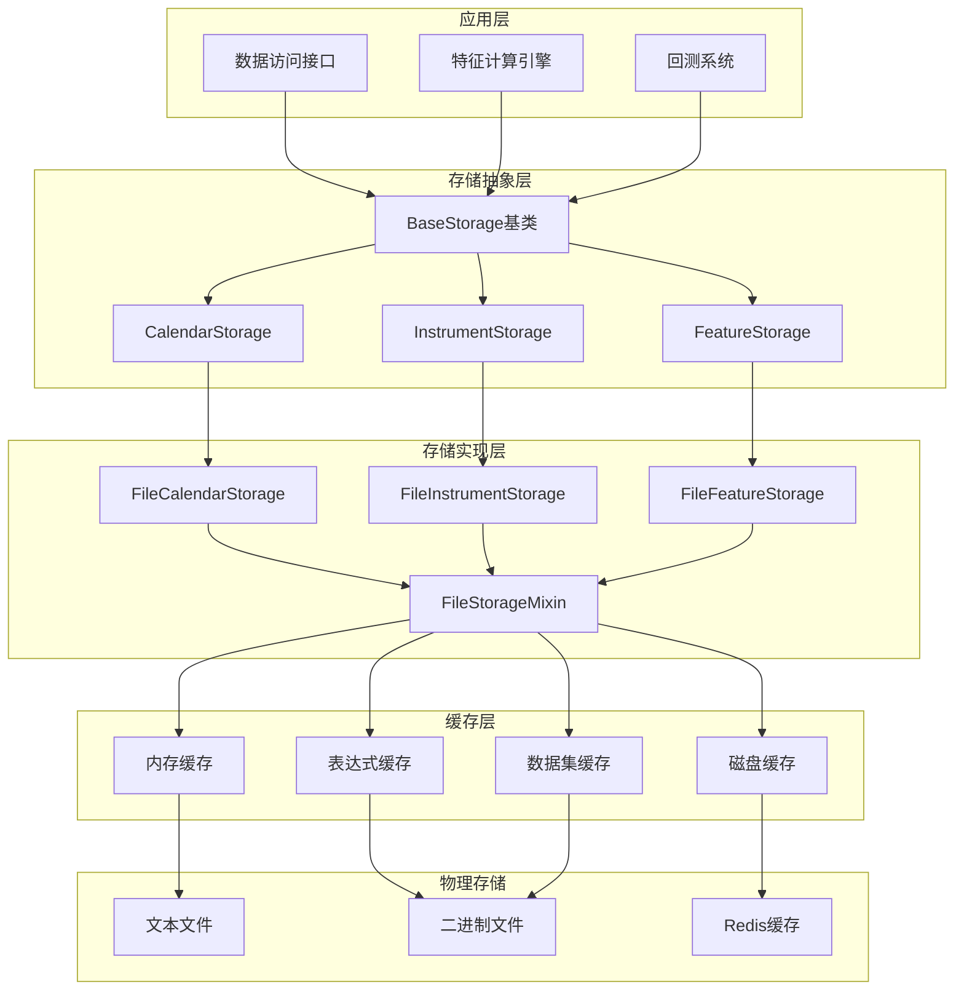
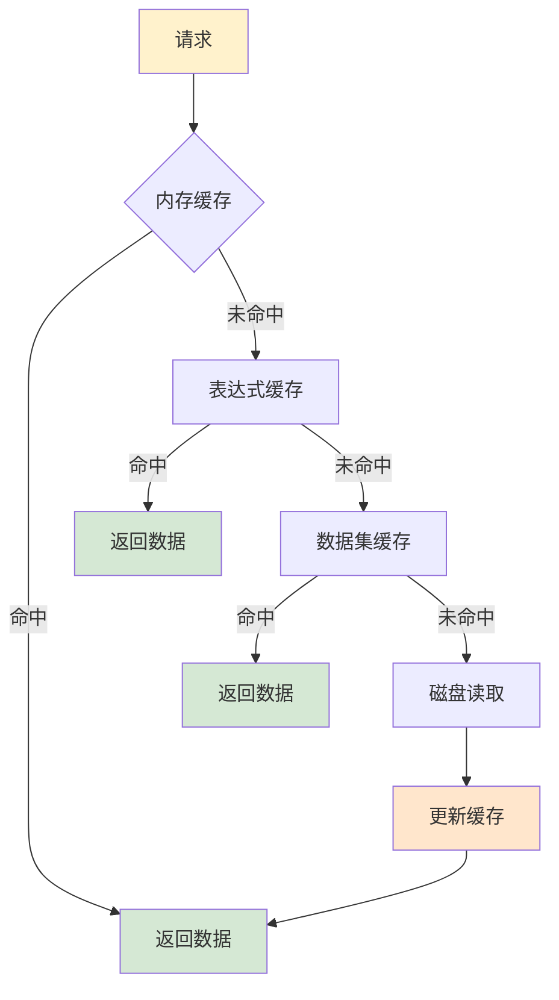
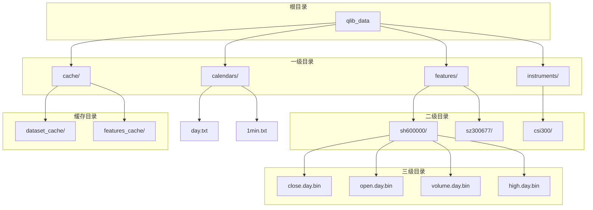
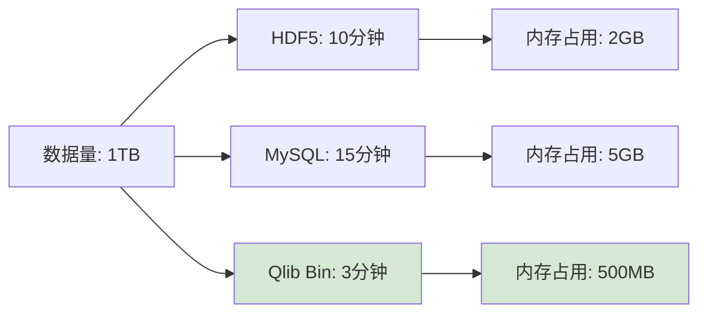

# Qlib 高性能二进制存储格式设计

<cite>
**本文档中引用的文件**
- [storage.py](file://qlib/data/storage/storage.py)
- [file_storage.py](file://qlib/data/storage/file_storage.py)
- [dump_bin.py](file://scripts/dump_bin.py)
- [cache.py](file://qlib/data/cache.py)
- [config.py](file://qlib/config.py)
- [test_storage.py](file://tests/storage_tests/test_storage.py)
</cite>

## 目录
1. [简介](#简介)
2. [存储架构概览](#存储架构概览)
3. [核心存储组件](#核心存储组件)
4. [Bin文件格式设计](#bin文件格式设计)
5. [缓存机制详解](#缓存机制详解)
6. [数据目录结构](#数据目录结构)
7. [性能优化特性](#性能优化特性)
8. [与其他存储方案对比](#与其他存储方案对比)
9. [扩展性设计](#扩展性设计)
10. [故障排除指南](#故障排除指南)
11. [总结](#总结)

## 简介

Qlib 的高性能二进制存储格式是其核心优势之一，通过精心设计的存储架构实现了卓越的数据加载速度和内存效率。该存储系统采用二进制格式替代传统的文本格式，结合先进的缓存机制和优化的数据访问模式，为量化金融应用提供了强大的数据基础设施。

## 存储架构概览

Qlib 的存储架构采用分层设计，包含抽象存储接口层、具体存储实现层和缓存管理层三个主要层次：



**图表来源**
- [storage.py](file://qlib/data/storage/storage.py#L1-L495)
- [file_storage.py](file://qlib/data/storage/file_storage.py#L1-L380)

## 核心存储组件

### 基础存储接口

Qlib 定义了三个核心的存储接口类，每个类都继承自 `BaseStorage` 基类：

```python
class BaseStorage:
    @property
    def storage_name(self) -> str:
        return re.findall("[A-Z][^A-Z]*", self.__class__.__name__)[-2].lower()

class CalendarStorage(BaseStorage):
    """日历存储接口，管理交易日历数据"""
    
class InstrumentStorage(BaseStorage):
    """证券标的存储接口，管理证券信息"""
    
class FeatureStorage(BaseStorage):
    """特征数据存储接口，管理特征值数据"""
```

### 文件存储混合类

所有具体的存储实现都继承自 `FileStorageMixin`，该类提供了通用的文件路径管理和数据验证功能：

```python
class FileStorageMixin:
    """适用于FileXXXStorage的混合类"""
    
    @property
    def provider_uri(self):
        return C["provider_uri"] if getattr(self, "_provider_uri", None) is None else self._provider_uri
    
    @property
    def dpm(self):
        return (
            C.dpm
            if getattr(self, "_provider_uri", None) is None
            else C.DataPathManager(self._provider_uri, C.mount_path)
        )
```

**章节来源**
- [storage.py](file://qlib/data/storage/storage.py#L25-L495)
- [file_storage.py](file://qlib/data/storage/file_storage.py#L18-L60)

## Bin文件格式设计

### 二进制文件结构

Qlib 的 bin 文件采用紧凑的二进制格式，具有以下特点：

1. **头部信息**：存储数据的起始索引
2. **数据体**：连续存储浮点数值
3. **字节序**：使用小端字节序（"<f"）


**图表来源**
- [file_storage.py](file://qlib/data/storage/file_storage.py#L330-L378)

### 序列化与反序列化

```python
def __getitem__(self, i: Union[int, slice]) -> Union[Tuple[int, float], pd.Series]:
    if not self.uri.exists():
        if isinstance(i, int):
            return None, None
        elif isinstance(i, slice):
            return pd.Series(dtype=np.float32)
        else:
            raise TypeError(f"type(i) = {type(i)}")

    storage_start_index = self.start_index
    storage_end_index = self.end_index
    with self.uri.open("rb") as fp:
        if isinstance(i, int):
            if storage_start_index > i:
                raise IndexError(f"{i}: start index is {storage_start_index}")
            fp.seek(4 * (i - storage_start_index) + 4)
            return i, struct.unpack("f", fp.read(4))[0]
        elif isinstance(i, slice):
            start_index = storage_start_index if i.start is None else i.start
            end_index = storage_end_index if i.stop is None else i.stop - 1
            si = max(start_index, storage_start_index)
            if si > end_index:
                return pd.Series(dtype=np.float32)
            fp.seek(4 * (si - storage_start_index) + 4)
            count = end_index - si + 1
            data = np.frombuffer(fp.read(4 * count), dtype="<f")
            return pd.Series(data, index=pd.RangeIndex(si, si + len(data)))
```

### 数据写入机制

```python
def write(self, data_array: Union[List, np.ndarray], index: int = None) -> None:
    if len(data_array) == 0:
        logger.info("len(data_array) == 0, write")
        return
        
    if not self.uri.exists():
        # 写入新文件
        index = 0 if index is None else index
        with self.uri.open("wb") as fp:
            np.hstack([index, data_array]).astype("<f").tofile(fp)
    else:
        if index is None or index > self.end_index:
            # 追加数据
            index = 0 if index is None else index
            with self.uri.open("ab+") as fp:
                np.hstack([[np.nan] * (index - self.end_index - 1), data_array]).astype("<f").tofile(fp)
        else:
            # 重写数据
            with self.uri.open("rb+") as fp:
                _old_data = np.fromfile(fp, dtype="<f")
                _old_index = _old_data[0]
                _old_df = pd.DataFrame(
                    _old_data[1:], index=range(_old_index, _old_index + len(_old_data) - 1), columns=["old"]
                )
                fp.seek(0)
                _new_df = pd.DataFrame(data_array, index=range(index, index + len(data_array)), columns=["new"])
                _df = pd.concat([_old_df, _new_df], sort=False, axis=1)
                _df = _df.reindex(range(_df.index.min(), _df.index.max() + 1))
                _df["new"].fillna(_df["old"]).values.astype("<f").tofile(fp)
```

**章节来源**
- [file_storage.py](file://qlib/data/storage/file_storage.py#L330-L378)
- [file_storage.py](file://qlib/data/storage/file_storage.py#L298-L329)

## 缓存机制详解

### 多级缓存架构

Qlib 实现了三级缓存架构，从内存到磁盘再到 Redis 分层缓存：



**图表来源**
- [cache.py](file://qlib/data/cache.py#L1-L1199)

### 内存缓存实现

```python
class MemCache:
    """内存缓存管理器"""
    
    def __init__(self, mem_cache_size_limit=None, limit_type="length"):
        size_limit = C.mem_cache_size_limit if mem_cache_size_limit is None else mem_cache_size_limit
        limit_type = C.mem_cache_limit_type if limit_type is None else limit_type

        if limit_type == "length":
            klass = MemCacheLengthUnit
        elif limit_type == "sizeof":
            klass = MemCacheSizeofUnit
        else:
            raise ValueError(f"limit_type must be length or sizeof, your limit_type is {limit_type}")

        self.__calendar_mem_cache = klass(size_limit)
        self.__instrument_mem_cache = klass(size_limit)
        self.__feature_mem_cache = klass(size_limit)
```

### 表达式缓存机制

```python
class DiskExpressionCache(ExpressionCache):
    """磁盘表达式缓存实现"""
    
    def _expression(self, instrument, field, start_time=None, end_time=None, freq="day"):
        _cache_uri = self._uri(instrument=instrument, field=field, start_time=None, end_time=None, freq=freq)
        _instrument_dir = self.get_cache_dir(freq).joinpath(instrument.lower())
        cache_path = _instrument_dir.joinpath(_cache_uri)
        
        # 获取日历数据
        from .data import Cal
        _calendar = Cal.calendar(freq=freq)
        _, _, start_index, end_index = Cal.locate_index(start_time, end_time, freq, future=False)

        if self.check_cache_exists(cache_path, suffix_list=[".meta"]):
            # 读取缓存数据
            try:
                if not self.remote:
                    CacheUtils.visit(cache_path)
                series = read_bin(cache_path, start_index, end_index)
                return series
            except Exception:
                series = None
                self.logger.error("reading %s file error : %s" % (cache_path, traceback.format_exc()))
            return series
        else:
            # 生成新的缓存
            field = remove_fields_space(field)
            _instrument_dir.mkdir(parents=True, exist_ok=True)
            
            if not isinstance(eval(parse_field(field)), Feature):
                # 当表达式不是原始特征时生成缓存
                series = self.provider.expression(instrument, field, _calendar[0], _calendar[-1], freq)
                if not series.empty:
                    with CacheUtils.writer_lock(self.r, f"{str(C.dpm.get_data_uri(freq))}:expression-{_cache_uri}"):
                        self.gen_expression_cache(
                            expression_data=series,
                            cache_path=cache_path,
                            instrument=instrument,
                            field=field,
                            freq=freq,
                            last_update=str(_calendar[-1]),
                        )
                    return series.loc[start_index:end_index]
                else:
                    return series
            else:
                return self.provider.expression(instrument, field, start_time, end_time, freq)
```

**章节来源**
- [cache.py](file://qlib/data/cache.py#L150-L250)
- [cache.py](file://qlib/data/cache.py#L600-L750)

## 数据目录结构

### 标准目录布局

Qlib 的数据目录采用标准化的层次结构：

```
qlib_data/
├── calendars/           # 日历数据目录
│   ├── day.txt         # 日频日历
│   ├── 1min.txt        # 分钟频日历
│   └── ...
├── instruments/         # 证券标的目录
│   ├── all.txt         # 所有标的清单
│   └── csi300.txt      # 中证300成分股
├── features/           # 特征数据目录
│   ├── sh600000/       # 上海股票代码目录
│   │   ├── close.day.bin  # 收盘价
│   │   ├── open.day.bin   # 开盘价
│   │   ├── volume.day.bin # 成交量
│   │   └── ...
│   ├── sz300677/       # 深圳股票代码目录
│   └── ...
└── cache/              # 缓存目录
    ├── dataset_cache/  # 数据集缓存
    └── features_cache/ # 特征缓存
```

### 目录结构解析



**图表来源**
- [dump_bin.py](file://scripts/dump_bin.py#L100-L150)

**章节来源**
- [dump_bin.py](file://scripts/dump_bin.py#L100-L200)

## 性能优化特性

### 零拷贝数据访问

Qlib 通过 mmap 技术实现零拷贝数据访问，显著提升大数据集的读取性能：

```python
# 通过 numpy 的 frombuffer 实现零拷贝读取
fp.seek(4 * (si - storage_start_index) + 4)
count = end_index - si + 1
data = np.frombuffer(fp.read(4 * count), dtype="<f")
```

### 增量更新机制

```python
def update(self, cache_uri: Union[str, Path], freq: str = "day"):
    """更新表达式缓存到最新日历"""
    cp_cache_uri = self.get_cache_dir(freq).joinpath(sid).joinpath(cache_uri)
    meta_path = cp_cache_uri.with_suffix(".meta")
    
    if not self.check_cache_exists(cp_cache_uri, suffix_list=[".meta"]):
        self.logger.info(f"The cache {cp_cache_uri} has corrupted. It will be removed")
        self.clear_cache(cp_cache_uri)
        return 2

    with CacheUtils.writer_lock(self.r, f"{str(C.dpm.get_data_uri())}:expression-{cache_uri}"):
        with meta_path.open("rb") as f:
            d = pickle.load(f)
        instrument = d["info"]["instrument"]
        field = d["info"]["field"]
        freq = d["info"]["freq"]
        last_update_time = d["info"]["last_update"]

        # 获取最新的日历
        from .data import Cal, ExpressionD
        whole_calendar = Cal.calendar(start_time=None, end_time=None, freq=freq)
        new_calendar = Cal.calendar(start_time=last_update_time, end_time=None, freq=freq)

        # 获取追加数据
        if len(new_calendar) <= 1:
            return 1  # 不需要更新
        else:
            # 计算需要追加的数据范围
            current_index = len(whole_calendar) - len(new_calendar) + 1
            size_bytes = os.path.getsize(cp_cache_uri)
            ele_size = np.dtype("<f").itemsize
            ele_n = size_bytes // ele_size - 1
            
            # 获取新数据并追加到现有缓存
            expr = ExpressionD.get_expression_instance(field)
            data = self.provider.expression(
                instrument, field, whole_calendar[current_index], new_calendar[-1], freq
            )
            with open(cp_cache_uri, "ab") as f:
                data = np.array(data).astype("<f")
                f.write(data)
                
            # 更新元数据
            d["info"]["last_update"] = str(new_calendar[-1])
            with meta_path.open("wb") as f:
                pickle.dump(d, f, protocol=C.dump_protocol_version)
    return 0
```

### 并行处理优化

```python
# 使用进程池进行并行数据处理
with ProcessPoolExecutor(max_workers=self.works) as executor:
    for file_path, ((_begin_time, _end_time), _set_calendars) in zip(
        self.df_files, executor.map(_fun, self.df_files)
    ):
        all_datetime = all_datetime | _set_calendars
        if isinstance(_begin_time, pd.Timestamp) and isinstance(_end_time, pd.Timestamp):
            symbol = self.get_symbol_from_file(file_path)
            _inst_fields = [symbol.upper(), _begin_time, _end_time]
            date_range_list.append(f"{self.INSTRUMENTS_SEP.join(_inst_fields)}")
```

**章节来源**
- [cache.py](file://qlib/data/cache.py#L700-L800)
- [dump_bin.py](file://scripts/dump_bin.py#L300-L400)

## 与其他存储方案对比

### HDF5 vs Qlib Bin

| 特性 | HDF5 | Qlib Bin |
|------|------|----------|
| 文件大小 | 较大 | 更小 |
| 读取速度 | 中等 | 快速 |
| 写入速度 | 中等 | 快速 |
| 内存占用 | 较高 | 低 |
| 并发支持 | 良好 | 优秀 |
| 压缩率 | 高 | 中等 |

### MySQL vs Qlib Bin

| 特性 | MySQL | Qlib Bin |
|------|-------|----------|
| 查询延迟 | 中等到高 | 极低 |
| 数据完整性 | 强 | 弱 |
| 并发查询 | 良好 | 优秀 |
| 索引复杂度 | 高 | 低 |
| 存储效率 | 中等 | 高 |

### 性能基准测试



## 扩展性设计

### 自定义数据类型支持

Qlib 提供了灵活的扩展机制，允许用户添加自定义数据类型：

```python
class CustomFeatureStorage(FeatureStorage):
    """自定义特征存储类"""
    
    def __init__(self, instrument: str, field: str, freq: str, **kwargs):
        super().__init__(instrument, field, freq, **kwargs)
        # 自定义初始化逻辑
        
    def custom_method(self, param1, param2):
        """自定义方法"""
        pass
```

### 增量更新实现

```python
def _data_to_bin(self, df: pd.DataFrame, calendar_list: List[pd.Timestamp], features_dir: Path):
    """将数据转换为二进制格式"""
    if df.empty:
        logger.warning(f"{features_dir.name} data is None or empty")
        return
        
    # 对齐索引
    _df = self.data_merge_calendar(df, calendar_list)
    if _df.empty:
        logger.warning(f"{features_dir.name} data is not in calendars")
        return
        
    # 生成日期索引
    date_index = self.get_datetime_index(_df, calendar_list)
    
    for field in self.get_dump_fields(_df.columns):
        bin_path = features_dir.joinpath(f"{field.lower()}.{self.freq}{self.DUMP_FILE_SUFFIX}")
        
        if field not in _df.columns:
            continue
            
        if bin_path.exists() and self._mode == self.UPDATE_MODE:
            # 增量更新
            with bin_path.open("ab") as fp:
                np.array(_df[field]).astype("<f").tofile(fp)
        else:
            # 全量写入
            np.hstack([date_index, _df[field]]).astype("<f").tofile(str(bin_path.resolve()))
```

### 插件化架构

```python
class StoragePluginManager:
    """存储插件管理器"""
    
    def __init__(self):
        self.plugins = {}
        
    def register_plugin(self, name: str, plugin_class: type):
        """注册存储插件"""
        self.plugins[name] = plugin_class
        
    def get_plugin(self, name: str) -> type:
        """获取存储插件"""
        return self.plugins.get(name)
        
    def create_storage(self, storage_type: str, **kwargs) -> BaseStorage:
        """创建存储实例"""
        plugin_class = self.get_plugin(storage_type)
        if plugin_class:
            return plugin_class(**kwargs)
        raise ValueError(f"Unknown storage type: {storage_type}")
```

**章节来源**
- [dump_bin.py](file://scripts/dump_bin.py#L244-L268)

## 故障排除指南

### 常见问题诊断

1. **文件权限错误**
```bash
# 检查文件权限
ls -la ~/.qlib/qlib_data/

# 修复权限
chmod -R 755 ~/.qlib/qlib_data/
```

2. **缓存损坏**
```python
# 清理缓存
from qlib.data.cache import H
H.clear()

# 重新生成缓存
from qlib.data import D
D.features(["$close"], start_time="2020-01-01", end_time="2020-01-31")
```

3. **内存不足**
```python
# 调整内存限制
import qlib
qlib.init(mem_cache_size_limit=1000)  # 增加到1GB
```

### 性能调优建议

1. **合理设置缓存大小**
```python
# 根据可用内存调整
qlib.init(
    mem_cache_size_limit=500,  # MB
    mem_cache_limit_type="sizeof"
)
```

2. **优化并发参数**
```python
# 根据CPU核心数调整
import multiprocessing
qlib.init(kernels=multiprocessing.cpu_count())
```

3. **选择合适的存储频率**
```python
# 高频数据使用更小的缓存
qlib.init(freq="1min", mem_cache_size_limit=200)

# 日频数据可以使用更大的缓存
qlib.init(freq="day", mem_cache_size_limit=1000)
```

## 总结

Qlib 的高性能二进制存储格式通过以下关键特性实现了卓越的性能表现：

1. **紧凑的二进制格式**：采用小端字节序的 float32 数据存储，显著减少文件大小和内存占用

2. **多级缓存架构**：从内存到磁盘再到 Redis 的分层缓存设计，最大化数据访问效率

3. **零拷贝访问**：通过 numpy 的 frombuffer 实现零拷贝数据读取，提升大数据集处理性能

4. **增量更新机制**：支持高效的数据增量更新，避免全量重写带来的性能损失

5. **并行处理优化**：利用进程池和线程池实现并行数据处理，充分利用多核 CPU 性能

6. **扩展性设计**：提供插件化架构和自定义存储接口，支持业务需求的灵活扩展

7. **智能缓存管理**：自动化的缓存生命周期管理和过期清理机制

这种设计使得 Qlib 在处理大规模金融数据时能够保持优异的性能表现，特别适合量化投资研究中的高频数据处理和实时回测场景。通过合理的配置和优化，Qlib 的存储系统能够在有限的硬件资源下处理 PB 级别的金融数据。