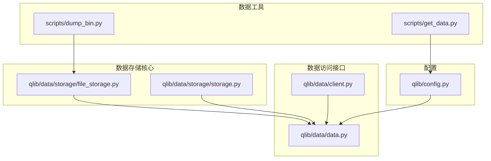
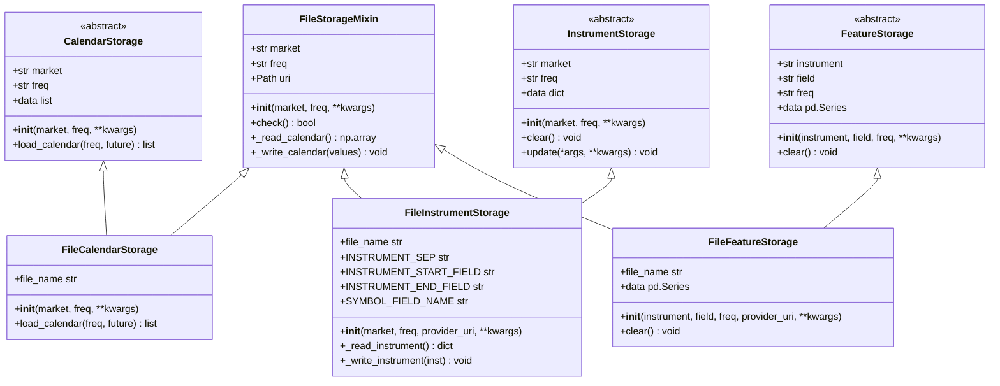
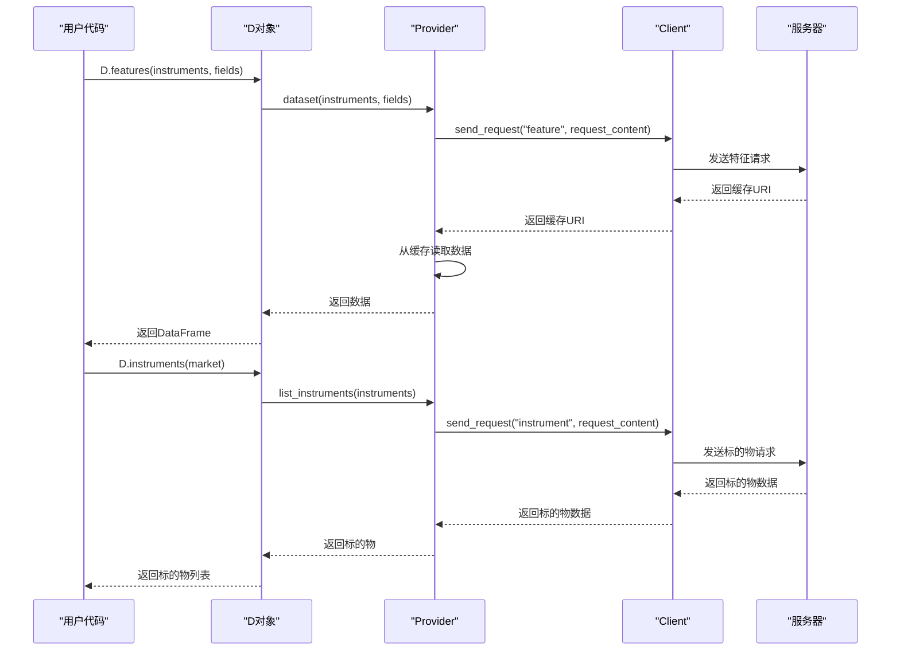
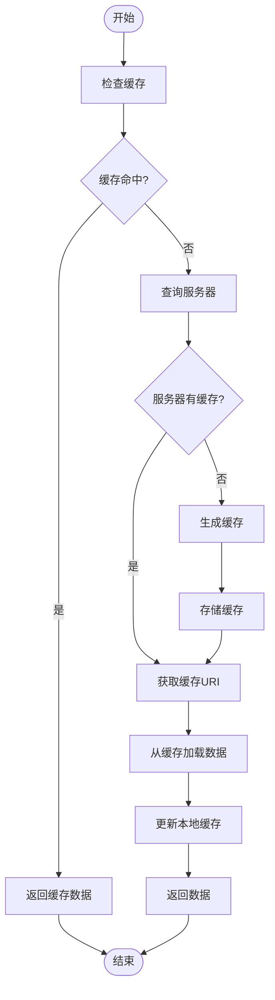
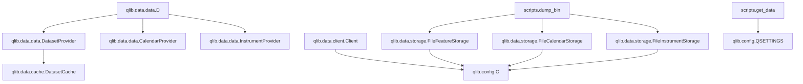

# 数据存储

<cite>
**本文档中引用的文件**  
- [file_storage.py](file://qlib/data/storage/file_storage.py#L165-L296)
- [storage.py](file://qlib/data/storage/storage.py#L186-L226)
- [data.py](file://qlib/data/data.py#L0-L1332)
- [client.py](file://qlib/data/client.py#L0-L103)
- [dump_bin.py](file://scripts/dump_bin.py#L0-L543)
- [get_data.py](file://scripts/get_data.py#L0-L10)
- [config.py](file://qlib/config.py#L0-L527)
- [test_storage.py](file://tests/storage_tests/test_storage.py#L39-L107)
</cite>

## 目录

1. [引言](#引言)
2. [项目结构](#项目结构)
3. [核心组件](#核心组件)
4. [架构概述](#架构概述)
5. [详细组件分析](#详细组件分析)
6. [依赖分析](#依赖分析)
7. [性能考虑](#性能考虑)
8. [故障排除指南](#故障排除指南)
9. [结论](#结论)

## 引言
本文档详细阐述了Qlib数据存储机制的设计原理和实现细节。重点介绍其高性能二进制格式（bin文件）的组织结构，包括特征(features)、日历(calendars)、标的(instruments)等目录的存储方式。文档将说明D.features()和D.instruments()等核心API如何通过数据客户端(client)访问底层存储，并对比HDF5、MySQL等传统方案，解释Qlib存储在数据加载速度上的优势。同时提供使用scripts/get_data.py下载CN/US市场数据的完整指南，以及provider_uri的初始化方法和qlib.init()在连接数据源中的作用。

## 项目结构
Qlib的项目结构清晰地组织了数据存储相关的组件。核心数据存储功能位于`qlib/data/storage/`目录下，而数据访问接口则分布在`qlib/data/`目录中。数据下载和转换工具位于`scripts/`目录。



**Diagram sources**
- [file_storage.py](file://qlib/data/storage/file_storage.py#L165-L296)
- [data.py](file://qlib/data/data.py#L0-L1332)
- [client.py](file://qlib/data/client.py#L0-L103)
- [dump_bin.py](file://scripts/dump_bin.py#L0-L543)
- [get_data.py](file://scripts/get_data.py#L0-L10)
- [config.py](file://qlib/config.py#L0-L527)

**Section sources**
- [file_storage.py](file://qlib/data/storage/file_storage.py#L165-L296)
- [data.py](file://qlib/data/data.py#L0-L1332)
- [client.py](file://qlib/data/client.py#L0-L103)
- [dump_bin.py](file://scripts/dump_bin.py#L0-L543)
- [get_data.py](file://scripts/get_data.py#L0-L10)
- [config.py](file://qlib/config.py#L0-L527)

## 核心组件
Qlib数据存储机制的核心组件包括高性能二进制文件存储、数据客户端、缓存系统和数据下载工具。这些组件协同工作，实现了高效的数据存储和访问。

**Section sources**
- [file_storage.py](file://qlib/data/storage/file_storage.py#L165-L296)
- [data.py](file://qlib/data/data.py#L0-L1332)
- [client.py](file://qlib/data/client.py#L0-L103)

## 架构概述
Qlib的数据存储架构采用分层设计，将数据存储、数据访问和数据缓存分离，实现了高性能和可扩展性。

```mermaid
graph TD
subgraph "应用层"
API[D.features(), D.instruments()]
end
subgraph "访问层"
Provider[Provider]
Client[Client]
end
subgraph "缓存层"
ExpressionCache[ExpressionCache]
DatasetCache[DatasetCache]
end
subgraph "存储层"
FileStorage[FileStorage]
BinFiles[.bin files]
CalendarFiles[calendar files]
InstrumentFiles[instrument files]
end
API --> Provider
Provider --> Client
Provider --> ExpressionCache
Provider --> DatasetCache
ExpressionCache --> FileStorage
DatasetCache --> FileStorage
FileStorage --> BinFiles
FileStorage --> CalendarFiles
FileStorage --> InstrumentFiles
```

**Diagram sources**
- [data.py](file://qlib/data/data.py#L0-L1332)
- [client.py](file://qlib/data/client.py#L0-L103)
- [file_storage.py](file://qlib/data/storage/file_storage.py#L165-L296)

## 详细组件分析

### 高性能二进制格式设计
Qlib采用自定义的高性能二进制格式（.bin文件）存储数据，这种设计相比HDF5、MySQL等传统方案具有显著优势。



**Diagram sources**
- [file_storage.py](file://qlib/data/storage/file_storage.py#L165-L296)
- [storage.py](file://qlib/data/storage/storage.py#L186-L226)

#### 存储目录组织结构
Qlib的数据存储采用清晰的目录结构，将不同类型的数据分别存储在不同的目录中：

- **calendars/**: 存储日历数据，按频率组织（如day.txt, 1min.txt）
- **instruments/**: 存储标的物数据，如all.txt
- **features/**: 存储特征数据，按标的物和字段组织（如sh600000/close.day.bin）

这种组织结构使得数据访问更加高效，通过简单的路径拼接即可定位到所需数据文件。

**Section sources**
- [file_storage.py](file://qlib/data/storage/file_storage.py#L165-L296)
- [dump_bin.py](file://scripts/dump_bin.py#L0-L543)

### 数据客户端与API访问
Qlib通过数据客户端机制实现对底层存储的访问，D.features()和D.instruments()等核心API通过这一机制工作。



**Diagram sources**
- [data.py](file://qlib/data/data.py#L0-L1332)
- [client.py](file://qlib/data/client.py#L0-L103)

#### 核心API工作流程
D.features()和D.instruments()等API通过Provider模式工作，首先检查缓存，然后通过Client与服务器通信获取数据。

**Section sources**
- [data.py](file://qlib/data/data.py#L0-L1332)
- [client.py](file://qlib/data/client.py#L0-L103)

### 缓存机制与性能优势
Qlib的缓存机制是其高性能的关键，ExpressionCache和DatasetCache显著提升了数据加载速度。



**Diagram sources**
- [data.py](file://qlib/data/data.py#L0-L1332)
- [config.py](file://qlib/config.py#L0-L527)

#### 与传统方案对比
相比HDF5、MySQL等传统数据存储方案，Qlib的存储机制具有以下优势：

1. **更快的加载速度**: 二进制格式和缓存机制使得数据加载速度显著提升
2. **更低的内存占用**: 精简的数据格式减少了内存使用
3. **更好的查询性能**: 针对量化金融场景优化的查询模式
4. **更简单的部署**: 无需复杂的数据库管理系统

**Section sources**
- [data.py](file://qlib/data/data.py#L0-L1332)
- [config.py](file://qlib/config.py#L0-L527)

## 依赖分析
Qlib数据存储机制的组件之间存在清晰的依赖关系，这些依赖确保了系统的稳定性和可维护性。



**Diagram sources**
- [data.py](file://qlib/data/data.py#L0-L1332)
- [client.py](file://qlib/data/client.py#L0-L103)
- [file_storage.py](file://qlib/data/storage/file_storage.py#L165-L296)
- [config.py](file://qlib/config.py#L0-L527)
- [dump_bin.py](file://scripts/dump_bin.py#L0-L543)
- [get_data.py](file://scripts/get_data.py#L0-L10)

## 性能考虑
Qlib的数据存储机制在设计时充分考虑了性能因素，通过多种优化手段实现了高效的数据访问。

1. **二进制格式**: 使用紧凑的二进制格式存储数据，减少I/O开销
2. **多级缓存**: 实现ExpressionCache和DatasetCache多级缓存机制
3. **并行处理**: 利用多核CPU进行并行数据处理
4. **内存优化**: 采用高效的数据结构和内存管理策略

这些优化使得Qlib在处理大规模金融数据时能够保持高性能。

## 故障排除指南
针对Qlib数据存储机制的常见问题，提供以下运维操作命令：

1. **数据校验**:
```bash
python scripts/check_data_health.py --qlib_dir ~/.qlib/qlib_data/cn_data
```

2. **目录清理**:
```bash
# 清理缓存目录
rm -rf ~/.qlib/qlib_data/cn_data/features_cache
rm -rf ~/.qlib/qlib_data/cn_data/dataset_cache

# 重新下载数据
python scripts/get_data.py qlib_data --name qlib_data --target_dir ~/.qlib/qlib_data/cn_data --interval 1d --region cn
```

3. **检查数据完整性**:
```bash
python scripts/check_dump_bin.py --data_path /path/to/csv_data --qlib_dir ~/.qlib/qlib_data/cn_data
```

**Section sources**
- [get_data.py](file://scripts/get_data.py#L0-L10)
- [dump_bin.py](file://scripts/dump_bin.py#L0-L543)

## 结论
Qlib的数据存储机制通过精心设计的高性能二进制格式、清晰的目录组织结构和高效的缓存机制，实现了优于传统方案的数据加载性能。D.features()和D.instruments()等核心API通过数据客户端机制无缝访问底层存储，为量化研究提供了高效的数据支持。通过scripts/get_data.py工具，用户可以方便地下载CN/US市场数据，并通过provider_uri配置和qlib.init()初始化连接数据源。这一完整的数据存储解决方案为大规模量化研究提供了坚实的基础。