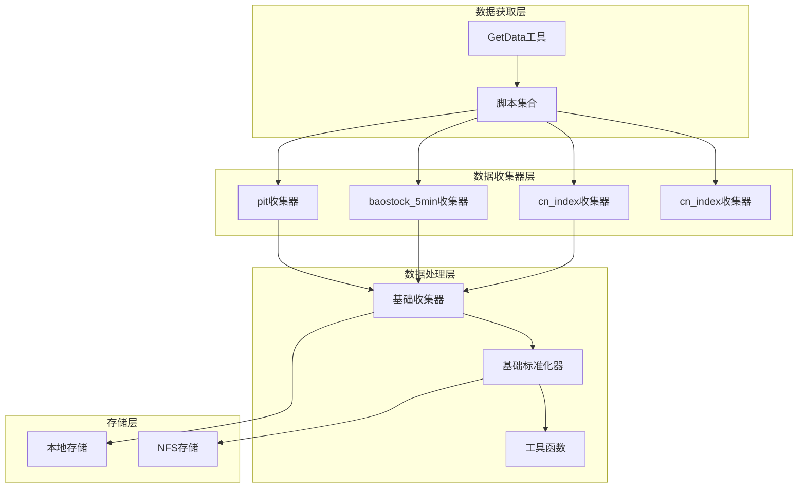
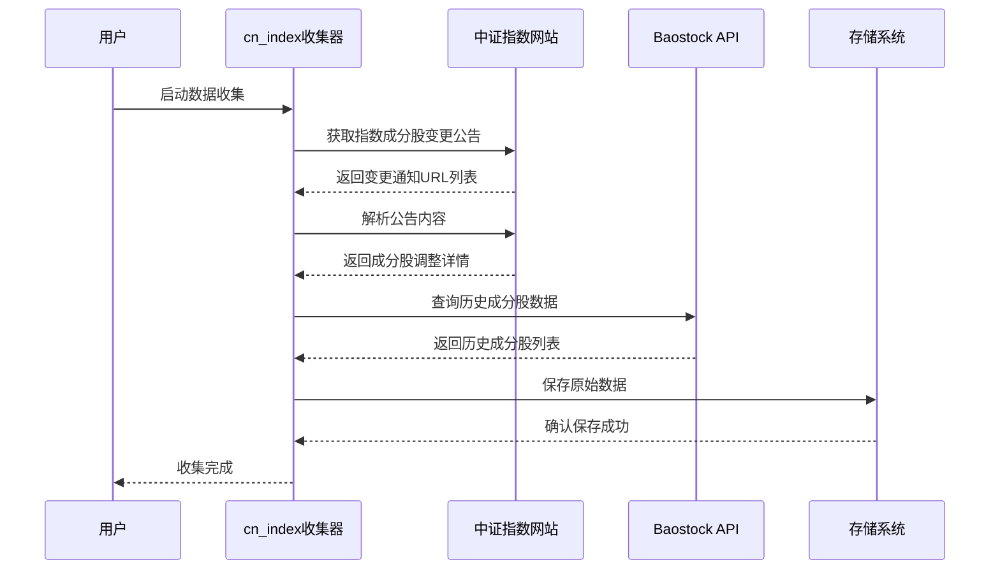
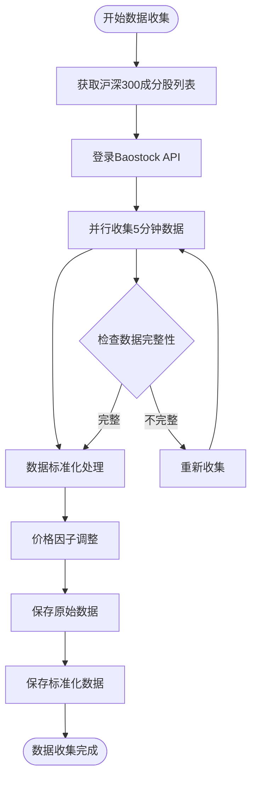
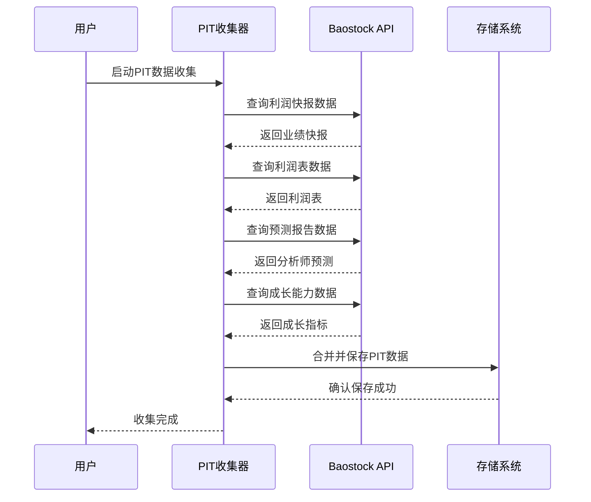
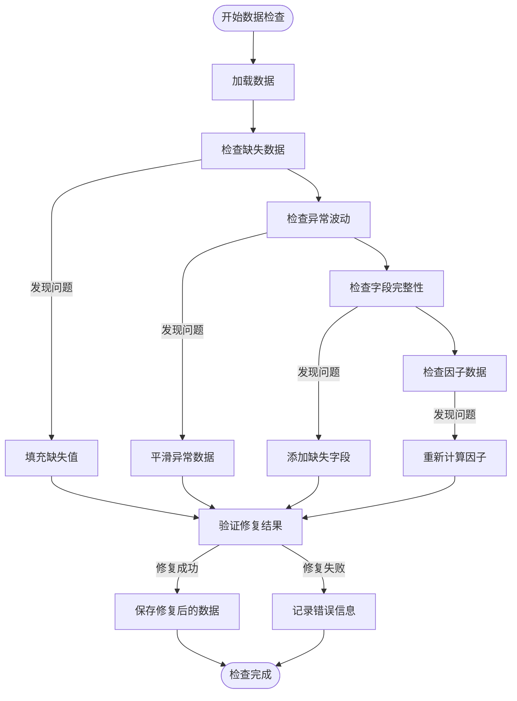

# 中国市场数据获取

<cite>
**本文档引用的文件**
- [scripts/get_data.py](file://scripts/get_data.py)
- [qlib/tests/data.py](file://qlib/tests/data.py)
- [scripts/data_collector/cn_index/collector.py](file://scripts/data_collector/cn_index/collector.py)
- [scripts/data_collector/baostock_5min/collector.py](file://scripts/data_collector/baostock_5min/collector.py)
- [scripts/data_collector/pit/collector.py](file://scripts/data_collector/pit/collector.py)
- [scripts/check_data_health.py](file://scripts/check_data_health.py)
- [qlib/config.py](file://qlib/config.py)
- [examples/benchmarks/LightGBM/workflow_config_lightgbm_Alpha360.yaml](file://examples/benchmarks/LightGBM/workflow_config_lightgbm_Alpha360.yaml)
</cite>

## 目录
1. [简介](#简介)
2. [项目结构概览](#项目结构概览)
3. [核心数据收集器](#核心数据收集器)
4. [数据获取流程](#数据获取流程)
5. [PIT数据处理](#pit数据处理)
6. [QLib初始化配置](#qlib初始化配置)
7. [数据验证与修复](#数据验证与修复)
8. [最佳实践指南](#最佳实践指南)
9. [故障排除](#故障排除)
10. [总结](#总结)

## 简介

QLib是一个面向量化投资研究的开源平台，提供了完整的中国市场数据获取、处理和分析功能。本文档详细介绍了如何使用QLib从中国金融市场获取各种类型的数据，包括股票指数数据、分钟级行情数据以及PIT（Point-in-Time）财务数据。

QLib支持多种数据源和收集方式，通过统一的接口为量化研究人员提供高质量的历史市场数据。系统采用模块化设计，每个数据收集器负责特定类型的数据获取，确保了系统的可扩展性和维护性。

## 项目结构概览

QLib的数据收集系统采用分层架构设计，主要包含以下组件：



**图表来源**
- [scripts/get_data.py](file://scripts/get_data.py#L1-L10)
- [scripts/data_collector/base.py](file://scripts/data_collector/base.py)

**章节来源**
- [scripts/get_data.py](file://scripts/get_data.py#L1-L10)
- [scripts/data_collector/cn_index/collector.py](file://scripts/data_collector/cn_index/collector.py#L1-L50)

## 核心数据收集器

### cn_index收集器

cn_index收集器专门用于获取中国主要股票指数的历史数据，包括沪深300、中证500等指数成分股信息。

#### 主要特性

1. **多指数支持**：支持沪深300、中证500、中证100等多个重要指数
2. **成分股变更追踪**：自动记录指数成分股的加入和移除历史
3. **数据完整性保证**：提供新上市公司数据和历史成分股数据
4. **自动化程度高**：无需人工干预即可完成数据收集

#### 配置参数

```python
# 基本配置
save_dir: str                    # 数据保存目录
start: str                       # 开始日期
end: str                         # 结束日期
interval: str                    # 时间频率，默认'day'
max_workers: int                 # 并发工作线程数，默认4
max_collector_count: int         # 最大收集次数，默认2
delay: float                     # 请求延迟，默认0
check_data_length: int           # 数据长度检查阈值
limit_nums: int                  # 调试用限制数量
```

#### 执行流程



**图表来源**
- [scripts/data_collector/cn_index/collector.py](file://scripts/data_collector/cn_index/collector.py#L100-L200)

### baostock_5min收集器

baostock_5min收集器专注于获取沪深300指数的5分钟级别行情数据，是高频交易策略的重要数据源。

#### 主要特性

1. **高频数据获取**：支持5分钟级别的分钟线数据
2. **数据标准化**：自动进行数据清洗和标准化处理
3. **因子调整**：结合日线数据进行复权处理
4. **性能优化**：支持多线程并发下载

#### 配置参数

```python
# 5分钟数据收集配置
save_dir: str                    # 原始数据保存目录
start: str                       # 开始日期
end: str                         # 结束日期
interval: str = "5min"          # 时间频率
max_workers: int = 4             # 并发工作线程数
max_collector_count: int = 2     # 最大收集次数
delay: float = 0                 # 请求延迟
check_data_length: int           # 数据长度检查
limit_nums: int                  # 调试用限制数量
```

#### 数据处理流程



**图表来源**
- [scripts/data_collector/baostock_5min/collector.py](file://scripts/data_collector/baostock_5min/collector.py#L50-L150)

**章节来源**
- [scripts/data_collector/cn_index/collector.py](file://scripts/data_collector/cn_index/collector.py#L1-L464)
- [scripts/data_collector/baostock_5min/collector.py](file://scripts/data_collector/baostock_5min/collector.py#L1-L329)

## 数据获取流程

### 全量数据更新

QLib提供了统一的命令行接口来管理数据的全量更新：

```bash
# 下载中国市场的日线数据
python scripts/get_data.py qlib_data \
    --name qlib_data \
    --target_dir ~/.qlib/qlib_data/cn_data \
    --interval 1d \
    --region cn

# 下载中国市场的1分钟数据（可选）
python scripts/get_data.py qlib_data \
    --name qlib_data \
    --target_dir ~/.qlib/qlib_data/cn_data_1min \
    --interval 1min \
    --region cn
```

### 增量数据更新

对于已经存在的数据集，可以使用增量更新模式：

```bash
# 使用增量模式更新数据
python scripts/get_data.py qlib_data \
    --target_dir ~/.qlib/qlib_data/cn_data \
    --interval 1d \
    --region cn \
    --exists_skip True
```

### 数据收集器调用

通过scripts/get_data.py可以直接调用不同的collector模块：

```python
# 示例：调用cn_index收集器
from qlib.tests.data import GetData
GetData().qlib_data(
    name="qlib_data",
    region="cn",
    interval="1d",
    target_dir="~/.qlib/qlib_data/cn_data",
    delete_old=False,
    exists_skip=True
)
```

**章节来源**
- [scripts/get_data.py](file://scripts/get_data.py#L1-L10)
- [qlib/tests/data.py](file://qlib/tests/data.py#L1-L212)

## PIT数据处理

PIT（Point-in-Time）数据是QLib特有的财务数据收集方式，它记录了公司在特定时间点的实际财务数据，而不是事后修正的数据。

### PIT数据收集器特性

1. **时间点数据**：记录实际披露时间点的财务数据
2. **多维度数据**：包括利润表、资产负债表、现金流量表等
3. **预测数据**：包含分析师预测和业绩快报
4. **自动更新**：定期自动更新最新披露的财务数据

### 数据收集流程



**图表来源**
- [scripts/data_collector/pit/collector.py](file://scripts/data_collector/pit/collector.py#L150-L250)

### PIT数据在因子计算中的作用

PIT数据在因子计算中具有重要作用：

1. **真实财务数据**：提供公司实际披露的财务数据，避免事后修正的影响
2. **时间一致性**：确保所有股票在同一时间点使用相同的数据
3. **预测因子**：包含分析师预测数据，可用于构建预测型因子
4. **基本面分析**：为基本面量化投资策略提供可靠的数据基础

**章节来源**
- [scripts/data_collector/pit/collector.py](file://scripts/data_collector/pit/collector.py#L1-L263)

## QLib初始化配置

### provider_uri目录结构

QLib的provider_uri配置决定了数据的存储位置和访问方式：

```
~/.qlib/
├── qlib_data/
│   ├── cn_data/           # 日线数据目录
│   │   ├── calendars/     # 日历数据
│   │   ├── features/      # 特征数据
│   │   ├── instruments/   # 证券清单
│   │   └── features_cache/ # 特征缓存
│   ├── cn_data_1min/      # 1分钟数据目录（可选）
│   └── cn_data_5min/      # 5分钟数据目录（可选）
└── stock_data/
    ├── source/            # 原始数据源
    └── normalized/        # 标准化数据
```

### 初始化配置示例

```python
import qlib
from qlib.constant import REG_CN

# 基础初始化配置
qlib.init(
    provider_uri="~/.qlib/qlib_data/cn_data",
    region=REG_CN,
    expression_cache=None,
    dataset_cache=None
)

# 多频率数据初始化
provider_uri_map = {
    "day": "~/.qlib/qlib_data/cn_data",
    "1min": "~/.qlib/qlib_data/cn_data_1min",
    "5min": "~/.qlib/qlib_data/cn_data_5min"
}
qlib.init(
    provider_uri=provider_uri_map,
    region=REG_CN
)
```

### 区域设置建议

根据不同的使用场景选择合适的区域设置：

```python
# 中国市场配置
from qlib.constant import REG_CN
qlib.init(region=REG_CN)

# 美国市场配置  
from qlib.constant import REG_US
qlib.init(region=REG_US)

# 台湾市场配置
from qlib.constant import REG_TW
qlib.init(region=REG_TW)
```

**章节来源**
- [qlib/config.py](file://qlib/config.py#L133-L426)

## 数据验证与修复

### 数据健康检查

QLib提供了专门的数据健康检查工具来验证数据质量：

```python
from scripts.check_data_health import DataHealthChecker

# 检查CSV格式数据
checker = DataHealthChecker(
    csv_path="/path/to/csv/data",
    freq="day",
    large_step_threshold_price=0.5,
    large_step_threshold_volume=3,
    missing_data_num=0
)

# 或检查QLib格式数据
checker = DataHealthChecker(
    qlib_dir="~/.qlib/qlib_data/cn_data",
    freq="day"
)

# 执行全面的数据检查
checker.check_data()
```

### 数据质量问题识别

数据健康检查工具能够识别以下问题：

1. **缺失数据**：OHLCV列中存在NaN值
2. **异常波动**：价格或成交量出现超过阈值的跳跃
3. **字段缺失**：缺少必需的OHLCV字段
4. **因子缺失**：复权因子数据缺失或为空

### 自动修复机制



**图表来源**
- [scripts/check_data_health.py](file://scripts/check_data_health.py#L1-L100)

**章节来源**
- [scripts/check_data_health.py](file://scripts/check_data_health.py#L1-L204)

## 最佳实践指南

### 数据收集最佳实践

1. **定期更新策略**
   ```bash
   # 每周自动更新数据
   0 1 * * 1 python scripts/get_data.py qlib_data --target_dir ~/.qlib/qlib_data/cn_data --interval 1d --region cn
   
   # 每个交易日更新5分钟数据
   0 16 * * 1-5 python scripts/data_collector/baostock_5min/collector.py download_data --source_dir ~/.qlib/stock_data/source/hs300_5min_original --start $(date -d "-1 day" +%Y-%m-%d) --end $(date +%Y-%m-%d) --interval 5min --region HS300
   ```

2. **数据质量监控**
   ```python
   # 定期运行数据健康检查
   checker = DataHealthChecker(qlib_dir="~/.qlib/qlib_data/cn_data", freq="day")
   results = checker.check_data()
   
   if results:
       # 发送告警邮件
       send_alert_email("数据质量问题", results)
   ```

3. **备份策略**
   ```bash
   # 创建每日数据备份
   tar -czf ~/backup/qlib_data_$(date +%Y%m%d).tar.gz ~/.qlib/qlib_data/
   
   # 保留最近30天的备份
   find ~/backup/ -name "qlib_data_*.tar.gz" -mtime +30 -delete
   ```

### 性能优化建议

1. **并发控制**：根据网络带宽和服务器性能调整max_workers参数
2. **内存管理**：对于大规模数据处理，启用磁盘缓存减少内存占用
3. **断点续传**：利用exists_skip参数避免重复下载
4. **增量更新**：优先使用增量更新而非全量重下

### 错误处理策略

1. **网络异常处理**：实现自动重试机制
2. **数据完整性检查**：定期验证数据完整性
3. **日志记录**：详细记录数据收集过程中的异常情况
4. **回滚机制**：在发现严重数据质量问题时能够快速回滚到上一个正常版本

## 故障排除

### 常见问题及解决方案

1. **数据下载失败**
   ```
   问题：网络连接超时或被目标服务器拒绝
   解决方案：
   - 增加请求延迟：delay参数设置为1秒以上
   - 减少并发数：max_workers设置为1-2
   - 使用代理：配置HTTP代理
   ```

2. **数据不完整**
   ```
   问题：某些股票数据缺失或不连续
   解决方案：
   - 检查check_data_length参数设置
   - 使用retry机制重新下载
   - 手动检查对应股票的基本面信息
   ```

3. **内存不足**
   ```
   问题：处理大量数据时出现内存溢出
   解决方案：
   - 启用磁盘缓存：expression_cache设置为'DiskExpressionCache'
   - 分批处理数据：limit_nums参数限制处理数量
   - 增加系统内存或使用更高配置的机器
   ```

4. **数据格式错误**
   ```
   问题：数据格式不符合QLib要求
   解决方案：
   - 运行数据健康检查工具
   - 手动修复格式问题
   - 重新下载数据源
   ```

### 调试技巧

1. **启用详细日志**：设置日志级别为DEBUG
2. **分步调试**：逐个模块测试数据收集功能
3. **小规模测试**：使用少量数据验证流程正确性
4. **依赖检查**：确认所有必要的Python包已正确安装

## 总结

QLib提供了一套完整而强大的中国市场数据获取解决方案。通过本文档介绍的各种数据收集器和工具，用户可以：

1. **高效获取数据**：使用专门的收集器获取高质量的市场数据
2. **确保数据质量**：通过健康检查工具和自动修复机制保证数据准确性
3. **灵活配置系统**：根据需求选择合适的配置参数和存储方式
4. **持续维护更新**：建立完善的更新和监控机制

QLib的数据获取系统不仅满足了当前的研究需求，还具备良好的扩展性和维护性，为量化投资研究提供了坚实的数据基础。随着市场的不断发展，QLib将继续完善其数据获取功能，为用户提供更加优质的服务。