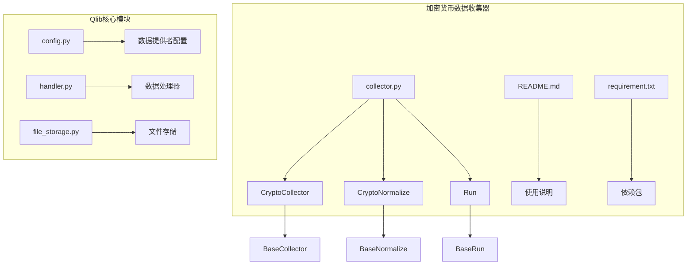
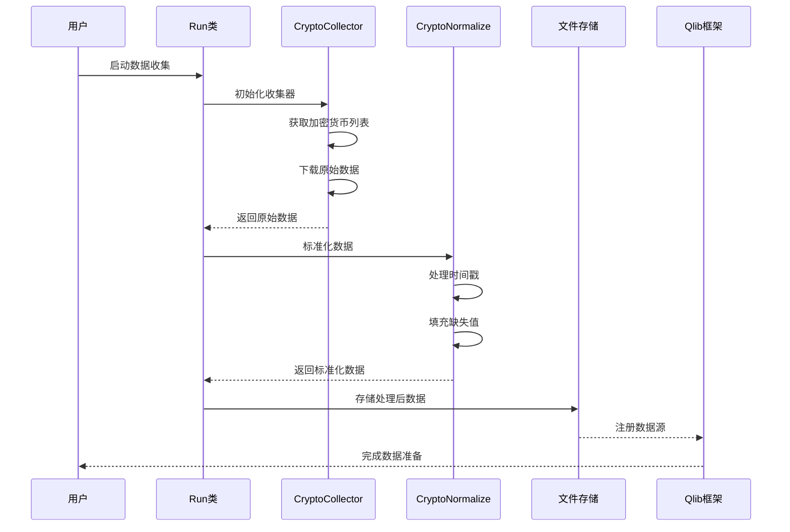
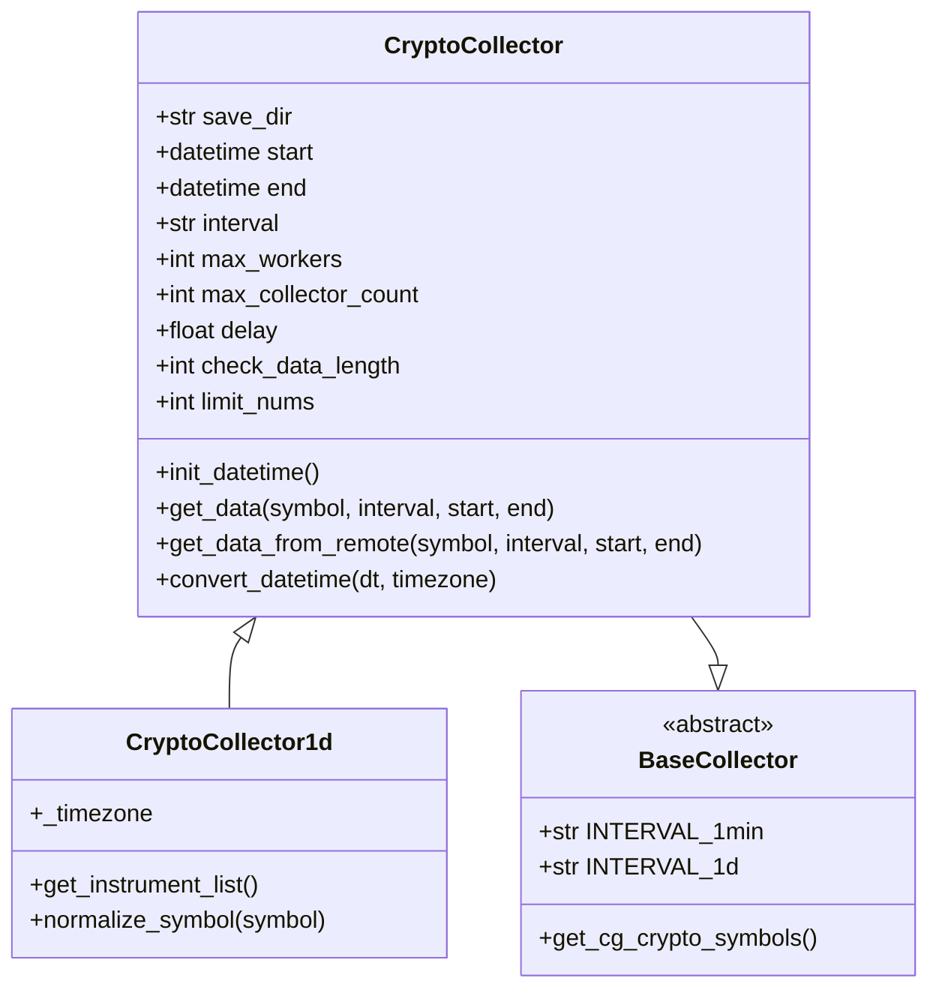
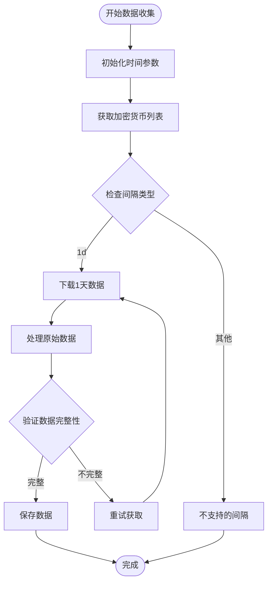
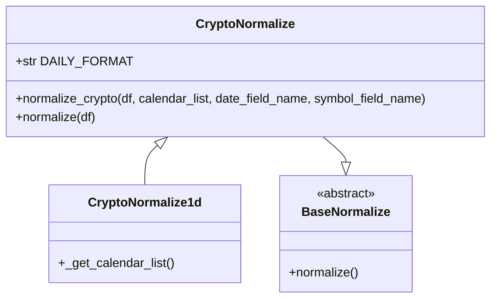
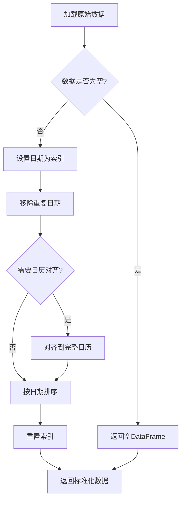
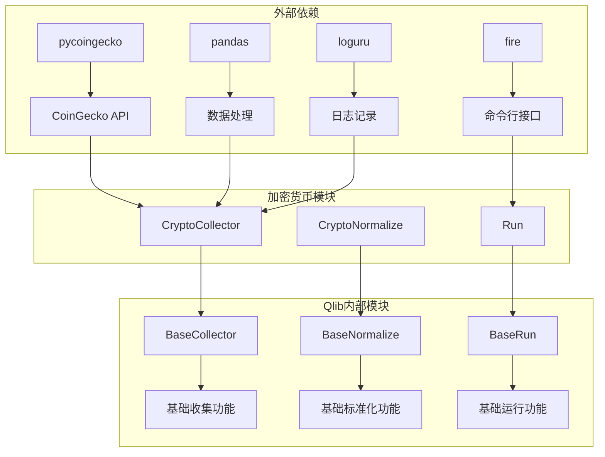

# 加密货币数据获取

<cite>
**本文档中引用的文件**
- [collector.py](file://scripts/data_collector/crypto/collector.py)
- [README.md](file://scripts/data_collector/crypto/README.md)
- [requirement.txt](file://scripts/data_collector/crypto/requirement.txt)
- [config.py](file://qlib/config.py)
- [handler.py](file://qlib/data/dataset/handler.py)
- [file_storage.py](file://qlib/data/storage/file_storage.py)
</cite>

## 目录
1. [简介](#简介)
2. [项目结构](#项目结构)
3. [核心组件](#核心组件)
4. [架构概览](#架构概览)
5. [详细组件分析](#详细组件分析)
6. [依赖关系分析](#依赖关系分析)
7. [性能考虑](#性能考虑)
8. [故障排除指南](#故障排除指南)
9. [结论](#结论)

## 简介

Qlib是一个面向量化投资研究的Python库，提供了完整的量化交易研究框架。本文档详细介绍如何在Qlib框架中集成加密货币市场数据，特别是通过`crypto/collector.py`模块从主流交易所（如CoinGecko）获取BTC、ETH等数字资产的价格序列。

该系统支持多种数据频率（如1天、1小时），并提供时间戳对齐和缺失值处理机制。用户可以通过配置`provider_uri`参数来支持非传统金融市场的数据存储路径，并在`qlib.init()`中正确注册加密资产数据源。

## 项目结构

加密货币数据收集器位于Qlib项目的`scripts/data_collector/crypto/`目录下，包含以下核心文件：



**图表来源**
- [collector.py](file://scripts/data_collector/crypto/collector.py#L1-L50)
- [config.py](file://qlib/config.py#L130-L170)

**章节来源**
- [collector.py](file://scripts/data_collector/crypto/collector.py#L1-L311)
- [README.md](file://scripts/data_collector/crypto/README.md#L1-L55)

## 核心组件

### CryptoCollector类

`CryptoCollector`是加密货币数据收集的核心类，继承自`BaseCollector`，负责从CoinGecko API获取加密货币价格数据。

主要特性：
- 支持1天频率数据收集
- 自动处理时间戳转换和时区问题
- 提供重试机制和错误处理
- 支持批量数据收集和并发处理

### CryptoNormalize类

`CryptoNormalize`类负责数据标准化和格式转换，确保数据符合Qlib框架的要求。

主要功能：
- 数据去重和排序
- 时间戳对齐和填充
- 缺失值处理
- 格式规范化

### Run类

`Run`类作为命令行接口，提供完整的数据收集和处理工作流。

**章节来源**
- [collector.py](file://scripts/data_collector/crypto/collector.py#L50-L150)
- [collector.py](file://scripts/data_collector/crypto/collector.py#L200-L311)

## 架构概览

加密货币数据获取系统采用分层架构设计，确保数据收集、处理和存储的高效性：



**图表来源**
- [collector.py](file://scripts/data_collector/crypto/collector.py#L250-L311)
- [file_storage.py](file://qlib/data/storage/file_storage.py#L42-L72)

## 详细组件分析

### 数据收集器实现

#### CryptoCollector1d类



**图表来源**
- [collector.py](file://scripts/data_collector/crypto/collector.py#L50-L150)
- [collector.py](file://scripts/data_collector/crypto/collector.py#L150-L200)

#### 数据获取流程



**图表来源**
- [collector.py](file://scripts/data_collector/crypto/collector.py#L100-L150)

### 数据标准化处理

#### CryptoNormalize1d类



**图表来源**
- [collector.py](file://scripts/data_collector/crypto/collector.py#L200-L250)

#### 数据标准化流程



**图表来源**
- [collector.py](file://scripts/data_collector/crypto/collector.py#L200-L250)

**章节来源**
- [collector.py](file://scripts/data_collector/crypto/collector.py#L50-L311)

## 依赖关系分析

加密货币数据收集系统的依赖关系如下：



**图表来源**
- [requirement.txt](file://scripts/data_collector/crypto/requirement.txt#L1-L8)
- [collector.py](file://scripts/data_collector/crypto/collector.py#L1-L20)

**章节来源**
- [requirement.txt](file://scripts/data_collector/crypto/requirement.txt#L1-L8)
- [collector.py](file://scripts/data_collector/crypto/collector.py#L1-L30)

## 性能考虑

### 并发处理优化

系统支持多线程并发处理，通过`max_workers`参数控制并发数量。对于大量加密货币数据的收集，合理的并发设置可以显著提高效率。

### 缓存机制

- **内存缓存**：使用Redis或本地内存缓存频繁访问的数据
- **磁盘缓存**：将处理后的数据持久化到磁盘，避免重复计算
- **表达式缓存**：缓存复杂的计算表达式结果

### 数据压缩

- 使用二进制格式存储数据，减少磁盘空间占用
- 支持gzip压缩，进一步降低存储成本

## 故障排除指南

### 常见问题及解决方案

#### 1. API限制问题

**问题**：CoinGecko API请求频率限制导致数据收集失败

**解决方案**：
```python
# 调整延迟参数
python collector.py download_data --delay 1.0
```

#### 2. 数据完整性问题

**问题**：部分加密货币数据缺失或不完整

**解决方案**：
```python
# 设置数据长度检查
python collector.py download_data --check_data_length 1000
```

#### 3. 内存不足问题

**问题**：处理大量数据时出现内存溢出

**解决方案**：
- 减少`max_workers`参数值
- 使用分批处理模式
- 增加系统内存或使用分布式处理

**章节来源**
- [collector.py](file://scripts/data_collector/crypto/collector.py#L250-L311)

## 结论

Qlib的加密货币数据获取系统提供了一个完整、高效的解决方案，用于从CoinGecko等主流交易所收集和处理加密货币市场数据。该系统具有以下优势：

1. **易于使用**：提供简洁的命令行接口和Python API
2. **高度可配置**：支持多种参数调整以适应不同需求
3. **可靠稳定**：内置重试机制和错误处理
4. **高性能**：支持并发处理和多种缓存策略
5. **标准兼容**：完全符合Qlib框架的数据格式要求

通过正确配置`provider_uri`参数并在`qlib.init()`中注册数据源，用户可以轻松地将加密货币数据集成到Qlib的回测和分析流程中，实现与传统金融市场的无缝对接。