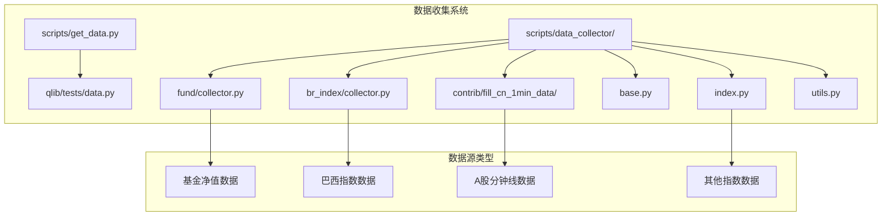
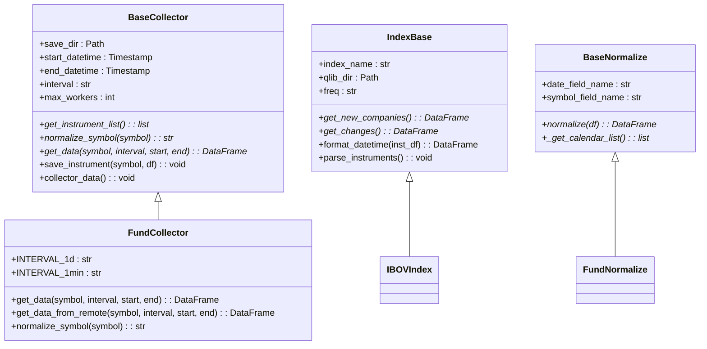
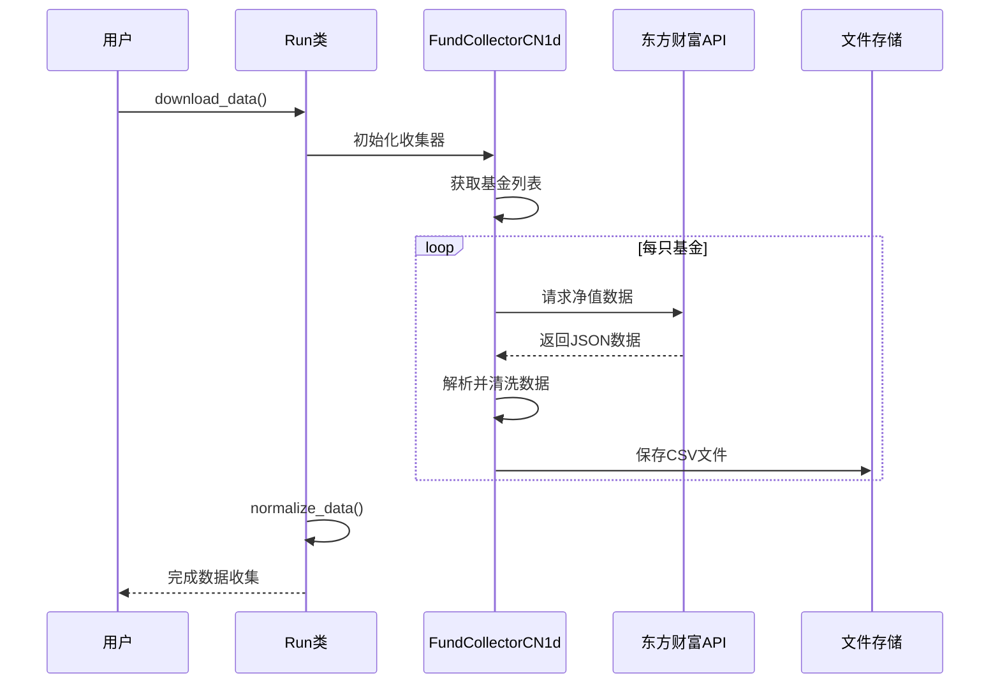
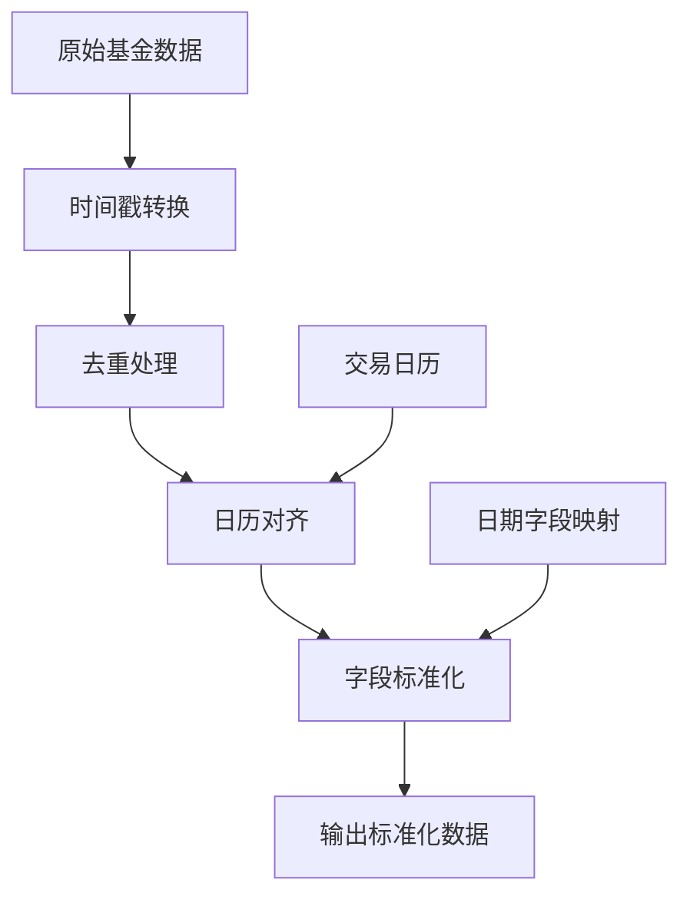
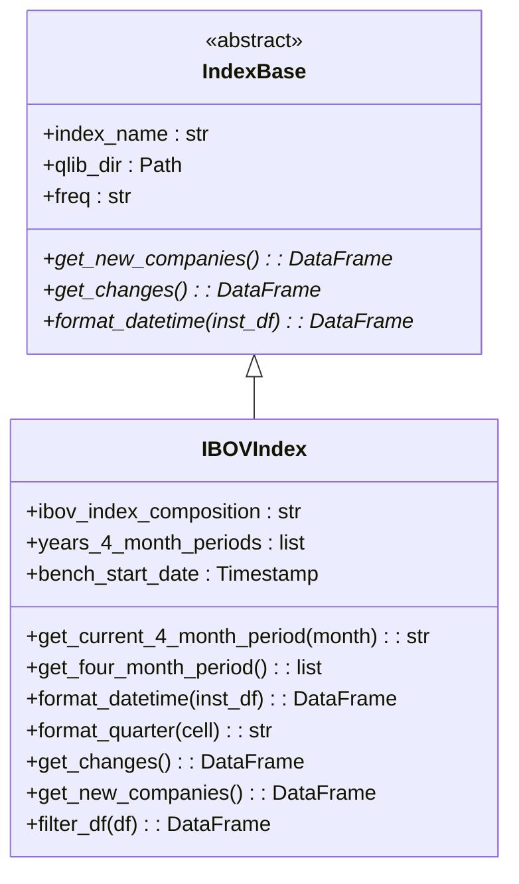
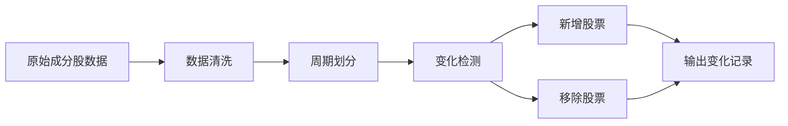
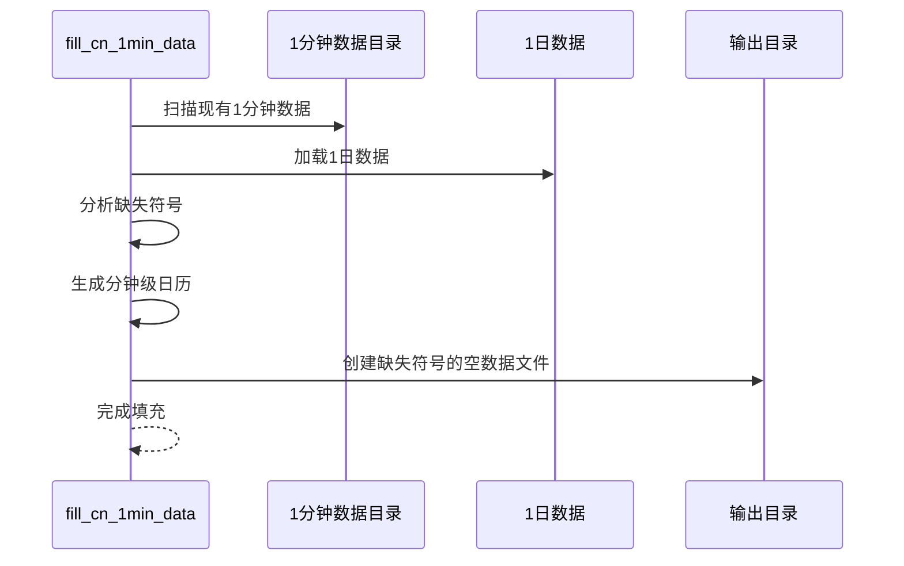
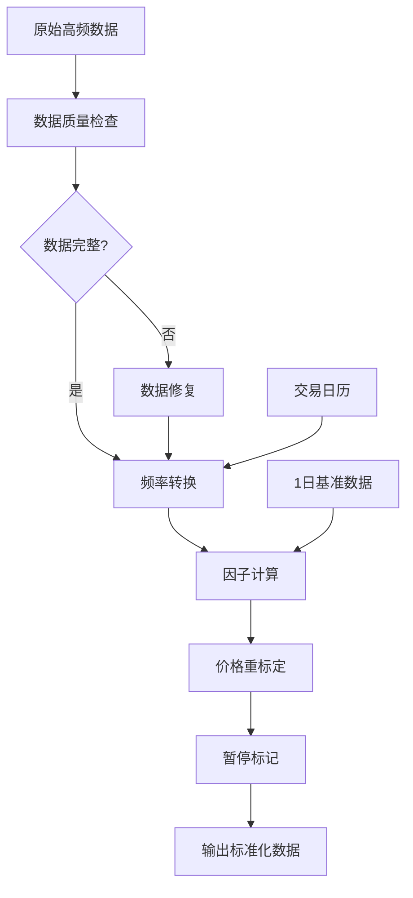

# 基金与另类数据获取

<cite>
**本文档引用的文件**
- [scripts/get_data.py](file://scripts/get_data.py)
- [qlib/tests/data.py](file://qlib/tests/data.py)
- [scripts/data_collector/fund/collector.py](file://scripts/data_collector/fund/collector.py)
- [scripts/data_collector/br_index/collector.py](file://scripts/data_collector/br_index/collector.py)
- [scripts/data_collector/contrib/fill_cn_1min_data/fill_cn_1min_data.py](file://scripts/data_collector/contrib/fill_cn_1min_data/fill_cn_1min_data.py)
- [scripts/data_collector/base.py](file://scripts/data_collector/base.py)
- [scripts/data_collector/index.py](file://scripts/data_collector/index.py)
- [scripts/data_collector/utils.py](file://scripts/data_collector/utils.py)
- [pyproject.toml](file://pyproject.toml)
- [tests/test_get_data.py](file://tests/test_get_data.py)
</cite>

## 目录
1. [简介](#简介)
2. [项目结构概览](#项目结构概览)
3. [核心组件分析](#核心组件分析)
4. [基金净值数据收集](#基金净值数据收集)
5. [巴西指数数据收集](#巴西指数数据收集)
6. [A股分钟线数据填充](#a股分钟线数据填充)
7. [数据一致性校验](#数据一致性校验)
8. [扩展指南](#扩展指南)
9. [性能考虑](#性能考虑)
10. [故障排除](#故障排除)
11. [结论](#结论)

## 简介

QLib是一个量化研究平台，提供了完整的金融数据收集和处理系统。本文档详细介绍了基金净值数据、巴西指数（br_index）等另类数据源的接入方法，以及如何使用fund/collector.py抓取开放式基金、ETF的历史净值，并与主行情数据对齐。同时介绍了fill_cn_1min_data工具在填补A股分钟线缺失数据中的应用，指导用户扩展base.py以支持自定义数据格式，并通过get_data.py统一调度。

## 项目结构概览

QLib的数据收集系统采用模块化设计，主要包含以下核心目录：



**图表来源**
- [scripts/get_data.py](file://scripts/get_data.py#L1-L10)
- [scripts/data_collector/base.py](file://scripts/data_collector/base.py#L1-L50)

**章节来源**
- [scripts/get_data.py](file://scripts/get_data.py#L1-L10)
- [qlib/tests/data.py](file://qlib/tests/data.py#L1-L50)

## 核心组件分析

### 数据收集基础架构

QLib的数据收集系统基于抽象工厂模式设计，提供了统一的接口来处理不同类型的金融数据源。



**图表来源**
- [scripts/data_collector/base.py](file://scripts/data_collector/base.py#L20-L100)
- [scripts/data_collector/fund/collector.py](file://scripts/data_collector/fund/collector.py#L20-L80)
- [scripts/data_collector/index.py](file://scripts/data_collector/index.py#L15-L80)

### 统一数据调度入口

get_data.py作为数据收集系统的统一入口，提供了便捷的命令行接口：

```python
# 基础数据下载示例
python get_data.py qlib_data --name qlib_data --target_dir ~/.qlib/qlib_data/cn_data --interval 1d --region cn

# CSV数据下载示例
python get_data.py download_data --file_name csv_data_cn.zip --target_dir ~/.qlib/csv_data/cn_data
```

**章节来源**
- [scripts/get_data.py](file://scripts/get_data.py#L1-L10)
- [qlib/tests/data.py](file://qlib/tests/data.py#L150-L211)

## 基金净值数据收集

### FundCollector核心功能

FundCollector专门用于抓取开放式基金和ETF的历史净值数据，支持1日频度的数据收集。



**图表来源**
- [scripts/data_collector/fund/collector.py](file://scripts/data_collector/fund/collector.py#L100-L200)

### 数据获取流程

基金数据收集的核心流程包括以下几个关键步骤：

1. **基金列表获取**：从东方财富网获取所有基金代码
2. **数据请求**：向基金API发送HTTP请求获取历史净值
3. **数据解析**：解析JSON响应并提取净值信息
4. **数据清洗**：去除重复数据和异常值
5. **格式标准化**：将数据转换为QLib标准格式

```python
# 关键参数配置
INDEX_BENCH_URL = "http://api.fund.eastmoney.com/f10/lsjz?callback=jQuery_&fundCode={index_code}&pageIndex=1&pageSize={numberOfHistoricalDaysToCrawl}&startDate={startDate}&endDate={endDate}"

# 数据获取示例
def get_data_from_remote(symbol, interval, start, end):
    url = INDEX_BENCH_URL.format(
        index_code=symbol, 
        numberOfHistoricalDaysToCrawl=10000, 
        startDate=start, 
        endDate=end
    )
    resp = requests.get(url, headers={"referer": "http://fund.eastmoney.com/110022.html"}, timeout=None)
    data = json.loads(resp.text.split("(")[-1].split(")")[0])
    # 数据解析和清洗逻辑
```

### 数据标准化处理

基金数据标准化过程确保所有基金数据具有一致的时间序列和字段格式：



**图表来源**
- [scripts/data_collector/fund/collector.py](file://scripts/data_collector/fund/collector.py#L180-L220)

**章节来源**
- [scripts/data_collector/fund/collector.py](file://scripts/data_collector/fund/collector.py#L1-L305)

## 巴西指数数据收集

### IBOVIndex实现

IBOVIndex专门处理巴西IBOVESPA指数的相关数据，包括成分股变化和历史成分股信息。



**图表来源**
- [scripts/data_collector/br_index/collector.py](file://scripts/data_collector/br_index/collector.py#L15-L80)
- [scripts/data_collector/index.py](file://scripts/data_collector/index.py#L15-L50)

### 四个月周期管理

巴西IBOVESPA指数每四个月调整一次成分股，系统需要跟踪这种周期性变化：

```python
# 四个月周期计算逻辑
def get_current_4_month_period(self, current_month: int):
    if current_month < 5:
        return "1Q"
    if current_month < 9:
        return "2Q"
    if current_month <= 12:
        return "3Q"
    else:
        return -1

# 历史成分股变化追踪
def get_changes(self):
    df_changes_list = []
    for i in range(len(self.years_4_month_periods) - 1):
        df = pd.read_csv(self.ibov_index_composition.format(self.years_4_month_periods[i]), on_bad_lines="skip")
        df_ = pd.read_csv(self.ibov_index_composition.format(self.years_4_month_periods[i + 1]), on_bad_lines="skip")
        
        # 计算新增和移除的股票
        list_remove = list(df[~df.isin(df_)])
        list_add = list(df_[~df_.isin(df)])
```

### 成分股数据处理

系统能够自动识别成分股的变化，并生成相应的数据文件：



**图表来源**
- [scripts/data_collector/br_index/collector.py](file://scripts/data_collector/br_index/collector.py#L150-L250)

**章节来源**
- [scripts/data_collector/br_index/collector.py](file://scripts/data_collector/br_index/collector.py#L1-L286)

## A股分钟线数据填充

### fill_cn_1min_data工具

fill_cn_1min_data工具专门用于填补A股分钟线数据中的缺失符号，通过1日数据来补充1分钟数据的不足。



**图表来源**
- [scripts/data_collector/contrib/fill_cn_1min_data/fill_cn_1min_data.py](file://scripts/data_collector/contrib/fill_cn_1min_data/fill_cn_1min_data.py#L30-L80)

### 数据填充算法

填充算法的核心逻辑包括：

1. **范围扫描**：确定1分钟数据的最小和最大日期范围
2. **符号对比**：比较1分钟和1日数据的符号集合差异
3. **日历生成**：为缺失符号生成完整的分钟级交易日历
4. **数据初始化**：创建包含必要字段的空DataFrame

```python
def fill_1min_using_1d(
    data_1min_dir: [str, Path],
    qlib_data_1d_dir: [str, Path],
    max_workers: int = 16,
    date_field_name: str = "date",
    symbol_field_name: str = "symbol",
):
    # 获取1分钟数据的日期范围
    min_date, max_date = get_date_range(data_1min_dir, max_workers, date_field_name)
    
    # 获取1分钟数据的符号列表
    symbols_1min = get_symbols(data_1min_dir)
    
    # 加载1日数据
    qlib.init(provider_uri=str(qlib_data_1d_dir))
    data_1d = D.features(D.instruments("all"), ["$close"], min_date, max_date, freq="day")
    
    # 找出缺失的符号
    miss_symbols = set(data_1d.index.get_level_values(level="instrument").unique()) - set(symbols_1min)
    
    # 为每个缺失符号创建数据文件
    for symbol in tqdm(miss_symbols):
        index_1d = data_1d.loc(axis=0)[symbol.upper()].index
        index_1min = generate_minutes_calendar_from_daily(index_1d)
        # 创建空DataFrame并保存
```

### 性能优化策略

工具采用了多种性能优化策略：

- **多线程处理**：使用ThreadPoolExecutor并发处理多个CSV文件
- **批量操作**：一次性读取所有符号的数据进行对比
- **内存管理**：及时释放不需要的数据对象
- **进度监控**：使用tqdm提供实时进度显示

**章节来源**
- [scripts/data_collector/contrib/fill_cn_1min_data/fill_cn_1min_data.py](file://scripts/data_collector/contrib/fill_cn_1min_data/fill_cn_1min_data.py#L1-L101)

## 数据一致性校验

### 频率转换机制

QLib系统提供了完善的数据一致性校验和频率转换机制，确保不同频率的数据能够正确对齐。



**图表来源**
- [scripts/data_collector/utils.py](file://scripts/data_collector/utils.py#L700-L800)

### 数据完整性验证

系统通过多个维度验证数据完整性：

1. **数量验证**：检查数据点的数量是否符合预期
2. **时间序列验证**：确保时间序列的连续性和完整性
3. **数值范围验证**：检查价格、成交量等数值是否在合理范围内
4. **跨频率对齐**：验证高频数据与低频数据的一致性

```python
# 数据完整性检查示例
def cache_small_data(self, symbol, df):
    if len(df) < self.check_data_length:
        logger.warning(f"the number of trading days of {symbol} is less than {self.check_data_length}!")
        _temp = self.mini_symbol_map.setdefault(symbol, [])
        _temp.append(df.copy())
        return self.CACHE_FLAG
    else:
        if symbol in self.mini_symbol_map:
            self.mini_symbol_map.pop(symbol)
        return self.NORMAL_FLAG
```

### 重采样和对齐

系统提供了灵活的重采样机制来处理不同频率的数据对齐：

```python
def generate_minutes_calendar_from_daily(
    calendars: Iterable,
    freq: str = "1min",
    am_range: Tuple[str, str] = ("09:30:00", "11:29:00"),
    pm_range: Tuple[str, str] = ("13:00:00", "14:59:00"),
) -> pd.Index:
    """生成分钟级交易日历"""
    daily_format: str = "%Y-%m-%d"
    res = []
    for _day in calendars:
        for _range in [am_range, pm_range]:
            res.append(
                pd.date_range(
                    f"{pd.Timestamp(_day).strftime(daily_format)} {_range[0]}",
                    f"{pd.Timestamp(_day).strftime(daily_format)} {_range[1]}",
                    freq=freq,
                )
            )
    return pd.Index(sorted(set(np.hstack(res))))
```

**章节来源**
- [scripts/data_collector/base.py](file://scripts/data_collector/base.py#L150-L200)
- [scripts/data_collector/utils.py](file://scripts/data_collector/utils.py#L750-L800)

## 扩展指南

### 自定义数据源扩展

要扩展QLib以支持新的数据源，需要遵循以下步骤：

1. **继承BaseCollector**：创建新的收集器类
2. **实现抽象方法**：完成必需的抽象方法
3. **配置运行类**：创建对应的Run类
4. **注册到系统**：在BaseRun中注册新类

```python
# 自定义数据源示例
class CustomDataSource(BaseCollector):
    def get_instrument_list(self):
        # 实现获取标的列表的逻辑
        pass
    
    def normalize_symbol(self, symbol):
        # 实现符号标准化的逻辑
        pass
    
    def get_data(self, symbol, interval, start_datetime, end_datetime):
        # 实现数据获取的逻辑
        pass

class CustomDataSourceRun(BaseRun):
    @property
    def collector_class_name(self):
        return "CustomDataSource"
    
    @property
    def normalize_class_name(self):
        return "CustomNormalize"
```

### 数据格式标准化

为了确保新数据源能够无缝集成，需要遵循QLib的标准数据格式：

```python
# 标准化字段要求
REQUIRED_FIELDS = [
    "date",           # 日期字段
    "symbol",         # 标的代码字段
    "open",           # 开盘价
    "high",           # 最高价
    "low",            # 最低价
    "close",          # 收盘价
    "volume",         # 成交量
    "factor",         # 复权因子
    "paused"          # 暂停交易标记
]
```

### 配置文件扩展

可以通过修改pyproject.toml来添加新的依赖项：

```toml
[project.optional-dependencies]
custom_data = [
    "requests",
    "beautifulsoup4",
    "custom-library>=1.0.0"
]
```

**章节来源**
- [scripts/data_collector/base.py](file://scripts/data_collector/base.py#L350-L440)
- [pyproject.toml](file://pyproject.toml#L1-L50)

## 性能考虑

### 并发处理优化

QLib的数据收集系统采用了多种并发处理技术来提高效率：

1. **多进程池**：使用ProcessPoolExecutor处理大量数据文件
2. **线程池**：使用ThreadPoolExecutor处理网络请求
3. **异步IO**：对于I/O密集型操作使用异步编程模型

```python
# 并发处理示例
with ProcessPoolExecutor(max_workers=self._max_workers) as worker:
    file_list = list(self._source_dir.glob("*.csv"))
    with tqdm(total=len(file_list)) as p_bar:
        for _ in worker.map(self._executor, file_list):
            p_bar.update()

# 网络请求并发
with ThreadPoolExecutor(max_workers=max_workers) as executor:
    for _file, _result in zip(csv_files, executor.map(pd.read_csv, csv_files)):
        # 处理结果
```

### 内存管理策略

系统采用了多种内存管理策略来处理大规模数据：

1. **流式处理**：对于大文件采用流式读取
2. **数据分块**：将大数据集分割成小块处理
3. **垃圾回收**：及时释放不再使用的数据对象
4. **缓存机制**：合理使用缓存减少重复计算

### 网络请求优化

针对网络请求进行了多项优化：

- **请求重试**：实现自动重试机制处理临时网络错误
- **请求限流**：控制请求频率避免被目标服务器限制
- **连接复用**：使用连接池复用HTTP连接
- **超时设置**：合理设置请求超时时间

```python
@deco_retry(retry=5, retry_sleep=3)
def _get_symbol():
    # 实现带重试机制的网络请求
    pass
```

## 故障排除

### 常见问题诊断

1. **网络连接问题**
   - 检查网络连接状态
   - 验证代理设置
   - 确认防火墙配置

2. **数据获取失败**
   - 检查API端点可用性
   - 验证请求参数格式
   - 查看错误日志详情

3. **数据质量问题**
   - 检查数据完整性
   - 验证数据格式
   - 对比历史数据

### 调试工具和技巧

系统提供了丰富的调试功能：

```python
# 启用详细日志
logger.add(sys.stderr, level="DEBUG")

# 使用limit_nums参数进行小规模测试
python collector.py download_data --limit_nums 10

# 检查数据长度验证
python collector.py download_data --check_data_length 100
```

### 错误恢复机制

系统实现了多层次的错误恢复机制：

1. **自动重试**：网络错误时自动重试
2. **增量更新**：支持从上次中断处继续
3. **数据备份**：定期备份重要数据
4. **回滚机制**：发现问题时可以回滚到稳定版本

**章节来源**
- [scripts/data_collector/utils.py](file://scripts/data_collector/utils.py#L600-L650)
- [scripts/data_collector/base.py](file://scripts/data_collector/base.py#L100-L150)

## 结论

QLib的基金与另类数据获取系统提供了完整而强大的解决方案，涵盖了基金净值数据、巴西指数等另类数据源的接入方法。通过fund/collector.py可以高效地抓取开放式基金、ETF的历史净值，并与主行情数据对齐。br_index提供了对新兴市场指数的全面支持，而fill_cn_1min_data工具则有效解决了A股分钟线数据缺失的问题。

系统的设计充分考虑了可扩展性、性能和可靠性，通过统一的接口和标准化的数据格式，使得用户能够轻松扩展支持新的数据源。数据一致性校验和频率转换的关键步骤确保了数据的质量和可用性。

对于希望扩展系统功能的开发者，QLib提供了清晰的扩展路径和丰富的配置选项。无论是添加新的数据源还是优化现有功能，都可以通过继承现有的基类和遵循既定的规范来实现。

总的来说，QLib的数据收集系统为量化研究提供了坚实的基础，不仅满足了当前的需求，也为未来的扩展和发展奠定了良好的基础。