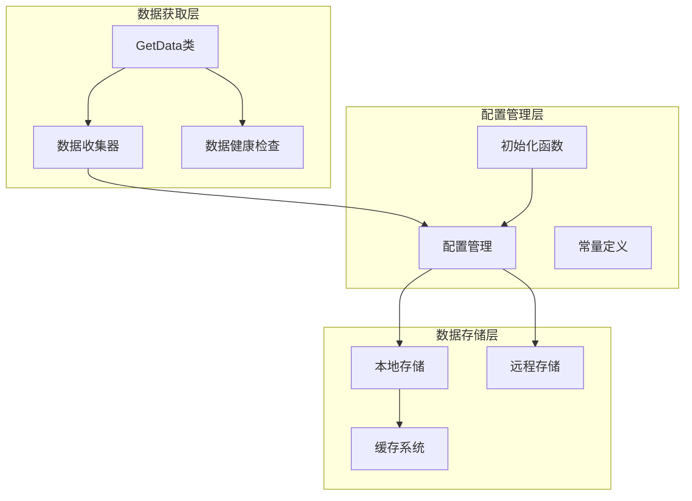
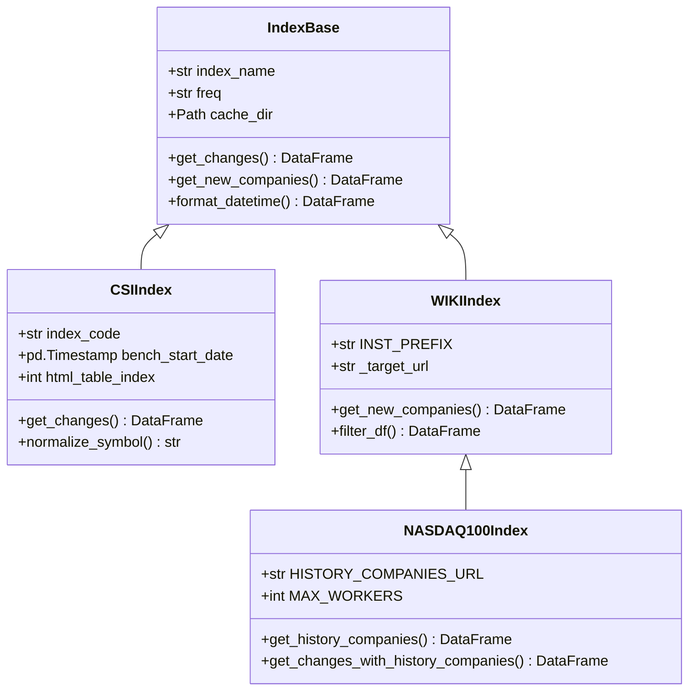
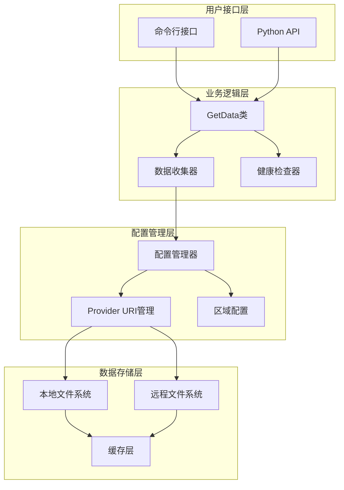
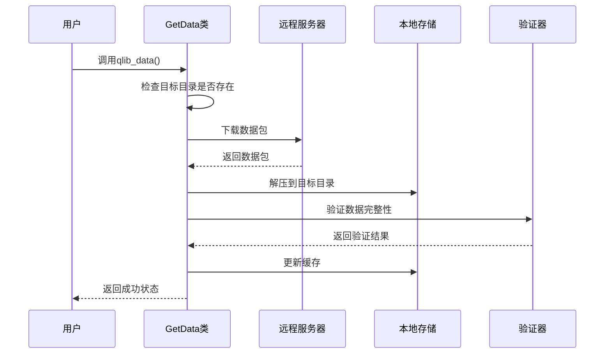
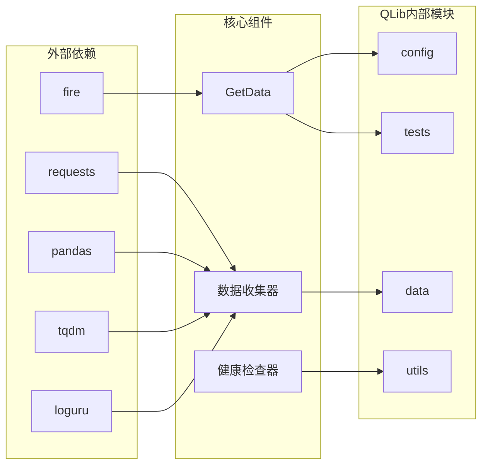

# 数据获取与初始化

<cite>
**本文档中引用的文件**
- [scripts/get_data.py](file://scripts/get_data.py)
- [scripts/data_collector/cn_index/collector.py](file://scripts/data_collector/cn_index/collector.py)
- [scripts/data_collector/us_index/collector.py](file://scripts/data_collector/us_index/collector.py)
- [scripts/check_data_health.py](file://scripts/check_data_health.py)
- [scripts/README.md](file://scripts/README.md)
- [qlib/config.py](file://qlib/config.py)
- [qlib/__init__.py](file://qlib/__init__.py)
- [qlib/constant.py](file://qlib/constant.py)
- [qlib/tests/data.py](file://qlib/tests/data.py)
- [tests/test_get_data.py](file://tests/test_get_data.py)
</cite>

## 目录
1. [简介](#简介)
2. [项目结构概览](#项目结构概览)
3. [核心组件分析](#核心组件分析)
4. [架构概览](#架构概览)
5. [详细组件分析](#详细组件分析)
6. [依赖关系分析](#依赖关系分析)
7. [性能考虑](#性能考虑)
8. [故障排除指南](#故障排除指南)
9. [结论](#结论)

## 简介

QLib的数据获取与初始化系统是一个完整的金融数据处理框架，专门设计用于支持量化投资研究。该系统提供了多种数据源的统一接口，包括中国（cn）、美国（us）等不同市场的股票数据，支持1分钟（1min）、5分钟（5min）、日线（1d）等多种时间频率的数据下载。

本文档详细介绍了如何使用`scripts/get_data.py`脚本下载和初始化市场数据，解释了provider_uri的配置方法和`qlib.init()`在数据源初始化中的作用，并提供了不同区域和指数的数据获取参数配置示例。

## 项目结构概览

QLib的数据获取系统采用模块化设计，主要包含以下关键组件：



**图表来源**
- [scripts/get_data.py](file://scripts/get_data.py#L1-L10)
- [qlib/config.py](file://qlib/config.py#L1-L50)
- [qlib/__init__.py](file://qlib/__init__.py#L1-L50)

**章节来源**
- [scripts/README.md](file://scripts/README.md#L1-L77)
- [qlib/config.py](file://qlib/config.py#L133-L165)

## 核心组件分析

### GetData类

`GetData`类是QLib数据获取的核心入口点，提供了完整的数据下载和管理功能：

```python
class GetData:
    REMOTE_URL = "https://github.com/SunsetWolf/qlib_dataset/releases/download"

    def __init__(self, delete_zip_file=False):
        self.delete_zip_file = delete_zip_file

    def qlib_data(
        self,
        name="qlib_data",
        target_dir="~/.qlib/qlib_data/cn_data",
        version=None,
        interval="1d",
        region="cn",
        delete_old=True,
        exists_skip=False,
    ):
```

该类的主要功能包括：
- **远程数据下载**：从GitHub Releases或其他远程源下载数据包
- **本地数据管理**：自动解压、验证和组织本地数据文件
- **版本控制**：支持数据版本管理和回滚
- **完整性检查**：内置数据完整性验证机制

**章节来源**
- [qlib/tests/data.py](file://qlib/tests/data.py#L17-L210)

### 数据收集器架构

QLib支持多种数据收集器，每种都针对特定的市场和指数类型：



**图表来源**
- [scripts/data_collector/cn_index/collector.py](file://scripts/data_collector/cn_index/collector.py#L40-L100)
- [scripts/data_collector/us_index/collector.py](file://scripts/data_collector/us_index/collector.py#L30-L80)

**章节来源**
- [scripts/data_collector/cn_index/collector.py](file://scripts/data_collector/cn_index/collector.py#L1-L199)
- [scripts/data_collector/us_index/collector.py](file://scripts/data_collector/us_index/collector.py#L1-L199)

## 架构概览

QLib的数据获取与初始化架构采用分层设计，确保了系统的可扩展性和维护性：



**图表来源**
- [scripts/get_data.py](file://scripts/get_data.py#L1-L10)
- [qlib/__init__.py](file://qlib/__init__.py#L20-L80)
- [qlib/config.py](file://qlib/config.py#L287-L337)

## 详细组件分析

### 数据获取流程

数据获取过程遵循严格的流程控制，确保数据的完整性和一致性：



**图表来源**
- [qlib/tests/data.py](file://qlib/tests/data.py#L170-L210)
- [scripts/get_data.py](file://scripts/get_data.py#L1-L10)

### Provider URI配置

`provider_uri`是QLib初始化的关键配置项，决定了数据的存储位置和访问方式：

```python
# 单一频率配置
provider_uri = "~/.qlib/qlib_data/cn_data"

# 多频率配置
provider_uri = {
    "day": "~/.qlib/qlib_data/cn_data",
    "1min": "~/.qlib/qlib_data/cn_data_1min"
}

# 初始化QLib
qlib.init(
    provider_uri=provider_uri,
    region=REG_CN,
    expression_cache=None,
    dataset_cache=None,
)
```

**章节来源**
- [qlib/__init__.py](file://qlib/__init__.py#L20-L80)
- [qlib/config.py](file://qlib/config.py#L133-L165)

### 区域和指数配置

QLib支持多种区域和指数的数据获取，每种都有特定的配置参数：

#### 中国市场配置

```python
# 中国A股数据
provider_uri = "~/.qlib/qlib_data/cn_data"
qlib.init(
    provider_uri=provider_uri,
    region=REG_CN,
)

# 支持的指数类型
# - 中证300: csi300
# - 中证500: csi500  
# - 上证50: hs300
```

#### 美国市场配置

```python
# 美国股市数据
provider_uri = "~/.qlib/qlib_data/us_data"
qlib.init(
    provider_uri=provider_uri,
    region=REG_US,
)

# 支持的指数类型
# - 标普500: SP500
# - 纳斯达克100: NASDAQ100
# - 罗素1000: Russell1000
```

**章节来源**
- [qlib/constant.py](file://qlib/constant.py#L1-L22)
- [scripts/README.md](file://scripts/README.md#L10-L40)

### 数据健康检查

`check_data_health.py`提供了全面的数据质量检查功能：

```python
class DataHealthChecker:
    def __init__(
        self,
        csv_path=None,
        qlib_dir=None,
        freq="day",
        large_step_threshold_price=0.5,
        large_step_threshold_volume=3,
        missing_data_num=0,
    ):
```

主要检查功能：
- **缺失数据检测**：检查OHLCV列是否完整
- **异常值检测**：识别价格和成交量的异常跳变
- **因子数据检查**：验证因子数据的完整性和有效性
- **数据格式验证**：确保数据格式符合预期

**章节来源**
- [scripts/check_data_health.py](file://scripts/check_data_health.py#L1-L199)

## 依赖关系分析

QLib的数据获取系统具有清晰的依赖关系结构：



**图表来源**
- [scripts/get_data.py](file://scripts/get_data.py#L1-L10)
- [scripts/data_collector/cn_index/collector.py](file://scripts/data_collector/cn_index/collector.py#L1-L20)

**章节来源**
- [qlib/config.py](file://qlib/config.py#L1-L50)
- [qlib/__init__.py](file://qlib/__init__.py#L1-L50)

## 性能考虑

### 并发处理

QLib的数据收集器支持并发处理以提高效率：

```python
# 并发工作线程数配置
MAX_WORKERS = 16

# 使用线程池执行并发请求
with ThreadPoolExecutor(max_workers=self.MAX_WORKERS) as executor:
    for _trading_date, _df in zip(
        self.calendar_list, 
        executor.map(self._request_history_companies, self.calendar_list)
    ):
        # 处理每个交易日的数据
```

### 缓存策略

QLib实现了多层缓存机制来优化性能：

- **内存缓存**：短期频繁访问的数据
- **磁盘缓存**：长期存储的数据文件
- **表达式缓存**：计算结果缓存
- **数据集缓存**：预处理后的数据集

### 内存管理

```python
# 内存缓存配置
"mem_cache_size_limit": 500,
"mem_cache_limit_type": "length",
"mem_cache_expire": 60 * 60,  # 1小时过期
```

## 故障排除指南

### 常见问题及解决方案

#### 1. 数据下载失败

**问题症状**：下载过程中出现网络错误或超时

**解决方案**：
```bash
# 增加重试次数和等待时间
python get_data.py qlib_data \
    --target_dir ~/.qlib/qlib_data/cn_data \
    --region cn \
    --interval 1d \
    --request_retry 10 \
    --retry_sleep 5
```

#### 2. Provider URI配置错误

**问题症状**：QLib初始化失败，提示路径不存在

**解决方案**：
```python
# 检查路径是否存在
import os
from pathlib import Path

target_dir = Path("~/.qlib/qlib_data/cn_data").expanduser()
if not target_dir.exists():
    print(f"路径不存在: {target_dir}")
    # 手动创建目录
    target_dir.mkdir(parents=True, exist_ok=True)
```

#### 3. 数据完整性问题

**问题症状**：数据健康检查发现缺失或异常数据

**解决方案**：
```bash
# 运行数据健康检查
python check_data_health.py \
    --qlib_dir ~/.qlib/qlib_data/cn_data \
    --freq day
```

#### 4. 内存不足

**问题症状**：处理大量数据时出现内存溢出

**解决方案**：
```python
# 减少内存缓存大小
qlib.init(
    provider_uri=provider_uri,
    region=REG_CN,
    mem_cache_size_limit=100,  # 减少到100MB
    maxtasksperchild=1,  # 每个进程处理1个任务
)
```

**章节来源**
- [scripts/check_data_health.py](file://scripts/check_data_health.py#L100-L204)
- [qlib/config.py](file://qlib/config.py#L133-L165)

## 结论

QLib的数据获取与初始化系统提供了一个完整、灵活且高性能的金融数据处理框架。通过模块化的架构设计，它能够支持多种市场和指数的数据获取需求，同时提供了完善的错误处理和性能优化机制。

主要优势包括：
- **统一的数据接口**：支持多种数据源和格式
- **灵活的配置选项**：适应不同的使用场景
- **强大的健康检查**：确保数据质量和系统稳定性
- **高效的并发处理**：提升大数据量下的处理速度
- **完善的错误处理**：提供详细的诊断信息和恢复建议

通过合理配置和使用这些工具，用户可以轻松构建高质量的量化投资研究环境，为后续的模型训练和策略开发奠定坚实的基础。