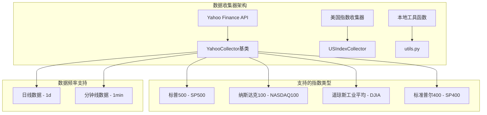
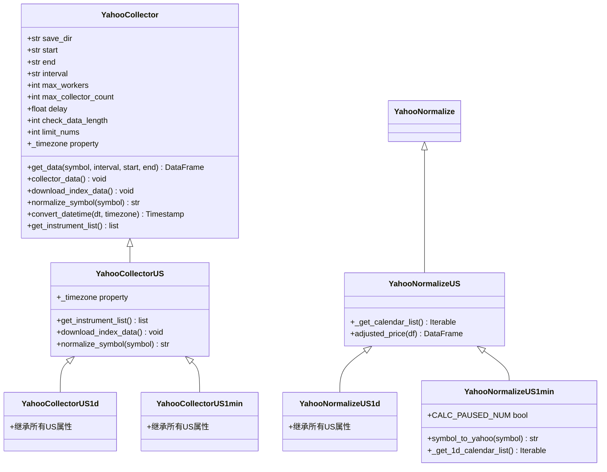
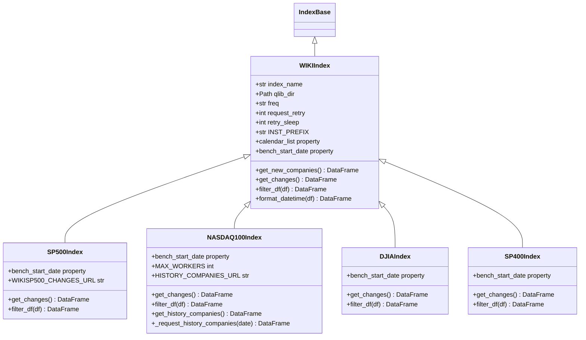
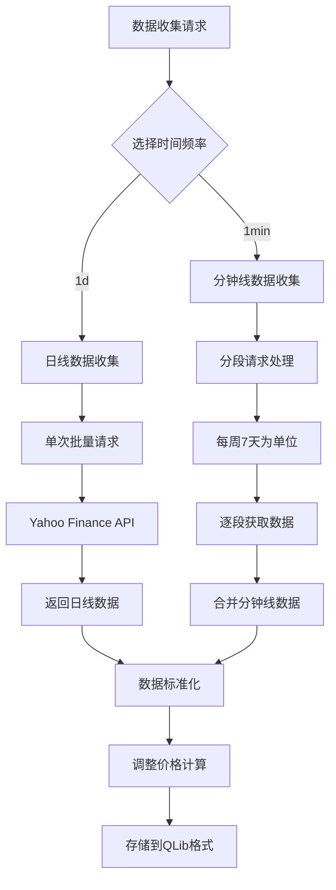
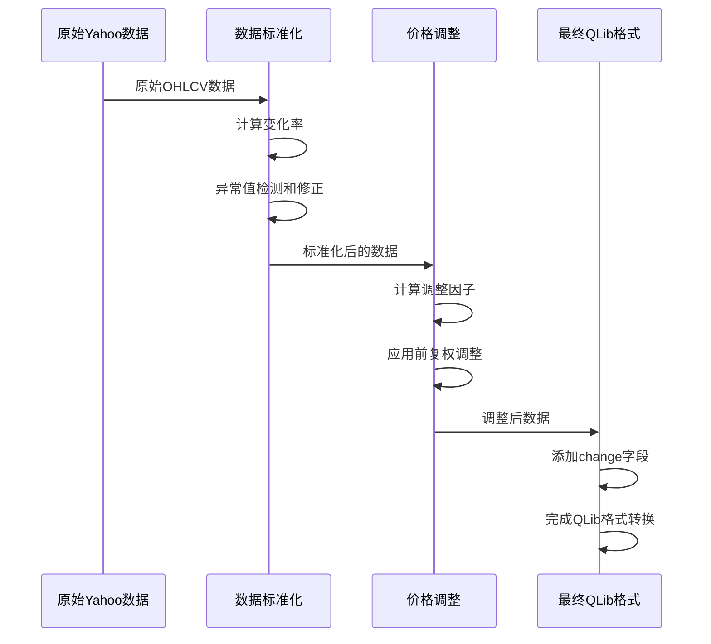
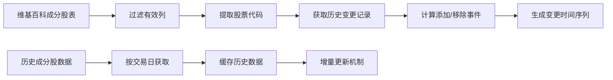
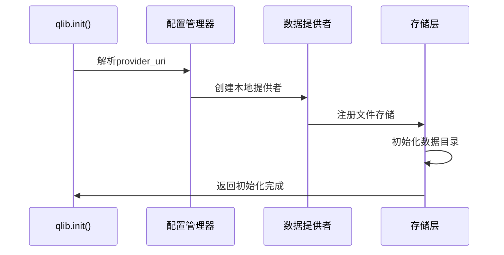
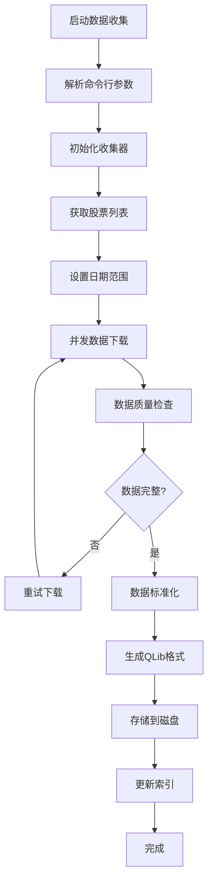
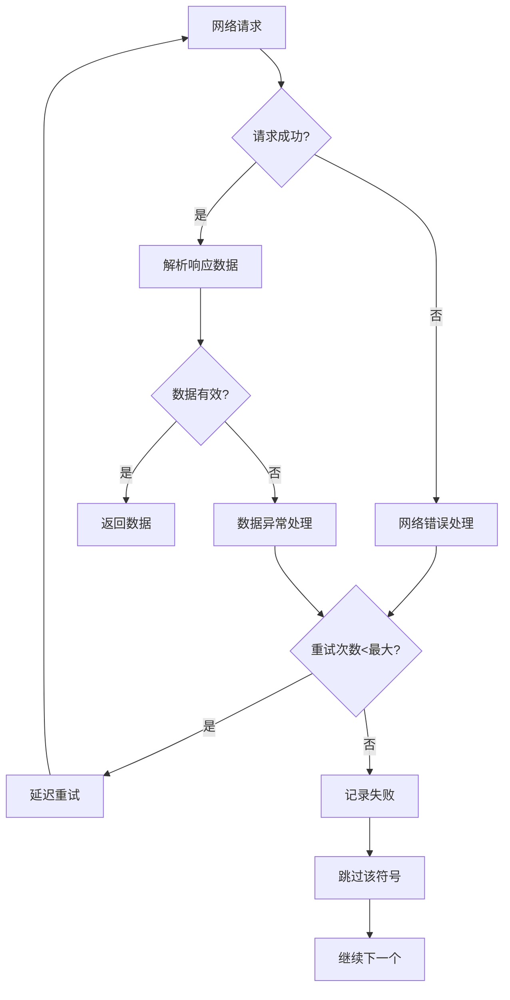

# 美国市场数据获取完整指南

<cite>
**本文档中引用的文件**
- [scripts/data_collector/yahoo/collector.py](file://scripts/data_collector/yahoo/collector.py)
- [scripts/data_collector/us_index/collector.py](file://scripts/data_collector/us_index/collector.py)
- [scripts/data_collector/us_index/README.md](file://scripts/data_collector/us_index/README.md)
- [scripts/data_collector/yahoo/README.md](file://scripts/data_collector/yahoo/README.md)
- [scripts/get_data.py](file://scripts/get_data.py)
- [qlib/tests/data.py](file://qlib/tests/data.py)
- [qlib/config.py](file://qlib/config.py)
- [scripts/data_collector/utils.py](file://scripts/data_collector/utils.py)
- [examples/benchmarks/LightGBM/workflow_config_lightgbm_Alpha158.yaml](file://examples/benchmarks/LightGBM/workflow_config_lightgbm_Alpha158.yaml)
</cite>

## 目录
1. [简介](#简介)
2. [项目结构概览](#项目结构概览)
3. [核心组件分析](#核心组件分析)
4. [Yahoo Finance API 数据收集](#yahoo-finance-api-数据收集)
5. [美国指数数据收集](#美国指数数据收集)
6. [数据配置与初始化](#数据配置与初始化)
7. [自动化数据下载流程](#自动化数据下载流程)
8. [性能优化与异常处理](#性能优化与异常处理)
9. [故障排除指南](#故障排除指南)
10. [总结](#总结)

## 简介

QLib是一个量化研究平台，提供了完整的美国金融市场数据获取解决方案。本指南详细介绍了如何通过Yahoo Finance API和us_index收集器获取标普500、纳斯达克100、道琼斯工业平均指数等主要美国市场的金融数据。我们将深入探讨数据收集器的架构设计、支持的资产类型、时间频率配置以及与QLib框架的集成方法。

## 项目结构概览

QLib的数据收集系统采用模块化设计，主要包含以下关键组件：



**图表来源**
- [scripts/data_collector/yahoo/collector.py](file://scripts/data_collector/yahoo/collector.py#L254-L312)
- [scripts/data_collector/us_index/collector.py](file://scripts/data_collector/us_index/collector.py#L1-L50)

## 核心组件分析

### Yahoo Finance 收集器架构

Yahoo Finance收集器采用面向对象的设计模式，支持多种地区和时间频率的数据收集：



**图表来源**
- [scripts/data_collector/yahoo/collector.py](file://scripts/data_collector/yahoo/collector.py#L254-L312)
- [scripts/data_collector/yahoo/collector.py](file://scripts/data_collector/yahoo/collector.py#L314-L400)

### 美国指数收集器架构

美国指数收集器专门用于从维基百科获取成分股信息：



**图表来源**
- [scripts/data_collector/us_index/collector.py](file://scripts/data_collector/us_index/collector.py#L25-L100)
- [scripts/data_collector/us_index/collector.py](file://scripts/data_collector/us_index/collector.py#L100-L200)

**章节来源**
- [scripts/data_collector/yahoo/collector.py](file://scripts/data_collector/yahoo/collector.py#L254-L400)
- [scripts/data_collector/us_index/collector.py](file://scripts/data_collector/us_index/collector.py#L25-L200)

## Yahoo Finance API 数据收集

### 支持的资产类型

Yahoo Finance收集器支持多种类型的金融资产：

1. **股票证券 (Stocks)**：包括美国上市公司股票
2. **交易所交易基金 (ETFs)**：各种主题和策略的ETF产品
3. **指数基金 (Indices)**：如^GSPC（标普500）、^NDX（纳斯达克100）、^DJI（道琼斯）

### 时间频率配置

Yahoo Finance收集器支持两种主要的时间频率：



**图表来源**
- [scripts/data_collector/yahoo/collector.py](file://scripts/data_collector/yahoo/collector.py#L150-L200)

### 数据收集参数配置

Yahoo Finance收集器提供了丰富的配置选项：

```python
# 基本参数配置
collector = YahooCollector(
    save_dir="/path/to/save",
    start="2020-01-01",
    end="2020-12-31",
    interval="1d",  # 或 "1min"
    max_workers=4,
    max_collector_count=2,
    delay=0.5,
    check_data_length=252,  # 日线数据检查长度
    limit_nums=None  # 调试用限制数量
)
```

### 数据标准化流程

Yahoo Finance收集器实现了复杂的数据标准化流程：



**图表来源**
- [scripts/data_collector/yahoo/collector.py](file://scripts/data_collector/yahoo/collector.py#L600-L700)

**章节来源**
- [scripts/data_collector/yahoo/collector.py](file://scripts/data_collector/yahoo/collector.py#L40-L150)
- [scripts/data_collector/yahoo/README.md](file://scripts/data_collector/yahoo/README.md#L57-L158)

## 美国指数数据收集

### 指数类型支持

美国指数收集器支持四种主要的美国市场指数：

1. **标普500指数 (SP500)**：包含500家大型美国上市公司
2. **纳斯达克100指数 (NASDAQ100)**：包含100家纳斯达克上市公司
3. **道琼斯工业平均指数 (DJIA)**：包含30家蓝筹股公司
4. **标准普尔400指数 (SP400)**：小型股指数

### 维基百科数据源

美国指数收集器从维基百科获取成分股信息：

```python
# 维基百科索引名称映射
WIKI_INDEX_NAME_MAP = {
    "NASDAQ100": "NASDAQ-100",
    "SP500": "List_of_S%26P_500_companies",
    "SP400": "List_of_S%26P_400_companies",
    "DJIA": "Dow_Jones_Industrial_Average",
}
```

### 成分股历史变更追踪

对于SP500指数，系统能够追踪成分股的历史变更：



**图表来源**
- [scripts/data_collector/us_index/collector.py](file://scripts/data_collector/us_index/collector.py#L150-L200)

**章节来源**
- [scripts/data_collector/us_index/collector.py](file://scripts/data_collector/us_index/collector.py#L25-L150)
- [scripts/data_collector/us_index/README.md](file://scripts/data_collector/us_index/README.md#L8-L22)

## 数据配置与初始化

### provider_uri 配置

在QLib中，数据路径通过provider_uri进行配置：

```python
# 单一频率配置
qlib.init(
    provider_uri="~/.qlib/qlib_data/us_data",
    region="us",
    expression_cache=None,
    dataset_cache=None
)

# 多频率配置
qlib.init(
    provider_uri={
        "day": "~/.qlib/qlib_data/us_data",
        "1min": "~/.qlib/qlib_data/us_data_1min"
    },
    region="us",
    expression_cache=None,
    dataset_cache=None
)
```

### QLib 初始化集成

QLib的初始化过程会自动注册数据提供者：



**图表来源**
- [qlib/config.py](file://qlib/config.py#L133-L165)

### 数据验证与健康检查

QLib提供了数据完整性检查功能：

```python
# 检查数据完整性
from scripts.check_data_health import check_data_health

check_data_health(
    qlib_dir="~/.qlib/qlib_data/us_data",
    freq="day",
    verbose=True
)
```

**章节来源**
- [qlib/config.py](file://qlib/config.py#L133-L165)
- [qlib/tests/data.py](file://qlib/tests/data.py#L150-L200)

## 自动化数据下载流程

### get_data.py 脚本使用

QLib提供了便捷的命令行工具来下载和初始化数据：

```bash
# 下载美国市场数据
python scripts/get_data.py qlib_data \
    --name qlib_data \
    --target_dir ~/.qlib/qlib_data/us_data \
    --interval 1d \
    --region us

# 下载分钟线数据
python scripts/get_data.py qlib_data \
    --name qlib_data \
    --target_dir ~/.qlib/qlib_data/us_data_1min \
    --interval 1min \
    --region us
```

### 数据收集工作流

完整的数据收集工作流程包括以下步骤：



**图表来源**
- [scripts/get_data.py](file://scripts/get_data.py#L1-L10)

### 分步执行模式

用户可以分步骤执行数据收集过程：

```bash
# 1. 下载原始数据
python scripts/data_collector/yahoo/collector.py download_data \
    --source_dir ~/.qlib/stock_data/source/us_data \
    --start 2020-01-01 \
    --end 2020-12-31 \
    --delay 1 \
    --interval 1d \
    --region US

# 2. 标准化数据
python scripts/data_collector/yahoo/collector.py normalize_data \
    --source_dir ~/.qlib/stock_data/source/us_data \
    --normalize_dir ~/.qlib/stock_data/normalized/us_data \
    --region US \
    --interval 1d

# 3. 转换为QLib二进制格式
python scripts/dump_bin.py dump_all \
    --data_path ~/.qlib/stock_data/normalized/us_data \
    --qlib_dir ~/.qlib/qlib_data/us_data \
    --freq day \
    --exclude_fields date,symbol \
    --file_suffix .csv
```

**章节来源**
- [scripts/get_data.py](file://scripts/get_data.py#L1-L10)
- [scripts/data_collector/yahoo/README.md](file://scripts/data_collector/yahoo/README.md#L57-L158)

## 性能优化与异常处理

### 并发控制策略

Yahoo Finance收集器实现了智能的并发控制：

```python
# 并发工作线程配置
class YahooCollector:
    def __init__(self, max_workers=4, ...):
        self.max_workers = max_workers
        
    def collector_data(self):
        with ThreadPoolExecutor(max_workers=self.max_workers) as executor:
            futures = []
            for symbol in self.get_instrument_list():
                futures.append(executor.submit(self.get_data, symbol, ...))
            
            for future in as_completed(futures):
                try:
                    result = future.result()
                    # 处理成功结果
                except Exception as e:
                    # 处理异常
                    pass
```

### 网络异常处理

Yahoo Finance收集器实现了多层异常处理机制：



**图表来源**
- [scripts/data_collector/yahoo/collector.py](file://scripts/data_collector/yahoo/collector.py#L100-L150)

### 缓存机制

为了提高性能，系统实现了多级缓存：

1. **符号缓存**：缓存股票列表，避免重复网络请求
2. **历史数据缓存**：缓存指数成分股历史数据
3. **中间结果缓存**：缓存标准化过程中的中间结果

### 内存优化

对于大规模数据收集，系统采用了内存友好的处理策略：

```python
# 分块处理大数据集
def process_large_dataset(self, data_chunks):
    for chunk in data_chunks:
        # 处理每个数据块
        processed_chunk = self.process_chunk(chunk)
        # 渐进式写入磁盘
        self.write_to_disk(processed_chunk)
        # 及时释放内存
        del processed_chunk
```

**章节来源**
- [scripts/data_collector/yahoo/collector.py](file://scripts/data_collector/yahoo/collector.py#L100-L200)

## 故障排除指南

### 常见问题诊断

1. **网络连接问题**
   - 检查防火墙设置
   - 验证Yahoo Finance API可访问性
   - 使用代理服务器（如果需要）

2. **数据质量问题**
   - 检查数据完整性
   - 验证时间序列连续性
   - 对比不同数据源

3. **性能问题**
   - 调整并发线程数
   - 优化磁盘I/O性能
   - 监控内存使用情况

### 调试模式

启用调试模式获取详细日志：

```bash
# 设置环境变量启用调试
export LOGURU_LEVEL=DEBUG
python scripts/data_collector/yahoo/collector.py download_data --debug

# 或直接在代码中启用
import logging
logging.getLogger('qlib').setLevel(logging.DEBUG)
```

### 数据验证工具

QLib提供了内置的数据验证工具：

```python
# 检查数据完整性
from scripts.check_data_health import check_data_health

# 检查特定时间段的数据
health_report = check_data_health(
    qlib_dir="~/.qlib/qlib_data/us_data",
    start_date="2020-01-01",
    end_date="2020-12-31",
    freq="day"
)

print(f"数据完整性评分: {health_report['score']}")
print(f"缺失数据天数: {health_report['missing_days']}")
```

**章节来源**
- [scripts/data_collector/yahoo/collector.py](file://scripts/data_collector/yahoo/collector.py#L100-L150)

## 总结

QLib的美国市场数据获取系统提供了完整而强大的解决方案，支持：

1. **多样化的数据源**：Yahoo Finance API和维基百科
2. **全面的资产覆盖**：股票、ETF、指数等多种金融产品
3. **灵活的时间频率**：支持日线和分钟线数据
4. **高质量的数据处理**：标准化、异常检测、价格调整
5. **高效的性能优化**：并发控制、缓存机制、内存优化
6. **完善的错误处理**：多层异常处理、重试机制、数据验证

通过合理配置和使用这些工具，用户可以高效地获取和处理美国市场的金融数据，为量化研究和投资决策提供可靠的数据基础。