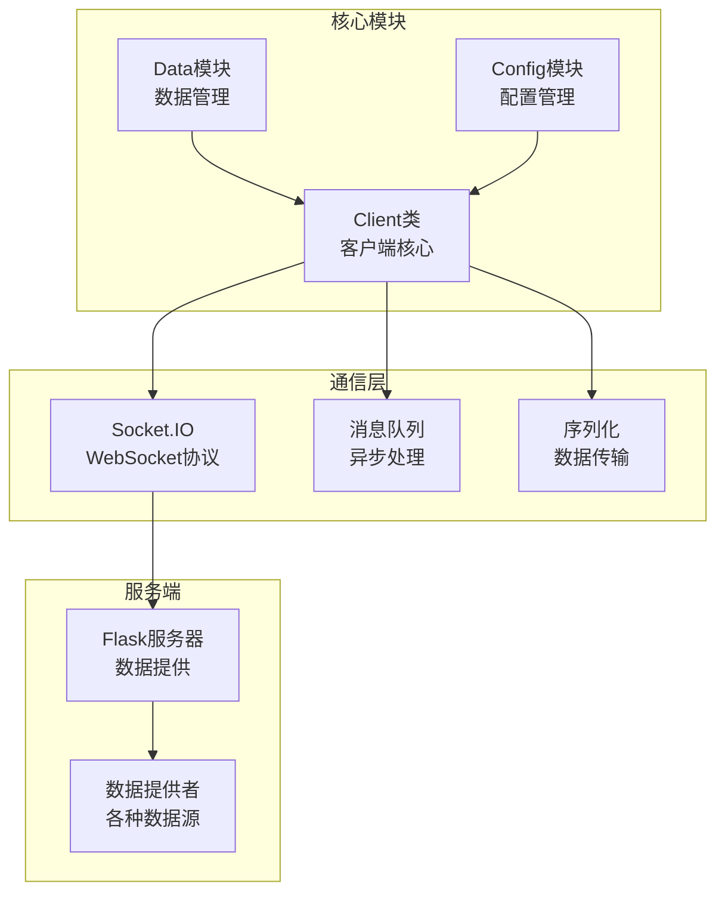
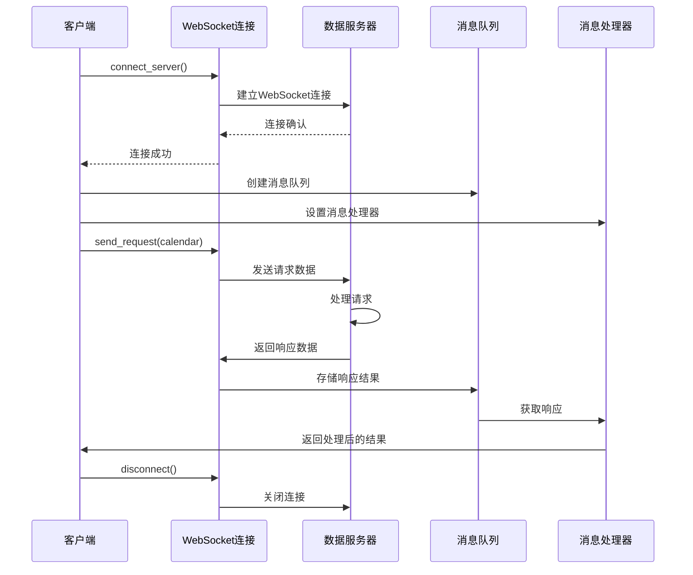
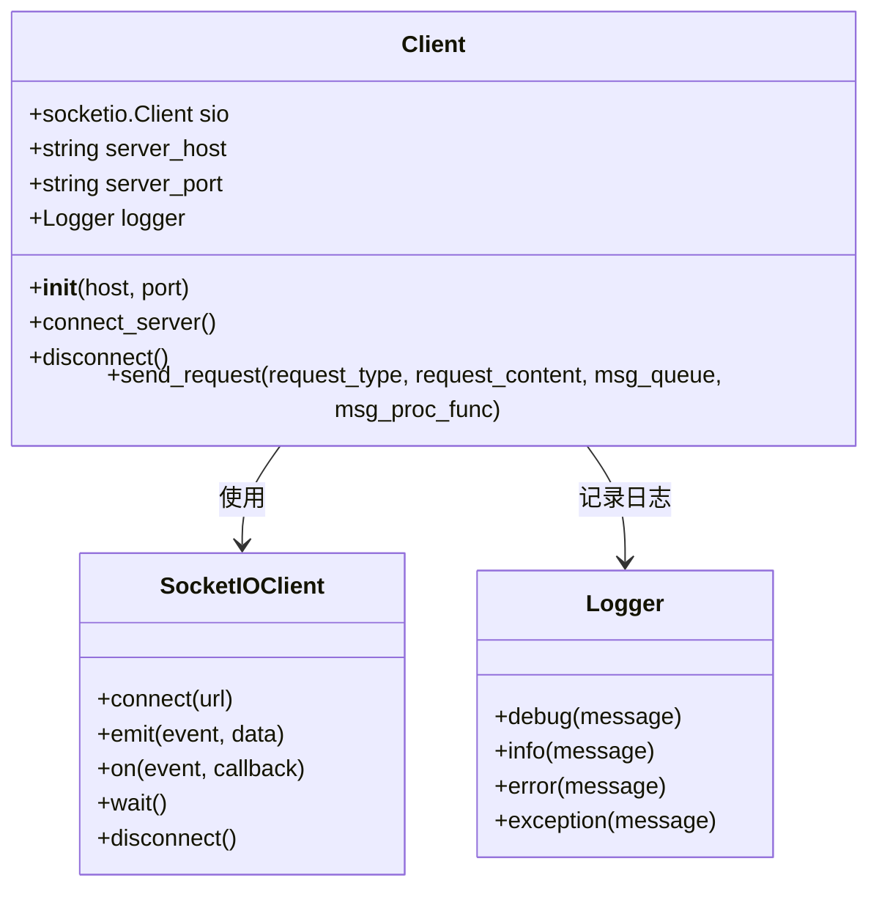
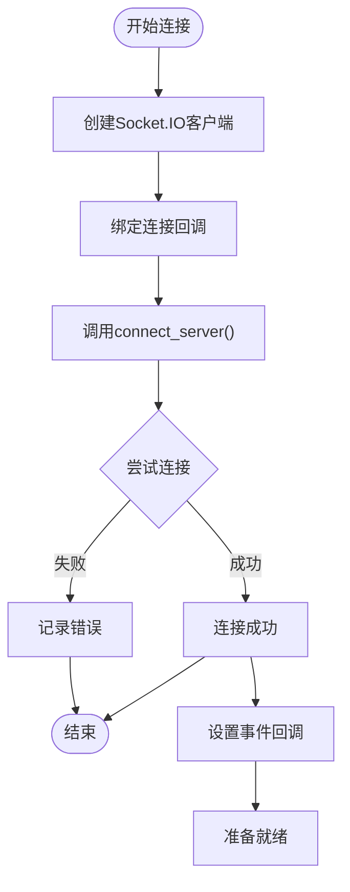
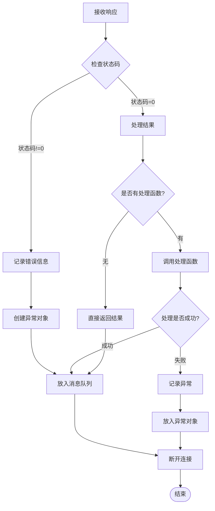
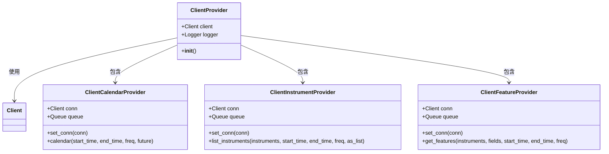
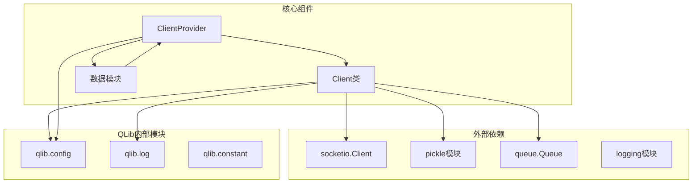

# 客户端-服务器通信接口

<cite>
**本文档引用的文件**
- [client.py](file://qlib/data/client.py)
- [data.py](file://qlib/data/data.py)
- [config.py](file://qlib/config.py)
- [__init__.py](file://qlib/__init__.py)
- [workflow_by_code.py](file://examples/workflow_by_code.py)
</cite>

## 目录
1. [简介](#简介)
2. [项目结构](#项目结构)
3. [核心组件](#核心组件)
4. [架构概览](#架构概览)
5. [详细组件分析](#详细组件分析)
6. [依赖关系分析](#依赖关系分析)
7. [性能考虑](#性能考虑)
8. [故障排除指南](#故障排除指南)
9. [结论](#结论)

## 简介

QLib的客户端-服务器通信接口是一个基于WebSocket的分布式数据访问系统，为量化金融研究提供了高效的数据获取和处理能力。该系统的核心是`Client`类，它通过Socket.IO协议与远程数据服务器建立连接，支持日历数据、仪器信息和特征数据的异步请求-响应模式。

该接口设计用于解决传统单机数据处理的局限性，允许用户在本地环境中通过网络访问远程服务器上的大规模金融数据集，同时保持高性能和可靠性。

## 项目结构

QLib的客户端-服务器通信接口主要分布在以下关键文件中：



**图表来源**
- [client.py](file://qlib/data/client.py#L1-L104)
- [data.py](file://qlib/data/data.py#L1200-L1264)

**章节来源**
- [client.py](file://qlib/data/client.py#L1-L104)
- [data.py](file://qlib/data/data.py#L1200-L1264)

## 核心组件

### Client类

`Client`类是整个通信系统的核心，负责管理与远程数据服务器的WebSocket连接和数据请求。

```python
class Client:
    """客户端类
    
    为ClientProvider提供连接工具函数。
    """
    
    def __init__(self, host, port):
        super(Client, self).__init__()
        self.sio = socketio.Client()
        self.server_host = host
        self.server_port = port
        self.logger = get_module_logger(self.__class__.__name__)
```

### 连接管理

客户端提供了完整的连接生命周期管理：

- **connect_server()**: 建立WebSocket连接
- **disconnect()**: 断开连接并清理资源
- **send_request()**: 发送请求并处理响应

### 消息处理机制

系统采用异步消息处理模式，通过消息队列和回调函数实现非阻塞的数据传输：

```python
def send_request(self, request_type, request_content, msg_queue, msg_proc_func=None):
    """发送特定请求到服务器
    
    参数:
    - request_type: 请求类型 ('calendar'/'instrument'/'feature')
    - request_content: 请求内容字典
    - msg_queue: 传递消息的队列
    - msg_proc_func: 接收响应时处理消息的函数
    """
```

**章节来源**
- [client.py](file://qlib/data/client.py#L15-L104)

## 架构概览

QLib的客户端-服务器通信架构采用了分层设计，确保了系统的可扩展性和维护性：



**图表来源**
- [client.py](file://qlib/data/client.py#L48-L102)

## 详细组件分析

### Client类详细分析

#### 初始化过程



**图表来源**
- [client.py](file://qlib/data/client.py#L15-L30)

#### 连接建立流程



**图表来源**
- [client.py](file://qlib/data/client.py#L32-L40)

#### 请求-响应模式

客户端支持三种类型的请求：

1. **日历请求 (calendar)**: 获取交易日历数据
2. **仪器请求 (instrument)**: 获取股票/基金等金融工具信息
3. **特征请求 (feature)**: 获取计算好的特征数据

每种请求都遵循相同的异步处理模式：

```python
# 特征请求示例
self.conn.send_request(
    request_type="feature",
    request_content={
        "instruments": instruments,
        "fields": fields,
        "start_time": str(start_time),
        "end_time": str(end_time),
        "freq": freq
    },
    msg_queue=self.queue,
    msg_proc_func=lambda response_content: response_content
)
```

#### 序列化机制

为了支持复杂数据类型的传输，系统使用Python的pickle模块进行序列化：

```python
# 序列化请求内容
request_content = {
    "head": head_info, 
    "body": pickle.dumps(request_content, protocol=C.dump_protocol_version)
}
```

这种设计允许传输包含特殊类型（如pd.Timestamp）的数据结构。

#### 错误处理机制

系统实现了完善的错误处理策略：



**图表来源**
- [client.py](file://qlib/data/client.py#L64-L102)

**章节来源**
- [client.py](file://qlib/data/client.py#L15-L104)

### 配置管理系统

#### 配置结构

QLib使用分层配置系统，支持多种部署模式：

```python
# 默认配置结构
_default_config = {
    # 数据提供者配置
    "calendar_provider": "LocalCalendarProvider",
    "instrument_provider": "LocalInstrumentProvider",
    "feature_provider": "LocalFeatureProvider",
    "pit_provider": "LocalPITProvider",
    "expression_provider": "LocalExpressionProvider",
    "dataset_provider": "LocalDatasetProvider",
    "provider": "LocalProvider",
    
    # 服务器配置
    "flask_server": "localhost",
    "flask_port": 8010,
    
    # 缓存配置
    "expression_cache": None,
    "calendar_cache": None,
    
    # 序列化配置
    "dump_protocol_version": PROTOCOL_VERSION,
    
    # 超时配置
    "timeout": 30,
}
```

#### 客户端模式初始化

当以客户端模式启动时，系统会自动配置WebSocket连接参数：

```python
# 客户端模式下的服务器配置
if "flask_server" in C:
    logger.info(f"flask_server={C['flask_server']}, flask_port={C['flask_port']}")
```

**章节来源**
- [config.py](file://qlib/config.py#L100-L150)
- [__init__.py](file://qlib/__init__.py#L76-L77)

### 数据提供者集成

#### ClientProvider架构



**图表来源**
- [data.py](file://qlib/data/data.py#L1200-L1264)

#### 自动连接设置

系统在初始化时会自动为各个数据提供者设置客户端连接：

```python
def __init__(self):
    from .client import Client
    
    self.client = Client(C.flask_server, C.flask_port)
    self.logger = get_module_logger(self.__class__.__name__)
    
    # 自动设置连接
    if is_instance_of_provider(Cal, ClientCalendarProvider):
        Cal.set_conn(self.client)
    if is_instance_of_provider(Inst, ClientInstrumentProvider):
        Inst.set_conn(self.client)
    if hasattr(DatasetD, "provider"):
        DatasetD.provider.set_conn(self.client)
    else:
        DatasetD.set_conn(self.client)
```

**章节来源**
- [data.py](file://qlib/data/data.py#L1238-L1264)

## 依赖关系分析

### 核心依赖图



**图表来源**
- [client.py](file://qlib/data/client.py#L1-L10)
- [data.py](file://qlib/data/data.py#L1238-L1240)

### 模块间交互

系统的模块间交互遵循清晰的职责分离原则：

1. **Client类**: 负责底层的WebSocket通信
2. **ClientProvider**: 提供高级的数据访问接口
3. **数据模块**: 实现具体的业务逻辑
4. **配置模块**: 管理系统配置和参数

**章节来源**
- [client.py](file://qlib/data/client.py#L1-L10)
- [data.py](file://qlib/data/data.py#L1238-L1264)

## 性能考虑

### 连接管理优化

当前实现的一个限制是每次请求都需要建立和断开连接，这可能导致性能瓶颈。系统注释中明确指出：

> BUG: 每次我们为某些数据提出请求时，我们需要连接到服务器，等待响应并断开连接。我们不能在一个连接内进行一系列请求。

这种设计虽然简单可靠，但在高频率请求场景下可能会影响性能。建议的改进方案包括：

1. **连接池**: 维持持久连接池
2. **批量请求**: 支持单个连接内的多个请求
3. **连接复用**: 在同一会话中复用连接

### 序列化性能

系统使用pickle进行数据序列化，这在处理大型DataFrame时可能会成为性能瓶颈。建议：

1. **协议版本优化**: 使用最新的pickle协议版本
2. **压缩传输**: 对大数据包启用压缩
3. **二进制格式**: 考虑使用更高效的二进制序列化格式

### 内存管理

消息队列的设计确保了内存的有效利用：

```python
# 每个数据提供者都有独立的消息队列
self.queue = queue.Queue()
```

这种设计避免了全局状态管理，提高了系统的并发处理能力。

## 故障排除指南

### 常见连接问题

#### 连接超时

**症状**: `ConnectionError` 异常被抛出

**解决方案**:
1. 检查网络连接状态
2. 验证服务器地址和端口配置
3. 确认防火墙设置
4. 检查服务器是否正常运行

```python
try:
    self.sio.connect(f"ws://{self.server_host}:{self.server_port}")
except socketio.exceptions.ConnectionError:
    self.logger.error("无法连接到服务器 - 检查网络或服务器状态")
```

#### 消息处理异常

**症状**: 响应处理过程中出现异常

**解决方案**:
1. 检查消息处理函数的实现
2. 验证响应数据的格式
3. 添加适当的异常处理逻辑

```python
try:
    ret = msg_proc_func(msg["result"])
except Exception as e:
    self.logger.exception("处理消息时出错。")
    ret = e
```

### 配置问题诊断

#### 服务器配置错误

**症状**: 客户端无法找到服务器

**诊断步骤**:
1. 检查 `C.flask_server` 和 `C.flask_port` 配置
2. 验证服务器配置文件
3. 确认服务器进程正在运行

#### 数据格式不匹配

**症状**: 响应数据解析失败

**解决方案**:
1. 检查pickle序列化版本兼容性
2. 验证请求和响应的数据结构
3. 更新客户端和服务器的版本

**章节来源**
- [client.py](file://qlib/data/client.py#L32-L40)
- [client.py](file://qlib/data/client.py#L85-L95)

## 结论

QLib的客户端-服务器通信接口提供了一个强大而灵活的数据访问解决方案。通过WebSocket协议和异步消息处理机制，系统能够有效地处理大规模金融数据的分布式访问需求。

### 主要优势

1. **简单易用**: 清晰的API设计，易于集成和使用
2. **异步处理**: 支持非阻塞的数据请求和响应
3. **类型安全**: 完善的错误处理和异常管理
4. **可扩展性**: 模块化设计支持功能扩展

### 改进建议

1. **连接优化**: 实现连接池和批量请求支持
2. **性能提升**: 优化序列化和传输效率
3. **监控增强**: 添加详细的连接和性能监控
4. **文档完善**: 提供更多的使用示例和最佳实践

该接口为量化金融研究提供了坚实的基础，支持研究人员在分布式环境中高效地获取和处理金融数据。随着系统的持续发展，这些改进将进一步提升其性能和可用性。