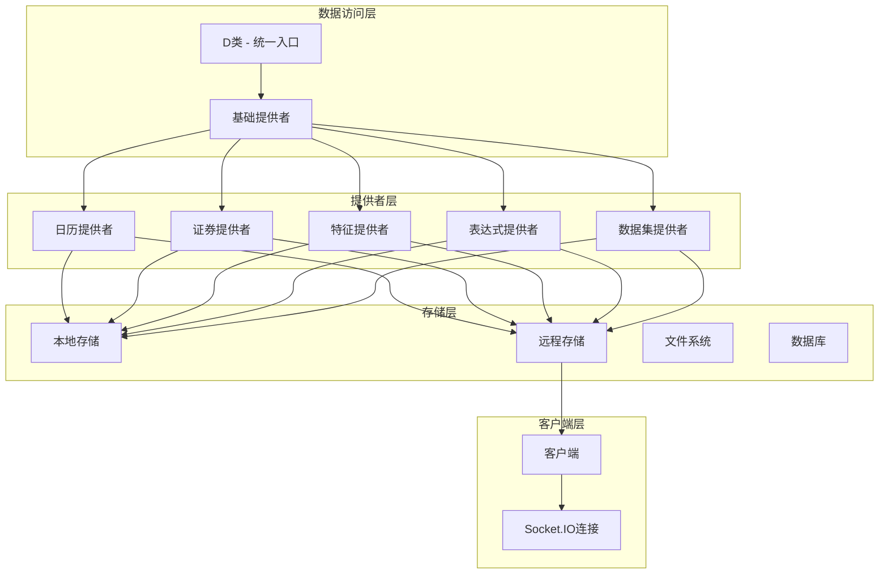
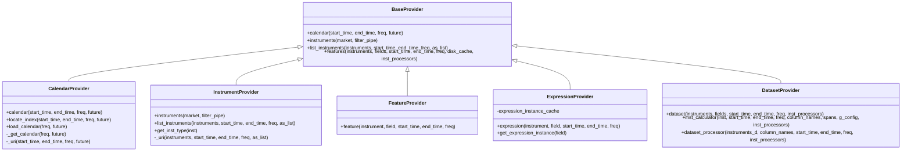
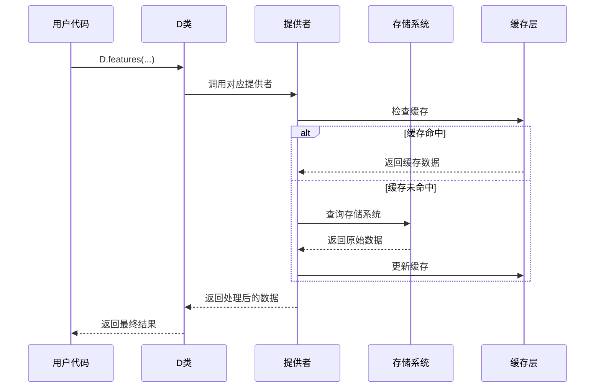
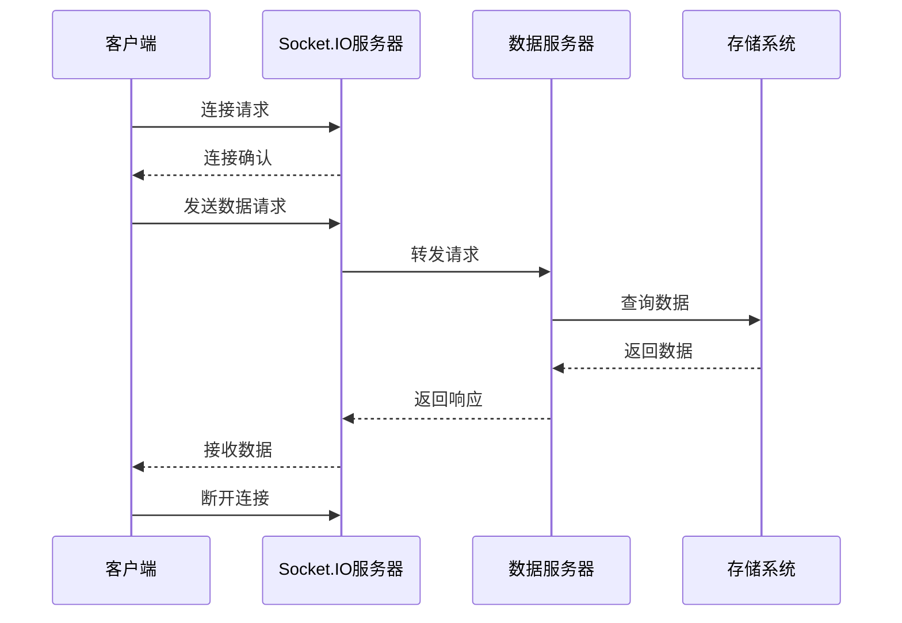
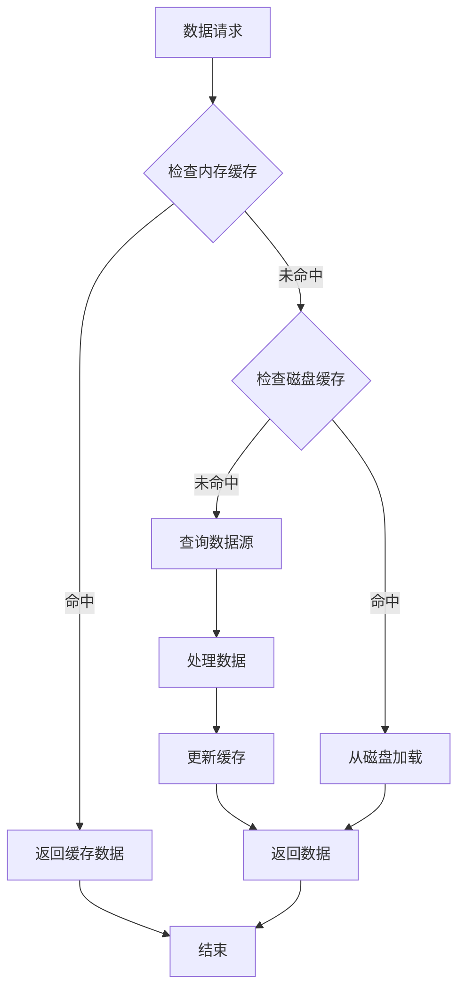
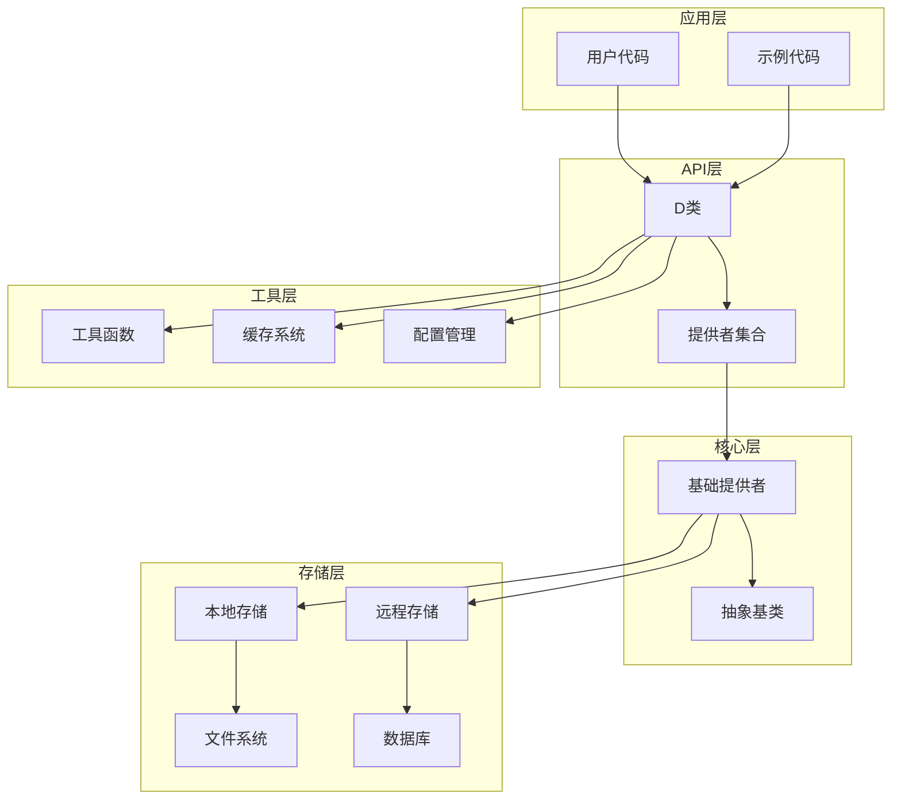

基于我对QLib项目的深入分析，现在我将创建一个关于数据访问API的完整文档。

<docs>
# 数据访问API

<cite>
**本文档中引用的文件**
- [qlib/data/data.py](file://qlib/data/data.py)
- [qlib/data/client.py](file://qlib/data/client.py)
- [qlib/data/__init__.py](file://qlib/data/__init__.py)
- [examples/data_demo/data_cache_demo.py](file://examples/data_demo/data_cache_demo.py)
- [examples/data_demo/data_mem_resuse_demo.py](file://examples/data_demo/data_mem_resuse_demo.py)
- [tests/storage_tests/test_storage.py](file://tests/storage_tests/test_storage.py)
- [qlib/config.py](file://qlib/config.py)
- [qlib/utils/exceptions.py](file://qlib/utils/exceptions.py)
</cite>

## 目录
1. [简介](#简介)
2. [项目结构](#项目结构)
3. [核心组件](#核心组件)
4. [架构概览](#架构概览)
5. [详细组件分析](#详细组件分析)
6. [依赖关系分析](#依赖关系分析)
7. [性能考虑](#性能考虑)
8. [故障排除指南](#故障排除指南)
9. [结论](#结论)

## 简介

QLib的数据访问API是一个高度模块化和可扩展的数据访问框架，为量化研究提供了统一的数据接口。该API的核心是D类，它封装了多个提供者（Provider）来处理不同的数据类型：日历数据（Calendar）、证券信息（Instruments）、特征数据（Features）和表达式数据（Expressions）。

该API支持两种主要的工作模式：
- **本地模式**：直接从本地存储系统读取数据
- **客户端模式**：通过网络连接到远程服务器获取数据

## 项目结构

QLib的数据访问API采用分层架构设计，主要包含以下核心模块：



**图表来源**
- [qlib/data/data.py](file://qlib/data/data.py#L1-L100)
- [qlib/data/client.py](file://qlib/data/client.py#L1-L50)

**章节来源**
- [qlib/data/__init__.py](file://qlib/data/__init__.py#L1-L65)
- [qlib/data/data.py](file://qlib/data/data.py#L1-L50)

## 核心组件

### D类 - 统一数据访问入口

D类是整个数据访问API的核心，它提供了统一的接口来访问不同类型的数据。D类继承自BaseProvider，包含了所有必要的数据访问方法。

```python
# 基本使用示例
from qlib.data import D

# 获取日历数据
calendar = D.calendar(start_time="2020-01-01", end_time="2020-12-31", freq="day")

# 获取证券列表
instruments = D.instruments(market="csi300")

# 获取特征数据
features = D.features(
    instruments=["SH600000", "SH600001"],
    fields=["$close", "$volume"],
    start_time="2020-01-01",
    end_time="2020-12-31"
)
```

### 提供者架构

QLib采用了抽象工厂模式来管理不同类型的数据提供者：



**图表来源**
- [qlib/data/data.py](file://qlib/data/data.py#L50-L200)
- [qlib/data/data.py](file://qlib/data/data.py#L200-L400)

**章节来源**
- [qlib/data/data.py](file://qlib/data/data.py#L1100-L1333)

## 架构概览

QLib的数据访问API采用了多层架构设计，支持本地和远程两种工作模式：



**图表来源**
- [qlib/data/data.py](file://qlib/data/data.py#L1100-L1200)
- [qlib/data/cache.py](file://qlib/data/cache.py#L1-L50)

## 详细组件分析

### D.features() - 特征数据访问

D.features()是最常用的方法之一，用于获取指定证券的特征数据。它支持多种数据源和缓存策略。

#### 方法签名
```python
def features(
    self,
    instruments,
    fields,
    start_time=None,
    end_time=None,
    freq="day",
    disk_cache=None,
    inst_processors=[]
):
```

#### 参数详解

- **instruments**: 可以是证券代码列表、市场名称或过滤器配置字典
- **fields**: 特征字段列表，支持表达式语法
- **start_time/end_time**: 时间范围限制
- **freq**: 数据频率（day/minute等）
- **disk_cache**: 缓存策略（0:跳过, 1:使用, 2:替换）
- **inst_processors**: 每个证券的数据处理器

#### 使用示例

```python
# 基本用法
features = D.features(
    instruments=["SH600000", "SH600001"],
    fields=["$close", "$volume", "$high/$low"],
    start_time="2020-01-01",
    end_time="2020-12-31"
)

# 使用表达式
features = D.features(
    instruments="csi300",
    fields=["$close", "$volume", "$close-Ref($close, 5)"],
    start_time="2020-01-01"
)

# 自定义缓存策略
features = D.features(
    instruments=["SH600000"],
    fields=["$close"],
    disk_cache=1  # 使用磁盘缓存
)
```

### D.instruments() - 证券信息获取

D.instruments()用于获取符合特定条件的证券列表，支持复杂的过滤器链。

#### 方法签名
```python
@staticmethod
def instruments(market: Union[List, str] = "all", filter_pipe: Union[List, None] = None):
```

#### 过滤器系统

QLib提供了强大的过滤器系统，支持多种类型的动态过滤：

```python
# 市场过滤
instruments = D.instruments(market="csi300")

# 复合过滤器
filters = [
    {
        "filter_type": "ExpressionDFilter",
        "rule_expression": "$open < 40",
        "filter_start_time": None,
        "filter_end_time": None,
        "keep": False
    },
    {
        "filter_type": "NameDFilter",
        "name_rule_re": "SH[0-9]{4}55",
        "filter_start_time": None,
        "filter_end_time": None
    }
]
filtered_instruments = D.instruments(market="all", filter_pipe=filters)
```

### D.calendar() - 日历数据访问

D.calendar()提供交易日历数据，支持不同频率和未来日期的查询。

#### 方法签名
```python
def calendar(self, start_time=None, end_time=None, freq="day", future=False):
```

#### 高级功能

```python
# 基本日历查询
calendar = D.calendar(start_time="2020-01-01", end_time="2020-12-31")

# 不同频率
weekly_calendar = D.calendar(freq="week")
monthly_calendar = D.calendar(freq="month")

# 包含未来交易日
future_calendar = D.calendar(future=True)

# 精确索引定位
start_time, end_time, start_index, end_index = Cal.locate_index(
    "2020-01-01", "2020-12-31", freq="day", future=False
)
```

**章节来源**
- [qlib/data/data.py](file://qlib/data/data.py#L1100-L1200)
- [qlib/data/data.py](file://qlib/data/data.py#L200-L300)

### 客户端-服务器架构

当使用客户端模式时，数据访问通过Socket.IO协议进行网络通信：



**图表来源**
- [qlib/data/client.py](file://qlib/data/client.py#L20-L80)

#### 客户端配置

```python
# 初始化客户端
from qlib.data import D, ClientProvider
from qlib.config import C

# 设置客户端提供者
C.provider = ClientProvider
C.flask_server = "localhost"
C.flask_port = 8010

# 连接到服务器
D.features(["SH600000"], ["$close"], "2020-01-01", "2020-12-31")
```

**章节来源**
- [qlib/data/client.py](file://qlib/data/client.py#L1-L104)

### 缓存机制

QLib实现了多层次的缓存机制来提高数据访问性能：



**图表来源**
- [qlib/data/cache.py](file://qlib/data/cache.py#L1-L50)

#### 缓存策略

```python
# 缓存配置示例
from qlib.config import C

# 启用磁盘缓存
C.default_disk_cache = 1

# 自定义缓存行为
features = D.features(
    instruments=["SH600000"],
    fields=["$close"],
    disk_cache=2  # 强制重新生成缓存
)
```

**章节来源**
- [qlib/data/data.py](file://qlib/data/data.py#L1200-L1333)

## 依赖关系分析

QLib的数据访问API具有清晰的依赖层次结构：



**图表来源**
- [qlib/data/__init__.py](file://qlib/data/__init__.py#L1-L65)
- [qlib/data/data.py](file://qlib/data/data.py#L1-L100)

**章节来源**
- [qlib/data/__init__.py](file://qlib/data/__init__.py#L1-L65)

## 性能考虑

### 并发访问控制

QLib的数据访问API支持多进程并行处理，通过joblib库实现：

```python
# 并行数据处理
from qlib.utils.paral import ParallelExt

# 自动调整工作进程数
workers = max(min(C.get_kernels(freq), len(instruments_d)), 1)

# 并行计算
results = ParallelExt(
    n_jobs=workers,
    backend=C.joblib_backend,
    maxtasksperchild=C.maxtasksperchild
)(task_l)
```

### 内存优化

```python
# 内存友好的数据处理
def inst_calculator(inst, start_time, end_time, freq, column_names, spans=None, g_config=None, inst_processors=[]):
    # 逐列计算，及时释放内存
    obj = dict()
    for field in column_names:
        obj[field] = ExpressionD.expression(inst, field, start_time, end_time, freq)
    
    data = pd.DataFrame(obj)
    # 及时清理临时对象
    del obj
    return data
```

### 网络优化

对于客户端模式，QLib实现了智能的连接管理和超时处理：

```python
# 连接池和重试机制
def send_request(self, request_type, request_content, msg_queue, msg_proc_func=None):
    self.connect_server()
    request_content = {"head": head_info, "body": pickle.dumps(request_content, protocol=C.dump_protocol_version)}
    self.sio.emit(request_type + "_request", request_content)
    self.sio.wait()
```

## 故障排除指南

### 常