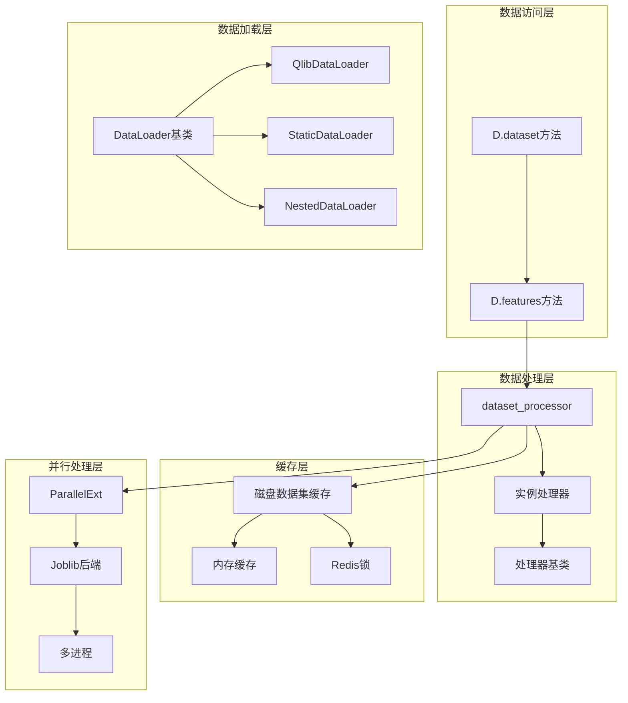
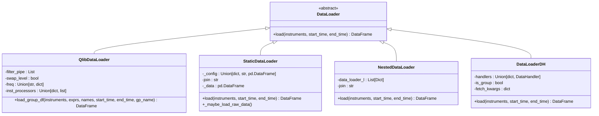
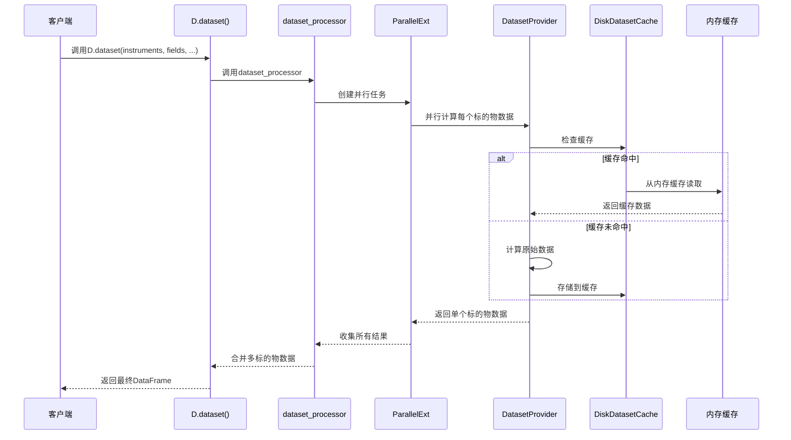
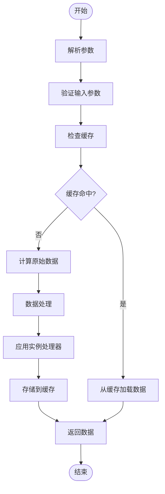
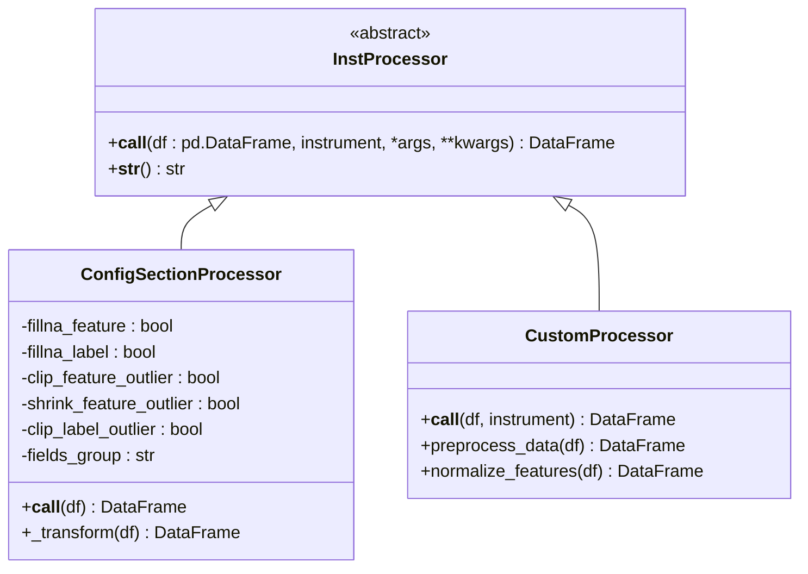
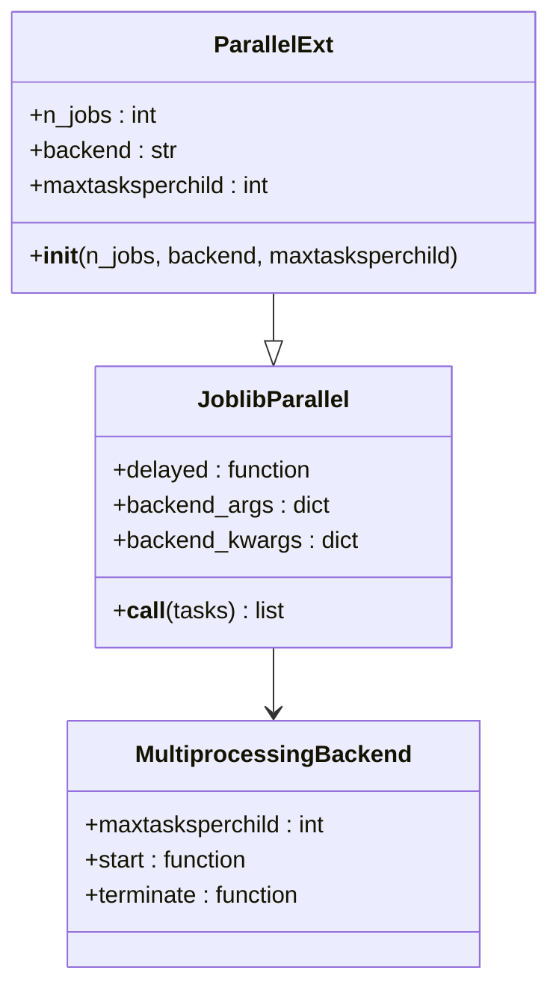
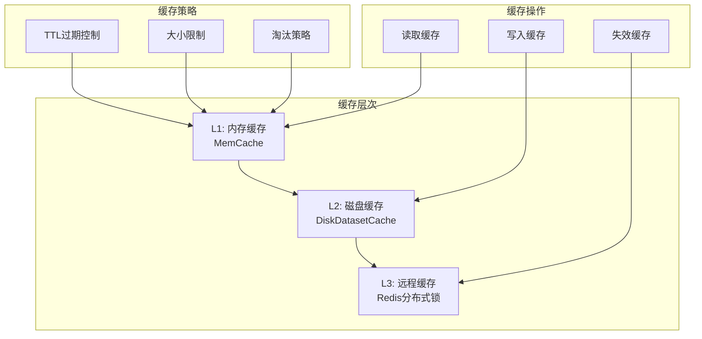
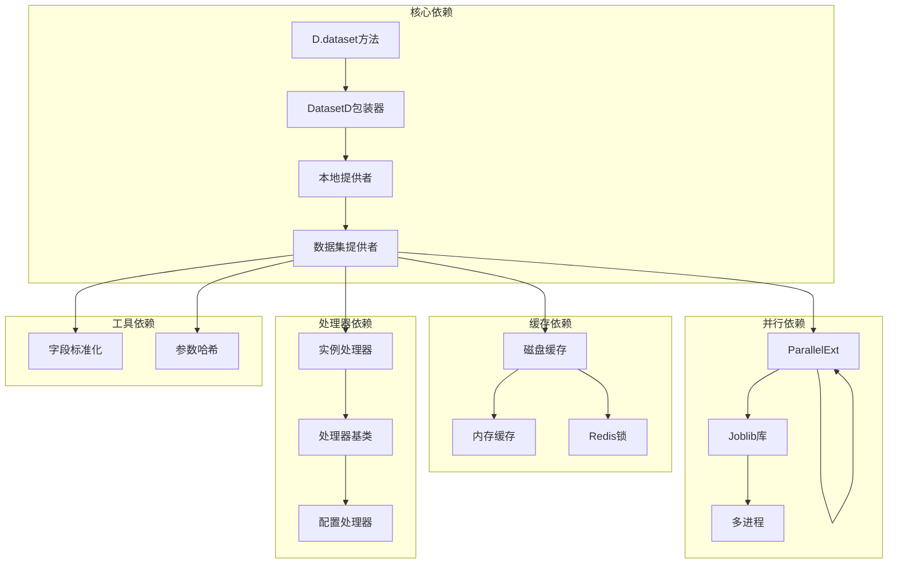

# 数据集访问接口

<cite>
**本文档中引用的文件**
- [data.py](file://qlib/data/data.py)
- [loader.py](file://qlib/data/dataset/loader.py)
- [inst_processor.py](file://qlib/data/inst_processor.py)
- [processor.py](file://qlib/contrib/data/processor.py)
- [cache.py](file://qlib/data/cache.py)
- [paral.py](file://qlib/utils/paral.py)
- [handler.py](file://qlib/data/dataset/handler.py)
- [__init__.py](file://qlib/data/dataset/__init__.py)
</cite>

## 目录
1. [简介](#简介)
2. [项目结构](#项目结构)
3. [核心组件](#核心组件)
4. [架构概览](#架构概览)
5. [详细组件分析](#详细组件分析)
6. [依赖关系分析](#依赖关系分析)
7. [性能考虑](#性能考虑)
8. [故障排除指南](#故障排除指南)
9. [结论](#结论)

## 简介

QLib的数据集访问接口是一个高度优化的数据加载系统，专门设计用于金融时间序列数据的高效获取和处理。该系统的核心是`D.dataset()`方法，它提供了灵活而强大的数据访问能力，支持多标的物、多特征的数据集构建，并具备完善的缓存机制和并行处理能力。

本文档详细介绍了数据集访问接口的设计原理、实现细节和使用方法，重点说明了如何通过`instruments`、`fields`、`start_time`、`end_time`、`freq`和`inst_processors`参数获取多标的物多特征的数据集，以及数据集的多进程加载机制和`ParallelExt`的使用。

## 项目结构

QLib的数据集访问接口采用分层架构设计，主要包含以下核心模块：



**图表来源**
- [data.py](file://qlib/data/data.py#L541-L578)
- [loader.py](file://qlib/data/dataset/loader.py#L1-L415)
- [cache.py](file://qlib/data/cache.py#L1-L1199)

## 核心组件

### D.dataset()方法

`D.dataset()`方法是整个数据集访问接口的核心入口点，它负责协调各个子系统的协作，实现高效的数据加载和处理。

```python
@staticmethod
def dataset_processor(instruments_d, column_names, start_time, end_time, freq, inst_processors=[]):
    """
    Load and process the data, return the data set.
    - default using multi-kernel method.
    """
    normalize_column_names = normalize_cache_fields(column_names)
    # One process for one task, so that the memory will be freed quicker.
    workers = max(min(C.get_kernels(freq), len(instruments_d)), 1)

    # create iterator
    if isinstance(instruments_d, dict):
        it = instruments_d.items()
    else:
        it = zip(instruments_d, [None] * len(instruments_d))

    inst_l = []
    task_l = []
    for inst, spans in it:
        inst_l.append(inst)
        task_l.append(
            delayed(DatasetProvider.inst_calculator)(
                inst, start_time, end_time, freq, normalize_column_names, spans, C, inst_processors
            )
        )

    data = dict(
        zip(
            inst_l,
            ParallelExt(n_jobs=workers, backend=C.joblib_backend, maxtasksperchild=C.maxtasksperchild)(task_l),
        )
    )
```

### 数据加载器层次结构

数据加载器采用抽象工厂模式设计，支持多种数据源和加载策略：



**图表来源**
- [loader.py](file://qlib/data/dataset/loader.py#L15-L415)

**章节来源**
- [data.py](file://qlib/data/data.py#L541-L578)
- [loader.py](file://qlib/data/dataset/loader.py#L15-L415)

## 架构概览

QLib的数据集访问接口采用多层架构设计，从上到下分为数据访问层、数据加载层、数据处理层、缓存层和并行处理层。



**图表来源**
- [data.py](file://qlib/data/data.py#L541-L578)
- [cache.py](file://qlib/data/cache.py#L700-L800)

## 详细组件分析

### D.dataset()方法详解

`D.dataset()`方法是整个数据集访问系统的核心，它实现了以下关键功能：

#### 参数配置详解

1. **instruments**: 标的物列表或筛选条件
   - 支持字符串格式（如"all"、"csi300"）
   - 支持字典格式（股票池配置）
   - 支持列表格式（具体标的物列表）

2. **fields**: 特征表达式列表
   - 支持原始特征（如"$close"、"$volume"）
   - 支持计算表达式（如"Ref($close, 1)"、"Mean($close, 3)"）
   - 支持复杂运算（如"$high-$low"）

3. **start_time/end_time**: 时间范围过滤
   - 支持ISO格式日期字符串
   - 支持时间戳对象
   - 支持相对时间表达

4. **freq**: 数据频率
   - 支持日线（"day"）、分钟线（"1min"）
   - 支持自定义频率
   - 支持多频率配置

5. **inst_processors**: 实例处理器列表
   - 支持数据预处理
   - 支持特征工程
   - 支持异常值处理

#### 数据集构建流程



**图表来源**
- [data.py](file://qlib/data/data.py#L541-L578)

### 实例处理器系统

实例处理器是数据预处理的核心组件，允许用户对每个标的物的数据进行自定义处理。

#### 处理器基类设计



**图表来源**
- [inst_processor.py](file://qlib/data/inst_processor.py#L1-L23)
- [processor.py](file://qlib/contrib/data/processor.py#L1-L130)

#### 实例处理器使用示例

```python
# 基本实例处理器配置
processor_config = {
    "class": "ConfigSectionProcessor",
    "module_path": "qlib.contrib.data.processor",
    "kwargs": {
        "fillna_feature": True,
        "fillna_label": True,
        "clip_feature_outlier": True,
        "shrink_feature_outlier": True
    }
}

# 在数据加载时应用处理器
df = D.features(
    instruments=["SH600000", "SH600004"],
    fields=["$close", "$volume", "Ref($close, 1)"],
    start_time="2020-01-01",
    end_time="2020-12-31",
    freq="day",
    inst_processors=[processor_config]
)
```

**章节来源**
- [inst_processor.py](file://qlib/data/inst_processor.py#L1-L23)
- [processor.py](file://qlib/contrib/data/processor.py#L1-L130)

### 并行处理机制

QLib采用了先进的并行处理机制来提高数据加载效率，主要通过`ParallelExt`类实现。

#### ParallelExt设计原理



**图表来源**
- [paral.py](file://qlib/utils/paral.py#L1-L333)

#### 并行处理优势

1. **多核利用**: 自动利用多核CPU资源
2. **内存管理**: 支持`maxtasksperchild`参数控制内存使用
3. **错误隔离**: 单个任务失败不影响其他任务
4. **动态调整**: 根据数据量自动调整工作进程数

```python
# 并行处理配置示例
workers = max(min(C.get_kernels(freq), len(instruments_d)), 1)
data = dict(
    zip(
        inst_l,
        ParallelExt(n_jobs=workers, backend=C.joblib_backend, maxtasksperchild=C.maxtasksperchild)(task_l),
    )
)
```

**章节来源**
- [paral.py](file://qlib/utils/paral.py#L1-L333)
- [data.py](file://qlib/data/data.py#L541-L578)

### 数据缓存机制

QLib实现了多层次的数据缓存机制，包括内存缓存和磁盘缓存，显著提升数据访问性能。

#### 缓存架构设计



**图表来源**
- [cache.py](file://qlib/data/cache.py#L1-L1199)

#### 磁盘数据集缓存

磁盘数据集缓存是QLib缓存系统的核心组件，采用HDF5格式存储数据，支持高效的随机访问。

```python
class DiskDatasetCache(DatasetCache):
    """Prepared cache mechanism for server."""
    
    @staticmethod
    def _uri(instruments, fields, start_time, end_time, freq, disk_cache=1, inst_processors=[], **kwargs):
        return hash_args(*DatasetCache.normalize_uri_args(instruments, fields, freq), disk_cache, inst_processors)
    
    def read_data_from_cache(cls, cache_path: Union[str, Path], start_time, end_time, fields):
        """从磁盘缓存读取数据"""
        im = DiskDatasetCache.IndexManager(cache_path)
        index_data = im.get_index(start_time, end_time)
        
        with pd.HDFStore(cache_path, mode="r") as store:
            if "/{}".format(im.KEY) in store.keys():
                df = store.select(key=im.KEY, start=start, stop=stop)
                df = df.swaplevel("datetime", "instrument").sort_index()
                df = cls.cache_to_origin_data(df, fields)
            else:
                df = pd.DataFrame(columns=fields)
        return df
```

**章节来源**
- [cache.py](file://qlib/data/cache.py#L700-L800)

## 依赖关系分析

QLib数据集访问接口的各个组件之间存在复杂的依赖关系，形成了一个有机的整体。



**图表来源**
- [data.py](file://qlib/data/data.py#L1316-L1331)
- [loader.py](file://qlib/data/dataset/loader.py#L1-L415)

**章节来源**
- [data.py](file://qlib/data/data.py#L1316-L1331)
- [cache.py](file://qlib/data/cache.py#L1-L1199)

## 性能考虑

QLib数据集访问接口在设计时充分考虑了性能优化，采用了多种技术手段提升数据加载和处理效率。

### 内存优化策略

1. **分块加载**: 大数据集采用分块加载策略，避免内存溢出
2. **延迟计算**: 使用`delayed`实现延迟计算，减少内存占用
3. **垃圾回收**: 合理设置`maxtasksperchild`参数，及时释放内存

### 并发优化

1. **CPU亲和性**: 利用多核CPU并行处理
2. **负载均衡**: 动态调整工作进程数
3. **I/O优化**: 异步I/O操作，减少等待时间

### 缓存优化

1. **多级缓存**: L1内存缓存 + L2磁盘缓存
2. **智能预取**: 预测性缓存加载
3. **压缩存储**: 数据压缩减少存储空间

## 故障排除指南

### 常见问题及解决方案

#### 1. 内存不足错误

**症状**: `MemoryError`或系统响应缓慢
**原因**: 数据集过大，内存不足以容纳
**解决方案**:
```python
# 减少并发进程数
C.register(kernels=4)  # 设置为可用CPU核心数的一半

# 分批加载数据
instruments_batch = instruments[:100]  # 只加载前100个标的物
df = D.features(instruments_batch, fields, ...)
```

#### 2. 缓存失效问题

**症状**: 数据加载速度变慢，重复计算
**原因**: 缓存文件损坏或过期
**解决方案**:
```python
# 清除缓存
from qlib.data.cache import DiskDatasetCache
DiskDatasetCache.clear_cache(cache_path)

# 重新生成缓存
df = D.features(instruments, fields, disk_cache=2)  # 强制重新生成
```

#### 3. 并行处理超时

**症状**: 多进程任务长时间无响应
**原因**: 某些标的物数据处理异常
**解决方案**:
```python
# 设置超时时间
from joblib import TimeoutError
try:
    result = ParallelExt(timeout=300)(tasks)  # 5分钟超时
except TimeoutError:
    # 处理超时情况
    pass
```

**章节来源**
- [cache.py](file://qlib/data/cache.py#L700-L800)
- [paral.py](file://qlib/utils/paral.py#L1-L333)

## 结论

QLib的数据集访问接口是一个设计精良、功能强大的数据加载系统。它通过以下关键特性实现了高效的数据访问：

1. **灵活的参数配置**: 支持多种数据源和筛选条件
2. **强大的并行处理**: 利用多核CPU提升处理效率
3. **完善的缓存机制**: 多层次缓存显著提升性能
4. **可扩展的处理器系统**: 支持自定义数据预处理
5. **健壮的错误处理**: 完善的异常处理和恢复机制

通过合理使用这些特性，用户可以构建高效、可靠的数据处理管道，为量化投资研究提供强有力的数据支撑。建议在实际使用中根据具体需求调整缓存策略、并行参数和处理器配置，以获得最佳性能表现。